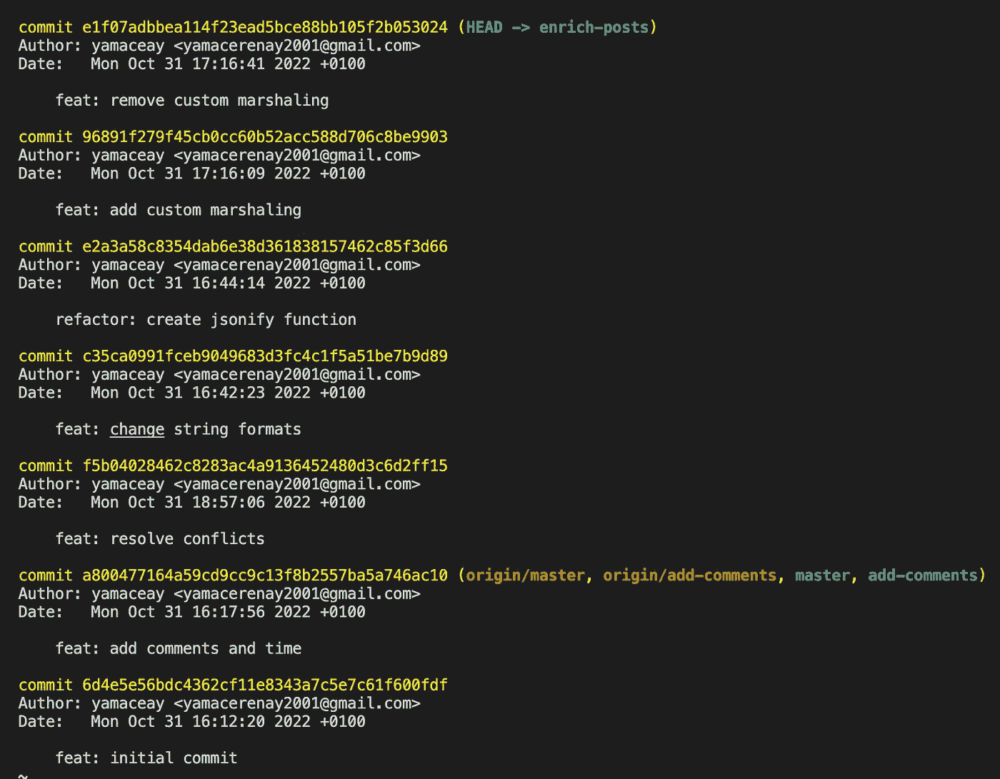
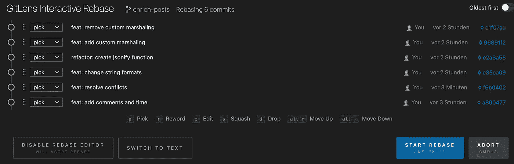
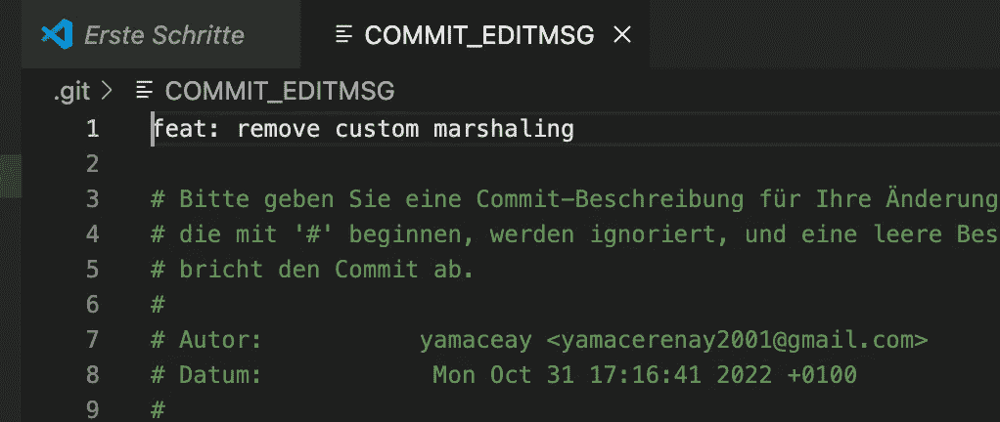
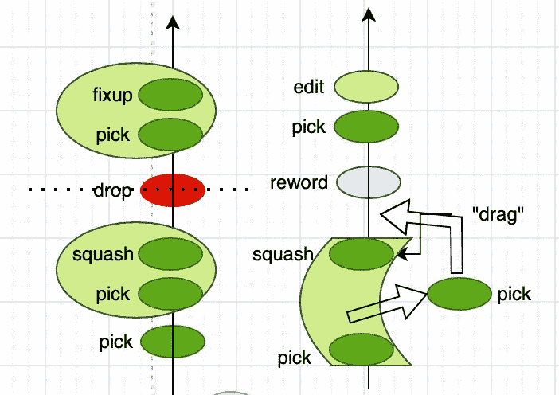
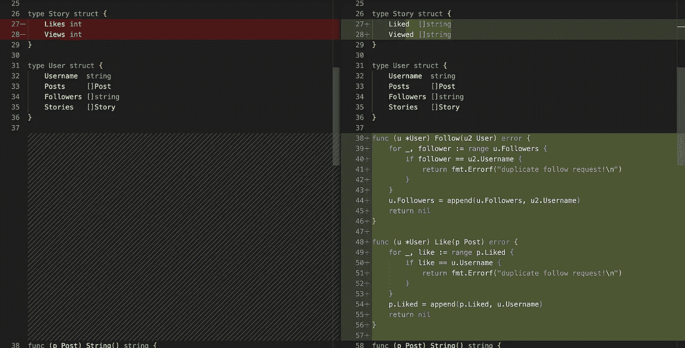
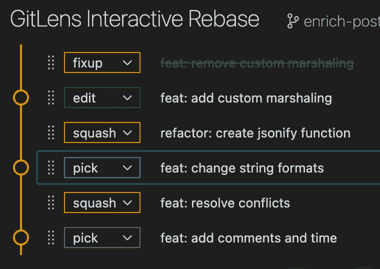
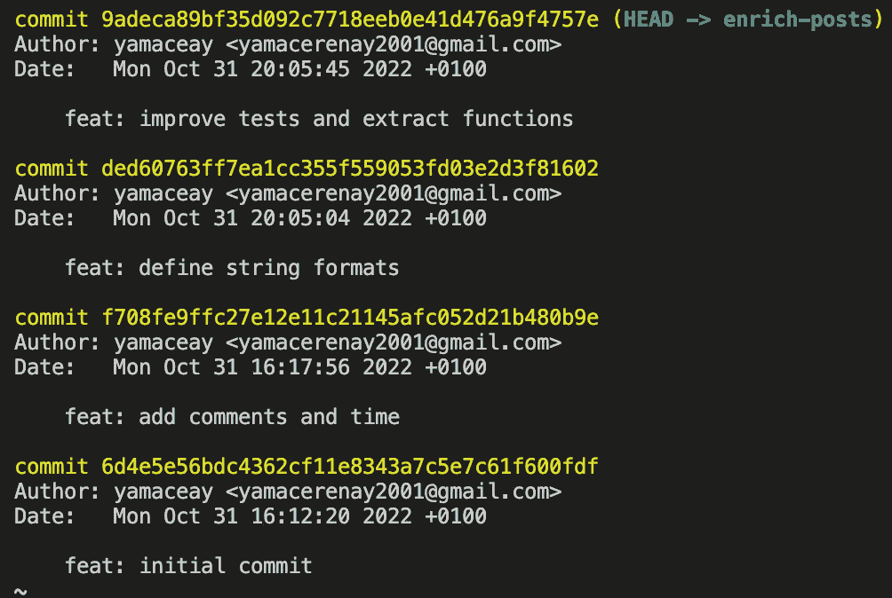

# 如何变得更好— 3

> 原文：<https://blog.devgenius.io/how-to-git-better-3-3ae705d1355e?source=collection_archive---------6----------------------->

…所以在接下来的项目中，你可以成为一个更体面的人:-)

请确保您已经阅读了我以前的文章:

 [## 如何变得更好— 1

### …这样你就能在接下来的项目中成为一个更体面的人:-)

yamaceay.medium.com](https://yamaceay.medium.com/how-to-git-better-1-ef996cb86a23)  [## 如何变得更好— 2

### …所以在接下来的项目中，你可以成为一个更体面的人:-)

yamaceay.medium.com](https://yamaceay.medium.com/how-to-git-better-2-16182a6c0d2e) 

## 重设基础≠将更改应用到分支

我讨厌承认，但我低估了 rebase 一点点。

我们之前已经讨论过分支类似于过程/工作流，所以理解分支是理解其他人在做什么的关键。

最佳实践是保持一个分支简短、可解释、切中要点，就像任何工作流描述一样。

但是你不能真的为每个分支创建一个巨大的提交，那会产生反效果。

相反，您可以在完成分支上的更新后重写历史。

这就是为什么在打开一个拉请求之前，您需要在您的分支上执行交互式 rebase。

## 使用 Visual Studio 代码的交互式基础变更

当您想要以一种时尚的方式编辑提交历史时，交互式的重新基础就很方便了。

为此，您需要在计算机上设置 VSCode。

我创建了一个[样本项目](https://github.com/yamaceay/git-example)用于实验。我故意把代码写得乱七八糟，这样我们可以清理提交历史。让我们看一个例子:

让我们从交互式重新设定基础开始:

1.  克隆存储库:
2.  确保您已经在终端上安装了代码路径(视图->命令面板-> Shell 命令:在 P 中安装' Code '命令…)
3.  确保您位于目标分支“丰富-文章”中。如果没有，使用`git checkout enrich-posts`
4.  输入`git rebase -i HEAD~6``其中 6 是您想要影响的提交数量，`-i`代表交互。
5.  正确配置选项后(参见下一节)，单击 Start Rebase。

## 提交编辑消息

注意:如果您在交互式 rebase 中选择了一个选项，那么至少一个提交消息会受到影响，COMMIT_EDITMSG 文件会在您的侧边选项卡中弹出。在编写了新的提交消息之后，您只需关闭选项卡来应用提交消息。

## 执行标志

`--continue`:应用当前问题的新变化，再次执行 rebase。

`--skip`:忽略当前问题，再次执行 rebase。

`--abort`:中止重设基础，返回重设基础前的原始状态。

`--quit`:在重置过程中，在当前情况下退出重置。

## 提交顺序

您知道可以通过上下拖动提交来改变提交的顺序吗？

听起来可能很酷，但在某些用例中它确实很方便。

例如，如果您想要挤压两个相距很远的类似提交，您可以简单地将提交拖到另一个上，然后挤压它们。

在我看来，改变提交的顺序而不是改变提交消息是一个坏习惯，但是这取决于你。

## 操作类型

*选择*:将提交包含在历史中，默认选项无效。

*drop* :从历史中排除提交，与从提交历史中删除相应的提交消息相同。

*改写*:重写提交消息，不改变内容。

*编辑*:暂停 rebase，编辑代码，准备变更，提交描述性消息，然后继续 rebase。

*挤压*:将所选的和之前的提交挤压到一个新的提交中，并在新的提交消息中使用这两个消息(如果是最后一个提交，则不允许)。

*fixup* :将选中的前一次提交压缩到新的提交中，但新的提交消息中只包含前一次提交的消息(如果是最后一次提交则不允许)。

## 与 Rebase 一起使用的其他命令

`git commit --amend`:相当于提交新的变更作为一个提交，然后对最后两个提交执行交互式 rebase，其中最上面的提交标记为`fixup`。

`git push --force-with-lease`:用于将远程分支的提交历史强制替换为本地分支的提交历史。

我不推荐使用`git push --force`，因为它会让你删除其他人最近提交的内容，而`git push --force-with-lease`不允许你这么做。

这就是为什么`git push --force-with-lease`几乎总是更好的选择。

让我们执行一个示例性的重置基础操作！

## 成功重定基数的一个例子

首先，我想看看变化是什么样的。让我们看看第二次提交(绿色)与第三次提交(红色)有什么不同，第三次提交不仅仅是添加了封送函数。

在这种情况下，这是我想做的:

*   *修正*第一次提交到第二次提交，因为它们做的正好相反。
*   将第二次提交分成两次提交:第二次提交包括实现自定义封送函数，最上面的第一次提交应该包括所有其他内容。我们可以通过暂停提交、重置所有更改和分两部分提交所有更改来做到这一点。
*   *挤压* / *修正*第三次提交到第四次提交上，因为在清理历史的时候写重构提交不一定是个好主意。
*   选择第四个提交，因为这是一个必要且有用的提交。
*   将第五个提交压缩到第六个提交，因为我们不想知道发生了哪些冲突。

最后看起来更好理解。谢谢饭桶！

我希望你喜欢我的文章！

我写这些文章的主要原因是记录我在工作中学到的关于 Git 的东西，以及我自己的经历。我在 24 小时之内写完了这 3 篇文章，以免忘记它们。所以如果你看到有什么不对的地方，提前谢谢你让我知道！

## 来源

[文档— Git-Rebase](https://www.google.com/url?sa=t&rct=j&q=&esrc=s&source=web&cd=&cad=rja&uact=8&ved=2ahUKEwinovWxnYv7AhXGW_EDHZNaBf4QFnoECA0QAQ&url=https%3A%2F%2Fgit-scm.com%2Fdocs%2Fgit-rebase&usg=AOvVaw0pILjN3yKHcTKX5tTP-ctx) 用于双重检查执行标志的使用。

[源代码](https://github.com/yamaceay/git-example) —一个可以用来做实验的 Git 项目示例。

所有的影像都是我捕捉的。