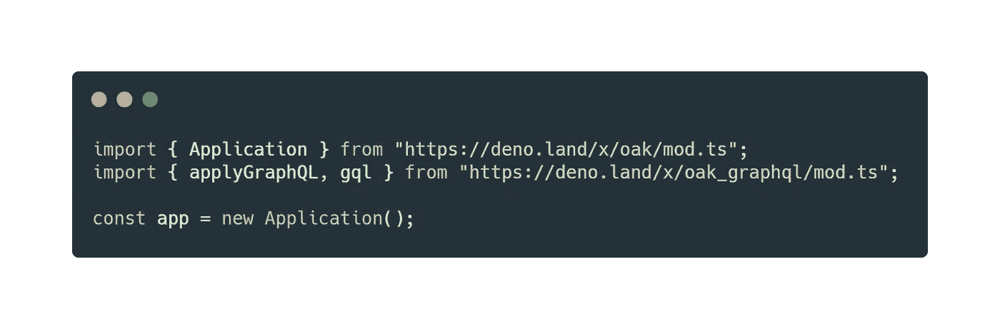

# 如何在 Deno 中绘制 SQL

> 原文：<https://blog.devgenius.io/how-to-graphql-in-deno-e7c1f681ccc0?source=collection_archive---------7----------------------->

2020 年春天，Ryan Dahl 发布了 Deno 1.0.0。发布之后，Deno 在网络社区引起了很大的轰动。那么什么是 Deno 呢？现在回想起来，Deno 正是 Ryan 在构建 Node 时所希望完成。在安全性、包管理和 Typescript 支持等方面都有所改进。

继续讨论文章的主题。Deno 中的 GraphQL。

我们所有的进口来自 Oak，它是 Deno 的一个 web 服务器框架。熟悉 Express in Node 的人使用 Oak 会有宾至如归的感觉。

我们通过使用描述模式的模板字符串调用 gql 函数来创建我们的 GraphQL 模式。该模式指定了一个带有名称和图像的恐龙。请注意，图像只是一个字符串，因为它使用了表情符号。该模式指定了两个查询。一个用于获取所有恐龙，另一个用于搜索特定恐龙。最后，模式指定了添加单个恐龙的突变。

对于本教程，我们将数据保存在一个变量中。因此，重新启动服务器将重置数据。但是对于尝试 Oak 和 GraphQL 来说效果很好。

接下来是实现我们的三个解析器。在我们的解析器中，dino 数组被搜索、返回或扩展。在最后一种情况下，我们不返回数据，而是返回一个布尔值来指示。请参见架构中的 ResolveType。

现在剩下的就是启动我们的服务器。我们首先将我们的模式(类型变量)和解析器传递给 Oaks applyGraphQL 函数，然后从调用中获取 GraphQLService。如示例所示，我们将其传递给 Oak 应用程序实例。

最后，我们开始监听端口 8080 上的 GraphQL POST 请求！

现在，我们可以在端口 8080 上向/graphql 发送有效负载:

就是这样！祝你黑客生涯愉快，欢迎提问或评论。

本确切教程视频:
【https://www.youtube.com/watch?v=Rc_HhL55JZM 

代码:[*https://gist . github . com/danba 340/ce 04651 f8fc 14 BCB 974 FB 4b 940d 95 BDD*](https://gist.github.com/danba340/ce04651f8fc14bcb974fb4b940d95bdd)

推特:[*https://twitter.com/BarelyDaniel*](https://twitter.com/BarelyDaniel)