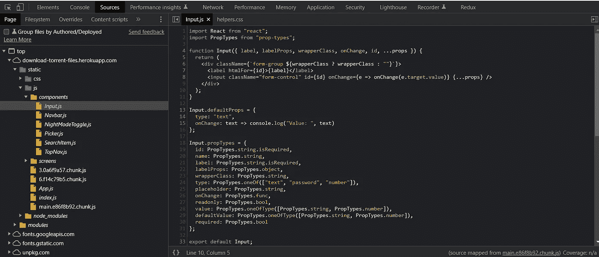
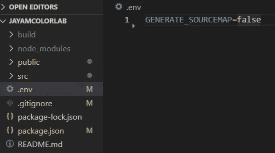
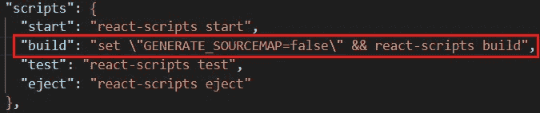
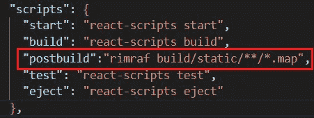

# 如何从开发工具中隐藏 React 中的源代码[3 种不同的方式]

> 原文：<https://blog.devgenius.io/how-to-hide-the-source-code-in-react-from-dev-tools-3-ways-60c8aea1d299?source=collection_archive---------0----------------------->

## 从浏览器中隐藏或保护 React 源代码的 3 种方法


在将代码转移到生产中时，发现 React 应用程序的整个源代码，包括项目结构，都可以在开发工具(inspect) source 选项卡中看到。经过探索，我确定了为什么会发生这种情况，以及隐藏它们的解决方案。



**为什么源代码是可见的？** 创建构建文件以将应用程序部署到生产环境中。在生成构建时，默认情况下，React 应用程序将创建源代码。map”文件，因为 react-script 源映射已启用。这些映射文件将引用我们的源代码。这是生成的 JavaScript 文件和原始源文件之间的映射。在开发阶段，很容易识别原始文件中的错误。您的浏览器将使用“.映射”文件来重建在浏览器中可见的原始源代码。所以为了避免这一点。地图”文件应该被删除。

我们可以删除或避免创建这些地图文件。

*   [**通过。env 文件**](#d894)
*   [**通过 package.json**](#096d)
*   [**使用后期构建脚本**](#32d9)

**1。穿过去。环境文件**

*   在项目根文件夹中创建一个`.env`文件。
*   在创建的 env 文件中添加`GENERATE_SOURCEMAP=FALSE`。



之后，通过 *npm 运行构建*来构建你的项目，并部署你的应用。这将避免在构建过程中创建映射文件。现在你不会在浏览器中找到完整的源代码。

**2。通过 package.json** 编辑你的 *package.json* 构建脚本如下:



您必须通过将 generate source map 添加到 false 来修改 package.json 中的构建脚本。

```
*#windows*
build: set \"GENERATE_SOURCEMAP=false\" && react-scripts build*#linux
build:* GENERATE_SOURCEMAP=false react-scripts build
```

这也是通过将源映射设置为 false 来避免创建映射文件的另一种方式。

**3。在这种方法中使用 postbuild**
，它将首先创建构建文件，然后发布构建文件。将删除 *build/static/js* 和 *build/static/css* 中的 map "文件。

*rimraf* 用于递归删除文件夹和文件。这就像 Linux 中的 rm -rf 命令。



将后期构建脚本`"postbuild":"rimraf build/static/**/*.map"`添加到脚本中，并运行`npm build`。它将首先创建构建。映射”文件，并将在生成后移除这些文件。在将应用程序部署到生产环境时，您不会找到完整的源代码。

# 结论

所以有很多方法可以达到同样的效果。在前两种方法中，我们避免最初创建那些映射文件，而在最后一种方法中，我们删除了。创建完成后，映射 *build/static/js* 和 *build/static/css* 中的文件。
它将隐藏浏览器中 *inspect > sources 标签*的源代码，这也将使你的构建更快，并减少构建文件夹中的大量空间。

> 随意评论你的观点*😊*。你可以在 **链接的 [**上打我。**
> 希望这篇帖子对你有帮助。一定要检查其他人！](https://www.linkedin.com/in/jeevaramanathan)**

[](https://medium.com/@jeevaramanathan/how-to-set-up-a-react-project-with-create-react-app-in-windows-4f30895daefa) [## 如何在 Windows 中用 Create React App 创建和设置 React 项目？

### 这是我的第一篇中型文章😀希望有用！！！

medium.com](https://medium.com/@jeevaramanathan/how-to-set-up-a-react-project-with-create-react-app-in-windows-4f30895daefa) [](https://javascript.plainenglish.io/how-to-deploy-your-react-app-in-heroku-with-godaddy-custom-domain-1a763c09715c) [## 如何用 GoDaddy 自定义域在 Heroku 部署你的 React App？

### 关于在 Heroku 中使用自定义 GoDaddy 域部署静态 React 应用程序的分步指南。

javascript.plainenglish.io](https://javascript.plainenglish.io/how-to-deploy-your-react-app-in-heroku-with-godaddy-custom-domain-1a763c09715c)