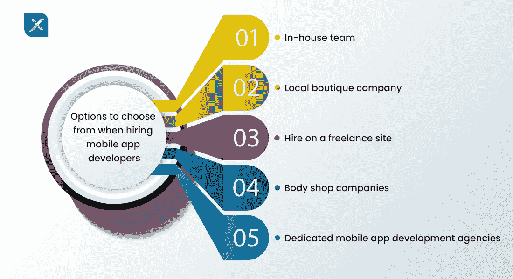
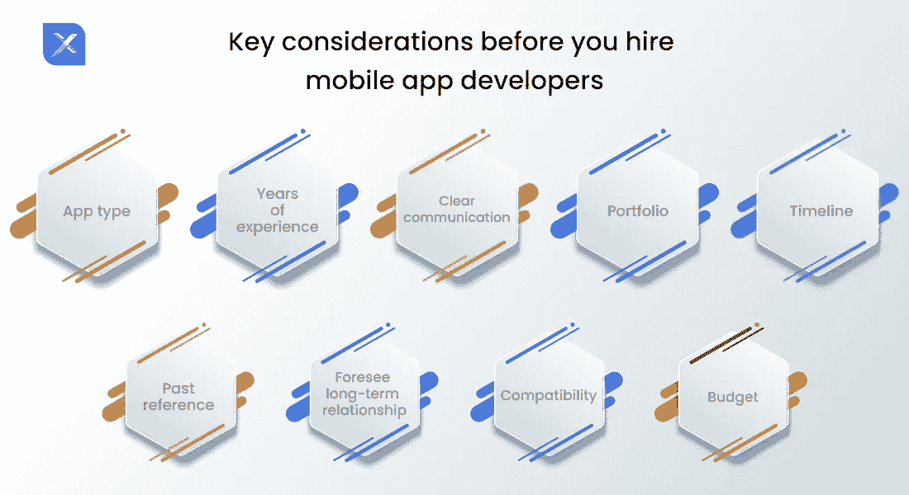
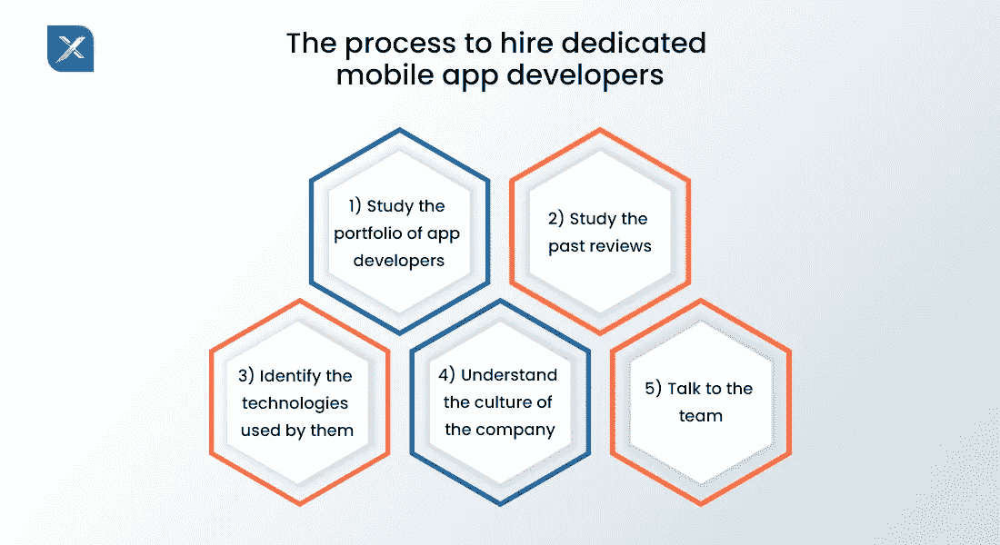

# 如何雇佣一个专门的移动应用开发者

> 原文：<https://blog.devgenius.io/how-to-hire-a-dedicated-mobile-app-developer-20131ef96387?source=collection_archive---------4----------------------->

当你决定为你的创业公司或你已建立的企业创建一个应用程序时，你脑海中的第一个问题是——如何雇用一名专门的移动应用程序开发人员。这篇文章对您的查询所涉及的领域进行了全面的介绍。发表这篇文章后，你将能够雇佣移动应用程序开发者，他们将为你提供可行的应用程序开发解决方案。那么，我们开始吧。

# 雇用移动应用程序开发人员时可供选择的选项

## 内部团队

拥有一个移动开发人员的内部团队始终是企业的首选。内部团队由 5-7 名开发奇才组成。这个团队有一名项目经理、质量保证工程师、iOS 和 Android 移动应用程序开发人员、UZ/UI 设计师以及后端开发人员。内部 app 开发团队完全可以由公司管理层监督和控制。但内部团队的缺点是，它会消耗额外的办公空间、设备成本、额外的人力资源程序，并需要额外的开发工作。

## 本地精品公司

本地精品店是另一种可以经济高效地雇佣应用程序开发人员的方式。尽管通过当地的精品公司雇佣应用程序开发人员的成本比其他选择要低，但这仍然需要大量的投资。在美国，当地精品店的平均租金是每位专家每小时 100 至 150 美元。这意味着，如果涉及一个以上的应用程序开发人员，成本将相应增加。

## 在自由网站上雇佣

当你决定雇用专门的移动应用程序开发人员时，另一个最受欢迎的选择是通过自由职业者网站，如 Upwork、Freelancer.com、Fiverr 等。以最便宜的价格提供开发服务是这种招聘方式的唯一优势。因此，只有当你的需求很小或者是短期的时候，从自由职业者的网站雇佣一个应用开发者是明智的。根据对以前客户的审查和他的技术专长或证书，将开发人员列入候选名单。除此之外，当你[从自由职业网站雇佣移动应用开发者](https://www.inexture.com/hire-mobile-app-developers/)时，你需要记住以下几点。

*   自由职业者不提供交钥匙的应用程序解决方案。
*   自由职业者不遵循应用程序开发方法或工具。
*   自由职业者不会为你的项目期限而烦恼。
*   最后，如果自由职业者交付的结果不令人满意，整个过程需要返工。

## 车身制造公司

美体小铺 app 开发公司是市场的新芽。对移动应用开发者的需求越来越大，导致了这些公司的诞生。他们的员工都是应届毕业生或者业余爱好者。这也意味着这些公司的最终产品可能是糟糕的代码质量。

## 专门的移动应用程序开发机构

最后但并非最不重要的是，有专门的开发机构，如 Inexture。这些成熟的机构遵循结构化的方法进行应用程序开发，并提供适当的支持和维护。这些机构的团队整合良好，不缺乏任何资源。这些机构有强大的投资组合和资格来吸引更多的客户。他们从不通过执行任何低质量的任务来赌上自己的声誉、客户或品牌。

# 雇用移动应用程序开发人员之前的主要考虑事项

## 应用程序类型

你需要清楚你想要开发的应用程序的类型。该应用程序只是你传统业务的虚拟面孔，还是一个全新的创业公司？是基础应用还是复杂应用？它的类别是什么？所有这些问题的答案对于筛选和让你[雇佣专门的移动应用程序开发者](https://www.inexture.com/hire-dedicated-developer/)至关重要。

## 多年的经验

根据应用程序的类型，您需要了解产品所需的专业技术水平。对于复杂的应用程序，雇佣一个背景好、专业水平高的移动应用程序开发人员。

## 清晰的交流

你可以跨越国界，将应用开发服务外包给海外开发者。因此，如果你打算在美国雇佣应用程序开发人员，你需要先与潜在的供应商进行一次聊天、电话、电子邮件或虚拟会面。沟通对于消除双方的疑虑至关重要。

## 投资组合

对潜在的应用程序开发者进行详细的研究。如上所述，应用程序开发人员有很多种。但是每个人都有自己的利弊。务必检查服务提供商是否履行了他们提到的声明。

## 时间表

大致了解最终产出的最终周转时间或截止日期。

## 过去的参考

查看服务提供商网页上的评价或反馈部分。好的工作会得到客户的好评。因此，这样的推荐可以作为吸引新客户的诱饵。

## 预见长期关系

确保所选择的服务提供商处理所有的错误，并在应用程序开发后出现问题时修复它们。如果需要，一些功能将在发布后添加。为此，建议服务提供者和接受者之间建立长期关系。

## 和睦相处

你作为一个 app 开发公司的客户，要兼容代理公司的工作时间、时区、语言、通讯工具。

## 预算

在开始工作之前，弄清楚费用和付款流程。讨论账单是如何提出的，以及支付的灵活性。

# 雇佣专门的移动应用程序开发人员的流程

1.  **研究应用程序开发人员的组合** 不要拿你梦想中的应用程序开发与业余爱好者或大学新手一起冒险。对开发商过去的记录进行完整的研究，并仔细分析他们的投资组合。概述他们过去的工作表现。简单浏览一下他们的网站就足以掩盖这一初步步骤。
2.  **研究过去的评论** 在为你的工作选择应用程序开发人员时，以前客户的经验是一个重要因素。服务提供商也知道这个事实。出于这个原因，他们在自己的网站上发布虚假的证明来打动旁观者。所以要小心，明智地选择。
3.  **确定他们使用的技术** 在选择移动应用开发者的时候，你应该对他们的应用开发流程有一个清晰的了解。了解他们的框架、方法、途径、设计和开发指南，以及项目经理。了解他们如何修复 bug 并在开发后解决问题。
4.  **了解公司文化** 你即将与一家将塑造你品牌虚拟形象的公司合作。所以，你需要清楚了解服务商的公司文化。看看他们的社交媒体页面和网站。检查公司是否有本地开发团队，如果需要的话，你可以和他们联系。确定他们的技术专长、专业领域和经验年限。
5.  **与团队交谈** 你将与塑造你品牌虚拟形象的公司合作。所以，你需要清楚了解服务商的公司文化。看看他们的社交媒体页面和网站。检查公司是否有本地开发团队，如果需要的话，你可以和他们联系。确定他们的技术专长、专业领域和经验年限。

# 雇佣一名 iOS 开发人员

如果您期待创建一个 iOS 应用程序，您的应用程序开发人员应该是使用 Swift 和 Objective-C 的专家。他应该非常了解:

*   OOP 原则，坚实的
*   iOS SDK(软件开发工具包)和 UI 工具包
*   多线程、网络、地理定位、APNS、苹果购买和核心数据
*   GIT 版本控制系统(VCS)
*   Swift 测试工具

在欧盟和美国，iOS 开发者的收费分别在 8 万美元/年左右和 12 万美元以上。

# 雇佣 Android 开发人员

Android 是一个在多种设备上更受欢迎和广泛使用的平台。[安卓应用开发是商家必备](https://www.inexture.com/why-android-app-development-is-necessary-for-businesses/)。因此，如果你计划策划一个 Android 应用程序，你的开发者应该在编写一致的、清晰的、可重用的代码方面更专业。他还应该精通:

Android 开发者每年收费约 13 万美元。

# 雇佣跨平台开发人员

跨平台开发人员精通两个 Android iOS 应用程序的细节和要求。这些开发人员拥有以下专业知识:

*   Android 和/或 iOS 开发经验
*   使用 Android 和 iOS 工具的经验

**遗言**

聘请专门的软件开发机构比所有其他外包应用程序开发服务的方式更有帮助。[移动应用开发公司](https://www.inexture.com/services/mobile-app-development/)从零开始以最定制的方式工作，为他们的每一个客户提供独特的主观解决方案。在招聘过程中采取谨慎的方法，同时遵守关键考虑因素列表，足以帮助您筛选最适合您企业的应用程序开发人员。联系我们，分享您的应用程序开发需求。我们保证为您提供最好的服务。

*原载于 2021 年 10 月 11 日*[*https://www.inexture.com*](https://www.inexture.com/how-to-hire-a-dedicated-mobile-app-developer/)*。*