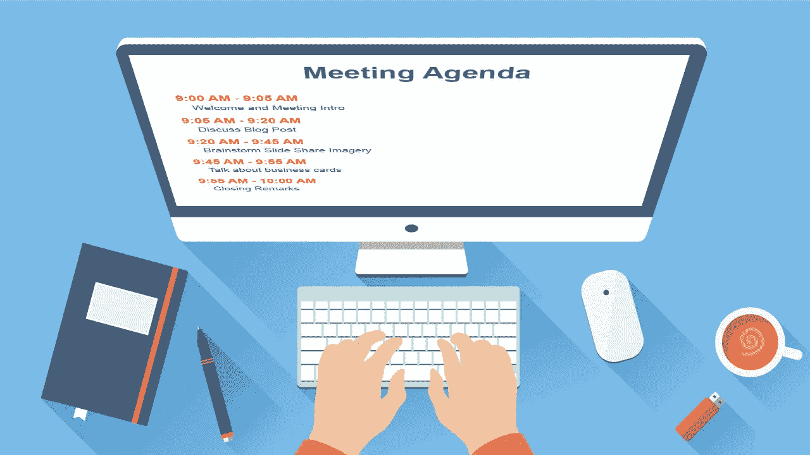

# 如何主持每周的项目会议？

> 原文：<https://blog.devgenius.io/how-to-host-weekly-project-meeting-9aeecc3acccb?source=collection_archive---------26----------------------->

照片由 [sps 环球](https://unsplash.com/@universalsps631?utm_source=medium&utm_medium=referral)在 [Unsplash](https://unsplash.com?utm_source=medium&utm_medium=referral) 上拍摄

大多数项目每周都有 30-60 分钟的周会。这种惯例有助于每个团队成员保持一致，标出潜在的问题，并相互沟通。

因此，保持高效是每个项目的关键。在过去的几年里，我作为教学负责人主持了几个项目(团队规模从 3-8 人不等)的周会。在这个过程中，我发现了一个易于遵循的结构来简化这个过程。今天，我将与你分享它。

# 选择一个最合适的工作日

让我们从安排这个定期会议开始。哪一天见面很重要。从我的经验来看，除了周三，我们已经尝试了所有的 4 个工作日，因为周三是 FB 的“无会议日”。到目前为止，最好的会议时间是星期四下午:

1.  80%的时间过去了，成员们有具体的更新要提交，同时将星期五留给落后的同事们来赶上。
2.  帮助度过“周中低迷期”。在周一至周三给队友制造紧迫感和健康的压力
3.  更容易实施会议决策。周五的会议遗漏“跟进”的比率更高，尤其是一些需要立即或“第二天”采取的行动项目。
4.  更容易保持势头。周一开会会让人们对已经取得的进展感到不那么兴奋，因为这是“上周”的事情，他们肩上有新的工作量。

如果有任何其他硬冲突，我的建议可能不适合你的项目。然而，“势头”、“紧迫性”和“进度”总是你在选择会议时间时需要考虑的因素。

# 在会议前发送议程

一屋子的人不知道我们在这次会议中想要完成什么是一场噩梦。漫无目的的谈话不仅浪费时间，还会耗尽激情和动力。

避免这种情况的最好方法是在会议前一天分享议程。具体而言，议程应包括:

1.  关键更新/公告/演示需要共享
2.  需要做出决定
3.  每个议程项目的时间分配

然后，通过适当的渠道传达议程，如自动发送电子邮件、发帖或聊天。因此，当参加会议时，每个人都已经“达成共识”，人们可以相互问责，迅速做出决定。

# 只分享重要的更新

我见过很多周会只是要求与会者一个接一个地分享更新。表面上看，每个人似乎都参与其中，但本质上这是另一种形式的“懒惰”。

当话题与工作无关时，人们很容易分心。例如，基础设施工程师可能不太关心 UI 改造。以提高整个会议的生产率。我们需要转向“标记并解除封锁”模式:

1.  会议前填写更新
2.  每个项目都应该对照计划进行检查，并分类为:准时(绿色)、延迟(黄色)或受阻(红色)。
3.  关注“延迟”或“受阻”的项目，确保团队了解原因，并有解决方案。
4.  如果团队达到一个关键的里程碑，用演示替换绿色项目的更新。确保“好的工作”总是得到认可。

# 写下所有行动项目

大多数会议不会检查每个方框并解决每个障碍。在**会议记录**的顶部保留一个行动项目列表非常重要，包括:

1.  一个联系点，即 PoC。负责完成这项任务的人。
2.  明确的最后期限。各方都同意解决问题的日期，这将增加各方的紧迫感。
3.  可衡量的结果。一些东西实现了，比如“在维基中记录最终的决定”，而不是“与 XFN 团队就逻辑达成一致”。

# 结局

“及时交付设计的影响”是每个项目的目标。重要的是要提醒我们，会面只是达到这个目标的一种手段，而不是目标本身。因此，当你犹豫是否参加周会时，这可能意味着当前的会议结构没有最好地服务于这个目的。