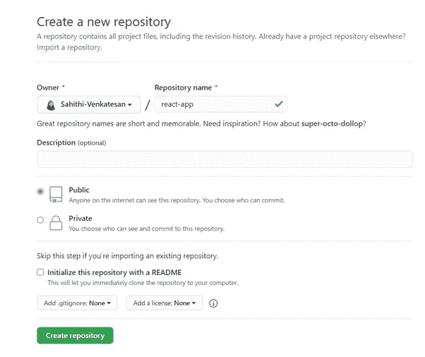
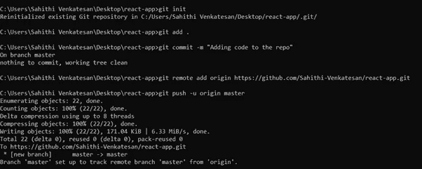
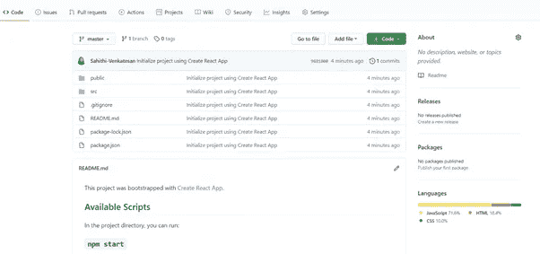
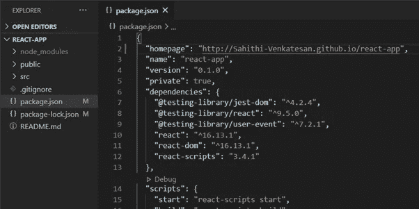
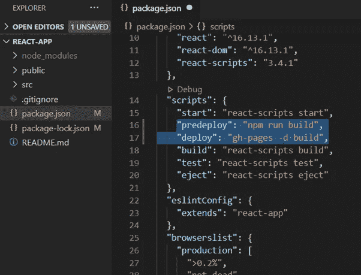
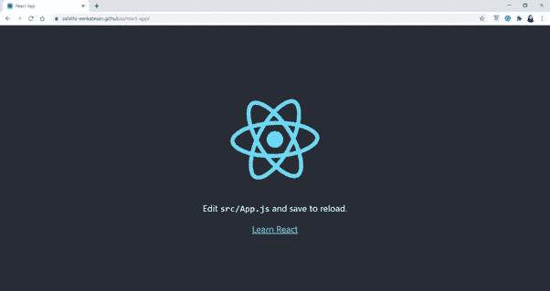

# 如何通过 3 个简单的步骤将 React 应用程序部署到 GitHub 页面？

> 原文：<https://blog.devgenius.io/how-to-host-your-react-application-on-github-in-3-easy-steps-63809c300106?source=collection_archive---------24----------------------->

如果你是一个初学者，如果你非常希望你的网站上线并检验它是如何工作的，那么使用 GitHub 页面部署是值得的。

这篇文章将帮助你在 [GitHub 页面](https://pages.github.com/)上免费托管你的 [React](https://reactjs.org/) 应用。GitHub 提供了一个名为 GitHub Pages 的简单托管解决方案，让其他人可以像查看其他网站一样查看您的存储库。

我假设您对如何创建 react 应用程序以及 GitHub 是什么有一些基本的了解

***我们开始破解吧！***

## **第 1 步:设置您的存储库**

转到您的 GitHub 配置文件并创建一个新的存储库。例如，我将我的存储库命名为`react-app`。



创建新的存储库

完成此操作后，您可以单击“创建存储库”按钮，您将被重定向到创建存储库的页面。

## 步骤 2:设置您的应用程序

就本文而言，我将使用 [Create React App](https://reactjs.org/docs/create-a-new-react-app.html) ，这是一个学习 React 的舒适环境，也是在 React 中开始构建新的[单页应用](https://reactjs.org/docs/glossary.html#single-page-application)的最佳方式。

它设置您的开发环境，以便您可以使用最新的 JavaScript 特性，提供良好的开发人员体验，并针对生产优化您的应用程序。您需要在您的机器上安装[节点> = 8.10 和 npm > = 5.6](https://nodejs.org/en/) 。

如果您已经开发了 react 应用程序，可以跳过这一步，按照下一组说明进行操作。在此之前，请确保您已经将代码发布到了您的存储库中。

进一步进行，

要创建项目，请在终端中运行以下命令:

```
$ npx create-react-app {name-of-your-app}
```

*(例如 npx create-react-app react-app)*

然后，使用以下命令更改您的目录:

```
$ cd {name-of-your-app}
```

*(例如 cd react-app)*

现在，您可以在您选择的合适的文本编辑器中打开您的项目，并进一步将代码推送到您的存储库中

您可以在终端上运行以下命令:

```
$ git init$ git add .$ git commit -m “*Adding the code to the repo*”$ git remote add origin *https://github.com/{username}/{name-of-your-app}.git*$ git push -u origin master
```



设置应用程序

*(比如我的用户名是 Sahithi-Venkatesan，我的 app 名字是* `react-app` *)。所以我的网址是 https://github.com/Sahithi-Venkatesan/react-app.git)*

一旦您完成了这些，您会发现代码已经被推送到您的存储库中，



推送代码后的存储库

## 步骤 3:部署 React 应用程序

现在，安装`gh-pages`包作为 react 应用程序的开发依赖项

在您的终端上运行以下命令来安装`gh-pages`包:

```
$ npm install gh-pages --save-dev
```

随后，在文本编辑器中打开 react 应用程序的`package.json`文件，并添加*“主页”*属性。

将您的*“主页的”*值定义为字符串，`https://{username}.github.io/{repo-name}`

*{用户名}* 是您的 GitHub 用户名， *{repo-name}* 是您的 GitHub 库的名称

因为我的 GitHub 用户名是 *"Sahithi-Venkatesan"* ，我的 GitHub 库的名称是`react-app`，所以我添加了下面提到的属性:

```
“homepage”: http://Sahithi-Venkatesan.github.io/react-app
```



添加主页属性

因此，在项目的`package.json` 文件中添加部署脚本命令。

在`package.json`文件中，用现有的`scripts`属性添加`predeploy`属性和`deploy`属性。您的`package.json`脚本应该如下所示:



添加部署和预部署属性

`predeploy`脚本在运行`deploy`脚本后启动，它捆绑了我们的应用程序进行部署。

您现在可以保存您的`predeploy`文件。

我们已经准备好将我们的应用程序部署到 GitHub 页面了！

在终端中运行以下命令:

```
$ npm run deploy
```

成功部署应用程序后，在浏览器中打开 GitHub 存储库。

点击存储库的*设置*选项卡，向下滚动直到到达 GitHub Pages 部分，并选择`gh-pages`分支作为源。


源设置

***Kaboom💥***

您已经成功托管了 react 应用程序！！！



## ***希望你喜欢阅读这篇文章😃。请随意点击👏按钮！***