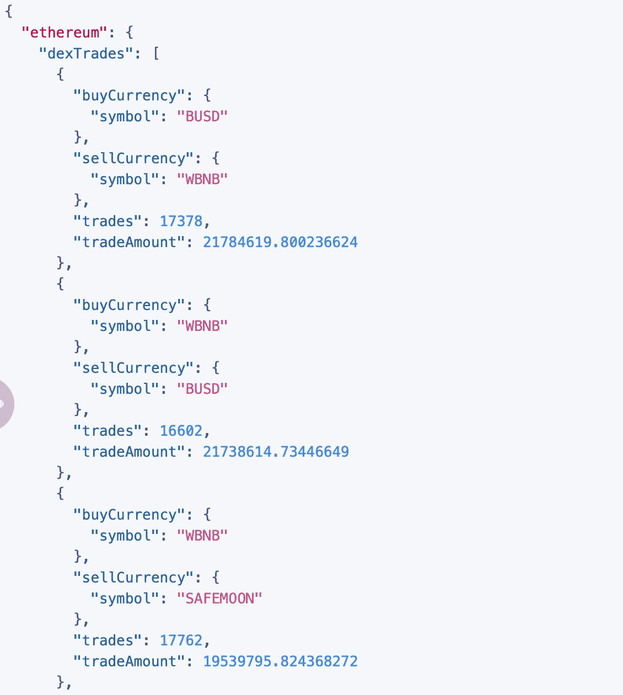

# 如何用 Python/Pandas 识别即将出现的加密货币硬币

> 原文：<https://blog.devgenius.io/how-to-identify-up-and-coming-cryptocurrency-coins-with-python-pandas-8dd4f369f9d5?source=collection_archive---------1----------------------->


尽管这张图片显示以太坊标志无处不在，我们今天将重点关注$WBNB

# 用尽可能少的话:

我已经构建了一个脚本，确切地说是几个脚本，用于在币安智能链网络上识别和混合硬币(因此 pancakeswap 是利用这种方法的最简单的方式)。

# 这一战略的高层次:

1.  查询 https://graphql.bitquery.io/ide[获得每日交易量和每天前 1000 个硬币的交易金额](https://graphql.bitquery.io/ide)
2.  提取这些结果(json)并转换为 csv
3.  用 python 提炼出一些见解
4.  使用 plotly 绘制一切
5.  使用 pancakeswap 购买硬币

# 1.Bitquery 脚本

T 他的脚本在币安智能链网络上提取给定时间范围内的买入符号、卖出符号、交易数量以及每对买入/卖出的总金额。

```
{
  ethereum(network: bsc) {
    dexTrades(options: {desc: "tradeAmount", limit: 1000}, 
      exchangeName: {is: "Pancake"} 
      date: {since: "2021-05-07", till: "2021-05-07"})
    {
      buyCurrency {
        symbol
      }
      sellCurrency{
        symbol
      }
      trades: count
      tradeAmount(in: USD)
    }
  }
}
```

## 结果看起来像这样:



您必须提取结果并保存到一组 txt 文件中，稍后我们会将它们连接在一起。这很痛苦，但我不知道更好的方法。或者你可以使用我的结果并更新到我的 github。虽然，我不确定多久会把我的结果上传到 github。如果你评论的话，我会更经常这样做。

# 2.在 Python 中将结果转换为类似 CSV 的格式

莱蒂不言自明。尽管考虑到这里的嵌套垃圾，这样做有点困难。无论哪种方式，这个脚本都可以将所有内容转换并附加到一个 dataframe (pandas)中。

## ****这是在我将所有的 jsons 保存到一个文件夹中，并将它们加载到一个列表中，并在下面的脚本中使用该列表之后。如果你想要的话，这是第一部分(它很丑，但我很懒):***

## ****在我向您展示结果之前，让我们再做一个步骤:让我们添加一些列，并将其放入 pandas dataframe 中，代码如下:***

## 很好，现在结果是这样的:


#oooo girl(形状约为 30k 行×11 列)

# 3.Python 和 Insights 与 Plotly 共度时光——我最喜欢的部分

我要过滤掉这些数据中的一些垃圾。小旁注——币安智能链上有很多垃圾硬币，我敢肯定以太坊网络上也有。我只抓住每天交易量最高的 1000 个硬币，这仍然很多，然后从一个稳定的硬币中删除所有交易($busd，$usdt，$wbnb 等。).

然后，我按周数分组，并按周数降序计算每枚硬币和订单的总百分比变化。

## 样本结果:


B

# 用 Plotly(好懒)出代码:

旁注:伙计们，如果你们都读了这篇文章，我想要更多关于所有参数的图片！对于 plotly express 中的所有主要图表。我知道，你们在大多数基本参数上都做得很好，但是有一些模糊的配置，我不知道它们是做什么的，而且你们知道我很懒，当谈到让我的分析看起来不错时，我是最坚持不懈的傻瓜之一。帮助我，帮助你。我会一直宣传你们，b/c 我爱你们的图书馆。


# 好吧，这是真的。这是我一路走来制作的几个图表:

1.  显示每枚硬币每天的百分比变化的折线图:

## 结果:


## 快乐情节:

显示每枚硬币的百分比变化范围:

## 结果:(很酷，但不是超级有趣)


# 在这个过程中，我又建立了几个:顶级买卖符号

## **结果:**


热门商品


畅销商品

# 我真的忘了它到底在做什么，但也不是很有趣:


# 最后，如果你想看白天的小盘股:

## BSC/Pancakeswap:

**结果:**对今天 2021 年 5 月 11 日来说有点平淡无奇


## **以太坊网络/unis WAP(be wear——今天的油费高得离谱——50 美元的交易要 300 美元……):**


# 开源代码库

[https://github.com/maxwellbade/pancakeswap_new_coins](https://github.com/maxwellbade/pancakeswap_new_coins)

# 结论:

我在 youtube 加密视频上听到每个人都这样说——这不是财务建议，你不应该根据我说的任何话来购买或出售，我只是一个喜欢建立酷数据的加密爱好者。

除此之外，这真是太棒了。我自己也会这么说。当你摆弄这些小硬币时，不要往里面扔很多钱。我通常只花 50 到 100 美元。他们很有趣。我也使用 pancakeswap——有很多钱包应用程序可以使用——trust wallet 是一个很好的应用程序。

如果你觉得这很有帮助，可以考虑给我寄些东西。我整个星期都坐在沙发上，b/c 我病了，为这个世界建造了这个。我会试着更新我的 github。

> **XRP 钱包**:rmdg 3 ju 8 pgyvh 29 elpwadua 74 cpw w6 fxns
> 
> **XRP 目的地标签** : 1328520722
> 
> **BNB:**bnb 10 ta 04 ldj 2 xlf 9m 59 gsmdsxk 8 AE 45 k5mzf 6 maqw
> 
> **BTC 钱包**: 3K2wUJCrCbSBipLPRfFaEstjxva5qUbzVr
> 
> **ETH 钱包**: 0xe7edE8b7EF4289356d5579F0C4e00bFf36b28BdF
> 
> **Venmo: @ Max-Bade**

曲名 : I'm Out