# 如何实现二进制堆(Javascript)

> 原文：<https://blog.devgenius.io/how-to-implement-a-binary-heap-javascript-d3a0c54112fa?source=collection_archive---------1----------------------->

读完这篇文章后，你会有:

*   堆数据结构的坚实基础。
*   用 javascript 实现了一个最小堆。

**二进制堆**是一个从头开始实现的更复杂的数据结构。话虽如此，但它被广泛应用于各种算法中，例如:

*   图形遍历
*   整理
*   寻路

例如，当计算从 A 点到 b 点的最短路线时，Google Maps(我们都知道并喜欢它)使用某种类型的二进制堆。

把二进制堆想象成一堆橘子:


当我们想从一堆橘子中取出一个时，我们会抓住最上面的一个，原因有两个:

1.  如果我们从底部抓起一个橘子，那这堆橘子就会倒塌。
2.  顶部元素被认为是“最有价值的”。

随着我们沿着水果堆往下走，橘子的价值或 T2 优先级会降低。

同样的想法也适用于二进制堆。

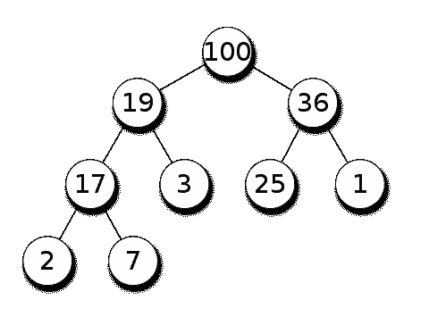

最大堆

与水果堆不同，二进制堆由节点组成，每个节点保存一个值，可以是数字、字符串或对象。每个节点最多有 2 个子节点(因此命名为“二进制堆”)，但如上所示，一个节点可能有 1 个子节点，也可能没有子节点。

和以前一样，我们只能从堆中提取最顶端的元素，它被认为是**“最高优先级”**。

所有父节点都大于或等于子节点的堆称为**最大堆**。而所有父节点都小于或等于子节点的堆被称为**最小堆**。

需要注意的是**二进制堆应该总是一个完整的二叉树**。这意味着在每一层，除了可能的最后一层，所有节点都被完全填充，并且所有节点都尽可能地靠左。

完整二叉树的一个例子:

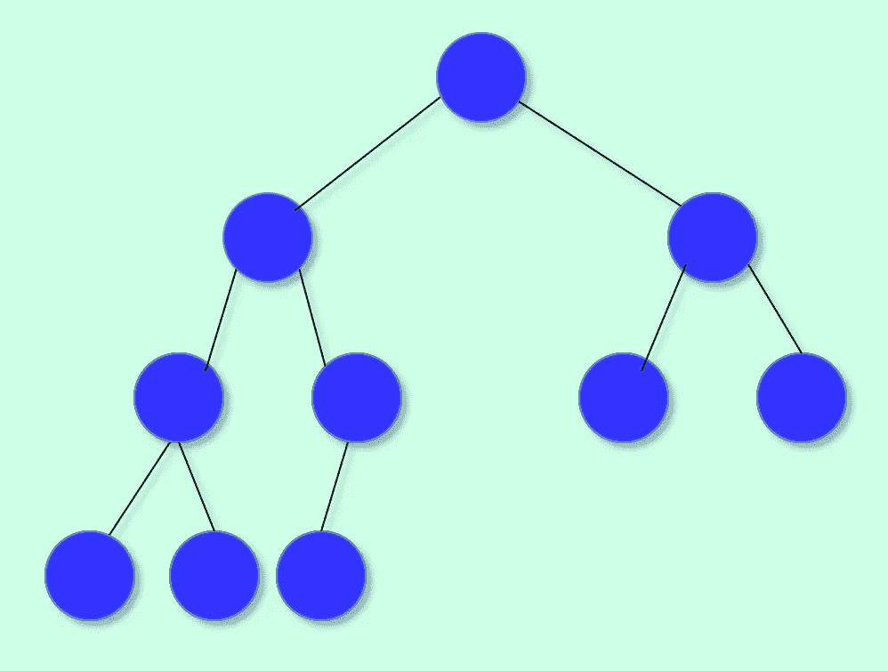

完全二叉树

不完整二叉树的示例:

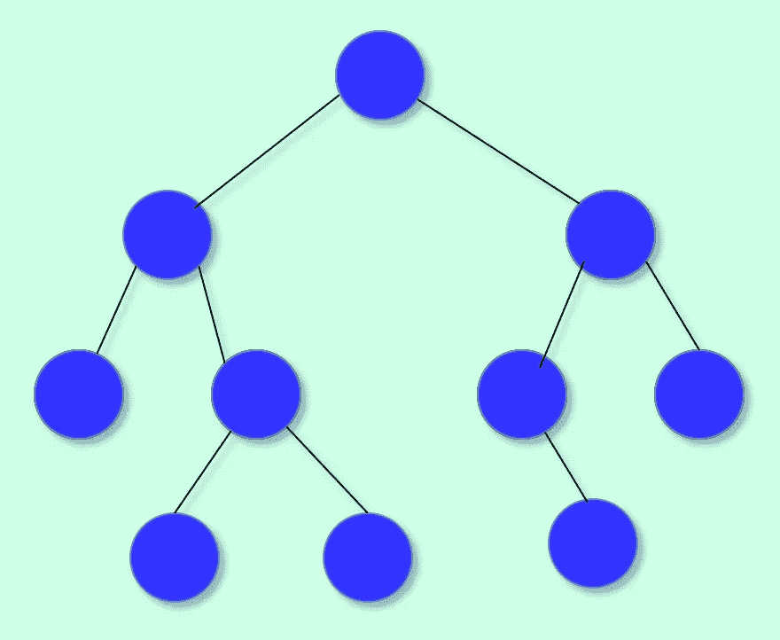

不完全二叉树

进入代码之前的最后一步是理解如何用数组表示一棵树。

*   树的根将位于数组的位置 1。
*   在位置 n 的任何给定节点的左子节点将位于 2n。
*   位置 n 的节点的右子节点将位于位置 2n + 1。
*   位置 n 处的节点的父节点在位置 n/2 处。

完整二叉树的数组表示:

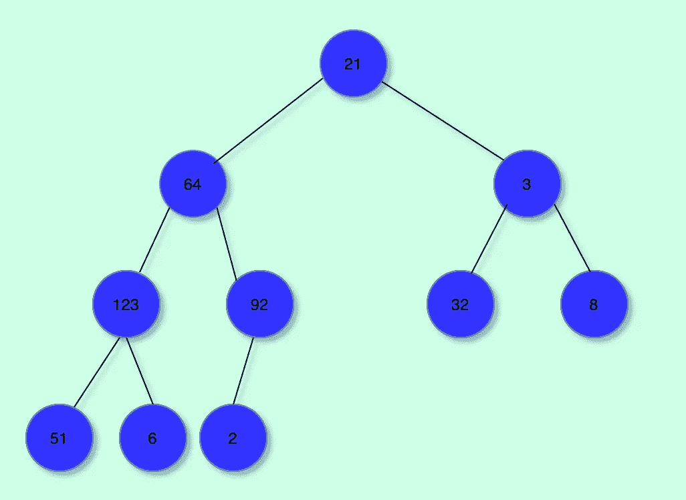

```
[0 ,21, 64, 3, 123, 92, 32, 8, 51, 6, 2]
```

***提示*** *:一棵完整的二叉树，当表示为数组时，除了位置 0 的第一个元素外，将没有空值。*

# 二进制堆中的操作

我们的二进制堆将支持以下两种操作:

1.  插入元素。
2.  提取元素。

# 代码(最小堆)

现在我们明白了二叉堆也是完全二叉树。让我们仔细看看堆操作的实现。

让我们从定义一个 javascript 类开始:

```
export class MinHeap { constructor(*selector*) { *this*.items = []; *this*.selector = selector; } push(){} pop(){}}
```

在上面的代码中，selector 是用户提供的一个函数，它应该返回存储在堆中的每个元素的值表示。这样做是为了我们以后可以比较存储的元素/对象。

**插入**

在一个堆中，每个元素都被插入到树中的元素处，使得它**仍然是一个完整的二叉树**。

在数组表示中，我们只需在数组末尾添加新元素。

将 8 插入最小堆的图示:

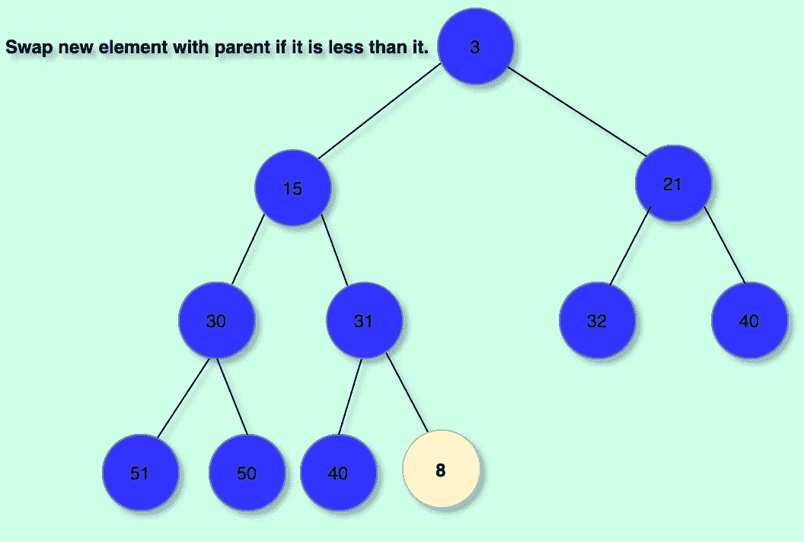

一个新的黄色节点被添加到堆中

然后我们继续“冒泡”节点。这意味着我们只是与新插入节点的父节点交换，直到它的父节点小于或等于它。这保存了我们的完整二叉树，使其保持最小堆。

插图:

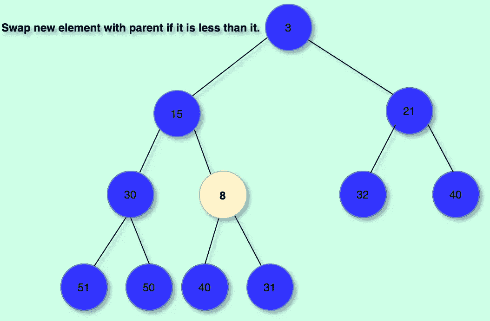

8 和 31 被交换，因为它是一个最小堆

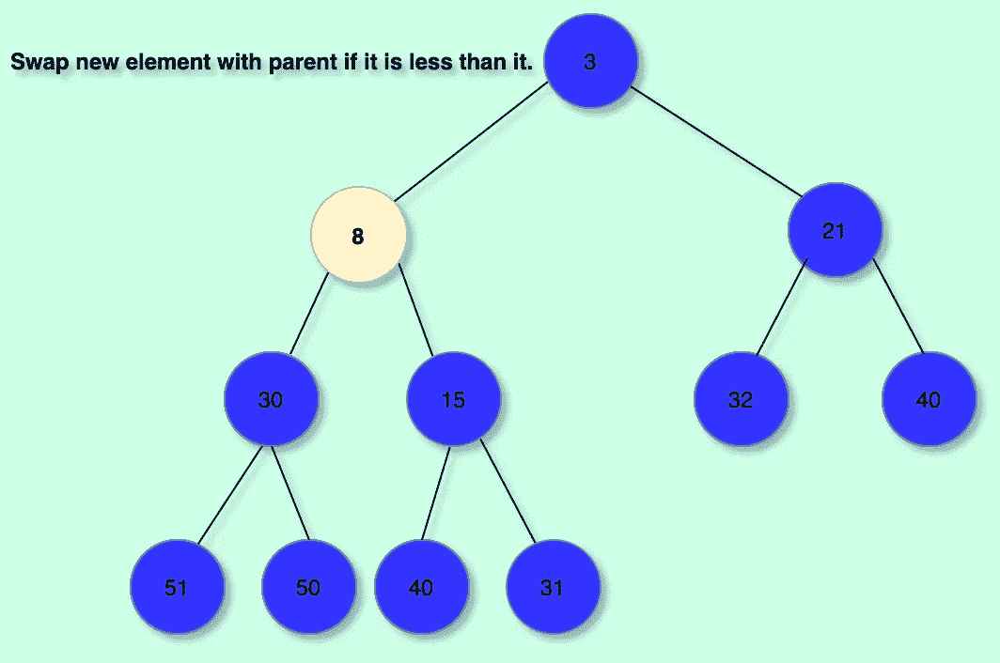

15 和 8 被交换，堆属性被保留

代码:

```
export class MinHeap { constructor(*selector*) { *this*.items = []; *this*.selector = selector; } insert() { let i = *this*.items.length; *this*.items.push(item); let parentIndex = Math.floor((i + 1) / 2 - 1); if (parentIndex < 0) parentIndex = 0; let parentVal = *this*.selector(*this*.items[parentIndex]); const pushedVal = *this*.selector(*this*.items[i]); while (i > 0 && parentVal > pushedVal) { parentIndex = Math.floor((i + 1) / 2 - 1); *this*.swap(i, parentIndex); i = parentIndex; parentVal = *this*.selector( *this*.items[Math.max(Math.floor((i + 1) / 2 - 1), 0)] ); } }}
```

**移除**

如前所述，从堆中移除元素包括获取最顶层的元素，然后调整堆，以便:

1.  它仍然是一棵完整的二叉树。
2.  它仍然是一个有效的最小堆。

这是通过将堆中的最后一个元素放在最上面，然后“向下冒泡”以保留最小堆属性来实现的。

逐步说明:

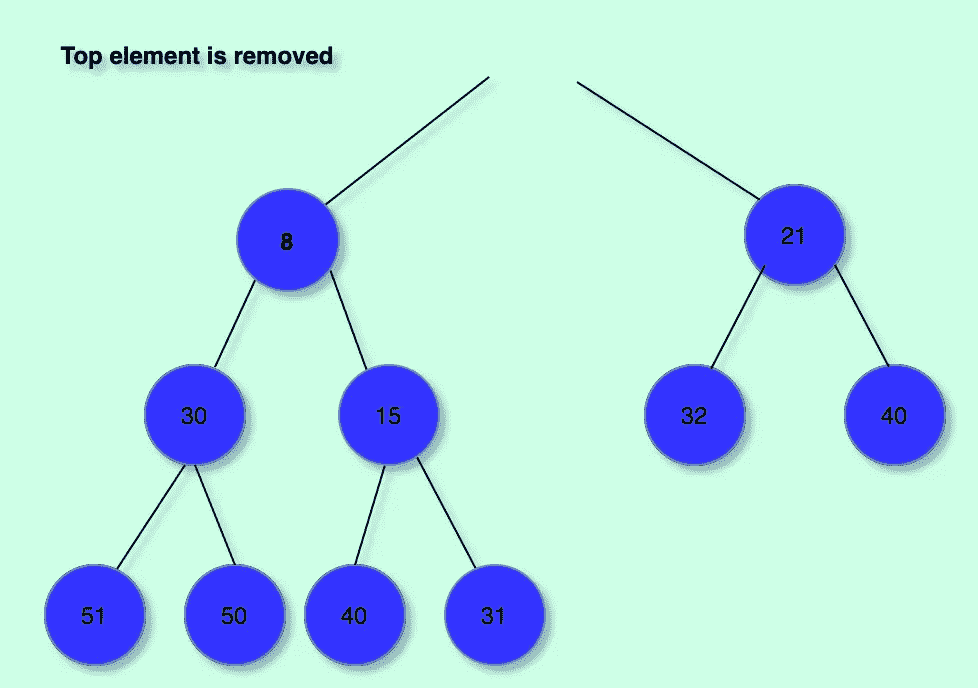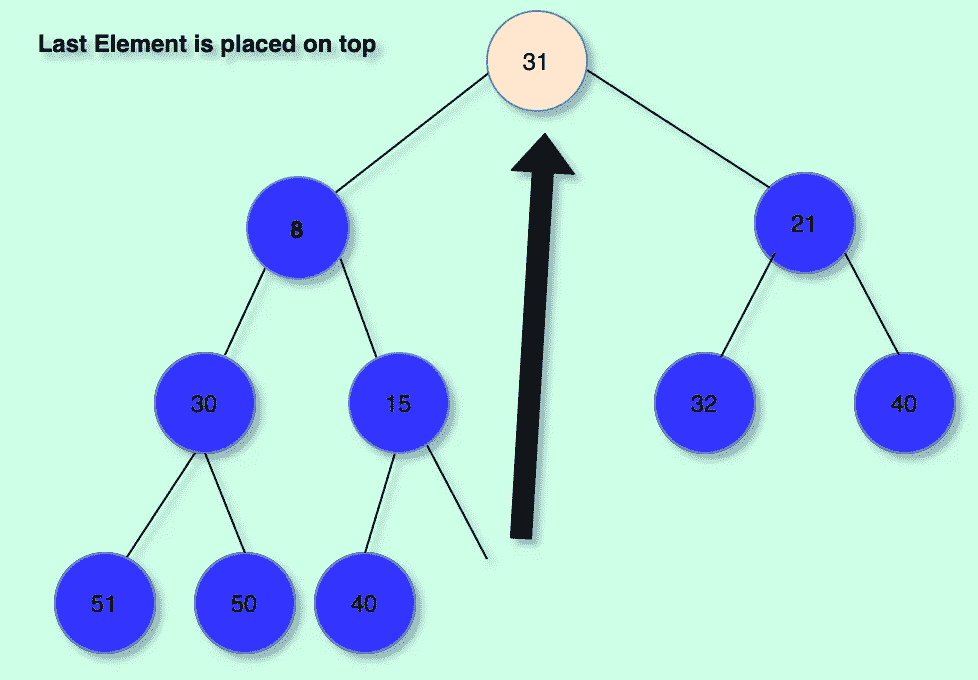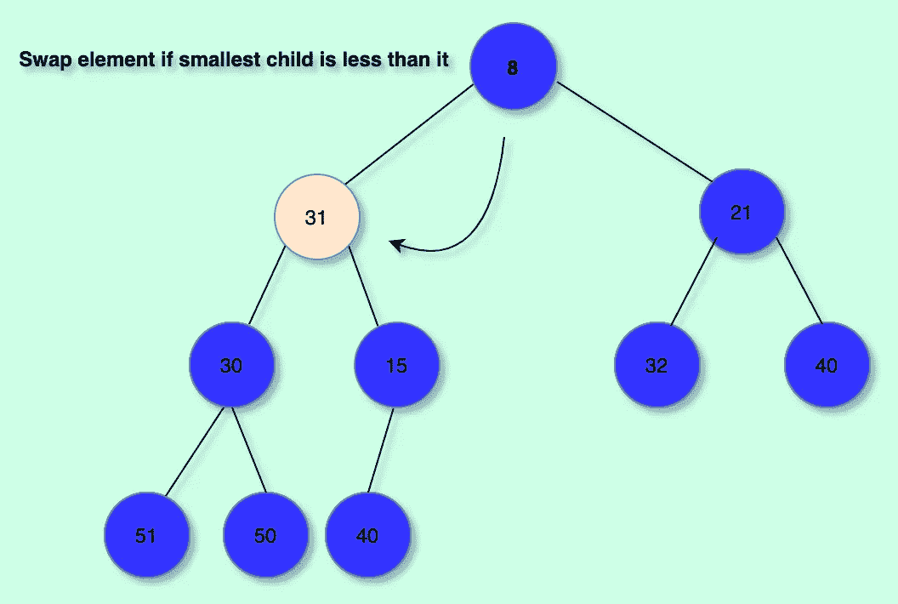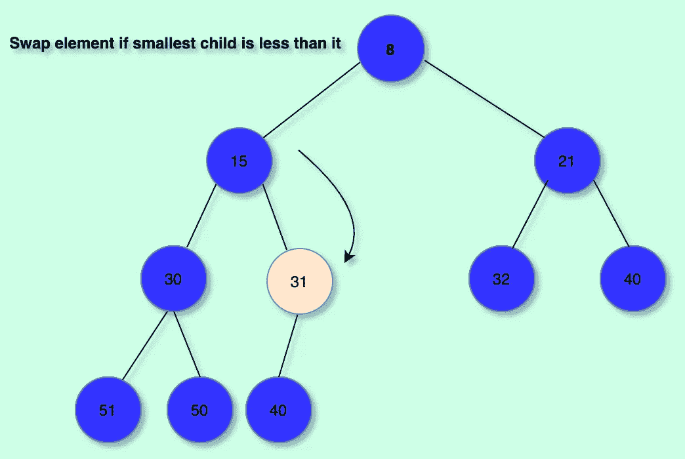

代码:

```
export class MinHeap { constructor(*selector*) { *this*.items = []; *this*.selector = selector; } remove() { if (*this*.items.length <= 1) return *this*.items.pop(); const ret = *this*.items[0]; // What we will return let temp = *this*.items.pop(); *this*.items[0] = temp; // Place last element in array at front let i = 0; // We adjust heap from top to down while (true) { let rightChildIndex = (i + 1) * 2; let leftChildIndex = (i + 1) * 2 - 1; let lowest = rightChildIndex; if ( leftChildIndex >= *this*.items.length && rightChildIndex >= *this*.items.length ) break; if (leftChildIndex >= *this*.items.length) lowest =        rightChildIndex; if (rightChildIndex >= *this*.items.length) lowest =    leftChildIndex; if (!(leftChildIndex >= *this*.items.length) && !(rightChildIndex >= *this*.items.length) ) { lowest = *this*.selector(*this*.items[rightChildIndex]) < *this*.selector(*this*.items[leftChildIndex]) ? rightChildIndex : leftChildIndex; } // Find the smallest child // If the parent is greater than the smallest child: swap if (*this*.selector(*this*.items[i]) >                         *this*.selector(*this*.items[lowest])) { *this*.swap(i, lowest); i = lowest; } else break; // We have finished setting up the heap } // Return topmost element return ret; }}
```

在此之后，您可以添加其他操作来满足您的需求，例如:isEmpty()、peek()等。这些应该很容易添加。

你有它！这是 javascript 中二进制堆的简单实现。

如果您对严重依赖堆数据结构的应用程序感兴趣，我构建了一个在线图形算法可视化平台，您可以查看一下。[链接此处](https://luisalfonsopreciado.github.io/Graph-Algorithms-Visualization/)

*最初发布于*[*my blog*](https://luispreciado.blog/posts/programming/javascript/how-to-implement-a-binary-heap-javascript)*。*