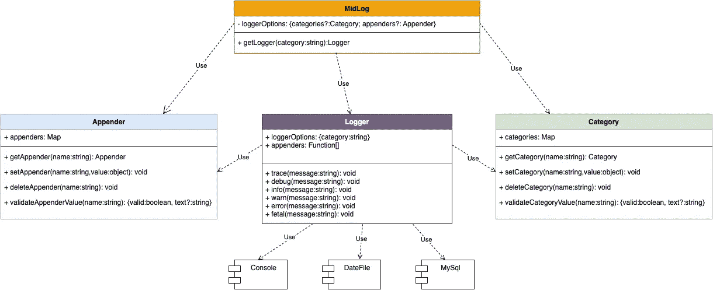

# 如何实现从 0 到 1 的日志打印库

> 原文：<https://blog.devgenius.io/how-to-implement-a-log-printing-library-from-0-to-1-694b4bece08?source=collection_archive---------10----------------------->

日志打印库指的是日志工具

克里斯托夫·高尔在 [Unsplash](https://unsplash.com?utm_source=medium&utm_medium=referral) 上拍摄的照片

**前言**
我们在日常开发中需要打印日志，比如调试日志可以帮助我们分析程序的运行过程，错误日志可以帮助我们定位错误的原因，还可以基于日志做数据分析，比如可以监控错误日志，当生成的日志数量大于我们预先设定的阈值时，会发出警报以便第一时间跟进修复。因此，有必要在您的项目中添加一些日志标点符号代码。本文将带您一步步地从 0 到 1 实现一个生产就绪的节点端日志打印库，不仅向您展示代码，还展示为什么要这样设计，这样您就可以很容易地将这种设计思想带到您的项目中。

**功能分解**
如果让我用一句话来描述日志库的核心功能，我会说“将不同类型的日志输出到各种指定的容器”，这里有两个关键核心:不同类型的日志和各种容器。

**不同类型的日志**
日志是有区分的，不同级别的日志传达不同的含义，如下。

1.  错误:系统发生错误事件，但仍不影响系统继续运行。系统需要在错误日志中记录错误或异常的详细信息，方便后续人工回溯解决。错误日志稍后将发送警报，并将在人工故障排除解决方案中实施
2.  警告:系统在业务处理过程中触发了异常流程，但系统可以恢复到正常状态，下一笔业务可以正常执行。例如，程序调用旧版本的接口，可选参数不合法，不是预期的业务状态但仍能继续处理等。
3.  Info:记录系统的关键信息，目的是保留系统正常运行时的关键运行指标。开发者可以将初始化的系统配置、业务状态变化信息，或者用户业务流程的核心处理记录到 info 日志中，方便日常运维工作以及错误检索时的情景回顾。
4.  Debug:可以将各种详细信息记录到 debug 中来起到调试的作用，包括参数信息、调试细节、返回值信息等。
5.  跟踪:更详细的跟踪信息

上述日志记录级别是开发中最常用的五个级别，从最高到最低。生产系统通常只打印信息级别以上的日志，对于调试级别的日志，它们只在测试环境中发布。打印错误日志时，您需要区分业务异常(例如，用户名不能为空)和系统异常(例如，调用成员核心异常)，并对业务异常使用警告级别日志，对系统异常使用错误日志。更多日志级别的定义，可以查看 [Wiki](https://en.wikipedia.org/wiki/Syslog#Severity_level)

**不同的容器**
如上所述，日志输出的目的地对于不同的级别是不同的，要么是终端，要么是文件。处理这种情况的一般方法是，对于开发环境，通过控制台输出到终端，对于生产环境，输出到指定的文件夹。

**如何设计我们的代码**
在开始编码之前，我们首先需要梳理我们的应用场景，然后设计我们的代码结构，最后通过编码来实现。回到我们的日志库，可能的场景如下。

1.  需要支持将不同级别的日志输出到不同环境中的不同目的地
2.  附加器是可配置的，例如，是否输出到文件，按小时，或按天
3.  日志输出的格式是可变的，可以是[时间][级别][日志内容]，也可以是[级别][时间][日志内容]

在这种情况下，我们应该如何设计我们的代码？我认为我们可以从开发者使用的角度出发，如果我们提供一个日志库，他们如何使用它会更愉快？因为我们需要支持将不同级别的日志输出到不同环境中的不同目的地，所以我们需要支持通过环境 appender 将输出配置到各自的目的地。

好的，此外，不同环境的不同 appenders 可能是多重的，所以我们需要支持数组。然后每个 appender 都会有它的配置，比如输出到文件，是按天输出还是按小时输出，日志输出的格式也大不相同。因此，代码可能演变如下。

因为我们最终会使用一些方法，比如记录器。调试(消息)或记录器。错误(消息)在我们的代码中，我们上面实例化的类也需要公开这些方法，例如，它可能看起来像这样。

弄清楚开发者如何使用我们的日志库，具体分析什么在改变，参考 [SOLID](https://www.digitalocean.com/community/conceptual_articles/s-o-l-i-d-the-first-five-principles-of-object-oriented-design) 设计原则，每个模块只负责一个逻辑，每个独立，例如，MidLog、Category、Appender、Logger。MidLog 作为一个容器类依靠 Category 来管理策略，依靠 appender 类来控制输出目标，同时依靠 Logger 类来做具体的日志打印，可以看到 MidLog 类的主要职责是协调各个类之间的调用，而实际的日志打印依赖于 Logger 类，MidLog 会将具体的 Appender 和 level 传递给 Logger 来执行具体的日志打印动作，类之间的关系可以在下面的 [UML](https://drive.google.com/file/d/1lTxenPycUiNBecf53o5F0tuXi8x0VLtF/view?usp=sharing) 图中查看。

 [## 认识 Google Drive -一个存放所有文件的地方

### Google Drive 是一种免费的文件备份方式，可以从任何手机、平板电脑或电脑上轻松访问。开始…

drive.google.com](https://drive.google.com/file/d/1lTxenPycUiNBecf53o5F0tuXi8x0VLtF/view?usp=sharing) 

**代码实现**
一旦我们想通了如何设计自己的代码，接下来就是具体的编码了，这里我用 TypeScript 来写，因为它有丰富的类型定义和类型派生，可以帮助我们减少常见的 bug，在 vs code 等编辑器上有更好的编码体验。

**MidLog**

**类别**
类别通过映射数据结构管理策略名称和策略细节。

**Appender**

**Logger**
这个类是专门打印日志的类，执行过程如下。

依靠类别实例，取出具体的策略信息，该策略信息包含附加者和级别

依靠 appender 实例，遍历 appender，根据 Appender 值得到相应的 Appender 函数和参数

比较当前调用的方法(错误、调试等。)的级别，如果高于配置的级别，则打印日志。

详细代码如下。

**Appender 函数**
Appender 函数，多次提到过，是一个可以随时扩展的独立函数，比如如下的 console appender。

DateFileAppender 的实现如下。

DateFileAppender 用于将日志输出到一个文件中，可以按时间切片，例如按天切片，文件系统会生成 2022.05.10.application.log、2022.05.11.application.log、application.log 等多个文件。其中 application.log 存储当天的日志。

至此，核心代码已经实现，我已经将完整的代码上传到 [Github](https://github.com/simplefeel/logger-node)

**总结**
通过实现一个日志打印库，希望带给你以下思考。

1.  学会从开发人员的角度考虑代码设计
2.  一个单独的模块应该只做它的一部分事情，它需要有边界
3.  学会从变化的代码中分离出不变的代码，以提高代码的可伸缩性
4.  多实践，代码多看，设计思路多理解，自己动手去实现

**参考**

 [## GitHub-log4js-node/log4js-node:log4js 到 node.js 的一个端口

### log4js 到 node.js 的一个端口，通过在 GitHub 上创建一个帐号，为 log4js-node/log4js-node 开发做贡献。

github.com](https://github.com/log4js-node/log4js-node)  [## GitHub - winstonjs/winston:一个几乎可以记录所有事情的日志程序。

### 一个几乎适用于所有事情的日志程序:更多信息请参见升级指南。欢迎 Bug 报告和 PRs！请…

github.com](https://github.com/winstonjs/winston) 

**支持我**
创作不易，如果你喜欢我的文章，请鼓掌关注