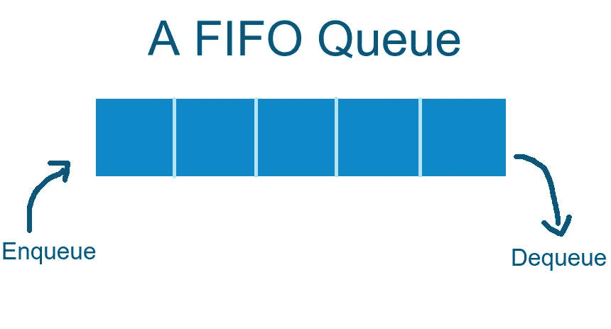

# 如何用 JavaScript 实现队列

> 原文：<https://blog.devgenius.io/how-to-implement-a-queue-in-javascript-8a186f69077f?source=collection_archive---------7----------------------->

在这个简单而简短的博客中，我们将了解如何实现编程中最常见和最有用的数据结构之一，**队列**

**那么队列到底是什么，它有什么用途？**

因此，队列是一种以先进先出方式存储数据的数据结构，这意味着前面的第一个元素是第一个被弹出的*,就像收银台的队列，其中第一个排队的人是第一个结账离开的人*

*就像其他数据结构一样，队列用于高效地存储数据，并以最快的方式检索数据*

***队列操作***

*队列用于对它存储的数据执行操作，因此使用队列我们可以*

1.  *入队—将项目添加到队列的前面*
2.  *出列—从队列的末端(后部)移除项目*
3.  *查看—检查队列的第一个元素*
4.  *检查队列是否为空*
5.  *检查队列是否已满*

*现在，我们将使用 JS 来实现其中的一些功能，我们将使用一个非常熟悉的歌曲播放列表示例🎵*

***用 JAVASCRIPT 实现队列***

*因此，根据博客前面显示的队列的性质和功能来判断，我们与队列或任何线性数据结构(如堆栈)最接近的是数组*

*所以计划非常简单，我们需要做的就是四个操作*

1.  *`Enqueue()`加入到队列的前面*
2.  *从队列的后面移走*
3.  *`Peek()`返回第一个元素，但不删除它*
4.  *`isEmpty()`检查队列当前是否为空*

*所以让我们首先声明一个类并实现那些方法*

*如代码片段所示，类一被实例化，我们就初始化一个空数组，并将其命名为`contents`*

*`**Enqueue()**`*

*我们使用典型的`push()`方法将一个项目推到数组的后面*

*`**Dequeue()**`*

*通常，要从数组中弹出一个项目，我们使用`pop()`方法移除数组的最后一个元素并返回它，但是在我们的例子中，我们需要移除队列的第一个元素，所以我们使用`shift()`方法返回数组的第一个元素*

*`**Peek()**`*

*这个很简单，我们返回索引为 0 的元素，这是第一个元素，不需要移除它*

*`**isEmpty()**`*

*这个只是检查数组的`length`属性是否为零，并返回 true 或 false*

***测试我们的队列***

*现在我们已经创建了表示队列的类，让我们试一试，看看事情是否如预期的那样工作*

*就这样，我们有了一个完全工作的线性队列，它具有一个队列的基本功能🎉*

***下面是为那些懒惰的书呆子准备的完整代码😅***

*非常感谢你的阅读，我希望你今天学到了一些东西，♥️*