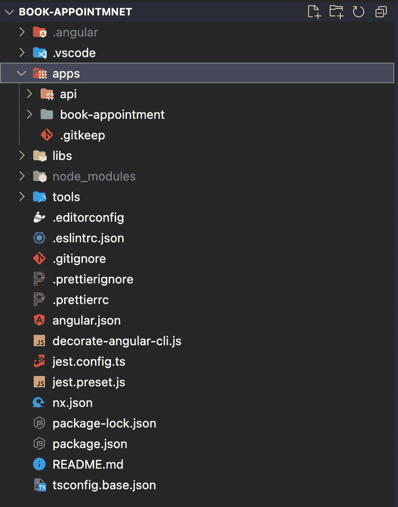
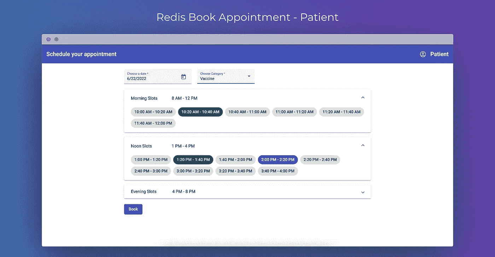
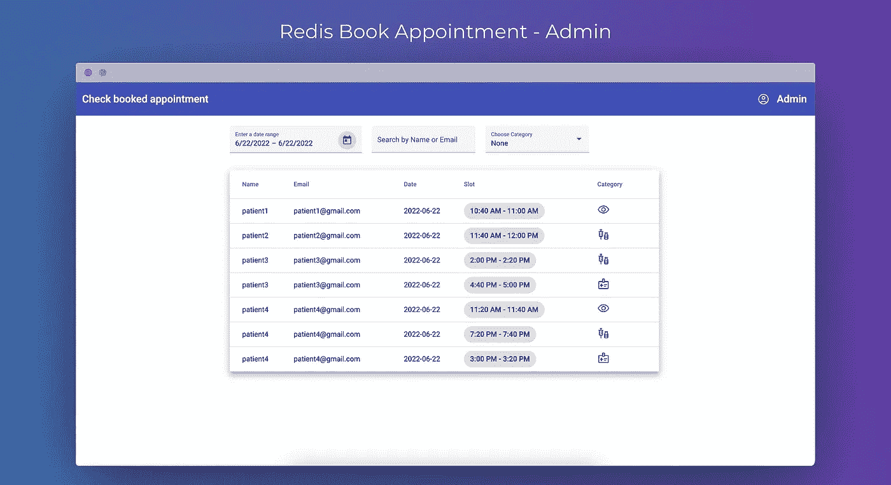
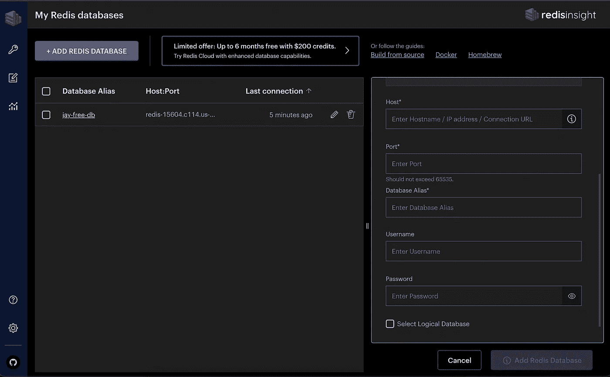
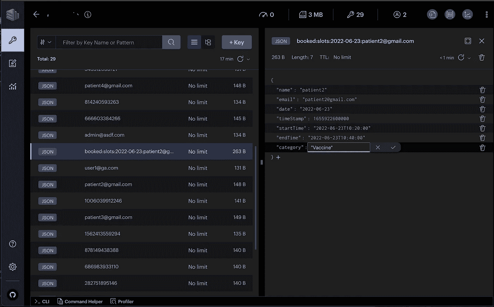

# 如何使用 Redis 实现预约时段

> 原文：<https://blog.devgenius.io/how-to-implement-appointment-booking-slots-using-redis-c941d50a50d6?source=collection_archive---------6----------------------->

在本文中，我们将了解如何使用以下 redis 服务/模块在医院中为各种类别(如`Eye Checkup`、`Full Body Checkup`、&、`Vaccine`)实施预约特定时间段的门户:

*   雷迪森
*   再研究
*   Redis 企业云

# RedisJSON 是什么？

RedisJSON 是一个 Redis 模块，在 Redis 中启用 JSON 支持。它允许您像使用普通 JSON 一样执行各种操作，如插入、更新、获取和删除 JSON 值。此外，我们可以用 RediSearch 配置它，无缝地索引和查询 JSON 文档。

# 什么是再研究？

RediSearch 是一个全文搜索引擎，作为 Redis 的一个模块提供。我们可以使用 And / Or 和其他操作符查询模式，以便在最短的时间内获取结果。此外，它还提供了一些关键功能，如二级索引、多字段查询、聚合和数字过滤。

# 什么是 Redis 企业云？

Redis 企业云是 Redis 提供的完全托管的云服务。它带有 Redis 的所有本机模块，即 RediSearch、RedisJSON、RedisGraph、RedisBloom、RedisTimeSeries。除此之外，它还提供访问控制管理功能来创建不同的用户角色，并限制读/写访问。

# 步骤 1:先决条件

*   节点 v14 或更高版本
*   nx cli — `npm install -g nx`
*   创建您的免费 [Redis 企业云账户](https://redis.com/try-free/)，您可以使用 Redis 企业云创建的默认数据库或者[创建一个新数据库](https://docs.redis.com/latest/rc/databases/create-database/)。

# 步骤 2:克隆存储库

```
git clone <https://github.com/sumitvekariya/book-appointment.git>
```

# 步骤 3:安装所需的依赖项

```
cd book-appointment
npm i
```

# 步骤 4:文件夹结构:

为了简单起见，我们使用 Nx 的前端和后端使用单回购结构。

*   `apps/api`:将作为我们的 NestJS 后端。
*   `apps/book-appointment`:将作为我们的角前端。



文件夹结构

# 步骤 5:配置数据库(可选)

使用我们在先决条件部分创建的数据库的凭据在 [redis 企业云帐户](https://redis.com/try-free/)中创建 Redis 数据库

**文件** : `app/api/src/environments/environment.ts`(针对本地)

**文件** : `app/api/src/environments/environment.prod.ts`(生产用)

```
export const environment = {
  REDIS_HOST: "",
  REDIS_USERNAME: "",
  REDIS_PASSWORD: ""
};
```

# 步骤 6:如何连接 Redis 客户端:

我们已经创建了一个`RedisClientService`,它负责处理连接并对 Redis 数据库执行操作。

```
import { Injectable } from '@nestjs/common';
import { createClient } from 'redis';
import { environment } from '../environments/environment';@Injectable()
export class RedisClientService {
  public client;
  constructor() {
    // Create connection instance with redis using database credentials stored in
    // environment variables in step 5
    this.client = createClient({
      url: environment.REDIS_HOST,
      username: environment.REDIS_USERNAME,
      password: environment.REDIS_PASSWORD
    }); // Check error while connection.
    this.client.on('error', (err) => console.log('Redis Client Error', err)); // Establish a connection
    this.client.connect();
  } getClient() {
    return this.client;
  } async generateIndex() {
    ...
  }
}
```

# 步骤 7:启动前端和后端

在不同的终端中运行以下两个命令。

```
npm run start:FE # for frontend
npm run start:BE # for backend
```

# 第八步:它是如何工作的？

# 适用范围

在应用程序中，有两种类型的用户

*   患者—可以预约可用于预约的时段
*   管理员—可以根据约会的日期、电子邮件、名称和类别过滤和查看约会

有 3 种服务类别可以预约

*   疫苗
*   全身检查
*   眼睛检查

# 患者端:



# 如何创建类别？

在运行后端时，我们需要创建可以预约的类别，所以我们创建了 3 个类别，并使用`RedisJSON`将它们插入 redis 数据库。

**文件** : `apps/api/src/utils/redis.service.ts`

```
async setCategories() {
  const categoryKey = `category`;
  const categories = [
    'Full Body Checkup',
    'Vaccine',
    'Eye Checkup'
  ]; // Check whether same key exist or not
  const existingData = await this.client.json.get(categoryKey);
  if (!existingData) {
    this.client.json.set(categoryKey, '$', categories);
  } else {
    console.log("Categories are already there in Redis");
  }
}
```

# 如何获取类别:

**文件** : `apps/api/src/app/app.service.ts`

```
async getCategories() {
  const categoryKey = `category`;
  const categories = await this.client.json.get(categoryKey);
  return categories;
}
```

# 槽是如何产生的？

在生成每个 20 分钟的时间段时，我们将午餐时间设置为 12:00PM-1:00PM。

然后我们从 Redis 数据库中获取给定日期的槽。

```
const bookedSlotsKeys = await this.client.keys(`booked:slots:${date}:*`);if (bookedSlotsKeys?.length) {
   // Fetch slots from the keys
   let bookedSlotsDataInRedis = await this.client.json.mGet(bookedSlotsKeys, '$');
   bookedSlots = [].concat(...bookedSlotsDataInRedis);
}
```

之后，它会将`isBooked`标志分配给已经预订的时隙，并且还会根据时隙的时间分配`isMorningSlot`、`isNoonSlot` & `isEveningSlot`标志。

**文件** : `apps/api/src/app/app.service.ts`

```
async generateSlots(date: string) {
  const duration = 20; // Each slot wll be of 20 minutes
  const startDateFormat = `${date}T10:00:00`;
  const endDateFormat = `${date}T20:00:00`; const lunchStartDate = `${date}T12:00:00`;
  const lunchEndDate = `${date}T13:00:00`; const noonEndTime = `${date}T16:00:00`; let currentDate = startDateFormat;
  const slots = []; // get all booked slots
  let bookedSlots = [];
  // Fetch all the keys (of booked slots) for given date
  const bookedSlotsKeys = await this.client.keys(`booked:slots:${date}:*`);
  if (bookedSlotsKeys?.length) {
      // Fetch slots from the keys
      let bookedSlotsDataInRedis = await this.client.json.mGet(bookedSlotsKeys, '$');
      bookedSlots = [].concat(...bookedSlotsDataInRedis);
  } while(new Date(currentDate) < new Date(endDateFormat)) {
    const startTime = moment(currentDate).format('YYYY-MM-DDTHH:mm:ss');
    const endTime = moment(currentDate).add(duration, 'minutes').format('YYYY-MM-DDTHH:mm:ss'); let isBooked = 0;
    if (bookedSlots?.length) {
      // Check whether calculated slot is as same as booked slot. If yes then set isBooked flag as 1.
      const foundSlot = bookedSlots.find(obj => obj.startTime === startTime && obj.endTime === endTime);
      if (foundSlot) {
        isBooked = 1;
      }  
    } const objToPush = {
      startTime,
      endTime,
      isBooked
    }; // Assign morning slots
    if (new Date(endTime) <= new Date(lunchStartDate)) {
      slots.push({ ...objToPush, isMorningSlot: 1 });
    }
    // Assign noon slots
    else if (new Date(startTime) >= new Date(lunchEndDate) && new Date(endTime) <= new Date(noonEndTime)) {
      slots.push({ ...objToPush, isNoonSlot: 1 });
    } 
    // Assign evening slots
    else if (new Date(startTime) >= new Date(noonEndTime)){
      slots.push({ ...objToPush, isEveningSlot: 1 });
    }
    currentDate = endTime;
  }

  return slots;
}
```

# 如何预约？

为了预约一个时间段，我们将需要 slot`startTime`&`endTime`包括日期，`category` & `user`。

之后，我们将获取在给定日期预订的所有时段，如果时段已经预订，我们将抛出一个错误来表明这一点。

否则，我们将用惟一键将 slot JSON 对象设置到 Redis 中，

```
// Create JSON object with values to store into redis
const obj = {
  "name": userData.name,
  "email": userData.email,
  "date": date,
  "timeStamp": unixTimeStamp,
  "startTime": bookSlotDto.startTime,
  "endTime": bookSlotDto.endTime,
  "category": bookSlotDto.category
}// Set JSON object in Redis
await this.client.json.set(key, '$', obj);
```

这个函数的完整实现在这里，

**文件** : `apps/api/src/app/app.service.ts`

```
async bookSlot(bookSlotDto: BookSlotDto, userData: Login) {
  try { const unixTimeStamp = new Date(new Date(bookSlotDto.startTime).setHours(0,0,0,0)).getTime();
    const date = moment(bookSlotDto.startTime).format('YYYY-MM-DD');
    const key = `booked:slots:${date}:${userData.email}`; // Fetch all the keys (of booked slots) for given date
    const keysForIncomingdate = await this.client.keys(`booked:slots:${date}:*`); let result = []
    if (keysForIncomingdate?.length) {
      // Fetch slots from the keys
      result = await this.client.json.mGet(keysForIncomingdate, '$');
      result = [].concat(...result);
    } if (result?.length) {
        // check that incoming is booked or not
        const bookedSlot = result.find(obj => obj.startTime === bookSlotDto.startTime && obj.endTime === bookSlotDto.endTime);
        if (bookedSlot) {
          throw new Error('This slot is already booked. Please choose another one.');
        }
    } // Create JSON object with values to store into redis
    const obj = {
      "name": userData.name,
      "email": userData.email,
      "date": date,
      "timeStamp": unixTimeStamp,
      "startTime": bookSlotDto.startTime,
      "endTime": bookSlotDto.endTime,
      "category": bookSlotDto.category
    }

    // Set JSON object in Redis
    await this.client.json.set(key, '$', obj); return true;

  } catch (err) {
    console.log("ERRR", err);
    throw err;
  }
}
```

# 管理端:



为了过滤已预约的预约，我们将使用`RediSearch`模块。为了使用`RediSearch`进行过滤，我们需要确定我们想要过滤的字段。

之后，我们需要创建组合这些字段的索引*。可以在*散列*或 *JSON 上创建索引。*我们已经使用了`RedisJSON`，所以我们将在 *JSON* 类型上创建索引。下面是创建索引的完整函数:*

**文件** : `apps/api/src/utils/redis.service.ts`

```
// Here, we have used *NUMERIC* and *TEXT* type while defining schema fields. 
// Other types are *GEO*, *TAG* and *VECTOR.* We can use suitable type based on requirement.async generateIndex() {
    // create index
  try {
    await this.client.ft.create('idx:slots', {
      '$.timeStamp': {
        type: SchemaFieldTypes.NUMERIC,
        AS: 'timeStamp'
      },
      '$.email': {
        type: SchemaFieldTypes.TEXT,
        AS: 'email'
      },
      '$.name': {
        type: SchemaFieldTypes.TEXT,
        AS: 'name'
      },
      '$.category': {
        type: SchemaFieldTypes.TEXT,
        AS: 'category'
      }
    },
    {
      ON: 'JSON',
      PREFIX: 'booked:slots'
    });
  } catch (err) {
    console.log("Index already created")
  }
}
```

[创建索引](https://github.com/sumitvekariya/book-appointmnet/blob/6dea9f37741ee06c5e96550db0ffebfd6a4bc00c/apps/api/src/utils/redis.service.ts#L21)

`RediSearch`提供多字段搜索功能，

`*`在查询中用作前缀匹配，如果我们想要进行精确搜索，我们可以删除它。

包含所有值的完全搜索查询:

```
searchString = `@timeStamp:[${timeStamp} ${endTimeStamp}],@name:(${appointmentDto.name}*),@email:(${appointmentDto.name}*),@category:(${category}*)`
```

**文件** : `apps/api/src/app/app.service.ts`

```
async getAppointments(appointmentDto: GetAppointmentDto) {
  try { let category = ''; const timeStamp = new Date(new Date(appointmentDto.date).setHours(0,0,0,0)).getTime();
    // Query to filter appointments by given date range e.g. [startDate endDate]
    let searchString = `@timeStamp:[${timeStamp} ${timeStamp}]`;
    if (appointmentDto.endDate) {
      const endTimeStamp = new Date(new Date(appointmentDto.endDate).setHours(0,0,0,0)).getTime();
      searchString = `@timeStamp:[${timeStamp} ${endTimeStamp}]`
    } // Query to filter appointments by given name. NOTE:: Here we search by the email as well.
    if (appointmentDto.name) {
      searchString += `,@name:(${appointmentDto.name}*),@email:(${appointmentDto.name}*)`
    } // Query to filter appointments by given category.
    if (appointmentDto.category) {
      category = appointmentDto.category.trim()
      searchString += `,@category:(${category}*)`
    } // Search index based on query filter.
    const bookSlots = await this.client.ft.search('idx:slots', `${searchString}`);
    const response = []; if (bookSlots?.documents?.length) {
      for (let obj of bookSlots?.documents) {
        response.push(obj.value);
      }
      return response;
    } else {
      return [];
    }
  } catch (err) {
    throw err;
  }
}
```

# Redis Insight:

`RedisInsight`是 Redis 的免费 GUI，可用于所有平台。我们可以使用该工具进行各种操作，例如:

*   查看存储的数据
*   管理 Redis 群集属性
*   用 REPL 执行命令
*   编辑 Redis 实例的配置

# 如何连接 Redis Insight？

我们可以使用在先决条件部分创建的数据库的凭证来连接 redis 数据库。



Redis Insight 连接



Redis 洞察更新 JSON

# 演示:

你可以在这里查看现场演示:[https://redis-book-appointment-ui.herokuapp.com](https://redis-book-appointment-ui.herokuapp.com)

完整源代码:[https://github.com/sumitvekariya/book-appointment](https://github.com/sumitvekariya/book-appointment)

以下是可用于登录的登录凭据对

*   病人
*   patient1@gmail.com 患者 1
*   patient2@gmail.com 患者 2
*   patient3@gmail.com 患者 3
*   patient4@gmail.com—患者 4
*   管理
*   admin@gmail.com—行政

# 参考资料:

这篇文章是与 Redis 合作的。

有关 redis 的更多详细信息，请参考以下链接:

*   [免费试用 Redis 云](https://redis.com/try-free/?utm_campaign=write_for_redis)
*   [观看此视频，了解 Redis 云相对于其他 Redis 提供商的优势](https://www.youtube.com/watch?v=vyxdC1qK4NE)
*   [Redis 开发者中心——关于 Redis 的工具、指南和教程](https://developer.redis.com/?utm_campaign=write_for_redis)
*   [RedisInsight 桌面 GUI](https://redis.io/docs/stack/insight/?utm_campaign=write_for_redis)