# 如何使用 CAF Terraform 实现 Azure 着陆区—第 2 部分

> 原文：<https://blog.devgenius.io/how-to-implement-azure-landing-zone-using-caf-terraform-part-2-4c5a06127d05?source=collection_archive---------3----------------------->

在我的上一篇博客中，我已经解释了 ESLZ 中的几层着陆区，并使用 [CAF Terraform](https://awstip.com/how-to-implement-azure-enterprise-scale-landing-zone-eslz-using-caf-terraform-part-1-a34c0d75c23b) (企业级着陆区)向您展示了 Azure 着陆区的部署。

让我们调查一下**0 级**，着陆区的第一层，通常被称为**发射台。**

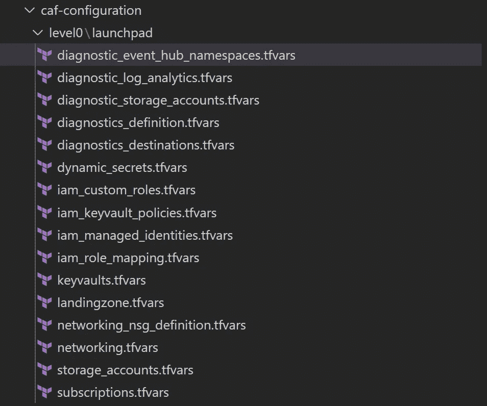

作者照片

让我们用生成上述资源所需的设置来填充它们。

## *landingzone.tfvars*

这是您定义 launchpad 核心配置的地方，从着陆区配置、全局变量、标记等开始。

```
landingzone = {
   backend_type = “azurerm”
   level = “level0”
   key = “launchpad”
}
```

定义将部署着陆区解决方案的区域。

您可以定义两个区域:一个用于部署着陆区本身，另一个用于灾难恢复。

当决定使用哪个区域进行灾难恢复时，最好是根据 [Azure 区域对](https://docs.microsoft.com/en-us/azure/best-practices-availability-paired-regions)做出决定，因为这可以确保 Azure 区域内的 Azure 服务提供最佳的性能和安全性。

在本例中，我们选择了东南亚和东亚，并将东南亚设置为将部署着陆区的默认区域:

```
regions = {
  region1 = “southeastasia”
  region2 = “eastasia”
}
default_region = “region1”
```

定义将用于识别着陆区资源的标签:

```
tags = {
owner          = "CAF"
deploymenttype = "Terraform"
applicationname = "TBD"
costcenter      = "TBD"
dataclassification = "N/A"
department      = "TBD"
env             = "TBD"
networktype     = "None"
operatingsystem = "N/A"
inherit_tags = true
}
```

为所有着陆区级别创建发射台键名:

```
launchpad_key_names = {
  tfstates = [
    "level0",
    "level1",
    "level2",
    "level3",
    "level4"
  ]
}
```

创建资源组以托管各种启动板资源:

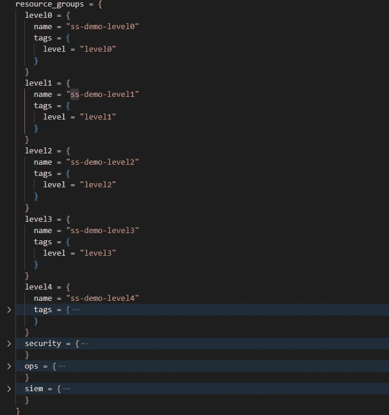

作者照片

## ***diagnostics _ destinations . TF vars***

捕获不同目的地的日志，这些目的地包括存储帐户、日志分析工作区和 eventhub 流。

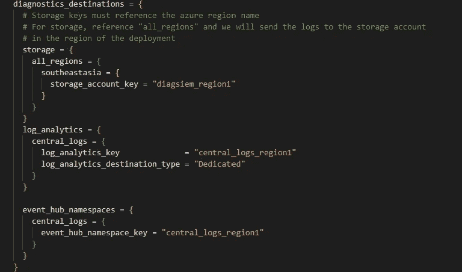

作者照片

## *iam _ managed _ identities . TF vars*

为 Azure DevOps 代理可以用来部署资源的每个级别添加 Azure 托管身份(MSI)。

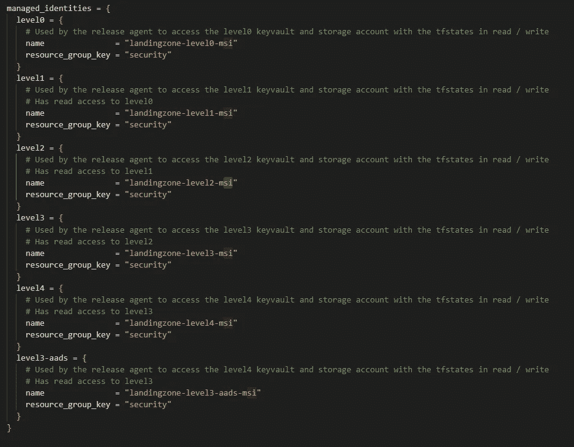

作者照片

## *iam _ role _ mapping . TF vars*

您可以为自己和 MSI 代理添加 RBAC，以便在此代表您部署资源。

那么，您必须向每个服务主体授予哪些权限呢？

## 对于要在其中部署启动板的订阅(已登录的订阅):

1.  "**所有者** " —只有 0 级和 1 级管理身份必须是订阅的**所有者**；**需要 0 级**才能将资源部署到该订阅，需要 1 级才能加入**管理组**，这些管理组稍后将部署到**1 级**管道。要部署着陆区，您还必须被分配所有者角色。
2.  如果您要将登录区资源部署到其他订阅，但保持它们连接到此订阅的登录区，并保留此订阅中的所有. tfstate 文件，则需要“读取器和数据访问”和“密钥库读取器”权限。您将这些角色分配给登录区上层的所有托管身份，即**2 级、3 级、4 级、**等。漫游者代理将使用这些角色来**评估你的着陆区的状态。**

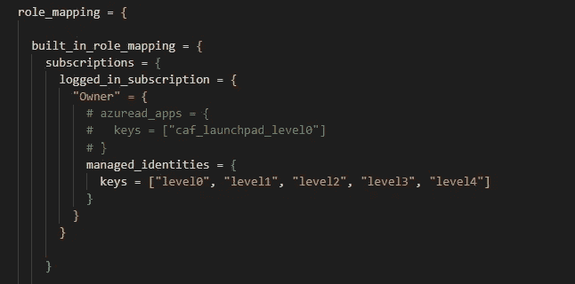

## 对于用来保存所有. tfstate 文件的存储帐户:

1.  **“存储 Blob 数据贡献者”** —所有存储帐户(0 级、1 级、2 级等。)，您通过初始部署的对象 id 为自己分配职位。一旦将部署移交给 Azure DevOps 管道，就可以删除该角色。例如，为了使 0 级托管身份拥有 0 级存储帐户的**“存储 Blob 数据贡献者”**角色，您还必须将该角色分配给该级别的托管身份。

**2。“存储 Blob 数据读取器”** —用于使登陆区上层的代理可以读取登陆区下层的. tfstate 文件。因此，如果**级别 1** 需要来自级别 0 的一些输出，以便创建自己的资源，您可以向存储帐户**级别 0** 授予级别 1 托管身份“存储 Blob 数据读取器”权限。情况并不总是这样，一些着陆区可以完全独立地运行。在这种情况下，我们将“存储 Blob 数据读取器”角色分配给**管理其低级存储帐户的身份。**

有了这些信息，我们用以下设置填充 **iam 角色映射. tfvars** :

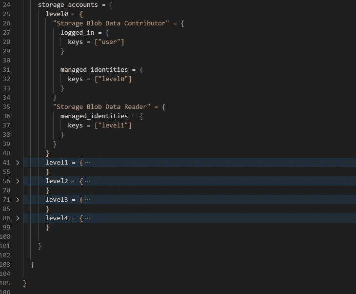

作者级别 1–4 的照片具有与级别 0 类似的代码，管理身份变量映射到其相应的级别

## *keyvault.tfvars*

这是您可以放置密钥库的地方，密钥库将用于存储火星车确定着陆区状态所需的数据。所以，如果你要部署五层降落区，你需要在这里增加五个钥匙库:**0 层、1 层、2 层、3 层和 4 层。**

因为密钥库使用它们自己的**访问策略来控制**谁可以访问存储在其中的秘密，所以我们需要在这里添加额外的创建策略，以便漫游器可以访问它们。

让我们从 0 级钥匙库开始。在这里，您必须授予自己和 0 级 MSI 对机密的完全访问权限，以便您可以执行初始部署，MSI 可以通过管道接管。

因为漫游器使用密钥库来标识自己，而登陆区域已经存在，所以您还必须授予 **["Get "，" List"]** 对所有上级 msi 的权限，在本例中，这些 msi 将是 msi **级别 1、msi 级别 2、msi 级别 3 和 MSI 级别 4。**

所有其他密钥库级别只需要对您自己、级别 0 MSI 和该级别的 MSI(对应于密钥库)的秘密许可。

例如，对于 2 级密钥保管库，您必须向自己、0 级 MSI 和 2 级 MSI 授予秘密权限。

记住这一点，我们如下填充 **keyvault.tfvars** :

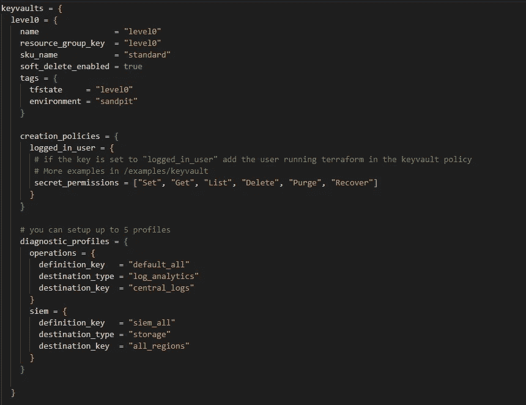

除了映射到相应级别的变量之外，作者级别 1–4 的照片具有与级别 0 相似的代码

## *dynamic_secret.tfvars*

在使用配置创建密钥库之后，我们可以开始向密钥库添加机密；这里所有的值都是探测车用来确定着陆区状态的；按原样粘贴到下面:

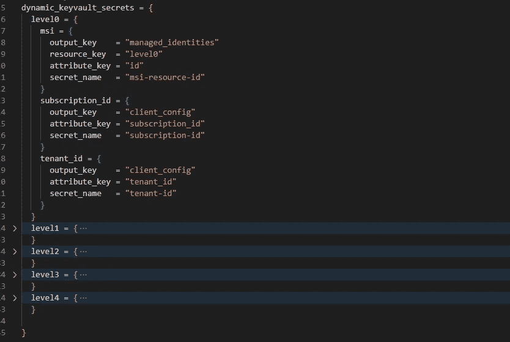

作者级别 1-4 的照片具有与级别 0 相似的代码，映射到其各自的级别

## *storage _ accounts . TF vars*

包括漫游者保存 Terraform 着陆区远程状态文件的存储帐户。这里没有什么特别的，只是为您要部署的着陆区的每个级别添加一个存储帐户，因此对于我们的着陆区，我们为 5 个级别添加了 5 个存储帐户:

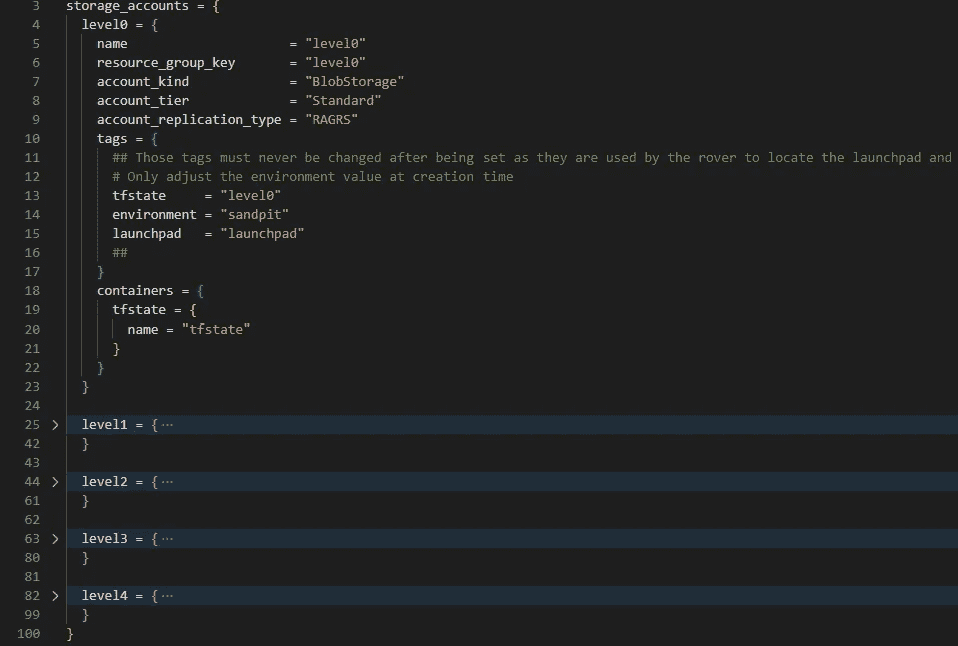

除了映射到相应级别的变量之外，作者级别 1–4 的照片具有与级别 0 相似的代码

我知道时间有点长，但我们就快到了！我们现在只需要创建将用于部署代理的网络资源，我们在:

## *networking.tfvars*

您可以部署 VNET 以及可用于部署各级代理的所有子网，并且可以选择添加 **Bastion 主机**或 **Jump 主机**子网，以便您可以登录到代理并在代理无法正常工作时对其进行故障排除，但是我们将使用**虚拟机规模集**，以便它可以根据需求进行扩展，如果代理出现问题，您可以终止它，它将再次启动。

首先，从客户的可用产品系列中选择一个 CIDR 产品系列，用于我们的 VNET CIDR 产品系列。**最大前缀应该是/24** 。然后，将其分成六个较小的 CIDR 块，每个子网一个。它们之间不应有重叠。

之后就可以填充**联网了. tfvars** 如下:

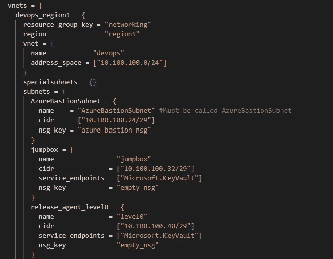

除了映射到相应级别的变量之外，代理 L1-4 的代码与级别 0 类似

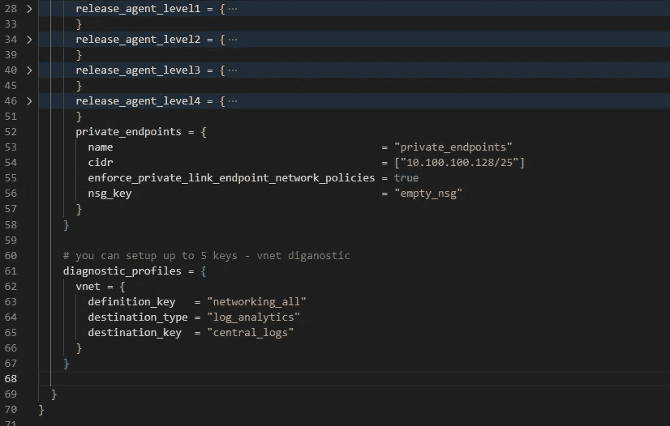

照片由作者发布代理 L1–4 具有与 0 级类似的代码，除了变量映射到上面的相应级别

# 5.部署发射台

现在，您已经完成了配置，您已经准备好部署 launchpad 并开始您的第一个着陆区—运行以下命令:

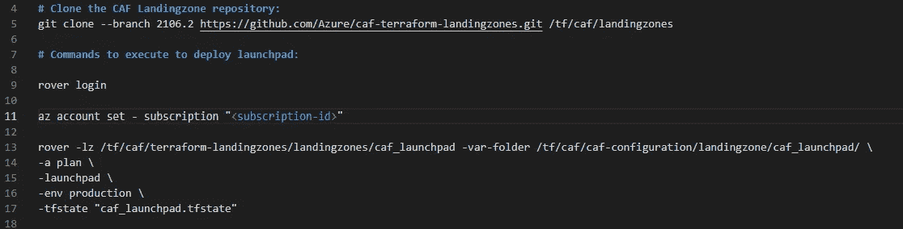

你可能想知道，变量 caf **launchpad.tfstate** 的意义是什么？我们需要将着陆区整合到管道中，如后续博客中所述。

目前，请检查 Terraform 计划的资源，看看是否有错误。如果没有，您可以使用此命令让漫游器代表您部署 launchpad:


> 现在，是时候去喝杯咖啡，让漫游者施展魔法了。在我接下来的博客中，让我们深入探讨第 1 级。

在这里了解我以前的故事:

第 1 部分:[什么是微软 Azure 云采用框架(CAF)？](https://medium.com/@musunurusharmila/what-is-microsoft-cloud-adoption-framework-caf-for-azure-a619bfbedc0e)

第二部分:[azure 云采用框架企业级登陆区终极指南](https://awstip.com/ultimate-guide-for-azure-cloud-adoption-framework-for-enterprise-scale-landing-zone-bba2a385134d?source=your_stories_page-------------------------------------&gi=aa1172cf0255)

第三部分:[如何实现-azure-enterprise-scale-landing-zone-eslz-using-caf-terraform-part-1](https://awstip.com/how-to-implement-azure-enterprise-scale-landing-zone-eslz-using-caf-terraform-part-1-a34c0d75c23b?source=your_stories_page-------------------------------------)

第四部分:[如何使用 caf-terraform-part-2](/how-to-implement-azure-landing-zone-using-caf-terraform-part-2-4c5a06127d05?source=your_stories_page-------------------------------------)

> 请继续关注并关注 [me](https://medium.com/@musunurusharmila/) 获取更多更新。别忘了给我们你的👏如果你喜欢阅读这篇文章来支持你的作者。！！
> 
> 如果你想了解更多，请点击我的链接这里加入打折的 5 美元会员。

