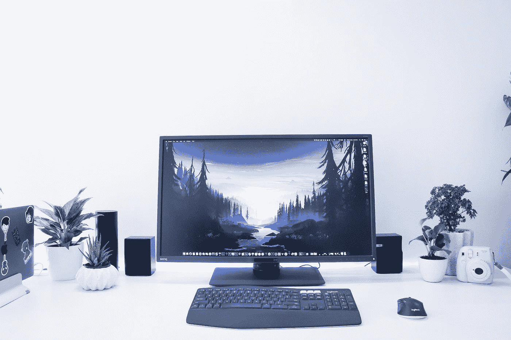
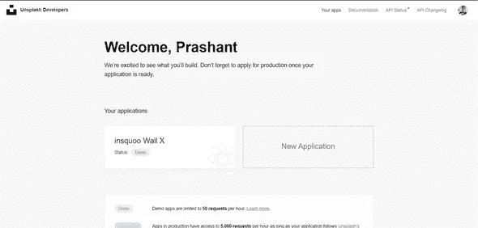
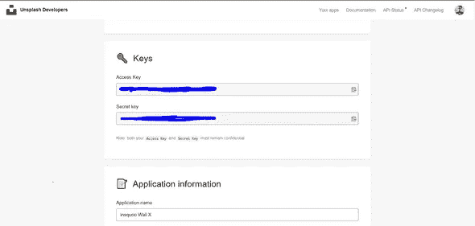
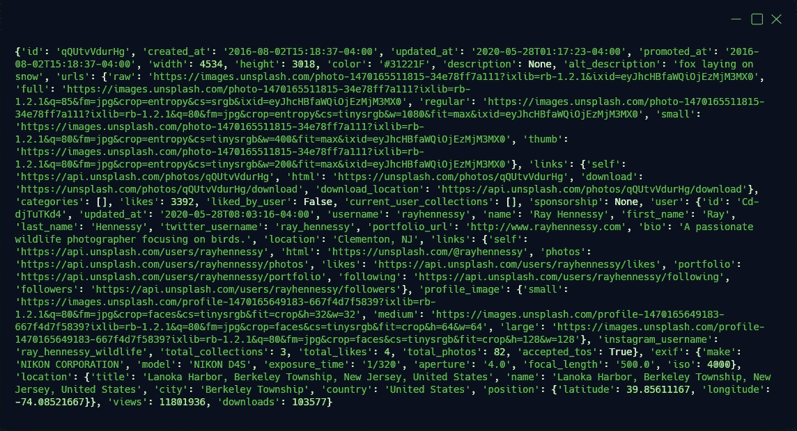
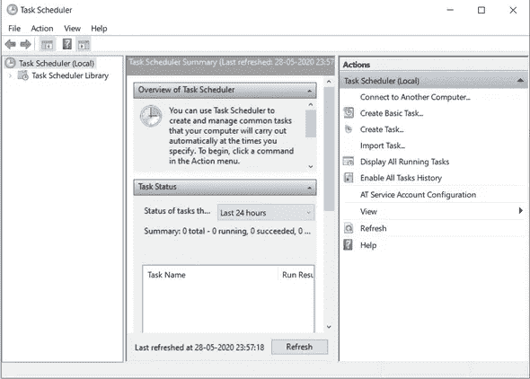
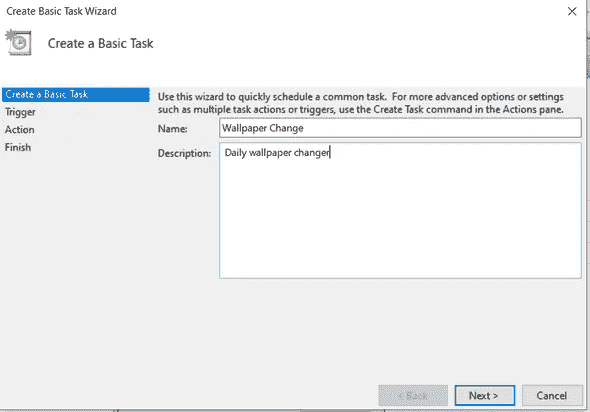
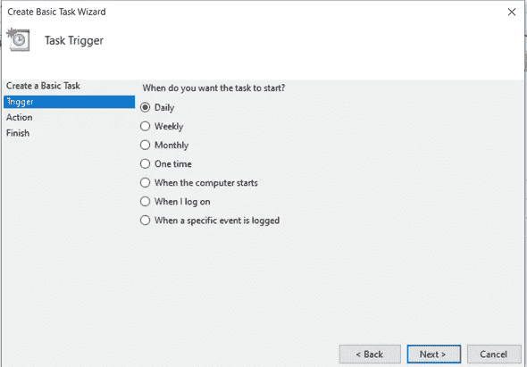
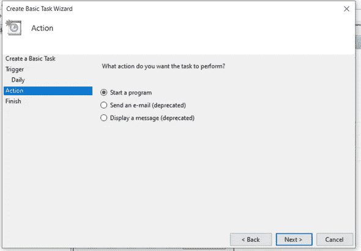
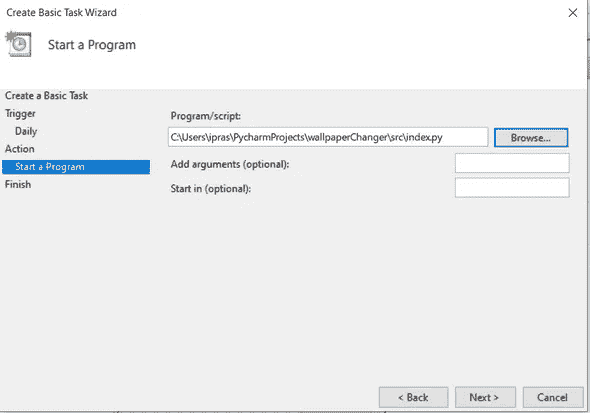

# 如何使用简单的 Python 脚本和 Unsplash API 实现 Bing 的每日壁纸功能

> 原文：<https://blog.devgenius.io/how-to-implement-bings-wallpaper-of-the-day-functionality-using-a-simple-python-script-a50620942385?source=collection_archive---------6----------------------->

## 使用 python 自动从 unsplash.com 获取新壁纸，并将其设置为桌面壁纸



由[萨尼·萨希尔](https://unsplash.com/@sannisahil?utm_source=medium&utm_medium=referral)在 [Unsplash](https://unsplash.com?utm_source=medium&utm_medium=referral) 拍摄的照片

有没有想过打造自己版本的必应每日壁纸？嗯，使用 python，你几乎可以自动化任何任务，包括获取新的壁纸，并将其设置为你的桌面背景。在本教程中，我们将使用 Unsplash 公共 API 来获取漂亮的壁纸，保存到您的文件系统中，并将其设置为您的桌面背景。

那么，我们现在就开始吧。

**要求:**

*   python-3.8
*   Pip — 19.0
*   要求
*   枕头

> 注:枕头和 PIL 不能共存。您必须卸载其中一个，并且只安装一个。

**让我们先安装我们的需求-**

在这里获得 Python [的最新版本。](https://www.python.org/downloads/)

Pip 与 python 发行版打包在一起。

```
python3 -m pip install requestspython3 -m pip install --upgrade pip
python3 -m pip install --upgrade Pillow
```

## UNSPLASH API

**基础 API URL**—[https://api.unsplash.com/](https://api.unsplash.com/)

**API 终点-**

```
GET /photos/random
```

**参数** -

```
query = wallpaper
orientation = landscape
```

我们将使用 Unsplash API 来获取壁纸图像。

*   去[这个](https://unsplash.com/join)链接，注册成为开发者。
*   创建新的应用程序。
*   复制访问和密钥。让他们准备好。



现在，我们准备向 Unsplash 请求图像。

让我们运行下面的代码，并检查 unsplash 的响应。

```
import ctypesfrom PIL import Imagefrom io import BytesIOimport requestsr = requests.get('https://api.unsplash.com/photos/random/?client_id=<YOUR_CLIENT_ID>&query=wallpaper&orientation=landscape')r = r.json()print(r)
```

复制并粘贴您之前获得的访问密钥来代替<your class="mg">客户端 ID >。</your>

这里，我们向`/photos/random`端点发送一个 GET 请求，响应存储在 r 中。然后，我们使用方法`.json()`将响应解析为一个 JSON 对象。接下来，让我们打印出我们的响应来检查它的结构。我们看到以下结果:



如果您仔细观察，我们会发现一个包含子节点**‘download’**的`links`属性。该字段包含下载图像的链接，这正是我们所需要的。

所以，让我们从链接中获取图像-

```
img_link = r["links"]["download"] 
r2 = requests.get(img_link)
```

现在，我们得到的是二进制数据，存储在 r2.content 属性中。我们将使用来自 **io** 模块的`BytesIO()`方法读取我们的二进制数据，并使用来自 **PIL** 库的`Image.open()`打开映像。

最后，把图片保存在你想存放壁纸的地方。

```
i = Image.open(BytesIO(r2.content))save_path = **r**"C:\Users\ipras\Pictures\Saved Pictures\image" + r["id"] + ".jpg"i.save(save_path)
```

**记得将** `**save_path**` **更改为您想要存储图像的目录。**

我们已经走了一半了。现在，我们只需要将下载的图像设置为我们的桌面壁纸。

为此，我们必须以某种方式访问*user32.dll*文件，这是 windows 附带的标准 DLL，包含帮助应用程序创建和实现标准 windows GUI 的 API。

> *注:DLL 代表动态链接库。正如 Windows Dev Docs 上所说的，* **动态链接库(DLL)是一个模块，它包含可以被另一个模块(应用程序或 DLL)使用的函数和数据。Windows 应用程序编程接口(API)是作为一组 dll 实现的，因此任何使用 Windows API 的进程都使用动态链接。**

*user32.dll*包含方法`SystemParametersInfoW`，它允许您访问和设置系统范围的参数，如 SPI_SETDESKTOPWALLPAPERS。

幸运的是，在 python 中，有一个`ctypes`库，它是 Python 的外来函数库。它提供了与 C 兼容的数据类型，并允许您访问共享库或 dll 中的函数。

在同一个文件中编写以下代码。

```
SPI_SETDESKWALLPAPER = 20 ctypes.windll.user32.SystemParametersInfoW(SPI_SETDESKWALLPAPER, 0, save_path , 0)
```

运行脚本，你应该会看到桌面壁纸的变化。

一切都结束了。答对了。！！

我们有 python 脚本，可以从 Unsplash 获取漂亮的壁纸，并将其设置为桌面背景。

以下是完整的代码:

剩下的唯一一件事就是安排 python 脚本每天自动运行。借助 windows 上的**任务调度器**应用程序，这可以轻松完成。

*   打开任务计划程序
*   点击**创建基本任务…**



*   输入任务的名称和描述。



*   选择触发器-



*   现在，选择**启动程序**作为动作。



*   选择您的脚本作为动作脚本。



*   最后，在“完成”选项卡中查看您的任务详细信息，然后单击*完成*。

结束了。现在你的 python 壁纸更换器脚本将在每天的指定时间运行，并因此更新你的桌面壁纸。

如果你想了解更多关于 Unsplash API 的信息，请访问他们的官方文档。有很多事情你可以尝试和实验。如果您想了解更多关于 dll、user32.dll 及其提供的方法，您也可以查阅 Windows 开发人员文档。

感谢阅读，我希望你觉得这篇文章有趣。

*如果你觉得这篇文章有帮助，请点赞并分享。在* [*Medium*](https://medium.com/@iprashant2402) *上关注我，以便在我发布新文章时定期获得更新。也可以在*[*LinkedIn*](https://www.linkedin.com/in/prashant-singh-a51574123)*上联系我，查看我的*[*Github*](https://www.github.com/iprashant2402)*。*

另外，我会很感激你们的任何反馈。

*最初发表于*[*prashantsingh . me*](http://prashantsingh.me/wallpaper-changer/)