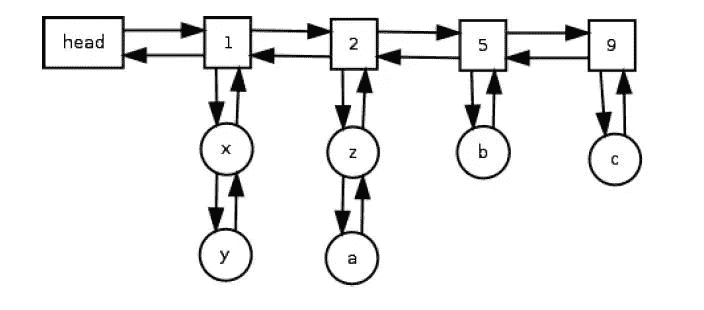

# 如何用 Swift 实现缓存 LFU 算法

> 原文：<https://blog.devgenius.io/how-to-implement-cache-lfu-algorithm-with-swift-a372e107def7?source=collection_archive---------6----------------------->

## 介绍

缓存 LFU(最不常用)类似于字典/哈希表，它以键/值对的形式存储元素。缓存 LFU 算法用于管理有限的存储/内存空间，根据维基百科

> 最少使用(LFU)是一种用于管理计算机内存的缓存算法。这种方法的标准特征包括系统跟踪内存中块被引用的次数。当缓存已满并需要更多空间时，系统将清除引用频率最低的项目。

那么这意味着什么呢？。简而言之，当系统耗尽资源并希望释放一些内存来存储新对象时，它会查看已经存储的对象，并删除最不常用的元素来释放一些空间。

缓存 LFU 是一种缓存算法，这意味着它可以在任何缓存系统中使用(取决于系统需求)。像 CDN **内容交付网络**一样，它可以利用 LFU 来缓存图像/资产，以便为其他用户更快地交付这些图像。

## 先决条件

我将使用双向链表和字典(哈希表)实现缓存 LFU，所以我想你应该熟悉这些数据结构。最好也知道**高速缓存 LRU(最近最少使用)**，但是理解这个算法不是强制性的。

## 它是如何工作的

我们将把我们的数据和它的键存储在一个链表节点中，所以每个节点都有它唯一的值和唯一的键。那么我们如何跟踪每个节点呢？我们还将添加 *frequency* 属性来跟踪每个对象的频率。

主 LFU

头:是我们的缓存，它将跟踪每一个项目

圆圈:表示包含数据(值和键)的节点。

方块:代表链表的头部(上面的数字是它的频率)

当我们第一次将数据添加到缓存中时，其频率为 1，并且对于我们对其进行的任何操作，该频率都会增加，例如检索(读取)其值或更改给定键的相关值。

**#示例**:假设我们的缓存容量为 6 项(如上图)

1.  将(c)添加到我们的缓存中，然后添加(b)，现在(c .)和(b)的频率为 1。
2.  连续 4 次读取(c .)和(b)的值，现在(c .)和(b)的频率为 5。
3.  将(z)和(a)添加到我们的缓存中，现在(z)和(a)的频率为 1。(c .)和(b)仍然在频率 5。
4.  改变(c .)的值，它的频率现在变成 6。然后读它的值三次，现在(c .)频率是 9。
5.  读取(z)和(a)值一次，现在它们的频率是 2，(b)仍然是 5，(c)是 9
6.  将(y)和(x)添加到缓存中，它们的频率现在是 1。当然，旧节点的频率仍然相同。

*   如果你在这些步骤中迷路了(可惜不是视频看不清楚:/)，试着用纸笔直观地模拟这些步骤。

现在我们的缓存充满了 6 个元素，看起来就像上面的图片一样，现在如果我们尝试添加新元素会发生什么呢？。我们的缓存将寻找存储在其中的最小频率(在我们的例子中是 1 ),并获取该频率的列表，并删除其尾部的元素(最少使用的项目)以释放空间。

现在，缓存将从频率 1(最小频率)的列表中删除元素，但是是哪个元素呢？(x)还是(y)？。基本上它会删除(y)，但是为什么呢？因为它是(最近最少使用的)元素。

简而言之，我们先添加(y ),然后添加(x ),所以(x)是列表中最新的元素，而(y)是最老的元素，所以(y)被称为列表中最近最少使用的元素。

如果我们必须从一个有这么多元素的列表中删除元素，我们删除列表中最不常用的(最老的)元素。

## 履行

为了简单起见，我将使用整数作为数据，整数作为这些数据的键，当然您可以指定您想要的数据和键类型，并且可以使它通用，甚至可以存储您的自定义数据类型，但是在这个实现中我将只使用整数。

**#创建链表节点。**

1.  关联值的键。
2.  将被存储的值。
3.  存储节点的频率(跟踪每个节点的频率，当缓存满时，我们将删除频率最低的节点)。
4.  跟踪当前节点的下一个和上一个节点(这是一个双向链表)
5.  用键和值初始化节点，我们还将它的频率设置为 1，因为它是新节点，即将被使用。

现在让我们设计我们的链表。链表可以有各种各样的功能，但我们将创建函数，这将有助于我们的缓存算法，不需要一个完整的链表实现。

这里没有做太多的事情，我们创建了一个名为“list”的链表，它有三个属性“size”来跟踪列表中节点的数量，“head”和“tail”来存储第一个和最后一个元素，以使我们对列表的操作更加简单。

**#添加在前面:**我们需要一个方法在列表中添加一个新元素。我们将它添加到头部以符合缓存 LFU 策略，现在将这段代码添加到我们的 List 类中。

1.  我们让链表头指向新的链表头，并将链表的大小增加 1，我们将这段代码添加到一个“defer”块中，以确保这段代码在函数即将返回时被执行。
2.  我们检查我们的列表是否有一个头(不是 nil ),如果是 nil，我们也为我们的新节点设置尾部,“我们已经在过去的步骤中为新节点设置了列表头”,然后返回，现在新节点同时是列表的头和尾(这将是列表中第一个节点的情况)。
3.  如果列表已经有了一个头，那么我们就把新的节点链接到旧的头。

**# Remove Node:** 这个方法在我们的实现中非常有用，对于两个用例，当我们检索或更改一个值时，现在我们应该增加节点频率，将其从旧列表中删除，并将其添加到一个频率更高的列表中，现在这个方法来拯救。将这段代码添加到 List 类中。

1.  跟踪将被删除的节点的下一个和前一个引用，然后将其下一个和前一个引用设置为零(移除它们)并将列表大小/计数减 1。
2.  当我们从列表中删除一个节点时，我们应该更新列表的头和尾，这一点非常重要，因为被删除的节点可能是列表的尾或头。
3.  我们将前一个节点的 next 链接到被删除节点的 next，将下一个节点的 previous 链接到被删除节点的 previous。

**# Remove Last:** 当缓存已满，想要删除最小频率列表(最少使用)元素中最近最少使用的元素时，这个方法非常有用。将这段代码添加到我们的 List 类中。

1.  我们检查列表是否有尾部，如果有，我们继续，如果没有，返回零。
2.  引用尾部的前一个节点，并使列表尾部引用前一个节点。
3.  检查列表大小是否等于 1，如果是，我们将列表头设置为 0(在这种情况下，列表中没有节点)，然后减少列表大小。
4.  此`tail`的值与`self.tail`的值不同。这是旧的`tail`的值，它来自这个方法开始时`guard`中的可选绑定。

## 缓存 LFU

现在是时候实现我们的缓存了。记住这个*缓存像字典一样存储与键相关的数据*。

1.  我们将把节点(键/值对)存储在这个字典中，以便更快地读取。
2.  在这个字典中，我们将存储包含节点的列表，关键字是列表的频率，值是列表本身。
3.  几个有用的属性将帮助我们跟踪缓存的最大大小、当前大小和最小频率。
4.  用需要的容量初始化我们的缓存。

**# Get Value:** 使用`get`方法，我们可以检索特定键的元素。每当我们检索一个元素，我们应该更新节点的频率(包含我们的元素的节点)。将这段代码添加到我们的 LFUCache 类中。

1.  我们检查“keyNodeDic”字典是否有与给定键相关联的值，如果没有，函数返回-1。
2.  如果 keyNode 字典中有一个值，我们首先在一个名为“updateFreqListDic”的独立函数中更新包含它的节点，这个方法将在后面讨论，然后返回它的值。

**# Put Value:** 通过方法`put`，我们可以为特定的键添加/更新一个元素。将这段代码添加到我们的 LFUCache 类中。

这里发生了很多事情，我们来分解一下。

1.  我们检查缓存容量是否大于 0，以防一些用户用 0 容量实例化我们的缓存类。
2.  我们检查 keyNodeDic(我们的节点存储)中是否存储有与给定键相关联的节点，如果有，我们用新值更新它(节点),然后在“updateFreqListDic”方法中更新节点频率及其列表频率，如果没有，我们继续。
3.  我们检查是否达到了最大值，如果是，我们将获得缓存的最小频率列表。
4.  我们移除列表中具有最小频率的最后一个(最近最少使用的)元素。然后从“keyNodeDic”字典(我们的节点存储)中删除该节点，并将当前大小减 1。
5.  我们将当前大小增加 1(因为我们将要在缓存中存储新元素)。然后将最小频率设置为 1，因为有一个新元素进入我们的缓存。
6.  我们创建一个空链表，然后检查是否有一个与存储在“frequentListDic”字典(我们的列表存储)中的最小频率相关联的列表，如果有，我们将新列表设置为等于该列表，如果没有，我们继续。
7.  我们从给定的键/值对创建新的节点。
8.  我们将新节点添加到列表中(在前面)。
9.  我们将新节点添加到我们的节点存储(keyNodeDic 字典)并更新或添加它的列表到我们的列表存储(frequentListDic 字典)。

**#更新节点:**现在来看我们最后一个更新特定节点的方法。请记住，我们使用这个方法两次，当我们读取一个节点的值和当我们更新一个节点的值。将此代码添加到 LFUCache 类中。

1.  我们从它的旧列表中删除该节点(以将其添加到它的新频率列表中)。
2.  这是重要的一步，我们检查节点的频率是否是最小频率，以及它的列表是否没有元素，如果这两个条件都为真，那么我们将最小频率增加 1，并从“frequentListDic”字典(我们的列表存储)中删除该列表。
3.  我们创建空链表，然后检查是否有与存储在‘frequentListDic’字典(我们的列表存储)中的节点的新频率相关联的列表，如果有，我们将新列表设置为等于该列表，如果没有，我们继续。
4.  我们将节点的频率增加 1。
5.  我们以更高的频率将节点添加到下一个链表中。
6.  我们将更新节点更新/添加到我们的节点存储(keyNodeDic 字典)中，并将它的列表更新或添加到我们的列表存储(frequentListDic 字典)中。

**时间复杂度:**

*   O(1)获取/读取数据。
*   O(1)放新数据。

正如你所看到的，这是这个实现中非常有效的算法，事实上，这个实现是基于 Ketan Shah 教授的论文“实现 LFU 缓存驱逐方案的 O(1)算法”(你可以在这里查看)，其中他们解释了一个 LFU 缓存的实现，其所有操作的运行时复杂度为`O(1)`，包括插入、访问和删除(驱逐)。

这就是我们的缓存 LFU。你可以在 GitHub gist [*这里*](https://gist.github.com/AymanAtallahAhmed/f95483ee7aa7e5ea8ba26bf2f683bad0) *找到完整的代码实现。*

尽管现在我们有大量的内存可供应用程序使用。但我们可能需要容量有限的缓存来节省内存空间，或者将该算法用于需要缓存的系统，如 CDN。

感谢您的阅读。很抱歉我的英语不好，我不是母语(我认为这是显而易见的:D)。

如果你喜欢这篇文章，请给一些掌声，并分享它。祝你愉快，再见。