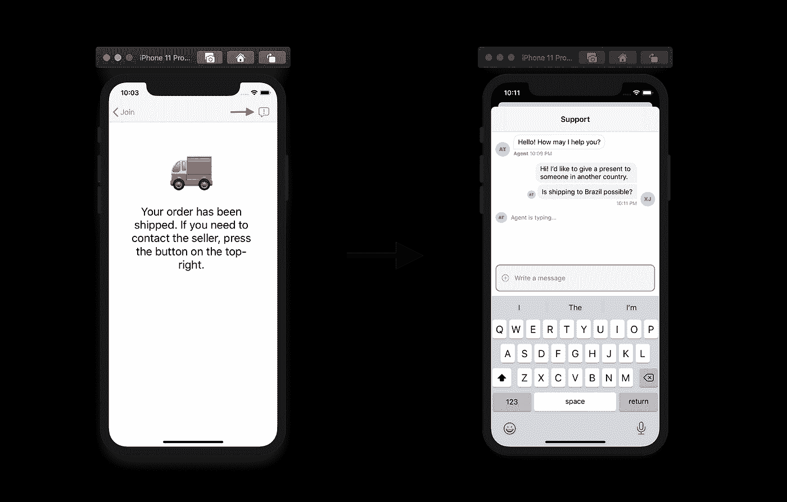
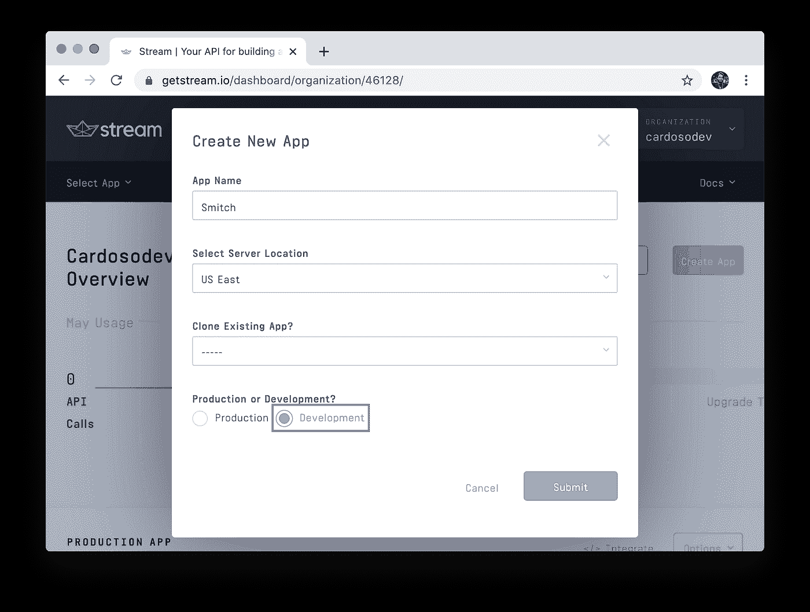
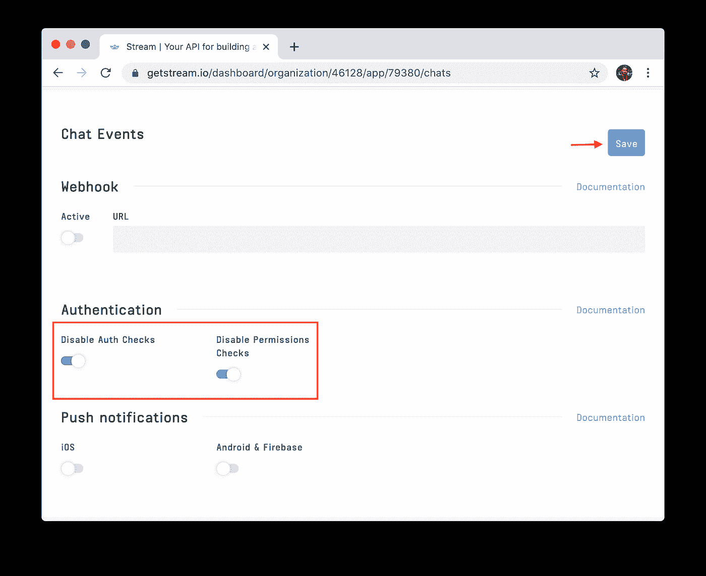
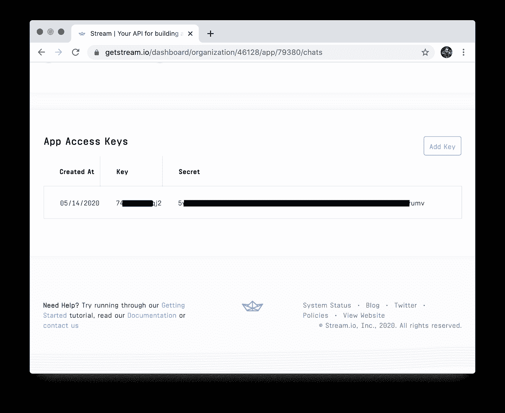
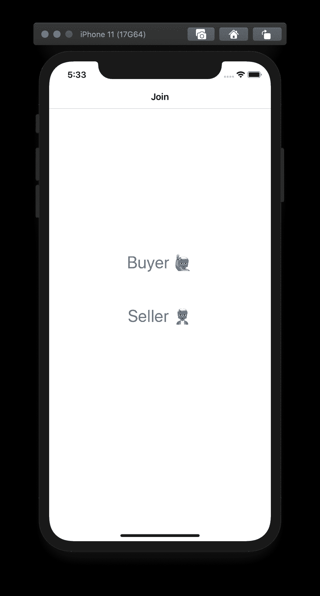
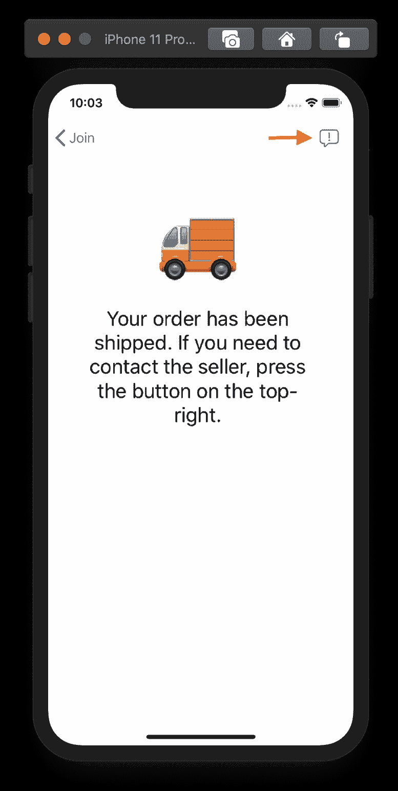
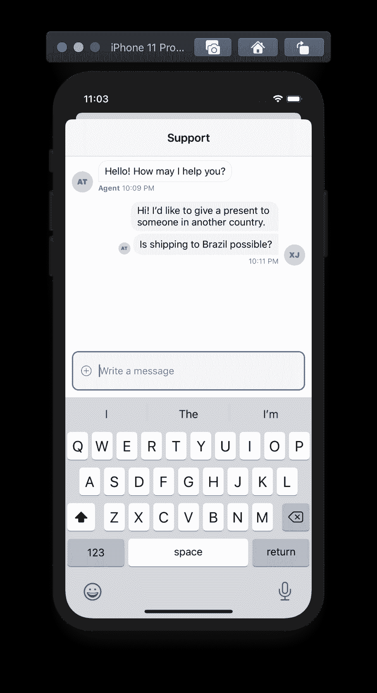
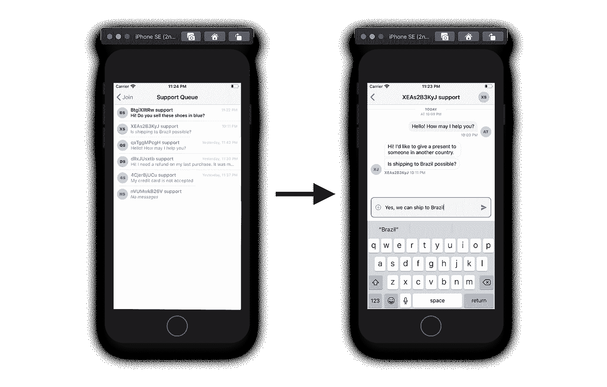

# 如何在你的 iOS 电子商务应用中实现聊天

> 原文：<https://blog.devgenius.io/how-to-implement-chat-in-your-e-commerce-app-for-ios-de4d1c1c7efe?source=collection_archive---------7----------------------->

在本教程中，我们将使用 [Stream Chat 的 Swift SDK](https://github.com/getstream/stream-chat-swift/) 将聊天集成到一个电子商务应用程序中。对于可能需要立即沟通付款、交货状态、最后一分钟的更改和退款的买家来说，这一点至关重要。

这些截图显示了一个按钮，可以进入一个聊天屏幕，买家可以从卖家那里获得实时信息。这是我们要建造的。

如果你在这个教程中迷路了，你可以在这个 [GitHub repo](https://github.com/GetStream/e-commerce-chat-ios/) 中查看已经完成的项目。

# 设置流聊天依赖关系

为了安装[流聊天](https://getstream.io/chat/)依赖项，我们将使用 [CocoaPods](https://cocoapods.org/) 。如果你喜欢 Carthage 或 Swift 包管理器，它们也是受支持的。

在你的项目文件夹中，如果你还没有使用 CocoaPods，运行`pod init`并将`StreamChat`添加到`Podfile`中。它应该看起来像这样:

这样做之后，运行`pod install`，等待它完成，并通过创建的`.xcworkspace`打开项目。

# 配置流聊天仪表板

在 [GetStream.io](https://getstream.io/) 注册，创建应用，确保选择开发而不是生产。

现在为了简单起见，让我们禁用授权检查和权限检查。确保点击保存。当您的应用程序处于生产状态时，您应该保持启用这些功能。

你可以在这里看到关于认证[的文档，在这里](https://getstream.io/chat/docs/tokens_and_authentication/?language=swift)看到关于权限[的文档。](https://getstream.io/chat/docs/chat_permission_policies/?language=swift)

现在，保存您的 Stream 凭据，因为我们将在下一步中需要它们来支持应用程序中的聊天。由于我们禁用了 auth 和 permissions，我们现在只需要密钥，但在生产中，您将在后端使用这个秘密来[实现适当的身份验证，为流聊天](https://getstream.io/docs/auth_and_permissions/)颁发用户令牌，这样用户就可以安全地与您的应用程序进行交互。

如你所见，我把钥匙涂黑了。你应该确保保管好你的凭证。

# 配置流聊天 SDK

现在我们已经设置了项目和流聊天仪表板，让我们使用您在上一步中获得的流聊天应用程序的密钥来配置 SDK 的 singleton。`AppDelegate.swift`中的`didFinishLaunchingWithOptions`函数应该类似于下面的代码片段。

这将配置`Client.shared`实例，流聊天 UI 组件将使用该实例调用[流聊天 API](https://getstream.io/chat/) 并订阅事件。

# 创建加入屏幕

让我们开始构建“加入”屏幕。这个屏幕由两个`UIButton`实例组成。一个作为买方加入，另一个作为卖方加入。当然，为了使本教程更短，更快地了解聊天功能，这是一种过于简化的做法。在你完整的应用程序中，你需要适当的注册，数据库，等等。你也可能想要为卖家准备一个单独的应用程序。对于本教程，屏幕将类似于下面的截图。

转到故事板，选择默认的视图控制器，并点击`Editor > Embed In > Navigation Controller`。这将把它放在一个导航控制器下，我们将使用它导航到下一个屏幕。

确保将`ViewController`重命名为`JoinViewController`，这样你就不会在以后混淆。你可以通过右击`ViewController.swift`中的`ViewController`并选择`refactor`来轻松实现。

为了使事情简单，让我们像这样离开故事板，从现在开始只使用代码。为了设置这两个按钮，我们需要在`JoinViewController.swift`中使用下面的代码:

这些代码设置了我们需要的视图、约束和处理程序。让我们从扩展`JoinViewController`来定义`setupViews`开始:

该代码将创建按钮并将它们添加到控制器的视图中。接下来，我们需要定义三者之间的约束。让我们通过扩展`JoinViewController`来定义`setupConstraints`来做到这一点:

该代码将确保`buyerButton`位于屏幕中央，而`sellerButton`位于其下方。现在我们需要设置用户按下按钮时的处理程序。让我们通过扩展控制器来再次定义`setupHandlers`:

该代码将使得当买方按钮被按下时，呈现一个`BuyerViewController`，当卖方按钮被按下时，呈现一个由流聊天提供的`ChannelsViewController`，供卖方查看开放的支持渠道。此外，我们使用下面的字符串扩展为买家生成一个随机 id。

在真实的应用程序中，这通常是在注册和登录过程中定义的。

我们将在下一步创建`BuyerViewController`。

# 创建买方屏幕

现在，让我们创建一个代表常规应用程序的屏幕，常规买家可以通过该屏幕访问支持聊天。不同的应用程序有许多方式来访问它们的支持系统，例如浮动按钮和菜单项。在本教程中，我们将在导航栏中引入一个打开支持聊天的按钮。它看起来将类似于下面的截图。

第一步是创建一个 BuyerViewController.swift 文件并粘贴下面的代码。

这些代码设置了我们需要的视图和处理程序。让我们从扩展`JoinViewController`来定义`setupViews`开始:

该代码将把支持按钮放在导航栏的右上角。然而，我们仍然需要为按钮的按下定义处理程序。让我们通过定义`setupHandlers`来做到这一点:

该代码将创建一个消息通道，并呈现一个由 Stream Chat 提供的`ChatViewController`，它将具有我们聊天所需的所有行为。

如果你是卖家，你将能够看到买家创建的所有渠道，并访问每个渠道的聊天屏幕。

# 电子商务聊天已完成

恭喜你！您已经通过流聊天为您的电子商务应用程序实现了功能性聊天系统的基础。我鼓励你浏览一下 [Stream Chat 的文档](https://getstream.io/chat/docs/introduction/?language=swift)，尝试一下你刚刚构建的项目。

*最初发布于*[*https://getstream . io*](https://getstream.io/blog/e-commerce-chat-ios/)*。*