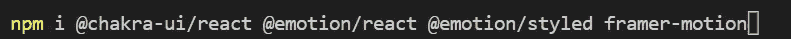
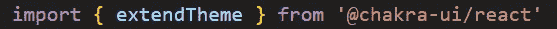
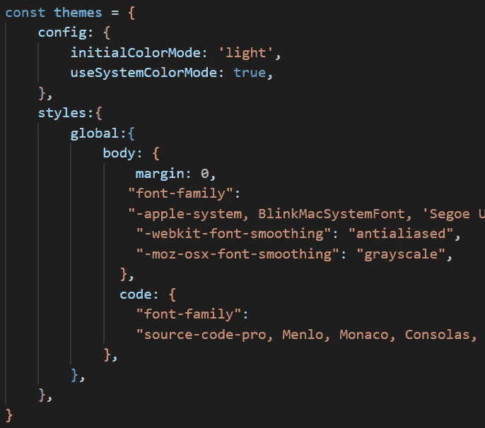
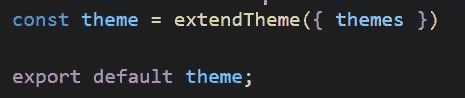
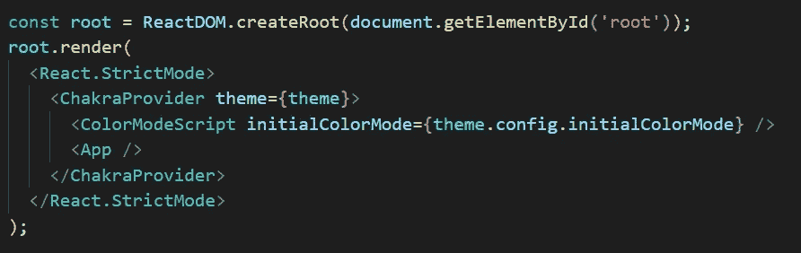
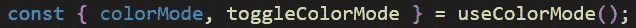
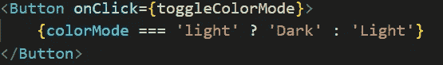
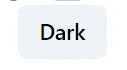
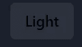

# 如何在 React 中实现黑暗模式

> 原文：<https://blog.devgenius.io/how-to-implement-dark-mode-in-react-43e6e5885c0a?source=collection_archive---------6----------------------->

黑暗模式已经成为许多应用程序和网站的流行功能，因为它有利于用户体验。在项目中实现黑暗模式是一项有用的技能，使用 ReactJS 和 Chakra UI 可以很容易做到。在本教程中，我将在 Chakra UI(ReactJS 的一个库)的帮助下，完成在 react js 项目中实现黑暗模式的必要步骤。本教程结束时，你将拥有一个可以在明暗模式之间切换的网站。

照片由[劳塔罗·安德烈亚尼](https://unsplash.com/@lautaroandreani?utm_source=medium&utm_medium=referral)在 [Unsplash](https://unsplash.com?utm_source=medium&utm_medium=referral) 上拍摄

# 第一步

在本教程中，我们将使用 Chakra UI 库及其内置函数在 ReactJS 中实现黑暗模式。

要开始使用 Chakra UI，您需要通过在终端中运行以下命令将其安装到您的项目中:“NPM I @ Chakra-UI/react @ emotion/react @ emotion/styled framer-motion”。

关于查克拉 UI 的更多信息:【https://chakra-ui.com/

装置

现在安装了查克拉界面，我们准备开始实施黑暗模式。

# 第二步

下一步是创建一个 Theme.js 文件，我们将在其中定义我们的主题信息。

在 Theme.js 中首次导入:

theme.js 中的导入

接下来，打开 index.css 文件。这个文件是在 React 应用程序制作过程中生成的。从该文件中复制信息并将其存储在剪贴板中，现在可以将其从 index.css 中删除。

导航回 theme.js 并创建一个 const，它将由两部分组成。第一部分是 config，我们将在这里设置一些配置。第二部分是从“style:”和“body:”中的 index.css 文件复制的信息，如下所示。

配置也由两部分组成，两个变量，initialColorMode，它将决定哪个模式是默认的。那么第二个变量 useSystemColorMode 应该在这里设置为 true。

theme.js 中的主题常量

要在代码的其他部分访问这个常量，我们必须导出它:

extendTheme 是 ChakraUI 的一个功能。

# 第三步

要启用黑暗模式，请将“ColorModeScript”及其显示的属性添加到 index.js 文件中。在脉轮元素周围有“脉轮提供者”是必要的，如下所示。

索引. js

# 第四步

要为黑暗模式添加一个切换开关，请找到要放置开关的组件，并使用 Chakra UI 提供的“使用颜色模式”功能使“颜色模式”保持不变。

使用颜色模式

PS:记得从 ChakraUI 导入“useColorMode”。

接下来，创建一个按钮并添加“toggleColorMode”作为它的 onClick 操作:

按钮示例

通过这样做，您将创建一个切换按钮，根据当前主题显示“暗”或“亮”，并允许用户通过单击按钮在两种模式之间切换。

按钮的示例

一旦在您的应用程序中实现了切换开关，用户应该能够通过单击按钮在暗模式和亮模式之间切换。网站的外观应该随之改变。

希望这篇教程对你有所帮助，并且你现在能够创建一个动态的、用户友好的、能够在明暗模式之间切换的网站。祝你的项目好运，如果有不清楚的地方，请在评论中提问。保重！