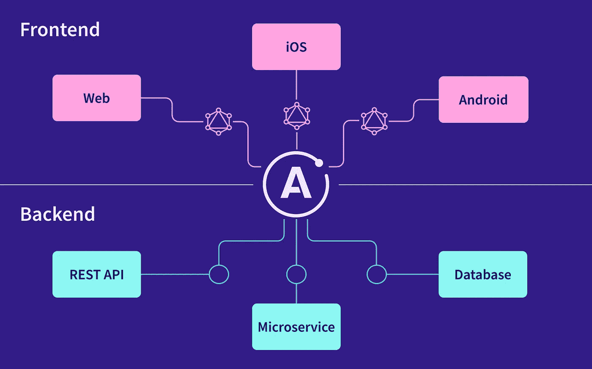
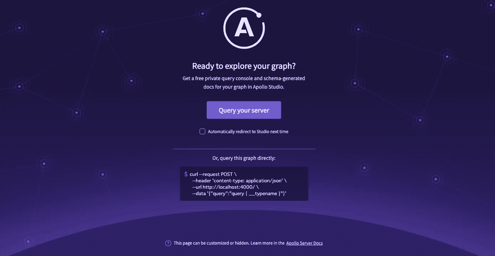
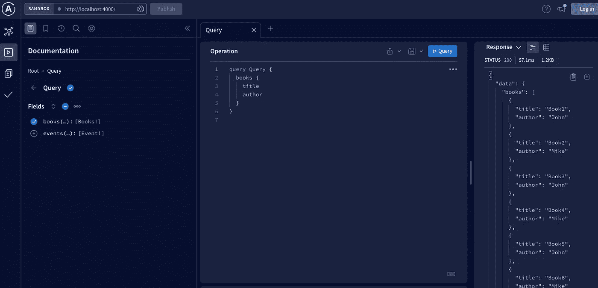
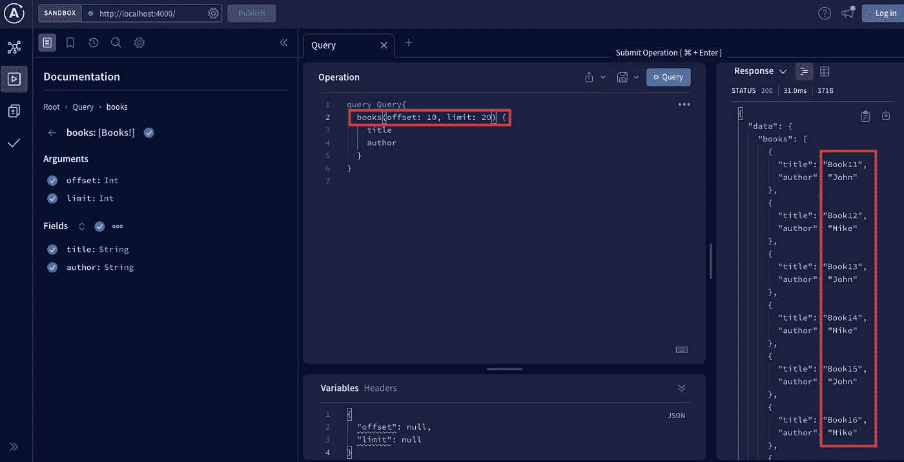
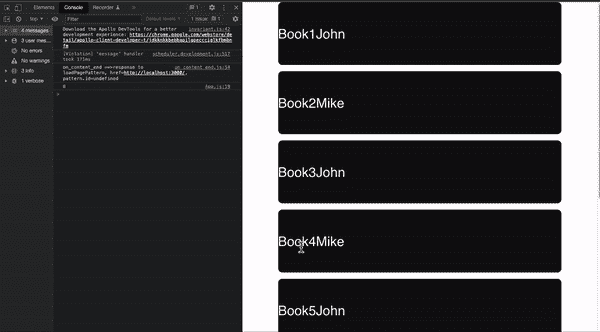

# 如何利用阿波罗客户端的获取更多和反应来实现无限滚动

> 原文：<https://blog.devgenius.io/how-to-implement-infinite-scroll-with-apollo-clients-fetch-more-and-react-376d6ad8bba6?source=collection_archive---------0----------------------->


来自[https://github.com/apollographql/apollo-client](https://github.com/apollographql/apollo-client)的图像

# 目的

我最近实现了与阿波罗客户无限滚动，我花了一些时间，我会与你分享它，以避免腰围的时间。此外，我想通过使用阿波罗服务器创建自己的虚拟数据，所以希望它也有所帮助。

# 阿波罗客户是什么？

Apollo client 是一个全面的 JS 状态管理库。在本文中，我将解释与反应。最重要的部分是缓存，可以避免从服务器端获取不必要的数据。该库非常有用，因为它不仅可以通过使用缓存获取数据、更新数据，还可以用作状态管理库，例如 Redux、反冲、Zustand。

# 什么是阿波罗服务器？

阿波罗服务器在一个开放源码的图书馆，它可以连接任何你想连接的东西。

下面的图片来自官方文件，这张图片显示的是阿波罗服务器。



来自[https://www.apollographql.com/docs/apollo-server/](https://www.apollographql.com/docs/apollo-server/)的图片

在本文中，我将更多地关注示例。让我们深入研究这个例子。

注意:您可以选择基于偏移量的分页或基于光标的分页。这不是本文的重点，但是用例是不同的。就无限滚动而言，你可以使用两种方式，我使用了基于偏移的方式，因为它比另一种更简单。

# 例子

# 前半部分:后端阿波罗服务器

1.  创建您的项目(项目名称由您决定)

```
mkdir apollo-inifinite-scroll-backend
cd apollo-inifinite-scroll-backend
```

2.用 npm 初始化 node.js 项目。如果你想推动 github，你需要创建。git 忽略文件并写入“node_modules”(可选)。您的项目包含“package.json”文件

```
npm init -y
```

3.安装一些依赖项并创建一个基本索引文件

```
npm install apollo-server graphql touch index.js
```

4.定义您的 graphql 模式和解析器。简单地说，我遵循简单的例子(书本)。但是你想改变你想用的任何东西。您需要将偏移和限制传递给查询类型，并使用解析器创建偏移和限制的逻辑。最后，有必要使用这两者来创建一个服务器。

5.如下所示创建您的数据。

```
export const booksBasic = [
  {
    title: "Book1",
    author: "John",
  },
  {
    title: "Book2",
    author: "Mike",
  },
  {
    title: "Book3",
    author: "John",
  },
... same structure, I omitted it(but I have 36 books data)
```

6.在你的终端上使用下面的命令运行服务器，你会看到下面的句子。

```
node index.js 🚀 Server ready at [http://localhost:4000/](http://localhost:4000/)
```

7.访问" localhost:4000 "，可以看到如下图所示的屏幕



8.点击上面屏幕上的“查询你的服务器”按钮，你可以使用 graphql 的沙箱！！这一次我们有了书名和作者，所以你可以写一个如下图所示的查询。



9.您可以使用偏移和限制来设置范围。基本上偏移意味着“开始”，限制意味着“结束”。所以如果你想选择 10 到 20 的图像，你可以设置偏移 10，限制 10，就像下面的图像一样。



好了，我们都完成了后端。所以我将创建一个前端。

# 下半年:前端阿波罗客户

1.  使用创建反应应用程序设置您的环境(项目名称是可选的)。

```
npx create-react-app apollo-inifinite-scroll-frontend
cd apollo-inifinite-scroll-frontend
```

2.安装一些依赖项。我使用 react-insersection-observer 来检查和重新提取浏览器屏幕是否在底部，但是您也可以使用另一个(例如，您可以自己编写 handle scroll，或者使用 react-infinite-scroller-component)

```
npm install @apollo/client graphql react-intersection-observer
```

3.如下所示，在 index.js 中设置您的 apollo 客户端。您需要通过使用“offsetLimitPagination”将缓存类型策略设置为使用基于偏移量的分页。并创建一个带有 uri 和缓存的新客户端。注意，这个 uri 是我们在前半部分创建的“阿波罗服务器 uri”。最后，你需要用新客户端的 apollo provider 包装你的应用。

4.创建您的查询从后端获取数据。当我们在 Apollo 服务器上创建图书，标题和作者查询时。您可以创建如下所示查询。

5.创建 app.js 来显示查询。我会解释卡的部分，所以不要担心。您需要导入您在步骤 4 中创建的查询。并与 useQuery 一起使用。你可以得到一些像数据一样的价值，fetchmore。在这种情况下，数据和获取更多是强制性的，加载和错误是可选的。你还需要设置变量和偏移量，限制。正如我已经解释过的，offset 是开始，limit 是结束，所以在这段代码中每次加载 8 张卡。你可以将你的数据映射到卡片上，并使用 inview 来观察浏览器底部是否有更多的图书卡片。在这种情况下，我扩大了每次获取更多的限制。

6.创建一张卡片。这部分完全取决于你，你可以创建卡片，图像，…等。你也可以设计它。在我的例子中，我使用模块 css 和 scss。然而，这是完全可选的。

7.搞定了。你可以看到如下所示的屏幕。很难找到工作，所以我设置了关于数据长度的 console.log。正如你可能注意到的，长度的数量每增加 8，这意味着完美的工作！！不错！！！



# 结论

在这篇文章中，我分享了如何使用 fetch more 以及如何使用自己创建的真实端点实现无限滚动的知识。实际上获取更多的功能不是旧的，所以很难找到合适的信息给我。我花了很多时间去搜索和尝试，所以我希望这篇文章能帮助你，避免浪费时间。

# 参考

官方文件(阿波罗服务器):[https://www.apollographql.com/docs/apollo-server/](https://www.apollographql.com/docs/apollo-server/)

官方文件(阿波罗客户端):https://www.apollographql.com/docs/react/

Apollo 客户端中的分页和无限滚动:[https://www . apollographql . com/blog/Apollo-client/pagination/pagination-and-Infinite-Scrolling/](https://www.apollographql.com/blog/apollo-client/pagination/pagination-and-infinite-scrolling/)

如何用 GraphQL 和 React 实现无限滚动:[https://sysgears . com/articles/how-to-implementation-infinite-scroll-with-graph QL-and-React/](https://sysgears.com/articles/how-to-implement-infinite-scroll-with-graphql-and-react/)

React + GraphQL + Apolloで無限スクロール(Offset-based): [https://qiita.com/sinno999/items/9fdee6ccae40435999bf](https://qiita.com/sinno999/items/9fdee6ccae40435999bf)

GraphQLのページネーション機能を実装する方法：Apollo client + express-graphql: [https://sterfield.co.jp/programmer/graphql%E3%81%AE%E3%83%9A%E3%83%BC%E3%82%B8%E3%83%8D%E3%83%BC%E3%82%B7%E3%83%A7%E3%83%B3%E6%A9%9F%E8%83%BD%E3%82%92%E5%AE%9F%E8%A3%85%E3%81%99%E3%82%8B%E6%96%B9%E6%B3%95-apollo-client-express-graph/](https://sterfield.co.jp/programmer/graphql%E3%81%AE%E3%83%9A%E3%83%BC%E3%82%B8%E3%83%8D%E3%83%BC%E3%82%B7%E3%83%A7%E3%83%B3%E6%A9%9F%E8%83%BD%E3%82%92%E5%AE%9F%E8%A3%85%E3%81%99%E3%82%8B%E6%96%B9%E6%B3%95-apollo-client-express-graph/)

感谢您的阅读！！