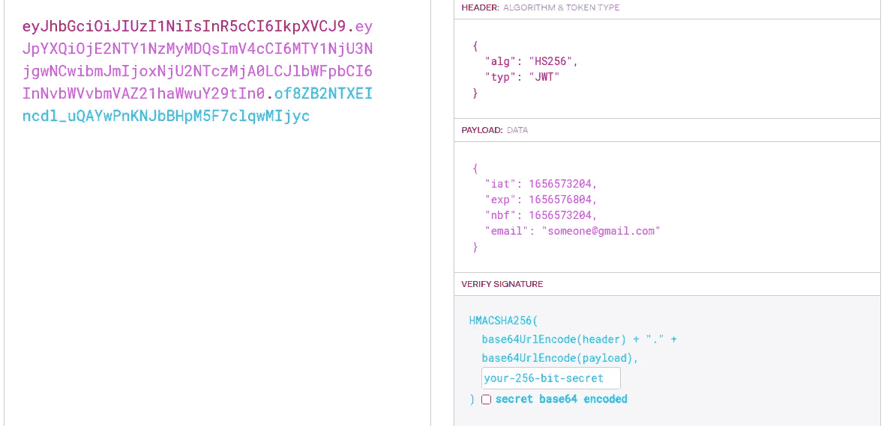

# 如何使用 Jwt_simple crate 在 Rust 中实现 JWT

> 原文：<https://blog.devgenius.io/how-to-implement-jwt-in-rust-using-jwt-simple-crate-5dfce8f15b64?source=collection_archive---------9----------------------->

当你在这里阅读这篇文章的时候，你一定已经熟悉了这样一个事实:rust 已经连续三年成为[栈溢出](https://stackoverflow.com/)中最受欢迎的编程语言。但是，你能在网上找到所有关于你的困惑的答案吗？尤其是那些愚蠢的，有时是最复杂的。我采访了一位有着超过 10 年开发经验的高级开发人员，他告诉我有时他也面临在 rust 中实现逻辑的问题。

但这是为什么呢？我的个人观点——rust 是一种系统编程语言，就像每一种系统语言一样，rust 也有一个艰难的学习曲线，了解 Rust 的人不多，互联网上的 Rust 用户更少，答案和教程更少。但是 rust 仍然比其他语言好得多。为什么？[查看这里](https://www.turing.com/blog/rust-is-the-most-popular-programming-language/#:~:text=Rust%20offers%20excellent%20documentation.,fast%20and%20safe%20by%20default.)


在我们继续之前，我假设您熟悉基本的 rust 数据类型以及 rust 包管理器和 jwt 是如何工作的。

让我们生锈吧！！

打开你最喜欢的目录，里面有你所有的 rust 代码，打开一个终端，输入“cargo new rust_jwt”。移动到新创建的文件夹，打开你最亲爱的代码编辑器(VS Code 是我的选择)，然后进入 cargo.toml 和这些依赖项。

```
//cargo.toml[dependencies]jwt-simple = "0.10"
serde = "1.0.115"
```

我将带你了解它们。

首先，我们需要 [jwt-simple](https://crates.io/crates/jwt-simple) 库来实现 jwt 令牌功能，比如验证和签名。

第二，我们需要 serde 来序列化和反序列化 rust 原生数据类型，以便将它们转换成 json 并解析回原生数据类型。

现在，在 src/main.rs 文件中粘贴以下代码

```
//src/main.rsuse serde::{Serialize,Deserialize};
use jwt_simple::prelude::*;fn main(){

  let key = HS256Key::generate();
}
```

HS256key 是一个 rust struct 类型，它创建一个 hs256 密钥和一个算法来创建和解析令牌。

但是每次运行这个函数它都会生成一个新的 hs256 密钥，它使用一个内部随机函数来生成字节。

但幸运的是，您还可以将键值存储到. txt 文件中的字节中，并从文件中检索它们。这样，你就可以确保每次函数执行时都有相同的键。

以下是你可以做到的

清除 main.rs 中的所有文件，粘贴这个文件，并在终端上粘贴“货物运行”,然后按 enter 键。

```
//src/main.rs
use std::fs::File;

use jwt_simple::prelude::*;fn main(){let key = HS256Key::generate();
     let byte_data = key.to_bytes();

     let f = File::create("key")
     .expect("Unable to create  file");let mut f = BufWriter::new(f);
     f.write_all(byte_data).expect("Unable to write data");
}
```


执行上述程序后，您必须在根文件夹中看到一个名为“key”的文件

太好了！！现在你已经创建了你自己的 hs256 密匙，以字节数据的形式存储，它将在程序的生命周期中保持不变。

现在，您可以从用于签名和验证的文件中导入一个密钥，而不是生成一个新的密钥。


到目前为止一切顺利。

现在您已经将自己的密钥存储在一个文件中，您可以从该文件中导入它。现在在 main.rs 旁边创建一个新文件，它将使用定制的有效负载对 jwt 进行签名。

```
‘touch src/jwt_sign.rs’
```

在 jwt_sign.rs 文件中粘贴以下代码

```
//jwt_sign.rsuse jwt_simple::prelude::*;
use std::io::BufReader;
use std::fs::File;
use serde::{Serialize,Deserialize}; //a custom payload with serialization must be made#[derive(Serialize, Deserialize)]
pub struct CustomClaim {
email:String
}pub fn create_jwt(email:String)->String {let f = File::open("key").expect("error reading key file");let reader = BufReader::new(f);let buffer = Vec::new();let key = HS256Key::from_bytes(&buffer);let customclaim = CustomClaim{email:email};//duration of the time token will be valid forlet time = Duration::from_hours(1u64);let claim = Claims::with_custom_claims(customclaim, time);let token = key.authenticate(claim).expect("fail to create token");token
}
```

没有得到正确的代码？

当然我会带你穿过去

首先，我们创建了一个包含有效负载信息的结构，它应该实现 serde serelize 特征，这样它就可以被解析成 json。然后，我们从“key”文件中读取字节，并从该字节数据中生成一个新的密钥。

请记住，我们只是使用电子邮件作为有效载荷。您可以通过修改 CustomClaim 结构来选择您想要的任何内容。

这将返回一个将“CustomClaims”作为一般数据的结构，它看起来像这样

```
pub struct JWTClaims<CustomClaims> {
    pub issued_at: [Option](https://doc.rust-lang.org/nightly/core/option/enum.Option.html)<[UnixTimeStamp](https://docs.rs/jwt-simple/0.11.0/jwt_simple/prelude/type.UnixTimeStamp.html)>,
    pub expires_at: [Option](https://doc.rust-lang.org/nightly/core/option/enum.Option.html)<[UnixTimeStamp](https://docs.rs/jwt-simple/0.11.0/jwt_simple/prelude/type.UnixTimeStamp.html)>,
    pub invalid_before: [Option](https://doc.rust-lang.org/nightly/core/option/enum.Option.html)<[UnixTimeStamp](https://docs.rs/jwt-simple/0.11.0/jwt_simple/prelude/type.UnixTimeStamp.html)>,
    pub issuer: [Option](https://doc.rust-lang.org/nightly/core/option/enum.Option.html)<[String](https://doc.rust-lang.org/nightly/alloc/string/struct.String.html)>,
    pub subject: [Option](https://doc.rust-lang.org/nightly/core/option/enum.Option.html)<[String](https://doc.rust-lang.org/nightly/alloc/string/struct.String.html)>,
    pub audiences: [Option](https://doc.rust-lang.org/nightly/core/option/enum.Option.html)<[Audiences](https://docs.rs/jwt-simple/0.11.0/jwt_simple/claims/enum.Audiences.html)>,
    pub jwt_id: [Option](https://doc.rust-lang.org/nightly/core/option/enum.Option.html)<[String](https://doc.rust-lang.org/nightly/alloc/string/struct.String.html)>,
    pub nonce: [Option](https://doc.rust-lang.org/nightly/core/option/enum.Option.html)<[String](https://doc.rust-lang.org/nightly/alloc/string/struct.String.html)>,
    pub custom: CustomClaims,
}
```

您可以参考这个[链接](https://docs.rs/jwt-simple/0.11.0/jwt_simple/claims/struct.JWTClaims.html)来了解更多关于这个 struct 及其功能的信息，并根据需要向 struct 添加更多数据。

现在我们可以用“key.authenticate”来签署声明，它将返回一个字符串。

现在在你的 main.rs 上调用 create_jwt 函数，用一些随机的电子邮件作为参数

```
//src/main.rsmod jwt_sign;
use jwt_sign::{create_jwt};use std::fs::File;

use jwt_simple::prelude::*;fn main(){ let key = HS256Key::generate();
     let byte_data = key.to_bytes();

     let f = File::create("key")
     .expect("Unable to create  file"); let mut f = BufWriter::new(f);     f.write_all(byte_data).expect("Unable to write data");

     print!("{}",create_jwt("someone@gmail.com".to_string());}
```

在运行 main.rs 或者你的项目二进制入口点后，你会看到一串随机字符，复制这个字符串并粘贴到 [jwt.io](https://jwt.io/)



这一定是输出。


那是工作

一些提示

[Crates.io](https://crates.io/) 是一个快速增长的锈板条箱库，你几乎可以为你的工作找到许多板条箱。

当你在你的项目中使用一些外部机箱时，仔细检查机箱的实现并阅读文档。你会了解很多关于板条箱及其内部工作，这将很容易融入你的项目。

板条箱只是 Rust 项目的第三方库。