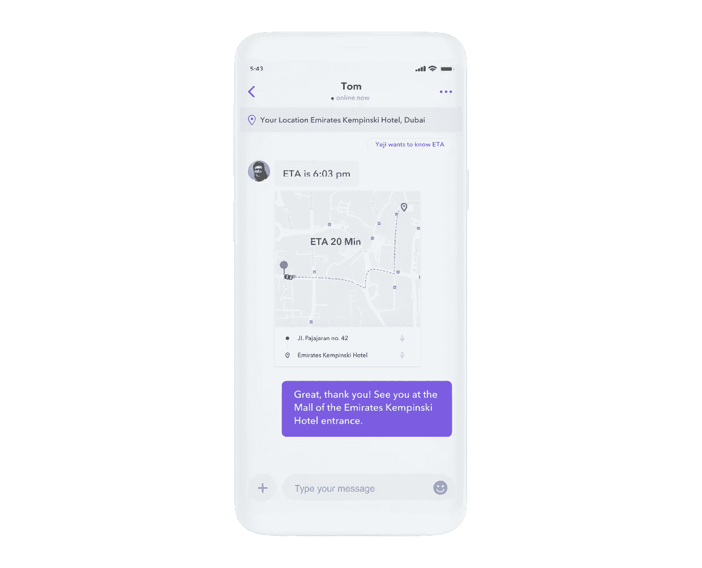

# 如何在 Android 上实现地图预览和位置共享

> 原文：<https://blog.devgenius.io/how-to-implement-map-previews-and-location-sharing-on-android-5743a747f37c?source=collection_archive---------8----------------------->

2022 仙鸟

## 允许用户使用 Google Play 服务地图 SDK 发送显示其位置的聊天地图

解决方案工程师| [Sendbird](https://www.sendbird.com/)

*如需更多指导，请参见我们的* [*文档*](https://sendbird.com/docs/desk/v1/android/guides/link-preview) *。你可能还想看一个仙鸟聊天的*[*demo*](https://sendbird.com/demos/in-app-chat)*。查看此* [*页面*](https://sendbird.com/features/chat-messaging) *了解更多关于仙鸟聊天的信息。*

> *成为第一个了解新教程、开发者相关聊天/电话发布以及其他重要更新的人，* [*注册*](https://get.sendbird.com/dev-newsletter-subscription.html) *我们的开发者简讯。*

# 介绍

应用内位置共享和地图预览提供了一种与朋友和服务提供商交流地理位置的有效方式。它们消除了到达某个位置的方向的任何模糊性，并让用户安心，同时允许用户监控旅行的进度。例如，位置共享简化了送货服务人员的生活，并提高了他们的客户在查询时发送其位置的满意度。

地图和信息是协调实时互动的绝佳方式。奥美集团副主席、《炼金术:在品牌、商业和生活中创造魔法的黑暗艺术和奇特科学》一书的作者罗里·萨瑟兰提醒我们，为什么优步地图是[魔法](https://www.youtube.com/watch?v=iueVZJVEmEs)。他称之为:

“…一个心理上的幻想，因为它并没有减少等待出租车的时间，只是让等待的沮丧感减少了 90%。”罗里·萨瑟兰

正如您所猜测的，该功能特别适用于以下行业的应用:

*   交通和拼车
*   交付和物流
*   食品或杂货递送
*   其他消费品交付
*   线上到线下服务

这个简单的教程将带你通过易于理解的消息内地图预览实现位置共享。

请注意，本指南假设您已经使用 Sendbird SDK 实现了 chat。如果您还没有，请查看[文档](https://sendbird.com/docs/chat/v3/android/quickstart/send-first-message)或[本教程](https://sendbird.com/developer/tutorials/build-chat-uikit-android)以了解如何做到这一点。

我们开始吧！💻

# 在 Sendbird 中实现位置共享和地图预览

当用户按下“分享位置”按钮时，Android 的`LocationManager`类提供用户的地理坐标。Sendbird 在一个`UserMessage`中发送他们的位置，其中`CustomType`被设置为 location。发送消息后，通过其适配器插入`RecyclerView`。基于`MessageType(UserMessage)`和`CustomType(location)`,`layoutInflater`展开一个包含`MapView`的自定义视图。最后，您将地理坐标添加到`MapView`中。

请注意，使用 Google Play 服务地图 SDK，用户可以在应用内聊天中分享他们的位置，而接收者可以在 Google Maps 中打开该位置。Sendbird 以易于理解的预览方式显示地图，以便快速浏览。

要实现位置共享和地图预览，请执行以下步骤:

*   了解 Android 上位置共享和地图预览的先决条件(如下所述)
*   获得使用用户位置的权限
*   声明您的 API 访问令牌和对地图的依赖
*   创建发件人和收件人的布局
*   检索用户的位置
*   在`UserMessage`中发送用户的位置
*   通过检查自定义类型来处理收到的消息，并将其绑定到视图

# 位置共享和地图预览的先决条件

再次重申，本指南假设您已经使用 Sendbird SDK 实现了 chat。查看[文档](https://sendbird.com/docs/chat/v3/android/quickstart/send-first-message)或[本教程](https://sendbird.com/developer/tutorials/build-chat-uikit-android)了解更多信息。

请注意，本指南中的代码使用 Sendbird 的 SyncManager SDK 来发送和接收消息。

您将需要:

*   Sendbird Android SDK
*   Google Play 服务地图 SDK
*   [一个谷歌 API 访问令牌](https://developers.google.com/maps/documentation/android-sdk/get-api-key)

注意:

*   如果你使用的是 Android 的内置模拟器，请注意它可能不会显示你的位置。

其他资源:

*   谷歌官方地图指南
*   使用地图的谷歌官方示例应用程序

# 步骤 1:获得使用用户位置的许可

要使用位置共享，您需要获得使用用户位置的权限。

在运行时请求此。为了简洁起见，本指南省略了运行时代码。

相反，它显示权限，如`AndroidManifest.xml`所示。

# 步骤 2:声明您的 API 访问令牌，并为 maps 添加一个依赖项

在`AndroidManifest.xml`中声明您的 API 访问令牌。

在应用级`build.gradle`文件中添加一个地图依赖。

# 步骤 3:为发件人和收件人创建布局

创建聊天双方的布局，即发送方和接收方。本指南将它们区分为“我”和“其他”，其中“我”代表发送者，“其他”代表接收者。两者都应该包含一个`MapView`。

查看每个布局的完整要点。

我(发件人):

其他(收件人):

注意:

本指南跳过了设置`recyclerview`，设置按钮监听器等的实现。您可以在本要点中查看示例代码。

# 步骤 4:检索用户的位置

从`LocationManager`检索地理坐标。当用户决定共享他们的位置时，就会发生这种情况。

# 步骤 5:在用户消息中发送用户的位置

一旦获得经度和纬度，就以`UserMessage`的形式发送它。为了表明这是一个位置，将单个消息上的`CustomType`设置为“位置”

接下来，通过将消息添加到适配器，将消息插入到`RecyclerView`中。

完整的实现见下文。

# 步骤 6:将视图绑定到客户视图持有者

将消息添加到适配器之后，在绑定视图之前检查消息类型。通过覆盖`getItemViewType`来做到这一点。

基于`getItemViewType`返回的内容，根据消息是属于“我”(发送者)还是“其他”(接收者)，展开布局。

接下来，将视图绑定到您的`custom viewHolder`。

在您的自定义`viewHolder`中，实现`OnMapReadyCallback`，并覆盖`onMapReady`函数。

您可能会发现查看完整的适配器代码非常有用。

# 结论

就这样结束了！通过 Sendbird 的地图预览和位置共享实施，您的用户现在可以发送显示他们位置的地图，从而改善与他人的交流，并使他们的应用程序体验更具魔力。

编码快乐！💻

> *为了第一时间了解新教程、与开发者相关的聊天/电话发布以及其他重要更新，* [*注册我们的开发者简讯*](https://get.sendbird.com/dev-newsletter-subscription.html) *。*