# 如何使用 intersectionObserver 在 React 应用程序中实现简单的 onScroll 动画。

> 原文：<https://blog.devgenius.io/how-to-implement-simple-onscroll-animations-in-your-react-applications-with-intersectionobserver-96ffb3e95482?source=collection_archive---------13----------------------->

这在开发任何 web 应用程序时都是普遍存在的，当用户滚动时创建动画。

根据 sofware craftmanship 手册，理想情况是使用尽可能少的第三方模块来设计您的功能，使用健壮可靠的代码，随着项目的进展，您可以简单地重用这些代码。

在本教程中，我将解释如何使用自定义钩子和一些 css 关键帧来制作页面动画。

我在我所有的项目中使用这种技术，它工作得非常好，并且被所有的浏览器和移动设备支持。

这个 tuto 的最终结果:

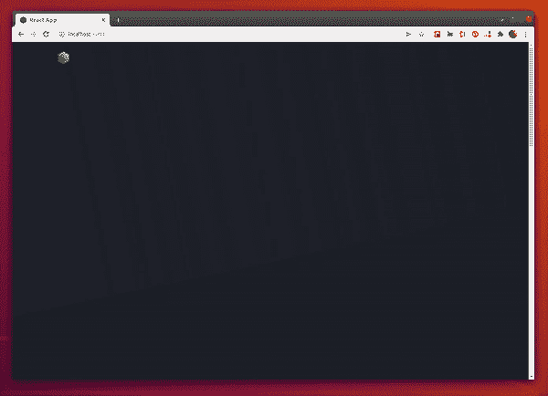

现场演示:[https://intersectionobserver-demo.netlify.app/](https://intersectionobserver-demo.netlify.app/)

你准备好了…我们走吧！

首先，转到我为本教程创建的存储库…在 startTemplate 分支，您会发现一个没有任何动画的 SPA React 模板，以便一步一步地按照步骤克隆或下载源文件。

[https://github . com/rodolphe 37/intersection _ observer _ animation _ tuto/tree/start template](https://github.com/rodolphe37/intersection_observer_animation_tuto/tree/startTemplate)

然后在代码编辑器中打开项目，对于这个项目，我使用 VScode。

像其他经典的 react 应用程序一样，在你的控制台中安装依赖项。

通过纱线启动(或 npm 启动)启动项目。

你眼前有这个(带任何动画):

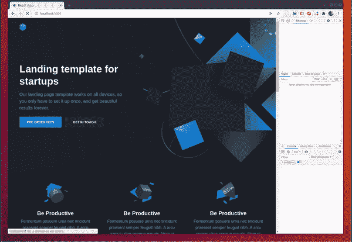

这个项目的结构非常简单，

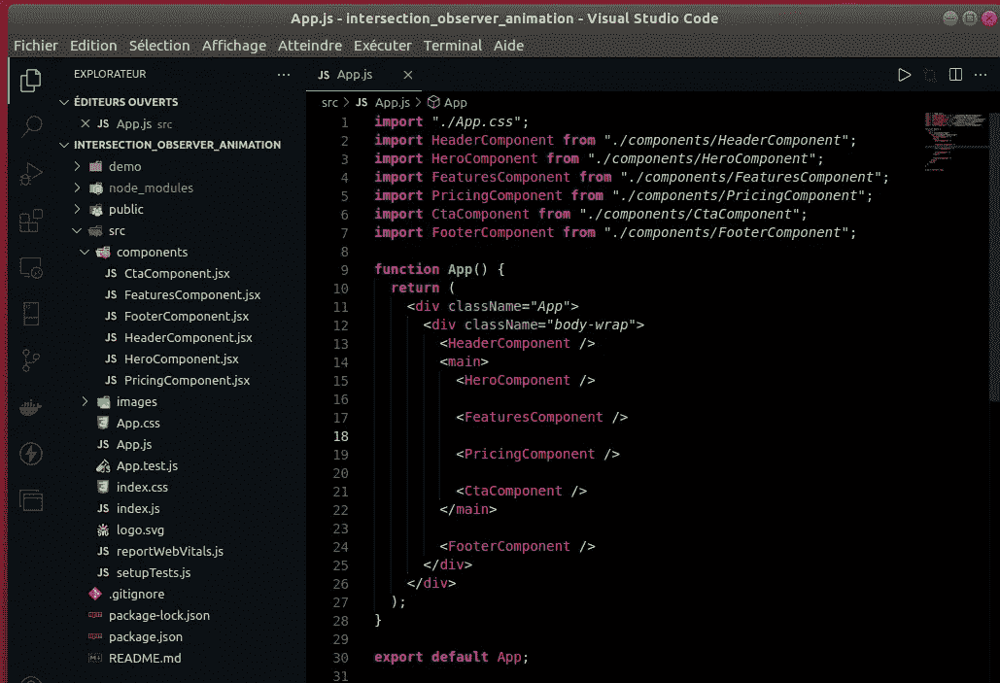

包含一些组件的 React 项目(CRA)的基本结构。

在/src 文件夹中，创建一个 hooks 文件夹，然后在这个新文件夹中创建一个 useIsInViewport.js 文件。

在这个文件中，我们将创建一个定制钩子，包含在你的项目中运行 css 动画所需的逻辑。

定制钩子是实践“关注点分离”的好方法(另一种干净的代码范例——将逻辑与返回 jsx 的组件分离。)

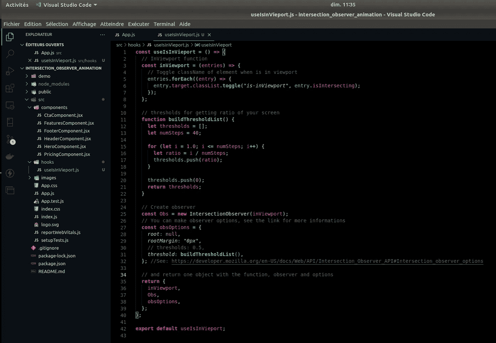

动画的所有逻辑

之后，转到 App.js 文件

您需要调用自定义挂钩，以便 react 考虑它。

为此，我们调用了非结构化数据的定制钩子
，然后我们创建了一个 useLayoutEffect 函数来实例化逻辑和需要动画的 html 元素之间的链接。

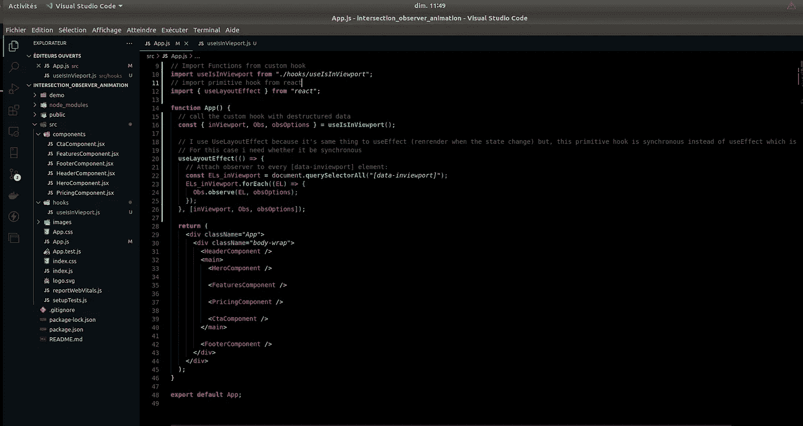

在这一步中，我们将添加本教程其余部分所需的 css 代码。

首先，我实现了场景图，当元素可见或不可见时，有不同的延迟和不同的动画。

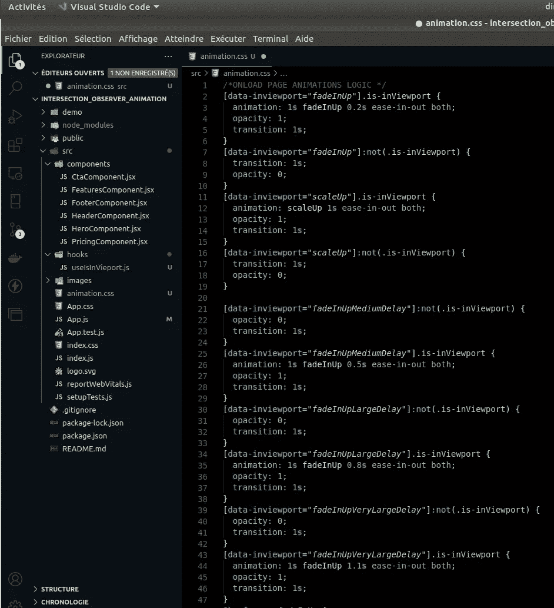

然后我创建这个例子需要的关键帧。

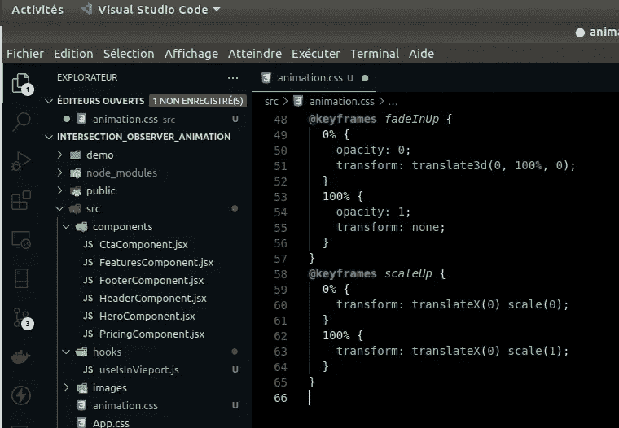

当然，你可以放你想要的关键帧/动画，一旦你明白了其中的逻辑，你就可以根据你的意愿自定义这个方法。

然后，在最后一步，我将在选定的元素上实现动画。

让我们从组件 HeroComponent.jsx 开始

我在具有“hero-inner”类的 div 上放置了一个 data-inViewport= "所需的关键帧"。

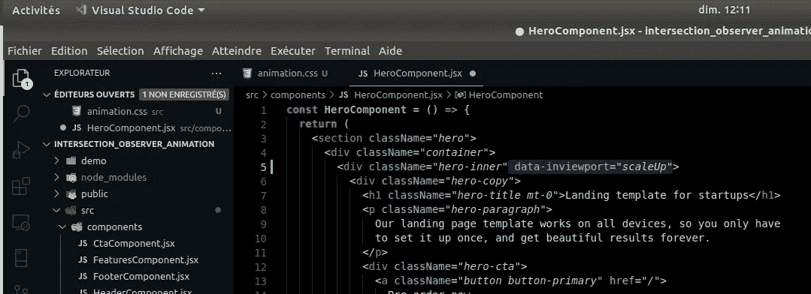

然后，FeaturesComponent.jsx，
我将 data-inViewport 设置为每个具有类名“feature text-center”的 div。
然而，我为每个块设置了不同的延迟，第一个和第四个块的延迟为 0.2s，

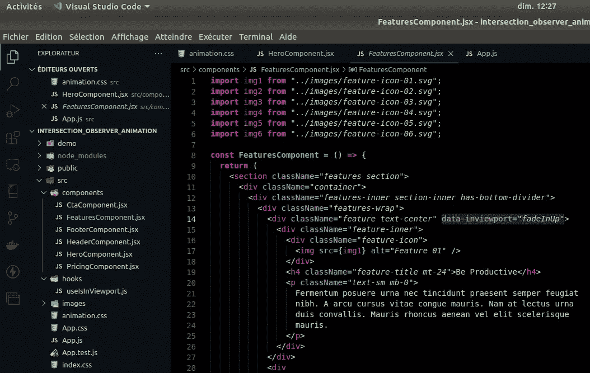

第二个和第五个具有 0.5 秒的延迟，

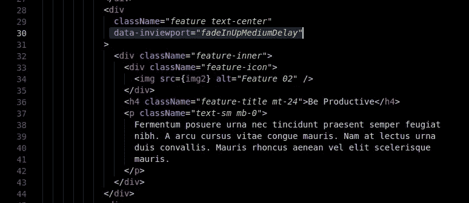

并且第三和第六块具有 0.8s 的延迟，以便具有轻微的瀑布效果。

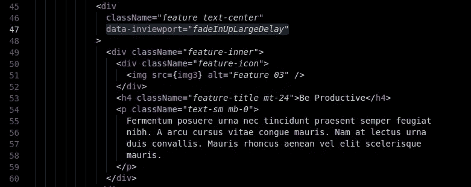

然后是 pricingComponent.jsx，
我为标题和段落添加了一个动画，为 pricing-tables-wrap 元素添加了另一个动画。

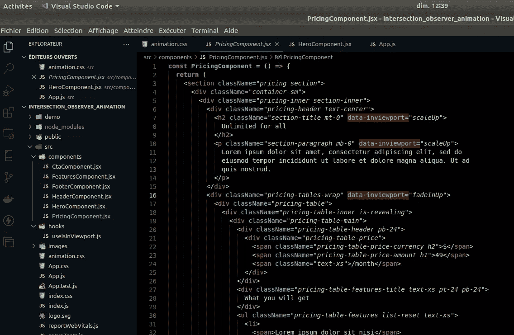

然后，来了 CTA component . jsx……

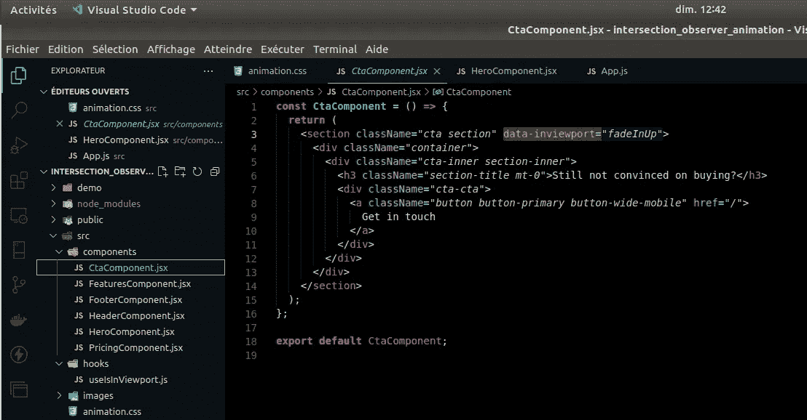

最后是 FooterComponent.jsx

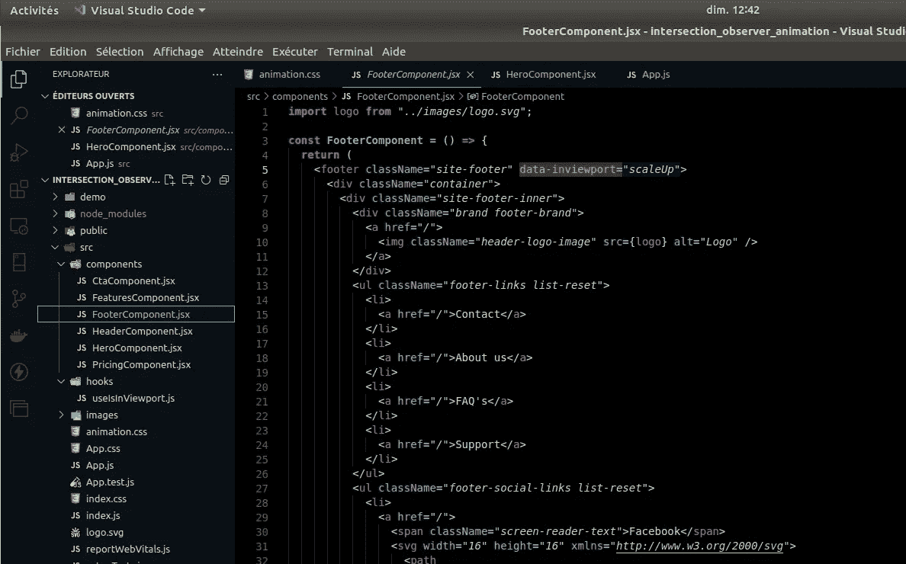

有了它，你就会理解这个解决方案的逻辑和简单性。

这件芭蕾舞裙成品的存放处:

[https://github . com/rodolphe 37/intersection _ observer _ animation _ tuto/tree/main](https://github.com/rodolphe37/intersection_observer_animation_tuto/tree/main)

享受这个世界。