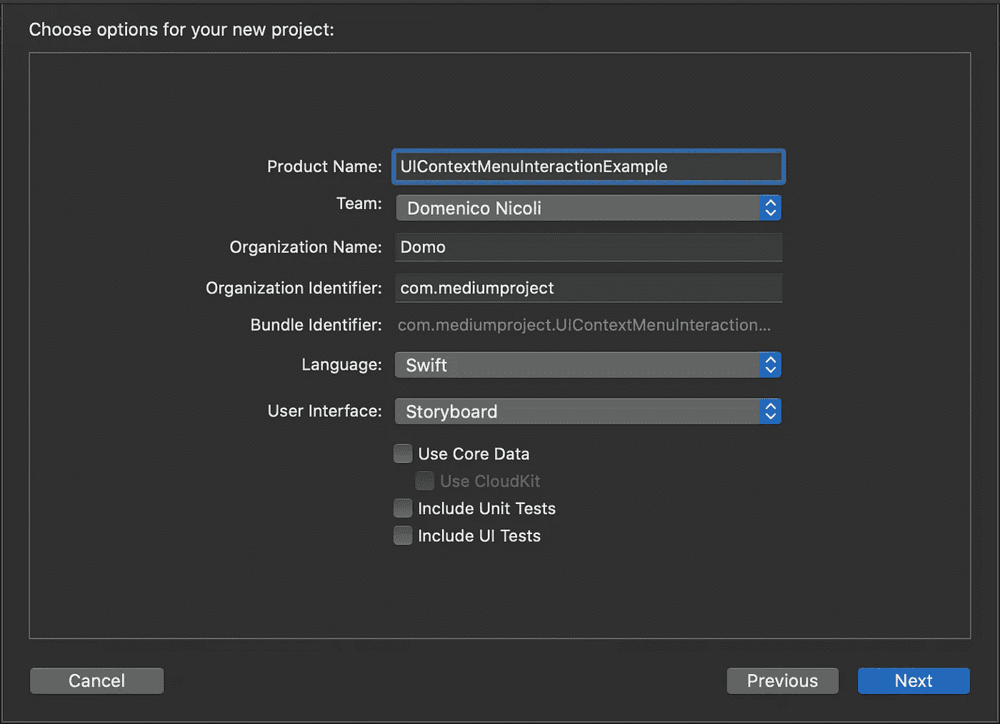
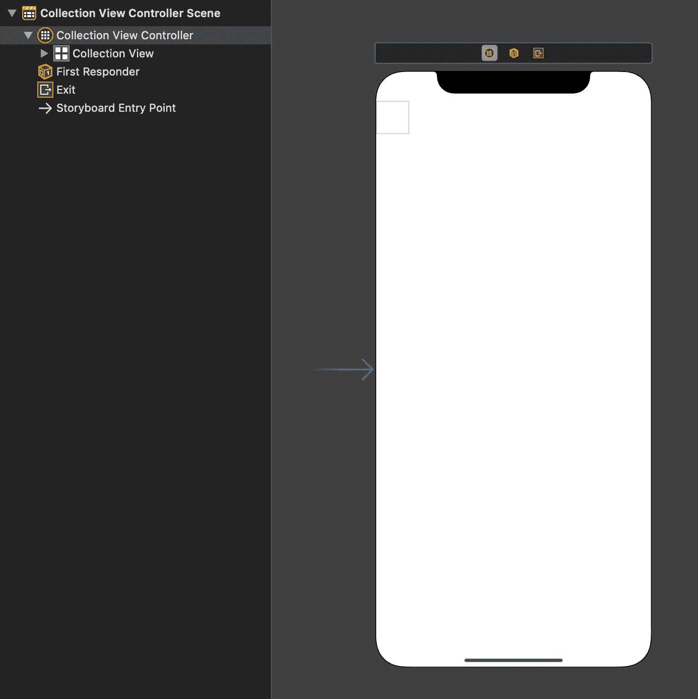
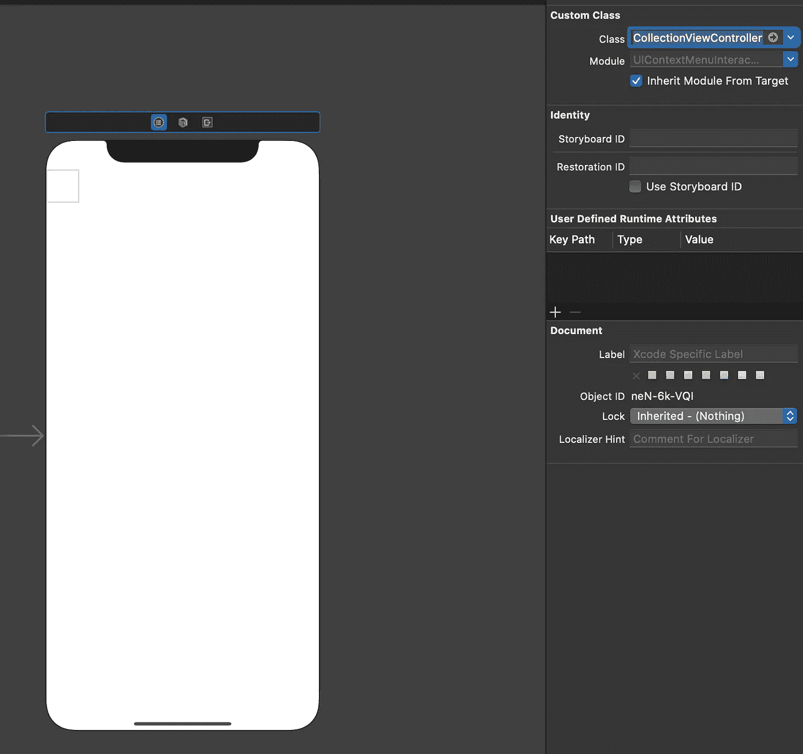
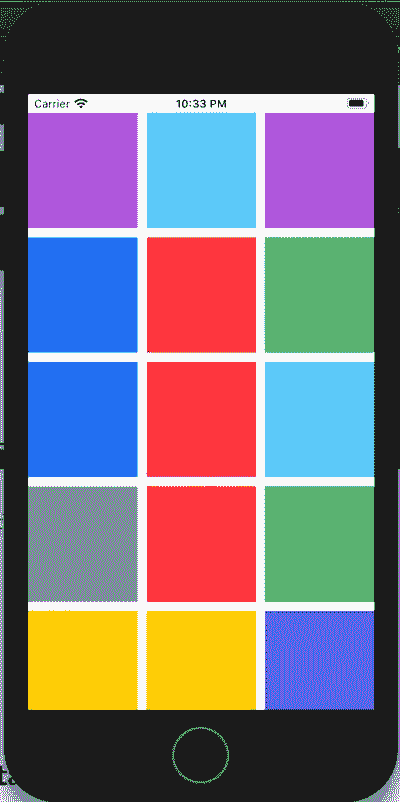
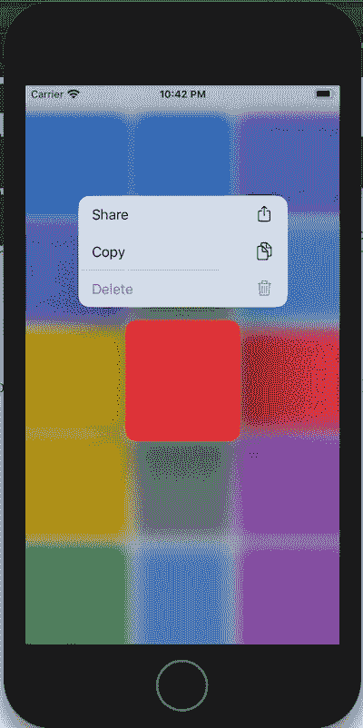

# 如何在 Swift 中实现 UIContextMenuInteraction

> 原文：<https://blog.devgenius.io/how-to-implement-uicontextmenuinteraction-in-swift-b4508a0f2917?source=collection_archive---------0----------------------->

## 了解如何在应用中使用 UIContextMenuInteraction 以及如何添加操作


照片由 [Jantine Doornbos](https://unsplash.com/@jantined?utm_source=medium&utm_medium=referral) 在 [Unsplash](https://unsplash.com?utm_source=medium&utm_medium=referral) 上拍摄

在 iOS 13 中，3D Touch Peek 和 Pop 已经被替换为`[UIContextMenuInteraction](https://developer.apple.com/documentation/uikit/uicontextmenuinteraction)`。这项功能现在可以在所有设备(iPhone 和 iPad)上运行，并允许开发人员通过长时间点击操作和快捷方式来定制他们的应用程序。

今天，我将向您展示如何实现一个简单的菜单。

# 入门指南

首先，打开 [Xcode，](https://developer.apple.com/xcode/)创建一个新项目。选择*单视图应用*。



现在，创建一个带有故事板的*集合视图*，或者通过编程来完成(在本教程中，我们将使用第一个选项)。



现在，我们需要一个数据源文件来填充我们的`collectionView`！首先，创建一个名为`Data.swift`的新文件，并在上面放入以下代码:

```
import UIKit

enum Data {

    static let colors: [UIColor] = {
           return [
            .systemGray, .systemRed, .systemBlue,
            .systemPink, .systemGreen, .systemIndigo,
            .systemTeal, .systemYellow, .systemPurple,
            .systemGray, .systemRed, .systemBlue,
            .systemPink, .systemGreen, .systemIndigo,
            .systemTeal, .systemYellow, .systemPurple
            ].shuffled()
       }()

}
```

创建一个名为`CollectionViewController.swift`的新文件，并粘贴以下代码:

```
class CollectionViewController: UICollectionViewController {

    override func viewDidLoad() {
        super.viewDidLoad()

        collectionView.register(UICollectionViewCell.self, forCellWithReuseIdentifier: "cell")
        collectionView.collectionViewLayout = CollectionViewController.makeCollectionViewLayout()
    }

    private static func makeCollectionViewLayout() -> UICollectionViewLayout {
           let itemSize = NSCollectionLayoutSize(widthDimension: .fractionalWidth(1.0 / 3),
                                                 heightDimension: .fractionalHeight(1))
           let item = NSCollectionLayoutItem(layoutSize: itemSize)

           let groupSize = NSCollectionLayoutSize(widthDimension: .fractionalWidth(1),
                                                  heightDimension: .fractionalWidth(1.0 / 3))
           let group = NSCollectionLayoutGroup.horizontal(layoutSize: groupSize,
                                                          subitem: item,
                                                          count: 3)
           group.interItemSpacing = .fixed(10)

           let section = NSCollectionLayoutSection(group: group)
           section.interGroupSpacing = 10

           return UICollectionViewCompositionalLayout(section: section)
       }

    override func collectionView(_ collectionView: UICollectionView, numberOfItemsInSection section: Int) -> Int {
        return Data.colors.count
    }

    override func collectionView(_ collectionView: UICollectionView, cellForItemAt indexPath: IndexPath) -> UICollectionViewCell {
        let cell = collectionView.dequeueReusableCell(withReuseIdentifier: "cell", for: indexPath)
        cell.contentView.backgroundColor = Data.colors[indexPath.row]
        cell.backgroundColor = Data.colors[indexPath.row]
        return cell
    }

}
```

这里，我们在`collectionView`中注册`collectionViewCell`，用`makeCollectionViewLayout`方法设置单元格布局，并用随机颜色填充数据源。

进入故事板，选择`collectionView`，显示*身份检查器*，设置`CollectionViewController`为类属性。



运行该应用程序，您会看到类似以下内容:



# 履行

好了，现在我们的`collectionView`准备好了，但是现在我们需要实现什么`UIContextMenuInteraction`？我们只需要几行代码！

进入`CollectionViewController.swift`文件并添加以下方法:

```
override func collectionView(_ collectionView: UICollectionView, contextMenuConfigurationForItemAt indexPath: IndexPath, point: CGPoint) -> UIContextMenuConfiguration? {
        return UIContextMenuConfiguration(identifier: nil, previewProvider: nil) { suggestedActions in
            // Create an action for sharing
            let share = UIAction(title: "Share", image: UIImage(systemName: "square.and.arrow.up")) { action in
                // Show share sheet
            }

            // Create an action for copy
            let rename = UIAction(title: "Copy", image: UIImage(systemName: "doc.on.doc")) { action in
                // Perform copy
            }

            // Create an action for delete with destructive attributes (highligh in red)
            let delete = UIAction(title: "Delete", image: UIImage(systemName: "trash"), attributes: .destructive) { action in
                // Perform delete
            }

            // Create a UIMenu with all the actions as children
            return UIMenu(title: "", children: [share, rename, delete])
        }
    }
```

这将添加三个带有图标的操作:带有破坏性属性的共享、复制和删除，一个将操作的字体设置为红色的参数。

现在运行代码并尝试长时间点击一个项目。这将是结果:

[](https://www.buymeacoffee.com/nicolidomenico)

# 完整代码

你可以在 [GitHub](https://github.com/domeniconicoli/UIContextMenuInteractionExample) 上找到完整的代码。

感谢您的阅读。如果你有任何问题或建议，请在评论中告诉我。