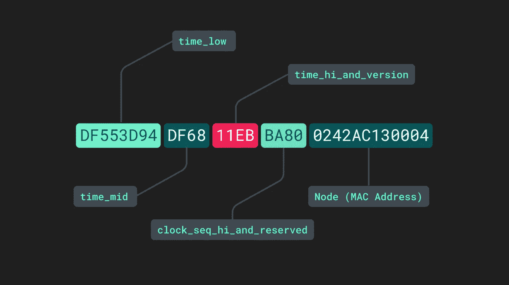
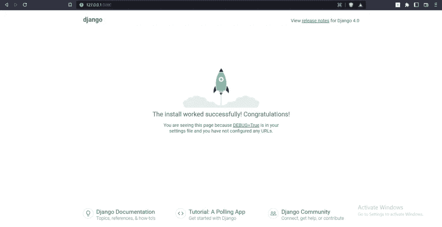
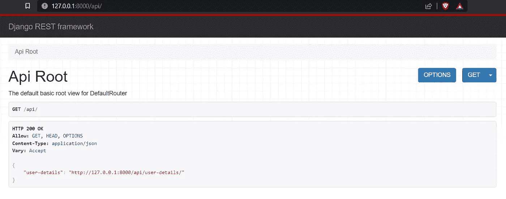
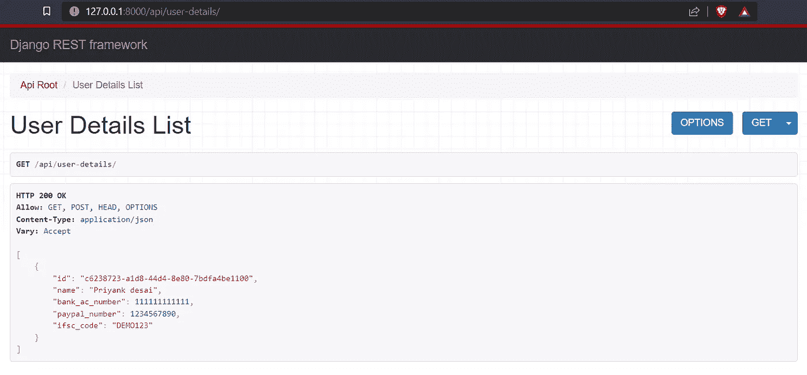

# 如何在 Django REST 框架中实现 UUID

> 原文：<https://blog.devgenius.io/how-to-implement-uuid-in-django-rest-framework-1556467ac7ea?source=collection_archive---------1----------------------->

通用唯一标识符，简称 UUID，也称为 GUIDs，即全球唯一标识符。



这个 128 位的 ID 号定义了文档、用户、资源或信息。它是一个内置的 Python 库，所以我们不必安装任何额外的东西。

要生成您的 UUID，请键入以下代码。

```
import uuid
print (uuid.uuid1())
```

您将获得以下输出

```
4c176bdc-86ac-11ed-b834-dc4a3eee123c
```

正如你所看到的，UUID 被分成 5 个部分。每个 UUID 长度相同，格式为**8–4–4–4–12**。

UUID 分为以下几个区域。

*   TimeLow:表示当前 UTC 时间戳的整数值的 32 位。
*   TimeMid:保存当前 UTC 时间戳整数值的下 16 位。
*   TimeHighAndVersion:保存当前 UTC 时间戳整数值的下 16 位。
*   ClockSequenceHiAndRes & & ClockSequenceLow:字节(4 个十六进制字符)，其中 1 到 3 位(有效位)包含正在使用的 UUID 版本的“变体”，其余位包含时钟序列。
*   节点:它代表 48 位的“节点 id”，通常是生成它的主机硬件的 MAC 地址。

然而，使用 **uuid1** 存在一些隐私威胁。除此之外，还有另一个方法调用 **uuid4** 。这种方法生成的随机数可以保证隐私安全。

要使用它，只需用 uui4 替换 uuid1。

```
import uuid
print (uuid.uuid1())
```

输出

```
dcce647a-b00d-449c-868d-e26e17c5fad0
```

## Django 项目

让我们在 Django 项目中实现它。

默认情况下，Django 提供了一个自动递增的主键。为了停止这种情况，我们必须在我们的字段中手动指定 **primary_key=True** 。

```
id = models.AutoField(primary_key=True)
```

这样，Django 就不会在主键中使用自动增量。

记住这一点，让我们通过首先创建一个 python 环境来开始我们的 Django 项目。

```
pip install virtualenv
virtualenv MyFirstApp
MyFirstApp\scripts\activate
```

接下来，在其中安装必要的软件包。

```
pip install django djangorestframework
```

现在，让我们创建我们的项目。

```
django-admin startproject DjangoUUID
```

最后，在项目中创建一个新的应用程序并运行它。

```
cd DjangoUUID
django-admin startapp mainApp
python manage.py runserver
```



如果你在打开链接后看到这个页面，这意味着一切工作正常。

完成后，将应用程序名称添加到 **INSTALLED_APPS 内的 setting.py 文件中。**

```
INSTALLED_APPS = [
    ...
    'mainApp',
    'rest_framework',
    ...
]
```

接下来，让我们从创建模型开始。假设我们使用 Django 模型来存储用户的银行信息。

为了访问这个模型中的任何数据，我们通常使用这个链接。

[**https://YourDomainName.com/userdetails/1**](https://YourDomainName.com/userdetails/1)

它将显示该 id 的所有细节，这是一个安全问题。为了解决这个问题，我们将在模型中使用 UUID 作为主键。

打开 models.py 并在其中添加以下代码。

接下来，创建 Serializers.py 文件，并为您的模型创建一个序列化程序。

现在打开 views.py 并为其创建一个视图集。该视图集将允许您执行 CRUD 操作(*创建、读取、更新和删除*)。

并为模型创建一个 **URL** 。打开 urls.py 文件并添加以下代码。

最后，迁移模型并再次运行项目。

```
python manage.py makemigrations
python manage.py migrate
python manage.py runserver
```

现在打开[**http://127 . 0 . 0 . 1:8000/API**/](http://127.0.0.1:8000/api/)查看你的模型。



您可以点击其名称旁边的链接来执行 **CRUD** *(创建、读取、更新和删除)*操作。向数据库添加一些数据以查看结果。



如您所见，主键不是一个典型的自动递增数字，而是一个难以预测的随机数。

## 结论

无论何时处理敏感数据，将 UUID 作为主键都是更好、更安全的选择。

源代码:[https://github.com/Priyank010/Django-UUID](https://github.com/Priyank010/Django-UUID)