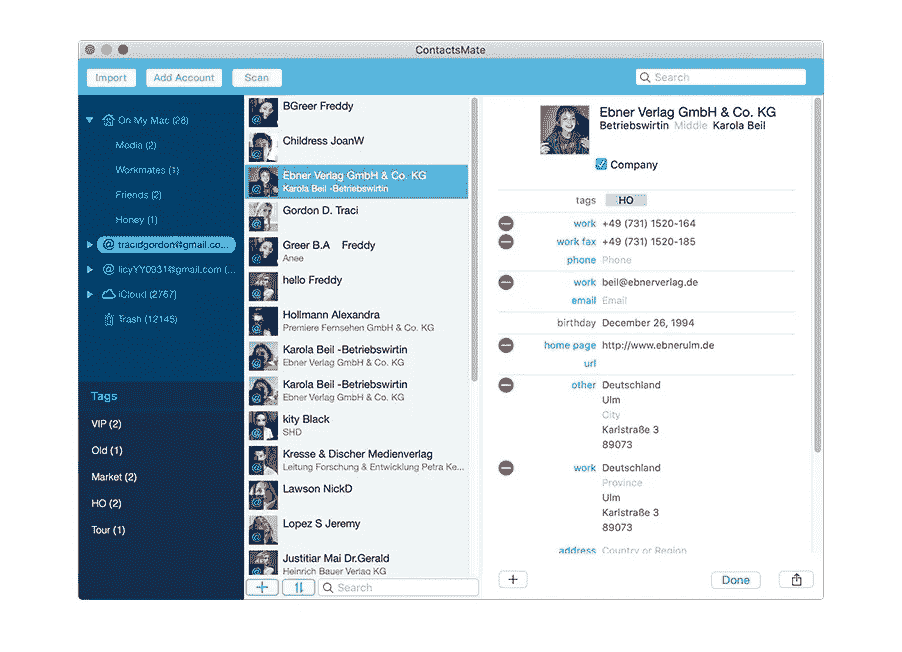
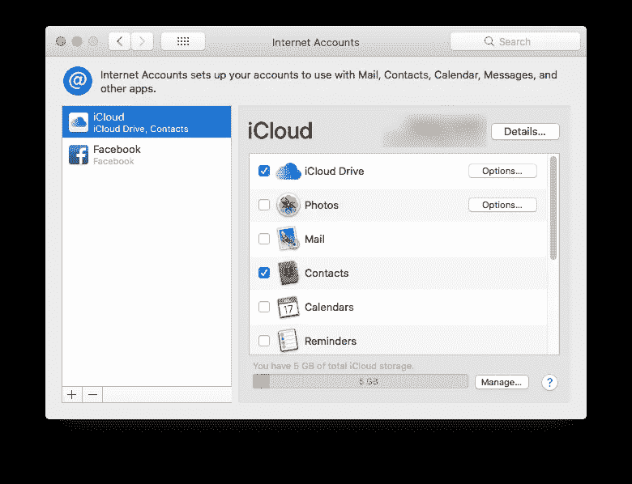
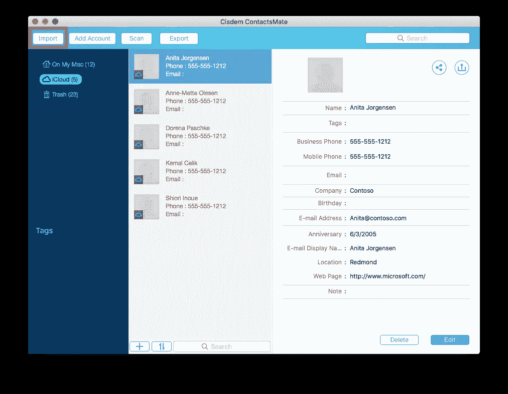
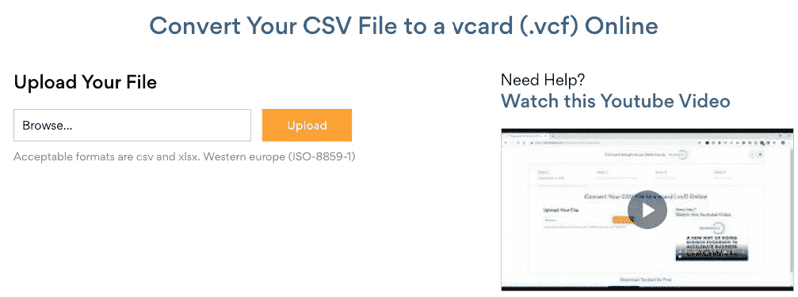
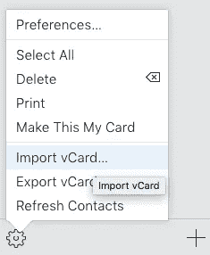

# 如何将 CSV 联系人轻松导入 iPhone 种方法

> 原文：<https://blog.devgenius.io/how-to-import-csv-contacts-to-iphone-easily-2-ways-c1ded20a2b91?source=collection_archive---------0----------------------->

本文将向您展示如何将 CSV 联系人导入 iPhone。有时，您可能需要从其他地方将通讯录导入 iPhone，如电子邮件服务或 CSV(逗号分隔值)文件。但是，您不能直接将联系人从 CSV 导入 iPhone。iPhone 的通讯录应用程序不支持 CSV 作为导入格式。好消息是，实际上有几种变通方法。这里我分享两个方法。

## 方法一。轻松将 CSV 联系人导入 iPhone

*适用于:macOS 10.11 或更高版本*

如果你是 Windows PC 用户，你可以试试第二种方法。

Mac 用户可以使用一款名为 [Cisdem ContactsMate](https://www.cisdem.com/contact-manager-mac.html) 的应用程序轻松地将联系人从 Excel 导入 iPhone。该应用程序提供以下主要功能。

*   支持来自不同应用程序和服务的联系人，如 Apple Contacts、iCloud、Google、Exchange、脸书、Twitter 等。
*   并在它们之间同步联系人
*   将 CSV 联系人导入支持的应用程序/服务
*   将联系人导出为 CSV、Excel、vCard 等 8 种格式。
*   允许您轻松查看、添加、编辑、分组、标记、打印和共享联系人
*   查找并修复重复的联系人
*   让您只需一次点击即可备份或恢复联系人

[免费下载联系人从官方下载链接](https://www.cisdem.com/downloads/cisdem-contactsmate-13.dmg)获取并安装。当它要求访问您的联系人时，单击**确定**。

第一步。将 iPhone 通讯录与 iCloud 同步。如果您已经这样做了，就跳过这一步。

如果没有，在你的 iPhone 上，转到**设置**。轻按您的姓名，然后轻按 **iCloud** 。打开**触点**。

第二步。在 ContactsMate 中，点击应用工具栏中的**添加账户**，这将调出互联网账户窗口。

选择 **iCloud** 并用你的 Apple ID 登录。选择**联系人**，如截图所示。关上窗户。

第三步。现在你应该会在 ContactsMate 的左侧栏发现一个名为 **iCloud** 的新群组。如果群组没有出现，请退出应用程序并重新启动。

第四步。选择群组 iCloud，然后点击工具栏中的**导入**。选择包含要导入 iPhone 的联系人的 CSV 文件，然后单击**打开**。

一旦更改被同步到 iPhone，您就可以成功地将 CSV 联系人导入到您的 iPhone。

## 方法二。使用 CSV 到 VCF 转换器将 CSV 联系人导入 iPhone

*适用于:Windows、macOS*

可以使用 iCloud 将 CSV 通讯录导入 iPhone。使用这种方法，您需要将 CSV 转换为 VCF(又名 vCard)。iCloud 不支持 CSV。

第一步。让您的 iPhone 通讯录与 iCloud 同步。

第二步。获取 CSV 至 vCard 转换器。这里我用的是 **Tendant** 提供的在线转换器。

第三步。点击**浏览**，选择 CSV 文件，点击确定。点击**上传**。

第四步。现在会出现一个选项，允许您将列与字段进行匹配。根据您的需要进行设置，或者忽略该选项。点击**下一个**。转换器将开始处理您的文件。一旦完成，您将被要求提供您的电子邮件地址。vCard 文件将通过电子邮件发送给您。

第五步。现在访问 iCloud.com 并登录。在那里，选择**联系人**。

第六步。点击角落的齿轮图标，选择**导入 vCard** 。选择您下载的 vCard 文件，点击**打开**。

第七步。现在 CSV 联系人已导入到 iCloud。将它们同步到 iPhone 后，该过程就完成了。

## 结论

有多种方法可以将 CSV 联系人导入 iPhone。本文中包含的方法很容易理解。像 ContactsMate 这样的联系人管理软件可以让它变得非常容易。由于它支持各种应用程序、服务和格式，ContactsMate 可以让你毫不费力地导入、导出和同步联系人等。