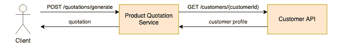
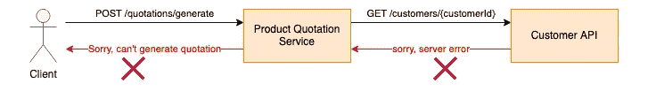
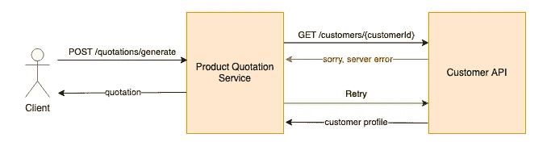
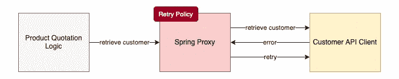
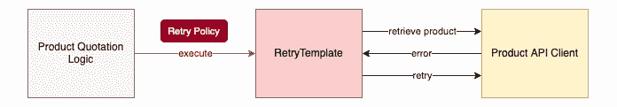

# 如何使用重试来提高 SpringBoot 应用程序的稳定性？

> 原文：<https://blog.devgenius.io/how-to-improve-stability-of-your-springboot-app-using-retry-ddb0c8999c48?source=collection_archive---------0----------------------->

## 启用自我恢复逻辑以及使用自动化测试来验证逻辑的方法


照片由[布雷特·乔丹](https://unsplash.com/@brett_jordan?utm_source=medium&utm_medium=referral)在 [Unsplash](https://unsplash.com?utm_source=medium&utm_medium=referral) 拍摄

零错误率的计算机系统几乎是不可能的。对于任务关键型系统，如金融系统，0.01%错误率的负载测试结果被认为是令人满意的结果。为了实现具有最小错误率的系统，自恢复机制是最重要的。一种常见的错误处理方法是重新运行操作。

下面让我们来看一个简单的产品报价系统，它从客户 API 中检索客户资料以进行评估和定价。



报价服务

如果客户 API 返回错误 500 服务器错误，会发生什么？该服务将无法生成报价。



当客户 API 返回错误时，报价服务失败

更好的方法是通过重试客户配置文件检索来恢复，而不是返回服务器错误。产品报价服务不受客户 API 间歇性错误的影响。这种设计对于依赖外部 API 的系统至关重要。外部系统不知何故脱离了我们的控制，这种自我恢复机制保持了系统的稳定性并改善了用户体验。



与带有重试机制的客户 API 集成

虽然可以使用简单的 for 循环以简单的方式实现重试，但 Spring framework 为开发人员提供了一种方便的方式来轻松启用重试功能。在本文中，我将介绍几个用例，并向您展示如何构建重试逻辑。

# 弹簧重试

重试功能是 Spring 批处理模块的一部分。从 2.2.0 开始，这个功能被从 Spring Batch 中抽出来，作为一个单独的模块来维护。要在 Spring 应用程序中启用这个特性，请将这个依赖项包含到 maven pom.xml 中。

```
<dependency>
  <groupId>org.springframework.retry</groupId>
  <artifactId>spring-retry</artifactId>
  <version>1.3.1.RELEASE</version>
</dependency>
```

该库没有自动配置，因此注释`**@EnableRetry**`应该添加到 SpringBoot 应用程序或带有`**@Configuration**`注释的类中，以便启用重试功能。

# 声明式方法—构建重试逻辑的快速简单的方法

对于上面的产品报价服务，将`**@Retryable**`注释标记到用于客户资料检索的方法调用中。

下面的示例代码指定了以下设置:

*   最多 3 次重试
*   带乘数的每次重试之间 0.5 秒-3 秒范围内的随机间隔
*   仅对 RuntimeException 触发重试，这意味着对于其他异常，如客户端错误或验证拒绝，系统会立即抛出异常。

无需编码，注释就能神奇地工作。最初，系统逻辑调用客户 API 客户机上的方法来检索客户简档，而无需重试注释。


客户 API 客户端的报价逻辑

应用注释后，Spring framework 在运行时引入了一个代理，它用重试逻辑处理客户 API 客户机上的方法调用。因为代理是在系统启动时创建的，所以它对产品报价逻辑是完全透明的，因此不需要修改代码。



Spring Framework 为重试创建的代理

这些参数也可以由系统属性指定。然而，如果您想要更动态的东西，这种方法可能不适合您。例如，除非为每个产品类型指定了单独的方法调用，否则批注不支持基于产品类型的不同重试设置。

在这种情况下，使用命令式风格可以实现这种具有动态重试设置的系统要求。

# 命令式方法—支持动态重试策略

Spring framework 为命令式方法提供了一个实用程序类 **RetryTemplate** 。这是一种“侵入式”方法，涉及程序代码的更改，以便系统逻辑利用 **RetryTemplate** 进行客户档案检索。下图显示了它类似于声明性方法中的代理，但是，它不是在运行时创建的。



retry 模板

下面的示例代码根据产品类型应用不同的重试策略。这显然是使用 **RetryTemplate** 的优势，因为它允许作为系统逻辑的一部分定制重试策略的灵活性。

这个示例代码使用声明性方法实现了与上一个类似的重试逻辑。它展示了基于产品代码确定最大尝试次数的逻辑的灵活性。

# 重试数据插入/更新

重试不仅适用于数据查询。它可以应用于其他过程，例如用于数据插入/更新的 I/O 操作。想象一下，一个消耗资源并涉及许多步骤的系统进程，您肯定不希望该进程仅仅因为在进程结束时没有将结果存储到数据库中而崩溃。对于系统来说，偶尔在 I/O 操作中遇到错误并不罕见，例如，由于并发访问，可能会出现记录锁定。当系统再次重试时，I/O 操作将成功完成。

请记住，运算应该是幂等的。换句话说，当操作被多次执行时，结果应该是不变的。例如，如果操作执行多次，只有一条新记录插入数据库，而不是重复的记录。

如果记录的主键是由 MySQL 基于自动增量代理 id 生成的，那么每次应用程序逻辑保存报价记录时，都会创建一条新记录。因此，将重试创建重复的记录。

因此，应用程序代码应该准备主键，而不是依赖于 MySQL 中的序列号，以便实现等幂数据插入。报价的样本数据模型表明报价代码是记录 id。

应用程序逻辑为报价代码分配唯一的 UUID

# 为重试逻辑构建自动化测试

对重试逻辑的验证并不容易。大多数情况下，很难模拟外部服务和数据库中的错误。另一种方法是使用 Mockito 模拟错误案例。下面是示例单元测试代码，用于验证报价库中的`save()`方法。

## **场景 1 —所有尝试失败**

模拟重试失败的场景很简单，您可以将模拟 bean 配置为在涉及目标方法时总是抛出异常。

## **场景 2——前两次尝试失败，第三次尝试成功**

更复杂的情况是前两次尝试失败，然后第三次成功。这个示例代码模拟了前两次调用 quotation repository `save()`方法时的异常错误，并在第三次尝试时返回 quotation 对象。Mockito 是模拟连续函数调用的方便工具。您可以简单地按顺序链接模拟设置方法— `thenThrow()`和`thenAnswer()`。

# 最后的想法

重试 I/O 操作的逻辑是一个微小的程序变化，但这种机制会产生巨大的差异，因为它提高了系统的稳定性并降低了错误率。Spring 框架提供了一种方便的方式来启用这种机制。如果您只是想要简单的东西，那么使用 Spring `@Retryable`注释是最好的，因为它可以神奇地启用逻辑，而无需修改任何代码逻辑。然而，如果你需要一些动态的东西，这个框架允许使用`RetryTemplate`定制重试逻辑的灵活性。

# GitHub 知识库

请参考这个 GitHub 库，获取完整的应用程序代码，包括重试逻辑和自动化测试用例

[](https://github.com/gavinklfong/spring-retry-demo) [## GitHub-gavinklfong/Spring-Retry-Demo:Spring 重试功能的演示

### 这个存储库包含报价 API 的示例实现和自动化测试用例。的目的是…

github.com](https://github.com/gavinklfong/spring-retry-demo)