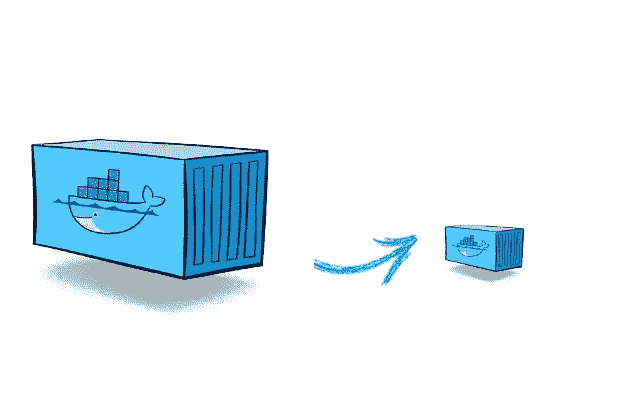

# 如何使用 Docker 多阶段构建来缩短后端应用程序的构建时间？

> 原文：<https://blog.devgenius.io/how-to-improve-the-build-time-of-your-backend-application-using-docker-multi-stage-build-23557da7862f?source=collection_archive---------1----------------------->


Shaah Shahidh 在 [Unsplash](https://unsplash.com/) 上拍摄的照片

你知道后端工程师最沮丧的事情是什么吗？你猜怎么着？正是 docker 构建时间耗尽了他们的耐心，伤害最大。因此，我写了这篇文章，试图改善我的 Go 应用程序的 docker 构建时间，并学习如何使用 docker 多阶段构建。

> 如果你生来就是为了解决问题，那么你来对地方了！

# 先决条件

1.  熟悉“码头工人”这个词
2.  了解后端应用程序的部署流程
3.  想不出别的:)

# 码头文件

编写 *Dockerfiles* 时最具挑战性的任务是尽可能缩小 docker 图像的尺寸。当图像大小增加时，维护图像并使用该图像执行容器变得很困难。此外，我们必须将 docker 图像存储在云上(可能是 AWS ECR ),如果图像太大，这可能会导致更多的成本。

当每个指令在 *Dockerfile* 中执行时，它会向图像添加一个新层。因此，为了优化 Dockerfiles，我们可以保持较小的映像大小，并尽量减少 docker files 中写入的每条指令的执行次数。

# 单阶段 docker 构建有什么问题？

“构建器模式”通常在早期用于为他们的应用程序编写 docker 文件。但是等等，这个“构建模式”是什么？让我们看一看。

> 对于开发环境，我们只有一个 docker 文件，它包含了构建应用程序所需的一切。然后我们精简这个 docker 文件以用于生产环境，这样它只包含应用程序和运行它所需的东西。这种设计基础是基于“构建模式”。

```
FROM golang:1.10

WORKDIR $GOPATH/src/github.com/codefresh-contrib/go-sample-app

COPY . .

RUN go get -d -v ./... && go install -v ./...

EXPOSE 8080

CMD ["go-your-app"]
```

如果你注意到上面的 *Dockerfile* ，我们已经使用' *& &* ' ( *Bash 操作符*)压缩了两个 *RUN* 命令。这有助于我们防止在图像中创建额外的层。因此，保持图像尺寸较小。但是这种设计容易出错，维护起来也很困难，尤其是当*运行*命令的数量增加时。

这个问题的解决方案是 docker *多阶段构建，*让我们接下来讨论这个问题，并改进构建时间。

# Docker 中的多阶段构建是什么？

*多阶段* Docker 构建是指我们在*Docker 文件*中使用多个 *FROM* 语句的构建。*docker 文件*中的每个 FROM 指令使用不同的基础(阶段),并开始构建的新阶段。在多阶段构建中，我们可以明确地将工件从一个阶段复制到另一个阶段，并跳过最终图像中不需要的所有内容。请查看下面的*文档*并观察*文档*中的不同阶段。

```
FROM golang:1.12-alpine AS build_base

RUN apk add --no-cache git

WORKDIR /tmp/your-go-app

COPY go.mod .
COPY go.sum .

RUN go mod download

COPY . .

RUN CGO_ENABLED=0 go test -v

RUN go build -o ./out/your-go-app .

FROM alpine:3.9 
RUN apk add ca-certificates

COPY --from=build_base /tmp/go-sample-app/out/your-go-app /app/your-go-app

EXPOSE 8080

CMD ["/app/your-go-app"]
```

上面的文件是一个多阶段构建的例子。我们可以看到这里有两个 FROM 语句/指令，它们执行两个容器“golang”和“alpine”。因此，我们只需要一个 docker 文件，只需运行“docker build”。

```
$ docker  build  -t  image_name:tag_name .
```



现在我们不需要创建任何中间图像，也不需要将任何工件提取到我们的本地机器。我们得到的结果是一个非常小的产品图像，复杂度大大降低。

## 但是上面的 Dockerfile 到底是怎么工作的呢？

上述 *Dockerfile* 中的第二个“FROM”指令以“alpine: latest”为基础开始新的构建阶段。语句“COPY-from=0”将构建工件从早期阶段复制到新阶段。

# 不知道如何命名构建阶段？

默认情况下，不会给出每个多级 docker 构件的名称。

*默认情况下，在多阶段构建中不命名阶段*。我们通常用从 0( *零*)开始的整数来指代它们，从指令的第一个“*”开始，依此类推。但是，我们可以通过在来自*指令的*中添加“*作为<名称>* 来命名每个阶段。然后我们可以在*复制*指令中使用这个阶段名。这样，*副本*不会中断，即使我们稍后决定重新排序 *Dockerfile* 中的指令。*

# 我们能停止一个特定的 docker 构建阶段吗？

当 *Dockerfile、*中有多个阶段或语句时，我们可能不必构建一个包含所有阶段的完整 *Dockerfile* 。我们可以只指定目标构建阶段并停止其他阶段。正如您在下面的命令中看到的

```
$ docker build --target build_base -t image_name:tag_name.
```

我们可以使用多阶段 docker 构建完成以下任务:

*   为了调试特定的阶段，我们可以在特定的阶段停止。
*   我们可以在测试阶段使用它，方法是填充测试数据，并使用不同的阶段构建产品。

# 问候！🙂

多阶段构建可以显著简化复杂 Docker 映像的构建。它们允许您涉及多个相互连接的构建步骤，这些步骤可以向前传递输出工件。


*   *多阶段构建非常适合部署生产就绪型应用程序。*
*   *多阶段构建只使用一个 docker 文件。*
*   它允许我们构建更小的图像，Dockerfile 将它们分成不同的构建阶段。
*   *我们要学习统一的语法。*
*   *多阶段构建工作在本地机器和 CI(持续集成)服务器上进行。*

# 摘要

为了这篇文章的完整性，让我们快速回顾一下到目前为止我们所学的内容。

*   了解了如何缩小 docker 图像的尺寸。
*   我们了解了为什么我们需要多阶段构建而不是单阶段 docker 构建。

> 如果你喜欢这篇文章，别忘了为它鼓掌！


请随时在[**Linkedin**](https://www.linkedin.com/in/shubham-kaushik-temp/)**上 ping 我，敬请期待下一期！**