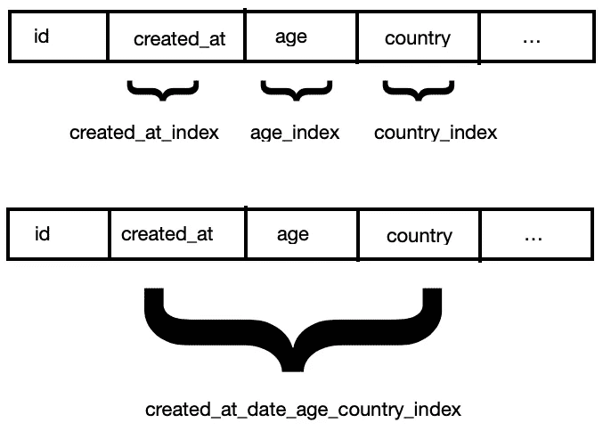
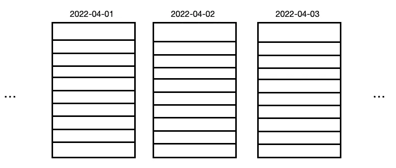
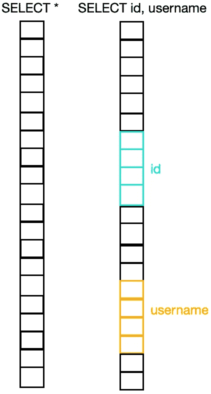
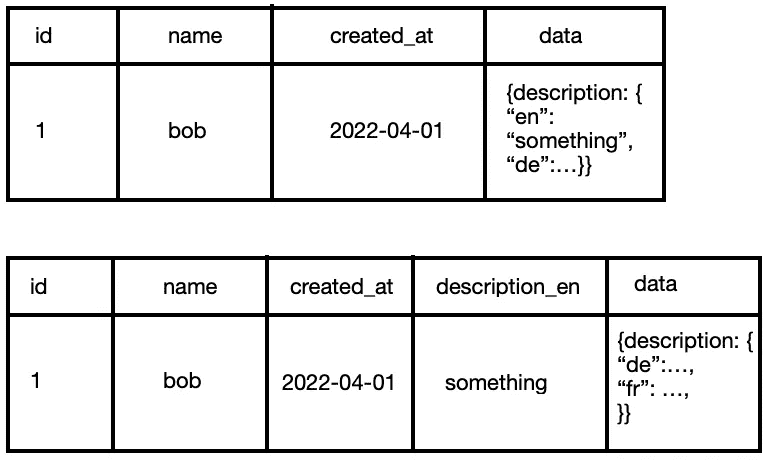

# 如何提高 SQL 查询的性能

> 原文：<https://blog.devgenius.io/how-to-improve-the-performance-of-your-sql-queries-69de73ce1cd8?source=collection_archive---------0----------------------->

我们都可以从更快的查询中受益。如果您是一名业务分析师，这可能意味着让您的仪表板和分析查询加载更快，而对于数据科学家来说，您的 EDA 和自动化数据预处理管道可以运行得更快，对于软件工程师来说，您的应用程序的延迟可能会降低。

在本文中，我将介绍您在查询中可能遇到的一些常见陷阱、您的数据模型，以及您如何使用会影响查询性能的数据库。

如果你想看这篇文章的视频版本，你可以在这里观看 [**YouTube**](https://www.youtube.com/watch?v=VpbtBHjO1S8)

# 存储层

让我们从顶部开始，或者更确切地说，从底部开始，从如何使用数据库开始。

## 关系型数据库管理系统

数据在数据仓库(如 BigQuery 或 Snowflake)中的存储方式与基于磁盘的数据库(如 Postgres 或 MySQL)有很大的不同。

在基于磁盘的数据库中，您的第一个方法通常应该是考虑索引。如果您经常按同一组列进行筛选，请在其上创建一个索引！这里需要注意的一点是，例如，如果您有一个 users 表，并且经常按三列进行筛选，比如 created_at、age 和 country，那么在这三列上分别建立一个索引是不行的，而应该在这三列的组合上建立一个索引。

```
CREATE INDEX users_created_at_age_country_idx ON users (date, age, country);
```



单列与多列索引

这是因为，如果您在单个列上只有一个索引，那么数据库将使用这些索引中的一个来进行第一轮筛选，但之后它必须扫描整个剩余的数据集来应用其他两个筛选。

另一方面，如果您对三个过滤器的组合有一个索引，那么您的数据库就确切地知道要返回哪些行。

也就是说，您需要确保数据库中没有太多的索引，因为当您插入、更新或删除数据时，所有这些索引都需要保持最新。

## 数据仓库

数据仓库通常必须支持大量的数据，而使用索引通常不再可行，这通常是为什么您甚至不能在数据仓库中创建索引的原因。

在这种情况下，您必须专注于定义您的聚类规则或分区，以便经常一起访问的数据存储在同一个位置，这样您就不必扫描整个数据集。例如，一种常见的分区方法是按日期分区，因为您通常会根据日期范围进行选择和过滤。



日期分区表中的数据分组示例

此外，从 **SELECT *** 语句转移到指定您想要选择的实际列也是有帮助的，因为数据通常以列格式存储，以通过改进数据压缩来提高有效的空间利用率。因此，如果只需要几列，在 select 语句中指定这些列可以减少需要查找和检索的数据量。



在列存储布局中分组的列值。

# 数据模型

在下一个阶段，您可能经常遇到的性能问题是如何设计您的数据模型，以及如何强制构建您的后续查询。

## JSON

例如，您可能在数据库中添加了一个 JSON(或 blob 类型)字段来存储一些元数据或额外的信息。也许您做出这个决定是因为在开始时，您不确定到底需要存储哪些额外的字段，并且您希望保持一定的灵活性。但是现在您发现自己经常在这个 JSON 数据类型中查询相同的字段。

如果是这种情况，那么可能是时候将这些字段移到它们自己的列中了，因为与更基本的数据类型相比，JSON 数据类型操作的性能相对较差。



将常用值从 JSON 类型的列中移到它们自己的列中。

## 正常化

关于数据模型的话题，您还需要考虑数据的规范化/反规范化程度。当您第一次学习数据库模型时，您可能听说过星型和雪花型模式，也可能听说过 3NF。虽然当您有许多插入事件时，规范化肯定可以提高您的性能，并节省您的空间。然而，当您运行分析查询时，它们也会降低您的速度，因为您现在需要连接所有这些表。

根据您的用例，您可能想考虑对您的数据模型进行一点非规范化。特别是当您在数据仓库中存储数据时，一定程度的非规范化是可以的，因为存储通常相对便宜。

显然，每个用例都是不同的，了解什么适合您的最佳方式是考虑您正在进行的大量操作，然后计算使用规范化与非规范化表的成本，以及您期望拥有的数据量。在某些情况下，您会发现稍微降低模式的规范化可能意味着每月多付 50 或 100 美元，这在大多数情况下是微不足道的，尤其是当您考虑到从中获得的潜在性能提升和查询复杂性降低时。

## 物化视图

如果有一个数据处理或转换查询经常用作其他查询的基础，您可能希望考虑从它创建一个实例化视图。这意味着您可以避免大量的计算，因为您可以直接从表中选择。事实上，如果您的源数据很少更改，它甚至可以节省成本，因为您不必一次又一次地重新计算相同的结果。如果您的基本查询正在执行最终结果的大小与输入数据的大小相比相对较小的聚合，这将特别有用。

但是另一方面，如果查询结果经常变化，维护物化视图实际上会变得非常昂贵，因为每次输入数据变化时都需要更新受影响的行。如果您很少使用视图，但是经常更新您的基表，您将花费大量的金钱来重新计算物化视图中的行，而实际上并不需要使用它们。

与反规范化一样，使用物化视图可能有意义，也可能没有意义，这取决于您的用例，但这是一个可能很容易被遗忘的选项，它实际上可以大幅提升性能。

# 问题

## 先过滤

当您开始编写复杂的分析查询时，您可能会从使用联合、连接和子查询(cte)在层中构建数据开始，然后在最后过滤最终结果。虽然这个过程可以使开发过程中更容易得到最终结果，但是问自己“我可以在查询中进一步下移这些过滤器吗？”是非常重要的

考虑这样一个查询:

```
SELECT user_id,
       first_event AS first_purchase_date
FROM (
    SELECT user_id, 
           event_type,
           MIN(created_at) AS first_event_date
    FROM user_events
    GROUP BY 1
) sub
WHERE event_type = ‘purchase’;
```

在这种情况下，我假设大多数人(如果不是所有人)会像这样编写查询

```
SELECT user_id, 
       first_purchase_date
FROM (
    SELECT user_id,
           MIN(created_at) AS first_purchase_date
    FROM user_events
    WHERE event_type = ‘purchase’
    GROUP BY 1
) sub
```

因为选择事件类型列只是为了随后立即对其进行筛选是没有意义的。但是你会惊讶地发现，有多少稍微复杂一点的查询把过滤作为最后一步，而事实上它们本可以在最开始就完成。

## CTEs

这对于倾向于变得庞大和复杂的分析查询来说尤其普遍。cte 的一个常见用途是将计算分成不同的层，以帮助分离逻辑，使一切更具可读性。然而，cte 还有另一个非常大的优势。通常，查询优化器以两种方式之一处理 cte

1.  如果 CTE 只在一个地方使用，将它填充到父查询中，以便优化器可以下推一些操作。
2.  如果 CTE 在多个地方使用，则物化 CTE 结果，并在每次引用 CTE 时重用物化结果，从而避免查询的重新执行。

正如您所看到的，无论是哪种情况，cte 都提供了一些非常好的性能提升，而且比子查询更具可读性。

因此，如果您发现自己多次使用某些子查询，那么最好将其放入 CTE 中。

需要注意的是，在这种情况下，不同的数据库解决方案可能会以不同的方式对待 cte，因此阅读您正在使用的任何数据库解决方案的文档以确认它们也是这样工作的，这是非常有用的。

我希望这些提示对提高 SQL 查询的性能有用！如果你有任何其他非常有用的建议想分享，请在评论中告诉我:)