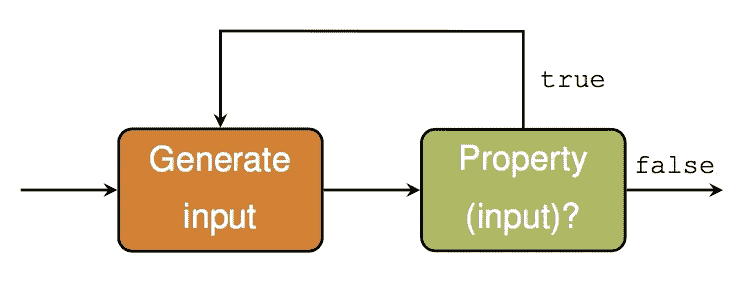
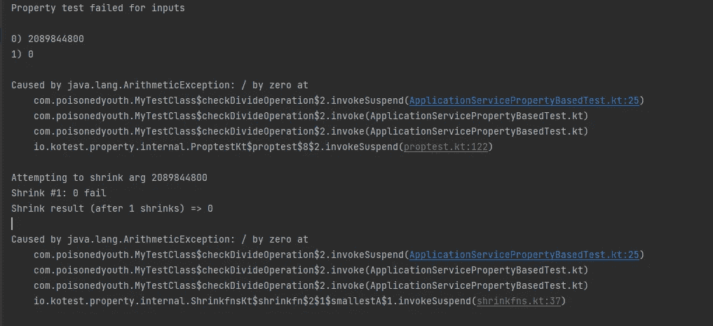
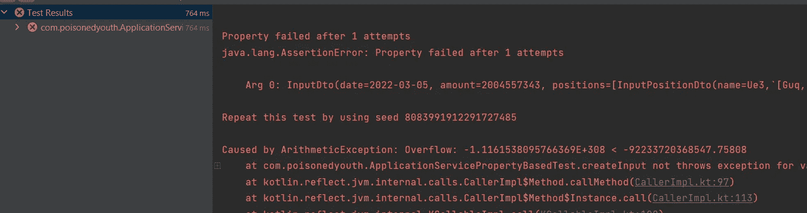
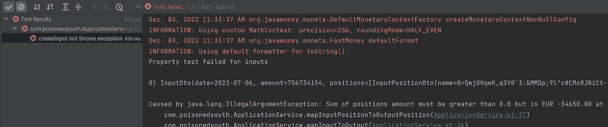
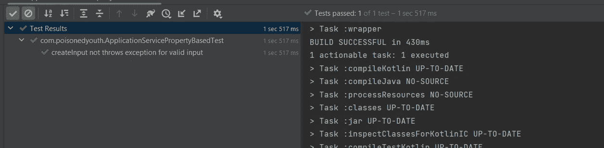

# 如何使用基于属性的测试来提高测试质量

> 原文：<https://blog.devgenius.io/how-to-improve-the-quality-of-tests-using-property-based-testing-587b817ea82e?source=collection_archive---------5----------------------->



https://janmidtgaard.dk/quickcheck/

在上一篇文章中，我展示了如何使用突变测试来检查为应用程序编写的测试，以检测生产代码中的变化。突变测试是一种测试类型，它不针对生产性代码运行以检查正确的行为，而是改变生产性代码以检查测试是否识别变化。

今天我想介绍另一种测试类型，它可以帮助提高测试的质量，但这次是通过增加随机性直接在现有的测试中进行——基于属性的测试**。**

## **介绍**

**什么是**基于属性的测试**？基于属性的测试旨在测试应该始终为真的属性的各个方面。它们允许在一次测试中对一系列输入进行编程和测试，而不是必须为每个想要测试的值编写不同的测试。基于属性的测试是模糊化的一种形式。主要目标是为测试提供随机输入数据，以便覆盖所有可能的边界。不是只测试由开发人员指定的输入数据，而是使用所有定义的有效输入数据。**

**这是一个非常理论化的描述，为了更好地理解这一点，我们来看一个例子。重点是展示基于属性的测试是如何工作的，而不是展示真实世界的例子:**

```
val minDate: LocalDate = LocalDate.of(2022, 1, 1)
val maxDate: LocalDate = LocalDate.of(2022, 12, 31)

class ApplicationService {

    fun createOutput(inputDto: InputDto): OutputDto {
        return mapInputToOutput(inputDto)
    }

    private fun mapInputToOutput(inputDto: InputDto): OutputDto {
        return OutputDto(
            date = inputDto.date,
            amount = inputDto.amount,
            positions = mapInputPositionToOutputPosition(
                positions = inputDto.positions
            )
        )
    }

    private fun mapInputPositionToOutputPosition(positions: List<InputPositionDto>): List<OutputPositionDto> {
        require(positions.isNotEmpty()) {
            "Positions must not be empty."
        }
        val sum = positions.fold(0.0) { acc, next -> acc + next.value }
        require(sum.compareTo(0.0) > -1) {
            "Sum of positions amount must be greater than 0.0 but is $sum"
        }
        return positions.map {
            OutputPositionDto(
                name = it.name,
                value = it.value.toEURCurrency()
            )
        }
    }
}

data class InputDto(
    val date: LocalDate,
    val amount: Int,
    val positions: List<InputPositionDto>
)

data class InputPositionDto(
    val name: String,
    val value: Double
)

data class OutputDto(
    val date: LocalDate,
    val amount: Int,
    val positions: List<OutputPositionDto>
) {
    init {
        require(date in minDate..maxDate) {
            "Date '${date}' must be within '$minDate' and '${maxDate}'."
        }

        require(amount >= 0) {
            "Amount '$amount' must be greater or equal null."
        }
    }

}

data class OutputPositionDto(
    val name: String,
    val value: MonetaryAmount
)

fun Double.toEURCurrency(): MonetaryAmount {
    return BigDecimal(this, MathContext(2, RoundingMode.HALF_UP)).ofCurrency<FastMoney>("EUR".asCurrency(), typedMonetaryContext<FastMoney> {
        setPrecision(2)
    })
}
```

**代码显示了一种简化的*应用服务*，它将给定的输入 DTO 对象映射到经过验证的输出 DTO 对象。对于输入 DTO 的不同属性和数据，有可用的验证，如果没有全部完成，将导致在映射过程中引发异常。**

**通过单元测试来测试该功能的经典方法是为代码中的每个潜在分支编写一个单独的测试用例。这将类似于下面的版本:**

```
internal class ApplicationServiceTest {

    private val applicationService = ApplicationService()

    @Test
    fun `throws exception if date is below minDate`() {
        // given
        val inputDto = createValidInputDto().copy(
            date = LocalDate.of(2020, 1, 1)
        )

        // when + then
        val exception = shouldThrow<IllegalArgumentException> {
            applicationService.createOutput(inputDto)
        }
        exception.message shouldBe "Date '2020-01-01' must be within '2022-01-01' and '2022-12-31'."
    }

    @Test
    fun `throws exception if date is above maxDate`() {
        // given
        val inputDto = createValidInputDto().copy(
            date = LocalDate.of(2025, 1, 1),
        )

        // when + then
        val exception = shouldThrow<IllegalArgumentException> {
            applicationService.createOutput(inputDto)
        }
        exception.message shouldBe "Date '2025-01-01' must be within '2022-01-01' and '2022-12-31'."
    }

    @Test
    fun `throws exception if amount is below zero`() {
        // given
        val inputDto = createValidInputDto().copy(
            amount = -1
        )

        // when + then
        val exception = shouldThrow<IllegalArgumentException> {
            applicationService.createOutput(inputDto)
        }
        exception.message shouldBe "Amount '-1' must be greater or equal null."
    }

    @Test
    fun `throws exception if sum of positions amount is below zero`() {
        // given
        val inputDto = createValidInputDto().copy(
            positions = listOf(
                InputPositionDto(
                    name = "First Position",
                    value = 2.3
                ),
                InputPositionDto(
                    name = "Second Position",
                    value = -12.2
                )
            )
        )

        // when + then
        val exception = shouldThrow<IllegalArgumentException> {
            applicationService.createOutput(inputDto)
        }
        exception.message shouldBe "Sum of positions amount must be 
            greater than 0.0 but is -9.899999999999999"
    }

    @Test
    fun `returns outputDto for valid input`() {
        // given
        val inputDto = createValidInputDto()

        // when
        val actual = applicationService.createOutput(inputDto)

        // then
        actual shouldBe OutputDto(
            date = LocalDate.of(2022, 1, 1),
            amount = 2,
            positions = listOf(
                OutputPositionDto(
                    name = "First Position",
                    value = 2.3.toEURCurrency()
                ),
                OutputPositionDto(
                    name = "Second Position",
                    value = 12.2.toEURCurrency()
                )
            )
        )
    }
}

private fun createValidInputDto() = InputDto(
    date = LocalDate.of(2022, 1, 1),
    amount = 2,
    positions = listOf(
        InputPositionDto(
            name = "First Position",
            value = 2.3
        ),
        InputPositionDto(
            name = "Second Position",
            value = 12.2
        )
    )
)
```

**即使在这个简单的例子中，也有必要编写许多测试来涵盖所有潜在的情况(例如，计算许多具有不同精度的位置的总和)。随着复杂性的增加，很难在测试中涵盖所有可能的组合。**

**因此，为了改进测试并减少总的测试数量，可以使用 Junit5 测试框架提供的现成功能，并编写[参数化测试](https://junit.org/junit5/docs/current/user-guide/#writing-tests-parameterized-tests)。**

```
class ApplicationServiceParameterizedTest {
    private val applicationService = ApplicationService()

    @ParameterizedTest
    @MethodSource("createInputData")
    fun `returns outputDto for valid input`(inputDto: InputDto, outputDto: OutputDto) {

        // when
        val actual = applicationService.createOutput(inputDto)

        // then
        actual shouldBe outputDto
    }

    companion object {
        @JvmStatic
        private fun createInputData() = Stream.of(
            Arguments.arguments(
                InputDto(
                    date = LocalDate.of(2022, 1, 1),
                    amount = 2,
                    positions = listOf(
                        InputPositionDto(
                            name = "First Position",
                            value = 2.3
                        ),
                        InputPositionDto(
                            name = "Second Position",
                            value = 12.2
                        )
                    )
                ),
                OutputDto(
                    date = LocalDate.of(2022, 1, 1),
                    amount = 2,
                    positions = listOf(
                        OutputPositionDto(
                            name = "First Position",
                            value = 2.3.toEURCurrency()
                        ),
                        OutputPositionDto(
                            name = "Second Position",
                            12.2.toEURCurrency()
                        )
                    )
                )
            ),
            Arguments.arguments(
                InputDto(
                    date = LocalDate.of(2022, 12, 31),
                    amount = 8,
                    positions = listOf(
                        InputPositionDto(
                            name = "First Position",
                            value = -0.0003
                        ),
                        InputPositionDto(
                            name = "Second Position",
                            value = 0.0004
                        )
                    )
                ),
                OutputDto(
                    date = LocalDate.of(2022, 12, 31),
                    amount = 8,
                    positions = listOf(
                        OutputPositionDto(
                            name = "First Position",
                            value = (-0.0003).toEURCurrency()
                        ),
                        OutputPositionDto(
                            name = "Second Position",
                            (0.0004).toEURCurrency()
                        ),
                    )
                )
            ),
            Arguments.arguments(
                InputDto(
                    date = LocalDate.of(2022, 1, 1),
                    amount = 2,
                    positions = listOf(
                        InputPositionDto(
                            name = "First Position",
                            value = -122.30
                        ),
                        InputPositionDto(
                            name = "Second Position",
                            value = 122.31
                        )
                    )
                ),
                OutputDto(
                    date = LocalDate.of(2022, 1, 1),
                    amount = 2,
                    positions = listOf(
                        OutputPositionDto(
                            name = "First Position",
                            value = (-122.30).toEURCurrency()
                        ),
                        OutputPositionDto(
                            name = "Second Position",
                            122.31.toEURCurrency()
                        )
                    )
                )
            )
        )
    }
}
```

**这种参数化测试的问题是，开发人员必须指定应该输入到测试方法的输入和输出，并验证结果。因此，输入值的所有潜在组合的覆盖范围仍然取决于开发人员。问题是:开发者能知道所有潜在的输入组合吗？在示例代码中，这是可能的，但是生产性代码在大多数情况下要复杂得多。因此，与其花时间手工定义所有潜在的测试用例，不如让我们看看**基于属性的测试**如何帮助解决这个问题。**

## **基于属性的测试**

**基于属性的测试关注被测代码的公共属性。该属性可以是:**

*   **结果总是例外**
*   **结果总是在特定范围内**
*   **结果总是成功地将数据存储到数据库**
*   **…**

**因为输入是随机产生的，所以在这种测试中不能断言具体的结果(例如特定的数量)。我对这个具体的值不感兴趣，而是对上面的一个条件感兴趣。**

**为了更实用，让我们看看上面的原始例子是什么样子的。**

## **Kotest**

**为了在 Kotlin 应用程序中使用**基于属性的测试**，主要有两种通用框架可用:**

*   **[Kotest](https://kotest.io/)**
*   **[jqwik](https://jqwik.net/)**

**在本文中，我使用 **Kotest** 来实现**基于属性的测试**，主要是因为我也在测试中使用断言框架及其 Kotlin 本地框架。我总是试着关注 Kotlin 原生框架，如果它们是可用的，并且提供了与经典 Java 版本相同的可能性。**

**为了使用应用程序中的功能，我需要向 *build.gradle.kts* 配置文件添加一个依赖项。**

```
testImplementation("io.kotest:kotest-property:5.5.4")
```

**在项目中导入依赖关系后，一切都准备好使用 **Kotest** 模块了。**

**让我们从一个基本的例子开始理解测试的功能。为了拥有与 Junit5 相似的测试设置，我对测试使用了 *AnnotationSpec* 样式。Kotest 提供了不同风格的测试，可以根据个人喜好来使用。关于支持的风格的概述可以在[文档](https://kotest.io/docs/framework/testing-styles.html)中找到。**

**基于属性的测试有两种可能的变体:**

*   ***检查所有*
    如果所有给定的输入值*返回 true* ，则测试通过**
*   **如果所有给定的输入值没有出现异常，测试将通过。**

**两种变体的示例如下:**

```
class MyTestClass : AnnotationSpec() {

    @Test
    suspend fun checkStringLength() {
        forAll<String, String> { a, b ->
            //...
            (a + b).length == a.length + b.length
        }
    }

    @Test
    suspend fun checkDivideOperation() {
        checkAll<Int, Int>{a, b ->
            //...
            (a / b)
        }
    }

}
```

**对于这两种情况，您可以用类型指定输入值的数量，并在函数体内部进行具体的测试。在 *forAll* 示例中，有一个检查应该导致 *true* 作为最后一条语句，而在 *checkAll* 示例中，只检查在语句执行期间没有抛出异常。**

**在上面的例子中 **Kotest** 为*字符串*和 *Int* 类型提供随机输入值。**

**默认情况下，每个测试用例会进行 1000 次迭代。该值可以全局指定**

```
class MyTestClass : AnnotationSpec() {
    init {
        PropertyTesting.defaultIterationCount = 500
    }

    @Test
    suspend fun checkStringLength() {
        forAll<String, String> { a, b ->
            (a + b).length == a.length + b.length
        }
    }

    @Test
    suspend fun checkDivideOperation() {
        checkAll<Int, Int>{a, b ->
            (a / b)
        }
    }

}
```

**或者通过为每个测试用例配置它**

```
class MyTestClass : AnnotationSpec() {

    @Test
    suspend fun checkStringLength() {
        forAll<String, String>(500) { a, b ->
            (a + b).length == a.length + b.length
        }
    }

    @Test
    suspend fun checkDivideOperation() {
        checkAll<Int, Int>(700){a, b ->
            (a / b)
        }
    }

}
```

**不出所料，如果 0 用于 *b* 变量，第二个测试用例失败。**

**既然测试失败了，因为输入数据的一个组合导致了异常，我需要获得具体输入的可能性。对于这个简单的例子，使用原始 Int 作为输入，很容易在日志输出中找到信息。**

****

**但是如果我有一个更复杂的输入数据(比如嵌套的对象)，它可以帮助只使用导致测试失败的输入重新运行测试(比如调试)。为此，失败的测试是打印一个所谓的“种子”。该种子可以被输入到测试的配置中。有了这个，我可以将测试减少到一个失败的案例，并且能够调试源代码。**

```
@Test
suspend fun checkDivideOperation() {
    checkAll<Int, Int>(PropTestConfig(seed = 2089844800)){ a, b ->
        (a / b)
    }
}
```

**到目前为止，我只是展示了一个非常基本的例子来介绍用 **Kotest** 进行基于属性的测试的基础。现在让我们回到最初的例子。**

**在这种情况下，不需要主数据类型作为输入数据，但需要一个具有嵌套结构的 DTO 对象。在 **Kotest** 中如何处理这个？**

****Kotest** 提供了一种通过所谓的内置类型的“Arb”生成器来组合复杂数据结构的方法。**

**第一个版本如下所示:**

```
class ApplicationServicePropertyBasedTest : AnnotationSpec() {

    private val applicationService = ApplicationService()

    @Test
    suspend fun `createInput not throws exception for valid input`() {
        checkAll(createInputArb()) { inputDto ->
            applicationService.createOutput(inputDto)
        }
    }
}

fun createInputArb() = arbitrary {
    InputDto(
        date = dateArb.bind(),
        amount = amountArb.bind(),
        positions = createInputPositionsArb().bind()
    )
}

fun createInputPositionsArb() = arbitrary {
    val positions = mutableListOf<InputPositionDto>()
    repeat(amountPositionsArb.bind()) {
        positions.add(createInputPositionArb().bind())
    }
    positions.toList()
}

fun createInputPositionArb() = arbitrary {
    InputPositionDto(
        name = nameArb.bind(),
        value = valueArb.bind()
    )
}

private val dateArb = Arb.localDate(minDate = minDate, maxDate = maxDate)
private val amountArb = Arb.int(min = 0, max = Int.MAX_VALUE)
private val amountPositionsArb = Arb.int(min = 1, max = 100)
private val valueArb = Arb.double()
private val nameArb = Arb.string(minSize = 1, maxSize = 100)
```

**我没有使用 *checkAll* 函数的内置数据类型语法，而是提供了一个*input to 类型的 *Arb* 。这是为服务提供一个随机生成的输入。输入由内置的随机数据类型组成，如 *Double、Int* 或 *LocalDate* ，可以通过例如给定最小值或最大值或更复杂的规则来定制。***

**但是当运行测试时，我得到了一个异常，因为生成器没有正确配置。**

****

**在上面的例子中，由于溢出，我得到了一个*算术异常*。因此，我需要更新 Arb 生成器的值，将*的输入位置改为*，以限制其输入。**

```
private val valueArb = Arb.double(min = -10000.0, max = 10000.00)
```

**在更新并重新运行测试后，我仍然得到一个异常，因为根据要求，生成的*inputpositionto*总和无效。**

****

**为了解决这个问题，我需要添加一个创建*输入位置到*对象的条件来满足一般要求。我需要对创建随机数量的*输入位置到*的逻辑做一些修改，以便总数量为正。**

```
fun createInputPositionsArb() = arbitrary {
    val positions = mutableListOf<InputPositionDto>()
    val amountOfPositions = amountPositionsArb.bind()
    var totalSum = 0.0
    repeat (amountOfPositions) {
        val value = valueArb.bind().setScale(2, RoundingMode.HALF_UP).toDouble()
        totalSum += value
        positions.add(createInputPositionArb(value).bind())
    }
    if (totalSum < 0.0) {
        positions.add(createInputPositionArb(abs(totalSum)).bind())
    }
    positions.toList()
}
```

**这个函数是一个例子，说明我如何能够包含创建随机输入的逻辑，以满足业务逻辑。**

**有了这个改变，测试如预期的那样成功了。通过这个测试，我可以在大约 1.5 秒内对服务运行 1000 个随机测试用例。**

****

**本文只是对使用 Kotest 进行基于属性的测试的介绍。Kotest 提供了许多额外的高级功能，这些功能有助于使基于属性的测试适应您自己的需要，比如假设、统计或 Arrow 的生成器。你可以在 [Kotest](https://kotest.io/docs/proptest/property-based-testing.html) 的官方文档中找到很好的解释**

**我在文章中使用的代码可以在 Github 上找到:[https://Github . com/PoisonedYouth/kot Lin-property based-testing](https://github.com/PoisonedYouth/kotlin-propertybased-testing)**