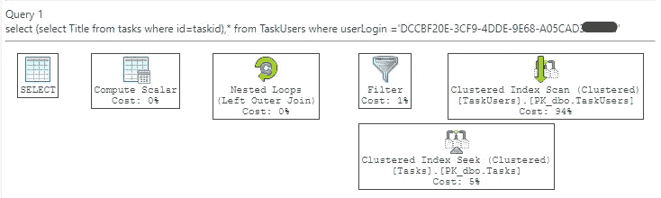
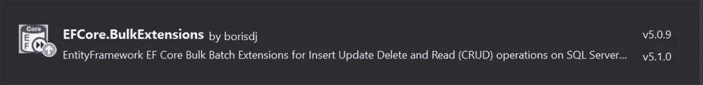

# 如何…提高数据库性能

> 原文：<https://blog.devgenius.io/how-to-increasing-your-database-performance-2f5157d0c010?source=collection_archive---------9----------------------->


[国家癌症研究所](https://unsplash.com/@nci?utm_source=medium&utm_medium=referral)在 [Unsplash](https://unsplash.com?utm_source=medium&utm_medium=referral) 上拍摄的照片

在每个开发人员的生活中，总会有这样一个时刻，你会面临这样一个问题“为什么数据库这么慢？”。稍微调查一下之后，你会注意到“嘿，那真的很慢”。为了避免这种情况，我将为您的 SQL 查询提供一些最佳实践。

# 一般提示

# 分析执行计划

当我们执行 SQL 语句时，我们的数据库引擎首先分析没有语法错误。然后，它计算执行语句的最佳方式。结果就是执行计划

我们可以使用这个 SQL 执行计划来分析 SQL 语句是如何执行的，并搜索性能问题。在 SQL Server 中，存在一种图形方式或表格方式。你可以选择你可能使用的。我将向你展示图形化的方式。为此，您必须首先执行以下命令:

```
SET STATISTICS XML ON
```

然后我们执行查询本身，例如，这个查询:

```
select (select Title from tasks where id=taskid),* from TaskUsers where userLogin ='DCCBF20E-3CF9-4DDE-9E68-A05CAD3D1111'
```

现在，它将在表中显示执行计划



您会立即看到大部分时间(成本)将受到影响的部分。这样，我们就可以做我们的优化。

# 避免编码循环

使用循环在表中进行插入是个坏主意，因为我们不让数据库引擎优化*插入*。我经常在代码中看到循环插入数百行，而不是使用其他更优化的方式。

使用 for 循环:

此时，您可以准备您的查询来生成一批插入，或者更好的方法是使用实体框架的批量操作



这将允许在数据库中执行大量的插入/更新/删除操作。这个工具包将使您能够在很短的时间内将数据大量加载到数据库中。

# 避免相关的 SQL 子查询

相关子查询是使用父查询中的值的查询。除非 SQL 引擎优化器用连接重写相关子查询。然后，它将对外部查询的每一行执行一次该连接，从而降低 SQL 查询的整体性能。

让我们以这个查询为例:

正如我们在这里看到的，问题是内部查询(SELECT c.name…)对外部查询(SELECT r.id，..)并对外部查询处理的每一行重复同样的操作。所以这会降低性能。更好的方法是对表使用连接，在这种情况下，我们也使用左连接来产生空行。

这将更有效地执行查询

# 检查索引

当然，每个开发人员都使用索引来加快查询速度。但是过多的(重叠的)索引可能会降低查询性能。

所以一个经验法则。仅为 where 子句中使用的字段创建索引(以及使用包含的列)。

还要检查你的索引是否会被使用，否则就和他们说再见，删除它。这将释放磁盘空间，并且 SQL Server 不得维护/填充不再使用的索引。

# 对自动完成的事情使用全文

我经常看到许多开发人员使用 Like 子句来获得自动完成功能(例如为客户)。根据数据大小，这可能会非常慢。为此，您可以利用 SQL Server 的全文搜索功能。在这种情况下，您可以组合不同的文本列，并可以快速搜索。

# 选择合适的数据类型

并不是所有的类型都占据相同的位置，当我们使用一个具体的数据类型时，我们也可以根据我们存储的内容来限制它的大小。

因此，请确保使用正确的数据类型和正确的大小。如果使用 name 列，那么使用 varchar(50)而不是 varchar(400)字段会有所不同。这将花费您更少的空间，并且 SQL server 不需要分析太多的开销。

# 处理

保持短时间的转换开放。因为在处理表数据时可以锁定事务。结果可能会出现死锁。

# 仅选择您需要的字段

不要用`Select *...`。从技术上来说，SQL Server 通过查询来获取所选表中的所有列。然后它会自己运行查询。此外，这会给我们带来以下问题:

1.  可以添加或删除列，或者修改表中的列名。因此，对于 SELECT *我们可能会得到意外的结果
2.  SELECT *返回的列的顺序可能不同。

# 结论

要获得最大的性能不是一次表演。它必须被视为一个持续的过程。所以请关注你的数据库的可维护性。

把以上几点作为解决即将到来的问题的建议。

当然，这篇文章不能展示所有的可能性，但集中在主要问题上。

如果你认为我错过了许多主题，请关注我，获取更多这样的提示，并让我知道。

```
***Hi there 👋****I'm Sascha, a software engineer* 💻, currently working at [RealCore](https://www.realcore.de)
Father ,Developer (MS stuff), IOT passionist, urban beekeper 🍯🐝*Say Hello 🙌 on:* [*LinkedIn*](https://www.linkedin.com/in/sascha-peter-bajonczak-32a17a2a/)[*GitHub*](https://github.com/sbajonczak)[*Blog*](https://blog.bajonczak.com/)Subscribe to my Newsletter [here](https://medium.com/subscribe/@beejayherne).
```