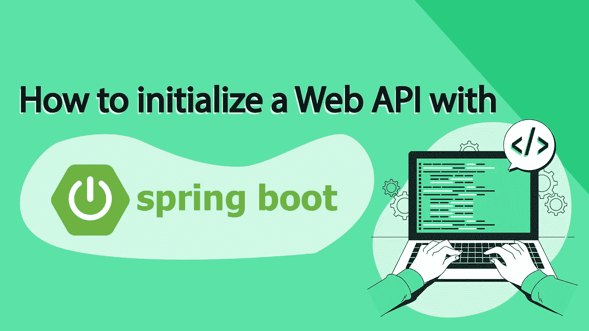
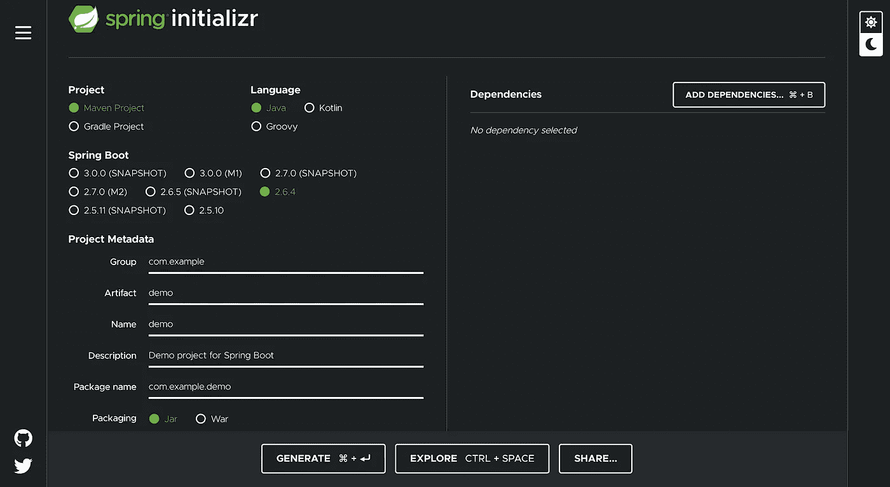
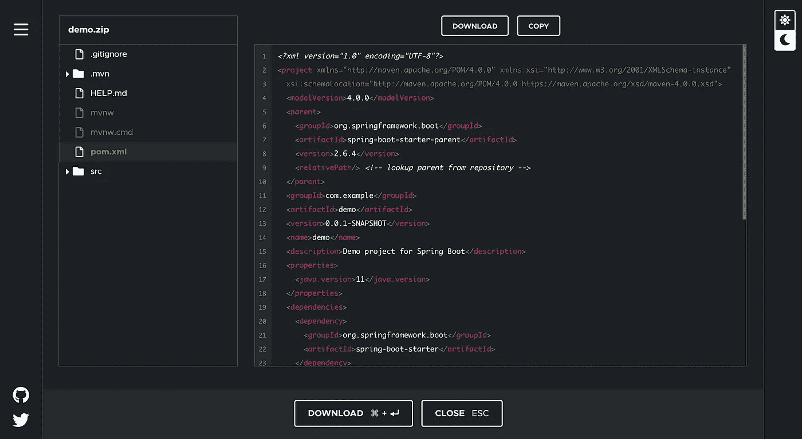

# 如何用 Spring Boot 初始化一个 Web API？

> 原文：<https://blog.devgenius.io/how-to-initialize-a-web-api-with-spring-boot-d770e52a98d0?source=collection_archive---------5----------------------->

## 要不要简单的创建一个 web API？没有比 Spring Boot 更好的了！



在本文中，我们将向您展示如何用 Springboot 初始化 web API。开始了。

## 为什么使用 Spring Boot 构建 Web API？

Spring Boot (Spring extension)是一个开源的 Java 开发框架，它允许你设计 web 应用程序，并特别推荐用于创建轻量级和模块化的 web APIs。另一方面，我们发现著名的 Java EE 更适用于非常繁重的业务应用程序。

它的主要优点是易于引导！目标是以最少的资源启动项目，组织代码和做事的方式，同时优化性能。

## 用 Springboot 开发一个 web API，它是如何工作的？

Spring Boot 定义了一个基本配置来简化和加速新项目的创建。我们的项目将只需要一些库开始。

可以在 [http://start.spring.io](http://start.spring.io) 上快速生成一个新项目，指定是 Maven 还是 Gradle 项目，语言(Java、Kotlin、Groovy)，Spring Boot 和 Java 的版本，打包(Jar 或 War)，基本依赖项(可选)。

我们可以在 pom.xml 中添加项目进展过程中需要的其他模块(Spring Batch、Websocket、邮件服务器……)。也可以在 IntelliJ 这样的 IDE 上启动项目。



这里，我们选择了三个常见的依赖项来启动一个新项目:

*   Spring Security:保护应用程序的标准。允许您完全自定义身份验证(LDAP、OpenID、BDD)和访问控制。
*   Rest 存储库:促进 REST web 服务的创建。
*   Spring Data JPA:使实现数据访问层变得容易。

我们可以在生成项目之前探索它，然后在 pom.xml 中找到 Spring Boot 和 Java 的版本、我们项目的元数据以及我们在上一步中选择的依赖项。
我们有一个基本架构，主文件夹包含后台(Java)、资源和集成测试的测试文件夹。



在“resources”中是 application.properties 文件，包含应用程序的属性，例如服务器端口号、数据库的访问 URL、身份验证的类型等。也可以在 YAML 文件 application.yml 中包含这些属性

```
server.port = 8080
spring.application.name = demo
spring.data.mongodb.uri = mongodb://localhost/test
```

在背面，生成了 DemoApplication 类:

*   demo application :@ spring boot application 注释可以在应用程序执行期间将这个类标记为应用程序的入口点，然后触发所有的配置。

```
package com.example.demo;
import org.springframework.boot.SpringApplication;
import org.springframework.boot.autoconfigure.SpringBootApplication; @SpringBootApplication
public class DemoApplication { public static void **main**(String[] args) { SpringApplication.**run**(DemoApplication.class, args); }}
```

## 跳靴注解

以下是 Spring Boot 提供的一些主要注释，它们使得将角色和行为应用到类中变得容易(我们已经提到了一些，但是还有更多！):

*   **@ Component**:Spring 管理的组件的通用注释。

```
@Component
public class DemoClass {}
```

*   **@Autowired** :将 **@Components** 注射到一个类中使用。

```
public class MailConfig {
   @Autowired
   private ApplicationProperties applicationProperties;
}
```

*   **@Service** :对数据进行业务处理的类。

```
@Service
public class StorageService {
}
```

*   **@Repository** :处理数据库数据的类。

```
@Repository
public interface ProductRepository extends JpaRepository<Product, Long> {
}
```

*   **@Controller** :公开 REST API 的类。

```
@Controller
public class ProductController {
}
```

*   **@RequestMapping** :访问您的 REST API 的 URI 基地("/api ")

```
@RestController
@RequestMapping("/api/product")
public class ProductResource {
}
```

一旦我们的应用程序被开发出来，我们就可以通过一个包含嵌入式服务器的可执行文件(目标文件夹中包含的 Jar 或 War)来启动它，这反过来又会启动这个项目。

## 用回弹创建网络应用编程接口:亮点

用 Spring Boot 创建一个网络应用编程接口有很多优势。对我们来说，最重要的是:

*   **轻盈:**运营服务只有最低限度！没有多余的！
*   **易于处理:**项目的简化配置使您能够专注于业务部分。构建 API 的复杂性由 Spring Boot 来处理。
*   **速度和效率:**对于一个 Maven 或 Gradle 项目，您会得到一个 Jar 或 War，其中包含了 webserver 的砖块，可以在容器服务中直接执行，比如 **AWS** 。

## 用回弹创建网络应用编程接口的缺点

回弹的主要缺点是**调试**。Spring Boot 是由几个不同的层组成的，这些层可以被反编译，但是当您想要调试以跟踪问题的根源时，这并不容易。我们从一个文件转到另一个文件，然后又转到另一个文件，等等……有时会很长！

## 我们建议 Spring Boot 创建一个网络应用编程接口？

**是！** Spring Boot 是启动任何 web API 的框架，既快速又容易。在每个人伸手可及的地方，只需点击几下鼠标，我们就有了一个基本的配置，可以直接开始我们项目的开发，以后可以进行开发！

它能够创建足够轻和高效的服务，只保留我们真正需要的东西，并提供在没有任何其他外部资源的情况下部署/执行应用程序的可能性……这是最好的！