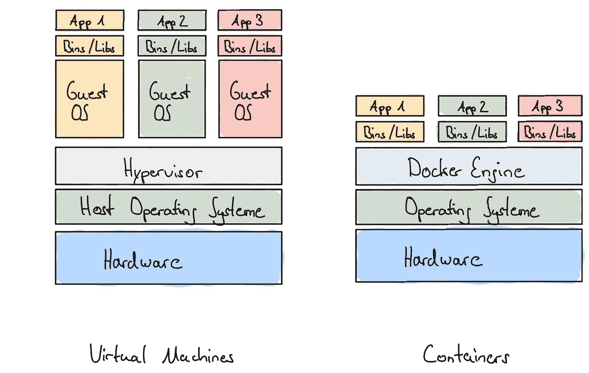
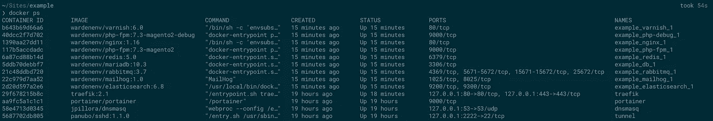
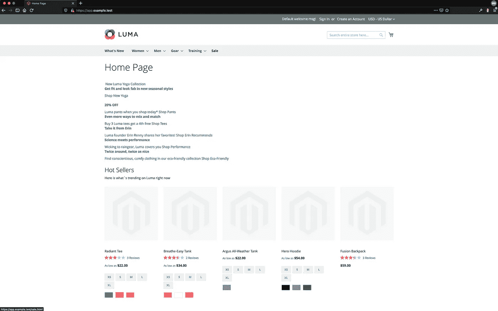
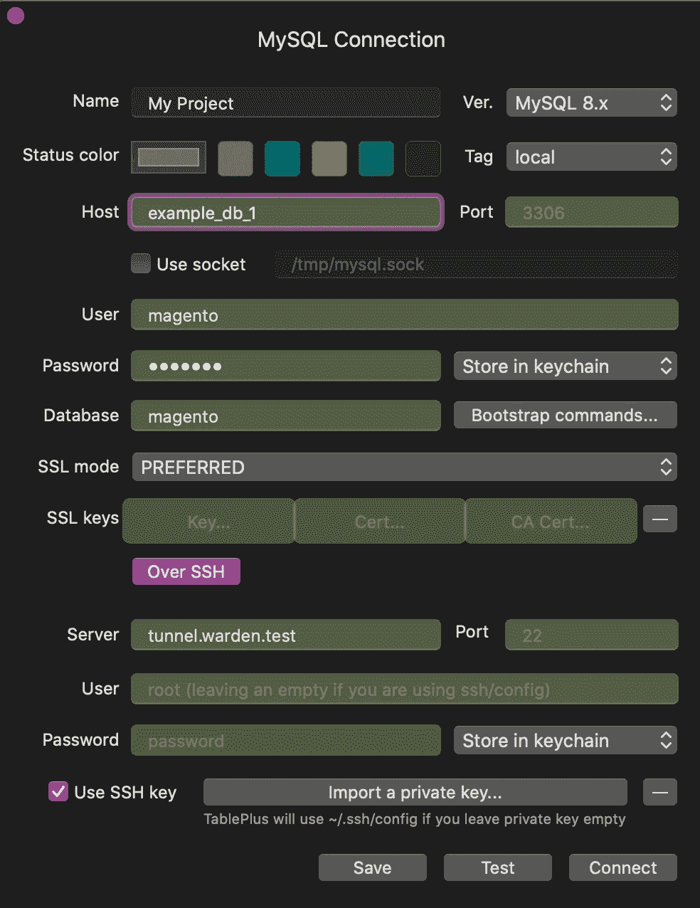
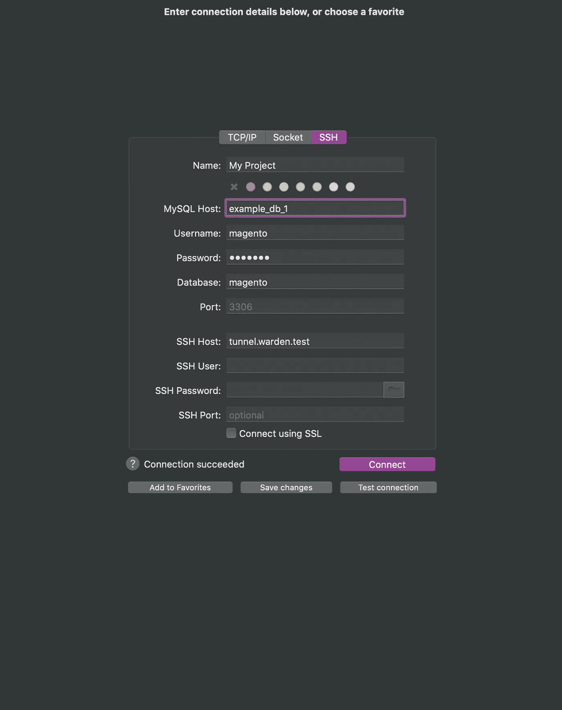
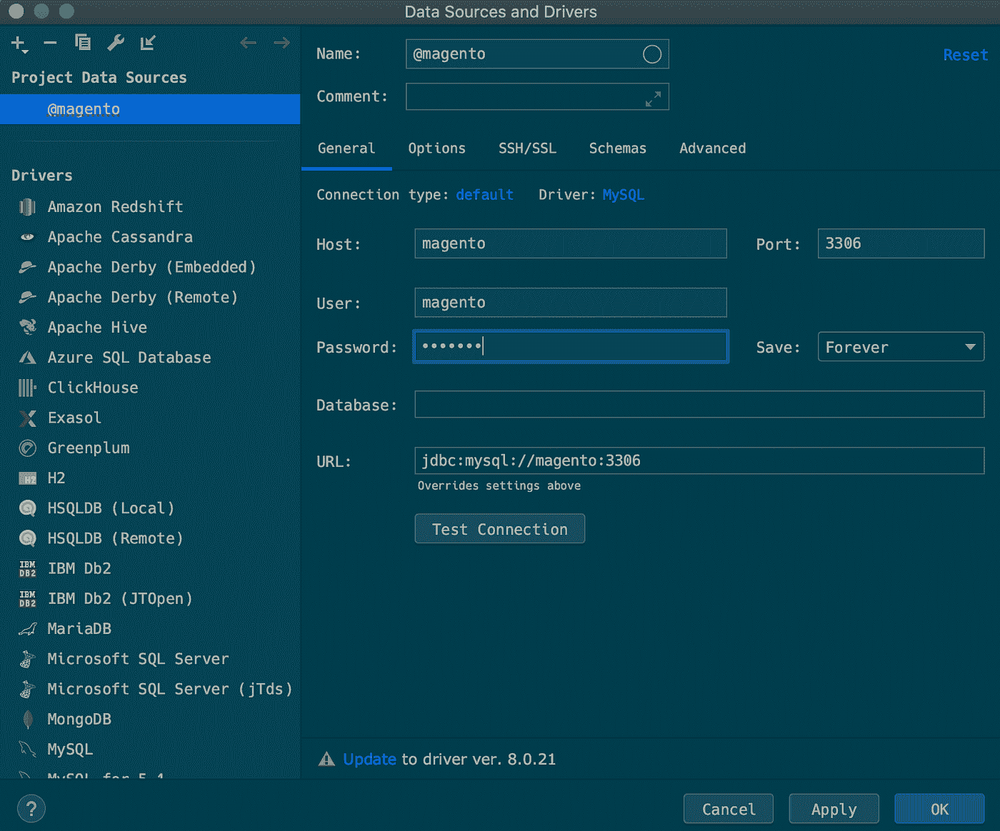
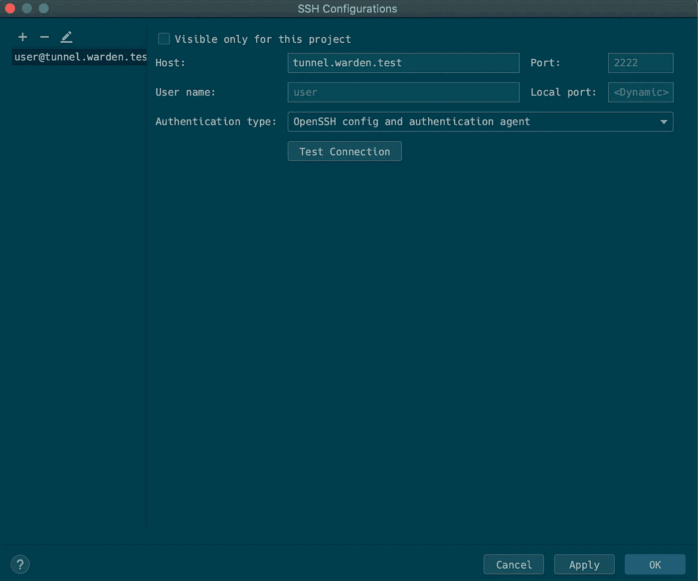
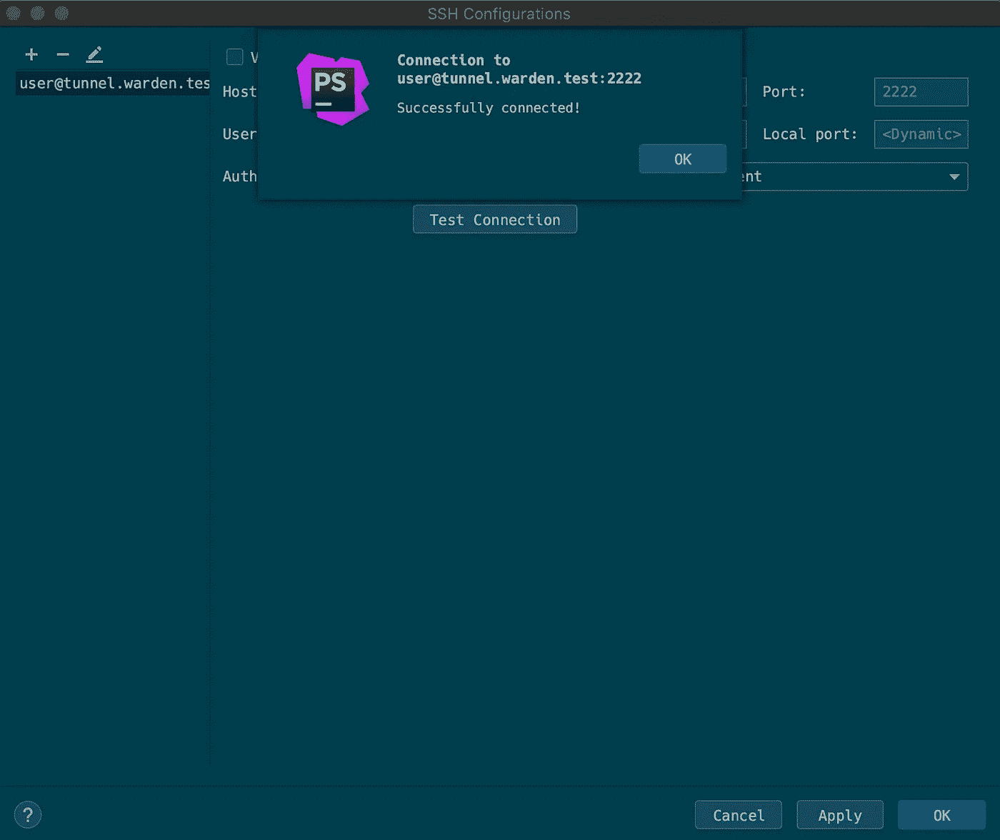
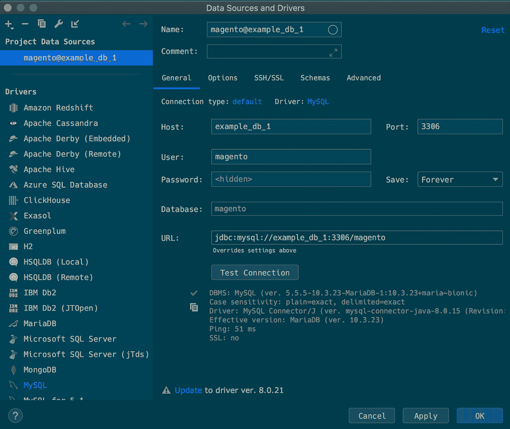

# 如何用 Docker 设置 Magento 2 开发环境

> 原文：<https://blog.devgenius.io/how-to-install-a-local-magento-2-environment-with-docker-5a698084c610?source=collection_archive---------0----------------------->


在 [Unsplash](https://unsplash.com/s/photos/whale?utm_source=unsplash&utm_medium=referral&utm_content=creditCopyText) 上由 [Cameron Venti](https://unsplash.com/@ventiviews?utm_source=unsplash&utm_medium=referral&utm_content=creditCopyText) 拍摄的照片

当我刚开始开发 PHP 应用程序时，我使用 Mamp 或 Xamp 来建立本地 Lamp 堆栈。

后来这在 VirtualBox 和最终 Docker 的组合中成了流浪者。

Docker 的主要优势是可移植性、性能和可伸缩性。这是值得的，尤其是当你在团队中工作的时候。

> 在 Magento 2 上使用 commerce 时，可以使用 [Magento Cloud Docker](https://devdocs.magento.com/cloud/docker/docker-config.html) 环境。

**docker 简介**

Docker 和 VM 之间的主要区别主要在于两者之间的架构。虚拟机是一种模拟真实计算机的计算机软件。为此，他使用了一种超级视觉——也称为“来宾机”。

虚拟机监控可以是运行虚拟机的软件、固件或硬件。hypervison 本身运行在一台真实的计算机上，这被称为“主机”。

hypervison 拥有完整的虚拟化堆栈，如网络适配器、存储和 CPU，以及自己的操作系统来运行程序。

容器和 VM 是相似的，但是容器和 VM 的主要区别在于容器使用主机内核，而主机内核又与其他容器共享它。

容器不需要完整的虚拟化堆栈和自己的操作系统来运行程序。



虚拟机与容器

然而，如果你想更深入地了解 docker 和 VM 之间的区别，我推荐你阅读“[一个对初学者友好的容器、VM 和 Docker 的介绍](https://www.freecodecamp.org/news/a-beginner-friendly-introduction-to-containers-vms-and-docker-79a9e3e119b/)”。

**什么是舍监**

对于那些已经使用过 Docker 的人来说，您可能会意识到建立一个 Docker 工作环境需要花费的时间。尤其是如果您没有 DevOps 团队或 sysadmin 来设置它。

现在你可以在 Github 上找到 Magento 2 的 Docker 环境，但是我和我的团队的体验并不总是完美的。通常它们不是最新的，它们不像你希望的那样工作，或者你不得不自己进行调整。最终我们找到了典狱长。

Warden 是一个 CLI 实用程序，即使您对 Docker 知之甚少或一无所知，也可以轻松安装 Magento 环境。根据典狱长的记录:

Warden 是一个 CLI 实用程序，用于编排基于 Docker 的开发人员环境，并通过使用几个集中运行的服务将请求代理到正确的环境容器中，使多个本地环境同时运行，而不会发生端口冲突。

这意味着您可以毫不费力地同时运行不同的本地环境，而不会相互冲突。典狱长有以下特点:

*   用于 SSL 终止和将请求路由/代理到正确容器的 Traefik。
*   Portainer 用于快速查看本地 Docker 主机内部正在运行的内容。
*   为其提供 DNS 响应的 Dnsmasq。测试域消除了/etc/hosts 的手动编辑
*   一个 SSH 隧道，用于从 Sequel Pro 或 TablePlus 连接到多个正在运行的数据库容器中的任何一个。
*   Warden 为在所有本地开发域上运行 https 颁发了通配符 SSL 证书。
*   在 macOS 和 Linux 上完全支持 Magento 1，Magento 2，Laravel，Symfony 4，Shopware 6。
*   能够基于每个项目覆盖、扩展或设置完全自定义的环境定义。

**准备工作**

要安装 Warden，您首先需要 Docker。此外，它只能在 Linux 或 macOS 上运行——据我所知，还没有办法在 windows 上运行 warden。如果你运行的是 macOS，我推荐安装 [Docker Desktop for Mac](https://hub.docker.com/editions/community/docker-ce-desktop-mac) 。对于 Linux，这就是 Docker for Linux。还需要 docker compose 和诱变剂 0.11.4 或更高。

**安装 Docker**

首先确保你有一个像 Homebrew for macOS 这样的包管理器来安装 Docker Desktop for Mac，然后运行:

```
brew cask install docker
```

这将安装以下软件:Docker 桌面、Docker 社区版、Docker CE。

要安装 Docker for Linux，您可以使用 Docker 引擎。

使用 snapcraft:

```
sudo snap install docker
```

使用 apt-get:

```
sudo apt-get install docker-ce docker-ce-cli containerd.io
```

**安装监护人**

```
brew install davidalger/warden/warden
warden svc up
```

**全球服务总监**

现在您已经安装了 warden，您可以通过运行以下命令来启动 warden:

```
warden up
```

这将启动典狱长的全球服务。参见: *docker ps*

```
❯ warden up
Creating network "warden" with the default driver
Creating traefik    ... done
Creating portainer ... done
Creating tunnel    ... done
Creating dnsmasq   ... done
```

这包括 traefik、portainer、dnsmasq 和 mailhog。这将为您提供对 GUI 的访问，您可以通过访问以下 URL 进行访问:

*   [https://traefik.warden.test/](https://traefik.warden.test/)
*   [https://portainer.warden.test/](https://portainer.warden.test/)
*   [https://dnsmasq.warden.test/](https://dnsmasq.warden.test/)
*   [https://mailhog.warden.test/](https://mailhog.warden.test/)

**监狱长命令**

Warden 有一些有用的命令，您可以使用它们与 warden 一起工作。

启动管理员:

```
warden up
```

停车管理员:

```
warden down
```

启动典狱长环境

```
warden env start
```

停止管理员环境

```
warden env down
```

管理员环境中的 SSH

```
warden shell
```

在管理员环境中运行命令

```
warden env exec php-fpm bin/magento
```

打开 MySQL 会话

```
warden db connect -A
```

显示 PHP 日志

```
warden env logs — tail 0 -f php-fpm php-debug
```

**创建一个项目**

为 Magento 2 设置一个 Warden 环境只需要几个步骤。

配置您的 Magento Marketplace 凭据

```
composer global config http-basic.repo.magento.com <username> <password>
```

让我们从创建一个项目开始

```
composer create-project — repository-url=https://repo.magento.com/ magento/project-community-edition — ignore-platform-reqs example && cd example/
```

将. env 文件添加到项目中。

```
warden env-init <example> magento2
```

这将创建一个。项目根目录下的 env 文件。例如，想更新你的 PHP 版本，你可以在这里做。

这个。env 文件用于 warden env 命令。更多详情见典狱长 env -h。

**创建一个 SSL 证书**

您可以按如下方式创建 SSL 证书:

```
warden sign-certificate example.test
```

确保该名称与中的“TRAEFIK_DOMAIN”相匹配。包封/包围（动词 envelop 的简写）

现在运行:

```
warden env up -d
```

第一次运行时，会创建以下内容:

*   Nginx
*   光泽面
*   PHP-FPM (7.0 以上)
*   MariaDB
*   弹性搜索
*   兔子 q
*   雷迪斯

这还会启动诱变剂同步会话，将您的文件同步到 Docker 容器。

查看结果:

```
❯ warden env up -d
Creating network "example_default" with the default driver
Creating example_elasticsearch_1 ... done
Creating example_rabbitmq_1      ... done
Creating example_db_1            ... done
Creating example_redis_1         ... done
Creating example_mailhog_1       ... done
Creating example_php-fpm_1       ... done
Creating example_php-debug_1     ... done
Creating example_nginx_1         ... done
Creating example_varnish_1       ... done
Connecting traefik to example_default network
Connecting tunnel to example_default network
Starting example_redis_1         ... done
Starting example_elasticsearch_1 ... done
Starting example_db_1            ... done
Starting example_rabbitmq_1      ... done
Starting example_mailhog_1       ... done
Recreating example_php-fpm_1     ... done
Recreating example_php-debug_1   ... done
Recreating example_nginx_1       ... done
Recreating example_varnish_1     ... done
Created session sync_CQ4ZVwER7plFTM0pOaMGrFUnhopfXMcKksgfpPfNPJK
Waiting for initial synchronization to complete
...................................................................
```

> 使用诱变剂同步会话将 webroot 中的文件同步到容器中，但发布/媒体除外，它仍然使用委托装载进行装载。

然后运行 *docker ps* 看看一切是否都在运行。



现在容器已经创建并运行了，我们可以继续安装 Magento 了。

打开到项目的 ssh 连接

```
warden shell
```

**安装 Magento**

*如果您已经有一个现有的 Magento 项目，请跳到下一步*

```
## Install Application
bin/magento setup:install \
    --backend-frontname=backend \
    --amqp-host=rabbitmq \
    --amqp-port=5672 \
    --amqp-user=guest \
    --amqp-password=guest \
    --db-host=db \
    --db-name=magento \
    --db-user=magento \
    --db-password=magento \
    --http-cache-hosts=varnish:80 \
    --session-save=redis \
    --session-save-redis-host=redis \
    --session-save-redis-port=6379 \
    --session-save-redis-db=2 \
    --session-save-redis-max-concurrency=20 \
    --cache-backend=redis \
    --cache-backend-redis-server=redis \
    --cache-backend-redis-db=0 \
    --cache-backend-redis-port=6379 \
    --page-cache=redis \
    --page-cache-redis-server=redis \
    --page-cache-redis-db=1 \
    --page-cache-redis-port=6379

## Configure Application
bin/magento config:set --lock-env web/unsecure/base_url \
    "https://${TRAEFIK_SUBDOMAIN}.${TRAEFIK_DOMAIN}/"

bin/magento config:set --lock-env web/secure/base_url \
    "https://${TRAEFIK_SUBDOMAIN}.${TRAEFIK_DOMAIN}/"

bin/magento config:set --lock-env web/secure/offloader_header X-Forwarded-Proto

bin/magento config:set --lock-env web/secure/use_in_frontend 1
bin/magento config:set --lock-env web/secure/use_in_adminhtml 1
bin/magento config:set --lock-env web/seo/use_rewrites 1

bin/magento config:set --lock-env system/full_page_cache/caching_application 2
bin/magento config:set --lock-env system/full_page_cache/ttl 604800

bin/magento config:set --lock-env catalog/search/engine elasticsearch7
bin/magento config:set --lock-env catalog/search/enable_eav_indexer 1
bin/magento config:set --lock-env catalog/search/elasticsearch7_server_hostname elasticsearch
bin/magento config:set --lock-env catalog/search/elasticsearch7_server_port 9200
bin/magento config:set --lock-env catalog/search/elasticsearch7_index_prefix magento2
bin/magento config:set --lock-env catalog/search/elasticsearch7_enable_auth 0
bin/magento config:set --lock-env catalog/search/elasticsearch7_server_timeout 15

bin/magento config:set --lock-env dev/static/sign 0

bin/magento deploy:mode:set -s developer
bin/magento cache:disable block_html full_page

bin/magento indexer:reindex
bin/magento cache:flush

## Generate an admin user
ADMIN_PASS="$(pwgen -n1 16)"
ADMIN_USER=localadmin

bin/magento admin:user:create \
    --admin-password="${ADMIN_PASS}" \
    --admin-user="${ADMIN_USER}" \
    --admin-firstname="Local" \
    --admin-lastname="Admin" \
    --admin-email="${ADMIN_USER}@example.com"
printf "u: %s\np: %s\n" "${ADMIN_USER}" "${ADMIN_PASS}"## Exit shell
exit
```

**安装现有的 Magento 2 项目**

下面的步骤与上面讨论的安装 Magento 的步骤相同。您首先需要的是现有项目的数据库导出，然后按如下方式导入它:

```
pv /path/to/<your_database_export>.sql | warden db import
```

或者将数据库导出复制到 php-fpm 容器中，并使用带有 drop tables 选项的 magerun 来导入数据库:

```
cp /path/to/<your_database_export>.sql <container_id>:/var/www/html
warden env exec php-fpm n98-magerun db:import --drop-tables <your_database_export>.sql
```

> 安装 Warden 时默认包含 Magerun，不用自己手动安装。

完成后，您必须将 URL 正确放入 core_config_data 表中:

使用 Magerun:

```
warden env exec php-fpm n98-magerun config:set web/unsecure/baseurl  http://app.example.test/

warden env exec php-fpm n98-magerun config:set web/secure/baseurl  https://app.example.test/

warden env exec php-fpm n98-magerun web/unsecure/base_media_url http://app.example.test/media/

warden env exec php-fpm n98-magerun web/secure/base_media_url https://app.example.test/media/
```

或者，您可以通过以下方式在当前项目中打开一个交互式 mysql 会话:

```
warden db connect -A
```

然后通过执行以下 sql 查询:

```
UPDATE `core_config_data` SET value = 'http://app.example.test' WHERE path = 'web/unsecure/baseurl';

UPDATE `core_config_data` SET value = 'https://app.example.test' WHERE path = 'web/secure/baseurl';

UPDATE `core_config_data` SET value = 'http://app.example.test/media/' WHERE path = 'web/unsecure/base_media_url';

UPDATE `core_config_data` SET value = 'https://app.example.test/media/' WHERE path = 'web/secure/base_media_url';
```

现在你的安装已经准备好了，你可以重新启动 Warden。

```
warden env down && warden env up -d
```

在浏览器中转到您的应用程序

[https://app . example . test](https://app.example.test)



**创建一个到数据库的 SSH 连接**

现在一切都已启动并运行，您可以如下所示连接到您的数据库。

*   主持人:<warden_env_name_db_1></warden_env_name_db_1>
*   用户:magento
*   密码:magento
*   数据库:magento
*   SSH 主机:tunnel.waren.test

**Tableplus**

创建新连接> MySQL >创建



**续作 Pro**



**PHPStorm**

1.  数据库>数据源> MySQL



2.SSH/SSL >使用 SSH 隧道>选择配置>



3.测试电路



**安装 Grunt 并配置 Live reload**

检查是否安装了 grunt:

```
❯ grunt --version
grunt-cli v1.3.2
```

如果不是:

```
npm install -g grunt-cli
```

将以下内容添加到您的*app/etc/env.php*

```
<?php
return [
    'system' => [
        'default' => [
            'design' => [
                'footer' => [
                    'absolute_footer' => '<script src="/livereload.js?port=443"></script>'
                ]
            ]
        ]
    ]
];
```

如果您还没有 Gruntfile 和 package.json，请添加它们。

```
cp Gruntfile.js.sample Gruntfile.js
cp package.json.sample package.json
```

安装节点包

```
npm install
```

将文件复制到 Docker php-fpm 容器中:

```
docker cp Gruntfile.js <container_id>:/var/www/html
docker cp package.json <container_id>:/var/www/html
docker cp node_modules <container_id>:/var/www/html
```

执行以下操作:

```
warden env exec php-fpm grunt clean && grunt less
```

最后

```
warden env exec php-fpm grunt watch
```

至此:“如何用 warden 为 Magento 设置一个本地 Docker 环境”。在第二部分，我将讨论如何在 Magento 2 和 Warden 中设置多个商店视图。

# 觉得这个帖子有用吗？请点击👏下面的按钮！:)

*来源:*

*   对容器、虚拟机和 Docker 的初学者友好的介绍
*   [在 Ubuntu 上安装 Docker 引擎](https://docs.docker.com/engine/install/ubuntu/)
*   [安装监护人](https://docs.warden.dev/installing.html)