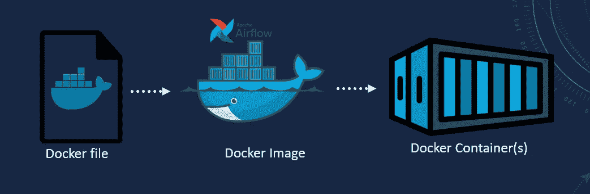
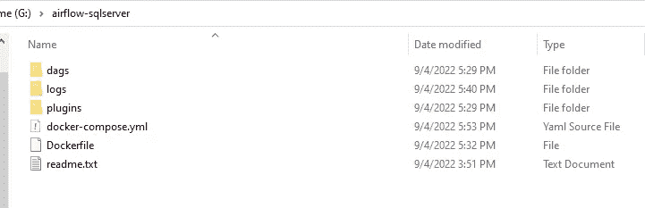
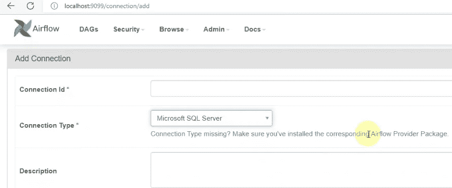

# 如何用自定义镜像在 Docker 上安装 Apache Airflow？

> 原文：<https://blog.devgenius.io/how-to-install-apache-airflow-on-docker-with-a-custom-image-73934760045f?source=collection_archive---------3----------------------->

**利用阿帕奇气流，Docker**



Apache Airflow Docker 安装

今天，我们将涵盖阿帕奇气流安装。我们将在码头上安装气流。在本教程中，我们将使用 SQL Server provider 等额外的库来构建 Airflow 的自定义 docker 映像，因为我们在之前的[air flow 会话](/how-to-automate-etl-pipelines-with-airflow-62484ee5ef4c)中已经将 SQL Server 作为源进行了介绍。我们已经在该课程中介绍了 Apache Airflow 和 Airflow Dag。

此 Apache Airflow 安装将使您能够:

*   在码头集装箱中设置气流环境
*   构建自定义 Docker 图像
*   安装 Airflow 的 SQL Server 提供程序

完整的代码可在 [GitHub](https://github.com/hnawaz007/pythondataanalysis/tree/main/AirflowInstallation) 上获得。视频教程可以在 YouTube 上找到。

在我们开始之前，请确保您已经在工作站上安装并配置了[Docker Community Edition(CE)](https://docs.docker.com/engine/installation/)。

此外，我们需要 [Docker 在我们的工作站上编写](https://docs.docker.com/compose/install/)。我使用的是 windows，并且已经安装并运行了 Docker 桌面。

我们可以通过在命令提示符下发出以下命令来确认 docker 已安装。如果安装了，这将显示 docker 版本。

```
docker --version
```

有了这个。让我们开始安装过程。我们将创建一个新文件夹，我们称之为“ *airflow-sqlserver* ”。我们将把所有安装文件保存在这个文件夹中。要在 Docker 上运行 Airflow，我们需要一个 docker-compose.yml 文件。我们可以从 [Airflow 的文档网站](https://airflow.apache.org/docs/apache-airflow/stable/start/docker.html)获得。讨论了 docker 应用对气流的要求。我们将向下滚动到 docker-compose.yaml 部分。我们可以在一个新窗口中打开文件，并完整地复制它。

如果这是我们的第一次气流安装，那么我们可以使用这个文件的一个变化。在第 19 行，删除“后端”后面的“S”。它应读作如下。

> air flow _ _ API _ _ AUTH _ back end:' air flow . API . AUTH . back end . basic _ AUTH '

如果有一个 Airflow 实例正在运行，那么您需要更改 web 服务器和 flower 的端口。我们将分别为 *dags* 、 *logs* 和 *plugins* 创建三个文件夹。

让我们创建一个 Dockerfile 文件，这允许我们建立一个自定义的气流图像。如果你是 Docker 的新手，那么请随意使用自定义图像查看“[”。每当我们想要添加额外的库时，我们就构建一个包含额外的库/依赖项的自定义映像，例如，我们将添加 Airflow 的 SQL Server 提供程序。我们在 docker-compose.yaml 旁边创建了一个自定义 docker 文件。](https://airflow.apache.org/docs/apache-airflow/stable/start/docker.html#using-custom-images)

在这个文件中，我们使用正式的 airflow 映像，然后运行几个 pip 命令来安装 Airflow 的 odbc 和 SQL Server 提供程序。此外，我们安装 pyodbc 来建立到 SQL Server 的连接。让我们也保存这个文件。我们将这个文件保存在同一个目录中。这就是我们的安装目录的样子。



气流安装目录

让我们打开命令并导航到安装目录。我们将发出一个 docker 构建命令，带有一个图像名称标签。我们姑且称之为气流-sqlserver。然后，我们为当前目录提供 Docker 文件和点。如果以前尝试过构建同名文件，我们会忽略缓存。这将开始建立自定义气流图像。这可能需要一段时间，具体取决于我们正在安装的库的数量。

```
docker build -t airflow-sqlserver -f Dockerfile . --no-cache
```

一旦映像构建成功，我们就可以用 docker-compose up 命令运行这个映像。

```
docker-compose up
```

这将运行图像及其下的所有容器。这将显示 docker-compose 文件中列出的各种容器。一旦网络服务器启动。我们可以用本地主机和端口 9099 在浏览器中启动它。或者您在 yaml 文件中指定的任何端口。这将启动气流。我们已经成功地在 docker 上安装了 Apache Airflow。我们可以使用默认用户和密码登录；在 yaml 文件中设置为气流。让我们导航到管理和连接，并添加一个新的连接。我想检查 SQL Server 是否被列为来源之一。如果我们安装基本气流映像，则默认情况下不会安装该提供程序。它被列为提供者之一。



安装了自定义映像的 Airflow SQL Server 提供程序

**结论**

*   我们介绍了如何在 Docker 上安装 Apache Airflow？
*   我们展示了如何创建一个定制的 Docker 映像以及如何运行这个映像。
*   我们安装了 Airflow 的 SQL Server provider，并使用它来建立到 SQL Server 数据库的连接。
*   完整的代码可以在[这里](https://github.com/hnawaz007/pythondataanalysis/tree/main/AirflowInstallation)找到