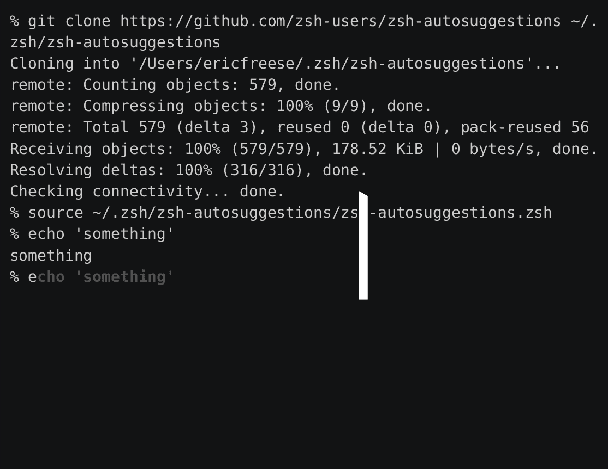

# 如何在您的 zsh 终端中安装自动完成/自动建议

> 原文：<https://blog.devgenius.io/how-to-install-auto-complete-auto-suggestions-in-your-zsh-terminal-ec77362ad068?source=collection_archive---------0----------------------->

登上自动完成(也称为自动建议)列车。这会让你的终端生活变得更加轻松，也更加华丽。

如果你不知道我在说什么，想象一下，每当你开始在你的终端上键入一个命令，就会有一个自动预测你可能想要键入什么。

这是该功能的直观表示:



礼貌[zsh——自我暗示](https://github.com/zsh-users/zsh-autosuggestions)。

你看到了吗？基于您自己运行命令`echo 'something'`的终端历史，随后键入`e`能够预测您想要再次运行`echo 'something'`。

如果你想通过自动建议，那么你所要做的就是点击前进键(也称为右箭头键或→)或结束键。砰，节省了大量的击键次数。

自动建议也默认为浅灰色，但是您可以使用环境变量自定义它的颜色。但是让我们先把它修好。

所以首先，你需要在你的系统上安装 Zsh 版本`v4.3.11`或更高版本。您如何知道您使用的是哪个版本？在您的终端中键入以下命令:

```
zsh --version
```

如果您得到一个带有版本名的输出，并且您在`v4.3.11`之上，那么您就可以开始了。

如果你没有安装`zsh`，那么我建议你按照[这些步骤](https://github.com/ohmyzsh/ohmyzsh/wiki/Installing-ZSH#install-and-set-up-zsh-as-default)来让它工作。

一旦你的`zsh`准备就绪，安装这个自动建议功能实际上相当容易。这是因为这一切都是这个名为 [zsh-autosuggestions](https://github.com/zsh-users/zsh-autosuggestions) 的免费开源项目所做的。

我将分解你可以下载它的不同方法。

# 包管理器

您可以使用特定于您的操作系统(OS)的软件包管理器来下载它。例如，如果你在 Mac OS 上，那么你可以使用自制软件。你只会跑:

```
brew install zsh-autosuggestions
```

顺便说一下，如果你没有自制软件，可以看看我的另一篇关于如何获得它的文章。它将在您的 Mac OS 开发过程中非常有用:

[](/how-to-install-homebrew-brew-on-mac-d438c8788759) [## 如何在 Mac 上安装家酿(brew)

### 如何安装一个非常流行的包下载管理器？

blog.devgenius.io](/how-to-install-homebrew-brew-on-mac-d438c8788759) 

无论如何，系统到包绑定的完整列表可以在 zsh-auto suggestions[install . MD 文档](https://github.com/zsh-users/zsh-autosuggestions/blob/master/INSTALL.md#packages)中找到。如果你在 Debian / Ubuntu、NixOS、NetBSD 等平台上，可以去看看。

# 抗原

使用抗原？然后只需将它添加到您的`.zshrc`文件中:

```
antigen bundle zsh-users/zsh-autosuggestions
```

然后开始一个新的终端会话，您就可以开始了。

# 哦，我的 Zsh

哦，我的 Zsh 很棒，用它安装`zsh-autosuggestions`一点也不困难。首先，导航到`$ZSH_CUSTOM/plugins`目录，默认为`~/.oh-my-zsh/custom/plugins`。因此，确切的命令应该是:

```
cd $ZSH_CUSTOM/plugins
```

在那里，您将需要使用以下命令对`zsh-autosuggestions`库进行 git 克隆:

```
git clone https://github.com/zsh-users/zsh-autosuggestions ${ZSH_CUSTOM:-~/.oh-my-zsh/custom}/plugins/zsh-autosuggestions
```

然后，打开你的`~/.zshrc`文件。例如，如果您喜欢使用 Vim，您可以这样做:

```
vim ~/.zshrc
```

您也可以在任何文本编辑器或您选择的 IDE 中打开它。

进入后，向下滚动到(或使用查找功能)显示`plugins`的部分。例如，它看起来像这样:

```
plugins=( 
    git
)
```

在那里，用空格或换行符隔开，加上`zsh-autosuggestions`。

```
plugins=( 
    git autosuggestions
)
```

然后启动一个新的终端窗口。该功能将被解锁！

# 手动(仅通过 git 克隆)

您可以将`zsh-autosuggestions`库克隆到您的机器上。存储库本身建议了一个位置`~/.zsh/zsh-autosuggestions`。您可以运行的命令是:

```
git clone [https://github.com/zsh-users/zsh-autosuggestions](https://github.com/zsh-users/zsh-autosuggestions) ~/.zsh/zsh-autosuggestions
```

然后，您只需导航到您的`.zshrc`文件并编辑它，如果您使用的是 Vim，可能是这样的:

```
vim ~/.zshrc
```

同样，您可以在自己选择的文本编辑器或 IDE 中编辑这个文件。

在那里，只需在文件中的任何地方添加下面的行，只要它在自己单独的行上。换句话说，它是在文件的开头、中间还是结尾并不重要:

```
source ~/.zsh/zsh-autosuggestions/zsh-autosuggestions.zsh
```

然后开始一个新的终端会话，嘭，自动建议城市！

无论你决定用哪种方式来安装这个功能，我都强烈建议你让它工作起来，然后把这个消息传播给你的同学、同事、朋友和任何你关心的人，让他们用这个提高效率的技巧来提高效率。

这篇文章背后的所有功劳都归于开发了 [zsh-autosuggestions](https://github.com/zsh-users/zsh-autosuggestions) 并使其超级容易安装的人们。

如果你觉得这篇文章很有帮助或者只是喜欢阅读它，可以考虑[注册成为一名媒体会员](https://tremaineeto.medium.com/membership)。每月 5 美元，你可以无限制地阅读媒体上关于软件、技术等主题的报道。如果你[用我的链接](https://tremaineeto.medium.com/membership)注册，我会得到一小笔佣金。

[](https://tremaineeto.medium.com/membership) [## 通过我的推荐链接加入 Medium—Tremaine Eto

### 作为一个媒体会员，你的会员费的一部分会给你阅读的作家，你可以完全接触到每一个故事…

tremaineeto.medium.com](https://tremaineeto.medium.com/membership)