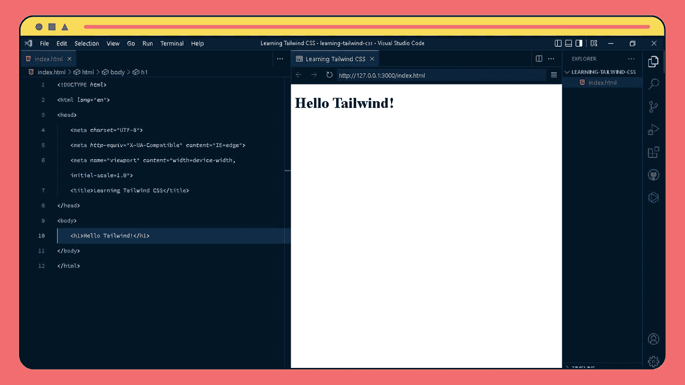
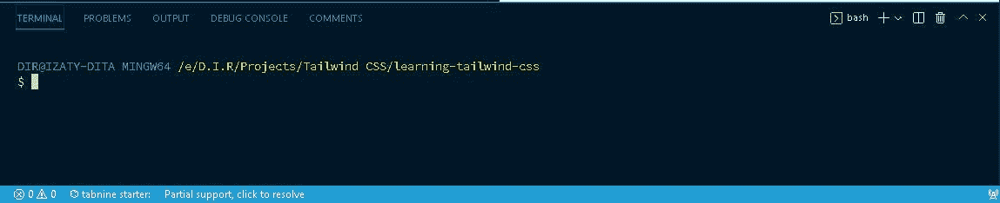
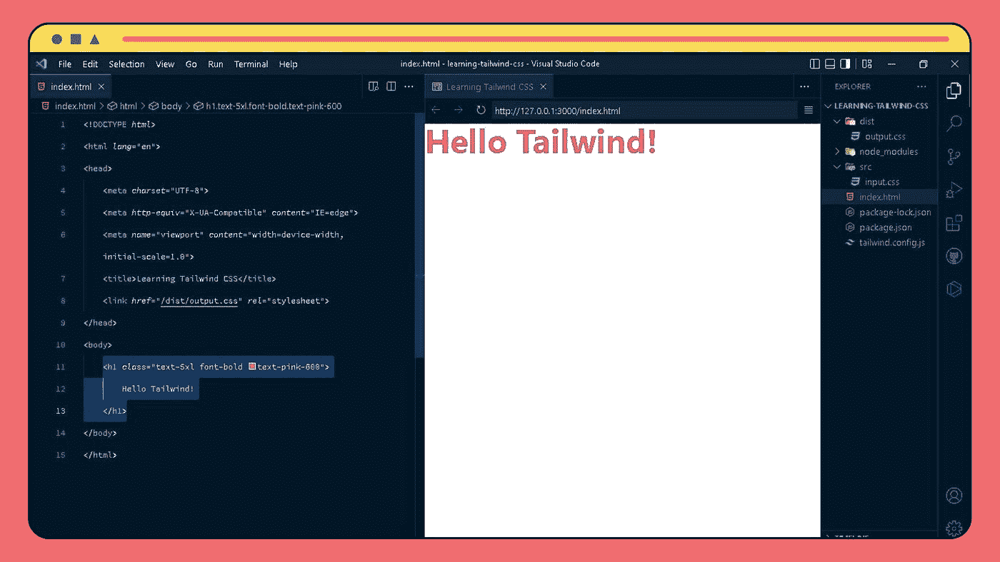
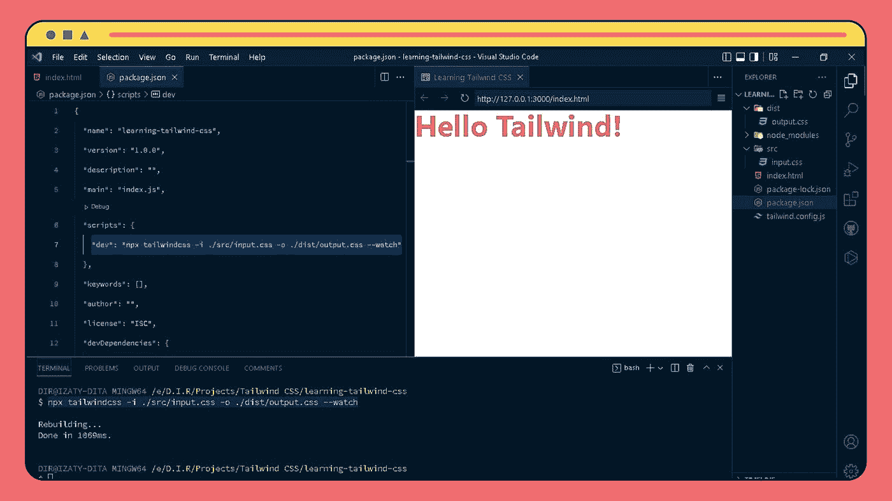
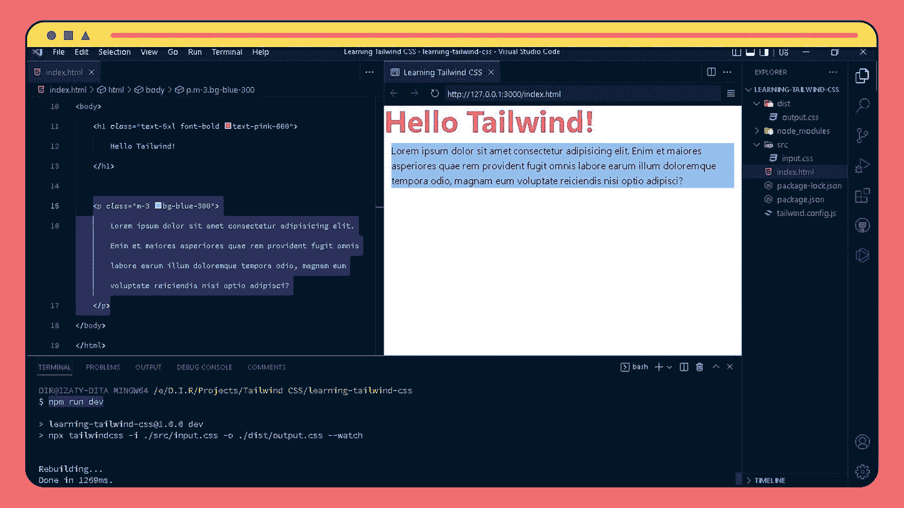

# 如何安装和配置 Tailwind CSS |初学者指南

> 原文：<https://blog.devgenius.io/how-to-install-configuration-tailwind-css-beginners-guide-82aa2d87c3da?source=collection_archive---------11----------------------->


# 🔎介绍

Tailwind CSS 是一个实用至上的 CSS 框架，用于快速响应的 web 开发。Tailwind 旨在帮助您用尽可能少的定制代码创建可伸缩和可维护的项目。该框架包括各种易于使用和受益的特性，例如模块化构建工具、浏览器支持标志、Sass 支持和预构建的 mixins。在本文中，我将向您展示如何在您的下一个项目中开始使用 Tailwind CSS！

# 🖥软件要求

首先，当然我们必须有一个网络浏览器，你可以使用谷歌浏览器或其他浏览器。此外，我们还必须安装一个代码编辑器，这里我将使用 VS 代码，然后我们还必须安装几个支持扩展，以帮助我们更容易地编码和运行我们的顺风 css 项目。我们必须安装的扩展有:

# ✨开始吧

在我们的电脑上安装 Tailwind 有几种方法。我们可以用 tailwind cli，post css，我们用的框架，或者最简单的方法，cdn。

我将向您展示如何使用 Tailwind CLI 安装它。在我们开始之前，不要忘记准备项目文件夹。你可以创建一个名为`learning-tailwind-css`的新文件夹，也可以随意命名。

之后，我们打开我们的 VS 代码，然后通过点击`File - Open Folder - Search for and selecting the folder we created earlier`打开我们之前创建的文件夹。是的，我们现在在将要创建的项目文件夹中。

现在，在我们的项目文件夹中，创建一个名为`index.html`的新 HTML 文件，并用下面的代码填充它。

```
<!DOCTYPE html>
<html lang="en"> 
  <head> 
    <meta charset="UTF-8">
    <meta http-equiv="X-UA-Compatible" content="IE=edge">
    <meta name="viewport" content="width=device-width,
    initial-scale=1.0">
    <title>Learning Tailwind</title>
  </head>
  <body>
    <h1>Hello Tailwind</h1>
  </body>
</html>
```

这是结果:



# 🧵装置顺风 CSS

这里我们需要一个终端，在这种情况下我将使用一个已经集成了 VS 代码的终端。可以打开`View`然后选择`Terminal`，也可以使用键盘快捷键`Ctrl + '`，这时终端会出现在底部。



好的，因为我们在这里使用 npm，所以最好在进入顺风安装之前初始化我们的应用程序。因此，在我们的终端中，首先键入以下命令:

这样，tailwind 将生成一个名为`package.json`的文件，其中包含所有必需的信息和默认值。

现在是我们安装顺风 css 的时候了，走吧…

首先，您需要通过 npm 安装 Tailwind CSS。为此，在终端上运行以下命令:

```
npm install -D tailwindcss
```

下一步是在我们的应用程序中初始化 tailwind，方法是键入以下命令:

```
npx tailwindcss init
```

当您运行该命令时，我们的文件夹中会生成一个名为`tailwind.config.js`的新文件。

我们的模板文件路径必须在这里配置。这个模板文件是我们的 html/javascript 文件，我们将在其中放置 tailwind 类，它必须存储在内容中。在`tailwind.config.js`文件中添加所有模板文件的路径。

打开您的`tailwind.config.js`文件。删除文件中的内容，然后用下面的代码粘贴它。

在这个内容部分，我们将解释我们把网络文件放在哪里。

我们现在需要一个 tailwind 指令，所以我们将通过这三个命令行运行 tailwind CSS，并将其保存为一个 CSS 文件。

```
@tailwind base;
@tailwind components; 
@tailwind utilities;
```

现在，在我们的应用程序中，创建一个名为`src`的新文件夹，并在其中创建一个名为`input.css`的文件。然后将上面的三行内容粘贴到新创建的 css 文件中。

这三个被称为指令/函数，归基于 PostCSS 编写的 Tailwind CSS 所有。所以这不是普通的 css，所以后来在运行之前，tailwind 会先通过这个 css 文件，一旦通过这个 css 文件，它就会运行这 3 层的 tailwind，在后来之前会创建一个新的 CSS 文件，就是我们 web 使用的文件(编译)。

现在我们将运行构建过程。因此，我们将创建最终的 CSS 文件，将用于我们的网站。通过运行以下命令来实现这一点。

```
npx tailwindcss -i ./src/input.css -o ./dist/output.css --watch
```

因此，该命令将使用输入文件`input.css`运行 Tailwind 应用程序。CSS 然后生成输出文件`output.css`。command - watch 的意思是每一个变化都会被 tailwind 知道，所以我们在 html 文件中做的任何事情都会被立即处理。这是因为顺风功能被称为即时引擎。稍后，在我们关闭它之前，该过程将继续。

如果成功，那么在命令执行之后，在我们的文件夹中现在有一个名为`output.css`的文件。在那个文件中，你可以看到很多 CSS 代码。是 Tailwind 把`input.css`的内容编译成`output.css`的结果。`output.css`是我们将在网站上使用的内容。

现在，在`index.html`文件中，我们添加了一个指向输出文件的链接标签。即在 ***头*** 内添加以下指令。

现在，Tailwind 的安装和配置已经完成。我们现在可以利用顺风了。

接下来，让我们尝试对之前制作的`index.html`文件进行样式化。

例如，这里我们想使我们的 h1 文本加粗，然后文本大小是 5xl (3 雷姆)，然后文本颜色是粉红色。所以我们只是把这个类添加到我们的 ***h1*** 中。

它看起来会像这样:



**附加:**

现在，我们将把这个脚本`npx tailwindcss -i ./src/input.css -o ./dist/output.css --watch`转移到我们的 npm 中，这样我们就不必每次停下来想继续我们已经开始的顺风项目时都要写很长的脚本。

诀窍是首先通过点击活动终端上的`Ctrl + C`来终止我们终端中的构建过程。

然后，在`package.json`文件中，用以下脚本替换脚本部分:

```
"dev": "npx tailwindcss -i ./src/input.css -o ./dist/output.css --watch"
```



此外，如果我们想要重新运行构建过程，我们只需要在终端中键入以下命令。

其中`dev`是我们之前创建的脚本的关键字。后来，当我们输入命令时，它会运行前面的命令`npx tailwindcss-i./src/input.css-o./dist/output.css-watch`。所以这对我们来说会更容易，因为不需要像那样写很长的命令。

现在，我们返回到我们的`index.html`文件，并尝试通过包含以下代码来创建一个边距为 3、背景为蓝色的新段落:

```
<p ="m-3 background-blue-300"> Lorem ipsum dolor sit amet consectetur adipisicing elit. Enim et maiores asperiores quae rem provident fugit omnis labore earum illum doloremque tempora odio, magnam eum voluptate reiciendis nisi optio adipisci? </p>
```

然后，在我们的终端中，键入`npm run dev`重新运行构建过程并查看更改。



***

这就是我在这篇文章中要说的关于安装和配置 tailwind css 的全部内容。感谢您花时间阅读这篇文章。希望对阅读的人有所帮助，帮助读者朋友了解如何安装&配置 tailwind css。

请让我知道这篇文章是否有帮助，如果你有任何额外的解释，请在评论区留下，这样你的朋友也可以学习。就这些，谢谢大家。

**让我们每天一起学习吧！~** ✨🚀

我希望在我的下一篇博客中再次见到你。照顾好自己，继续学习到那时候~👋💙

***

你觉得这篇文章有价值吗？ *如果你喜欢这篇文章，请喜欢、评论并分享这篇文章。*

**在 Twitter 上关注我:**[**@ Dita Izaty**](https://twitter.com/ditaizaty)
**联系我:**[**Dita Izaty**](https://dita-izaty.carrd.co/)

*原发布于*[*https://dir-blogs . hash node . dev*](https://dir-blogs.hashnode.dev/how-to-install-configuration-tailwind-css-beginners-guide)*。*