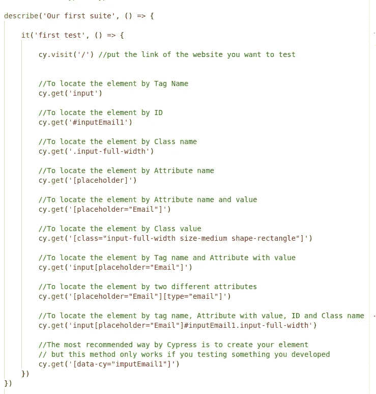

# Cypress:如何安装和创建你的第一个测试？

> 原文：<https://blog.devgenius.io/how-to-install-create-your-first-test-with-cypress-io-d45418870f56?source=collection_archive---------14----------------------->

如果你不知道 Cypress.io 是什么，你可以点击下面的链接查看我的第一篇博客。

 [## Cypress.io，这是怎么回事？

### Cypress.io 是一个用户友好的测试自动化工具，用于端到端测试、UI 测试、回归套件、集成…

blog.devgenius.io](/cypress-io-what-is-it-all-about-4bee1b538042) 

因此，在这篇博客中，我将关注如何使用 cypress 安装和创建您的第一个测试。为此，我会在 GitHub 上给你一个项目，让你可以进行第一次测试。

在从 GitHub 克隆一个项目并安装 cypress 之前，首先，我们需要准备开发环境。

开始时，我们需要安装以下软件:

1.  ***安装谷歌 Chrome 浏览器***
2.  **安装 node . js**
3.  ***安装 Git***
4.  ***安装一个 IDE*** (最好是 Visual Studio【适合初学者】)

完成这些安装后，您可以继续下一步，从 GitHub 克隆一个项目。

使用终端克隆这个项目，或者下载并使用这个项目作为 cypress 测试的初学者手册。

GitHub 项目链接:

 [## GitHub-Postavshik/ngx-cypress-UdemyClass 测试

### 此时您不能执行该操作。您已使用另一个标签页或窗口登录。您已在另一个选项卡中注销，或者…

github.com](https://github.com/Postavshik/ngx-cypress-test/tree/UdemyClass) 

在设备中克隆项目后，打开您安装或使用的 ide，并在 IDE 中打开您克隆的项目。

在 IDE 中打开终端，键入 ***npm install***

之后输入 ***npm 安装柏树*** 就可以直接在项目中安装柏树了

为了确认您可以使用 cypress 开始测试，在终端中执行以下操作

键入 ***cd 柏/集成*** 来导航到测试脚本的位置

然后运行柏树测试类型 ***npx 柏树打开***

然后从提供的列表中点击***first test . spec . js***，它应该运行测试

现在，我们已经安装并运行了我们的第一个测试，这里有一些关于如何使用 cypress 进一步改进测试的例子。

键入终端 ***cd cypress*** 然后你会被进一步导航到 cypress 文件夹，然后你可以运行***npx cypress open***并测试其他 spec.js 文件，看看它们是如何工作的。

现在，在做了所有这些试验之后，你将能够开始想象你将在你愿意测试的平台上做什么样的测试。

所以现在，我将离开你。进一步探索这些测试，如果您认为您已经准备好了，您可以直接创建您的第一个测试，通过在 cypress 文件夹中创建一个名为[filename.spec.js]的文件。

您首先学习如何定位您的元素，然后我们可以在下一篇博客中更进一步，在那里我将提供自动化测试和验证的其他方面的更多知识。

现在，我将把这些信息留给你，这里是一个附加的

 [## Cypress 介绍| Cypress 文档

### Cypress 如何查询 DOM Cypress 如何管理主题和命令链断言看起来像什么以及它们如何…

docs.cypress.io](https://docs.cypress.io/guides/core-concepts/introduction-to-cypress) 

所以在上面的链接中，你将会了解这个工具是如何工作的，配置，以及 Cypress 中的所有东西，让你从端到端的自动化测试中获得乐趣。

> “比起测试行为，设计测试的行为是已知的最好的错误预防措施之一。创建一个有用的测试所必须进行的思考可以在错误被编码之前发现并消除它们——事实上，测试设计思考可以在软件创建的每个阶段发现并消除错误，从概念到规范，到设计、编码等等。”鲍里斯·贝泽尔

本系列的下一个故事将是我在 Cypress 实践中做自动化测试时学到的一些东西，也是关于如何编写某些代码和验证的

 [## 通过我的推荐链接加入媒体-侯赛因巴申

### 作为一个媒体会员，你的会员费的一部分会给你阅读的作家，你可以完全接触到每一个故事…

husseinbaashen.medium.com](https://husseinbaashen.medium.com/membership)