# 如何在 windows XAMPP 上安装 Flarum

> 原文：<https://blog.devgenius.io/how-to-install-flarum-on-windows-xampp-1db9448dd2d9?source=collection_archive---------6----------------------->

## 论坛安装

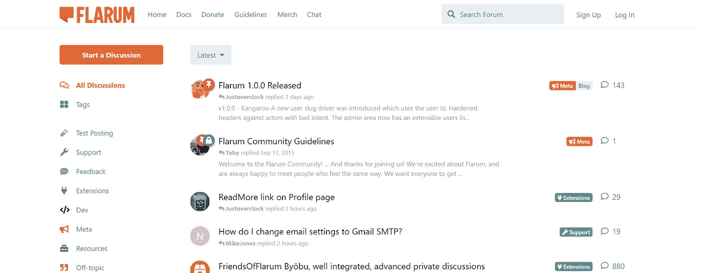

在假日期间，我们通常使用 slickdeals.net 的[来寻找好的交易。Slickdeals 交易由社区成员发布。是的，Slickdeals 是一个论坛。它建在 vBulletin 上。你可以在](https://slickdeals.net/)[线程](https://slickdeals.net/forums/forumdisplay.php?f=9) 页面看到 vBulletin 主题。vBulletin 是有执照的。

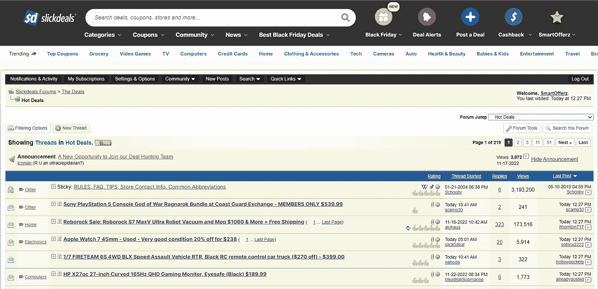

基于 Slickdeals 的启发，我搜索了 PHP 上的开源论坛。

## 论坛

Flarum 是最好的开源 PHP 论坛。我计划在我的本地开发环境中尝试 Flarum。所以决定把详细的安装步骤写在这篇博客里。

## 论坛安装

官方 [Flarum 文档](https://docs.flarum.org/install)中已经提供了系统要求和基于 composer 的安装步骤。

## 1.安装 XAMPP

在我的 windows 笔记本电脑上，我已经安装了 XAMPP。 [**点击这里**](https://www.apachefriends.org/) 安装最新的 XAMPP。

> XAMPP 是由 Apache Friends 开发的免费开源跨平台 web 服务器解决方案堆栈包，主要由 Apache HTTP Server、MariaDB 数据库和用 PHP 和 Perl 编程语言编写的脚本解释器组成。

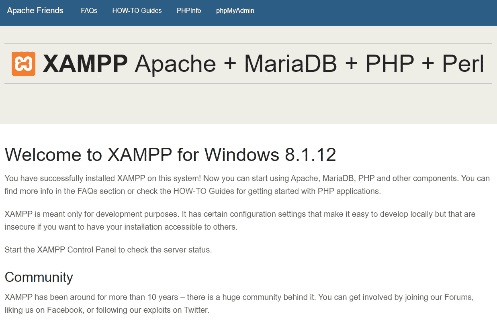

## 2.安装 PHP 编写器

[Composer](https://getcomposer.org/) 是 PHP 的依赖管理器。类似 Nodejs npm。

[下载](https://getcomposer.org/download/)安装的 windows 并完成您的 composer 安装。

## 3.创建一个 Flarum 项目

在终端中，转到 XAMPP htdocs 文件夹，运行下面的安装命令。

```
composer create-project flarum/flarum flarum
```

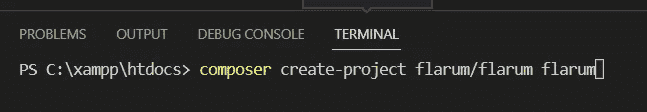

## 4.添加 Apache 虚拟主机

在 composer 命令之后，我们需要在 XAMPP Apache 服务器上添加虚拟主机。

打开`C:\xampp\apache\conf\extra\httpd-vhosts.conf`文件，添加以下代码。

```
<VirtualHost *:80>
    DocumentRoot "C:/xampp/htdocs/flarum/public"
    ServerName www.flarum.local
</VirtualHost>
```

然后在 XAMPP 控制面板上重启 Apache 服务

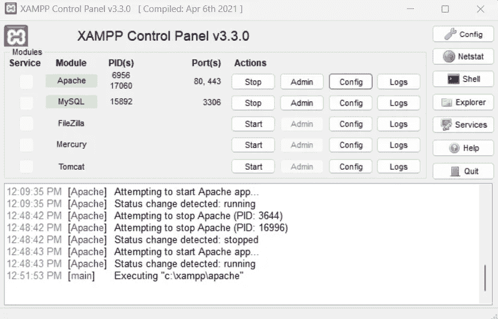

现在试试浏览器[中的虚拟主机 URL http://www.flarum.local/](http://www.flarum.local/)。您将看到下面的“此网站无法访问”错误屏幕。

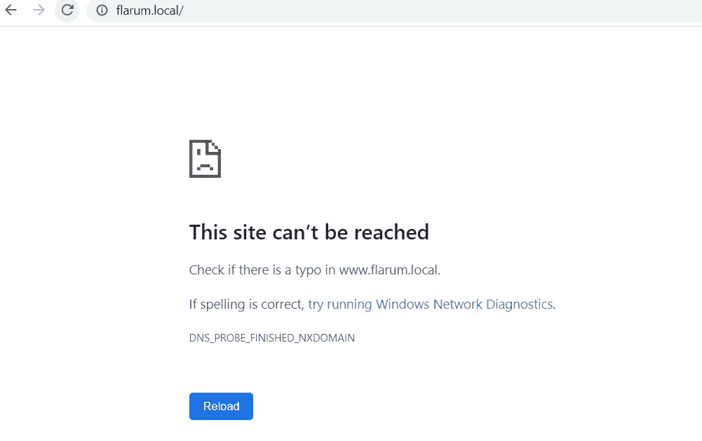

我们错过了更重要的一步。需要在 windows 主机文件中添加主机条目。

打开 C:\ Windows \ System32 \ drivers \ etc 文件夹下的 windows **hosts** 文件

`C:\Windows\System32\drivers\etc\hosts`

```
127.0.0.1 flarum.local
```

## 5.启用所需的 PHP 扩展

现在在浏览器中访问您的开发[http://www.flarum.local/](http://www.flarum.local/)网址。如果 php.ini 上没有启用 GD 库，您会看到下面的错误屏幕

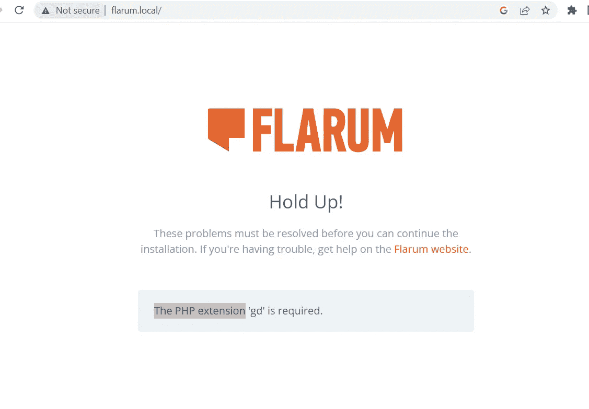

打开 XAMPP 控制面板，点击 Apache **config** 按钮，然后选择 PHP (php.ini)选项。

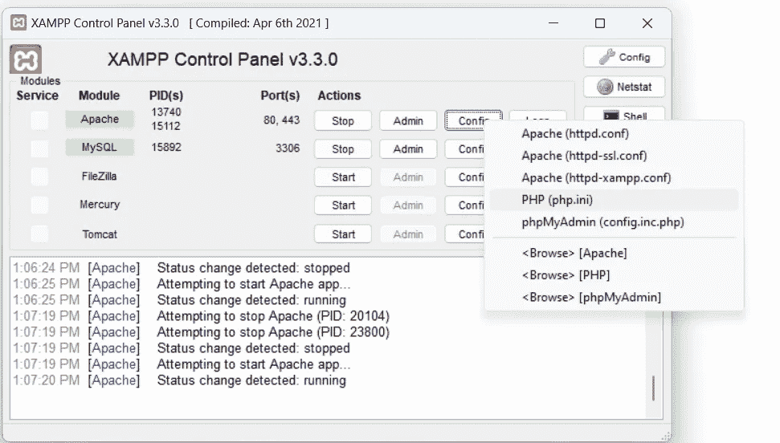

在记事本上搜索 GD。然后去掉分号**扩展=gd**

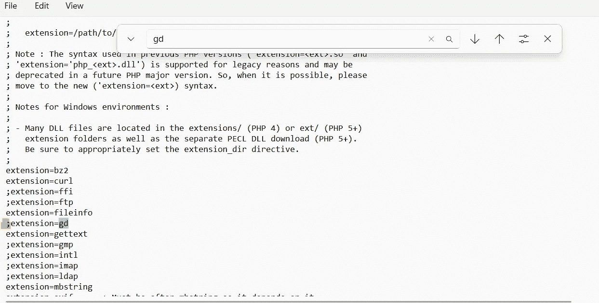

之后，保存文件并重启 Apache 服务器。

## 6.安装 Flarum

重新加载浏览器，你会得到安装屏幕。

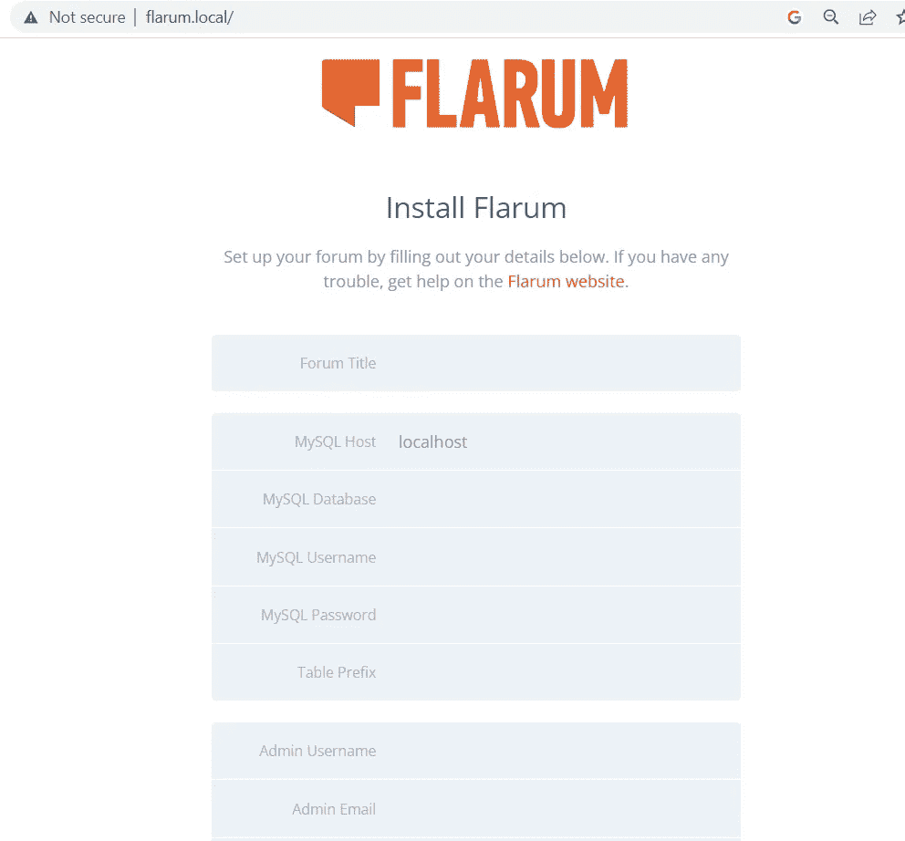

在 XAMPP phpMyAdmin[http://localhost/phpMyAdmin/](http://localhost/phpmyadmin/)上创建一个新的数据库，并按照说明完成安装。

我们完成了 Flarum 的安装。管理页面看起来惊人的[http://flarum.local/admin#/](http://flarum.local/admin#/)

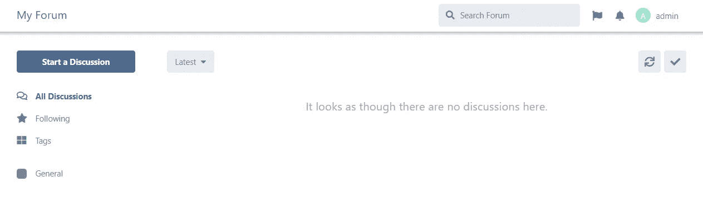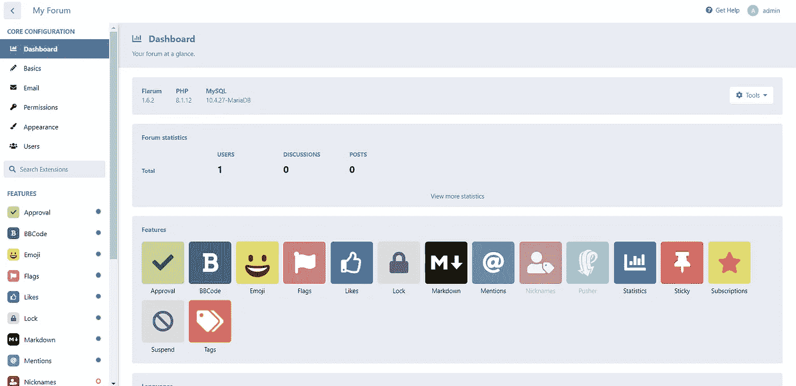

尝试安装步骤，并在论坛上分享您的反馈。我会在我的下一个博客上分享我的经历。

感谢您的阅读。

敬请关注更多内容！

*跟我来*[***balajidharma.medium.com***](https://balajidharma.medium.com/)。