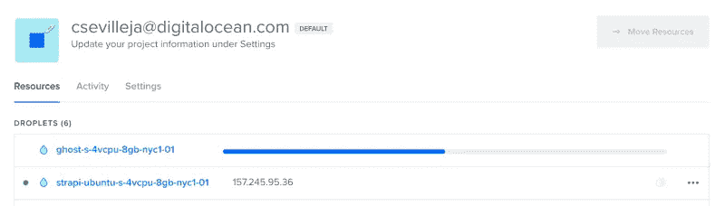

# 如何在数字海洋上一键安装 Ghost CMS

> 原文：<https://blog.devgenius.io/how-to-install-ghost-cms-on-digitalocean-with-1-click-f281ac9f7810?source=collection_archive---------25----------------------->


[Ghost](https://ghost.org/) 是一个基于 Node.js 构建的开源 CMS，它已经存在了一段时间，并且因为它对[开源](https://github.com/TryGhost/Ghost)的承诺和保持独立公司的地位而拥有了强大的追随者。[幽灵](https://ghost.org/)甚至如此开源透明，你可以查看他们的[收入和收益](https://ghost.baremetrics.com/)。

Ghost 可以是一个由 Ghost 在 ghost.org 托管的解决方案，也可以在自己的托管解决方案上托管自己的实例，如数字海洋。Ghost 的定价根据每月浏览量和现有员工数有所提高。在 [DigitalOcean](https://www.digitalocean.com/?utm_source=scotch.io) 上自己托管意味着你只需要为你创建的服务器付费。


# [幽灵特征](https://scotch.io/tutorials/install-ghost-on-digitalocean-with-1-click#toc-ghost-features)

Ghost 有很多有用的功能。

*   简洁现代的用户界面
*   易于使用的内容编辑器
*   移动内容管理
*   美丽的主题
*   数百个与时事通讯的集成，等等
*   内置用户成员资格(如果使用 Ghost 托管版本)
*   被用作无头 CMS

最近我最感兴趣的一个特性是 Ghost 可以作为无头 CMS 使用。这意味着我们可以创建一个 Ghost 站点，并通过 API 使用像 [Gatsby](https://www.gatsbyjs.org/) 这样的工具来消费它的内容。Ghost 支持 [JAMstack](https://jamstack.org/) 型号！

# [在数字海洋上安装 Ghost](https://scotch.io/tutorials/install-ghost-on-digitalocean-with-1-click#toc-installing-ghost-on-digitalocean)

[DigitalOcean](https://www.digitalocean.com/?utm_source=scotch.io) 有一个 [Marketplace](https://marketplace.digitalocean.com/?utm_source=scotch.io) ，在那里我们只需点击一下鼠标就可以部署应用程序。


有一些我们可以快速安装的流行工具，比如 WordPress、Ghost CMS、Strapi、Node 等等。

# [使用 Ghost DigitalOcean 1-Click](https://scotch.io/tutorials/install-ghost-on-digitalocean-with-1-click#toc-using-the-ghost-digitalocean-1-click)

我们可以在数字海洋市场上找到 [Ghost 一键安装](https://marketplace.digitalocean.com/apps/ghost?utm_source=scotch.io):[marketplace.digitalocean.com/apps/ghost](http://marketplace.digitalocean.com/apps/ghost?utm_source=scotch.io)

这一页上的安装说明很好通读。我们将继续关注此事，并为我们的演练带来我们自己的截图。


让我们点击**创建幽灵水滴**按钮。我们被带到我们的数字海洋仪表板，在那里我们可以配置和创建一个新的水滴。


让我们保持$40 droplet 的标准设置。你可以根据你的网站流量和需求来改变这一点。您可以在项目启动时使用较小的 droplet，稍后再调整它的大小。

一定要选择离顾客最近的地方。


设置的另一个重要部分是 SSH 密钥。这是您登录新创建的 droplet 的方式。


您将被带回到您的仪表板，在那里您可以看到您的新水滴正在创建！



需要注意的一点是，我们应该为这个新的 Ghost 站点创建一个域。**安装 Ghost 需要一个域。**我们将很快把我们的域名指向我们的新 droplet。

# [设置 Ghost](https://scotch.io/tutorials/install-ghost-on-digitalocean-with-1-click#toc-setting-up-ghost)

一旦我们的 droplet 被创建，我们将能够按照安装说明进行操作。我们需要 SSH 到它，这样我们就可以完成我们的 Ghost 安装。让我们进入我们的水滴:

```
ssh root@use_your_droplet_ip
```

一旦我们登录，我们将看到安装完成它的工作:


# [添加域名](https://scotch.io/tutorials/install-ghost-on-digitalocean-with-1-click#toc-adding-a-domain)

要添加一个域，我们需要在我们的域的 DNS 中添加一个 A 记录。这一记录将指向我们的新液滴的新 IP。

我从我的数字海洋仪表板的网络部分处理我所有的域和网络。我的帐户中有一个名为 [codehearted.io](http://codehearted.io/) 的域名，我将使用它。

使用`@`为主域创建一个 DNS 记录。我们把它指向新的液滴。点击**创建记录**。


确保当您访问您的 url 时，它会将您重定向到新的 Ghost 安装。一旦 DNS 记录器开始工作，我们就可以回到我们终端继续安装。


系统会提示您输入:

*   输入您的博客网址
*   输入您的电子邮件(用于 SSL 证书)

安装完成后，我们将拥有:

*   一个新域指向我们新安装的 Ghost
*   SSL 证书，使我们的网站是 https

我们准备好出发了！


访问该 URL，您将能够看到您的新 Ghost 仪表板！


# [设置 Ghost 管理面板](https://scotch.io/tutorials/install-ghost-on-digitalocean-with-1-click#toc-setting-up-ghost-admin-panel)

要让 Ghost 工作，我们需要添加一个管理员用户并配置一些东西。


您将能够邀请员工:


我们也有电子邮件工作！你会收到一封来自新网站的欢迎邮件。


我们将被带到我们的仪表板，在那里我们可以创建我们的新博客！我们将在以后的文章中深入研究 Ghost 特性。现在，享受你的新幽灵网站！