# 如何在 Ubuntu 上安装 Hadoop

> 原文：<https://blog.devgenius.io/how-to-install-hadoop-on-ubuntu-c357b983428c?source=collection_archive---------8----------------------->

# **简介**

每个主要行业都在实施 Apache Hadoop 作为处理和存储大数据的标准框架。Hadoop 旨在部署在由数百台甚至数千台专用服务器组成的网络中。所有这些机器一起工作来处理大量和各种各样的输入数据集。

在单个节点上部署 Hadoop 服务是熟悉基本 Hadoop 命令和概念的好方法。


**这本简单易懂的指南帮助你在 Ubuntu 上安装 Hadoop。**

先决条件:

基本上有两个先决条件:

*   本地/远程机器上的 **Sudo** 或 **root** 权限
*   访问终端窗口/命令行

# 第一步:在 Ubuntu 上安装 OpenJDK

Hadoop 框架是用 Java 编写的，其服务需要兼容的 Java 运行时环境(JRE)和 Java 开发工具包(JDK)。在开始新的安装之前，使用以下命令更新您的系统:


目前， **Apache Hadoop 3.x 全面支持 Java 8** 。Ubuntu 中的 OpenJDK 8 包包含运行时环境和开发工具包。

在终端中键入以下命令来安装 OpenJDK 8:


安装过程完成后，验证当前的 Java 版本:


# 步骤 2:为 Hadoop 环境设置一个非根用户

建议创建一个非 root 用户，特别是对于 Hadoop 环境。独特的用户可以提高安全性，并帮助您更高效地管理集群。

为了确保 Hadoop 服务的顺利运行，用户应该能够与本地主机建立无密码的 SSH 连接。

使用以下命令安装 OpenSSH 服务器和客户机:

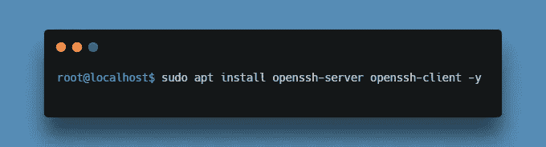

现在我们将创建一个 Hadoop 用户，

我们将利用`**adduser**`命令创建一个新的 Hadoop 用户:


在这个例子中，用户名是 **hadoop** 。你可以随意使用任何你认为合适的用户名和密码。切换到新创建的用户，并输入相应的密码:


用户现在需要能够在不提示输入密码的情况下 SSH 到本地主机。

现在，我们将为 hadoop 用户启用无密码 SSH。用户现在需要能够在不提示输入密码的情况下 SSH 到本地主机。

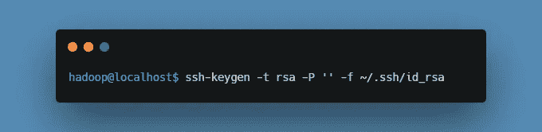

使用`**cat**`命令将公钥作为 **authorized_keys** 存储在 SSH 目录中:

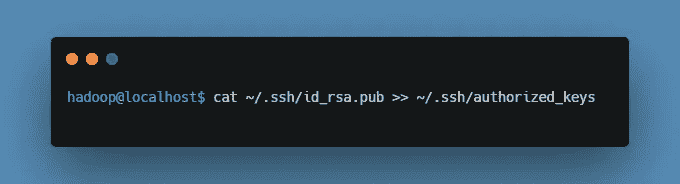

使用`**chmod**`命令为您的用户设置权限:


新用户现在可以使用 SSH，而不需要每次都输入密码。通过使用 **hadoop** 用户 SSH 到本地主机，验证所有设置是否正确:


在初始提示之后，Hadoop 用户现在能够无缝地建立到本地主机的 SSH 连接。

# 第三步:在 Ubuntu 上下载并安装 Hadoop

访问[官方 Apache Hadoop 项目页面](https://downloads.apache.org/hadoop/common/)，选择想要实现的 Hadoop 版本。

选择您喜欢的选项，您会看到一个镜像链接，允许您下载 **Hadoop tar 包**。

运筹学

使用提供的镜像链接，并使用`**wget**`命令下载 Hadoop 包(对于此安装，我们将使用 Hadoop 3.3.3，相应地更改链接):

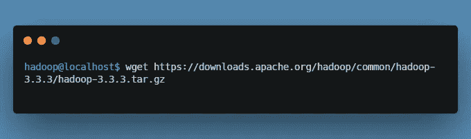

下载完成后，解压缩文件以启动 Hadoop 安装:


Hadoop 在一个大型网络服务器集群*上以**完全分布式模式**部署时表现出色。*但是，如果您是 Hadoop 新手，并且想要探索基本命令或测试应用程序，您可以在单个节点上配置 Hadoop。

# 步骤 4:设置单节点 Hadoop 部署(伪分布式模式)

这种设置也称为**伪分布式模式**，允许每个 Hadoop 守护进程作为单个 Java 进程运行。Hadoop 环境通过编辑一组配置文件来配置:

*   bashrc
*   hadoop-env.sh
*   核心网站. xml
*   hdfs-site.xml
*   mapred-site-xml
*   yarn-site.xml

编辑*。使用您选择的文本编辑器的 bashrc* shell 配置文件(我们将使用 nano):


现在，通过将以下内容添加到文件末尾来定义 Hadoop 环境变量(请检查文件路径并做出相应的更改) :

添加变量后，保存并退出*。bashrc* 文件。要保存并退出，请按 CTRL+X，然后按 Enter。

使用以下命令将更改应用到当前运行环境是至关重要的:


*hadoop-env.sh* 文件用作配置 YARN、HDFS、MapReduce 和 hadoop 相关项目设置的主文件。

使用以下命令编辑 *hadoop-env.sh* 文件:

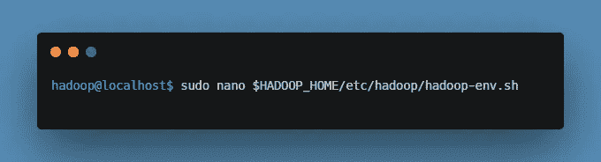

在 *hadoop-env.sh* 文件中添加下面一行:

```
export JAVA_HOME=/usr/lib/jvm/java-8-openjdk-amd64
```

如果您需要帮助来定位正确的 Java 路径，请在您的终端窗口中运行以下命令:


使用以下命令，使用提供的路径查找 OpenJDK 目录:


就在 */bin/javac* 目录之前的那部分路径需要分配给`**$JAVA_HOME**`变量。

文件定义了 HDFS 和 Hadoop 的核心属性。

在文本编辑器中打开 *core-site.xml* 文件:

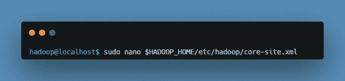

添加以下配置以覆盖临时目录的默认值，并添加您的 HDFS URL 以替换默认的本地文件系统设置:

*hdfs-site.xml* 文件中的属性控制存储节点元数据、fsimage 文件和编辑日志文件的位置。通过定义 **NameNode** 和 **DataNode 存储目录**来配置文件。

此外，`**3**`的默认`**dfs.replication**`值需要更改为`**1**`，以匹配单节点设置。

使用以下命令打开 *hdfs-site.xml* 文件进行编辑:


将以下配置添加到文件中，如果需要，将 NameNode 和 DataNode 目录调整到您的自定义位置:

要保存文件，请按 CTRL+X，然后按 Enter。

使用以下命令访问 *mapred-site.xml* 文件，并**定义 MapReduce 值**:


添加以下配置，将默认 MapReduce 框架名称值更改为`**yarn**`:

*yarn-site.xml* 文件用于定义 **YARN** 的相关设置。它包含**节点管理器、资源管理器、容器、**和**应用主机**的配置。

在文本编辑器中打开 *yarn-site.xml* 文件:


将以下配置附加到文件中:

# 步骤 5:格式化 HDFS 命名节点

第一次启动 Hadoop 服务之前，**格式化 NameNode** 很重要:


关闭通知表示 NameNode 格式化过程的结束。

# 步骤 6:启动 Hadoop 集群

执行以下命令来启动 NameNode 和 DataNode。系统需要一些时间来启动必要的节点。

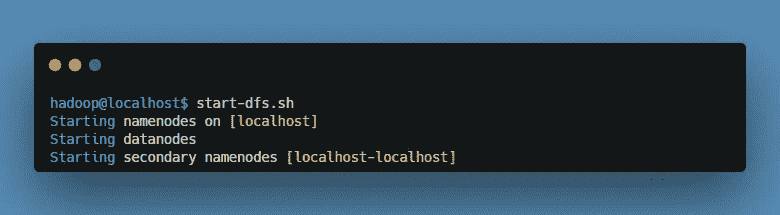

一旦 namenode、datanodes 和辅助 namenode 启动并运行，通过键入以下命令启动 YARN 资源和节点管理器:

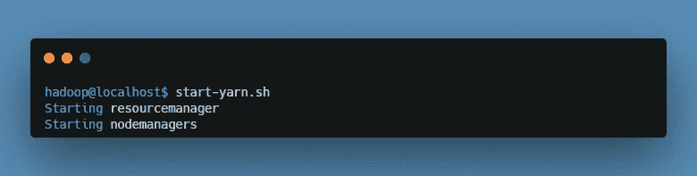

键入这个简单的命令来检查是否所有的守护进程都是活动的，并且作为 Java 进程运行:

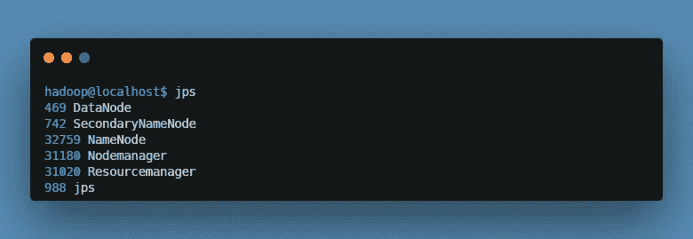

# 步骤 7:从浏览器访问 Hadoop UI

使用您首选的浏览器并导航到您的本地主机 URL 或 IP。默认端口号 **9870** 允许您访问 Hadoop NameNode UI:

```
http://localhost:9870
```

NameNode 用户界面提供了整个集群的全面概述。

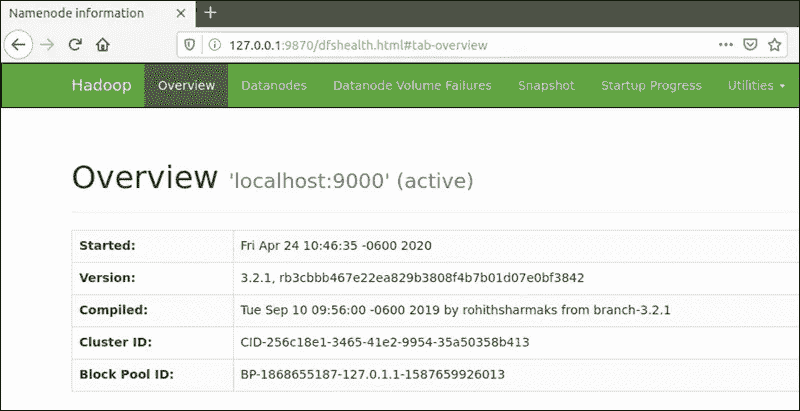

默认端口 **9864** 用于直接从浏览器访问各个数据节点:

```
http://localhost:9864
```

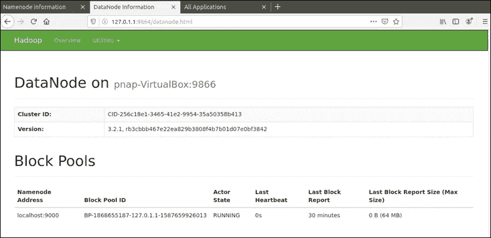

纱线资源管理器可通过端口 **8088** 访问:

```
http://localhost:8088
```

资源管理器是一个非常有价值的工具，它允许您监控 Hadoop 集群中所有正在运行的进程。

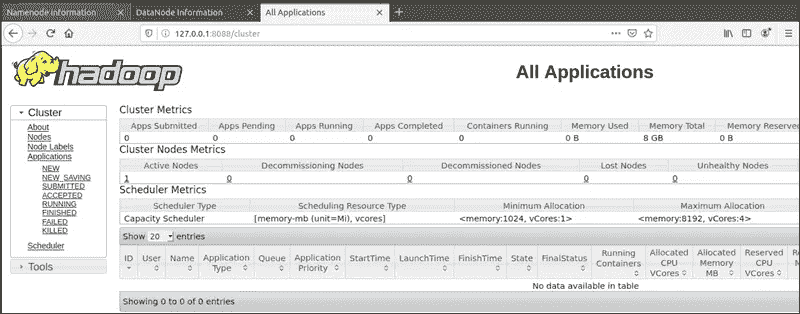

您已经在 Ubuntu 上成功安装了 Hadoop，并以伪分布式模式部署。单节点 Hadoop 部署是探索基本 HDFS 命令和获取设计完全分布式 Hadoop 集群所需经验的绝佳起点。

# 结论:

在这篇文章中，如果你正在阅读这篇文章，那么请喜欢，评论并与你的朋友分享这篇文章。我已经描述了安装 Hadoop 3 的一步一步的方法。我希望你喜欢阅读这篇文章，我已经能够做出一些贡献。谢谢你们。这是 Abhijit 结束。祝你有愉快的一天。