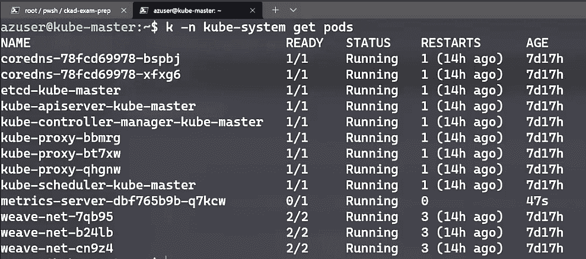
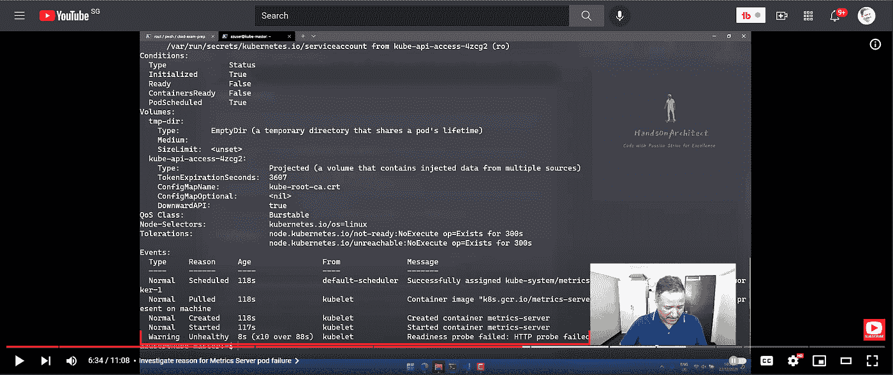
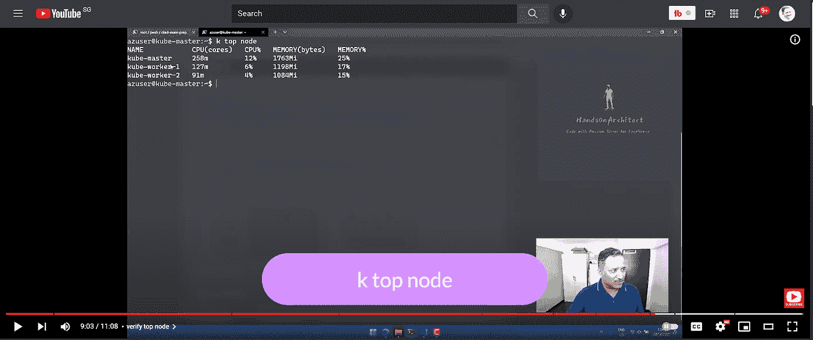
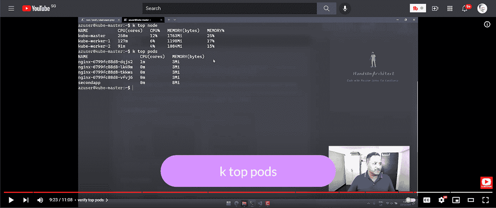
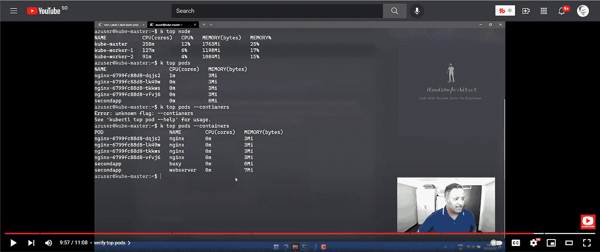

# 如何在 Kubernetes 集群上安装度量服务器

> 原文：<https://blog.devgenius.io/how-to-install-metrics-server-on-kubernetes-cluster-60dd754873c2?source=collection_archive---------5----------------------->

# 背景

这篇文章是关于在 Kubernetes 集群上安装度量服务器的。在上一篇文章的[中，我们已经配置了一个 3 节点 Kubernetes 集群。在多节点集群中，工作负载将在不同的节点上进行调度。如果我们想要找出哪些单元消耗了更多的资源或者哪些节点拥有更多的资源，我们需要某种方法来聚合单元级别的指标。这就是](https://www.handsonarchitect.com/2021/12/how-to-bootstrap-multi-node-kubernetes.html)[度量服务器](https://github.com/kubernetes-sigs/metrics-server)的用武之地。

# 如何在 Kubernetes 集群上安装度量服务器

Kubernetes 不提供默认的指标聚合器。我们需要安装度量服务器，它有助于收集容器级别的度量，如 CPU 或 RAM 的使用情况。这些指标可以被其他 Kubernetes APIs 和对象使用，如**水平 Pod 自动缩放器(HPA)** 或**垂直 Pod 自动缩放器(VPA)** 。

我们将使用一个清单文件将所需的组件安装到我们的 Kubernetes 集群上。清单文件可以在 Metrics Server 项目的 Github repo 中获得。运行以下命令来应用清单

**kubectl apply-f**[**https://github . com/kubernetes-sigs/metrics-server/releases/latest/download/components . YAML**](https://github.com/kubernetes-sigs/metrics-server/releases/latest/download/components.yaml)

这将创建服务帐户、集群角色的 RBAC、集群角色绑定、将度量服务器公开为服务等。通过在 kube-system 名称空间中列出 pod 来验证这些

我们可以看到 metrics-server pod 正在运行，但是容器还没有准备好。使用 Kubectl 的 describe 命令来确定原因。

**kube CTL-n kube-系统描述 pod 指标-服务器- < <动态-名称> >**

在 events 部分，我们可以看到一个警告，提示就绪性探测失败。这是因为 pod 无法与 Kube API 服务器建立通信。我们需要覆盖一些默认值来解决这个问题。

# 覆盖度量服务器命令

我们将去编辑指标-服务器部署。使用以下命令编辑部署

**k-n kube-系统编辑部署指标-服务器**

向下滚动到我们定义容器设置的部分。在图像标签之前添加以下行。

***命令:***

***—/metrics-server***

***———kube let-unsecure-TLS***

***———kube let-preferred-address-types = internal IP***

保存更改。该部署将终止旧版本的 pod，并为 metrics server 重新创建一个新的 pod。完成上述更改后，我们将能够在 Kubernetes 集群上成功运行 metrics 服务器。

# 验证度量服务器功能

运行带有 node 和 pods 子命令的 top 命令，分别找出 node 和 pods 级别的资源使用情况。我们还可以通过将— containers 标志传递给***ku bectl top pods—containers***来检查单个容器级别的资源使用情况。下面的截图显示了这些命令的输出

# Youtube 视频

这里提到的所有步骤在 Youtube 视频中都有演示。

# 结论

Metrics Server 有助于聚合多节点 Kubernetes 集群中各节点的 CPU 和 RAM 相关指标。希望这篇文章对你有用。需要覆盖默认设置，以允许 kubelet 和 metrics 服务器之间的不安全流量。

直到下一次，激情编码，追求卓越

*原载于 2021 年 12 月 22 日 https://www.handsonarchitect.com**的* [*。*](https://www.handsonarchitect.com/2021/12/how-to-install-metrics-server-on.html)