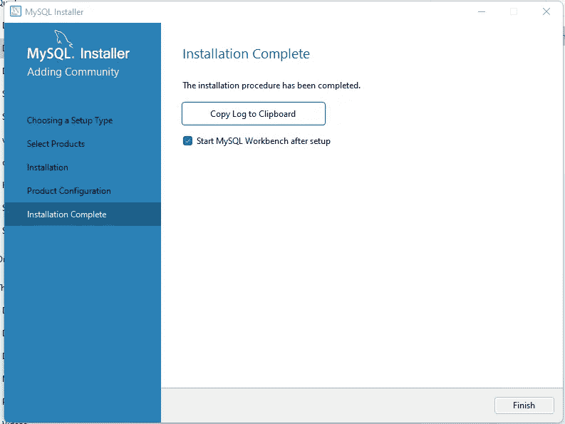

# 如何在 Windows 10/11 上安装 MySQLServer 8.0.26 和 MySQL Workbench 8.0.28

> 原文：<https://blog.devgenius.io/how-to-install-mysqlserver-8-0-26-and-mysql-workbench-8-0-28-on-windows-10-11-b29db553248a?source=collection_archive---------12----------------------->

## 如何逐步使用 screencaps 和安装日志

进入[页面](https://dev.mysql.com/downloads/windows/installer/8.0.html)安装 MySQL 安装程序 8.0.26


单击第二个下载按钮，下载 450.7 米的较大安装程序


选择“不，谢谢，开始下载”链接

您的安装程序将如下所示。


双击这个。msi 文件来启动安装程序。


等待安装程序加载


选择自定义安装类型，然后单击“下一步”


使用“MySqlServers”旁边的加号按钮展开，然后再次展开“MySQLServer”和“MySQL Server 8.0”，直到看到 MySQL Server 8.0.28 — x64


单击绿色箭头将其向右移动


使用“应用程序”旁边的加号按钮展开，然后再次使用“MySQL 工作台”旁边的加号按钮，然后再次使用“MySQL 工作台 8.0”旁边的加号按钮，并选择“MySQL 工作台 8.0.28 -X64”


再次单击指向右侧的绿色箭头，将其添加到右边标有“要安装的产品”的列中


单击“下一步”按钮


点击“执行”安装 MySQL 服务器和 MySQL 工作台

这是我的输出。跳过这个。我总是留着这些以防以后需要找些东西。

```
1: Action 17:59:25: INSTALL. 
1: 1: MySQL Server 8.0 2: {AA7D2F66-AAB9-4634-BA16-FA9BD822921B} 
1: Action 17:59:25: FindRelatedProducts. Searching for related applications
1: Action 17:59:25: AppSearch. Searching for installed applications
1: Action 17:59:25: DwordToNumber. 
1: Action 17:59:26: LaunchConditions. Evaluating launch conditions
1: Action 17:59:26: ValidateProductID. 
1: Action 17:59:26: CostInitialize. Computing space requirements
1: Action 17:59:26: FileCost. Computing space requirements
1: Action 17:59:26: CostFinalize. Computing space requirements
1: Action 17:59:26: MigrateFeatureStates. Migrating feature states from related applications
1: Action 17:59:26: InstallValidate. Validating install
1: Action 17:59:26: SaveTargetDir. 
1: Action 17:59:26: InstallInitialize. 
1: Action 17:59:26: SetQtRemoveService. 
1: Action 17:59:26: RemoveExistingProducts. Removing applications
1: Action 17:59:26: ProcessComponents. Updating component registration
1: Action 17:59:26: GenerateScript. Generating script operations for action:
1: Updating component registration
1: Action 17:59:26: UnpublishFeatures. Unpublishing Product Features
1: Action 17:59:26: RemoveRegistryValues. Removing system registry values
1: Action 17:59:26: RemoveShortcuts. Removing shortcuts
1: Action 17:59:26: RemoveFiles. Removing files
1: Action 17:59:26: InstallFiles. Copying new files
1: File: Copying new files,  Directory: ,  Size: 
1: Action 17:59:27: CreateShortcuts. Creating shortcuts
1: Shortcut: Creating shortcuts
1: Action 17:59:27: WriteRegistryValues. Writing system registry values
1: Key: Writing system registry values, Name: , Value: 
1: Action 17:59:27: RegisterUser. Registering user
1: Action 17:59:27: RegisterProduct. Registering product
1: Registering product
1: Action 17:59:27: PublishFeatures. Publishing Product Features
1: Feature: Publishing Product Features
1: Action 17:59:27: PublishProduct. Publishing product information
1: Action 17:59:27: InstallFinalize. 
1: Action 17:59:27: ProcessComponents. Updating component registration
1: Action 17:59:28: InstallFiles. Copying new files
1: File: fido2.dll,  Directory: C:\Program Files\MySQL\MySQL Server 8.0\bin\,  Size: 148992
1: File: fido2.lib,  Directory: C:\Program Files\MySQL\MySQL Server 8.0\bin\,  Size: 45772
1: File: harness-library.dll,  Directory: C:\Program Files\MySQL\MySQL Server 8.0\bin\,  Size: 6898688
1: File: ibd2sdi.exe,  Directory: C:\Program Files\MySQL\MySQL Server 8.0\bin\,  Size: 6388904
1: File: innochecksum.exe,  Directory: C:\Program Files\MySQL\MySQL Server 8.0\bin\,  Size: 6380720
1: File: libcrypto-1_1-x64.dll,  Directory: C:\Program Files\MySQL\MySQL Server 8.0\bin\,  Size: 2866176
1: File: libmecab.dll,  Directory: C:\Program Files\MySQL\MySQL Server 8.0\bin\,  Size: 1839616
1: File: libprotobuf.dll,  Directory: C:\Program Files\MySQL\MySQL Server 8.0\bin\,  Size: 2835968
1: File: libprotobuf.lib,  Directory: C:\Program Files\MySQL\MySQL Server 8.0\bin\,  Size: 4179030
1: File: libprotobuf-debug.dll,  Directory: C:\Program Files\MySQL\MySQL Server 8.0\bin\,  Size: 5856768
1: File: libprotobuf-lite.dll,  Directory: C:\Program Files\MySQL\MySQL Server 8.0\bin\,  Size: 554496
1: File: libprotobuf-lite.lib,  Directory: C:\Program Files\MySQL\MySQL Server 8.0\bin\,  Size: 898420
1: File: libprotobuf-lite-debug.dll,  Directory: C:\Program Files\MySQL\MySQL Server 8.0\bin\,  Size: 1161728
1: File: libssl-1_1-x64.dll,  Directory: C:\Program Files\MySQL\MySQL Server 8.0\bin\,  Size: 686592
1: File: lz4_decompress.exe,  Directory: C:\Program Files\MySQL\MySQL Server 8.0\bin\,  Size: 6325944
1: File: my_print_defaults.exe,  Directory: C:\Program Files\MySQL\MySQL Server 8.0\bin\,  Size: 6257856
1: File: myisam_ftdump.exe,  Directory: C:\Program Files\MySQL\MySQL Server 8.0\bin\,  Size: 6518456
1: File: myisamchk.exe,  Directory: C:\Program Files\MySQL\MySQL Server 8.0\bin\,  Size: 6643376
1: File: myisamlog.exe,  Directory: C:\Program Files\MySQL\MySQL Server 8.0\bin\,  Size: 6486192
1: File: myisampack.exe,  Directory: C:\Program Files\MySQL\MySQL Server 8.0\bin\,  Size: 6541488
1: File: mysql.exe,  Directory: C:\Program Files\MySQL\MySQL Server 8.0\bin\,  Size: 7289512
1: File: mysql_config_editor.exe,  Directory: C:\Program Files\MySQL\MySQL Server 8.0\bin\,  Size: 6272704
1: File: mysql_migrate_keyring.exe,  Directory: C:\Program Files\MySQL\MySQL Server 8.0\bin\,  Size: 7258312
1: File: mysql_secure_installation.exe,  Directory: C:\Program Files\MySQL\MySQL Server 8.0\bin\,  Size: 7166160
1: File: mysql_ssl_rsa_setup.exe,  Directory: C:\Program Files\MySQL\MySQL Server 8.0\bin\,  Size: 6297280
1: File: mysql_tzinfo_to_sql.exe,  Directory: C:\Program Files\MySQL\MySQL Server 8.0\bin\,  Size: 6211776
1: File: mysql_upgrade.exe,  Directory: C:\Program Files\MySQL\MySQL Server 8.0\bin\,  Size: 7257272
1: File: mysqladmin.exe,  Directory: C:\Program Files\MySQL\MySQL Server 8.0\bin\,  Size: 7177392
1: File: mysqlbinlog.exe,  Directory: C:\Program Files\MySQL\MySQL Server 8.0\bin\,  Size: 7490224
1: File: mysqlcheck.exe,  Directory: C:\Program Files\MySQL\MySQL Server 8.0\bin\,  Size: 7182000
1: File: mysqld.exe,  Directory: C:\Program Files\MySQL\MySQL Server 8.0\bin\,  Size: 51125416
1: File: mysqld_multi.pl,  Directory: C:\Program Files\MySQL\MySQL Server 8.0\bin\,  Size: 28776
1: File: mysqldump.exe,  Directory: C:\Program Files\MySQL\MySQL Server 8.0\bin\,  Size: 7248560
1: File: mysqldumpslow.pl,  Directory: C:\Program Files\MySQL\MySQL Server 8.0\bin\,  Size: 7881
1: File: mysqlharness_stdx.dll,  Directory: C:\Program Files\MySQL\MySQL Server 8.0\bin\,  Size: 38080
1: File: mysqlharness_tls.dll,  Directory: C:\Program Files\MySQL\MySQL Server 8.0\bin\,  Size: 63160
1: File: mysqlimport.exe,  Directory: C:\Program Files\MySQL\MySQL Server 8.0\bin\,  Size: 7170736
1: File: mysqlpump.exe,  Directory: C:\Program Files\MySQL\MySQL Server 8.0\bin\,  Size: 7643312
1: File: mysqlrouter.exe,  Directory: C:\Program Files\MySQL\MySQL Server 8.0\bin\,  Size: 7860912
1: File: mysqlrouter_http.dll,  Directory: C:\Program Files\MySQL\MySQL Server 8.0\bin\,  Size: 267448
1: File: mysqlrouter_http_auth_backend.dll,  Directory: C:\Program Files\MySQL\MySQL Server 8.0\bin\,  Size: 108760
1: File: mysqlrouter_http_auth_realm.dll,  Directory: C:\Program Files\MySQL\MySQL Server 8.0\bin\,  Size: 36048
1: File: mysqlrouter_io_component.dll,  Directory: C:\Program Files\MySQL\MySQL Server 8.0\bin\,  Size: 74440
1: File: mysqlrouter_keyring.exe,  Directory: C:\Program Files\MySQL\MySQL Server 8.0\bin\,  Size: 6319808
1: File: mysqlrouter_passwd.exe,  Directory: C:\Program Files\MySQL\MySQL Server 8.0\bin\,  Size: 6284480
1: File: mysqlrouter_plugin_info.exe,  Directory: C:\Program Files\MySQL\MySQL Server 8.0\bin\,  Size: 6242504
1: File: mysqlshow.exe,  Directory: C:\Program Files\MySQL\MySQL Server 8.0\bin\,  Size: 7168176
1: File: mysqlslap.exe,  Directory: C:\Program Files\MySQL\MySQL Server 8.0\bin\,  Size: 7187120
1: File: perror.exe,  Directory: C:\Program Files\MySQL\MySQL Server 8.0\bin\,  Size: 7085224
1: File: zlib_decompress.exe,  Directory: C:\Program Files\MySQL\MySQL Server 8.0\bin\,  Size: 6233272
1: File: ChangeLog,  Directory: C:\Program Files\MySQL\MySQL Server 8.0\docs\,  Size: 22
1: File: INFO_SRC,  Directory: C:\Program Files\MySQL\MySQL Server 8.0\docs\,  Size: 188
1: File: sample_mysqlrouter.conf,  Directory: C:\Program Files\MySQL\MySQL Server 8.0\docs\,  Size: 2213
1: File: mysqlrouter.conf.sample,  Directory: C:\Program Files\MySQL\MySQL Server 8.0\etc\,  Size: 1672
1: File: errmsg.h,  Directory: C:\Program Files\MySQL\MySQL Server 8.0\include\,  Size: 5647
1: File: field_types.h,  Directory: C:\Program Files\MySQL\MySQL Server 8.0\include\,  Size: 3169
1: File: my_command.h,  Directory: C:\Program Files\MySQL\MySQL Server 8.0\include\,  Size: 4407
1: File: my_compress.h,  Directory: C:\Program Files\MySQL\MySQL Server 8.0\include\,  Size: 3646
1: File: my_list.h,  Directory: C:\Program Files\MySQL\MySQL Server 8.0\include\,  Size: 2165
1: File: mysql.h,  Directory: C:\Program Files\MySQL\MySQL Server 8.0\include\,  Size: 33189
1: File: client_plugin.h,  Directory: C:\Program Files\MySQL\MySQL Server 8.0\include\mysql\,  Size: 8284
1: File: mysql_com.h,  Directory: C:\Program Files\MySQL\MySQL Server 8.0\include\,  Size: 37189
1: File: plugin_auth_common.h,  Directory: C:\Program Files\MySQL\MySQL Server 8.0\include\mysql\,  Size: 6865
1: File: mysql_time.h,  Directory: C:\Program Files\MySQL\MySQL Server 8.0\include\,  Size: 3554
1: File: udf_registration_types.h,  Directory: C:\Program Files\MySQL\MySQL Server 8.0\include\mysql\,  Size: 3827
1: File: mysql_version.h,  Directory: C:\Program Files\MySQL\MySQL Server 8.0\include\,  Size: 1120
1: File: mysqld_error.h,  Directory: C:\Program Files\MySQL\MySQL Server 8.0\include\,  Size: 249616
1: File: mysqlx_ername.h,  Directory: C:\Program Files\MySQL\MySQL Server 8.0\include\,  Size: 7304
1: File: mysqlx_error.h,  Directory: C:\Program Files\MySQL\MySQL Server 8.0\include\,  Size: 4211
1: File: mysqlx_version.h,  Directory: C:\Program Files\MySQL\MySQL Server 8.0\include\,  Size: 1840
1: File: applink.c,  Directory: C:\Program Files\MySQL\MySQL Server 8.0\include\openssl\,  Size: 3508
1: File: http_auth_backend.dll,  Directory: C:\Program Files\MySQL\MySQL Server 8.0\lib\,  Size: 38912
1: File: http_auth_realm.dll,  Directory: C:\Program Files\MySQL\MySQL Server 8.0\lib\,  Size: 41472
1: File: http_server.dll,  Directory: C:\Program Files\MySQL\MySQL Server 8.0\lib\,  Size: 201216
1: File: io.dll,  Directory: C:\Program Files\MySQL\MySQL Server 8.0\lib\,  Size: 41472
1: File: keepalive.dll,  Directory: C:\Program Files\MySQL\MySQL Server 8.0\lib\,  Size: 19456
1: File: libmysql.dll,  Directory: C:\Program Files\MySQL\MySQL Server 8.0\lib\,  Size: 7149056
1: File: libmysql.lib,  Directory: C:\Program Files\MySQL\MySQL Server 8.0\lib\,  Size: 29892
1: File: libprotobuf-lite.dll,  Directory: C:\Program Files\MySQL\MySQL Server 8.0\lib\,  Size: 554496
1: File: libprotobuf-lite.lib,  Directory: C:\Program Files\MySQL\MySQL Server 8.0\lib\,  Size: 898420
1: File: char.bin,  Directory: C:\Program Files\MySQL\MySQL Server 8.0\lib\mecab\dic\ipadic_euc-jp\,  Size: 262496
1: File: dicrc,  Directory: C:\Program Files\MySQL\MySQL Server 8.0\lib\mecab\dic\ipadic_euc-jp\,  Size: 693
1: File: left-id.def,  Directory: C:\Program Files\MySQL\MySQL Server 8.0\lib\mecab\dic\ipadic_euc-jp\,  Size: 55910
1: File: matrix.bin,  Directory: C:\Program Files\MySQL\MySQL Server 8.0\lib\mecab\dic\ipadic_euc-jp\,  Size: 3463716
1: File: pos-id.def,  Directory: C:\Program Files\MySQL\MySQL Server 8.0\lib\mecab\dic\ipadic_euc-jp\,  Size: 1477
1: File: rewrite.def,  Directory: C:\Program Files\MySQL\MySQL Server 8.0\lib\mecab\dic\ipadic_euc-jp\,  Size: 6241
1: File: right-id.def,  Directory: C:\Program Files\MySQL\MySQL Server 8.0\lib\mecab\dic\ipadic_euc-jp\,  Size: 55910
1: File: sys.dic,  Directory: C:\Program Files\MySQL\MySQL Server 8.0\lib\mecab\dic\ipadic_euc-jp\,  Size: 37779919
1: File: unk.dic,  Directory: C:\Program Files\MySQL\MySQL Server 8.0\lib\mecab\dic\ipadic_euc-jp\,  Size: 5409
1: File: char.bin,  Directory: C:\Program Files\MySQL\MySQL Server 8.0\lib\mecab\dic\ipadic_sjis\,  Size: 262496
1: File: dicrc,  Directory: C:\Program Files\MySQL\MySQL Server 8.0\lib\mecab\dic\ipadic_sjis\,  Size: 693
1: File: left-id.def,  Directory: C:\Program Files\MySQL\MySQL Server 8.0\lib\mecab\dic\ipadic_sjis\,  Size: 55910
1: File: matrix.bin,  Directory: C:\Program Files\MySQL\MySQL Server 8.0\lib\mecab\dic\ipadic_sjis\,  Size: 3463716
1: File: pos-id.def,  Directory: C:\Program Files\MySQL\MySQL Server 8.0\lib\mecab\dic\ipadic_sjis\,  Size: 1477
1: File: rewrite.def,  Directory: C:\Program Files\MySQL\MySQL Server 8.0\lib\mecab\dic\ipadic_sjis\,  Size: 6241
1: File: right-id.def,  Directory: C:\Program Files\MySQL\MySQL Server 8.0\lib\mecab\dic\ipadic_sjis\,  Size: 55910
1: File: sys.dic,  Directory: C:\Program Files\MySQL\MySQL Server 8.0\lib\mecab\dic\ipadic_sjis\,  Size: 37635899
1: File: unk.dic,  Directory: C:\Program Files\MySQL\MySQL Server 8.0\lib\mecab\dic\ipadic_sjis\,  Size: 5409
1: File: char.bin,  Directory: C:\Program Files\MySQL\MySQL Server 8.0\lib\mecab\dic\ipadic_utf-8\,  Size: 262496
1: File: dicrc,  Directory: C:\Program Files\MySQL\MySQL Server 8.0\lib\mecab\dic\ipadic_utf-8\,  Size: 693
1: File: left-id.def,  Directory: C:\Program Files\MySQL\MySQL Server 8.0\lib\mecab\dic\ipadic_utf-8\,  Size: 55910
1: File: matrix.bin,  Directory: C:\Program Files\MySQL\MySQL Server 8.0\lib\mecab\dic\ipadic_utf-8\,  Size: 3463716
1: File: pos-id.def,  Directory: C:\Program Files\MySQL\MySQL Server 8.0\lib\mecab\dic\ipadic_utf-8\,  Size: 1477
1: File: rewrite.def,  Directory: C:\Program Files\MySQL\MySQL Server 8.0\lib\mecab\dic\ipadic_utf-8\,  Size: 6241
1: File: right-id.def,  Directory: C:\Program Files\MySQL\MySQL Server 8.0\lib\mecab\dic\ipadic_utf-8\,  Size: 55910
1: File: sys.dic,  Directory: C:\Program Files\MySQL\MySQL Server 8.0\lib\mecab\dic\ipadic_utf-8\,  Size: 49199027
1: File: unk.dic,  Directory: C:\Program Files\MySQL\MySQL Server 8.0\lib\mecab\dic\ipadic_utf-8\,  Size: 5690
1: File: mecabrc,  Directory: C:\Program Files\MySQL\MySQL Server 8.0\lib\mecab\etc\,  Size: 1382
1: File: metadata_cache.dll,  Directory: C:\Program Files\MySQL\MySQL Server 8.0\lib\,  Size: 8228864
1: File: mysqlclient.lib,  Directory: C:\Program Files\MySQL\MySQL Server 8.0\lib\,  Size: 47376270
1: File: mysqlharness_stdx.lib,  Directory: C:\Program Files\MySQL\MySQL Server 8.0\lib\,  Size: 10392
1: File: mysqlharness_tls.lib,  Directory: C:\Program Files\MySQL\MySQL Server 8.0\lib\,  Size: 22722
1: File: mysqlrouter_http.lib,  Directory: C:\Program Files\MySQL\MySQL Server 8.0\lib\,  Size: 45804
1: File: mysqlrouter_http_auth_backend.lib,  Directory: C:\Program Files\MySQL\MySQL Server 8.0\lib\,  Size: 48066
1: File: mysqlrouter_http_auth_realm.lib,  Directory: C:\Program Files\MySQL\MySQL Server 8.0\lib\,  Size: 11332
1: File: mysqlrouter_io_component.lib,  Directory: C:\Program Files\MySQL\MySQL Server 8.0\lib\,  Size: 12642
1: File: mysqlrouter_lib.lib,  Directory: C:\Program Files\MySQL\MySQL Server 8.0\lib\,  Size: 22995246
1: File: adt_null.dll,  Directory: C:\Program Files\MySQL\MySQL Server 8.0\lib\plugin\,  Size: 25600
1: File: authentication_fido_client.dll,  Directory: C:\Program Files\MySQL\MySQL Server 8.0\lib\plugin\,  Size: 30720
1: File: authentication_kerberos_client.dll,  Directory: C:\Program Files\MySQL\MySQL Server 8.0\lib\plugin\,  Size: 6220800
1: File: authentication_oci_client.dll,  Directory: C:\Program Files\MySQL\MySQL Server 8.0\lib\plugin\,  Size: 100864
1: File: component_audit_api_message_emit.dll,  Directory: C:\Program Files\MySQL\MySQL Server 8.0\lib\plugin\,  Size: 24576
1: File: component_keyring_file.dll,  Directory: C:\Program Files\MySQL\MySQL Server 8.0\lib\plugin\,  Size: 1138688
1: File: component_log_filter_dragnet.dll,  Directory: C:\Program Files\MySQL\MySQL Server 8.0\lib\plugin\,  Size: 31744
1: File: component_log_sink_json.dll,  Directory: C:\Program Files\MySQL\MySQL Server 8.0\lib\plugin\,  Size: 36352
1: File: component_log_sink_syseventlog.dll,  Directory: C:\Program Files\MySQL\MySQL Server 8.0\lib\plugin\,  Size: 17920
1: File: component_mysqlbackup.dll,  Directory: C:\Program Files\MySQL\MySQL Server 8.0\lib\plugin\,  Size: 40448
1: File: component_query_attributes.dll,  Directory: C:\Program Files\MySQL\MySQL Server 8.0\lib\plugin\,  Size: 14336
1: File: component_reference_cache.dll,  Directory: C:\Program Files\MySQL\MySQL Server 8.0\lib\plugin\,  Size: 46080
1: File: component_validate_password.dll,  Directory: C:\Program Files\MySQL\MySQL Server 8.0\lib\plugin\,  Size: 59904
1: File: connection_control.dll,  Directory: C:\Program Files\MySQL\MySQL Server 8.0\lib\plugin\,  Size: 44032
1: File: ddl_rewriter.dll,  Directory: C:\Program Files\MySQL\MySQL Server 8.0\lib\plugin\,  Size: 69120
1: File: group_replication.dll,  Directory: C:\Program Files\MySQL\MySQL Server 8.0\lib\plugin\,  Size: 1869824
1: File: ha_example.dll,  Directory: C:\Program Files\MySQL\MySQL Server 8.0\lib\plugin\,  Size: 31232
1: File: ha_mock.dll,  Directory: C:\Program Files\MySQL\MySQL Server 8.0\lib\plugin\,  Size: 39424
1: File: keyring_file.dll,  Directory: C:\Program Files\MySQL\MySQL Server 8.0\lib\plugin\,  Size: 91648
1: File: keyring_udf.dll,  Directory: C:\Program Files\MySQL\MySQL Server 8.0\lib\plugin\,  Size: 25088
1: File: libpluginmecab.dll,  Directory: C:\Program Files\MySQL\MySQL Server 8.0\lib\plugin\,  Size: 29696
1: File: locking_service.dll,  Directory: C:\Program Files\MySQL\MySQL Server 8.0\lib\plugin\,  Size: 13824
1: File: mypluglib.dll,  Directory: C:\Program Files\MySQL\MySQL Server 8.0\lib\plugin\,  Size: 14336
1: File: mysql_clone.dll,  Directory: C:\Program Files\MySQL\MySQL Server 8.0\lib\plugin\,  Size: 130560
1: File: mysql_no_login.dll,  Directory: C:\Program Files\MySQL\MySQL Server 8.0\lib\plugin\,  Size: 12288
1: File: rewrite_example.dll,  Directory: C:\Program Files\MySQL\MySQL Server 8.0\lib\plugin\,  Size: 13312
1: File: rewriter.dll,  Directory: C:\Program Files\MySQL\MySQL Server 8.0\lib\plugin\,  Size: 56320
1: File: semisync_master.dll,  Directory: C:\Program Files\MySQL\MySQL Server 8.0\lib\plugin\,  Size: 78336
1: File: semisync_replica.dll,  Directory: C:\Program Files\MySQL\MySQL Server 8.0\lib\plugin\,  Size: 34816
1: File: semisync_slave.dll,  Directory: C:\Program Files\MySQL\MySQL Server 8.0\lib\plugin\,  Size: 35328
1: File: semisync_source.dll,  Directory: C:\Program Files\MySQL\MySQL Server 8.0\lib\plugin\,  Size: 77824
1: File: validate_password.dll,  Directory: C:\Program Files\MySQL\MySQL Server 8.0\lib\plugin\,  Size: 48128
1: File: version_token.dll,  Directory: C:\Program Files\MySQL\MySQL Server 8.0\lib\plugin\,  Size: 50176
1: File: burmesedict.dict,  Directory: C:\Program Files\MySQL\MySQL Server 8.0\lib\private\icudt69l\brkitr\,  Size: 254438
1: File: char.brk,  Directory: C:\Program Files\MySQL\MySQL Server 8.0\lib\private\icudt69l\brkitr\,  Size: 13680
1: File: cjdict.dict,  Directory: C:\Program Files\MySQL\MySQL Server 8.0\lib\private\icudt69l\brkitr\,  Size: 2003566
1: File: de.res,  Directory: C:\Program Files\MySQL\MySQL Server 8.0\lib\private\icudt69l\brkitr\,  Size: 2988
1: File: el.res,  Directory: C:\Program Files\MySQL\MySQL Server 8.0\lib\private\icudt69l\brkitr\,  Size: 152
1: File: en.res,  Directory: C:\Program Files\MySQL\MySQL Server 8.0\lib\private\icudt69l\brkitr\,  Size: 1764
1: File: en_US.res,  Directory: C:\Program Files\MySQL\MySQL Server 8.0\lib\private\icudt69l\brkitr\,  Size: 68
1: File: en_US_POSIX.res,  Directory: C:\Program Files\MySQL\MySQL Server 8.0\lib\private\icudt69l\brkitr\,  Size: 156
1: File: es.res,  Directory: C:\Program Files\MySQL\MySQL Server 8.0\lib\private\icudt69l\brkitr\,  Size: 2168
1: File: fr.res,  Directory: C:\Program Files\MySQL\MySQL Server 8.0\lib\private\icudt69l\brkitr\,  Size: 1200
1: File: it.res,  Directory: C:\Program Files\MySQL\MySQL Server 8.0\lib\private\icudt69l\brkitr\,  Size: 676
1: File: ja.res,  Directory: C:\Program Files\MySQL\MySQL Server 8.0\lib\private\icudt69l\brkitr\,  Size: 304
1: File: khmerdict.dict,  Directory: C:\Program Files\MySQL\MySQL Server 8.0\lib\private\icudt69l\brkitr\,  Size: 445542
1: File: laodict.dict,  Directory: C:\Program Files\MySQL\MySQL Server 8.0\lib\private\icudt69l\brkitr\,  Size: 52102
1: File: line.brk,  Directory: C:\Program Files\MySQL\MySQL Server 8.0\lib\private\icudt69l\brkitr\,  Size: 24080
1: File: line_cj.brk,  Directory: C:\Program Files\MySQL\MySQL Server 8.0\lib\private\icudt69l\brkitr\,  Size: 24112
1: File: line_loose.brk,  Directory: C:\Program Files\MySQL\MySQL Server 8.0\lib\private\icudt69l\brkitr\,  Size: 24232
1: File: line_loose_cj.brk,  Directory: C:\Program Files\MySQL\MySQL Server 8.0\lib\private\icudt69l\brkitr\,  Size: 25096
1: File: line_normal.brk,  Directory: C:\Program Files\MySQL\MySQL Server 8.0\lib\private\icudt69l\brkitr\,  Size: 23904
1: File: line_normal_cj.brk,  Directory: C:\Program Files\MySQL\MySQL Server 8.0\lib\private\icudt69l\brkitr\,  Size: 24304
1: File: pt.res,  Directory: C:\Program Files\MySQL\MySQL Server 8.0\lib\private\icudt69l\brkitr\,  Size: 2284
1: File: res_index.res,  Directory: C:\Program Files\MySQL\MySQL Server 8.0\lib\private\icudt69l\brkitr\,  Size: 220
1: File: root.res,  Directory: C:\Program Files\MySQL\MySQL Server 8.0\lib\private\icudt69l\brkitr\,  Size: 644
1: File: ru.res,  Directory: C:\Program Files\MySQL\MySQL Server 8.0\lib\private\icudt69l\brkitr\,  Size: 332
1: File: sent.brk,  Directory: C:\Program Files\MySQL\MySQL Server 8.0\lib\private\icudt69l\brkitr\,  Size: 19216
1: File: sent_el.brk,  Directory: C:\Program Files\MySQL\MySQL Server 8.0\lib\private\icudt69l\brkitr\,  Size: 19232
1: File: thaidict.dict,  Directory: C:\Program Files\MySQL\MySQL Server 8.0\lib\private\icudt69l\brkitr\,  Size: 126135
1: File: title.brk,  Directory: C:\Program Files\MySQL\MySQL Server 8.0\lib\private\icudt69l\brkitr\,  Size: 11824
1: File: word.brk,  Directory: C:\Program Files\MySQL\MySQL Server 8.0\lib\private\icudt69l\brkitr\,  Size: 22232
1: File: word_POSIX.brk,  Directory: C:\Program Files\MySQL\MySQL Server 8.0\lib\private\icudt69l\brkitr\,  Size: 22240
1: File: zh.res,  Directory: C:\Program Files\MySQL\MySQL Server 8.0\lib\private\icudt69l\brkitr\,  Size: 272
1: File: zh_Hant.res,  Directory: C:\Program Files\MySQL\MySQL Server 8.0\lib\private\icudt69l\brkitr\,  Size: 272
1: File: unames.icu,  Directory: C:\Program Files\MySQL\MySQL Server 8.0\lib\private\icudt69l\,  Size: 283936
1: File: rest_api.dll,  Directory: C:\Program Files\MySQL\MySQL Server 8.0\lib\,  Size: 137216
1: File: rest_metadata_cache.dll,  Directory: C:\Program Files\MySQL\MySQL Server 8.0\lib\,  Size: 104448
1: File: rest_router.dll,  Directory: C:\Program Files\MySQL\MySQL Server 8.0\lib\,  Size: 78848
1: File: rest_routing.dll,  Directory: C:\Program Files\MySQL\MySQL Server 8.0\lib\,  Size: 125440
1: File: router_openssl.dll,  Directory: C:\Program Files\MySQL\MySQL Server 8.0\lib\,  Size: 14848
1: File: router_protobuf.dll,  Directory: C:\Program Files\MySQL\MySQL Server 8.0\lib\,  Size: 11776
1: File: routing.dll,  Directory: C:\Program Files\MySQL\MySQL Server 8.0\lib\,  Size: 612352
1: File: LICENSE,  Directory: C:\Program Files\MySQL\MySQL Server 8.0\,  Size: 276595
1: File: LICENSE.router,  Directory: C:\Program Files\MySQL\MySQL Server 8.0\,  Size: 47676
1: File: README,  Directory: C:\Program Files\MySQL\MySQL Server 8.0\,  Size: 666
1: File: README.router,  Directory: C:\Program Files\MySQL\MySQL Server 8.0\,  Size: 679
1: File: errmsg.sys,  Directory: C:\Program Files\MySQL\MySQL Server 8.0\share\bulgarian\,  Size: 353809
1: File: armscii8.xml,  Directory: C:\Program Files\MySQL\MySQL Server 8.0\share\charsets\,  Size: 5961
1: File: ascii.xml,  Directory: C:\Program Files\MySQL\MySQL Server 8.0\share\charsets\,  Size: 5947
1: File: cp1250.xml,  Directory: C:\Program Files\MySQL\MySQL Server 8.0\share\charsets\,  Size: 8676
1: File: cp1251.xml,  Directory: C:\Program Files\MySQL\MySQL Server 8.0\share\charsets\,  Size: 8762
1: File: cp1256.xml,  Directory: C:\Program Files\MySQL\MySQL Server 8.0\share\charsets\,  Size: 6010
1: File: cp1257.xml,  Directory: C:\Program Files\MySQL\MySQL Server 8.0\share\charsets\,  Size: 9343
1: File: cp850.xml,  Directory: C:\Program Files\MySQL\MySQL Server 8.0\share\charsets\,  Size: 5947
1: File: cp852.xml,  Directory: C:\Program Files\MySQL\MySQL Server 8.0\share\charsets\,  Size: 5963
1: File: cp866.xml,  Directory: C:\Program Files\MySQL\MySQL Server 8.0\share\charsets\,  Size: 6054
1: File: dec8.xml,  Directory: C:\Program Files\MySQL\MySQL Server 8.0\share\charsets\,  Size: 6970
1: File: geostd8.xml,  Directory: C:\Program Files\MySQL\MySQL Server 8.0\share\charsets\,  Size: 5957
1: File: greek.xml,  Directory: C:\Program Files\MySQL\MySQL Server 8.0\share\charsets\,  Size: 6169
1: File: hebrew.xml,  Directory: C:\Program Files\MySQL\MySQL Server 8.0\share\charsets\,  Size: 5952
1: File: hp8.xml,  Directory: C:\Program Files\MySQL\MySQL Server 8.0\share\charsets\,  Size: 5943
1: File: Index.xml,  Directory: C:\Program Files\MySQL\MySQL Server 8.0\share\charsets\,  Size: 19474
1: File: keybcs2.xml,  Directory: C:\Program Files\MySQL\MySQL Server 8.0\share\charsets\,  Size: 5970
1: File: koi8r.xml,  Directory: C:\Program Files\MySQL\MySQL Server 8.0\share\charsets\,  Size: 5951
1: File: koi8u.xml,  Directory: C:\Program Files\MySQL\MySQL Server 8.0\share\charsets\,  Size: 6973
1: File: latin1.xml,  Directory: C:\Program Files\MySQL\MySQL Server 8.0\share\charsets\,  Size: 10251
1: File: latin2.xml,  Directory: C:\Program Files\MySQL\MySQL Server 8.0\share\charsets\,  Size: 7673
1: File: latin5.xml,  Directory: C:\Program Files\MySQL\MySQL Server 8.0\share\charsets\,  Size: 5950
1: File: latin7.xml,  Directory: C:\Program Files\MySQL\MySQL Server 8.0\share\charsets\,  Size: 7879
1: File: macce.xml,  Directory: C:\Program Files\MySQL\MySQL Server 8.0\share\charsets\,  Size: 8488
1: File: macroman.xml,  Directory: C:\Program Files\MySQL\MySQL Server 8.0\share\charsets\,  Size: 8499
1: File: README,  Directory: C:\Program Files\MySQL\MySQL Server 8.0\share\charsets\,  Size: 1749
1: File: swe7.xml,  Directory: C:\Program Files\MySQL\MySQL Server 8.0\share\charsets\,  Size: 6971
1: File: errmsg.sys,  Directory: C:\Program Files\MySQL\MySQL Server 8.0\share\czech\,  Size: 353731
1: File: errmsg.sys,  Directory: C:\Program Files\MySQL\MySQL Server 8.0\share\danish\,  Size: 353731
1: File: dictionary.txt,  Directory: C:\Program Files\MySQL\MySQL Server 8.0\share\,  Size: 25575
1: File: errmsg.sys,  Directory: C:\Program Files\MySQL\MySQL Server 8.0\share\dutch\,  Size: 354751
1: File: errmsg.sys,  Directory: C:\Program Files\MySQL\MySQL Server 8.0\share\english\,  Size: 352972
1: File: errmsg.sys,  Directory: C:\Program Files\MySQL\MySQL Server 8.0\share\estonian\,  Size: 353236
1: File: errmsg.sys,  Directory: C:\Program Files\MySQL\MySQL Server 8.0\share\french\,  Size: 354379
1: File: errmsg.sys,  Directory: C:\Program Files\MySQL\MySQL Server 8.0\share\german\,  Size: 360624
1: File: errmsg.sys,  Directory: C:\Program Files\MySQL\MySQL Server 8.0\share\greek\,  Size: 359763
1: File: errmsg.sys,  Directory: C:\Program Files\MySQL\MySQL Server 8.0\share\hungarian\,  Size: 353613
1: File: errmsg.sys,  Directory: C:\Program Files\MySQL\MySQL Server 8.0\share\italian\,  Size: 354742
1: File: errmsg.sys,  Directory: C:\Program Files\MySQL\MySQL Server 8.0\share\japanese\,  Size: 360418
1: File: errmsg.sys,  Directory: C:\Program Files\MySQL\MySQL Server 8.0\share\korean\,  Size: 356012
1: File: messages_to_clients.txt,  Directory: C:\Program Files\MySQL\MySQL Server 8.0\share\,  Size: 616528
1: File: messages_to_error_log.txt,  Directory: C:\Program Files\MySQL\MySQL Server 8.0\share\,  Size: 359072
1: File: errmsg.sys,  Directory: C:\Program Files\MySQL\MySQL Server 8.0\share\norwegian\,  Size: 353042
1: File: errmsg.sys,  Directory: C:\Program Files\MySQL\MySQL Server 8.0\share\norwegian-ny\,  Size: 353095
1: File: errmsg.sys,  Directory: C:\Program Files\MySQL\MySQL Server 8.0\share\polish\,  Size: 353901
1: File: errmsg.sys,  Directory: C:\Program Files\MySQL\MySQL Server 8.0\share\portuguese\,  Size: 355932
1: File: errmsg.sys,  Directory: C:\Program Files\MySQL\MySQL Server 8.0\share\romanian\,  Size: 354684
1: File: errmsg.sys,  Directory: C:\Program Files\MySQL\MySQL Server 8.0\share\russian\,  Size: 368198
1: File: errmsg.sys,  Directory: C:\Program Files\MySQL\MySQL Server 8.0\share\serbian\,  Size: 355353
1: File: errmsg.sys,  Directory: C:\Program Files\MySQL\MySQL Server 8.0\share\slovak\,  Size: 353498
1: File: errmsg.sys,  Directory: C:\Program Files\MySQL\MySQL Server 8.0\share\spanish\,  Size: 354626
1: File: errmsg.sys,  Directory: C:\Program Files\MySQL\MySQL Server 8.0\share\swedish\,  Size: 353825
1: File: errmsg.sys,  Directory: C:\Program Files\MySQL\MySQL Server 8.0\share\ukrainian\,  Size: 362821
1: Action 17:59:32: CreateShortcuts. Creating shortcuts
1: Shortcut: icon.ico
1: Shortcut: Icon.MysqlCmdShell
1: Shortcut: rpxm3ds_|MySQL 8.0 Command Line Client
1: Shortcut: 7ejegqmo|MySQL 8.0 Command Line Client - Unicode
1: Action 17:59:32: WriteRegistryValues. Writing system registry values
1: Key: \SOFTWARE\MySQL AB\MySQL Server 8.0, Name: Location, Value: C:\Program Files\MySQL\MySQL Server 8.0\
1: Key: \SOFTWARE\MySQL AB\MySQL Server 8.0, Name: Version, Value: 8.0.28
1: Key: \SOFTWARE\MySQL AB\MySQL Server 8.0, Name: DataLocation, Value: C:\ProgramData\MySQL\MySQL Server 8.0
1: Key: \SOFTWARE\MySQL AB\MySQL Server 8.0, Name: , Value: 
1: Key: \Console\MySQL 8.0 Command Line Client - Unicode, Name: FaceName, Value: Lucida Console
1: Key: \Console\MySQL 8.0 Command Line Client - Unicode, Name: FontWeight, Value: #400
1: Key: \Console\MySQL 8.0 Command Line Client - Unicode, Name: , Value: 
1: Key: \Software\MySQL AB\MySQL Server 8.0, Name: installed, Value: #1
1: Action 17:59:32: RegisterProduct. Registering product
1: {AA7D2F66-AAB9-4634-BA16-FA9BD822921B}
1: Action 17:59:32: PublishFeatures. Publishing Product Features
1: Feature: RegKeys
1: Feature: Client
1: Feature: MYSQLSERVER
1: Feature: DEVEL
1: Feature: DOCUMENTATION
1: Feature: Readme
1: Feature: ALWAYSINSTALL
1: Feature: Router
1: Feature: Server_Scripts
1: Feature: MISC
1: Feature: ProgramMenu
1: Action 17:59:32: PublishProduct. Publishing product information
1: Action 17:59:32: RollbackCleanup. Removing backup files
1: 1: MySQL Server 8.0 2: {AA7D2F66-AAB9-4634-BA16-FA9BD822921B} 3: 1 
1: The action 'Install' for product 'MySQL Server 8.0.28' completed successfully.
2: Action 17:59:32: INSTALL. 
2: 1: MySQL Workbench 8.0 CE 2: {825E2861-F5B4-4A5A-A3B4-6AA27EEBF499} 
2: Action 17:59:32: FindRelatedProducts. Searching for related applications
2: Action 17:59:32: AppSearch. Searching for installed applications
2: Action 17:59:32: SetWIX_IS_NETFRAMEWORK_45_OR_LATER_INSTALLED. 
2: Action 17:59:32: LaunchConditions. Evaluating launch conditions
2: Action 17:59:32: ValidateProductID. 
2: Action 17:59:32: CostInitialize. Computing space requirements
2: Action 17:59:32: FileCost. Computing space requirements
2: Action 17:59:32: CostFinalize. Computing space requirements
2: Action 17:59:32: MigrateFeatureStates. Migrating feature states from related applications
2: Action 17:59:32: InstallValidate. Validating install
2: Action 17:59:32: RemoveExistingProducts. Removing applications
2: Action 17:59:32: SetAdditionalCleanupDir1\. 
2: Action 17:59:32: SetAdditionalCleanupDir2\. 
2: Action 17:59:32: SetAdditionalCleanupDir3\. 
2: Action 17:59:32: InstallInitialize. 
2: Action 17:59:32: ProcessComponents. Updating component registration
2: Action 17:59:33: GenerateScript. Generating script operations for action:
2: Updating component registration
2: Action 17:59:33: UnpublishFeatures. Unpublishing product features
2: Action 17:59:33: RemoveRegistryValues. Removing system registry values
2: Action 17:59:33: RemoveShortcuts. Removing shortcuts
2: Action 17:59:33: RemoveFiles. Removing files
2: Action 17:59:33: RemoveFolders. Removing folders
2: Action 17:59:33: CreateFolders. Creating folders
2: Folder: Creating folders
2: Action 17:59:33: InstallFiles. Copying new files
2: File: Copying new files,  Directory: ,  Size: 
2: Action 17:59:38: PrecompilePythonFiles.SetProperty. 
2: Action 17:59:38: PrecompilePythonFiles. 
2: 
2: Action 17:59:38: CreateShortcuts. Creating shortcuts
2: Shortcut: Creating shortcuts
2: Action 17:59:38: WriteRegistryValues. Writing system registry values
2: Key: Writing system registry values, Name: , Value: 
2: Action 17:59:38: RegisterUser. Registering user
2: Action 17:59:38: RegisterProduct. Registering product
2: Registering product
2: Action 17:59:38: PublishFeatures. Publishing product features
2: Feature: Publishing product features
2: Action 17:59:38: PublishProduct. Publishing product information
2: Action 17:59:38: DeletePythonFolderOldInstall.SetProperty. 
2: Action 17:59:38: DeletePythonFolderOldInstall. 
2: 
2: Action 17:59:38: DeleteUtilitiesFolderOldInstall.SetProperty. 
2: Action 17:59:38: DeleteUtilitiesFolderOldInstall. 
2: 
2: Action 17:59:38: InstallFinalize. 
2: Action 17:59:38: ProcessComponents. Updating component registration
2: Action 17:59:38: CreateFolders. Creating folders
2: Folder: C:\Program Files\MySQL\MySQL Workbench 8.0\data\
2: Action 17:59:38: InstallFiles. Copying new files
2: File: _asyncio.pyd,  Directory: C:\Program Files\MySQL\MySQL Workbench 8.0\python\DLLs\,  Size: 59392
2: File: _decimal.pyd,  Directory: C:\Program Files\MySQL\MySQL Workbench 8.0\python\DLLs\,  Size: 336384
2: File: _msi.pyd,  Directory: C:\Program Files\MySQL\MySQL Workbench 8.0\python\DLLs\,  Size: 32768
2: File: _overlapped.pyd,  Directory: C:\Program Files\MySQL\MySQL Workbench 8.0\python\DLLs\,  Size: 37376
2: File: _queue.pyd,  Directory: C:\Program Files\MySQL\MySQL Workbench 8.0\python\DLLs\,  Size: 21504
2: File: abc.py,  Directory: C:\Program Files\MySQL\MySQL Workbench 8.0\python\lib\collections\,  Size: 68
2: File: ac_charset.png,  Directory: C:\Program Files\MySQL\MySQL Workbench 8.0\images\sql\,  Size: 1769
2: File: ac_collation.png,  Directory: C:\Program Files\MySQL\MySQL Workbench 8.0\images\sql\,  Size: 1666
2: File: ac_column.png,  Directory: C:\Program Files\MySQL\MySQL Workbench 8.0\images\sql\,  Size: 1714
2: File: ac_engine.png,  Directory: C:\Program Files\MySQL\MySQL Workbench 8.0\images\sql\,  Size: 1694
2: File: ac_event.png,  Directory: C:\Program Files\MySQL\MySQL Workbench 8.0\images\sql\,  Size: 1673
2: File: ac_function.png,  Directory: C:\Program Files\MySQL\MySQL Workbench 8.0\images\sql\,  Size: 1582
2: File: ac_index.png,  Directory: C:\Program Files\MySQL\MySQL Workbench 8.0\images\sql\,  Size: 1666
2: File: ac_keyword.png,  Directory: C:\Program Files\MySQL\MySQL Workbench 8.0\images\sql\,  Size: 1756
2: File: ac_logfilegroup.png,  Directory: C:\Program Files\MySQL\MySQL Workbench 8.0\images\sql\,  Size: 1654
2: File: ac_operator.png,  Directory: C:\Program Files\MySQL\MySQL Workbench 8.0\images\sql\,  Size: 1678
2: File: ac_routine.png,  Directory: C:\Program Files\MySQL\MySQL Workbench 8.0\images\sql\,  Size: 1702
2: File: ac_schema.png,  Directory: C:\Program Files\MySQL\MySQL Workbench 8.0\images\sql\,  Size: 1802
2: File: ac_sysvar.png,  Directory: C:\Program Files\MySQL\MySQL Workbench 8.0\images\sql\,  Size: 1761
2: File: ac_table.png,  Directory: C:\Program Files\MySQL\MySQL Workbench 8.0\images\sql\,  Size: 1647
2: File: ac_tablespace.png,  Directory: C:\Program Files\MySQL\MySQL Workbench 8.0\images\sql\,  Size: 1639
2: File: ac_trigger.png,  Directory: C:\Program Files\MySQL\MySQL Workbench 8.0\images\sql\,  Size: 1600
2: File: ac_user.png,  Directory: C:\Program Files\MySQL\MySQL Workbench 8.0\images\sql\,  Size: 1741
2: File: ac_uservar.png,  Directory: C:\Program Files\MySQL\MySQL Workbench 8.0\images\sql\,  Size: 1723
2: File: ac_view.png,  Directory: C:\Program Files\MySQL\MySQL Workbench 8.0\images\sql\,  Size: 1713
2: File: dashboard_header_innodb_dark.png,  Directory: C:\Program Files\MySQL\MySQL Workbench 8.0\images\icons\,  Size: 4007
2: File: dashboard_header_innodb_light.png,  Directory: C:\Program Files\MySQL\MySQL Workbench 8.0\images\icons\,  Size: 3079
2: File: dashboard_header_mysql_dark.png,  Directory: C:\Program Files\MySQL\MySQL Workbench 8.0\images\icons\,  Size: 3454
2: File: dashboard_header_mysql_light.png,  Directory: C:\Program Files\MySQL\MySQL Workbench 8.0\images\icons\,  Size: 3241
2: File: dashboard_header_network_dark.png,  Directory: C:\Program Files\MySQL\MySQL Workbench 8.0\images\icons\,  Size: 3764
2: File: dashboard_header_network_light.png,  Directory: C:\Program Files\MySQL\MySQL Workbench 8.0\images\icons\,  Size: 2858
2: File: wb_catalog_utils.py,  Directory: C:\Program Files\MySQL\MySQL Workbench 8.0\modules\,  Size: 8224
2: File: table_utils_grt.py,  Directory: C:\Program Files\MySQL\MySQL Workbench 8.0\modules\,  Size: 6675
2: File: wb_utils_grt.py,  Directory: C:\Program Files\MySQL\MySQL Workbench 8.0\modules\,  Size: 57110
2: File: wb_admin_grt.py,  Directory: C:\Program Files\MySQL\MySQL Workbench 8.0\modules\,  Size: 37385
2: File: wb_model_utils.py,  Directory: C:\Program Files\MySQL\MySQL Workbench 8.0\modules\,  Size: 11031
2: File: utilities.grt.dll,  Directory: C:\Program Files\MySQL\MySQL Workbench 8.0\,  Size: 34304
2: File: db.mysql.editors.wbp.be.dll,  Directory: C:\Program Files\MySQL\MySQL Workbench 8.0\,  Size: 426496
2: File: grt.dll,  Directory: C:\Program Files\MySQL\MySQL Workbench 8.0\,  Size: 856064
2: File: iconv.dll,  Directory: C:\Program Files\MySQL\MySQL Workbench 8.0\,  Size: 939008
2: File: libcairo.dll,  Directory: C:\Program Files\MySQL\MySQL Workbench 8.0\,  Size: 921088
2: File: cdbc.dll,  Directory: C:\Program Files\MySQL\MySQL Workbench 8.0\,  Size: 100352
2: File: db.mysql.editors.wbp.fe.dll,  Directory: C:\Program Files\MySQL\MySQL Workbench 8.0\,  Size: 280064
2: File: glib-2.0-0.dll,  Directory: C:\Program Files\MySQL\MySQL Workbench 8.0\,  Size: 1387520
2: File: gmodule-2.0-0.dll,  Directory: C:\Program Files\MySQL\MySQL Workbench 8.0\,  Size: 17920
2: File: gobject-2.0-0.dll,  Directory: C:\Program Files\MySQL\MySQL Workbench 8.0\,  Size: 359936
2: File: gthread-2.0-0.dll,  Directory: C:\Program Files\MySQL\MySQL Workbench 8.0\,  Size: 10752
2: File: libpng16.dll,  Directory: C:\Program Files\MySQL\MySQL Workbench 8.0\,  Size: 195072
2: File: libxml2.dll,  Directory: C:\Program Files\MySQL\MySQL Workbench 8.0\,  Size: 1434624
2: File: db.mysql.editors.wbp.wr.dll,  Directory: C:\Program Files\MySQL\MySQL Workbench 8.0\,  Size: 2999296
2: File: db.mysql.grt.dll,  Directory: C:\Program Files\MySQL\MySQL Workbench 8.0\,  Size: 518144
2: File: Aga.Controls.dll,  Directory: C:\Program Files\MySQL\MySQL Workbench 8.0\,  Size: 144896
2: File: MySQLCsUtilities.dll,  Directory: C:\Program Files\MySQL\MySQL Workbench 8.0\,  Size: 116736
2: File: WBControls.dll,  Directory: C:\Program Files\MySQL\MySQL Workbench 8.0\,  Size: 271872
2: File: WBControls.dll.config,  Directory: C:\Program Files\MySQL\MySQL Workbench 8.0\,  Size: 184
2: File: MySQLWorkbench.exe,  Directory: C:\Program Files\MySQL\MySQL Workbench 8.0\,  Size: 511488
2: File: db.search.wbp.dll,  Directory: C:\Program Files\MySQL\MySQL Workbench 8.0\,  Size: 222720
2: File: zip.dll,  Directory: C:\Program Files\MySQL\MySQL Workbench 8.0\,  Size: 101888
2: File: wb.model.editors.wbp.be.dll,  Directory: C:\Program Files\MySQL\MySQL Workbench 8.0\,  Size: 128000
2: File: wb.model.editors.wbp.fe.dll,  Directory: C:\Program Files\MySQL\MySQL Workbench 8.0\,  Size: 102400
2: File: wb.model.editors.wbp.wr.dll,  Directory: C:\Program Files\MySQL\MySQL Workbench 8.0\,  Size: 2989568
2: File: wb.model.grt.dll,  Directory: C:\Program Files\MySQL\MySQL Workbench 8.0\,  Size: 262656
2: File: base.dll,  Directory: C:\Program Files\MySQL\MySQL Workbench 8.0\,  Size: 549376
2: File: base.wr.dll,  Directory: C:\Program Files\MySQL\MySQL Workbench 8.0\,  Size: 383488
2: File: wb.printing.wbp.be.dll,  Directory: C:\Program Files\MySQL\MySQL Workbench 8.0\,  Size: 79360
2: File: wb.printing.wbp.fe.dll,  Directory: C:\Program Files\MySQL\MySQL Workbench 8.0\,  Size: 77824
2: File: wb.printing.wbp.wr.dll,  Directory: C:\Program Files\MySQL\MySQL Workbench 8.0\,  Size: 887296
2: File: zlib.dll,  Directory: C:\Program Files\MySQL\MySQL Workbench 8.0\,  Size: 86528
2: File: wb.py,  Directory: C:\Program Files\MySQL\MySQL Workbench 8.0\,  Size: 11963
2: File: mforms.py,  Directory: C:\Program Files\MySQL\MySQL Workbench 8.0\,  Size: 126368
2: File: cairo.py,  Directory: C:\Program Files\MySQL\MySQL Workbench 8.0\,  Size: 47049
2: File: db.mysql.query.grt.dll,  Directory: C:\Program Files\MySQL\MySQL Workbench 8.0\,  Size: 103424
2: File: _cairo.pyd,  Directory: C:\Program Files\MySQL\MySQL Workbench 8.0\,  Size: 269312
2: File: sshtunnel.py,  Directory: C:\Program Files\MySQL\MySQL Workbench 8.0\,  Size: 25889
2: File: _mforms.pyd,  Directory: C:\Program Files\MySQL\MySQL Workbench 8.0\,  Size: 1247744
2: File: python37.dll,  Directory: C:\Program Files\MySQL\MySQL Workbench 8.0\,  Size: 4499968
2: File: mysqldump.exe,  Directory: C:\Program Files\MySQL\MySQL Workbench 8.0\,  Size: 7248560
2: File: mysql.exe,  Directory: C:\Program Files\MySQL\MySQL Workbench 8.0\,  Size: 7289512
2: File: mysql_system_status.vbs,  Directory: C:\Program Files\MySQL\MySQL Workbench 8.0\,  Size: 2725
2: File: mysql_system_status_rmt.vbs,  Directory: C:\Program Files\MySQL\MySQL Workbench 8.0\,  Size: 2545
2: File: shell_snippets.py.txt,  Directory: C:\Program Files\MySQL\MySQL Workbench 8.0\,  Size: 1024
2: File: Scintilla.dll,  Directory: C:\Program Files\MySQL\MySQL Workbench 8.0\,  Size: 1572352
2: File: base.windows.dll,  Directory: C:\Program Files\MySQL\MySQL Workbench 8.0\,  Size: 115200
2: File: db_utils.py,  Directory: C:\Program Files\MySQL\MySQL Workbench 8.0\,  Size: 1503
2: File: grt_python_debugger.py,  Directory: C:\Program Files\MySQL\MySQL Workbench 8.0\,  Size: 16085
2: File: db.mysql.diff.reporting.wbp.dll,  Directory: C:\Program Files\MySQL\MySQL Workbench 8.0\,  Size: 223744
2: File: wbadminhelper.py,  Directory: C:\Program Files\MySQL\MySQL Workbench 8.0\,  Size: 9130
2: File: mforms.wr.dll,  Directory: C:\Program Files\MySQL\MySQL Workbench 8.0\,  Size: 4143616
2: File: wb.model.snippets.wbp.dll,  Directory: C:\Program Files\MySQL\MySQL Workbench 8.0\,  Size: 105472
2: File: HTMLRenderer.dll,  Directory: C:\Program Files\MySQL\MySQL Workbench 8.0\,  Size: 242176
2: File: parsers.dll,  Directory: C:\Program Files\MySQL\MySQL Workbench 8.0\,  Size: 3692544
2: File: wbadminhelper.exe,  Directory: C:\Program Files\MySQL\MySQL Workbench 8.0\,  Size: 18944
2: File: mysqlwbmeb.py,  Directory: C:\Program Files\MySQL\MySQL Workbench 8.0\,  Size: 38396
2: File: mysqlwbmeb.vbs,  Directory: C:\Program Files\MySQL\MySQL Workbench 8.0\,  Size: 45941
2: File: db.mysql.sqlparser.grt.dll,  Directory: C:\Program Files\MySQL\MySQL Workbench 8.0\,  Size: 2310144
2: File: vsqlite++.dll,  Directory: C:\Program Files\MySQL\MySQL Workbench 8.0\,  Size: 160768
2: File: antlr4-runtime.dll,  Directory: C:\Program Files\MySQL\MySQL Workbench 8.0\,  Size: 802816
2: File: db.mysql.parser.grt.dll,  Directory: C:\Program Files\MySQL\MySQL Workbench 8.0\,  Size: 1320448
2: File: db.mysql.wbp.dll,  Directory: C:\Program Files\MySQL\MySQL Workbench 8.0\,  Size: 854528
2: File: grt.db.fe.dll,  Directory: C:\Program Files\MySQL\MySQL Workbench 8.0\,  Size: 90624
2: File: mysql.forms.dll,  Directory: C:\Program Files\MySQL\MySQL Workbench 8.0\,  Size: 1013248
2: File: mysqlcppconn-9-vs14.dll,  Directory: C:\Program Files\MySQL\MySQL Workbench 8.0\,  Size: 9406464
2: File: sqlide.fe.dll,  Directory: C:\Program Files\MySQL\MySQL Workbench 8.0\,  Size: 84480
2: File: mysql.canvas.dll,  Directory: C:\Program Files\MySQL\MySQL Workbench 8.0\,  Size: 452096
2: File: Fedora_Linux_(MySQL_Package).xml,  Directory: C:\Program Files\MySQL\MySQL Workbench 8.0\mysql.profiles\,  Size: 545
2: File: CentOS_7_(MySQL_Package).xml,  Directory: C:\Program Files\MySQL\MySQL Workbench 8.0\mysql.profiles\,  Size: 599
2: File: Fedora_Linux_(Vendor_Package).xml,  Directory: C:\Program Files\MySQL\MySQL Workbench 8.0\mysql.profiles\,  Size: 545
2: File: Fedora_Linux_24_(Vendor_Package).xml,  Directory: C:\Program Files\MySQL\MySQL Workbench 8.0\mysql.profiles\,  Size: 539
2: File: Fedora_Linux_25_(Vendor_Package).xml,  Directory: C:\Program Files\MySQL\MySQL Workbench 8.0\mysql.profiles\,  Size: 543
2: File: FreeBSD_(MySQL_Package).xml,  Directory: C:\Program Files\MySQL\MySQL Workbench 8.0\mysql.profiles\,  Size: 579
2: File: Generic_Linux_(MySQL_tar_package).xml,  Directory: C:\Program Files\MySQL\MySQL Workbench 8.0\mysql.profiles\,  Size: 537
2: File: macOS_(MySQL_Package).xml,  Directory: C:\Program Files\MySQL\MySQL Workbench 8.0\mysql.profiles\,  Size: 642
2: File: OpenSolaris_(MySQL_Package).xml,  Directory: C:\Program Files\MySQL\MySQL Workbench 8.0\mysql.profiles\,  Size: 543
2: File: RHEL_(MySQL_Package).xml,  Directory: C:\Program Files\MySQL\MySQL Workbench 8.0\mysql.profiles\,  Size: 587
2: File: SLES_(MySQL_Package).xml,  Directory: C:\Program Files\MySQL\MySQL Workbench 8.0\mysql.profiles\,  Size: 537
2: File: Ubuntu_Linux_(MySQL_Package).xml,  Directory: C:\Program Files\MySQL\MySQL Workbench 8.0\mysql.profiles\,  Size: 512
2: File: Ubuntu_Linux_(sysvinit,_MySQL_Package).xml,  Directory: C:\Program Files\MySQL\MySQL Workbench 8.0\mysql.profiles\,  Size: 543
2: File: Ubuntu_Linux_(Vendor_Package).xml,  Directory: C:\Program Files\MySQL\MySQL Workbench 8.0\mysql.profiles\,  Size: 519
2: File: Ubuntu_Linux_(sysvinit,_Vendor_Package).xml,  Directory: C:\Program Files\MySQL\MySQL Workbench 8.0\mysql.profiles\,  Size: 543
2: File: Linux_(Custom).xml,  Directory: C:\Program Files\MySQL\MySQL Workbench 8.0\mysql.profiles\,  Size: 537
2: File: Windows_x64_(MySQL_x86_zip_Package).xml,  Directory: C:\Program Files\MySQL\MySQL Workbench 8.0\mysql.profiles\,  Size: 629
2: File: Windows_(MySQL_5.5_Installer_Package).xml,  Directory: C:\Program Files\MySQL\MySQL Workbench 8.0\mysql.profiles\,  Size: 623
2: File: Windows_(MySQL_5.6_Installer_Package).xml,  Directory: C:\Program Files\MySQL\MySQL Workbench 8.0\mysql.profiles\,  Size: 623
2: File: Windows_(MySQL_5.7_Installer_Package).xml,  Directory: C:\Program Files\MySQL\MySQL Workbench 8.0\mysql.profiles\,  Size: 625
2: File: Windows_(MySQL_8.0_Installer_Package).xml,  Directory: C:\Program Files\MySQL\MySQL Workbench 8.0\mysql.profiles\,  Size: 625
2: File: Oracle_Linux_6_(MySQL_Package).xml,  Directory: C:\Program Files\MySQL\MySQL Workbench 8.0\mysql.profiles\,  Size: 587
2: File: Oracle_Linux_7_(MySQL_Package).xml,  Directory: C:\Program Files\MySQL\MySQL Workbench 8.0\mysql.profiles\,  Size: 581
2: File: RHEL_7_(MySQL_Package).xml,  Directory: C:\Program Files\MySQL\MySQL Workbench 8.0\mysql.profiles\,  Size: 581
2: File: MySQL_Sandbox_Linux(MySQL_tar_package).xml,  Directory: C:\Program Files\MySQL\MySQL Workbench 8.0\mysql.profiles\,  Size: 611
2: File: MySQL_Sandbox_MacOS(MySQL_tar_package).xml,  Directory: C:\Program Files\MySQL\MySQL Workbench 8.0\mysql.profiles\,  Size: 612
2: File: WbPlugins.dll,  Directory: C:\Program Files\MySQL\MySQL Workbench 8.0\,  Size: 196096
2: File: wbprivate.be.dll,  Directory: C:\Program Files\MySQL\MySQL Workbench 8.0\,  Size: 4937728
2: File: wbprivate.wr.dll,  Directory: C:\Program Files\MySQL\MySQL Workbench 8.0\,  Size: 4849152
2: File: wbpublic.be.dll,  Directory: C:\Program Files\MySQL\MySQL Workbench 8.0\,  Size: 3332608
2: File: wbpublic.wr.dll,  Directory: C:\Program Files\MySQL\MySQL Workbench 8.0\,  Size: 5067776
2: File: structs.app.xml,  Directory: C:\Program Files\MySQL\MySQL Workbench 8.0\structs\,  Size: 14304
2: File: structs.db.mgmt.xml,  Directory: C:\Program Files\MySQL\MySQL Workbench 8.0\structs\,  Size: 15628
2: File: structs.db.migration.xml,  Directory: C:\Program Files\MySQL\MySQL Workbench 8.0\structs\,  Size: 7764
2: File: structs.db.mssql.xml,  Directory: C:\Program Files\MySQL\MySQL Workbench 8.0\structs\,  Size: 4384
2: File: structs.db.mysql.xml,  Directory: C:\Program Files\MySQL\MySQL Workbench 8.0\structs\,  Size: 12179
2: File: structs.db.oracle.xml,  Directory: C:\Program Files\MySQL\MySQL Workbench 8.0\structs\,  Size: 8498
2: File: structs.db.query.xml,  Directory: C:\Program Files\MySQL\MySQL Workbench 8.0\structs\,  Size: 20608
2: File: structs.db.sybase.xml,  Directory: C:\Program Files\MySQL\MySQL Workbench 8.0\structs\,  Size: 4636
2: File: structs.db.xml,  Directory: C:\Program Files\MySQL\MySQL Workbench 8.0\structs\,  Size: 32348
2: File: structs.eer.xml,  Directory: C:\Program Files\MySQL\MySQL Workbench 8.0\structs\,  Size: 3313
2: File: structs.model.xml,  Directory: C:\Program Files\MySQL\MySQL Workbench 8.0\structs\,  Size: 10340
2: File: structs.workbench.logical.xml,  Directory: C:\Program Files\MySQL\MySQL Workbench 8.0\structs\,  Size: 3653
2: File: structs.workbench.model.reporting.xml,  Directory: C:\Program Files\MySQL\MySQL Workbench 8.0\structs\,  Size: 1778
2: File: structs.workbench.model.xml,  Directory: C:\Program Files\MySQL\MySQL Workbench 8.0\structs\,  Size: 1339
2: File: structs.workbench.physical.xml,  Directory: C:\Program Files\MySQL\MySQL Workbench 8.0\structs\,  Size: 9087
2: File: structs.workbench.xml,  Directory: C:\Program Files\MySQL\MySQL Workbench 8.0\structs\,  Size: 4220
2: File: structs.xml,  Directory: C:\Program Files\MySQL\MySQL Workbench 8.0\structs\,  Size: 4484
2: File: structs.meta.xml,  Directory: C:\Program Files\MySQL\MySQL Workbench 8.0\structs\,  Size: 853
2: File: structs.ui.xml,  Directory: C:\Program Files\MySQL\MySQL Workbench 8.0\structs\,  Size: 2319
2: File: structs.wrapper.xml,  Directory: C:\Program Files\MySQL\MySQL Workbench 8.0\structs\,  Size: 1908
2: File: SQL DDL Statements.txt,  Directory: C:\Program Files\MySQL\MySQL Workbench 8.0\snippets\,  Size: 9700
2: File: SQL DML Statements.txt,  Directory: C:\Program Files\MySQL\MySQL Workbench 8.0\snippets\,  Size: 3814
2: File: DB Management.txt,  Directory: C:\Program Files\MySQL\MySQL Workbench 8.0\snippets\,  Size: 2564
2: File: eer_model_object_grt.py.txt,  Directory: C:\Program Files\MySQL\MySQL Workbench 8.0\script_templates\,  Size: 642
2: File: eer_model_utility_grt.py.txt,  Directory: C:\Program Files\MySQL\MySQL Workbench 8.0\script_templates\,  Size: 39
2: File: generic_grt.py.txt,  Directory: C:\Program Files\MySQL\MySQL Workbench 8.0\script_templates\,  Size: 531
2: File: sql_editor_catalog_grt.py.txt,  Directory: C:\Program Files\MySQL\MySQL Workbench 8.0\script_templates\,  Size: 726
2: File: sql_editor_filter_grt.py.txt,  Directory: C:\Program Files\MySQL\MySQL Workbench 8.0\script_templates\,  Size: 520
2: File: sql_editor_resultset_grt.py.txt,  Directory: C:\Program Files\MySQL\MySQL Workbench 8.0\script_templates\,  Size: 604
2: File: sql_editor_utility_grt.py.txt,  Directory: C:\Program Files\MySQL\MySQL Workbench 8.0\script_templates\,  Size: 39
2: File: __init__.py,  Directory: C:\Program Files\MySQL\MySQL Workbench 8.0\workbench\,  Size: 1151
2: File: db_driver.py,  Directory: C:\Program Files\MySQL\MySQL Workbench 8.0\workbench\,  Size: 4592
2: File: ui.py,  Directory: C:\Program Files\MySQL\MySQL Workbench 8.0\workbench\,  Size: 1543
2: File: database_object_selector_widget.py,  Directory: C:\Program Files\MySQL\MySQL Workbench 8.0\workbench\,  Size: 17050
2: File: wizard_page_widget.py,  Directory: C:\Program Files\MySQL\MySQL Workbench 8.0\workbench\,  Size: 4817
2: File: wizard_progress_page_widget.py,  Directory: C:\Program Files\MySQL\MySQL Workbench 8.0\workbench\,  Size: 22918
2: File: exceptions.py,  Directory: C:\Program Files\MySQL\MySQL Workbench 8.0\workbench\,  Size: 1197
2: File: database_schema_selector_widget.py,  Directory: C:\Program Files\MySQL\MySQL Workbench 8.0\workbench\,  Size: 11368
2: File: utils.py,  Directory: C:\Program Files\MySQL\MySQL Workbench 8.0\workbench\,  Size: 13601
2: File: db_utils.py,  Directory: C:\Program Files\MySQL\MySQL Workbench 8.0\workbench\,  Size: 13784
2: File: template.py,  Directory: C:\Program Files\MySQL\MySQL Workbench 8.0\workbench\,  Size: 9720
2: File: notifications.py,  Directory: C:\Program Files\MySQL\MySQL Workbench 8.0\workbench\,  Size: 2426
2: File: tcp_utils.py,  Directory: C:\Program Files\MySQL\MySQL Workbench 8.0\workbench\,  Size: 13752
2: File: plugins.py,  Directory: C:\Program Files\MySQL\MySQL Workbench 8.0\workbench\,  Size: 1680
2: File: os_utils.py,  Directory: C:\Program Files\MySQL\MySQL Workbench 8.0\workbench\,  Size: 13299
2: File: change_tracker.py,  Directory: C:\Program Files\MySQL\MySQL Workbench 8.0\workbench\,  Size: 11795
2: File: client_utils.py,  Directory: C:\Program Files\MySQL\MySQL Workbench 8.0\workbench\,  Size: 16014
2: File: log.py,  Directory: C:\Program Files\MySQL\MySQL Workbench 8.0\workbench\,  Size: 2087
2: File: wizard_form.py,  Directory: C:\Program Files\MySQL\MySQL Workbench 8.0\workbench\,  Size: 3486
2: File: __init__.py,  Directory: C:\Program Files\MySQL\MySQL Workbench 8.0\workbench\graphics\,  Size: 1151
2: File: canvas.py,  Directory: C:\Program Files\MySQL\MySQL Workbench 8.0\workbench\graphics\,  Size: 18071
2: File: cairo_utils.py,  Directory: C:\Program Files\MySQL\MySQL Workbench 8.0\workbench\graphics\,  Size: 19843
2: File: charting.py,  Directory: C:\Program Files\MySQL\MySQL Workbench 8.0\workbench\graphics\,  Size: 16818
2: File: db_datatype_groups.xml,  Directory: C:\Program Files\MySQL\MySQL Workbench 8.0\data\,  Size: 3067
2: File: main_menu.xml,  Directory: C:\Program Files\MySQL\MySQL Workbench 8.0\data\,  Size: 208985
2: File: model_toolbar.xml,  Directory: C:\Program Files\MySQL\MySQL Workbench 8.0\data\,  Size: 10770
2: File: model_option_toolbar_layer.xml,  Directory: C:\Program Files\MySQL\MySQL Workbench 8.0\data\,  Size: 816
2: File: model_option_toolbar_note.xml,  Directory: C:\Program Files\MySQL\MySQL Workbench 8.0\data\,  Size: 1414
2: File: model_option_toolbar_physical_relationship.xml,  Directory: C:\Program Files\MySQL\MySQL Workbench 8.0\data\,  Size: 1600
2: File: model_option_toolbar_physical_routinegroup.xml,  Directory: C:\Program Files\MySQL\MySQL Workbench 8.0\data\,  Size: 2319
2: File: model_option_toolbar_physical_table.xml,  Directory: C:\Program Files\MySQL\MySQL Workbench 8.0\data\,  Size: 6195
2: File: model_option_toolbar_physical_view.xml,  Directory: C:\Program Files\MySQL\MySQL Workbench 8.0\data\,  Size: 2198
2: File: model_option_toolbar_selection.xml,  Directory: C:\Program Files\MySQL\MySQL Workbench 8.0\data\,  Size: 911
2: File: paper_types.xml,  Directory: C:\Program Files\MySQL\MySQL Workbench 8.0\data\,  Size: 6869
2: File: shortcuts.xml,  Directory: C:\Program Files\MySQL\MySQL Workbench 8.0\data\,  Size: 147
2: File: shortcuts_basic.xml,  Directory: C:\Program Files\MySQL\MySQL Workbench 8.0\data\,  Size: 3683
2: File: shortcuts_physical.xml,  Directory: C:\Program Files\MySQL\MySQL Workbench 8.0\data\,  Size: 3689
2: File: tools_toolbar.xml,  Directory: C:\Program Files\MySQL\MySQL Workbench 8.0\data\,  Size: 959
2: File: tools_toolbar_basic.xml,  Directory: C:\Program Files\MySQL\MySQL Workbench 8.0\data\,  Size: 4458
2: File: tools_toolbar_physical.xml,  Directory: C:\Program Files\MySQL\MySQL Workbench 8.0\data\,  Size: 7812
2: File: data.db,  Directory: C:\Program Files\MySQL\MySQL Workbench 8.0\data\,  Size: 3072
2: File: default_toolbar.xml,  Directory: C:\Program Files\MySQL\MySQL Workbench 8.0\data\,  Size: 2296
2: File: dbquery_toolbar.xml,  Directory: C:\Program Files\MySQL\MySQL Workbench 8.0\data\,  Size: 13013
2: File: model_diagram_toolbar.xml,  Directory: C:\Program Files\MySQL\MySQL Workbench 8.0\data\,  Size: 9810
2: File: code_editor.xml,  Directory: C:\Program Files\MySQL\MySQL Workbench 8.0\data\,  Size: 24738
2: File: table_templates.xml,  Directory: C:\Program Files\MySQL\MySQL Workbench 8.0\data\,  Size: 21438
2: File: grt_list.png,  Directory: C:\Program Files\MySQL\MySQL Workbench 8.0\images\grt\,  Size: 862
2: File: grt_dict.png,  Directory: C:\Program Files\MySQL\MySQL Workbench 8.0\images\grt\,  Size: 875
2: File: grt_object.png,  Directory: C:\Program Files\MySQL\MySQL Workbench 8.0\images\grt\,  Size: 936
2: File: grt_simple_type.png,  Directory: C:\Program Files\MySQL\MySQL Workbench 8.0\images\grt\,  Size: 491
2: File: grt_struct.png,  Directory: C:\Program Files\MySQL\MySQL Workbench 8.0\images\grt\,  Size: 946
2: File: grt_module.png,  Directory: C:\Program Files\MySQL\MySQL Workbench 8.0\images\grt\,  Size: 735
2: File: grt_function.png,  Directory: C:\Program Files\MySQL\MySQL Workbench 8.0\images\grt\,  Size: 306
2: File: db.Column.11x11.png,  Directory: C:\Program Files\MySQL\MySQL Workbench 8.0\images\grt\structs\,  Size: 373
2: File: db.Column.16x16.png,  Directory: C:\Program Files\MySQL\MySQL Workbench 8.0\images\grt\structs\,  Size: 427
2: File: db.Column.fk.11x11.png,  Directory: C:\Program Files\MySQL\MySQL Workbench 8.0\images\grt\structs\,  Size: 412
2: File: db.Column.fk.16x16.png,  Directory: C:\Program Files\MySQL\MySQL Workbench 8.0\images\grt\structs\,  Size: 442
2: File: db.Column.pk.11x11.png,  Directory: C:\Program Files\MySQL\MySQL Workbench 8.0\images\grt\structs\,  Size: 377
2: File: db.Column.pk.16x16.png,  Directory: C:\Program Files\MySQL\MySQL Workbench 8.0\images\grt\structs\,  Size: 560
2: File: db.Role.16x16.png,  Directory: C:\Program Files\MySQL\MySQL Workbench 8.0\images\grt\structs\,  Size: 571
2: File: db.Role.48x48.png,  Directory: C:\Program Files\MySQL\MySQL Workbench 8.0\images\grt\structs\,  Size: 3189
2: File: db.Role.add.16x16.png,  Directory: C:\Program Files\MySQL\MySQL Workbench 8.0\images\grt\structs\,  Size: 627
2: File: db.Role.add.48x48.png,  Directory: C:\Program Files\MySQL\MySQL Workbench 8.0\images\grt\structs\,  Size: 3238
2: File: db.Role.editor.48x48.png,  Directory: C:\Program Files\MySQL\MySQL Workbench 8.0\images\grt\structs\,  Size: 3848
2: File: db.Routine.16x16.png,  Directory: C:\Program Files\MySQL\MySQL Workbench 8.0\images\grt\structs\,  Size: 656
2: File: db.Routine.24x24.png,  Directory: C:\Program Files\MySQL\MySQL Workbench 8.0\images\grt\structs\,  Size: 778
2: File: db.Routine.64x64.png,  Directory: C:\Program Files\MySQL\MySQL Workbench 8.0\images\grt\structs\,  Size: 2542
2: File: db.Routine.add.16x16.png,  Directory: C:\Program Files\MySQL\MySQL Workbench 8.0\images\grt\structs\,  Size: 608
2: File: db.Routine.editor.48x48.png,  Directory: C:\Program Files\MySQL\MySQL Workbench 8.0\images\grt\structs\,  Size: 3524
2: File: db.Routine.many.32x32.png,  Directory: C:\Program Files\MySQL\MySQL Workbench 8.0\images\grt\structs\,  Size: 1217
2: File: db.RoutineGroup.16x16.png,  Directory: C:\Program Files\MySQL\MySQL Workbench 8.0\images\grt\structs\,  Size: 808
2: File: db.RoutineGroup.add.16x16.png,  Directory: C:\Program Files\MySQL\MySQL Workbench 8.0\images\grt\structs\,  Size: 699
2: File: db.Schema.16x16.png,  Directory: C:\Program Files\MySQL\MySQL Workbench 8.0\images\grt\structs\,  Size: 759
2: File: db.Schema.24x24.png,  Directory: C:\Program Files\MySQL\MySQL Workbench 8.0\images\grt\structs\,  Size: 1107
2: File: db.Schema.32x32.png,  Directory: C:\Program Files\MySQL\MySQL Workbench 8.0\images\grt\structs\,  Size: 1583
2: File: db.Schema.add.32x32.png,  Directory: C:\Program Files\MySQL\MySQL Workbench 8.0\images\grt\structs\,  Size: 1303
2: File: db.Schema.editor.48x48.png,  Directory: C:\Program Files\MySQL\MySQL Workbench 8.0\images\grt\structs\,  Size: 3572
2: File: db.Schema.many.16x16.png,  Directory: C:\Program Files\MySQL\MySQL Workbench 8.0\images\grt\structs\,  Size: 974
2: File: db.Schema.many.32x32.png,  Directory: C:\Program Files\MySQL\MySQL Workbench 8.0\images\grt\structs\,  Size: 1836
2: File: db.Script.48x48.png,  Directory: C:\Program Files\MySQL\MySQL Workbench 8.0\images\grt\structs\,  Size: 1882
2: File: db.Script.add.48x48.png,  Directory: C:\Program Files\MySQL\MySQL Workbench 8.0\images\grt\structs\,  Size: 1653
2: File: db.Table.16x16.png,  Directory: C:\Program Files\MySQL\MySQL Workbench 8.0\images\grt\structs\,  Size: 543
2: File: db.Table.24x24.png,  Directory: C:\Program Files\MySQL\MySQL Workbench 8.0\images\grt\structs\,  Size: 853
2: File: db.Table.add.16x16.png,  Directory: C:\Program Files\MySQL\MySQL Workbench 8.0\images\grt\structs\,  Size: 498
2: File: db.Table.editor.48x48.png,  Directory: C:\Program Files\MySQL\MySQL Workbench 8.0\images\grt\structs\,  Size: 3965
2: File: db.Table.many.32x32.png,  Directory: C:\Program Files\MySQL\MySQL Workbench 8.0\images\grt\structs\,  Size: 1255
2: File: db.User.16x16.png,  Directory: C:\Program Files\MySQL\MySQL Workbench 8.0\images\grt\structs\,  Size: 411
2: File: db.User.48x48.png,  Directory: C:\Program Files\MySQL\MySQL Workbench 8.0\images\grt\structs\,  Size: 854
2: File: db.User.add.16x16.png,  Directory: C:\Program Files\MySQL\MySQL Workbench 8.0\images\grt\structs\,  Size: 444
2: File: db.User.add.48x48.png,  Directory: C:\Program Files\MySQL\MySQL Workbench 8.0\images\grt\structs\,  Size: 829
2: File: db.User.editor.48x48.png,  Directory: C:\Program Files\MySQL\MySQL Workbench 8.0\images\grt\structs\,  Size: 2566
2: File: db.View.16x16.png,  Directory: C:\Program Files\MySQL\MySQL Workbench 8.0\images\grt\structs\,  Size: 539
2: File: db.View.24x24.png,  Directory: C:\Program Files\MySQL\MySQL Workbench 8.0\images\grt\structs\,  Size: 673
2: File: db.View.64x64.png,  Directory: C:\Program Files\MySQL\MySQL Workbench 8.0\images\grt\structs\,  Size: 2245
2: File: db.View.add.16x16.png,  Directory: C:\Program Files\MySQL\MySQL Workbench 8.0\images\grt\structs\,  Size: 489
2: File: db.View.editor.48x48.png,  Directory: C:\Program Files\MySQL\MySQL Workbench 8.0\images\grt\structs\,  Size: 3340
2: File: db.View.many.32x32.png,  Directory: C:\Program Files\MySQL\MySQL Workbench 8.0\images\grt\structs\,  Size: 1281
2: File: GrtObject.16x16.png,  Directory: C:\Program Files\MySQL\MySQL Workbench 8.0\images\grt\structs\,  Size: 921
2: File: GrtObject.24x24.png,  Directory: C:\Program Files\MySQL\MySQL Workbench 8.0\images\grt\structs\,  Size: 1517
2: File: GrtObject.32x32.png,  Directory: C:\Program Files\MySQL\MySQL Workbench 8.0\images\grt\structs\,  Size: 2459
2: File: GrtObject.48x48.png,  Directory: C:\Program Files\MySQL\MySQL Workbench 8.0\images\grt\structs\,  Size: 4074
2: File: GrtObject.add.16x16.png,  Directory: C:\Program Files\MySQL\MySQL Workbench 8.0\images\grt\structs\,  Size: 784
2: File: GrtObject.add.24x24.png,  Directory: C:\Program Files\MySQL\MySQL Workbench 8.0\images\grt\structs\,  Size: 1227
2: File: GrtObject.add.32x32.png,  Directory: C:\Program Files\MySQL\MySQL Workbench 8.0\images\grt\structs\,  Size: 1869
2: File: GrtObject.add.48x48.png,  Directory: C:\Program Files\MySQL\MySQL Workbench 8.0\images\grt\structs\,  Size: 2973
2: File: GrtObject.many_32x32.png,  Directory: C:\Program Files\MySQL\MySQL Workbench 8.0\images\grt\structs\,  Size: 2381
2: File: GrtStoredNote.48x48.png,  Directory: C:\Program Files\MySQL\MySQL Workbench 8.0\images\grt\structs\,  Size: 2318
2: File: GrtStoredNote.add.48x48.png,  Directory: C:\Program Files\MySQL\MySQL Workbench 8.0\images\grt\structs\,  Size: 2051
2: File: workbench.logical.Model.16x16.png,  Directory: C:\Program Files\MySQL\MySQL Workbench 8.0\images\grt\structs\,  Size: 840
2: File: workbench.logical.Model.48x48.png,  Directory: C:\Program Files\MySQL\MySQL Workbench 8.0\images\grt\structs\,  Size: 2852
2: File: workbench.logical.Diagram.16x16.png,  Directory: C:\Program Files\MySQL\MySQL Workbench 8.0\images\grt\structs\,  Size: 661
2: File: workbench.logical.Diagram.48x48.png,  Directory: C:\Program Files\MySQL\MySQL Workbench 8.0\images\grt\structs\,  Size: 1591
2: File: workbench.logical.Diagram.add.48x48.png,  Directory: C:\Program Files\MySQL\MySQL Workbench 8.0\images\grt\structs\,  Size: 1367
2: File: workbench.model.ImageFigure.16x16.png,  Directory: C:\Program Files\MySQL\MySQL Workbench 8.0\images\grt\structs\,  Size: 652
2: File: workbench.physical.Layer.16x16.png,  Directory: C:\Program Files\MySQL\MySQL Workbench 8.0\images\grt\structs\,  Size: 358
2: File: workbench.physical.Layer.24x24.png,  Directory: C:\Program Files\MySQL\MySQL Workbench 8.0\images\grt\structs\,  Size: 647
2: File: workbench.physical.Layer.many.16x16.png,  Directory: C:\Program Files\MySQL\MySQL Workbench 8.0\images\grt\structs\,  Size: 628
2: File: workbench.model.NoteFigure.16x16.png,  Directory: C:\Program Files\MySQL\MySQL Workbench 8.0\images\grt\structs\,  Size: 500
2: File: workbench.physical.db2.Model.48x48.png,  Directory: C:\Program Files\MySQL\MySQL Workbench 8.0\images\grt\structs\,  Size: 2791
2: File: workbench.physical.Model.16x16.png,  Directory: C:\Program Files\MySQL\MySQL Workbench 8.0\images\grt\structs\,  Size: 835
2: File: workbench.physical.Model.48x48.png,  Directory: C:\Program Files\MySQL\MySQL Workbench 8.0\images\grt\structs\,  Size: 2882
2: File: workbench.physical.mssql.Model.48x48.png,  Directory: C:\Program Files\MySQL\MySQL Workbench 8.0\images\grt\structs\,  Size: 2948
2: File: workbench.physical.mysql.Model.16x16.png,  Directory: C:\Program Files\MySQL\MySQL Workbench 8.0\images\grt\structs\,  Size: 874
2: File: workbench.physical.mysql.Model.48x48.png,  Directory: C:\Program Files\MySQL\MySQL Workbench 8.0\images\grt\structs\,  Size: 3383
2: File: workbench.physical.oracle.Model.48x48.png,  Directory: C:\Program Files\MySQL\MySQL Workbench 8.0\images\grt\structs\,  Size: 3114
2: File: workbench.physical.RoutineGroupFigure.16x16.png,  Directory: C:\Program Files\MySQL\MySQL Workbench 8.0\images\grt\structs\,  Size: 761
2: File: workbench.physical.sqlite.Model.48x48.png,  Directory: C:\Program Files\MySQL\MySQL Workbench 8.0\images\grt\structs\,  Size: 2888
2: File: workbench.physical.sybase.Model.48x48.png,  Directory: C:\Program Files\MySQL\MySQL Workbench 8.0\images\grt\structs\,  Size: 2934
2: File: workbench.physical.TableFigure.16x16.png,  Directory: C:\Program Files\MySQL\MySQL Workbench 8.0\images\grt\structs\,  Size: 576
2: File: workbench.physical.Diagram.16x16.png,  Directory: C:\Program Files\MySQL\MySQL Workbench 8.0\images\grt\structs\,  Size: 676
2: File: workbench.physical.Diagram.48x48.png,  Directory: C:\Program Files\MySQL\MySQL Workbench 8.0\images\grt\structs\,  Size: 1648
2: File: workbench.physical.Diagram.add.48x48.png,  Directory: C:\Program Files\MySQL\MySQL Workbench 8.0\images\grt\structs\,  Size: 1410
2: File: workbench.physical.ViewFigure.16x16.png,  Directory: C:\Program Files\MySQL\MySQL Workbench 8.0\images\grt\structs\,  Size: 611
2: File: db.View.48x48.png,  Directory: C:\Program Files\MySQL\MySQL Workbench 8.0\images\grt\structs\,  Size: 1838
2: File: db.View.add.48x48.png,  Directory: C:\Program Files\MySQL\MySQL Workbench 8.0\images\grt\structs\,  Size: 1294
2: File: db.Routine.48x48.png,  Directory: C:\Program Files\MySQL\MySQL Workbench 8.0\images\grt\structs\,  Size: 2121
2: File: db.Routine.add.48x48.png,  Directory: C:\Program Files\MySQL\MySQL Workbench 8.0\images\grt\structs\,  Size: 1612
2: File: db.RoutineGroup.48x48.png,  Directory: C:\Program Files\MySQL\MySQL Workbench 8.0\images\grt\structs\,  Size: 2328
2: File: db.RoutineGroup.add.48x48.png,  Directory: C:\Program Files\MySQL\MySQL Workbench 8.0\images\grt\structs\,  Size: 1791
2: File: db.Table.48x48.png,  Directory: C:\Program Files\MySQL\MySQL Workbench 8.0\images\grt\structs\,  Size: 2864
2: File: db.Table.add.48x48.png,  Directory: C:\Program Files\MySQL\MySQL Workbench 8.0\images\grt\structs\,  Size: 1807
2: File: workbench.physical.Diagram.add.16x16.png,  Directory: C:\Program Files\MySQL\MySQL Workbench 8.0\images\grt\structs\,  Size: 689
2: File: db.Column.fknn.11x11.png,  Directory: C:\Program Files\MySQL\MySQL Workbench 8.0\images\grt\structs\,  Size: 438
2: File: db.Column.fknn.16x16.png,  Directory: C:\Program Files\MySQL\MySQL Workbench 8.0\images\grt\structs\,  Size: 473
2: File: db.Column.nn.11x11.png,  Directory: C:\Program Files\MySQL\MySQL Workbench 8.0\images\grt\structs\,  Size: 420
2: File: db.Column.nn.16x16.png,  Directory: C:\Program Files\MySQL\MySQL Workbench 8.0\images\grt\structs\,  Size: 449
2: File: db.DatatypeGroup.datetime.16x16.png,  Directory: C:\Program Files\MySQL\MySQL Workbench 8.0\images\grt\structs\,  Size: 1003
2: File: db.DatatypeGroup.geo.16x16.png,  Directory: C:\Program Files\MySQL\MySQL Workbench 8.0\images\grt\structs\,  Size: 926
2: File: db.DatatypeGroup.numeric.16x16.png,  Directory: C:\Program Files\MySQL\MySQL Workbench 8.0\images\grt\structs\,  Size: 878
2: File: db.DatatypeGroup.text.16x16.png,  Directory: C:\Program Files\MySQL\MySQL Workbench 8.0\images\grt\structs\,  Size: 820
2: File: db.DatatypeGroup.userdefined.16x16.png,  Directory: C:\Program Files\MySQL\MySQL Workbench 8.0\images\grt\structs\,  Size: 900
2: File: db.DatatypeGroup.blob.16x16.png,  Directory: C:\Program Files\MySQL\MySQL Workbench 8.0\images\grt\structs\,  Size: 659
2: File: db.mgmt.Connection.add.48x48.png,  Directory: C:\Program Files\MySQL\MySQL Workbench 8.0\images\grt\structs\,  Size: 1935
2: File: db.mgmt.Connection.16x16.png,  Directory: C:\Program Files\MySQL\MySQL Workbench 8.0\images\grt\structs\,  Size: 754
2: File: db.mgmt.Connection.32x32.png,  Directory: C:\Program Files\MySQL\MySQL Workbench 8.0\images\grt\structs\,  Size: 1542
2: File: workbench.Document.16x16.png,  Directory: C:\Program Files\MySQL\MySQL Workbench 8.0\images\grt\structs\,  Size: 4088
2: File: db.mgmt.Connection.add.16x16.png,  Directory: C:\Program Files\MySQL\MySQL Workbench 8.0\images\grt\structs\,  Size: 678
2: File: db.mgmt.Connection.48x48.png,  Directory: C:\Program Files\MySQL\MySQL Workbench 8.0\images\grt\structs\,  Size: 4081
2: File: workbench.Document.48x48.png,  Directory: C:\Program Files\MySQL\MySQL Workbench 8.0\images\grt\structs\,  Size: 6029
2: File: workbench.Document.32x32.png,  Directory: C:\Program Files\MySQL\MySQL Workbench 8.0\images\grt\structs\,  Size: 5076
2: File: db.View.many.16x16.png,  Directory: C:\Program Files\MySQL\MySQL Workbench 8.0\images\grt\structs\,  Size: 912
2: File: db.Table.many.16x16.png,  Directory: C:\Program Files\MySQL\MySQL Workbench 8.0\images\grt\structs\,  Size: 841
2: File: db.Routine.many.16x16.png,  Directory: C:\Program Files\MySQL\MySQL Workbench 8.0\images\grt\structs\,  Size: 935
2: File: db.mgmt.Connection.manage.48x48.png,  Directory: C:\Program Files\MySQL\MySQL Workbench 8.0\images\grt\structs\,  Size: 2106
2: File: db.Column.pkai.11x11.png,  Directory: C:\Program Files\MySQL\MySQL Workbench 8.0\images\grt\structs\,  Size: 402
2: File: db.Column.pkai.16x16.png,  Directory: C:\Program Files\MySQL\MySQL Workbench 8.0\images\grt\structs\,  Size: 569
2: File: db.mgmt.ServerInstance.48x48.png,  Directory: C:\Program Files\MySQL\MySQL Workbench 8.0\images\grt\structs\,  Size: 3759
2: File: db.mgmt.ServerInstance.manage.48x48.png,  Directory: C:\Program Files\MySQL\MySQL Workbench 8.0\images\grt\structs\,  Size: 2230
2: File: db.Schema.selected.32x32.png,  Directory: C:\Program Files\MySQL\MySQL Workbench 8.0\images\grt\structs\,  Size: 1935
2: File: db.Column.fk.side.16x16.png,  Directory: C:\Program Files\MySQL\MySQL Workbench 8.0\images\grt\structs\,  Size: 1254
2: File: db.Column.pk.side.16x16.png,  Directory: C:\Program Files\MySQL\MySQL Workbench 8.0\images\grt\structs\,  Size: 1322
2: File: db.Column.side.16x16.png,  Directory: C:\Program Files\MySQL\MySQL Workbench 8.0\images\grt\structs\,  Size: 1244
2: File: db.Routine.many.side.16x16.png,  Directory: C:\Program Files\MySQL\MySQL Workbench 8.0\images\grt\structs\,  Size: 1404
2: File: db.Routine.side.16x16.png,  Directory: C:\Program Files\MySQL\MySQL Workbench 8.0\images\grt\structs\,  Size: 1291
2: File: db.Schema.side.16x16.png,  Directory: C:\Program Files\MySQL\MySQL Workbench 8.0\images\grt\structs\,  Size: 1578
2: File: db.Table.many.side.16x16.png,  Directory: C:\Program Files\MySQL\MySQL Workbench 8.0\images\grt\structs\,  Size: 1336
2: File: db.Table.side.16x16.png,  Directory: C:\Program Files\MySQL\MySQL Workbench 8.0\images\grt\structs\,  Size: 1221
2: File: db.View.many.side.16x16.png,  Directory: C:\Program Files\MySQL\MySQL Workbench 8.0\images\grt\structs\,  Size: 1365
2: File: db.View.side.16x16.png,  Directory: C:\Program Files\MySQL\MySQL Workbench 8.0\images\grt\structs\,  Size: 1260
2: File: db.Column.many.side.16x16.png,  Directory: C:\Program Files\MySQL\MySQL Workbench 8.0\images\grt\structs\,  Size: 1418
2: File: db.ForeignKey.many.side.16x16.png,  Directory: C:\Program Files\MySQL\MySQL Workbench 8.0\images\grt\structs\,  Size: 1341
2: File: db.ForeignKey.side.16x16.png,  Directory: C:\Program Files\MySQL\MySQL Workbench 8.0\images\grt\structs\,  Size: 1305
2: File: db.Index.many.side.16x16.png,  Directory: C:\Program Files\MySQL\MySQL Workbench 8.0\images\grt\structs\,  Size: 1415
2: File: db.Index.side.16x16.png,  Directory: C:\Program Files\MySQL\MySQL Workbench 8.0\images\grt\structs\,  Size: 1390
2: File: db.Trigger.many.side.16x16.png,  Directory: C:\Program Files\MySQL\MySQL Workbench 8.0\images\grt\structs\,  Size: 1495
2: File: db.Trigger.side.16x16.png,  Directory: C:\Program Files\MySQL\MySQL Workbench 8.0\images\grt\structs\,  Size: 1540
2: File: db.Table.editor.24x24.png,  Directory: C:\Program Files\MySQL\MySQL Workbench 8.0\images\grt\structs\,  Size: 3540
2: File: db.View.broken.side.16x16.png,  Directory: C:\Program Files\MySQL\MySQL Workbench 8.0\images\grt\structs\,  Size: 1345
2: File: db.Index.16x16.png,  Directory: C:\Program Files\MySQL\MySQL Workbench 8.0\images\grt\structs\,  Size: 1694
2: File: db.ForeignKey.16x16.png,  Directory: C:\Program Files\MySQL\MySQL Workbench 8.0\images\grt\structs\,  Size: 1488
2: File: db.Trigger.16x16.png,  Directory: C:\Program Files\MySQL\MySQL Workbench 8.0\images\grt\structs\,  Size: 1802
2: File: db.schema.loading.side.16x16.png,  Directory: C:\Program Files\MySQL\MySQL Workbench 8.0\images\grt\structs\,  Size: 1724
2: File: db.Table.32x32.png,  Directory: C:\Program Files\MySQL\MySQL Workbench 8.0\images\grt\structs\,  Size: 1883
2: File: db.schema.unloaded.side.16x16.png,  Directory: C:\Program Files\MySQL\MySQL Workbench 8.0\images\grt\structs\,  Size: 1569
2: File: db.Column.pkfk.11x11.png,  Directory: C:\Program Files\MySQL\MySQL Workbench 8.0\images\grt\structs\,  Size: 4102
2: File: db.Column.pkfk.16x16.png,  Directory: C:\Program Files\MySQL\MySQL Workbench 8.0\images\grt\structs\,  Size: 4282
2: File: admin_info_stopped.png,  Directory: C:\Program Files\MySQL\MySQL Workbench 8.0\images\icons\,  Size: 2558
2: File: admin_info_running.png,  Directory: C:\Program Files\MySQL\MySQL Workbench 8.0\images\icons\,  Size: 2977
2: File: admin_info_offline.png,  Directory: C:\Program Files\MySQL\MySQL Workbench 8.0\images\icons\,  Size: 3060
2: File: admin_meb_backup.png,  Directory: C:\Program Files\MySQL\MySQL Workbench 8.0\images\icons\,  Size: 1424
2: File: admin_meb_restore.png,  Directory: C:\Program Files\MySQL\MySQL Workbench 8.0\images\icons\,  Size: 1413
2: File: admin_info_unknown.png,  Directory: C:\Program Files\MySQL\MySQL Workbench 8.0\images\icons\,  Size: 2912
2: File: MySQLWorkbench.ico,  Directory: C:\Program Files\MySQL\MySQL Workbench 8.0\images\icons\,  Size: 44189
2: File: MySQLWorkbench-256.png,  Directory: C:\Program Files\MySQL\MySQL Workbench 8.0\images\icons\,  Size: 16365
2: File: MySQLWorkbench-512.png,  Directory: C:\Program Files\MySQL\MySQL Workbench 8.0\images\icons\,  Size: 30664
2: File: tiny_new.png,  Directory: C:\Program Files\MySQL\MySQL Workbench 8.0\images\icons\,  Size: 748
2: File: tiny_new_diagram.png,  Directory: C:\Program Files\MySQL\MySQL Workbench 8.0\images\icons\,  Size: 707
2: File: tiny_new_doc.png,  Directory: C:\Program Files\MySQL\MySQL Workbench 8.0\images\icons\,  Size: 523
2: File: tiny_new_routine.png,  Directory: C:\Program Files\MySQL\MySQL Workbench 8.0\images\icons\,  Size: 833
2: File: tiny_new_schema.png,  Directory: C:\Program Files\MySQL\MySQL Workbench 8.0\images\icons\,  Size: 889
2: File: tiny_new_script.png,  Directory: C:\Program Files\MySQL\MySQL Workbench 8.0\images\icons\,  Size: 785
2: File: tiny_new_table.png,  Directory: C:\Program Files\MySQL\MySQL Workbench 8.0\images\icons\,  Size: 757
2: File: tiny_new_view.png,  Directory: C:\Program Files\MySQL\MySQL Workbench 8.0\images\icons\,  Size: 759
2: File: tiny_refresh.png,  Directory: C:\Program Files\MySQL\MySQL Workbench 8.0\images\icons\,  Size: 1640
2: File: tiny_refresh_plugins.png,  Directory: C:\Program Files\MySQL\MySQL Workbench 8.0\images\icons\,  Size: 1002
2: File: tiny_search.png,  Directory: C:\Program Files\MySQL\MySQL Workbench 8.0\images\icons\,  Size: 970
2: File: record_add.png,  Directory: C:\Program Files\MySQL\MySQL Workbench 8.0\images\icons\,  Size: 1382
2: File: record_back.png,  Directory: C:\Program Files\MySQL\MySQL Workbench 8.0\images\icons\,  Size: 1188
2: File: record_del.png,  Directory: C:\Program Files\MySQL\MySQL Workbench 8.0\images\icons\,  Size: 1300
2: File: record_discard.png,  Directory: C:\Program Files\MySQL\MySQL Workbench 8.0\images\icons\,  Size: 795
2: File: record_edit.png,  Directory: C:\Program Files\MySQL\MySQL Workbench 8.0\images\icons\,  Size: 1578
2: File: record_export.png,  Directory: C:\Program Files\MySQL\MySQL Workbench 8.0\images\icons\,  Size: 1497
2: File: record_import.png,  Directory: C:\Program Files\MySQL\MySQL Workbench 8.0\images\icons\,  Size: 1549
2: File: record_fetch_all.png,  Directory: C:\Program Files\MySQL\MySQL Workbench 8.0\images\icons\,  Size: 1350
2: File: record_first.png,  Directory: C:\Program Files\MySQL\MySQL Workbench 8.0\images\icons\,  Size: 1275
2: File: record_last.png,  Directory: C:\Program Files\MySQL\MySQL Workbench 8.0\images\icons\,  Size: 1279
2: File: record_next.png,  Directory: C:\Program Files\MySQL\MySQL Workbench 8.0\images\icons\,  Size: 1196
2: File: record_save.png,  Directory: C:\Program Files\MySQL\MySQL Workbench 8.0\images\icons\,  Size: 789
2: File: record_sort_asc.png,  Directory: C:\Program Files\MySQL\MySQL Workbench 8.0\images\icons\,  Size: 698
2: File: record_sort_desc.png,  Directory: C:\Program Files\MySQL\MySQL Workbench 8.0\images\icons\,  Size: 696
2: File: record_sort_reset.png,  Directory: C:\Program Files\MySQL\MySQL Workbench 8.0\images\icons\,  Size: 1346
2: File: record_wrap_vertical.png,  Directory: C:\Program Files\MySQL\MySQL Workbench 8.0\images\icons\,  Size: 288
2: File: snippet_add.png,  Directory: C:\Program Files\MySQL\MySQL Workbench 8.0\images\icons\,  Size: 773
2: File: snippet_del.png,  Directory: C:\Program Files\MySQL\MySQL Workbench 8.0\images\icons\,  Size: 688
2: File: tiny_align_h_left.png,  Directory: C:\Program Files\MySQL\MySQL Workbench 8.0\images\icons\,  Size: 531
2: File: snippet_insert.png,  Directory: C:\Program Files\MySQL\MySQL Workbench 8.0\images\icons\,  Size: 997
2: File: snippet_use.png,  Directory: C:\Program Files\MySQL\MySQL Workbench 8.0\images\icons\,  Size: 972
2: File: record_fetch_prev.png,  Directory: C:\Program Files\MySQL\MySQL Workbench 8.0\images\icons\,  Size: 1388
2: File: record_fetch_next.png,  Directory: C:\Program Files\MySQL\MySQL Workbench 8.0\images\icons\,  Size: 1399
2: File: tiny_load.png,  Directory: C:\Program Files\MySQL\MySQL Workbench 8.0\images\icons\,  Size: 1628
2: File: snippet_clipboard.png,  Directory: C:\Program Files\MySQL\MySQL Workbench 8.0\images\icons\,  Size: 1722
2: File: debug_continue.png,  Directory: C:\Program Files\MySQL\MySQL Workbench 8.0\images\icons\,  Size: 1570
2: File: debug_pause.png,  Directory: C:\Program Files\MySQL\MySQL Workbench 8.0\images\icons\,  Size: 1281
2: File: debug_step.png,  Directory: C:\Program Files\MySQL\MySQL Workbench 8.0\images\icons\,  Size: 1648
2: File: tiny_align_h_left2.png,  Directory: C:\Program Files\MySQL\MySQL Workbench 8.0\images\icons\,  Size: 499
2: File: debug_step_into.png,  Directory: C:\Program Files\MySQL\MySQL Workbench 8.0\images\icons\,  Size: 1685
2: File: debug_step_out.png,  Directory: C:\Program Files\MySQL\MySQL Workbench 8.0\images\icons\,  Size: 1634
2: File: debug_stop.png,  Directory: C:\Program Files\MySQL\MySQL Workbench 8.0\images\icons\,  Size: 1262
2: File: warning_icon.png,  Directory: C:\Program Files\MySQL\MySQL Workbench 8.0\images\icons\,  Size: 8916
2: File: admin_add_user.png,  Directory: C:\Program Files\MySQL\MySQL Workbench 8.0\images\icons\,  Size: 1521
2: File: admin_config_wizard.png,  Directory: C:\Program Files\MySQL\MySQL Workbench 8.0\images\icons\,  Size: 1654
2: File: admin_export.png,  Directory: C:\Program Files\MySQL\MySQL Workbench 8.0\images\icons\,  Size: 1542
2: File: tiny_align_h_middle.png,  Directory: C:\Program Files\MySQL\MySQL Workbench 8.0\images\icons\,  Size: 589
2: File: admin_manage_exported.png,  Directory: C:\Program Files\MySQL\MySQL Workbench 8.0\images\icons\,  Size: 1692
2: File: admin_manage_privs.png,  Directory: C:\Program Files\MySQL\MySQL Workbench 8.0\images\icons\,  Size: 1423
2: File: admin_connections.png,  Directory: C:\Program Files\MySQL\MySQL Workbench 8.0\images\icons\,  Size: 1474
2: File: admin_option_file.png,  Directory: C:\Program Files\MySQL\MySQL Workbench 8.0\images\icons\,  Size: 1516
2: File: admin_restore_data.png,  Directory: C:\Program Files\MySQL\MySQL Workbench 8.0\images\icons\,  Size: 1536
2: File: tiny_align_h_middle2.png,  Directory: C:\Program Files\MySQL\MySQL Workbench 8.0\images\icons\,  Size: 566
2: File: admin_schema_management.png,  Directory: C:\Program Files\MySQL\MySQL Workbench 8.0\images\icons\,  Size: 1644
2: File: admin_scripts.png,  Directory: C:\Program Files\MySQL\MySQL Workbench 8.0\images\icons\,  Size: 1497
2: File: admin_server_logs.png,  Directory: C:\Program Files\MySQL\MySQL Workbench 8.0\images\icons\,  Size: 1502
2: File: admin_server_status.png,  Directory: C:\Program Files\MySQL\MySQL Workbench 8.0\images\icons\,  Size: 1662
2: File: admin_start_stop.png,  Directory: C:\Program Files\MySQL\MySQL Workbench 8.0\images\icons\,  Size: 1414
2: File: tiny_align_h_right.png,  Directory: C:\Program Files\MySQL\MySQL Workbench 8.0\images\icons\,  Size: 543
2: File: admin_status_vars.png,  Directory: C:\Program Files\MySQL\MySQL Workbench 8.0\images\icons\,  Size: 1385
2: File: admin_system_startup.png,  Directory: C:\Program Files\MySQL\MySQL Workbench 8.0\images\icons\,  Size: 1726
2: File: tiny_align_h_right2.png,  Directory: C:\Program Files\MySQL\MySQL Workbench 8.0\images\icons\,  Size: 516
2: File: MySQLPlugin-16.png,  Directory: C:\Program Files\MySQL\MySQL Workbench 8.0\images\icons\,  Size: 1732
2: File: MySQLPlugin-24.png,  Directory: C:\Program Files\MySQL\MySQL Workbench 8.0\images\icons\,  Size: 2279
2: File: MySQLPlugin-32.png,  Directory: C:\Program Files\MySQL\MySQL Workbench 8.0\images\icons\,  Size: 3097
2: File: MySQLPlugin-48.png,  Directory: C:\Program Files\MySQL\MySQL Workbench 8.0\images\icons\,  Size: 4611
2: File: MySQLPlugin-64.png,  Directory: C:\Program Files\MySQL\MySQL Workbench 8.0\images\icons\,  Size: 6138
2: File: MySQLPlugin-128.png,  Directory: C:\Program Files\MySQL\MySQL Workbench 8.0\images\icons\,  Size: 13381
2: File: MySQLPlugin-256.png,  Directory: C:\Program Files\MySQL\MySQL Workbench 8.0\images\icons\,  Size: 32643
2: File: mini_edit.png,  Directory: C:\Program Files\MySQL\MySQL Workbench 8.0\images\icons\,  Size: 1287
2: File: mini_ok.png,  Directory: C:\Program Files\MySQL\MySQL Workbench 8.0\images\icons\,  Size: 1353
2: File: tiny_align_v_bottom.png,  Directory: C:\Program Files\MySQL\MySQL Workbench 8.0\images\icons\,  Size: 470
2: File: record_autosize.png,  Directory: C:\Program Files\MySQL\MySQL Workbench 8.0\images\icons\,  Size: 1195
2: File: migration_check_open.png,  Directory: C:\Program Files\MySQL\MySQL Workbench 8.0\images\icons\,  Size: 1543
2: File: migration.png,  Directory: C:\Program Files\MySQL\MySQL Workbench 8.0\images\icons\,  Size: 1685
2: File: migration_title.png,  Directory: C:\Program Files\MySQL\MySQL Workbench 8.0\images\icons\,  Size: 5884
2: File: migration_check_current.png,  Directory: C:\Program Files\MySQL\MySQL Workbench 8.0\images\icons\,  Size: 1599
2: File: migration_check_done.png,  Directory: C:\Program Files\MySQL\MySQL Workbench 8.0\images\icons\,  Size: 1630
2: File: migration_logo.png,  Directory: C:\Program Files\MySQL\MySQL Workbench 8.0\images\icons\,  Size: 3417
2: File: migration_check_point.png,  Directory: C:\Program Files\MySQL\MySQL Workbench 8.0\images\icons\,  Size: 1585
2: File: migration_icon_32x32.png,  Directory: C:\Program Files\MySQL\MySQL Workbench 8.0\images\icons\,  Size: 2434
2: File: tiny_align_v_bottom2.png,  Directory: C:\Program Files\MySQL\MySQL Workbench 8.0\images\icons\,  Size: 571
2: File: migration_background.png,  Directory: C:\Program Files\MySQL\MySQL Workbench 8.0\images\icons\,  Size: 17395
2: File: tiny_more_space.png,  Directory: C:\Program Files\MySQL\MySQL Workbench 8.0\images\icons\,  Size: 4151
2: File: tiny_less_space.png,  Directory: C:\Program Files\MySQL\MySQL Workbench 8.0\images\icons\,  Size: 4152
2: File: wb-toolbar_nav-back.png,  Directory: C:\Program Files\MySQL\MySQL Workbench 8.0\images\icons\,  Size: 1213
2: File: wb-toolbar_nav-forward.png,  Directory: C:\Program Files\MySQL\MySQL Workbench 8.0\images\icons\,  Size: 1223
2: File: tiny_align_v_middle.png,  Directory: C:\Program Files\MySQL\MySQL Workbench 8.0\images\icons\,  Size: 503
2: File: tiny_align_v_middle2.png,  Directory: C:\Program Files\MySQL\MySQL Workbench 8.0\images\icons\,  Size: 617
2: File: tiny_align_v_top.png,  Directory: C:\Program Files\MySQL\MySQL Workbench 8.0\images\icons\,  Size: 471
2: File: tiny_gridview.png,  Directory: C:\Program Files\MySQL\MySQL Workbench 8.0\images\icons\,  Size: 3182
2: File: tiny_align_v_top2.png,  Directory: C:\Program Files\MySQL\MySQL Workbench 8.0\images\icons\,  Size: 595
2: File: tiny_grid.png,  Directory: C:\Program Files\MySQL\MySQL Workbench 8.0\images\icons\,  Size: 425
2: File: tiny_lock.png,  Directory: C:\Program Files\MySQL\MySQL Workbench 8.0\images\icons\,  Size: 478
2: File: tiny_open.png,  Directory: C:\Program Files\MySQL\MySQL Workbench 8.0\images\icons\,  Size: 845
2: File: tiny_redo.png,  Directory: C:\Program Files\MySQL\MySQL Workbench 8.0\images\icons\,  Size: 534
2: File: tiny_ruler.png,  Directory: C:\Program Files\MySQL\MySQL Workbench 8.0\images\icons\,  Size: 339
2: File: tiny_save.png,  Directory: C:\Program Files\MySQL\MySQL Workbench 8.0\images\icons\,  Size: 767
2: File: tiny_undo.png,  Directory: C:\Program Files\MySQL\MySQL Workbench 8.0\images\icons\,  Size: 547
2: File: tiny_loadsql.png,  Directory: C:\Program Files\MySQL\MySQL Workbench 8.0\images\icons\,  Size: 832
2: File: tiny_savesql.png,  Directory: C:\Program Files\MySQL\MySQL Workbench 8.0\images\icons\,  Size: 812
2: File: clear_output.png,  Directory: C:\Program Files\MySQL\MySQL Workbench 8.0\images\icons\,  Size: 619
2: File: wb_arrow.png,  Directory: C:\Program Files\MySQL\MySQL Workbench 8.0\images\icons\,  Size: 494
2: File: wb_db_routinegroup.png,  Directory: C:\Program Files\MySQL\MySQL Workbench 8.0\images\icons\,  Size: 699
2: File: wb_db_table.png,  Directory: C:\Program Files\MySQL\MySQL Workbench 8.0\images\icons\,  Size: 449
2: File: wb_db_view.png,  Directory: C:\Program Files\MySQL\MySQL Workbench 8.0\images\icons\,  Size: 607
2: File: wb_draw_ellipse.png,  Directory: C:\Program Files\MySQL\MySQL Workbench 8.0\images\icons\,  Size: 599
2: File: wb_draw_freehand.png,  Directory: C:\Program Files\MySQL\MySQL Workbench 8.0\images\icons\,  Size: 621
2: File: wb_draw_line.png,  Directory: C:\Program Files\MySQL\MySQL Workbench 8.0\images\icons\,  Size: 455
2: File: wb_draw_polygon.png,  Directory: C:\Program Files\MySQL\MySQL Workbench 8.0\images\icons\,  Size: 561
2: File: wb_draw_rect.png,  Directory: C:\Program Files\MySQL\MySQL Workbench 8.0\images\icons\,  Size: 330
2: File: wb_hand.png,  Directory: C:\Program Files\MySQL\MySQL Workbench 8.0\images\icons\,  Size: 727
2: File: wb_image.png,  Directory: C:\Program Files\MySQL\MySQL Workbench 8.0\images\icons\,  Size: 536
2: File: wb_layer.png,  Directory: C:\Program Files\MySQL\MySQL Workbench 8.0\images\icons\,  Size: 444
2: File: wb_magnifier.png,  Directory: C:\Program Files\MySQL\MySQL Workbench 8.0\images\icons\,  Size: 546
2: File: wb_note.png,  Directory: C:\Program Files\MySQL\MySQL Workbench 8.0\images\icons\,  Size: 476
2: File: wb_rel_11.png,  Directory: C:\Program Files\MySQL\MySQL Workbench 8.0\images\icons\,  Size: 273
2: File: wb_rel_11_dark.png,  Directory: C:\Program Files\MySQL\MySQL Workbench 8.0\images\icons\,  Size: 278
2: File: wb_rel_11_nonid.png,  Directory: C:\Program Files\MySQL\MySQL Workbench 8.0\images\icons\,  Size: 306
2: File: wb_rel_11_nonid_dark.png,  Directory: C:\Program Files\MySQL\MySQL Workbench 8.0\images\icons\,  Size: 324
2: File: wb_rel_1n.png,  Directory: C:\Program Files\MySQL\MySQL Workbench 8.0\images\icons\,  Size: 351
2: File: wb_rel_1n_dark.png,  Directory: C:\Program Files\MySQL\MySQL Workbench 8.0\images\icons\,  Size: 342
2: File: wb_rel_1n_nonid.png,  Directory: C:\Program Files\MySQL\MySQL Workbench 8.0\images\icons\,  Size: 376
2: File: wb_rel_1n_nonid_dark.png,  Directory: C:\Program Files\MySQL\MySQL Workbench 8.0\images\icons\,  Size: 368
2: File: wb_rel_1n_pick.png,  Directory: C:\Program Files\MySQL\MySQL Workbench 8.0\images\icons\,  Size: 668
2: File: wb_rel_1n_pick_dark.png,  Directory: C:\Program Files\MySQL\MySQL Workbench 8.0\images\icons\,  Size: 656
2: File: wb_rel_nm.png,  Directory: C:\Program Files\MySQL\MySQL Workbench 8.0\images\icons\,  Size: 426
2: File: wb_rel_nm_dark.png,  Directory: C:\Program Files\MySQL\MySQL Workbench 8.0\images\icons\,  Size: 401
2: File: wb_rubber.png,  Directory: C:\Program Files\MySQL\MySQL Workbench 8.0\images\icons\,  Size: 573
2: File: mini_error.png,  Directory: C:\Program Files\MySQL\MySQL Workbench 8.0\images\icons\,  Size: 1361
2: File: mini_warning.png,  Directory: C:\Program Files\MySQL\MySQL Workbench 8.0\images\icons\,  Size: 1255
2: File: mini_notice.png,  Directory: C:\Program Files\MySQL\MySQL Workbench 8.0\images\icons\,  Size: 2939
2: File: tiny_hidesidebar.png,  Directory: C:\Program Files\MySQL\MySQL Workbench 8.0\images\icons\,  Size: 577
2: File: Apply.png,  Directory: C:\Program Files\MySQL\MySQL Workbench 8.0\images\ui\,  Size: 246
2: File: Apply_16x16.png,  Directory: C:\Program Files\MySQL\MySQL Workbench 8.0\images\ui\,  Size: 228
2: File: background.png,  Directory: C:\Program Files\MySQL\MySQL Workbench 8.0\images\ui\,  Size: 3486
2: File: background_top_shadow.png,  Directory: C:\Program Files\MySQL\MySQL Workbench 8.0\images\ui\,  Size: 1169
2: File: Close_18x18.png,  Directory: C:\Program Files\MySQL\MySQL Workbench 8.0\images\ui\,  Size: 357
2: File: collapsing_panel_bg.png,  Directory: C:\Program Files\MySQL\MySQL Workbench 8.0\images\ui\,  Size: 1626
2: File: collapsing_panel_grid_bg.png,  Directory: C:\Program Files\MySQL\MySQL Workbench 8.0\images\ui\,  Size: 218
2: File: collapsing_panel_grid_details.png,  Directory: C:\Program Files\MySQL\MySQL Workbench 8.0\images\ui\,  Size: 162
2: File: collapsing_panel_grid_details2.png,  Directory: C:\Program Files\MySQL\MySQL Workbench 8.0\images\ui\,  Size: 286
2: File: tiny_grtshell.png,  Directory: C:\Program Files\MySQL\MySQL Workbench 8.0\images\icons\,  Size: 452
2: File: collapsing_panel_grid_large_icons.png,  Directory: C:\Program Files\MySQL\MySQL Workbench 8.0\images\ui\,  Size: 194
2: File: collapsing_panel_grid_large_icons2.png,  Directory: C:\Program Files\MySQL\MySQL Workbench 8.0\images\ui\,  Size: 377
2: File: collapsing_panel_grid_small_icons.png,  Directory: C:\Program Files\MySQL\MySQL Workbench 8.0\images\ui\,  Size: 182
2: File: collapsing_panel_grid_small_icons2.png,  Directory: C:\Program Files\MySQL\MySQL Workbench 8.0\images\ui\,  Size: 677
2: File: collapsing_panel_header_bg.png,  Directory: C:\Program Files\MySQL\MySQL Workbench 8.0\images\ui\,  Size: 241
2: File: collapsing_panel_header_bg_flat.png,  Directory: C:\Program Files\MySQL\MySQL Workbench 8.0\images\ui\,  Size: 179
2: File: collapsing_panel_header_shadow.png,  Directory: C:\Program Files\MySQL\MySQL Workbench 8.0\images\ui\,  Size: 381
2: File: collapsing_panel_header_tab_add.png,  Directory: C:\Program Files\MySQL\MySQL Workbench 8.0\images\ui\,  Size: 872
2: File: collapsing_panel_header_tab_add2.png,  Directory: C:\Program Files\MySQL\MySQL Workbench 8.0\images\ui\,  Size: 784
2: File: collapsing_panel_header_tab_del.png,  Directory: C:\Program Files\MySQL\MySQL Workbench 8.0\images\ui\,  Size: 859
2: File: mini_notice_blue.png,  Directory: C:\Program Files\MySQL\MySQL Workbench 8.0\images\icons\,  Size: 1151
2: File: collapsing_panel_header_tab_del2.png,  Directory: C:\Program Files\MySQL\MySQL Workbench 8.0\images\ui\,  Size: 767
2: File: collapsing_panel_header_tab_left.png,  Directory: C:\Program Files\MySQL\MySQL Workbench 8.0\images\ui\,  Size: 191
2: File: collapsing_panel_header_tab_left_flat.png,  Directory: C:\Program Files\MySQL\MySQL Workbench 8.0\images\ui\,  Size: 150
2: File: collapsing_panel_header_tab_middle.png,  Directory: C:\Program Files\MySQL\MySQL Workbench 8.0\images\ui\,  Size: 371
2: File: collapsing_panel_header_tab_middle_flat.png,  Directory: C:\Program Files\MySQL\MySQL Workbench 8.0\images\ui\,  Size: 204
2: File: collapsing_panel_header_tab_right.png,  Directory: C:\Program Files\MySQL\MySQL Workbench 8.0\images\ui\,  Size: 189
2: File: collapsing_panel_header_tab_right_flat.png,  Directory: C:\Program Files\MySQL\MySQL Workbench 8.0\images\ui\,  Size: 150
2: File: collapsing_panel_header_tab_separator.png,  Directory: C:\Program Files\MySQL\MySQL Workbench 8.0\images\ui\,  Size: 174
2: File: collapsing_panel_header_tab_separator_flat.png,  Directory: C:\Program Files\MySQL\MySQL Workbench 8.0\images\ui\,  Size: 144
2: File: collapsing_panel_minus.png,  Directory: C:\Program Files\MySQL\MySQL Workbench 8.0\images\ui\,  Size: 163
2: File: tiny_saveas.png,  Directory: C:\Program Files\MySQL\MySQL Workbench 8.0\images\icons\,  Size: 829
2: File: collapsing_panel_minus_flat.png,  Directory: C:\Program Files\MySQL\MySQL Workbench 8.0\images\ui\,  Size: 232
2: File: collapsing_panel_plus.png,  Directory: C:\Program Files\MySQL\MySQL Workbench 8.0\images\ui\,  Size: 175
2: File: collapsing_panel_plus_flat.png,  Directory: C:\Program Files\MySQL\MySQL Workbench 8.0\images\ui\,  Size: 246
2: File: collapsing_panel_tab_left.png,  Directory: C:\Program Files\MySQL\MySQL Workbench 8.0\images\ui\,  Size: 170
2: File: collapsing_panel_tab_middle.png,  Directory: C:\Program Files\MySQL\MySQL Workbench 8.0\images\ui\,  Size: 1642
2: File: collapsing_panel_tab_right.png,  Directory: C:\Program Files\MySQL\MySQL Workbench 8.0\images\ui\,  Size: 167
2: File: dialog_input.png,  Directory: C:\Program Files\MySQL\MySQL Workbench 8.0\images\ui\,  Size: 981
2: File: Discard.png,  Directory: C:\Program Files\MySQL\MySQL Workbench 8.0\images\ui\,  Size: 297
2: File: Discard_16x16.png,  Directory: C:\Program Files\MySQL\MySQL Workbench 8.0\images\ui\,  Size: 281
2: File: comment.png,  Directory: C:\Program Files\MySQL\MySQL Workbench 8.0\images\icons\,  Size: 541
2: File: DotBlue.png,  Directory: C:\Program Files\MySQL\MySQL Workbench 8.0\images\ui\,  Size: 504
2: File: DotDisabled.png,  Directory: C:\Program Files\MySQL\MySQL Workbench 8.0\images\ui\,  Size: 367
2: File: DotGrey.png,  Directory: C:\Program Files\MySQL\MySQL Workbench 8.0\images\ui\,  Size: 467
2: File: DotRed.png,  Directory: C:\Program Files\MySQL\MySQL Workbench 8.0\images\ui\,  Size: 672
2: File: field_overlay_blob.png,  Directory: C:\Program Files\MySQL\MySQL Workbench 8.0\images\ui\,  Size: 899
2: File: field_overlay_null.png,  Directory: C:\Program Files\MySQL\MySQL Workbench 8.0\images\ui\,  Size: 187
2: File: First_16x16.png,  Directory: C:\Program Files\MySQL\MySQL Workbench 8.0\images\ui\,  Size: 207
2: File: header_bar_blue.png,  Directory: C:\Program Files\MySQL\MySQL Workbench 8.0\images\ui\,  Size: 488
2: File: grt.png,  Directory: C:\Program Files\MySQL\MySQL Workbench 8.0\images\icons\,  Size: 647
2: File: header_bar_gray.png,  Directory: C:\Program Files\MySQL\MySQL Workbench 8.0\images\ui\,  Size: 281
2: File: header_bar_orange.png,  Directory: C:\Program Files\MySQL\MySQL Workbench 8.0\images\ui\,  Size: 489
2: File: Last_16x16.png,  Directory: C:\Program Files\MySQL\MySQL Workbench 8.0\images\ui\,  Size: 204
2: File: MacWizardBackground.png,  Directory: C:\Program Files\MySQL\MySQL Workbench 8.0\images\ui\,  Size: 43834
2: File: message_edit.png,  Directory: C:\Program Files\MySQL\MySQL Workbench 8.0\images\ui\,  Size: 967
2: File: navigator_zoom_in.png,  Directory: C:\Program Files\MySQL\MySQL Workbench 8.0\images\ui\,  Size: 688
2: File: history.png,  Directory: C:\Program Files\MySQL\MySQL Workbench 8.0\images\icons\,  Size: 526
2: File: navigator_zoom_out.png,  Directory: C:\Program Files\MySQL\MySQL Workbench 8.0\images\ui\,  Size: 652
2: File: note.128x128.png,  Directory: C:\Program Files\MySQL\MySQL Workbench 8.0\images\ui\,  Size: 3060
2: File: Refresh_16x16.png,  Directory: C:\Program Files\MySQL\MySQL Workbench 8.0\images\ui\,  Size: 319
2: File: Refresh_18x18.png,  Directory: C:\Program Files\MySQL\MySQL Workbench 8.0\images\ui\,  Size: 648
2: File: Refresh_disabled_18x18.png,  Directory: C:\Program Files\MySQL\MySQL Workbench 8.0\images\ui\,  Size: 3296
2: File: sakila.png,  Directory: C:\Program Files\MySQL\MySQL Workbench 8.0\images\ui\,  Size: 1365
2: File: layers.png,  Directory: C:\Program Files\MySQL\MySQL Workbench 8.0\images\icons\,  Size: 556
2: File: search_clear.png,  Directory: C:\Program Files\MySQL\MySQL Workbench 8.0\images\ui\,  Size: 484
2: File: search_doc_action.png,  Directory: C:\Program Files\MySQL\MySQL Workbench 8.0\images\ui\,  Size: 350
2: File: search_icon.png,  Directory: C:\Program Files\MySQL\MySQL Workbench 8.0\images\ui\,  Size: 1022
2: File: section_expanded.png,  Directory: C:\Program Files\MySQL\MySQL Workbench 8.0\images\ui\,  Size: 2912
2: File: section_unexpandable.png,  Directory: C:\Program Files\MySQL\MySQL Workbench 8.0\images\ui\,  Size: 2765
2: File: section_unexpanded.png,  Directory: C:\Program Files\MySQL\MySQL Workbench 8.0\images\ui\,  Size: 2922
2: File: separator-dots.png,  Directory: C:\Program Files\MySQL\MySQL Workbench 8.0\images\ui\,  Size: 121
2: File: MySQLWorkbench-128.png,  Directory: C:\Program Files\MySQL\MySQL Workbench 8.0\images\icons\,  Size: 8412
2: File: show_eof.png,  Directory: C:\Program Files\MySQL\MySQL Workbench 8.0\images\ui\,  Size: 817
2: File: show_whitespace.png,  Directory: C:\Program Files\MySQL\MySQL Workbench 8.0\images\ui\,  Size: 692
2: File: small_toolbar_bg.png,  Directory: C:\Program Files\MySQL\MySQL Workbench 8.0\images\ui\,  Size: 195
2: File: statusbar_output.png,  Directory: C:\Program Files\MySQL\MySQL Workbench 8.0\images\ui\,  Size: 231
2: File: statusbar_separator.png,  Directory: C:\Program Files\MySQL\MySQL Workbench 8.0\images\ui\,  Size: 145
2: File: statusbar_shell.png,  Directory: C:\Program Files\MySQL\MySQL Workbench 8.0\images\ui\,  Size: 318
2: File: tab.diagram.16x16.png,  Directory: C:\Program Files\MySQL\MySQL Workbench 8.0\images\ui\,  Size: 501
2: File: tab.overview.home.16x16.png,  Directory: C:\Program Files\MySQL\MySQL Workbench 8.0\images\ui\,  Size: 565
2: File: tab.overview.physical.16x16.png,  Directory: C:\Program Files\MySQL\MySQL Workbench 8.0\images\ui\,  Size: 684
2: File: tab.sqlquery.16x16.png,  Directory: C:\Program Files\MySQL\MySQL Workbench 8.0\images\ui\,  Size: 856
2: File: MySQLWorkbench-16.png,  Directory: C:\Program Files\MySQL\MySQL Workbench 8.0\images\icons\,  Size: 2667
2: File: task_checked.png,  Directory: C:\Program Files\MySQL\MySQL Workbench 8.0\images\ui\,  Size: 675
2: File: task_disabled.png,  Directory: C:\Program Files\MySQL\MySQL Workbench 8.0\images\ui\,  Size: 497
2: File: task_error.png,  Directory: C:\Program Files\MySQL\MySQL Workbench 8.0\images\ui\,  Size: 616
2: File: task_executing.png,  Directory: C:\Program Files\MySQL\MySQL Workbench 8.0\images\ui\,  Size: 608
2: File: task_unchecked.png,  Directory: C:\Program Files\MySQL\MySQL Workbench 8.0\images\ui\,  Size: 506
2: File: task_warning.png,  Directory: C:\Program Files\MySQL\MySQL Workbench 8.0\images\ui\,  Size: 462
2: File: MySQL-WB-about-screen.png,  Directory: C:\Program Files\MySQL\MySQL Workbench 8.0\images\ui\,  Size: 25290
2: File: MySQLWorkbench-32.png,  Directory: C:\Program Files\MySQL\MySQL Workbench 8.0\images\icons\,  Size: 4233
2: File: check.png,  Directory: C:\Program Files\MySQL\MySQL Workbench 8.0\images\ui\,  Size: 186
2: File: uncheck.png,  Directory: C:\Program Files\MySQL\MySQL Workbench 8.0\images\ui\,  Size: 147
2: File: unknown.png,  Directory: C:\Program Files\MySQL\MySQL Workbench 8.0\images\ui\,  Size: 195
2: File: zoom_in.png,  Directory: C:\Program Files\MySQL\MySQL Workbench 8.0\images\ui\,  Size: 1077
2: File: zoom_out.png,  Directory: C:\Program Files\MySQL\MySQL Workbench 8.0\images\ui\,  Size: 1141
2: File: zoom_reset.png,  Directory: C:\Program Files\MySQL\MySQL Workbench 8.0\images\ui\,  Size: 1097
2: File: options-horizontal-separator.png,  Directory: C:\Program Files\MySQL\MySQL Workbench 8.0\images\ui\,  Size: 271
2: File: editor_breakpoint.png,  Directory: C:\Program Files\MySQL\MySQL Workbench 8.0\images\ui\,  Size: 988
2: File: editor_breakpoint_hit.png,  Directory: C:\Program Files\MySQL\MySQL Workbench 8.0\images\ui\,  Size: 1027
2: File: editor_current_pos.png,  Directory: C:\Program Files\MySQL\MySQL Workbench 8.0\images\ui\,  Size: 914
2: File: editor_error.png,  Directory: C:\Program Files\MySQL\MySQL Workbench 8.0\images\ui\,  Size: 926
2: File: editor_statement.png,  Directory: C:\Program Files\MySQL\MySQL Workbench 8.0\images\ui\,  Size: 871
2: File: message_wb_bug.png,  Directory: C:\Program Files\MySQL\MySQL Workbench 8.0\images\ui\,  Size: 24800
2: File: MySQLWorkbench-48.png,  Directory: C:\Program Files\MySQL\MySQL Workbench 8.0\images\icons\,  Size: 3339
2: File: message_wb_lock.png,  Directory: C:\Program Files\MySQL\MySQL Workbench 8.0\images\ui\,  Size: 9451
2: File: change_alert_thin.png,  Directory: C:\Program Files\MySQL\MySQL Workbench 8.0\images\ui\,  Size: 2929
2: File: change_backward.png,  Directory: C:\Program Files\MySQL\MySQL Workbench 8.0\images\ui\,  Size: 600
2: File: change_forward.png,  Directory: C:\Program Files\MySQL\MySQL Workbench 8.0\images\ui\,  Size: 621
2: File: change_ignore.png,  Directory: C:\Program Files\MySQL\MySQL Workbench 8.0\images\ui\,  Size: 1207
2: File: change_nothing.png,  Directory: C:\Program Files\MySQL\MySQL Workbench 8.0\images\ui\,  Size: 632
2: File: edit.png,  Directory: C:\Program Files\MySQL\MySQL Workbench 8.0\images\ui\,  Size: 689
2: File: message_wb_wait.png,  Directory: C:\Program Files\MySQL\MySQL Workbench 8.0\images\ui\,  Size: 16155
2: File: tree_collapsed.png,  Directory: C:\Program Files\MySQL\MySQL Workbench 8.0\images\ui\,  Size: 249
2: File: MySQLWorkbenchDoc-128.png,  Directory: C:\Program Files\MySQL\MySQL Workbench 8.0\images\icons\,  Size: 6762
2: File: tree_expanded.png,  Directory: C:\Program Files\MySQL\MySQL Workbench 8.0\images\ui\,  Size: 251
2: File: wait_panel_cancel_button.png,  Directory: C:\Program Files\MySQL\MySQL Workbench 8.0\images\ui\,  Size: 2094
2: File: refresh_sidebar.png,  Directory: C:\Program Files\MySQL\MySQL Workbench 8.0\images\ui\,  Size: 1342
2: File: big_switcher_yes.png,  Directory: C:\Program Files\MySQL\MySQL Workbench 8.0\images\ui\,  Size: 2750
2: File: big_switcher_no.png,  Directory: C:\Program Files\MySQL\MySQL Workbench 8.0\images\ui\,  Size: 2241
2: File: separator_vertical.png,  Directory: C:\Program Files\MySQL\MySQL Workbench 8.0\images\ui\,  Size: 1327
2: File: editor_continue_on_error.png,  Directory: C:\Program Files\MySQL\MySQL Workbench 8.0\images\ui\,  Size: 197
2: File: MySQLWorkbenchDoc-16.png,  Directory: C:\Program Files\MySQL\MySQL Workbench 8.0\images\icons\,  Size: 723
2: File: search_sidebar.png,  Directory: C:\Program Files\MySQL\MySQL Workbench 8.0\images\ui\,  Size: 1311
2: File: EditorCollapsed.png,  Directory: C:\Program Files\MySQL\MySQL Workbench 8.0\images\ui\,  Size: 1534
2: File: EditorExpanded.png,  Directory: C:\Program Files\MySQL\MySQL Workbench 8.0\images\ui\,  Size: 1532
2: File: background_stripes_light.png,  Directory: C:\Program Files\MySQL\MySQL Workbench 8.0\images\ui\,  Size: 1057
2: File: change_alert_drop.png,  Directory: C:\Program Files\MySQL\MySQL Workbench 8.0\images\ui\,  Size: 2912
2: File: busy_sidebar.png,  Directory: C:\Program Files\MySQL\MySQL Workbench 8.0\images\ui\,  Size: 848
2: File: audit_log.png,  Directory: C:\Program Files\MySQL\MySQL Workbench 8.0\images\ui\,  Size: 14994
2: File: switcher_left_on_win8.png,  Directory: C:\Program Files\MySQL\MySQL Workbench 8.0\images\ui\,  Size: 1086
2: File: MySQLWorkbenchDoc-24.png,  Directory: C:\Program Files\MySQL\MySQL Workbench 8.0\images\icons\,  Size: 1177
2: File: switcher_right_on_win8.png,  Directory: C:\Program Files\MySQL\MySQL Workbench 8.0\images\ui\,  Size: 1085
2: File: qe_sql-editor-tb-icon_zoom-area.png,  Directory: C:\Program Files\MySQL\MySQL Workbench 8.0\images\sql\,  Size: 1542
2: File: qe_sql-editor-tb-icon_zoom-in.png,  Directory: C:\Program Files\MySQL\MySQL Workbench 8.0\images\sql\,  Size: 1551
2: File: qe_sql-editor-tb-icon_zoom-out.png,  Directory: C:\Program Files\MySQL\MySQL Workbench 8.0\images\sql\,  Size: 1544
2: File: qe_sql-editor-tb-icon_zoom-reset.png,  Directory: C:\Program Files\MySQL\MySQL Workbench 8.0\images\sql\,  Size: 1113
2: File: qe_sql-editor-tb-icon_zoom-jump.png,  Directory: C:\Program Files\MySQL\MySQL Workbench 8.0\images\sql\,  Size: 1272
2: File: switcher_bottom_off_win8.png,  Directory: C:\Program Files\MySQL\MySQL Workbench 8.0\images\ui\,  Size: 1085
2: File: qe_sql-editor-tb-icon_zoom-auto.png,  Directory: C:\Program Files\MySQL\MySQL Workbench 8.0\images\sql\,  Size: 1608
2: File: qe_sql-editor-tb-icon_zoom-center.png,  Directory: C:\Program Files\MySQL\MySQL Workbench 8.0\images\sql\,  Size: 1560
2: File: qe_sql-editor-resultset-tb-pin.png,  Directory: C:\Program Files\MySQL\MySQL Workbench 8.0\images\sql\,  Size: 1148
2: File: qe_sql-editor-resultset-tb-pinned.png,  Directory: C:\Program Files\MySQL\MySQL Workbench 8.0\images\sql\,  Size: 1084
2: File: qe_sql-editor-explain-tb-overview.png,  Directory: C:\Program Files\MySQL\MySQL Workbench 8.0\images\sql\,  Size: 1432
2: File: switcher_left_off_win8.png,  Directory: C:\Program Files\MySQL\MySQL Workbench 8.0\images\ui\,  Size: 1088
2: File: switcher_right_off_win8.png,  Directory: C:\Program Files\MySQL\MySQL Workbench 8.0\images\ui\,  Size: 1088
2: File: wb_toolbar_pages_18x18.png,  Directory: C:\Program Files\MySQL\MySQL Workbench 8.0\images\icons\,  Size: 1075
2: File: admin_audit_inspector.png,  Directory: C:\Program Files\MySQL\MySQL Workbench 8.0\images\icons\,  Size: 1728
2: File: wb_lock.png,  Directory: C:\Program Files\MySQL\MySQL Workbench 8.0\images\ui\,  Size: 24598
2: File: change_alert_create.png,  Directory: C:\Program Files\MySQL\MySQL Workbench 8.0\images\ui\,  Size: 4154
2: File: arrow_down.png,  Directory: C:\Program Files\MySQL\MySQL Workbench 8.0\images\ui\,  Size: 536
2: File: arrow_up.png,  Directory: C:\Program Files\MySQL\MySQL Workbench 8.0\images\ui\,  Size: 516
2: File: MySQLWorkbenchDoc-32.png,  Directory: C:\Program Files\MySQL\MySQL Workbench 8.0\images\icons\,  Size: 1698
2: File: Close_16x16.png,  Directory: C:\Program Files\MySQL\MySQL Workbench 8.0\images\ui\,  Size: 890
2: File: firewall-header.png,  Directory: C:\Program Files\MySQL\MySQL Workbench 8.0\images\ui\,  Size: 8377
2: File: wb-toolbar_automatic-help-off.png,  Directory: C:\Program Files\MySQL\MySQL Workbench 8.0\images\icons\,  Size: 1558
2: File: wb-toolbar_automatic-help-on.png,  Directory: C:\Program Files\MySQL\MySQL Workbench 8.0\images\icons\,  Size: 1599
2: File: MySQLWorkbenchDoc-48.png,  Directory: C:\Program Files\MySQL\MySQL Workbench 8.0\images\icons\,  Size: 2845
2: File: wb-toolbar_manual-help.png,  Directory: C:\Program Files\MySQL\MySQL Workbench 8.0\images\icons\,  Size: 1578
2: File: switcher_bottom_on_win8.png,  Directory: C:\Program Files\MySQL\MySQL Workbench 8.0\images\ui\,  Size: 1083
2: File: MySQLWorkbenchDoc-64.png,  Directory: C:\Program Files\MySQL\MySQL Workbench 8.0\images\icons\,  Size: 4147
2: File: MySQLWorkbenchDocIcon128x128.png,  Directory: C:\Program Files\MySQL\MySQL Workbench 8.0\images\icons\,  Size: 12511
2: File: MySQLWorkbenchDocIcon16x16.png,  Directory: C:\Program Files\MySQL\MySQL Workbench 8.0\images\icons\,  Size: 4088
2: File: MySQLWorkbenchDocIcon32x32.png,  Directory: C:\Program Files\MySQL\MySQL Workbench 8.0\images\icons\,  Size: 5076
2: File: MySQLWorkbenchDocIcon48x48.png,  Directory: C:\Program Files\MySQL\MySQL Workbench 8.0\images\icons\,  Size: 6029
2: File: properties.png,  Directory: C:\Program Files\MySQL\MySQL Workbench 8.0\images\icons\,  Size: 509
2: File: schemata.png,  Directory: C:\Program Files\MySQL\MySQL Workbench 8.0\images\icons\,  Size: 651
2: File: user_datatypes.png,  Directory: C:\Program Files\MySQL\MySQL Workbench 8.0\images\icons\,  Size: 660
2: File: wb-wizard-vista-bg.png,  Directory: C:\Program Files\MySQL\MySQL Workbench 8.0\images\ui\,  Size: 42407
2: File: message_confirm.png,  Directory: C:\Program Files\MySQL\MySQL Workbench 8.0\images\ui\,  Size: 2884
2: File: message_warning.png,  Directory: C:\Program Files\MySQL\MySQL Workbench 8.0\images\ui\,  Size: 1340
2: File: message_error.png,  Directory: C:\Program Files\MySQL\MySQL Workbench 8.0\images\ui\,  Size: 1918
2: File: opts.py,  Directory: C:\Program Files\MySQL\MySQL Workbench 8.0\modules\,  Size: 339723
2: File: wb_admin_config_file_be.py,  Directory: C:\Program Files\MySQL\MySQL Workbench 8.0\modules\,  Size: 70118
2: File: wb_admin_config_file_ui.py,  Directory: C:\Program Files\MySQL\MySQL Workbench 8.0\modules\,  Size: 55324
2: File: wb_admin_configuration_startup.py,  Directory: C:\Program Files\MySQL\MySQL Workbench 8.0\modules\,  Size: 22074
2: File: wb_admin_connections.py,  Directory: C:\Program Files\MySQL\MySQL Workbench 8.0\modules\,  Size: 54171
2: File: wb_admin_control.py,  Directory: C:\Program Files\MySQL\MySQL Workbench 8.0\modules\,  Size: 44696
2: File: wb_admin_main.py,  Directory: C:\Program Files\MySQL\MySQL Workbench 8.0\modules\,  Size: 11591
2: File: wb_admin_server_status.py,  Directory: C:\Program Files\MySQL\MySQL Workbench 8.0\modules\,  Size: 25591
2: File: wb_admin_monitor.py,  Directory: C:\Program Files\MySQL\MySQL Workbench 8.0\modules\,  Size: 14143
2: File: wb_admin_utils.py,  Directory: C:\Program Files\MySQL\MySQL Workbench 8.0\modules\,  Size: 15491
2: File: wb_admin_variable_list.py,  Directory: C:\Program Files\MySQL\MySQL Workbench 8.0\modules\,  Size: 213900
2: File: wb_admin_variables.py,  Directory: C:\Program Files\MySQL\MySQL Workbench 8.0\modules\,  Size: 30548
2: File: wb_admin_security.py,  Directory: C:\Program Files\MySQL\MySQL Workbench 8.0\modules\,  Size: 92371
2: File: wb_admin_export_options.py,  Directory: C:\Program Files\MySQL\MySQL Workbench 8.0\modules\,  Size: 4231
2: File: wb_execute_window.py,  Directory: C:\Program Files\MySQL\MySQL Workbench 8.0\modules\,  Size: 6105
2: File: wb_common.py,  Directory: C:\Program Files\MySQL\MySQL Workbench 8.0\modules\,  Size: 4907
2: File: wb_server_management.py,  Directory: C:\Program Files\MySQL\MySQL Workbench 8.0\modules\,  Size: 100190
2: File: wb_server_control.py,  Directory: C:\Program Files\MySQL\MySQL Workbench 8.0\modules\,  Size: 33138
2: File: sqlide_grt.py,  Directory: C:\Program Files\MySQL\MySQL Workbench 8.0\modules\,  Size: 24848
2: File: sqlide_power_import_wizard.py,  Directory: C:\Program Files\MySQL\MySQL Workbench 8.0\modules\,  Size: 39047
2: File: sqlide_power_export_wizard.py,  Directory: C:\Program Files\MySQL\MySQL Workbench 8.0\modules\,  Size: 30216
2: File: sqlide_power_import_export_be.py,  Directory: C:\Program Files\MySQL\MySQL Workbench 8.0\modules\,  Size: 35168
2: File: text_grt.py,  Directory: C:\Program Files\MySQL\MySQL Workbench 8.0\modules\,  Size: 2281
2: File: wb_admin_security_be.py,  Directory: C:\Program Files\MySQL\MySQL Workbench 8.0\modules\,  Size: 51807
2: File: wba_monitor_be.py,  Directory: C:\Program Files\MySQL\MySQL Workbench 8.0\modules\,  Size: 19151
2: File: wba_ssh_ui.py,  Directory: C:\Program Files\MySQL\MySQL Workbench 8.0\modules\,  Size: 9871
2: File: sql_reformatter.py,  Directory: C:\Program Files\MySQL\MySQL Workbench 8.0\modules\,  Size: 42893
2: File: wb_admin_ui_profile.py,  Directory: C:\Program Files\MySQL\MySQL Workbench 8.0\modules\,  Size: 6235
2: File: wb_dev_utils_grt.py,  Directory: C:\Program Files\MySQL\MySQL Workbench 8.0\modules\,  Size: 2423
2: File: code_utils_grt.py,  Directory: C:\Program Files\MySQL\MySQL Workbench 8.0\modules\,  Size: 7963
2: File: wb_log_reader.py,  Directory: C:\Program Files\MySQL\MySQL Workbench 8.0\modules\,  Size: 29034
2: File: wb_admin_logs.py,  Directory: C:\Program Files\MySQL\MySQL Workbench 8.0\modules\,  Size: 35322
2: File: text_output.py,  Directory: C:\Program Files\MySQL\MySQL Workbench 8.0\modules\,  Size: 1565
2: File: sqlide_resultset_ext.py,  Directory: C:\Program Files\MySQL\MySQL Workbench 8.0\modules\,  Size: 2752
2: File: sqlide_schematree_ext.py,  Directory: C:\Program Files\MySQL\MySQL Workbench 8.0\modules\,  Size: 46525
2: File: table_templates.py,  Directory: C:\Program Files\MySQL\MySQL Workbench 8.0\modules\,  Size: 17341
2: File: sqlide_catalogman_ext.py,  Directory: C:\Program Files\MySQL\MySQL Workbench 8.0\modules\,  Size: 48453
2: File: sqlide_tableman_ext.py,  Directory: C:\Program Files\MySQL\MySQL Workbench 8.0\modules\,  Size: 56902
2: File: run_script.py,  Directory: C:\Program Files\MySQL\MySQL Workbench 8.0\modules\,  Size: 13892
2: File: wb_admin_user_privileges.py,  Directory: C:\Program Files\MySQL\MySQL Workbench 8.0\modules\,  Size: 11552
2: File: sqlide_import_spatial.py,  Directory: C:\Program Files\MySQL\MySQL Workbench 8.0\modules\,  Size: 28855
2: File: wb_admin_export.py,  Directory: C:\Program Files\MySQL\MySQL Workbench 8.0\modules\,  Size: 106589
2: File: qe_main-tb-icon_add-routine.png,  Directory: C:\Program Files\MySQL\MySQL Workbench 8.0\images\sql\,  Size: 1497
2: File: qe_main-tb-icon_add-schema.png,  Directory: C:\Program Files\MySQL\MySQL Workbench 8.0\images\sql\,  Size: 1678
2: File: qe_main-tb-icon_add-sql-editor.png,  Directory: C:\Program Files\MySQL\MySQL Workbench 8.0\images\sql\,  Size: 1765
2: File: qe_main-tb-icon_add-table.png,  Directory: C:\Program Files\MySQL\MySQL Workbench 8.0\images\sql\,  Size: 1410
2: File: qe_main-tb-icon_add-view.png,  Directory: C:\Program Files\MySQL\MySQL Workbench 8.0\images\sql\,  Size: 1477
2: File: qe_main-tb-icon_execute-sql-file.png,  Directory: C:\Program Files\MySQL\MySQL Workbench 8.0\images\sql\,  Size: 1737
2: File: qe_main-tb-icon_open-sql-file.png,  Directory: C:\Program Files\MySQL\MySQL Workbench 8.0\images\sql\,  Size: 1616
2: File: qe_main-tb-icon_refresh-conn.png,  Directory: C:\Program Files\MySQL\MySQL Workbench 8.0\images\sql\,  Size: 1637
2: File: qe_main-tb-sep.png,  Directory: C:\Program Files\MySQL\MySQL Workbench 8.0\images\sql\,  Size: 1020
2: File: qe_sql-editor-tb-icon_autocommit-off.png,  Directory: C:\Program Files\MySQL\MySQL Workbench 8.0\images\sql\,  Size: 1761
2: File: qe_sql-editor-tb-icon_autocommit-on.png,  Directory: C:\Program Files\MySQL\MySQL Workbench 8.0\images\sql\,  Size: 1793
2: File: qe_sql-editor-tb-icon_beautifier.png,  Directory: C:\Program Files\MySQL\MySQL Workbench 8.0\images\sql\,  Size: 1691
2: File: qe_sql-editor-tb-icon_beautifier_current.png,  Directory: C:\Program Files\MySQL\MySQL Workbench 8.0\images\sql\,  Size: 1753
2: File: qe_sql-editor-tb-icon_commit.png,  Directory: C:\Program Files\MySQL\MySQL Workbench 8.0\images\sql\,  Size: 1832
2: File: qe_sql-editor-tb-icon_execute-current.png,  Directory: C:\Program Files\MySQL\MySQL Workbench 8.0\images\sql\,  Size: 1705
2: File: qe_sql-editor-tb-icon_execute.png,  Directory: C:\Program Files\MySQL\MySQL Workbench 8.0\images\sql\,  Size: 1745
2: File: qe_sql-editor-tb-icon_explain.png,  Directory: C:\Program Files\MySQL\MySQL Workbench 8.0\images\sql\,  Size: 1955
2: File: qe_sql-editor-tb-icon_find.png,  Directory: C:\Program Files\MySQL\MySQL Workbench 8.0\images\sql\,  Size: 1664
2: File: qe_sql-editor-tb-icon_open.png,  Directory: C:\Program Files\MySQL\MySQL Workbench 8.0\images\sql\,  Size: 1210
2: File: qe_sql-editor-tb-icon_rollback.png,  Directory: C:\Program Files\MySQL\MySQL Workbench 8.0\images\sql\,  Size: 1970
2: File: qe_sql-editor-tb-icon_save.png,  Directory: C:\Program Files\MySQL\MySQL Workbench 8.0\images\sql\,  Size: 1357
2: File: qe_sql-editor-tb-icon_special-chars-off.png,  Directory: C:\Program Files\MySQL\MySQL Workbench 8.0\images\sql\,  Size: 1439
2: File: qe_sql-editor-tb-icon_special-chars-on.png,  Directory: C:\Program Files\MySQL\MySQL Workbench 8.0\images\sql\,  Size: 1487
2: File: qe_sql-editor-tb-icon_stop-on-error-off.png,  Directory: C:\Program Files\MySQL\MySQL Workbench 8.0\images\sql\,  Size: 1849
2: File: qe_sql-editor-tb-icon_stop-on-error-on.png,  Directory: C:\Program Files\MySQL\MySQL Workbench 8.0\images\sql\,  Size: 1877
2: File: qe_sql-editor-tb-icon_stop.png,  Directory: C:\Program Files\MySQL\MySQL Workbench 8.0\images\sql\,  Size: 1789
2: File: snippet_sql.png,  Directory: C:\Program Files\MySQL\MySQL Workbench 8.0\images\sql\,  Size: 1967
2: File: snippet_htm.png,  Directory: C:\Program Files\MySQL\MySQL Workbench 8.0\images\sql\,  Size: 1938
2: File: snippet_mwb.png,  Directory: C:\Program Files\MySQL\MySQL Workbench 8.0\images\sql\,  Size: 1969
2: File: snippet_php.png,  Directory: C:\Program Files\MySQL\MySQL Workbench 8.0\images\sql\,  Size: 1923
2: File: snippet_py.png,  Directory: C:\Program Files\MySQL\MySQL Workbench 8.0\images\sql\,  Size: 1903
2: File: snippet_css.png,  Directory: C:\Program Files\MySQL\MySQL Workbench 8.0\images\sql\,  Size: 1940
2: File: qe_sql-editor-tb-icon_word-wrap-off.png,  Directory: C:\Program Files\MySQL\MySQL Workbench 8.0\images\sql\,  Size: 1426
2: File: qe_sql-editor-tb-icon_word-wrap-on.png,  Directory: C:\Program Files\MySQL\MySQL Workbench 8.0\images\sql\,  Size: 1459
2: File: qe_main-tb-icon_search_db.png,  Directory: C:\Program Files\MySQL\MySQL Workbench 8.0\images\sql\,  Size: 1502
2: File: wb-sidebar-refresh.png,  Directory: C:\Program Files\MySQL\MySQL Workbench 8.0\images\sql\,  Size: 1273
2: File: qe_main-tb-icon_add-function.png,  Directory: C:\Program Files\MySQL\MySQL Workbench 8.0\images\sql\,  Size: 1509
2: File: qe_main-tb-icon_preferences.png,  Directory: C:\Program Files\MySQL\MySQL Workbench 8.0\images\sql\,  Size: 1605
2: File: switcher_bottom_off.png,  Directory: C:\Program Files\MySQL\MySQL Workbench 8.0\images\sql\,  Size: 1121
2: File: switcher_bottom_on.png,  Directory: C:\Program Files\MySQL\MySQL Workbench 8.0\images\sql\,  Size: 1277
2: File: switcher_left_off.png,  Directory: C:\Program Files\MySQL\MySQL Workbench 8.0\images\sql\,  Size: 1134
2: File: switcher_left_on.png,  Directory: C:\Program Files\MySQL\MySQL Workbench 8.0\images\sql\,  Size: 1365
2: File: switcher_right_off.png,  Directory: C:\Program Files\MySQL\MySQL Workbench 8.0\images\sql\,  Size: 1124
2: File: switcher_right_on.png,  Directory: C:\Program Files\MySQL\MySQL Workbench 8.0\images\sql\,  Size: 1297
2: File: object_inspector.png,  Directory: C:\Program Files\MySQL\MySQL Workbench 8.0\images\sql\,  Size: 1739
2: File: title_schema_inspector.png,  Directory: C:\Program Files\MySQL\MySQL Workbench 8.0\images\sql\,  Size: 3253
2: File: title_table_inspector.png,  Directory: C:\Program Files\MySQL\MySQL Workbench 8.0\images\sql\,  Size: 2701
2: File: output_type-executionplan.png,  Directory: C:\Program Files\MySQL\MySQL Workbench 8.0\images\sql\,  Size: 1734
2: File: output_type-explaindata.png,  Directory: C:\Program Files\MySQL\MySQL Workbench 8.0\images\sql\,  Size: 1962
2: File: output_type-fieldtypes.png,  Directory: C:\Program Files\MySQL\MySQL Workbench 8.0\images\sql\,  Size: 2345
2: File: output_type-item_selected.png,  Directory: C:\Program Files\MySQL\MySQL Workbench 8.0\images\sql\,  Size: 1015
2: File: output_type-querystats.png,  Directory: C:\Program Files\MySQL\MySQL Workbench 8.0\images\sql\,  Size: 2425
2: File: output_type-resultset.png,  Directory: C:\Program Files\MySQL\MySQL Workbench 8.0\images\sql\,  Size: 1523
2: File: output_type-spacialview.png,  Directory: C:\Program Files\MySQL\MySQL Workbench 8.0\images\sql\,  Size: 2757
2: File: output_type-toggle-off.png,  Directory: C:\Program Files\MySQL\MySQL Workbench 8.0\images\sql\,  Size: 1115
2: File: output_type-toggle-on.png,  Directory: C:\Program Files\MySQL\MySQL Workbench 8.0\images\sql\,  Size: 1294
2: File: output_type-formeditor.png,  Directory: C:\Program Files\MySQL\MySQL Workbench 8.0\images\sql\,  Size: 1481
2: File: mysql-logo-00.png,  Directory: C:\Program Files\MySQL\MySQL Workbench 8.0\images\icons\,  Size: 15088
2: File: mysql-logo-50.png,  Directory: C:\Program Files\MySQL\MySQL Workbench 8.0\images\icons\,  Size: 16428
2: File: mysql-logo-51.png,  Directory: C:\Program Files\MySQL\MySQL Workbench 8.0\images\icons\,  Size: 16189
2: File: mysql-logo-55.png,  Directory: C:\Program Files\MySQL\MySQL Workbench 8.0\images\icons\,  Size: 16426
2: File: mysql-logo-56.png,  Directory: C:\Program Files\MySQL\MySQL Workbench 8.0\images\icons\,  Size: 16477
2: File: mysql-logo-57.png,  Directory: C:\Program Files\MySQL\MySQL Workbench 8.0\images\icons\,  Size: 16256
2: File: mysql-logo-58.png,  Directory: C:\Program Files\MySQL\MySQL Workbench 8.0\images\icons\,  Size: 16509
2: File: mysql-status-off.png,  Directory: C:\Program Files\MySQL\MySQL Workbench 8.0\images\icons\,  Size: 1287
2: File: mysql-status-on.png,  Directory: C:\Program Files\MySQL\MySQL Workbench 8.0\images\icons\,  Size: 1313
2: File: mysql-status-separator.png,  Directory: C:\Program Files\MySQL\MySQL Workbench 8.0\images\icons\,  Size: 790
2: File: wb-backup-logo-small.png,  Directory: C:\Program Files\MySQL\MySQL Workbench 8.0\images\icons\,  Size: 2655
2: File: wb-backup-logo.png,  Directory: C:\Program Files\MySQL\MySQL Workbench 8.0\images\icons\,  Size: 4549
2: File: edit_table_templates.png,  Directory: C:\Program Files\MySQL\MySQL Workbench 8.0\images\icons\,  Size: 3541
2: File: wb_perform_config.png,  Directory: C:\Program Files\MySQL\MySQL Workbench 8.0\images\icons\,  Size: 1226
2: File: title_connections.png,  Directory: C:\Program Files\MySQL\MySQL Workbench 8.0\images\icons\,  Size: 2647
2: File: title_export.png,  Directory: C:\Program Files\MySQL\MySQL Workbench 8.0\images\icons\,  Size: 2528
2: File: title_import.png,  Directory: C:\Program Files\MySQL\MySQL Workbench 8.0\images\icons\,  Size: 2530
2: File: title_logs.png,  Directory: C:\Program Files\MySQL\MySQL Workbench 8.0\images\icons\,  Size: 2410
2: File: title_options.png,  Directory: C:\Program Files\MySQL\MySQL Workbench 8.0\images\icons\,  Size: 2444
2: File: title_startup.png,  Directory: C:\Program Files\MySQL\MySQL Workbench 8.0\images\icons\,  Size: 2384
2: File: title_users.png,  Directory: C:\Program Files\MySQL\MySQL Workbench 8.0\images\icons\,  Size: 2117
2: File: title_variables.png,  Directory: C:\Program Files\MySQL\MySQL Workbench 8.0\images\icons\,  Size: 2148
2: File: page_restore.png,  Directory: C:\Program Files\MySQL\MySQL Workbench 8.0\images\icons\,  Size: 4393
2: File: title_backup.png,  Directory: C:\Program Files\MySQL\MySQL Workbench 8.0\images\icons\,  Size: 2462
2: File: title_restore.png,  Directory: C:\Program Files\MySQL\MySQL Workbench 8.0\images\icons\,  Size: 2385
2: File: record_refresh.png,  Directory: C:\Program Files\MySQL\MySQL Workbench 8.0\images\icons\,  Size: 1640
2: File: dashboard_arrow_in_static.png,  Directory: C:\Program Files\MySQL\MySQL Workbench 8.0\images\icons\,  Size: 1316
2: File: dashboard_arrow_out_static.png,  Directory: C:\Program Files\MySQL\MySQL Workbench 8.0\images\icons\,  Size: 1304
2: File: admin_dashboard.png,  Directory: C:\Program Files\MySQL\MySQL Workbench 8.0\images\icons\,  Size: 1721
2: File: admin_instrumentation_setup.png,  Directory: C:\Program Files\MySQL\MySQL Workbench 8.0\images\icons\,  Size: 1643
2: File: admin_performance_reports.png,  Directory: C:\Program Files\MySQL\MySQL Workbench 8.0\images\icons\,  Size: 1626
2: File: title_dashboard.png,  Directory: C:\Program Files\MySQL\MySQL Workbench 8.0\images\icons\,  Size: 3294
2: File: title_instrumentation_setup.png,  Directory: C:\Program Files\MySQL\MySQL Workbench 8.0\images\icons\,  Size: 3328
2: File: dashboard_separator.png,  Directory: C:\Program Files\MySQL\MySQL Workbench 8.0\images\icons\,  Size: 1163
2: File: title_performance_reports.png,  Directory: C:\Program Files\MySQL\MySQL Workbench 8.0\images\icons\,  Size: 3116
2: File: ps_easysetup_logo.png,  Directory: C:\Program Files\MySQL\MySQL Workbench 8.0\images\icons\,  Size: 19998
2: File: ps_easysetup_logo_enabled.png,  Directory: C:\Program Files\MySQL\MySQL Workbench 8.0\images\icons\,  Size: 20088
2: File: ps_switcher_custom_hoover.png,  Directory: C:\Program Files\MySQL\MySQL Workbench 8.0\images\icons\,  Size: 1805
2: File: ps_switcher_custom_off.png,  Directory: C:\Program Files\MySQL\MySQL Workbench 8.0\images\icons\,  Size: 1164
2: File: ps_switcher_custom_on.png,  Directory: C:\Program Files\MySQL\MySQL Workbench 8.0\images\icons\,  Size: 1774
2: File: ps_switcher_default_hoover.png,  Directory: C:\Program Files\MySQL\MySQL Workbench 8.0\images\icons\,  Size: 1763
2: File: ps_switcher_default_off.png,  Directory: C:\Program Files\MySQL\MySQL Workbench 8.0\images\icons\,  Size: 1123
2: File: ps_switcher_default_on.png,  Directory: C:\Program Files\MySQL\MySQL Workbench 8.0\images\icons\,  Size: 1745
2: File: ps_switcher_disabled_hoover.png,  Directory: C:\Program Files\MySQL\MySQL Workbench 8.0\images\icons\,  Size: 1792
2: File: ps_switcher_disabled_off.png,  Directory: C:\Program Files\MySQL\MySQL Workbench 8.0\images\icons\,  Size: 1171
2: File: ps_switcher_disabled_on.png,  Directory: C:\Program Files\MySQL\MySQL Workbench 8.0\images\icons\,  Size: 1799
2: File: ps_switcher_fully_hoover.png,  Directory: C:\Program Files\MySQL\MySQL Workbench 8.0\images\icons\,  Size: 1931
2: File: ps_switcher_fully_off.png,  Directory: C:\Program Files\MySQL\MySQL Workbench 8.0\images\icons\,  Size: 1225
2: File: ps_switcher_fully_on.png,  Directory: C:\Program Files\MySQL\MySQL Workbench 8.0\images\icons\,  Size: 1862
2: File: ps_switcher_legend.png,  Directory: C:\Program Files\MySQL\MySQL Workbench 8.0\images\icons\,  Size: 2813
2: File: ps_overview.png,  Directory: C:\Program Files\MySQL\MySQL Workbench 8.0\images\icons\,  Size: 27469
2: File: query_continue_on_error.png,  Directory: C:\Program Files\MySQL\MySQL Workbench 8.0\images\icons\,  Size: 595
2: File: query_stop_on_error.png,  Directory: C:\Program Files\MySQL\MySQL Workbench 8.0\images\icons\,  Size: 672
2: File: tiny_rollback.png,  Directory: C:\Program Files\MySQL\MySQL Workbench 8.0\images\icons\,  Size: 1970
2: File: tiny_rollback_disabled.png,  Directory: C:\Program Files\MySQL\MySQL Workbench 8.0\images\icons\,  Size: 3671
2: File: admin_firewall.png,  Directory: C:\Program Files\MySQL\MySQL Workbench 8.0\images\icons\,  Size: 1605
2: File: migration_grt.py,  Directory: C:\Program Files\MySQL\MySQL Workbench 8.0\modules\,  Size: 2550
2: File: migration_main.py,  Directory: C:\Program Files\MySQL\MySQL Workbench 8.0\modules\,  Size: 11283
2: File: migration_overview.py,  Directory: C:\Program Files\MySQL\MySQL Workbench 8.0\modules\,  Size: 8935
2: File: migration_project_management.py,  Directory: C:\Program Files\MySQL\MySQL Workbench 8.0\modules\,  Size: 1823
2: File: migration_toolbars.py,  Directory: C:\Program Files\MySQL\MySQL Workbench 8.0\modules\,  Size: 1473
2: File: migration_ui_style.py,  Directory: C:\Program Files\MySQL\MySQL Workbench 8.0\modules\,  Size: 7548
2: File: migration.py,  Directory: C:\Program Files\MySQL\MySQL Workbench 8.0\modules\,  Size: 20753
2: File: migration_source_selection.py,  Directory: C:\Program Files\MySQL\MySQL Workbench 8.0\modules\,  Size: 25157
2: File: migration_object_migration.py,  Directory: C:\Program Files\MySQL\MySQL Workbench 8.0\modules\,  Size: 5175
2: File: migration_data_transfer.py,  Directory: C:\Program Files\MySQL\MySQL Workbench 8.0\modules\,  Size: 39903
2: File: migration_object_editing.py,  Directory: C:\Program Files\MySQL\MySQL Workbench 8.0\modules\,  Size: 45498
2: File: migration_object_selection.py,  Directory: C:\Program Files\MySQL\MySQL Workbench 8.0\modules\,  Size: 3284
2: File: migration_schema_creation.py,  Directory: C:\Program Files\MySQL\MySQL Workbench 8.0\modules\,  Size: 21183
2: File: migration_summary.py,  Directory: C:\Program Files\MySQL\MySQL Workbench 8.0\modules\,  Size: 9669
2: File: migration_schema_selection.py,  Directory: C:\Program Files\MySQL\MySQL Workbench 8.0\modules\,  Size: 14676
2: File: datatype_mapping_editor.py,  Directory: C:\Program Files\MySQL\MySQL Workbench 8.0\modules\,  Size: 14165
2: File: migration_schema_mappings.py,  Directory: C:\Program Files\MySQL\MySQL Workbench 8.0\modules\,  Size: 6904
2: File: migration_bulk_copy_data.py,  Directory: C:\Program Files\MySQL\MySQL Workbench 8.0\modules\,  Size: 32099
2: File: db_mssql_grt.py,  Directory: C:\Program Files\MySQL\MySQL Workbench 8.0\modules\,  Size: 59788
2: File: db_mssql_migration_grt.py,  Directory: C:\Program Files\MySQL\MySQL Workbench 8.0\modules\,  Size: 28402
2: File: db_mysql_fe_grt.py,  Directory: C:\Program Files\MySQL\MySQL Workbench 8.0\modules\,  Size: 17401
2: File: db_mysql_migration_grt.py,  Directory: C:\Program Files\MySQL\MySQL Workbench 8.0\modules\,  Size: 7389
2: File: db_mysql_re_grt.py,  Directory: C:\Program Files\MySQL\MySQL Workbench 8.0\modules\,  Size: 20149
2: File: db_generic_re_grt.py,  Directory: C:\Program Files\MySQL\MySQL Workbench 8.0\modules\,  Size: 37609
2: File: db_generic_migration_grt.py,  Directory: C:\Program Files\MySQL\MySQL Workbench 8.0\modules\,  Size: 33656
2: File: SQLEXT.py,  Directory: C:\Program Files\MySQL\MySQL Workbench 8.0\modules\,  Size: 44937
2: File: DataMigrator.py,  Directory: C:\Program Files\MySQL\MySQL Workbench 8.0\modules\,  Size: 22818
2: File: explain_renderer.py,  Directory: C:\Program Files\MySQL\MySQL Workbench 8.0\modules\,  Size: 66289
2: File: optimizer_trace_renderer.py,  Directory: C:\Program Files\MySQL\MySQL Workbench 8.0\modules\,  Size: 9344
2: File: performance_charting.py,  Directory: C:\Program Files\MySQL\MySQL Workbench 8.0\modules\,  Size: 6116
2: File: wb_query_analysis_grt.py,  Directory: C:\Program Files\MySQL\MySQL Workbench 8.0\modules\,  Size: 22589
2: File: db_sybase_re_grt.py,  Directory: C:\Program Files\MySQL\MySQL Workbench 8.0\modules\,  Size: 44949
2: File: db_sybase_migration_grt.py,  Directory: C:\Program Files\MySQL\MySQL Workbench 8.0\modules\,  Size: 17334
2: File: db_sql92_re_grt.py,  Directory: C:\Program Files\MySQL\MySQL Workbench 8.0\modules\,  Size: 19896
2: File: db_sql92_migration_grt.py,  Directory: C:\Program Files\MySQL\MySQL Workbench 8.0\modules\,  Size: 13474
2: File: db_postgresql_re_grt.py,  Directory: C:\Program Files\MySQL\MySQL Workbench 8.0\modules\,  Size: 18177
2: File: db_postgresql_migration_grt.py,  Directory: C:\Program Files\MySQL\MySQL Workbench 8.0\modules\,  Size: 18842
2: File: db_copy_grt.py,  Directory: C:\Program Files\MySQL\MySQL Workbench 8.0\modules\,  Size: 2261
2: File: db_copy_main.py,  Directory: C:\Program Files\MySQL\MySQL Workbench 8.0\modules\,  Size: 5407
2: File: db_copy_overview.py,  Directory: C:\Program Files\MySQL\MySQL Workbench 8.0\modules\,  Size: 2870
2: File: db_copy_source_target.py,  Directory: C:\Program Files\MySQL\MySQL Workbench 8.0\modules\,  Size: 9815
2: File: db_copy_schema_selection.py,  Directory: C:\Program Files\MySQL\MySQL Workbench 8.0\modules\,  Size: 4046
2: File: db_copy_progress.py,  Directory: C:\Program Files\MySQL\MySQL Workbench 8.0\modules\,  Size: 26619
2: File: db_copy_report.py,  Directory: C:\Program Files\MySQL\MySQL Workbench 8.0\modules\,  Size: 3473
2: File: wb_admin_perfschema.py,  Directory: C:\Program Files\MySQL\MySQL Workbench 8.0\modules\,  Size: 18775
2: File: wb_admin_performance_dashboard.py,  Directory: C:\Program Files\MySQL\MySQL Workbench 8.0\modules\,  Size: 32525
2: File: wb_admin_perfschema_instrumentation.py,  Directory: C:\Program Files\MySQL\MySQL Workbench 8.0\modules\,  Size: 64104
2: File: wb_admin_perfschema_instrumentation_be.py,  Directory: C:\Program Files\MySQL\MySQL Workbench 8.0\modules\,  Size: 27195
2: File: wb_admin_perfschema_reports.py,  Directory: C:\Program Files\MySQL\MySQL Workbench 8.0\modules\,  Size: 21996
2: File: db_sqlanywhere_re_grt.py,  Directory: C:\Program Files\MySQL\MySQL Workbench 8.0\modules\,  Size: 24518
2: File: db_sqlanywhere_migration_grt.py,  Directory: C:\Program Files\MySQL\MySQL Workbench 8.0\modules\,  Size: 16410
2: File: db_sqlite_re_grt.py,  Directory: C:\Program Files\MySQL\MySQL Workbench 8.0\modules\,  Size: 12314
2: File: db_sqlite_migration_grt.py,  Directory: C:\Program Files\MySQL\MySQL Workbench 8.0\modules\,  Size: 17040
2: File: db_msaccess_re_grt.py,  Directory: C:\Program Files\MySQL\MySQL Workbench 8.0\modules\,  Size: 37282
2: File: db_msaccess_migration_grt.py,  Directory: C:\Program Files\MySQL\MySQL Workbench 8.0\modules\,  Size: 14083
2: File: _ctypes.pyd,  Directory: C:\Program Files\MySQL\MySQL Workbench 8.0\python\DLLs\,  Size: 133120
2: File: _elementtree.pyd,  Directory: C:\Program Files\MySQL\MySQL Workbench 8.0\python\DLLs\,  Size: 208384
2: File: _multiprocessing.pyd,  Directory: C:\Program Files\MySQL\MySQL Workbench 8.0\python\DLLs\,  Size: 23040
2: File: _socket.pyd,  Directory: C:\Program Files\MySQL\MySQL Workbench 8.0\python\DLLs\,  Size: 69632
2: File: _sqlite3.pyd,  Directory: C:\Program Files\MySQL\MySQL Workbench 8.0\python\DLLs\,  Size: 74752
2: File: sqlite3.dll,  Directory: C:\Program Files\MySQL\MySQL Workbench 8.0\python\DLLs\,  Size: 1486848
2: File: pyexpat.pyd,  Directory: C:\Program Files\MySQL\MySQL Workbench 8.0\python\DLLs\,  Size: 198144
2: File: select.pyd,  Directory: C:\Program Files\MySQL\MySQL Workbench 8.0\python\DLLs\,  Size: 20480
2: File: pyodbc.cp37-win_amd64.pyd,  Directory: C:\Program Files\MySQL\MySQL Workbench 8.0\python\site-packages\,  Size: 158208
2: File: sqlite3.dll,  Directory: C:\Program Files\MySQL\MySQL Workbench 8.0\,  Size: 1105920
2: File: mysql_rdbms_info.xml,  Directory: C:\Program Files\MySQL\MySQL Workbench 8.0\modules\data\,  Size: 243477
2: File: mysql_engines.xml,  Directory: C:\Program Files\MySQL\MySQL Workbench 8.0\modules\data\,  Size: 5486
2: File: mssql_rdbms_info.xml,  Directory: C:\Program Files\MySQL\MySQL Workbench 8.0\modules\data\,  Size: 66772
2: File: generic_rdbms_info.xml,  Directory: C:\Program Files\MySQL\MySQL Workbench 8.0\modules\data\,  Size: 21368
2: File: migration_generic_typemap.xml,  Directory: C:\Program Files\MySQL\MySQL Workbench 8.0\modules\data\,  Size: 6387
2: File: sybase_rdbms_info.xml,  Directory: C:\Program Files\MySQL\MySQL Workbench 8.0\modules\data\,  Size: 61945
2: File: sql92_rdbms_info.xml,  Directory: C:\Program Files\MySQL\MySQL Workbench 8.0\modules\data\,  Size: 41294
2: File: postgresql_rdbms_info.xml,  Directory: C:\Program Files\MySQL\MySQL Workbench 8.0\modules\data\,  Size: 55147
2: File: sqlanywhere_rdbms_info.xml,  Directory: C:\Program Files\MySQL\MySQL Workbench 8.0\modules\data\,  Size: 63034
2: File: sqlite_rdbms_info.xml,  Directory: C:\Program Files\MySQL\MySQL Workbench 8.0\modules\data\,  Size: 24049
2: File: msaccess_rdbms_info.xml,  Directory: C:\Program Files\MySQL\MySQL Workbench 8.0\modules\data\,  Size: 13986
2: File: XML.tpl,  Directory: C:\Program Files\MySQL\MySQL Workbench 8.0\modules\data\sqlide\,  Size: 172
2: File: CSV.tpl,  Directory: C:\Program Files\MySQL\MySQL Workbench 8.0\modules\data\sqlide\,  Size: 111
2: File: HTML.tpl,  Directory: C:\Program Files\MySQL\MySQL Workbench 8.0\modules\data\sqlide\,  Size: 113
2: File: CSV_semicolon.tpl,  Directory: C:\Program Files\MySQL\MySQL Workbench 8.0\modules\data\sqlide\,  Size: 115
2: File: tab.tpl,  Directory: C:\Program Files\MySQL\MySQL Workbench 8.0\modules\data\sqlide\,  Size: 109
2: File: SQL_inserts.tpl,  Directory: C:\Program Files\MySQL\MySQL Workbench 8.0\modules\data\sqlide\,  Size: 212
2: File: CSV.pre.tpl,  Directory: C:\Program Files\MySQL\MySQL Workbench 8.0\modules\data\sqlide\,  Size: 99
2: File: CSV_semicolon.pre.tpl,  Directory: C:\Program Files\MySQL\MySQL Workbench 8.0\modules\data\sqlide\,  Size: 103
2: File: HTML.post.tpl,  Directory: C:\Program Files\MySQL\MySQL Workbench 8.0\modules\data\sqlide\,  Size: 24
2: File: HTML.pre.tpl,  Directory: C:\Program Files\MySQL\MySQL Workbench 8.0\modules\data\sqlide\,  Size: 221
2: File: SQL_inserts.pre.tpl,  Directory: C:\Program Files\MySQL\MySQL Workbench 8.0\modules\data\sqlide\,  Size: 63
2: File: tab.pre.tpl,  Directory: C:\Program Files\MySQL\MySQL Workbench 8.0\modules\data\sqlide\,  Size: 97
2: File: XML.post.tpl,  Directory: C:\Program Files\MySQL\MySQL Workbench 8.0\modules\data\sqlide\,  Size: 8
2: File: XML.pre.tpl,  Directory: C:\Program Files\MySQL\MySQL Workbench 8.0\modules\data\sqlide\,  Size: 7
2: File: XLS.post.tpl,  Directory: C:\Program Files\MySQL\MySQL Workbench 8.0\modules\data\sqlide\,  Size: 47
2: File: XLS.pre.tpl,  Directory: C:\Program Files\MySQL\MySQL Workbench 8.0\modules\data\sqlide\,  Size: 704
2: File: XLS.tpl,  Directory: C:\Program Files\MySQL\MySQL Workbench 8.0\modules\data\sqlide\,  Size: 201
2: File: CSV.tpli,  Directory: C:\Program Files\MySQL\MySQL Workbench 8.0\modules\data\sqlide\,  Size: 88
2: File: CSV_semicolon.tpli,  Directory: C:\Program Files\MySQL\MySQL Workbench 8.0\modules\data\sqlide\,  Size: 102
2: File: HTML.tpli,  Directory: C:\Program Files\MySQL\MySQL Workbench 8.0\modules\data\sqlide\,  Size: 90
2: File: SQL_inserts.tpli,  Directory: C:\Program Files\MySQL\MySQL Workbench 8.0\modules\data\sqlide\,  Size: 139
2: File: XLS.tpli,  Directory: C:\Program Files\MySQL\MySQL Workbench 8.0\modules\data\sqlide\,  Size: 102
2: File: XML.tpli,  Directory: C:\Program Files\MySQL\MySQL Workbench 8.0\modules\data\sqlide\,  Size: 88
2: File: tab.tpli,  Directory: C:\Program Files\MySQL\MySQL Workbench 8.0\modules\data\sqlide\,  Size: 98
2: File: XML_mysql.post.tpl,  Directory: C:\Program Files\MySQL\MySQL Workbench 8.0\modules\data\sqlide\,  Size: 13
2: File: XML_mysql.pre.tpl,  Directory: C:\Program Files\MySQL\MySQL Workbench 8.0\modules\data\sqlide\,  Size: 121
2: File: XML_mysql.tpl,  Directory: C:\Program Files\MySQL\MySQL Workbench 8.0\modules\data\sqlide\,  Size: 302
2: File: XML_mysql.tpli,  Directory: C:\Program Files\MySQL\MySQL Workbench 8.0\modules\data\sqlide\,  Size: 103
2: File: JSON.post.tpl,  Directory: C:\Program Files\MySQL\MySQL Workbench 8.0\modules\data\sqlide\,  Size: 2
2: File: JSON.pre.tpl,  Directory: C:\Program Files\MySQL\MySQL Workbench 8.0\modules\data\sqlide\,  Size: 2
2: File: JSON.tpl,  Directory: C:\Program Files\MySQL\MySQL Workbench 8.0\modules\data\sqlide\,  Size: 184
2: File: JSON.tpli,  Directory: C:\Program Files\MySQL\MySQL Workbench 8.0\modules\data\sqlide\,  Size: 114
2: File: basic_text_report.txt.tpl,  Directory: C:\Program Files\MySQL\MySQL Workbench 8.0\modules\data\db_mysql_catalog_reporting\Basic_Text.tpl\,  Size: 8247
2: File: folder.png,  Directory: C:\Program Files\MySQL\MySQL Workbench 8.0\images\ui\,  Size: 3630
2: File: gdal.dll,  Directory: C:\Program Files\MySQL\MySQL Workbench 8.0\,  Size: 25242112
2: File: help-5.6.json,  Directory: C:\Program Files\MySQL\MySQL Workbench 8.0\modules\data\sqlide\,  Size: 1043828
2: File: help-5.7.json,  Directory: C:\Program Files\MySQL\MySQL Workbench 8.0\modules\data\sqlide\,  Size: 1307648
2: File: help-8.0.json,  Directory: C:\Program Files\MySQL\MySQL Workbench 8.0\modules\data\sqlide\,  Size: 1463129
2: File: home_screen_close_dark.png,  Directory: C:\Program Files\MySQL\MySQL Workbench 8.0\images\home\,  Size: 841
2: File: home_screen_close_light.png,  Directory: C:\Program Files\MySQL\MySQL Workbench 8.0\images\home\,  Size: 1148
2: File: WB_Home.png,  Directory: C:\Program Files\MySQL\MySQL Workbench 8.0\images\home\,  Size: 1338
2: File: wb_tile_folder.png,  Directory: C:\Program Files\MySQL\MySQL Workbench 8.0\images\home\,  Size: 1471
2: File: wb_doc_model.png,  Directory: C:\Program Files\MySQL\MySQL Workbench 8.0\images\home\,  Size: 2803
2: File: wb_doc_model@2x.png,  Directory: C:\Program Files\MySQL\MySQL Workbench 8.0\images\home\,  Size: 4329
2: File: wb_doc_sql.png,  Directory: C:\Program Files\MySQL\MySQL Workbench 8.0\images\home\,  Size: 4587
2: File: wb_close.png,  Directory: C:\Program Files\MySQL\MySQL Workbench 8.0\images\home\,  Size: 1273
2: File: item_overlay_add.png,  Directory: C:\Program Files\MySQL\MySQL Workbench 8.0\images\ui\,  Size: 1255
2: File: item_overlay_delete.png,  Directory: C:\Program Files\MySQL\MySQL Workbench 8.0\images\ui\,  Size: 1232
2: File: __future__.py,  Directory: C:\Program Files\MySQL\MySQL Workbench 8.0\python\lib\,  Size: 5101
2: File: __phello__.foo.py,  Directory: C:\Program Files\MySQL\MySQL Workbench 8.0\python\lib\,  Size: 64
2: File: _bootlocale.py,  Directory: C:\Program Files\MySQL\MySQL Workbench 8.0\python\lib\,  Size: 1801
2: File: _collections_abc.py,  Directory: C:\Program Files\MySQL\MySQL Workbench 8.0\python\lib\,  Size: 26424
2: File: _compat_pickle.py,  Directory: C:\Program Files\MySQL\MySQL Workbench 8.0\python\lib\,  Size: 8749
2: File: _compression.py,  Directory: C:\Program Files\MySQL\MySQL Workbench 8.0\python\lib\,  Size: 5340
2: File: _dummy_thread.py,  Directory: C:\Program Files\MySQL\MySQL Workbench 8.0\python\lib\,  Size: 6027
2: File: _markupbase.py,  Directory: C:\Program Files\MySQL\MySQL Workbench 8.0\python\lib\,  Size: 14598
2: File: _osx_support.py,  Directory: C:\Program Files\MySQL\MySQL Workbench 8.0\python\lib\,  Size: 19138
2: File: _py_abc.py,  Directory: C:\Program Files\MySQL\MySQL Workbench 8.0\python\lib\,  Size: 6186
2: File: _pydecimal.py,  Directory: C:\Program Files\MySQL\MySQL Workbench 8.0\python\lib\,  Size: 228690
2: File: _pyio.py,  Directory: C:\Program Files\MySQL\MySQL Workbench 8.0\python\lib\,  Size: 91616
2: File: _sitebuiltins.py,  Directory: C:\Program Files\MySQL\MySQL Workbench 8.0\python\lib\,  Size: 3115
2: File: _strptime.py,  Directory: C:\Program Files\MySQL\MySQL Workbench 8.0\python\lib\,  Size: 25504
2: File: _threading_local.py,  Directory: C:\Program Files\MySQL\MySQL Workbench 8.0\python\lib\,  Size: 7214
2: File: _weakrefset.py,  Directory: C:\Program Files\MySQL\MySQL Workbench 8.0\python\lib\,  Size: 5679
2: File: abc.py,  Directory: C:\Program Files\MySQL\MySQL Workbench 8.0\python\lib\,  Size: 5580
2: File: aifc.py,  Directory: C:\Program Files\MySQL\MySQL Workbench 8.0\python\lib\,  Size: 32814
2: File: antigravity.py,  Directory: C:\Program Files\MySQL\MySQL Workbench 8.0\python\lib\,  Size: 477
2: File: argparse.py,  Directory: C:\Program Files\MySQL\MySQL Workbench 8.0\python\lib\,  Size: 95372
2: File: ast.py,  Directory: C:\Program Files\MySQL\MySQL Workbench 8.0\python\lib\,  Size: 12863
2: File: asynchat.py,  Directory: C:\Program Files\MySQL\MySQL Workbench 8.0\python\lib\,  Size: 11328
2: File: __init__.py,  Directory: C:\Program Files\MySQL\MySQL Workbench 8.0\python\lib\asyncio\,  Size: 1169
2: File: base_events.py,  Directory: C:\Program Files\MySQL\MySQL Workbench 8.0\python\lib\asyncio\,  Size: 69830
2: File: base_futures.py,  Directory: C:\Program Files\MySQL\MySQL Workbench 8.0\python\lib\asyncio\,  Size: 2081
2: File: base_subprocess.py,  Directory: C:\Program Files\MySQL\MySQL Workbench 8.0\python\lib\asyncio\,  Size: 8786
2: File: base_tasks.py,  Directory: C:\Program Files\MySQL\MySQL Workbench 8.0\python\lib\asyncio\,  Size: 2158
2: File: constants.py,  Directory: C:\Program Files\MySQL\MySQL Workbench 8.0\python\lib\asyncio\,  Size: 888
2: File: coroutines.py,  Directory: C:\Program Files\MySQL\MySQL Workbench 8.0\python\lib\asyncio\,  Size: 8611
2: File: events.py,  Directory: C:\Program Files\MySQL\MySQL Workbench 8.0\python\lib\asyncio\,  Size: 26220
2: File: format_helpers.py,  Directory: C:\Program Files\MySQL\MySQL Workbench 8.0\python\lib\asyncio\,  Size: 2404
2: File: futures.py,  Directory: C:\Program Files\MySQL\MySQL Workbench 8.0\python\lib\asyncio\,  Size: 12823
2: File: locks.py,  Directory: C:\Program Files\MySQL\MySQL Workbench 8.0\python\lib\asyncio\,  Size: 15913
2: File: log.py,  Directory: C:\Program Files\MySQL\MySQL Workbench 8.0\python\lib\asyncio\,  Size: 124
2: File: proactor_events.py,  Directory: C:\Program Files\MySQL\MySQL Workbench 8.0\python\lib\asyncio\,  Size: 25653
2: File: protocols.py,  Directory: C:\Program Files\MySQL\MySQL Workbench 8.0\python\lib\asyncio\,  Size: 7036
2: File: queues.py,  Directory: C:\Program Files\MySQL\MySQL Workbench 8.0\python\lib\asyncio\,  Size: 8003
2: File: runners.py,  Directory: C:\Program Files\MySQL\MySQL Workbench 8.0\python\lib\asyncio\,  Size: 2021
2: File: selector_events.py,  Directory: C:\Program Files\MySQL\MySQL Workbench 8.0\python\lib\asyncio\,  Size: 37668
2: File: sslproto.py,  Directory: C:\Program Files\MySQL\MySQL Workbench 8.0\python\lib\asyncio\,  Size: 26927
2: File: streams.py,  Directory: C:\Program Files\MySQL\MySQL Workbench 8.0\python\lib\asyncio\,  Size: 24587
2: File: subprocess.py,  Directory: C:\Program Files\MySQL\MySQL Workbench 8.0\python\lib\asyncio\,  Size: 7254
2: File: tasks.py,  Directory: C:\Program Files\MySQL\MySQL Workbench 8.0\python\lib\asyncio\,  Size: 30704
2: File: transports.py,  Directory: C:\Program Files\MySQL\MySQL Workbench 8.0\python\lib\asyncio\,  Size: 10122
2: File: unix_events.py,  Directory: C:\Program Files\MySQL\MySQL Workbench 8.0\python\lib\asyncio\,  Size: 40919
2: File: windows_events.py,  Directory: C:\Program Files\MySQL\MySQL Workbench 8.0\python\lib\asyncio\,  Size: 30216
2: File: windows_utils.py,  Directory: C:\Program Files\MySQL\MySQL Workbench 8.0\python\lib\asyncio\,  Size: 5073
2: File: asyncore.py,  Directory: C:\Program Files\MySQL\MySQL Workbench 8.0\python\lib\,  Size: 20118
2: File: base64.py,  Directory: C:\Program Files\MySQL\MySQL Workbench 8.0\python\lib\,  Size: 20382
2: File: bdb.py,  Directory: C:\Program Files\MySQL\MySQL Workbench 8.0\python\lib\,  Size: 31730
2: File: binhex.py,  Directory: C:\Program Files\MySQL\MySQL Workbench 8.0\python\lib\,  Size: 13954
2: File: bisect.py,  Directory: C:\Program Files\MySQL\MySQL Workbench 8.0\python\lib\,  Size: 2557
2: File: bz2.py,  Directory: C:\Program Files\MySQL\MySQL Workbench 8.0\python\lib\,  Size: 12410
2: File: calendar.py,  Directory: C:\Program Files\MySQL\MySQL Workbench 8.0\python\lib\,  Size: 24826
2: File: cgi.py,  Directory: C:\Program Files\MySQL\MySQL Workbench 8.0\python\lib\,  Size: 34660
2: File: cgitb.py,  Directory: C:\Program Files\MySQL\MySQL Workbench 8.0\python\lib\,  Size: 12018
2: File: chunk.py,  Directory: C:\Program Files\MySQL\MySQL Workbench 8.0\python\lib\,  Size: 5435
2: File: cmd.py,  Directory: C:\Program Files\MySQL\MySQL Workbench 8.0\python\lib\,  Size: 14860
2: File: code.py,  Directory: C:\Program Files\MySQL\MySQL Workbench 8.0\python\lib\,  Size: 10622
2: File: codecs.py,  Directory: C:\Program Files\MySQL\MySQL Workbench 8.0\python\lib\,  Size: 36615
2: File: codeop.py,  Directory: C:\Program Files\MySQL\MySQL Workbench 8.0\python\lib\,  Size: 6059
2: File: __init__.py,  Directory: C:\Program Files\MySQL\MySQL Workbench 8.0\python\lib\collections\,  Size: 48380
2: File: colorsys.py,  Directory: C:\Program Files\MySQL\MySQL Workbench 8.0\python\lib\,  Size: 4064
2: File: compileall.py,  Directory: C:\Program Files\MySQL\MySQL Workbench 8.0\python\lib\,  Size: 13788
2: File: __init__.py,  Directory: C:\Program Files\MySQL\MySQL Workbench 8.0\python\lib\concurrent\,  Size: 38
2: File: __init__.py,  Directory: C:\Program Files\MySQL\MySQL Workbench 8.0\python\lib\concurrent\futures\,  Size: 1497
2: File: _base.py,  Directory: C:\Program Files\MySQL\MySQL Workbench 8.0\python\lib\concurrent\futures\,  Size: 21826
2: File: process.py,  Directory: C:\Program Files\MySQL\MySQL Workbench 8.0\python\lib\concurrent\futures\,  Size: 28020
2: File: thread.py,  Directory: C:\Program Files\MySQL\MySQL Workbench 8.0\python\lib\concurrent\futures\,  Size: 8001
2: File: configparser.py,  Directory: C:\Program Files\MySQL\MySQL Workbench 8.0\python\lib\,  Size: 54283
2: File: contextlib.py,  Directory: C:\Program Files\MySQL\MySQL Workbench 8.0\python\lib\,  Size: 24762
2: File: contextvars.py,  Directory: C:\Program Files\MySQL\MySQL Workbench 8.0\python\lib\,  Size: 129
2: File: copy.py,  Directory: C:\Program Files\MySQL\MySQL Workbench 8.0\python\lib\,  Size: 8856
2: File: copyreg.py,  Directory: C:\Program Files\MySQL\MySQL Workbench 8.0\python\lib\,  Size: 7017
2: File: cProfile.py,  Directory: C:\Program Files\MySQL\MySQL Workbench 8.0\python\lib\,  Size: 6242
2: File: crypt.py,  Directory: C:\Program Files\MySQL\MySQL Workbench 8.0\python\lib\,  Size: 3346
2: File: csv.py,  Directory: C:\Program Files\MySQL\MySQL Workbench 8.0\python\lib\,  Size: 16180
2: File: __init__.py,  Directory: C:\Program Files\MySQL\MySQL Workbench 8.0\python\lib\ctypes\,  Size: 17574
2: File: _endian.py,  Directory: C:\Program Files\MySQL\MySQL Workbench 8.0\python\lib\ctypes\,  Size: 2000
2: File: __init__.py,  Directory: C:\Program Files\MySQL\MySQL Workbench 8.0\python\lib\ctypes\macholib\,  Size: 154
2: File: dyld.py,  Directory: C:\Program Files\MySQL\MySQL Workbench 8.0\python\lib\ctypes\macholib\,  Size: 4967
2: File: dylib.py,  Directory: C:\Program Files\MySQL\MySQL Workbench 8.0\python\lib\ctypes\macholib\,  Size: 1828
2: File: framework.py,  Directory: C:\Program Files\MySQL\MySQL Workbench 8.0\python\lib\ctypes\macholib\,  Size: 2201
2: File: util.py,  Directory: C:\Program Files\MySQL\MySQL Workbench 8.0\python\lib\ctypes\,  Size: 13079
2: File: wintypes.py,  Directory: C:\Program Files\MySQL\MySQL Workbench 8.0\python\lib\ctypes\,  Size: 5628
2: File: __init__.py,  Directory: C:\Program Files\MySQL\MySQL Workbench 8.0\python\lib\curses\,  Size: 3590
2: File: ascii.py,  Directory: C:\Program Files\MySQL\MySQL Workbench 8.0\python\lib\curses\,  Size: 2547
2: File: has_key.py,  Directory: C:\Program Files\MySQL\MySQL Workbench 8.0\python\lib\curses\,  Size: 5634
2: File: panel.py,  Directory: C:\Program Files\MySQL\MySQL Workbench 8.0\python\lib\curses\,  Size: 87
2: File: textpad.py,  Directory: C:\Program Files\MySQL\MySQL Workbench 8.0\python\lib\curses\,  Size: 7657
2: File: dataclasses.py,  Directory: C:\Program Files\MySQL\MySQL Workbench 8.0\python\lib\,  Size: 49520
2: File: datetime.py,  Directory: C:\Program Files\MySQL\MySQL Workbench 8.0\python\lib\,  Size: 86544
2: File: __init__.py,  Directory: C:\Program Files\MySQL\MySQL Workbench 8.0\python\lib\dbm\,  Size: 5783
2: File: dumb.py,  Directory: C:\Program Files\MySQL\MySQL Workbench 8.0\python\lib\dbm\,  Size: 12279
2: File: gnu.py,  Directory: C:\Program Files\MySQL\MySQL Workbench 8.0\python\lib\dbm\,  Size: 72
2: File: ndbm.py,  Directory: C:\Program Files\MySQL\MySQL Workbench 8.0\python\lib\dbm\,  Size: 70
2: File: decimal.py,  Directory: C:\Program Files\MySQL\MySQL Workbench 8.0\python\lib\,  Size: 320
2: File: difflib.py,  Directory: C:\Program Files\MySQL\MySQL Workbench 8.0\python\lib\,  Size: 84393
2: File: dis.py,  Directory: C:\Program Files\MySQL\MySQL Workbench 8.0\python\lib\,  Size: 19888
2: File: __init__.py,  Directory: C:\Program Files\MySQL\MySQL Workbench 8.0\python\lib\distutils\,  Size: 236
2: File: _msvccompiler.py,  Directory: C:\Program Files\MySQL\MySQL Workbench 8.0\python\lib\distutils\,  Size: 19870
2: File: archive_util.py,  Directory: C:\Program Files\MySQL\MySQL Workbench 8.0\python\lib\distutils\,  Size: 8518
2: File: bcppcompiler.py,  Directory: C:\Program Files\MySQL\MySQL Workbench 8.0\python\lib\distutils\,  Size: 14935
2: File: ccompiler.py,  Directory: C:\Program Files\MySQL\MySQL Workbench 8.0\python\lib\distutils\,  Size: 47433
2: File: cmd.py,  Directory: C:\Program Files\MySQL\MySQL Workbench 8.0\python\lib\distutils\,  Size: 18079
2: File: __init__.py,  Directory: C:\Program Files\MySQL\MySQL Workbench 8.0\python\lib\distutils\command\,  Size: 799
2: File: bdist.py,  Directory: C:\Program Files\MySQL\MySQL Workbench 8.0\python\lib\distutils\command\,  Size: 5562
2: File: bdist_dumb.py,  Directory: C:\Program Files\MySQL\MySQL Workbench 8.0\python\lib\distutils\command\,  Size: 4913
2: File: bdist_msi.py,  Directory: C:\Program Files\MySQL\MySQL Workbench 8.0\python\lib\distutils\command\,  Size: 35233
2: File: bdist_rpm.py,  Directory: C:\Program Files\MySQL\MySQL Workbench 8.0\python\lib\distutils\command\,  Size: 21671
2: File: bdist_wininst.py,  Directory: C:\Program Files\MySQL\MySQL Workbench 8.0\python\lib\distutils\command\,  Size: 15560
2: File: build.py,  Directory: C:\Program Files\MySQL\MySQL Workbench 8.0\python\lib\distutils\command\,  Size: 5767
2: File: build_clib.py,  Directory: C:\Program Files\MySQL\MySQL Workbench 8.0\python\lib\distutils\command\,  Size: 8022
2: File: build_ext.py,  Directory: C:\Program Files\MySQL\MySQL Workbench 8.0\python\lib\distutils\command\,  Size: 30421
2: File: build_py.py,  Directory: C:\Program Files\MySQL\MySQL Workbench 8.0\python\lib\distutils\command\,  Size: 17164
2: File: build_scripts.py,  Directory: C:\Program Files\MySQL\MySQL Workbench 8.0\python\lib\distutils\command\,  Size: 6232
2: File: check.py,  Directory: C:\Program Files\MySQL\MySQL Workbench 8.0\python\lib\distutils\command\,  Size: 5599
2: File: clean.py,  Directory: C:\Program Files\MySQL\MySQL Workbench 8.0\python\lib\distutils\command\,  Size: 2776
2: File: config.py,  Directory: C:\Program Files\MySQL\MySQL Workbench 8.0\python\lib\distutils\command\,  Size: 13086
2: File: install.py,  Directory: C:\Program Files\MySQL\MySQL Workbench 8.0\python\lib\distutils\command\,  Size: 26737
2: File: install_data.py,  Directory: C:\Program Files\MySQL\MySQL Workbench 8.0\python\lib\distutils\command\,  Size: 2822
2: File: install_egg_info.py,  Directory: C:\Program Files\MySQL\MySQL Workbench 8.0\python\lib\distutils\command\,  Size: 2603
2: File: install_headers.py,  Directory: C:\Program Files\MySQL\MySQL Workbench 8.0\python\lib\distutils\command\,  Size: 1298
2: File: install_lib.py,  Directory: C:\Program Files\MySQL\MySQL Workbench 8.0\python\lib\distutils\command\,  Size: 8397
2: File: install_scripts.py,  Directory: C:\Program Files\MySQL\MySQL Workbench 8.0\python\lib\distutils\command\,  Size: 2017
2: File: register.py,  Directory: C:\Program Files\MySQL\MySQL Workbench 8.0\python\lib\distutils\command\,  Size: 11712
2: File: sdist.py,  Directory: C:\Program Files\MySQL\MySQL Workbench 8.0\python\lib\distutils\command\,  Size: 18999
2: File: upload.py,  Directory: C:\Program Files\MySQL\MySQL Workbench 8.0\python\lib\distutils\command\,  Size: 7261
2: File: config.py,  Directory: C:\Program Files\MySQL\MySQL Workbench 8.0\python\lib\distutils\,  Size: 4827
2: File: core.py,  Directory: C:\Program Files\MySQL\MySQL Workbench 8.0\python\lib\distutils\,  Size: 8876
2: File: cygwinccompiler.py,  Directory: C:\Program Files\MySQL\MySQL Workbench 8.0\python\lib\distutils\,  Size: 16478
2: File: debug.py,  Directory: C:\Program Files\MySQL\MySQL Workbench 8.0\python\lib\distutils\,  Size: 139
2: File: dep_util.py,  Directory: C:\Program Files\MySQL\MySQL Workbench 8.0\python\lib\distutils\,  Size: 3491
2: File: dir_util.py,  Directory: C:\Program Files\MySQL\MySQL Workbench 8.0\python\lib\distutils\,  Size: 7778
2: File: dist.py,  Directory: C:\Program Files\MySQL\MySQL Workbench 8.0\python\lib\distutils\,  Size: 50385
2: File: errors.py,  Directory: C:\Program Files\MySQL\MySQL Workbench 8.0\python\lib\distutils\,  Size: 3577
2: File: extension.py,  Directory: C:\Program Files\MySQL\MySQL Workbench 8.0\python\lib\distutils\,  Size: 10515
2: File: fancy_getopt.py,  Directory: C:\Program Files\MySQL\MySQL Workbench 8.0\python\lib\distutils\,  Size: 17784
2: File: file_util.py,  Directory: C:\Program Files\MySQL\MySQL Workbench 8.0\python\lib\distutils\,  Size: 8148
2: File: filelist.py,  Directory: C:\Program Files\MySQL\MySQL Workbench 8.0\python\lib\distutils\,  Size: 12832
2: File: log.py,  Directory: C:\Program Files\MySQL\MySQL Workbench 8.0\python\lib\distutils\,  Size: 1969
2: File: msvc9compiler.py,  Directory: C:\Program Files\MySQL\MySQL Workbench 8.0\python\lib\distutils\,  Size: 30511
2: File: msvccompiler.py,  Directory: C:\Program Files\MySQL\MySQL Workbench 8.0\python\lib\distutils\,  Size: 23564
2: File: spawn.py,  Directory: C:\Program Files\MySQL\MySQL Workbench 8.0\python\lib\distutils\,  Size: 7835
2: File: sysconfig.py,  Directory: C:\Program Files\MySQL\MySQL Workbench 8.0\python\lib\distutils\,  Size: 20453
2: File: text_file.py,  Directory: C:\Program Files\MySQL\MySQL Workbench 8.0\python\lib\distutils\,  Size: 12483
2: File: unixccompiler.py,  Directory: C:\Program Files\MySQL\MySQL Workbench 8.0\python\lib\distutils\,  Size: 14696
2: File: util.py,  Directory: C:\Program Files\MySQL\MySQL Workbench 8.0\python\lib\distutils\,  Size: 20384
2: File: version.py,  Directory: C:\Program Files\MySQL\MySQL Workbench 8.0\python\lib\distutils\,  Size: 12345
2: File: versionpredicate.py,  Directory: C:\Program Files\MySQL\MySQL Workbench 8.0\python\lib\distutils\,  Size: 5133
2: File: doctest.py,  Directory: C:\Program Files\MySQL\MySQL Workbench 8.0\python\lib\,  Size: 104351
2: File: dummy_threading.py,  Directory: C:\Program Files\MySQL\MySQL Workbench 8.0\python\lib\,  Size: 2815
2: File: __init__.py,  Directory: C:\Program Files\MySQL\MySQL Workbench 8.0\python\lib\email\,  Size: 1766
2: File: _encoded_words.py,  Directory: C:\Program Files\MySQL\MySQL Workbench 8.0\python\lib\email\,  Size: 8524
2: File: _header_value_parser.py,  Directory: C:\Program Files\MySQL\MySQL Workbench 8.0\python\lib\email\,  Size: 101820
2: File: _parseaddr.py,  Directory: C:\Program Files\MySQL\MySQL Workbench 8.0\python\lib\email\,  Size: 17604
2: File: _policybase.py,  Directory: C:\Program Files\MySQL\MySQL Workbench 8.0\python\lib\email\,  Size: 15073
2: File: architecture.rst,  Directory: C:\Program Files\MySQL\MySQL Workbench 8.0\python\lib\email\,  Size: 9561
2: File: base64mime.py,  Directory: C:\Program Files\MySQL\MySQL Workbench 8.0\python\lib\email\,  Size: 3558
2: File: charset.py,  Directory: C:\Program Files\MySQL\MySQL Workbench 8.0\python\lib\email\,  Size: 17151
2: File: contentmanager.py,  Directory: C:\Program Files\MySQL\MySQL Workbench 8.0\python\lib\email\,  Size: 10672
2: File: encoders.py,  Directory: C:\Program Files\MySQL\MySQL Workbench 8.0\python\lib\email\,  Size: 1786
2: File: errors.py,  Directory: C:\Program Files\MySQL\MySQL Workbench 8.0\python\lib\email\,  Size: 3647
2: File: feedparser.py,  Directory: C:\Program Files\MySQL\MySQL Workbench 8.0\python\lib\email\,  Size: 22780
2: File: generator.py,  Directory: C:\Program Files\MySQL\MySQL Workbench 8.0\python\lib\email\,  Size: 19975
2: File: header.py,  Directory: C:\Program Files\MySQL\MySQL Workbench 8.0\python\lib\email\,  Size: 24102
2: File: headerregistry.py,  Directory: C:\Program Files\MySQL\MySQL Workbench 8.0\python\lib\email\,  Size: 20223
2: File: iterators.py,  Directory: C:\Program Files\MySQL\MySQL Workbench 8.0\python\lib\email\,  Size: 2135
2: File: message.py,  Directory: C:\Program Files\MySQL\MySQL Workbench 8.0\python\lib\email\,  Size: 47072
2: File: __init__.py,  Directory: C:\Program Files\MySQL\MySQL Workbench 8.0\python\lib\email\mime\,  Size: 0
2: File: application.py,  Directory: C:\Program Files\MySQL\MySQL Workbench 8.0\python\lib\email\mime\,  Size: 1321
2: File: audio.py,  Directory: C:\Program Files\MySQL\MySQL Workbench 8.0\python\lib\email\mime\,  Size: 2739
2: File: base.py,  Directory: C:\Program Files\MySQL\MySQL Workbench 8.0\python\lib\email\mime\,  Size: 916
2: File: image.py,  Directory: C:\Program Files\MySQL\MySQL Workbench 8.0\python\lib\email\mime\,  Size: 1829
2: File: message.py,  Directory: C:\Program Files\MySQL\MySQL Workbench 8.0\python\lib\email\mime\,  Size: 1317
2: File: multipart.py,  Directory: C:\Program Files\MySQL\MySQL Workbench 8.0\python\lib\email\mime\,  Size: 1621
2: File: nonmultipart.py,  Directory: C:\Program Files\MySQL\MySQL Workbench 8.0\python\lib\email\mime\,  Size: 691
2: File: text.py,  Directory: C:\Program Files\MySQL\MySQL Workbench 8.0\python\lib\email\mime\,  Size: 1437
2: File: parser.py,  Directory: C:\Program Files\MySQL\MySQL Workbench 8.0\python\lib\email\,  Size: 5041
2: File: policy.py,  Directory: C:\Program Files\MySQL\MySQL Workbench 8.0\python\lib\email\,  Size: 10383
2: File: quoprimime.py,  Directory: C:\Program Files\MySQL\MySQL Workbench 8.0\python\lib\email\,  Size: 9858
2: File: utils.py,  Directory: C:\Program Files\MySQL\MySQL Workbench 8.0\python\lib\email\,  Size: 13488
2: File: __init__.py,  Directory: C:\Program Files\MySQL\MySQL Workbench 8.0\python\lib\encodings\,  Size: 5668
2: File: aliases.py,  Directory: C:\Program Files\MySQL\MySQL Workbench 8.0\python\lib\encodings\,  Size: 15577
2: File: ascii.py,  Directory: C:\Program Files\MySQL\MySQL Workbench 8.0\python\lib\encodings\,  Size: 1248
2: File: base64_codec.py,  Directory: C:\Program Files\MySQL\MySQL Workbench 8.0\python\lib\encodings\,  Size: 1533
2: File: big5.py,  Directory: C:\Program Files\MySQL\MySQL Workbench 8.0\python\lib\encodings\,  Size: 1019
2: File: big5hkscs.py,  Directory: C:\Program Files\MySQL\MySQL Workbench 8.0\python\lib\encodings\,  Size: 1039
2: File: bz2_codec.py,  Directory: C:\Program Files\MySQL\MySQL Workbench 8.0\python\lib\encodings\,  Size: 2249
2: File: charmap.py,  Directory: C:\Program Files\MySQL\MySQL Workbench 8.0\python\lib\encodings\,  Size: 2084
2: File: cp037.py,  Directory: C:\Program Files\MySQL\MySQL Workbench 8.0\python\lib\encodings\,  Size: 13121
2: File: cp1006.py,  Directory: C:\Program Files\MySQL\MySQL Workbench 8.0\python\lib\encodings\,  Size: 13568
2: File: cp1026.py,  Directory: C:\Program Files\MySQL\MySQL Workbench 8.0\python\lib\encodings\,  Size: 13113
2: File: cp1125.py,  Directory: C:\Program Files\MySQL\MySQL Workbench 8.0\python\lib\encodings\,  Size: 34597
2: File: cp1140.py,  Directory: C:\Program Files\MySQL\MySQL Workbench 8.0\python\lib\encodings\,  Size: 13105
2: File: cp1250.py,  Directory: C:\Program Files\MySQL\MySQL Workbench 8.0\python\lib\encodings\,  Size: 13686
2: File: cp1251.py,  Directory: C:\Program Files\MySQL\MySQL Workbench 8.0\python\lib\encodings\,  Size: 13361
2: File: cp1252.py,  Directory: C:\Program Files\MySQL\MySQL Workbench 8.0\python\lib\encodings\,  Size: 13511
2: File: cp1253.py,  Directory: C:\Program Files\MySQL\MySQL Workbench 8.0\python\lib\encodings\,  Size: 13094
2: File: cp1254.py,  Directory: C:\Program Files\MySQL\MySQL Workbench 8.0\python\lib\encodings\,  Size: 13502
2: File: cp1255.py,  Directory: C:\Program Files\MySQL\MySQL Workbench 8.0\python\lib\encodings\,  Size: 12466
2: File: cp1256.py,  Directory: C:\Program Files\MySQL\MySQL Workbench 8.0\python\lib\encodings\,  Size: 12814
2: File: cp1257.py,  Directory: C:\Program Files\MySQL\MySQL Workbench 8.0\python\lib\encodings\,  Size: 13374
2: File: cp1258.py,  Directory: C:\Program Files\MySQL\MySQL Workbench 8.0\python\lib\encodings\,  Size: 13364
2: File: cp273.py,  Directory: C:\Program Files\MySQL\MySQL Workbench 8.0\python\lib\encodings\,  Size: 14132
2: File: cp424.py,  Directory: C:\Program Files\MySQL\MySQL Workbench 8.0\python\lib\encodings\,  Size: 12055
2: File: cp437.py,  Directory: C:\Program Files\MySQL\MySQL Workbench 8.0\python\lib\encodings\,  Size: 34564
2: File: cp500.py,  Directory: C:\Program Files\MySQL\MySQL Workbench 8.0\python\lib\encodings\,  Size: 13121
2: File: cp65001.py,  Directory: C:\Program Files\MySQL\MySQL Workbench 8.0\python\lib\encodings\,  Size: 1106
2: File: cp720.py,  Directory: C:\Program Files\MySQL\MySQL Workbench 8.0\python\lib\encodings\,  Size: 13686
2: File: cp737.py,  Directory: C:\Program Files\MySQL\MySQL Workbench 8.0\python\lib\encodings\,  Size: 34681
2: File: cp775.py,  Directory: C:\Program Files\MySQL\MySQL Workbench 8.0\python\lib\encodings\,  Size: 34476
2: File: cp850.py,  Directory: C:\Program Files\MySQL\MySQL Workbench 8.0\python\lib\encodings\,  Size: 34105
2: File: cp852.py,  Directory: C:\Program Files\MySQL\MySQL Workbench 8.0\python\lib\encodings\,  Size: 35002
2: File: cp855.py,  Directory: C:\Program Files\MySQL\MySQL Workbench 8.0\python\lib\encodings\,  Size: 33850
2: File: cp856.py,  Directory: C:\Program Files\MySQL\MySQL Workbench 8.0\python\lib\encodings\,  Size: 12423
2: File: cp857.py,  Directory: C:\Program Files\MySQL\MySQL Workbench 8.0\python\lib\encodings\,  Size: 33908
2: File: cp858.py,  Directory: C:\Program Files\MySQL\MySQL Workbench 8.0\python\lib\encodings\,  Size: 34015
2: File: cp860.py,  Directory: C:\Program Files\MySQL\MySQL Workbench 8.0\python\lib\encodings\,  Size: 34681
2: File: cp861.py,  Directory: C:\Program Files\MySQL\MySQL Workbench 8.0\python\lib\encodings\,  Size: 34633
2: File: cp862.py,  Directory: C:\Program Files\MySQL\MySQL Workbench 8.0\python\lib\encodings\,  Size: 33370
2: File: cp863.py,  Directory: C:\Program Files\MySQL\MySQL Workbench 8.0\python\lib\encodings\,  Size: 34252
2: File: cp864.py,  Directory: C:\Program Files\MySQL\MySQL Workbench 8.0\python\lib\encodings\,  Size: 33663
2: File: cp865.py,  Directory: C:\Program Files\MySQL\MySQL Workbench 8.0\python\lib\encodings\,  Size: 34618
2: File: cp866.py,  Directory: C:\Program Files\MySQL\MySQL Workbench 8.0\python\lib\encodings\,  Size: 34396
2: File: cp869.py,  Directory: C:\Program Files\MySQL\MySQL Workbench 8.0\python\lib\encodings\,  Size: 32965
2: File: cp874.py,  Directory: C:\Program Files\MySQL\MySQL Workbench 8.0\python\lib\encodings\,  Size: 12595
2: File: cp875.py,  Directory: C:\Program Files\MySQL\MySQL Workbench 8.0\python\lib\encodings\,  Size: 12854
2: File: cp932.py,  Directory: C:\Program Files\MySQL\MySQL Workbench 8.0\python\lib\encodings\,  Size: 1023
2: File: cp949.py,  Directory: C:\Program Files\MySQL\MySQL Workbench 8.0\python\lib\encodings\,  Size: 1023
2: File: cp950.py,  Directory: C:\Program Files\MySQL\MySQL Workbench 8.0\python\lib\encodings\,  Size: 1023
2: File: euc_jis_2004.py,  Directory: C:\Program Files\MySQL\MySQL Workbench 8.0\python\lib\encodings\,  Size: 1051
2: File: euc_jisx0213.py,  Directory: C:\Program Files\MySQL\MySQL Workbench 8.0\python\lib\encodings\,  Size: 1051
2: File: euc_jp.py,  Directory: C:\Program Files\MySQL\MySQL Workbench 8.0\python\lib\encodings\,  Size: 1027
2: File: euc_kr.py,  Directory: C:\Program Files\MySQL\MySQL Workbench 8.0\python\lib\encodings\,  Size: 1027
2: File: gb18030.py,  Directory: C:\Program Files\MySQL\MySQL Workbench 8.0\python\lib\encodings\,  Size: 1031
2: File: gb2312.py,  Directory: C:\Program Files\MySQL\MySQL Workbench 8.0\python\lib\encodings\,  Size: 1027
2: File: gbk.py,  Directory: C:\Program Files\MySQL\MySQL Workbench 8.0\python\lib\encodings\,  Size: 1015
2: File: hex_codec.py,  Directory: C:\Program Files\MySQL\MySQL Workbench 8.0\python\lib\encodings\,  Size: 1508
2: File: hp_roman8.py,  Directory: C:\Program Files\MySQL\MySQL Workbench 8.0\python\lib\encodings\,  Size: 13475
2: File: hz.py,  Directory: C:\Program Files\MySQL\MySQL Workbench 8.0\python\lib\encodings\,  Size: 1011
2: File: idna.py,  Directory: C:\Program Files\MySQL\MySQL Workbench 8.0\python\lib\encodings\,  Size: 9170
2: File: iso2022_jp.py,  Directory: C:\Program Files\MySQL\MySQL Workbench 8.0\python\lib\encodings\,  Size: 1053
2: File: iso2022_jp_1.py,  Directory: C:\Program Files\MySQL\MySQL Workbench 8.0\python\lib\encodings\,  Size: 1061
2: File: iso2022_jp_2.py,  Directory: C:\Program Files\MySQL\MySQL Workbench 8.0\python\lib\encodings\,  Size: 1061
2: File: iso2022_jp_2004.py,  Directory: C:\Program Files\MySQL\MySQL Workbench 8.0\python\lib\encodings\,  Size: 1073
2: File: iso2022_jp_3.py,  Directory: C:\Program Files\MySQL\MySQL Workbench 8.0\python\lib\encodings\,  Size: 1061
2: File: iso2022_jp_ext.py,  Directory: C:\Program Files\MySQL\MySQL Workbench 8.0\python\lib\encodings\,  Size: 1069
2: File: iso2022_kr.py,  Directory: C:\Program Files\MySQL\MySQL Workbench 8.0\python\lib\encodings\,  Size: 1053
2: File: iso8859_1.py,  Directory: C:\Program Files\MySQL\MySQL Workbench 8.0\python\lib\encodings\,  Size: 13176
2: File: iso8859_10.py,  Directory: C:\Program Files\MySQL\MySQL Workbench 8.0\python\lib\encodings\,  Size: 13589
2: File: iso8859_11.py,  Directory: C:\Program Files\MySQL\MySQL Workbench 8.0\python\lib\encodings\,  Size: 12335
2: File: iso8859_13.py,  Directory: C:\Program Files\MySQL\MySQL Workbench 8.0\python\lib\encodings\,  Size: 13271
2: File: iso8859_14.py,  Directory: C:\Program Files\MySQL\MySQL Workbench 8.0\python\lib\encodings\,  Size: 13652
2: File: iso8859_15.py,  Directory: C:\Program Files\MySQL\MySQL Workbench 8.0\python\lib\encodings\,  Size: 13212
2: File: iso8859_16.py,  Directory: C:\Program Files\MySQL\MySQL Workbench 8.0\python\lib\encodings\,  Size: 13557
2: File: iso8859_2.py,  Directory: C:\Program Files\MySQL\MySQL Workbench 8.0\python\lib\encodings\,  Size: 13404
2: File: iso8859_3.py,  Directory: C:\Program Files\MySQL\MySQL Workbench 8.0\python\lib\encodings\,  Size: 13089
2: File: iso8859_4.py,  Directory: C:\Program Files\MySQL\MySQL Workbench 8.0\python\lib\encodings\,  Size: 13376
2: File: iso8859_5.py,  Directory: C:\Program Files\MySQL\MySQL Workbench 8.0\python\lib\encodings\,  Size: 13015
2: File: iso8859_6.py,  Directory: C:\Program Files\MySQL\MySQL Workbench 8.0\python\lib\encodings\,  Size: 10833
2: File: iso8859_7.py,  Directory: C:\Program Files\MySQL\MySQL Workbench 8.0\python\lib\encodings\,  Size: 12844
2: File: iso8859_8.py,  Directory: C:\Program Files\MySQL\MySQL Workbench 8.0\python\lib\encodings\,  Size: 11036
2: File: iso8859_9.py,  Directory: C:\Program Files\MySQL\MySQL Workbench 8.0\python\lib\encodings\,  Size: 13156
2: File: johab.py,  Directory: C:\Program Files\MySQL\MySQL Workbench 8.0\python\lib\encodings\,  Size: 1023
2: File: koi8_r.py,  Directory: C:\Program Files\MySQL\MySQL Workbench 8.0\python\lib\encodings\,  Size: 13779
2: File: koi8_t.py,  Directory: C:\Program Files\MySQL\MySQL Workbench 8.0\python\lib\encodings\,  Size: 13193
2: File: koi8_u.py,  Directory: C:\Program Files\MySQL\MySQL Workbench 8.0\python\lib\encodings\,  Size: 13762
2: File: kz1048.py,  Directory: C:\Program Files\MySQL\MySQL Workbench 8.0\python\lib\encodings\,  Size: 13723
2: File: latin_1.py,  Directory: C:\Program Files\MySQL\MySQL Workbench 8.0\python\lib\encodings\,  Size: 1264
2: File: mac_arabic.py,  Directory: C:\Program Files\MySQL\MySQL Workbench 8.0\python\lib\encodings\,  Size: 36467
2: File: mac_centeuro.py,  Directory: C:\Program Files\MySQL\MySQL Workbench 8.0\python\lib\encodings\,  Size: 14102
2: File: mac_croatian.py,  Directory: C:\Program Files\MySQL\MySQL Workbench 8.0\python\lib\encodings\,  Size: 13633
2: File: mac_cyrillic.py,  Directory: C:\Program Files\MySQL\MySQL Workbench 8.0\python\lib\encodings\,  Size: 13454
2: File: mac_farsi.py,  Directory: C:\Program Files\MySQL\MySQL Workbench 8.0\python\lib\encodings\,  Size: 15170
2: File: mac_greek.py,  Directory: C:\Program Files\MySQL\MySQL Workbench 8.0\python\lib\encodings\,  Size: 13721
2: File: mac_iceland.py,  Directory: C:\Program Files\MySQL\MySQL Workbench 8.0\python\lib\encodings\,  Size: 13498
2: File: mac_latin2.py,  Directory: C:\Program Files\MySQL\MySQL Workbench 8.0\python\lib\encodings\,  Size: 14118
2: File: mac_roman.py,  Directory: C:\Program Files\MySQL\MySQL Workbench 8.0\python\lib\encodings\,  Size: 13480
2: File: mac_romanian.py,  Directory: C:\Program Files\MySQL\MySQL Workbench 8.0\python\lib\encodings\,  Size: 13661
2: File: mac_turkish.py,  Directory: C:\Program Files\MySQL\MySQL Workbench 8.0\python\lib\encodings\,  Size: 13513
2: File: mbcs.py,  Directory: C:\Program Files\MySQL\MySQL Workbench 8.0\python\lib\encodings\,  Size: 1211
2: File: oem.py,  Directory: C:\Program Files\MySQL\MySQL Workbench 8.0\python\lib\encodings\,  Size: 1019
2: File: palmos.py,  Directory: C:\Program Files\MySQL\MySQL Workbench 8.0\python\lib\encodings\,  Size: 13519
2: File: ptcp154.py,  Directory: C:\Program Files\MySQL\MySQL Workbench 8.0\python\lib\encodings\,  Size: 14015
2: File: punycode.py,  Directory: C:\Program Files\MySQL\MySQL Workbench 8.0\python\lib\encodings\,  Size: 6883
2: File: quopri_codec.py,  Directory: C:\Program Files\MySQL\MySQL Workbench 8.0\python\lib\encodings\,  Size: 1525
2: File: raw_unicode_escape.py,  Directory: C:\Program Files\MySQL\MySQL Workbench 8.0\python\lib\encodings\,  Size: 1208
2: File: rot_13.py,  Directory: C:\Program Files\MySQL\MySQL Workbench 8.0\python\lib\encodings\,  Size: 2448
2: File: shift_jis.py,  Directory: C:\Program Files\MySQL\MySQL Workbench 8.0\python\lib\encodings\,  Size: 1039
2: File: shift_jis_2004.py,  Directory: C:\Program Files\MySQL\MySQL Workbench 8.0\python\lib\encodings\,  Size: 1059
2: File: shift_jisx0213.py,  Directory: C:\Program Files\MySQL\MySQL Workbench 8.0\python\lib\encodings\,  Size: 1059
2: File: tis_620.py,  Directory: C:\Program Files\MySQL\MySQL Workbench 8.0\python\lib\encodings\,  Size: 12300
2: File: undefined.py,  Directory: C:\Program Files\MySQL\MySQL Workbench 8.0\python\lib\encodings\,  Size: 1299
2: File: unicode_escape.py,  Directory: C:\Program Files\MySQL\MySQL Workbench 8.0\python\lib\encodings\,  Size: 1184
2: File: unicode_internal.py,  Directory: C:\Program Files\MySQL\MySQL Workbench 8.0\python\lib\encodings\,  Size: 1196
2: File: utf_16.py,  Directory: C:\Program Files\MySQL\MySQL Workbench 8.0\python\lib\encodings\,  Size: 5236
2: File: utf_16_be.py,  Directory: C:\Program Files\MySQL\MySQL Workbench 8.0\python\lib\encodings\,  Size: 1037
2: File: utf_16_le.py,  Directory: C:\Program Files\MySQL\MySQL Workbench 8.0\python\lib\encodings\,  Size: 1037
2: File: utf_32.py,  Directory: C:\Program Files\MySQL\MySQL Workbench 8.0\python\lib\encodings\,  Size: 5129
2: File: utf_32_be.py,  Directory: C:\Program Files\MySQL\MySQL Workbench 8.0\python\lib\encodings\,  Size: 930
2: File: utf_32_le.py,  Directory: C:\Program Files\MySQL\MySQL Workbench 8.0\python\lib\encodings\,  Size: 930
2: File: utf_7.py,  Directory: C:\Program Files\MySQL\MySQL Workbench 8.0\python\lib\encodings\,  Size: 946
2: File: utf_8.py,  Directory: C:\Program Files\MySQL\MySQL Workbench 8.0\python\lib\encodings\,  Size: 1005
2: File: utf_8_sig.py,  Directory: C:\Program Files\MySQL\MySQL Workbench 8.0\python\lib\encodings\,  Size: 4133
2: File: uu_codec.py,  Directory: C:\Program Files\MySQL\MySQL Workbench 8.0\python\lib\encodings\,  Size: 2851
2: File: zlib_codec.py,  Directory: C:\Program Files\MySQL\MySQL Workbench 8.0\python\lib\encodings\,  Size: 2204
2: File: __init__.py,  Directory: C:\Program Files\MySQL\MySQL Workbench 8.0\python\lib\ensurepip\,  Size: 6415
2: File: __main__.py,  Directory: C:\Program Files\MySQL\MySQL Workbench 8.0\python\lib\ensurepip\,  Size: 88
2: File: _uninstall.py,  Directory: C:\Program Files\MySQL\MySQL Workbench 8.0\python\lib\ensurepip\,  Size: 808
2: File: enum.py,  Directory: C:\Program Files\MySQL\MySQL Workbench 8.0\python\lib\,  Size: 34777
2: File: filecmp.py,  Directory: C:\Program Files\MySQL\MySQL Workbench 8.0\python\lib\,  Size: 9830
2: File: fileinput.py,  Directory: C:\Program Files\MySQL\MySQL Workbench 8.0\python\lib\,  Size: 14625
2: File: fnmatch.py,  Directory: C:\Program Files\MySQL\MySQL Workbench 8.0\python\lib\,  Size: 4056
2: File: formatter.py,  Directory: C:\Program Files\MySQL\MySQL Workbench 8.0\python\lib\,  Size: 15143
2: File: fractions.py,  Directory: C:\Program Files\MySQL\MySQL Workbench 8.0\python\lib\,  Size: 23752
2: File: ftplib.py,  Directory: C:\Program Files\MySQL\MySQL Workbench 8.0\python\lib\,  Size: 35257
2: File: functools.py,  Directory: C:\Program Files\MySQL\MySQL Workbench 8.0\python\lib\,  Size: 32932
2: File: genericpath.py,  Directory: C:\Program Files\MySQL\MySQL Workbench 8.0\python\lib\,  Size: 4912
2: File: getopt.py,  Directory: C:\Program Files\MySQL\MySQL Workbench 8.0\python\lib\,  Size: 7489
2: File: getpass.py,  Directory: C:\Program Files\MySQL\MySQL Workbench 8.0\python\lib\,  Size: 5994
2: File: gettext.py,  Directory: C:\Program Files\MySQL\MySQL Workbench 8.0\python\lib\,  Size: 21967
2: File: glob.py,  Directory: C:\Program Files\MySQL\MySQL Workbench 8.0\python\lib\,  Size: 5638
2: File: gzip.py,  Directory: C:\Program Files\MySQL\MySQL Workbench 8.0\python\lib\,  Size: 20637
2: File: hashlib.py,  Directory: C:\Program Files\MySQL\MySQL Workbench 8.0\python\lib\,  Size: 9534
2: File: heapq.py,  Directory: C:\Program Files\MySQL\MySQL Workbench 8.0\python\lib\,  Size: 23017
2: File: hmac.py,  Directory: C:\Program Files\MySQL\MySQL Workbench 8.0\python\lib\,  Size: 6517
2: File: __init__.py,  Directory: C:\Program Files\MySQL\MySQL Workbench 8.0\python\lib\html\,  Size: 4756
2: File: entities.py,  Directory: C:\Program Files\MySQL\MySQL Workbench 8.0\python\lib\html\,  Size: 75315
2: File: parser.py,  Directory: C:\Program Files\MySQL\MySQL Workbench 8.0\python\lib\html\,  Size: 17721
2: File: __init__.py,  Directory: C:\Program Files\MySQL\MySQL Workbench 8.0\python\lib\http\,  Size: 6127
2: File: client.py,  Directory: C:\Program Files\MySQL\MySQL Workbench 8.0\python\lib\http\,  Size: 55357
2: File: cookiejar.py,  Directory: C:\Program Files\MySQL\MySQL Workbench 8.0\python\lib\http\,  Size: 76794
2: File: cookies.py,  Directory: C:\Program Files\MySQL\MySQL Workbench 8.0\python\lib\http\,  Size: 20457
2: File: server.py,  Directory: C:\Program Files\MySQL\MySQL Workbench 8.0\python\lib\http\,  Size: 46019
2: File: __init__.py,  Directory: C:\Program Files\MySQL\MySQL Workbench 8.0\python\lib\idlelib\,  Size: 396
2: File: __main__.py,  Directory: C:\Program Files\MySQL\MySQL Workbench 8.0\python\lib\idlelib\,  Size: 159
2: File: autocomplete.py,  Directory: C:\Program Files\MySQL\MySQL Workbench 8.0\python\lib\idlelib\,  Size: 8954
2: File: autocomplete_w.py,  Directory: C:\Program Files\MySQL\MySQL Workbench 8.0\python\lib\idlelib\,  Size: 20116
2: File: autoexpand.py,  Directory: C:\Program Files\MySQL\MySQL Workbench 8.0\python\lib\idlelib\,  Size: 3216
2: File: browser.py,  Directory: C:\Program Files\MySQL\MySQL Workbench 8.0\python\lib\idlelib\,  Size: 8314
2: File: calltip.py,  Directory: C:\Program Files\MySQL\MySQL Workbench 8.0\python\lib\idlelib\,  Size: 6105
2: File: calltip_w.py,  Directory: C:\Program Files\MySQL\MySQL Workbench 8.0\python\lib\idlelib\,  Size: 7158
2: File: codecontext.py,  Directory: C:\Program Files\MySQL\MySQL Workbench 8.0\python\lib\idlelib\,  Size: 11326
2: File: colorizer.py,  Directory: C:\Program Files\MySQL\MySQL Workbench 8.0\python\lib\idlelib\,  Size: 12992
2: File: config.py,  Directory: C:\Program Files\MySQL\MySQL Workbench 8.0\python\lib\idlelib\,  Size: 38173
2: File: config_key.py,  Directory: C:\Program Files\MySQL\MySQL Workbench 8.0\python\lib\idlelib\,  Size: 14471
2: File: configdialog.py,  Directory: C:\Program Files\MySQL\MySQL Workbench 8.0\python\lib\idlelib\,  Size: 104530
2: File: config-extensions.def,  Directory: C:\Program Files\MySQL\MySQL Workbench 8.0\python\lib\idlelib\,  Size: 2266
2: File: config-highlight.def,  Directory: C:\Program Files\MySQL\MySQL Workbench 8.0\python\lib\idlelib\,  Size: 2864
2: File: config-keys.def,  Directory: C:\Program Files\MySQL\MySQL Workbench 8.0\python\lib\idlelib\,  Size: 10910
2: File: config-main.def,  Directory: C:\Program Files\MySQL\MySQL Workbench 8.0\python\lib\idlelib\,  Size: 3168
2: File: debugger.py,  Directory: C:\Program Files\MySQL\MySQL Workbench 8.0\python\lib\idlelib\,  Size: 19104
2: File: debugger_r.py,  Directory: C:\Program Files\MySQL\MySQL Workbench 8.0\python\lib\idlelib\,  Size: 12140
2: File: debugobj.py,  Directory: C:\Program Files\MySQL\MySQL Workbench 8.0\python\lib\idlelib\,  Size: 4055
2: File: debugobj_r.py,  Directory: C:\Program Files\MySQL\MySQL Workbench 8.0\python\lib\idlelib\,  Size: 1082
2: File: delegator.py,  Directory: C:\Program Files\MySQL\MySQL Workbench 8.0\python\lib\idlelib\,  Size: 1043
2: File: dynoption.py,  Directory: C:\Program Files\MySQL\MySQL Workbench 8.0\python\lib\idlelib\,  Size: 2017
2: File: editor.py,  Directory: C:\Program Files\MySQL\MySQL Workbench 8.0\python\lib\idlelib\,  Size: 65206
2: File: filelist.py,  Directory: C:\Program Files\MySQL\MySQL Workbench 8.0\python\lib\idlelib\,  Size: 3896
2: File: format.py,  Directory: C:\Program Files\MySQL\MySQL Workbench 8.0\python\lib\idlelib\,  Size: 15777
2: File: grep.py,  Directory: C:\Program Files\MySQL\MySQL Workbench 8.0\python\lib\idlelib\,  Size: 7479
2: File: help.html,  Directory: C:\Program Files\MySQL\MySQL Workbench 8.0\python\lib\idlelib\,  Size: 61998
2: File: help.py,  Directory: C:\Program Files\MySQL\MySQL Workbench 8.0\python\lib\idlelib\,  Size: 11734
2: File: help_about.py,  Directory: C:\Program Files\MySQL\MySQL Workbench 8.0\python\lib\idlelib\,  Size: 8981
2: File: history.py,  Directory: C:\Program Files\MySQL\MySQL Workbench 8.0\python\lib\idlelib\,  Size: 4043
2: File: hyperparser.py,  Directory: C:\Program Files\MySQL\MySQL Workbench 8.0\python\lib\idlelib\,  Size: 12883
2: File: folder.gif,  Directory: C:\Program Files\MySQL\MySQL Workbench 8.0\python\lib\idlelib\Icons\,  Size: 120
2: File: idle.icns,  Directory: C:\Program Files\MySQL\MySQL Workbench 8.0\python\lib\idlelib\Icons\,  Size: 57435
2: File: idle.ico,  Directory: C:\Program Files\MySQL\MySQL Workbench 8.0\python\lib\idlelib\Icons\,  Size: 19790
2: File: idle_16.gif,  Directory: C:\Program Files\MySQL\MySQL Workbench 8.0\python\lib\idlelib\Icons\,  Size: 1034
2: File: idle_16.png,  Directory: C:\Program Files\MySQL\MySQL Workbench 8.0\python\lib\idlelib\Icons\,  Size: 1264
2: File: idle_32.gif,  Directory: C:\Program Files\MySQL\MySQL Workbench 8.0\python\lib\idlelib\Icons\,  Size: 1435
2: File: idle_32.png,  Directory: C:\Program Files\MySQL\MySQL Workbench 8.0\python\lib\idlelib\Icons\,  Size: 2542
2: File: idle_48.gif,  Directory: C:\Program Files\MySQL\MySQL Workbench 8.0\python\lib\idlelib\Icons\,  Size: 1388
2: File: idle_48.png,  Directory: C:\Program Files\MySQL\MySQL Workbench 8.0\python\lib\idlelib\Icons\,  Size: 4710
2: File: minusnode.gif,  Directory: C:\Program Files\MySQL\MySQL Workbench 8.0\python\lib\idlelib\Icons\,  Size: 96
2: File: openfolder.gif,  Directory: C:\Program Files\MySQL\MySQL Workbench 8.0\python\lib\idlelib\Icons\,  Size: 125
2: File: plusnode.gif,  Directory: C:\Program Files\MySQL\MySQL Workbench 8.0\python\lib\idlelib\Icons\,  Size: 79
2: File: python.gif,  Directory: C:\Program Files\MySQL\MySQL Workbench 8.0\python\lib\idlelib\Icons\,  Size: 585
2: File: tk.gif,  Directory: C:\Program Files\MySQL\MySQL Workbench 8.0\python\lib\idlelib\Icons\,  Size: 85
2: File: idle.bat,  Directory: C:\Program Files\MySQL\MySQL Workbench 8.0\python\lib\idlelib\,  Size: 177
2: File: idle.py,  Directory: C:\Program Files\MySQL\MySQL Workbench 8.0\python\lib\idlelib\,  Size: 454
2: File: idle.pyw,  Directory: C:\Program Files\MySQL\MySQL Workbench 8.0\python\lib\idlelib\,  Size: 570
2: File: iomenu.py,  Directory: C:\Program Files\MySQL\MySQL Workbench 8.0\python\lib\idlelib\,  Size: 20632
2: File: macosx.py,  Directory: C:\Program Files\MySQL\MySQL Workbench 8.0\python\lib\idlelib\,  Size: 9662
2: File: mainmenu.py,  Directory: C:\Program Files\MySQL\MySQL Workbench 8.0\python\lib\idlelib\,  Size: 3918
2: File: multicall.py,  Directory: C:\Program Files\MySQL\MySQL Workbench 8.0\python\lib\idlelib\,  Size: 18648
2: File: outwin.py,  Directory: C:\Program Files\MySQL\MySQL Workbench 8.0\python\lib\idlelib\,  Size: 5788
2: File: parenmatch.py,  Directory: C:\Program Files\MySQL\MySQL Workbench 8.0\python\lib\idlelib\,  Size: 7204
2: File: pathbrowser.py,  Directory: C:\Program Files\MySQL\MySQL Workbench 8.0\python\lib\idlelib\,  Size: 3193
2: File: percolator.py,  Directory: C:\Program Files\MySQL\MySQL Workbench 8.0\python\lib\idlelib\,  Size: 3130
2: File: pyparse.py,  Directory: C:\Program Files\MySQL\MySQL Workbench 8.0\python\lib\idlelib\,  Size: 19947
2: File: pyshell.py,  Directory: C:\Program Files\MySQL\MySQL Workbench 8.0\python\lib\idlelib\,  Size: 57097
2: File: query.py,  Directory: C:\Program Files\MySQL\MySQL Workbench 8.0\python\lib\idlelib\,  Size: 14557
2: File: redirector.py,  Directory: C:\Program Files\MySQL\MySQL Workbench 8.0\python\lib\idlelib\,  Size: 6875
2: File: replace.py,  Directory: C:\Program Files\MySQL\MySQL Workbench 8.0\python\lib\idlelib\,  Size: 9889
2: File: rpc.py,  Directory: C:\Program Files\MySQL\MySQL Workbench 8.0\python\lib\idlelib\,  Size: 21137
2: File: run.py,  Directory: C:\Program Files\MySQL\MySQL Workbench 8.0\python\lib\idlelib\,  Size: 20293
2: File: runscript.py,  Directory: C:\Program Files\MySQL\MySQL Workbench 8.0\python\lib\idlelib\,  Size: 8781
2: File: scrolledlist.py,  Directory: C:\Program Files\MySQL\MySQL Workbench 8.0\python\lib\idlelib\,  Size: 4465
2: File: search.py,  Directory: C:\Program Files\MySQL\MySQL Workbench 8.0\python\lib\idlelib\,  Size: 5566
2: File: searchbase.py,  Directory: C:\Program Files\MySQL\MySQL Workbench 8.0\python\lib\idlelib\,  Size: 7537
2: File: searchengine.py,  Directory: C:\Program Files\MySQL\MySQL Workbench 8.0\python\lib\idlelib\,  Size: 7472
2: File: sidebar.py,  Directory: C:\Program Files\MySQL\MySQL Workbench 8.0\python\lib\idlelib\,  Size: 13585
2: File: squeezer.py,  Directory: C:\Program Files\MySQL\MySQL Workbench 8.0\python\lib\idlelib\,  Size: 12840
2: File: stackviewer.py,  Directory: C:\Program Files\MySQL\MySQL Workbench 8.0\python\lib\idlelib\,  Size: 4454
2: File: statusbar.py,  Directory: C:\Program Files\MySQL\MySQL Workbench 8.0\python\lib\idlelib\,  Size: 1441
2: File: textview.py,  Directory: C:\Program Files\MySQL\MySQL Workbench 8.0\python\lib\idlelib\,  Size: 6850
2: File: tooltip.py,  Directory: C:\Program Files\MySQL\MySQL Workbench 8.0\python\lib\idlelib\,  Size: 6565
2: File: tree.py,  Directory: C:\Program Files\MySQL\MySQL Workbench 8.0\python\lib\idlelib\,  Size: 16357
2: File: undo.py,  Directory: C:\Program Files\MySQL\MySQL Workbench 8.0\python\lib\idlelib\,  Size: 11046
2: File: window.py,  Directory: C:\Program Files\MySQL\MySQL Workbench 8.0\python\lib\idlelib\,  Size: 2616
2: File: zoomheight.py,  Directory: C:\Program Files\MySQL\MySQL Workbench 8.0\python\lib\idlelib\,  Size: 4203
2: File: zzdummy.py,  Directory: C:\Program Files\MySQL\MySQL Workbench 8.0\python\lib\idlelib\,  Size: 961
2: File: imaplib.py,  Directory: C:\Program Files\MySQL\MySQL Workbench 8.0\python\lib\,  Size: 53292
2: File: imghdr.py,  Directory: C:\Program Files\MySQL\MySQL Workbench 8.0\python\lib\,  Size: 3795
2: File: imp.py,  Directory: C:\Program Files\MySQL\MySQL Workbench 8.0\python\lib\,  Size: 10536
2: File: __init__.py,  Directory: C:\Program Files\MySQL\MySQL Workbench 8.0\python\lib\importlib\,  Size: 6037
2: File: _bootstrap.py,  Directory: C:\Program Files\MySQL\MySQL Workbench 8.0\python\lib\importlib\,  Size: 39278
2: File: _bootstrap_external.py,  Directory: C:\Program Files\MySQL\MySQL Workbench 8.0\python\lib\importlib\,  Size: 59012
2: File: abc.py,  Directory: C:\Program Files\MySQL\MySQL Workbench 8.0\python\lib\importlib\,  Size: 12873
2: File: machinery.py,  Directory: C:\Program Files\MySQL\MySQL Workbench 8.0\python\lib\importlib\,  Size: 844
2: File: resources.py,  Directory: C:\Program Files\MySQL\MySQL Workbench 8.0\python\lib\importlib\,  Size: 12962
2: File: util.py,  Directory: C:\Program Files\MySQL\MySQL Workbench 8.0\python\lib\importlib\,  Size: 11319
2: File: inspect.py,  Directory: C:\Program Files\MySQL\MySQL Workbench 8.0\python\lib\,  Size: 117635
2: File: io.py,  Directory: C:\Program Files\MySQL\MySQL Workbench 8.0\python\lib\,  Size: 3517
2: File: ipaddress.py,  Directory: C:\Program Files\MySQL\MySQL Workbench 8.0\python\lib\,  Size: 73566
2: File: __init__.py,  Directory: C:\Program Files\MySQL\MySQL Workbench 8.0\python\lib\json\,  Size: 14090
2: File: decoder.py,  Directory: C:\Program Files\MySQL\MySQL Workbench 8.0\python\lib\json\,  Size: 12472
2: File: encoder.py,  Directory: C:\Program Files\MySQL\MySQL Workbench 8.0\python\lib\json\,  Size: 16092
2: File: scanner.py,  Directory: C:\Program Files\MySQL\MySQL Workbench 8.0\python\lib\json\,  Size: 2425
2: File: tool.py,  Directory: C:\Program Files\MySQL\MySQL Workbench 8.0\python\lib\json\,  Size: 1497
2: File: keyword.py,  Directory: C:\Program Files\MySQL\MySQL Workbench 8.0\python\lib\,  Size: 2245
2: File: __init__.py,  Directory: C:\Program Files\MySQL\MySQL Workbench 8.0\python\lib\lib2to3\,  Size: 7
2: File: __main__.py,  Directory: C:\Program Files\MySQL\MySQL Workbench 8.0\python\lib\lib2to3\,  Size: 67
2: File: btm_matcher.py,  Directory: C:\Program Files\MySQL\MySQL Workbench 8.0\python\lib\lib2to3\,  Size: 6623
2: File: btm_utils.py,  Directory: C:\Program Files\MySQL\MySQL Workbench 8.0\python\lib\lib2to3\,  Size: 9966
2: File: fixer_base.py,  Directory: C:\Program Files\MySQL\MySQL Workbench 8.0\python\lib\lib2to3\,  Size: 6690
2: File: fixer_util.py,  Directory: C:\Program Files\MySQL\MySQL Workbench 8.0\python\lib\lib2to3\,  Size: 15207
2: File: __init__.py,  Directory: C:\Program Files\MySQL\MySQL Workbench 8.0\python\lib\lib2to3\fixes\,  Size: 47
2: File: fix_apply.py,  Directory: C:\Program Files\MySQL\MySQL Workbench 8.0\python\lib\lib2to3\fixes\,  Size: 2346
2: File: fix_asserts.py,  Directory: C:\Program Files\MySQL\MySQL Workbench 8.0\python\lib\lib2to3\fixes\,  Size: 984
2: File: fix_basestring.py,  Directory: C:\Program Files\MySQL\MySQL Workbench 8.0\python\lib\lib2to3\fixes\,  Size: 320
2: File: fix_buffer.py,  Directory: C:\Program Files\MySQL\MySQL Workbench 8.0\python\lib\lib2to3\fixes\,  Size: 590
2: File: fix_dict.py,  Directory: C:\Program Files\MySQL\MySQL Workbench 8.0\python\lib\lib2to3\fixes\,  Size: 3760
2: File: fix_except.py,  Directory: C:\Program Files\MySQL\MySQL Workbench 8.0\python\lib\lib2to3\fixes\,  Size: 3344
2: File: fix_exec.py,  Directory: C:\Program Files\MySQL\MySQL Workbench 8.0\python\lib\lib2to3\fixes\,  Size: 979
2: File: fix_execfile.py,  Directory: C:\Program Files\MySQL\MySQL Workbench 8.0\python\lib\lib2to3\fixes\,  Size: 2048
2: File: fix_exitfunc.py,  Directory: C:\Program Files\MySQL\MySQL Workbench 8.0\python\lib\lib2to3\fixes\,  Size: 2495
2: File: fix_filter.py,  Directory: C:\Program Files\MySQL\MySQL Workbench 8.0\python\lib\lib2to3\fixes\,  Size: 2765
2: File: fix_funcattrs.py,  Directory: C:\Program Files\MySQL\MySQL Workbench 8.0\python\lib\lib2to3\fixes\,  Size: 644
2: File: fix_future.py,  Directory: C:\Program Files\MySQL\MySQL Workbench 8.0\python\lib\lib2to3\fixes\,  Size: 547
2: File: fix_getcwdu.py,  Directory: C:\Program Files\MySQL\MySQL Workbench 8.0\python\lib\lib2to3\fixes\,  Size: 451
2: File: fix_has_key.py,  Directory: C:\Program Files\MySQL\MySQL Workbench 8.0\python\lib\lib2to3\fixes\,  Size: 3196
2: File: fix_idioms.py,  Directory: C:\Program Files\MySQL\MySQL Workbench 8.0\python\lib\lib2to3\fixes\,  Size: 4876
2: File: fix_import.py,  Directory: C:\Program Files\MySQL\MySQL Workbench 8.0\python\lib\lib2to3\fixes\,  Size: 3256
2: File: fix_imports.py,  Directory: C:\Program Files\MySQL\MySQL Workbench 8.0\python\lib\lib2to3\fixes\,  Size: 5684
2: File: fix_imports2.py,  Directory: C:\Program Files\MySQL\MySQL Workbench 8.0\python\lib\lib2to3\fixes\,  Size: 289
2: File: fix_input.py,  Directory: C:\Program Files\MySQL\MySQL Workbench 8.0\python\lib\lib2to3\fixes\,  Size: 708
2: File: fix_intern.py,  Directory: C:\Program Files\MySQL\MySQL Workbench 8.0\python\lib\lib2to3\fixes\,  Size: 1144
2: File: fix_isinstance.py,  Directory: C:\Program Files\MySQL\MySQL Workbench 8.0\python\lib\lib2to3\fixes\,  Size: 1608
2: File: fix_itertools.py,  Directory: C:\Program Files\MySQL\MySQL Workbench 8.0\python\lib\lib2to3\fixes\,  Size: 1548
2: File: fix_itertools_imports.py,  Directory: C:\Program Files\MySQL\MySQL Workbench 8.0\python\lib\lib2to3\fixes\,  Size: 2086
2: File: fix_long.py,  Directory: C:\Program Files\MySQL\MySQL Workbench 8.0\python\lib\lib2to3\fixes\,  Size: 476
2: File: fix_map.py,  Directory: C:\Program Files\MySQL\MySQL Workbench 8.0\python\lib\lib2to3\fixes\,  Size: 3640
2: File: fix_metaclass.py,  Directory: C:\Program Files\MySQL\MySQL Workbench 8.0\python\lib\lib2to3\fixes\,  Size: 8197
2: File: fix_methodattrs.py,  Directory: C:\Program Files\MySQL\MySQL Workbench 8.0\python\lib\lib2to3\fixes\,  Size: 606
2: File: fix_ne.py,  Directory: C:\Program Files\MySQL\MySQL Workbench 8.0\python\lib\lib2to3\fixes\,  Size: 571
2: File: fix_next.py,  Directory: C:\Program Files\MySQL\MySQL Workbench 8.0\python\lib\lib2to3\fixes\,  Size: 3174
2: File: fix_nonzero.py,  Directory: C:\Program Files\MySQL\MySQL Workbench 8.0\python\lib\lib2to3\fixes\,  Size: 591
2: File: fix_numliterals.py,  Directory: C:\Program Files\MySQL\MySQL Workbench 8.0\python\lib\lib2to3\fixes\,  Size: 768
2: File: fix_operator.py,  Directory: C:\Program Files\MySQL\MySQL Workbench 8.0\python\lib\lib2to3\fixes\,  Size: 3426
2: File: fix_paren.py,  Directory: C:\Program Files\MySQL\MySQL Workbench 8.0\python\lib\lib2to3\fixes\,  Size: 1227
2: File: fix_print.py,  Directory: C:\Program Files\MySQL\MySQL Workbench 8.0\python\lib\lib2to3\fixes\,  Size: 2844
2: File: fix_raise.py,  Directory: C:\Program Files\MySQL\MySQL Workbench 8.0\python\lib\lib2to3\fixes\,  Size: 2926
2: File: fix_raw_input.py,  Directory: C:\Program Files\MySQL\MySQL Workbench 8.0\python\lib\lib2to3\fixes\,  Size: 454
2: File: fix_reduce.py,  Directory: C:\Program Files\MySQL\MySQL Workbench 8.0\python\lib\lib2to3\fixes\,  Size: 837
2: File: fix_reload.py,  Directory: C:\Program Files\MySQL\MySQL Workbench 8.0\python\lib\lib2to3\fixes\,  Size: 1081
2: File: fix_renames.py,  Directory: C:\Program Files\MySQL\MySQL Workbench 8.0\python\lib\lib2to3\fixes\,  Size: 2221
2: File: fix_repr.py,  Directory: C:\Program Files\MySQL\MySQL Workbench 8.0\python\lib\lib2to3\fixes\,  Size: 613
2: File: fix_set_literal.py,  Directory: C:\Program Files\MySQL\MySQL Workbench 8.0\python\lib\lib2to3\fixes\,  Size: 1697
2: File: fix_standarderror.py,  Directory: C:\Program Files\MySQL\MySQL Workbench 8.0\python\lib\lib2to3\fixes\,  Size: 449
2: File: fix_sys_exc.py,  Directory: C:\Program Files\MySQL\MySQL Workbench 8.0\python\lib\lib2to3\fixes\,  Size: 1034
2: File: fix_throw.py,  Directory: C:\Program Files\MySQL\MySQL Workbench 8.0\python\lib\lib2to3\fixes\,  Size: 1582
2: File: fix_tuple_params.py,  Directory: C:\Program Files\MySQL\MySQL Workbench 8.0\python\lib\lib2to3\fixes\,  Size: 5565
2: File: fix_types.py,  Directory: C:\Program Files\MySQL\MySQL Workbench 8.0\python\lib\lib2to3\fixes\,  Size: 1774
2: File: fix_unicode.py,  Directory: C:\Program Files\MySQL\MySQL Workbench 8.0\python\lib\lib2to3\fixes\,  Size: 1256
2: File: fix_urllib.py,  Directory: C:\Program Files\MySQL\MySQL Workbench 8.0\python\lib\lib2to3\fixes\,  Size: 8353
2: File: fix_ws_comma.py,  Directory: C:\Program Files\MySQL\MySQL Workbench 8.0\python\lib\lib2to3\fixes\,  Size: 1090
2: File: fix_xrange.py,  Directory: C:\Program Files\MySQL\MySQL Workbench 8.0\python\lib\lib2to3\fixes\,  Size: 2694
2: File: fix_xreadlines.py,  Directory: C:\Program Files\MySQL\MySQL Workbench 8.0\python\lib\lib2to3\fixes\,  Size: 689
2: File: fix_zip.py,  Directory: C:\Program Files\MySQL\MySQL Workbench 8.0\python\lib\lib2to3\fixes\,  Size: 1289
2: File: main.py,  Directory: C:\Program Files\MySQL\MySQL Workbench 8.0\python\lib\lib2to3\,  Size: 11653
2: File: patcomp.py,  Directory: C:\Program Files\MySQL\MySQL Workbench 8.0\python\lib\lib2to3\,  Size: 7054
2: File: pygram.py,  Directory: C:\Program Files\MySQL\MySQL Workbench 8.0\python\lib\lib2to3\,  Size: 1154
2: File: pytree.py,  Directory: C:\Program Files\MySQL\MySQL Workbench 8.0\python\lib\lib2to3\,  Size: 27960
2: File: refactor.py,  Directory: C:\Program Files\MySQL\MySQL Workbench 8.0\python\lib\lib2to3\,  Size: 27399
2: File: linecache.py,  Directory: C:\Program Files\MySQL\MySQL Workbench 8.0\python\lib\,  Size: 5312
2: File: locale.py,  Directory: C:\Program Files\MySQL\MySQL Workbench 8.0\python\lib\,  Size: 78191
2: File: __init__.py,  Directory: C:\Program Files\MySQL\MySQL Workbench 8.0\python\lib\logging\,  Size: 74602
2: File: config.py,  Directory: C:\Program Files\MySQL\MySQL Workbench 8.0\python\lib\logging\,  Size: 36013
2: File: handlers.py,  Directory: C:\Program Files\MySQL\MySQL Workbench 8.0\python\lib\logging\,  Size: 57886
2: File: lzma.py,  Directory: C:\Program Files\MySQL\MySQL Workbench 8.0\python\lib\,  Size: 12983
2: File: macpath.py,  Directory: C:\Program Files\MySQL\MySQL Workbench 8.0\python\lib\,  Size: 6123
2: File: mailbox.py,  Directory: C:\Program Files\MySQL\MySQL Workbench 8.0\python\lib\,  Size: 78654
2: File: mailcap.py,  Directory: C:\Program Files\MySQL\MySQL Workbench 8.0\python\lib\,  Size: 8104
2: File: mimetypes.py,  Directory: C:\Program Files\MySQL\MySQL Workbench 8.0\python\lib\,  Size: 21496
2: File: modulefinder.py,  Directory: C:\Program Files\MySQL\MySQL Workbench 8.0\python\lib\,  Size: 23035
2: File: __init__.py,  Directory: C:\Program Files\MySQL\MySQL Workbench 8.0\python\lib\msilib\,  Size: 17596
2: File: schema.py,  Directory: C:\Program Files\MySQL\MySQL Workbench 8.0\python\lib\msilib\,  Size: 81580
2: File: sequence.py,  Directory: C:\Program Files\MySQL\MySQL Workbench 8.0\python\lib\msilib\,  Size: 3929
2: File: text.py,  Directory: C:\Program Files\MySQL\MySQL Workbench 8.0\python\lib\msilib\,  Size: 9018
2: File: __init__.py,  Directory: C:\Program Files\MySQL\MySQL Workbench 8.0\python\lib\multiprocessing\,  Size: 923
2: File: connection.py,  Directory: C:\Program Files\MySQL\MySQL Workbench 8.0\python\lib\multiprocessing\,  Size: 31116
2: File: context.py,  Directory: C:\Program Files\MySQL\MySQL Workbench 8.0\python\lib\multiprocessing\,  Size: 10923
2: File: __init__.py,  Directory: C:\Program Files\MySQL\MySQL Workbench 8.0\python\lib\multiprocessing\dummy\,  Size: 3058
2: File: connection.py,  Directory: C:\Program Files\MySQL\MySQL Workbench 8.0\python\lib\multiprocessing\dummy\,  Size: 1598
2: File: forkserver.py,  Directory: C:\Program Files\MySQL\MySQL Workbench 8.0\python\lib\multiprocessing\,  Size: 11783
2: File: heap.py,  Directory: C:\Program Files\MySQL\MySQL Workbench 8.0\python\lib\multiprocessing\,  Size: 8918
2: File: managers.py,  Directory: C:\Program Files\MySQL\MySQL Workbench 8.0\python\lib\multiprocessing\,  Size: 40987
2: File: pool.py,  Directory: C:\Program Files\MySQL\MySQL Workbench 8.0\python\lib\multiprocessing\,  Size: 26834
2: File: popen_fork.py,  Directory: C:\Program Files\MySQL\MySQL Workbench 8.0\python\lib\multiprocessing\,  Size: 2394
2: File: popen_forkserver.py,  Directory: C:\Program Files\MySQL\MySQL Workbench 8.0\python\lib\multiprocessing\,  Size: 2016
2: File: popen_spawn_posix.py,  Directory: C:\Program Files\MySQL\MySQL Workbench 8.0\python\lib\multiprocessing\,  Size: 1921
2: File: popen_spawn_win32.py,  Directory: C:\Program Files\MySQL\MySQL Workbench 8.0\python\lib\multiprocessing\,  Size: 3766
2: File: process.py,  Directory: C:\Program Files\MySQL\MySQL Workbench 8.0\python\lib\multiprocessing\,  Size: 10548
2: File: queues.py,  Directory: C:\Program Files\MySQL\MySQL Workbench 8.0\python\lib\multiprocessing\,  Size: 11587
2: File: reduction.py,  Directory: C:\Program Files\MySQL\MySQL Workbench 8.0\python\lib\multiprocessing\,  Size: 9361
2: File: resource_sharer.py,  Directory: C:\Program Files\MySQL\MySQL Workbench 8.0\python\lib\multiprocessing\,  Size: 5351
2: File: semaphore_tracker.py,  Directory: C:\Program Files\MySQL\MySQL Workbench 8.0\python\lib\multiprocessing\,  Size: 5467
2: File: sharedctypes.py,  Directory: C:\Program Files\MySQL\MySQL Workbench 8.0\python\lib\multiprocessing\,  Size: 6306
2: File: spawn.py,  Directory: C:\Program Files\MySQL\MySQL Workbench 8.0\python\lib\multiprocessing\,  Size: 8848
2: File: synchronize.py,  Directory: C:\Program Files\MySQL\MySQL Workbench 8.0\python\lib\multiprocessing\,  Size: 11585
2: File: util.py,  Directory: C:\Program Files\MySQL\MySQL Workbench 8.0\python\lib\multiprocessing\,  Size: 12569
2: File: netrc.py,  Directory: C:\Program Files\MySQL\MySQL Workbench 8.0\python\lib\,  Size: 5566
2: File: nntplib.py,  Directory: C:\Program Files\MySQL\MySQL Workbench 8.0\python\lib\,  Size: 43087
2: File: ntpath.py,  Directory: C:\Program Files\MySQL\MySQL Workbench 8.0\python\lib\,  Size: 22340
2: File: nturl2path.py,  Directory: C:\Program Files\MySQL\MySQL Workbench 8.0\python\lib\,  Size: 2584
2: File: numbers.py,  Directory: C:\Program Files\MySQL\MySQL Workbench 8.0\python\lib\,  Size: 10244
2: File: opcode.py,  Directory: C:\Program Files\MySQL\MySQL Workbench 8.0\python\lib\,  Size: 5824
2: File: operator.py,  Directory: C:\Program Files\MySQL\MySQL Workbench 8.0\python\lib\,  Size: 10863
2: File: optparse.py,  Directory: C:\Program Files\MySQL\MySQL Workbench 8.0\python\lib\,  Size: 60371
2: File: os.py,  Directory: C:\Program Files\MySQL\MySQL Workbench 8.0\python\lib\,  Size: 37901
2: File: pathlib.py,  Directory: C:\Program Files\MySQL\MySQL Workbench 8.0\python\lib\,  Size: 50021
2: File: pdb.py,  Directory: C:\Program Files\MySQL\MySQL Workbench 8.0\python\lib\,  Size: 62494
2: File: __init__.py,  Directory: C:\Program Files\MySQL\MySQL Workbench 8.0\python\lib\lib2to3\pgen2\,  Size: 143
2: File: conv.py,  Directory: C:\Program Files\MySQL\MySQL Workbench 8.0\python\lib\lib2to3\pgen2\,  Size: 9642
2: File: driver.py,  Directory: C:\Program Files\MySQL\MySQL Workbench 8.0\python\lib\lib2to3\pgen2\,  Size: 5983
2: File: grammar.py,  Directory: C:\Program Files\MySQL\MySQL Workbench 8.0\python\lib\lib2to3\pgen2\,  Size: 6579
2: File: literals.py,  Directory: C:\Program Files\MySQL\MySQL Workbench 8.0\python\lib\lib2to3\pgen2\,  Size: 1635
2: File: parse.py,  Directory: C:\Program Files\MySQL\MySQL Workbench 8.0\python\lib\lib2to3\pgen2\,  Size: 8053
2: File: pgen.py,  Directory: C:\Program Files\MySQL\MySQL Workbench 8.0\python\lib\lib2to3\pgen2\,  Size: 13812
2: File: token.py,  Directory: C:\Program Files\MySQL\MySQL Workbench 8.0\python\lib\lib2to3\pgen2\,  Size: 1286
2: File: tokenize.py,  Directory: C:\Program Files\MySQL\MySQL Workbench 8.0\python\lib\lib2to3\pgen2\,  Size: 21080
2: File: pickle.py,  Directory: C:\Program Files\MySQL\MySQL Workbench 8.0\python\lib\,  Size: 57994
2: File: pickletools.py,  Directory: C:\Program Files\MySQL\MySQL Workbench 8.0\python\lib\,  Size: 91220
2: File: pipes.py,  Directory: C:\Program Files\MySQL\MySQL Workbench 8.0\python\lib\,  Size: 8916
2: File: pkgutil.py,  Directory: C:\Program Files\MySQL\MySQL Workbench 8.0\python\lib\,  Size: 21461
2: File: platform.py,  Directory: C:\Program Files\MySQL\MySQL Workbench 8.0\python\lib\,  Size: 46960
2: File: plistlib.py,  Directory: C:\Program Files\MySQL\MySQL Workbench 8.0\python\lib\,  Size: 29902
2: File: poplib.py,  Directory: C:\Program Files\MySQL\MySQL Workbench 8.0\python\lib\,  Size: 14964
2: File: posixpath.py,  Directory: C:\Program Files\MySQL\MySQL Workbench 8.0\python\lib\,  Size: 15771
2: File: pprint.py,  Directory: C:\Program Files\MySQL\MySQL Workbench 8.0\python\lib\,  Size: 20884
2: File: profile.py,  Directory: C:\Program Files\MySQL\MySQL Workbench 8.0\python\lib\,  Size: 22483
2: File: pstats.py,  Directory: C:\Program Files\MySQL\MySQL Workbench 8.0\python\lib\,  Size: 27315
2: File: pty.py,  Directory: C:\Program Files\MySQL\MySQL Workbench 8.0\python\lib\,  Size: 4763
2: File: py_compile.py,  Directory: C:\Program Files\MySQL\MySQL Workbench 8.0\python\lib\,  Size: 8001
2: File: pyclbr.py,  Directory: C:\Program Files\MySQL\MySQL Workbench 8.0\python\lib\,  Size: 15137
2: File: pydoc.py,  Directory: C:\Program Files\MySQL\MySQL Workbench 8.0\python\lib\,  Size: 106639
2: File: __init__.py,  Directory: C:\Program Files\MySQL\MySQL Workbench 8.0\python\lib\pydoc_data\,  Size: 0
2: File: _pydoc.css,  Directory: C:\Program Files\MySQL\MySQL Workbench 8.0\python\lib\pydoc_data\,  Size: 96
2: File: topics.py,  Directory: C:\Program Files\MySQL\MySQL Workbench 8.0\python\lib\pydoc_data\,  Size: 666019
2: File: queue.py,  Directory: C:\Program Files\MySQL\MySQL Workbench 8.0\python\lib\,  Size: 11359
2: File: quopri.py,  Directory: C:\Program Files\MySQL\MySQL Workbench 8.0\python\lib\,  Size: 7254
2: File: random.py,  Directory: C:\Program Files\MySQL\MySQL Workbench 8.0\python\lib\,  Size: 27557
2: File: re.py,  Directory: C:\Program Files\MySQL\MySQL Workbench 8.0\python\lib\,  Size: 15192
2: File: reprlib.py,  Directory: C:\Program Files\MySQL\MySQL Workbench 8.0\python\lib\,  Size: 5267
2: File: rlcompleter.py,  Directory: C:\Program Files\MySQL\MySQL Workbench 8.0\python\lib\,  Size: 7097
2: File: runpy.py,  Directory: C:\Program Files\MySQL\MySQL Workbench 8.0\python\lib\,  Size: 11959
2: File: sched.py,  Directory: C:\Program Files\MySQL\MySQL Workbench 8.0\python\lib\,  Size: 6442
2: File: secrets.py,  Directory: C:\Program Files\MySQL\MySQL Workbench 8.0\python\lib\,  Size: 2038
2: File: selectors.py,  Directory: C:\Program Files\MySQL\MySQL Workbench 8.0\python\lib\,  Size: 18561
2: File: shelve.py,  Directory: C:\Program Files\MySQL\MySQL Workbench 8.0\python\lib\,  Size: 8527
2: File: shlex.py,  Directory: C:\Program Files\MySQL\MySQL Workbench 8.0\python\lib\,  Size: 13100
2: File: shutil.py,  Directory: C:\Program Files\MySQL\MySQL Workbench 8.0\python\lib\,  Size: 41950
2: File: signal.py,  Directory: C:\Program Files\MySQL\MySQL Workbench 8.0\python\lib\,  Size: 2123
2: File: site.py,  Directory: C:\Program Files\MySQL\MySQL Workbench 8.0\python\lib\,  Size: 21307
2: File: smtpd.py,  Directory: C:\Program Files\MySQL\MySQL Workbench 8.0\python\lib\,  Size: 34711
2: File: smtplib.py,  Directory: C:\Program Files\MySQL\MySQL Workbench 8.0\python\lib\,  Size: 44235
2: File: sndhdr.py,  Directory: C:\Program Files\MySQL\MySQL Workbench 8.0\python\lib\,  Size: 7086
2: File: socket.py,  Directory: C:\Program Files\MySQL\MySQL Workbench 8.0\python\lib\,  Size: 27469
2: File: socketserver.py,  Directory: C:\Program Files\MySQL\MySQL Workbench 8.0\python\lib\,  Size: 26923
2: File: __init__.py,  Directory: C:\Program Files\MySQL\MySQL Workbench 8.0\python\lib\sqlite3\,  Size: 1018
2: File: dbapi2.py,  Directory: C:\Program Files\MySQL\MySQL Workbench 8.0\python\lib\sqlite3\,  Size: 2687
2: File: dump.py,  Directory: C:\Program Files\MySQL\MySQL Workbench 8.0\python\lib\sqlite3\,  Size: 2825
2: File: sre_compile.py,  Directory: C:\Program Files\MySQL\MySQL Workbench 8.0\python\lib\,  Size: 26872
2: File: sre_constants.py,  Directory: C:\Program Files\MySQL\MySQL Workbench 8.0\python\lib\,  Size: 7177
2: File: sre_parse.py,  Directory: C:\Program Files\MySQL\MySQL Workbench 8.0\python\lib\,  Size: 39156
2: File: ssl.py,  Directory: C:\Program Files\MySQL\MySQL Workbench 8.0\python\lib\,  Size: 45495
2: File: stat.py,  Directory: C:\Program Files\MySQL\MySQL Workbench 8.0\python\lib\,  Size: 5391
2: File: statistics.py,  Directory: C:\Program Files\MySQL\MySQL Workbench 8.0\python\lib\,  Size: 20651
2: File: string.py,  Directory: C:\Program Files\MySQL\MySQL Workbench 8.0\python\lib\,  Size: 11564
2: File: stringprep.py,  Directory: C:\Program Files\MySQL\MySQL Workbench 8.0\python\lib\,  Size: 12917
2: File: struct.py,  Directory: C:\Program Files\MySQL\MySQL Workbench 8.0\python\lib\,  Size: 257
2: File: subprocess.py,  Directory: C:\Program Files\MySQL\MySQL Workbench 8.0\python\lib\,  Size: 71729
2: File: sunau.py,  Directory: C:\Program Files\MySQL\MySQL Workbench 8.0\python\lib\,  Size: 18375
2: File: symbol.py,  Directory: C:\Program Files\MySQL\MySQL Workbench 8.0\python\lib\,  Size: 2131
2: File: symtable.py,  Directory: C:\Program Files\MySQL\MySQL Workbench 8.0\python\lib\,  Size: 7274
2: File: sysconfig.py,  Directory: C:\Program Files\MySQL\MySQL Workbench 8.0\python\lib\,  Size: 24317
2: File: tabnanny.py,  Directory: C:\Program Files\MySQL\MySQL Workbench 8.0\python\lib\,  Size: 11408
2: File: tarfile.py,  Directory: C:\Program Files\MySQL\MySQL Workbench 8.0\python\lib\,  Size: 92576
2: File: telnetlib.py,  Directory: C:\Program Files\MySQL\MySQL Workbench 8.0\python\lib\,  Size: 23135
2: File: tempfile.py,  Directory: C:\Program Files\MySQL\MySQL Workbench 8.0\python\lib\,  Size: 26723
2: File: textwrap.py,  Directory: C:\Program Files\MySQL\MySQL Workbench 8.0\python\lib\,  Size: 19407
2: File: this.py,  Directory: C:\Program Files\MySQL\MySQL Workbench 8.0\python\lib\,  Size: 1003
2: File: threading.py,  Directory: C:\Program Files\MySQL\MySQL Workbench 8.0\python\lib\,  Size: 49049
2: File: timeit.py,  Directory: C:\Program Files\MySQL\MySQL Workbench 8.0\python\lib\,  Size: 13444
2: File: __init__.py,  Directory: C:\Program Files\MySQL\MySQL Workbench 8.0\python\lib\tkinter\,  Size: 166974
2: File: __main__.py,  Directory: C:\Program Files\MySQL\MySQL Workbench 8.0\python\lib\tkinter\,  Size: 148
2: File: colorchooser.py,  Directory: C:\Program Files\MySQL\MySQL Workbench 8.0\python\lib\tkinter\,  Size: 1791
2: File: commondialog.py,  Directory: C:\Program Files\MySQL\MySQL Workbench 8.0\python\lib\tkinter\,  Size: 1247
2: File: constants.py,  Directory: C:\Program Files\MySQL\MySQL Workbench 8.0\python\lib\tkinter\,  Size: 1493
2: File: dialog.py,  Directory: C:\Program Files\MySQL\MySQL Workbench 8.0\python\lib\tkinter\,  Size: 1509
2: File: dnd.py,  Directory: C:\Program Files\MySQL\MySQL Workbench 8.0\python\lib\tkinter\,  Size: 11488
2: File: filedialog.py,  Directory: C:\Program Files\MySQL\MySQL Workbench 8.0\python\lib\tkinter\,  Size: 14502
2: File: font.py,  Directory: C:\Program Files\MySQL\MySQL Workbench 8.0\python\lib\tkinter\,  Size: 6581
2: File: messagebox.py,  Directory: C:\Program Files\MySQL\MySQL Workbench 8.0\python\lib\tkinter\,  Size: 3701
2: File: scrolledtext.py,  Directory: C:\Program Files\MySQL\MySQL Workbench 8.0\python\lib\tkinter\,  Size: 1814
2: File: simpledialog.py,  Directory: C:\Program Files\MySQL\MySQL Workbench 8.0\python\lib\tkinter\,  Size: 11424
2: File: tix.py,  Directory: C:\Program Files\MySQL\MySQL Workbench 8.0\python\lib\tkinter\,  Size: 77090
2: File: ttk.py,  Directory: C:\Program Files\MySQL\MySQL Workbench 8.0\python\lib\tkinter\,  Size: 57880
2: File: token.py,  Directory: C:\Program Files\MySQL\MySQL Workbench 8.0\python\lib\,  Size: 3763
2: File: tokenize.py,  Directory: C:\Program Files\MySQL\MySQL Workbench 8.0\python\lib\,  Size: 27031
2: File: trace.py,  Directory: C:\Program Files\MySQL\MySQL Workbench 8.0\python\lib\,  Size: 28891
2: File: traceback.py,  Directory: C:\Program Files\MySQL\MySQL Workbench 8.0\python\lib\,  Size: 23438
2: File: tracemalloc.py,  Directory: C:\Program Files\MySQL\MySQL Workbench 8.0\python\lib\,  Size: 17076
2: File: tty.py,  Directory: C:\Program Files\MySQL\MySQL Workbench 8.0\python\lib\,  Size: 879
2: File: turtle.py,  Directory: C:\Program Files\MySQL\MySQL Workbench 8.0\python\lib\,  Size: 143602
2: File: types.py,  Directory: C:\Program Files\MySQL\MySQL Workbench 8.0\python\lib\,  Size: 9897
2: File: typing.py,  Directory: C:\Program Files\MySQL\MySQL Workbench 8.0\python\lib\,  Size: 56333
2: File: __init__.py,  Directory: C:\Program Files\MySQL\MySQL Workbench 8.0\python\lib\urllib\,  Size: 0
2: File: error.py,  Directory: C:\Program Files\MySQL\MySQL Workbench 8.0\python\lib\urllib\,  Size: 2632
2: File: parse.py,  Directory: C:\Program Files\MySQL\MySQL Workbench 8.0\python\lib\urllib\,  Size: 38759
2: File: request.py,  Directory: C:\Program Files\MySQL\MySQL Workbench 8.0\python\lib\urllib\,  Size: 100181
2: File: response.py,  Directory: C:\Program Files\MySQL\MySQL Workbench 8.0\python\lib\urllib\,  Size: 2299
2: File: robotparser.py,  Directory: C:\Program Files\MySQL\MySQL Workbench 8.0\python\lib\urllib\,  Size: 8942
2: File: uu.py,  Directory: C:\Program Files\MySQL\MySQL Workbench 8.0\python\lib\,  Size: 6959
2: File: uuid.py,  Directory: C:\Program Files\MySQL\MySQL Workbench 8.0\python\lib\,  Size: 29518
2: File: __init__.py,  Directory: C:\Program Files\MySQL\MySQL Workbench 8.0\python\lib\venv\,  Size: 21020
2: File: __main__.py,  Directory: C:\Program Files\MySQL\MySQL Workbench 8.0\python\lib\venv\,  Size: 145
2: File: activate,  Directory: C:\Program Files\MySQL\MySQL Workbench 8.0\python\lib\venv\scripts\common\,  Size: 2222
2: File: activate.bat,  Directory: C:\Program Files\MySQL\MySQL Workbench 8.0\python\lib\venv\scripts\nt\,  Size: 967
2: File: Activate.ps1,  Directory: C:\Program Files\MySQL\MySQL Workbench 8.0\python\lib\venv\scripts\nt\,  Size: 1498
2: File: deactivate.bat,  Directory: C:\Program Files\MySQL\MySQL Workbench 8.0\python\lib\venv\scripts\nt\,  Size: 368
2: File: activate.csh,  Directory: C:\Program Files\MySQL\MySQL Workbench 8.0\python\lib\venv\scripts\posix\,  Size: 1276
2: File: activate.fish,  Directory: C:\Program Files\MySQL\MySQL Workbench 8.0\python\lib\venv\scripts\posix\,  Size: 2426
2: File: warnings.py,  Directory: C:\Program Files\MySQL\MySQL Workbench 8.0\python\lib\,  Size: 20080
2: File: wave.py,  Directory: C:\Program Files\MySQL\MySQL Workbench 8.0\python\lib\,  Size: 18230
2: File: weakref.py,  Directory: C:\Program Files\MySQL\MySQL Workbench 8.0\python\lib\,  Size: 21508
2: File: webbrowser.py,  Directory: C:\Program Files\MySQL\MySQL Workbench 8.0\python\lib\,  Size: 23098
2: File: __init__.py,  Directory: C:\Program Files\MySQL\MySQL Workbench 8.0\python\lib\wsgiref\,  Size: 587
2: File: handlers.py,  Directory: C:\Program Files\MySQL\MySQL Workbench 8.0\python\lib\wsgiref\,  Size: 21626
2: File: headers.py,  Directory: C:\Program Files\MySQL\MySQL Workbench 8.0\python\lib\wsgiref\,  Size: 6766
2: File: simple_server.py,  Directory: C:\Program Files\MySQL\MySQL Workbench 8.0\python\lib\wsgiref\,  Size: 5139
2: File: util.py,  Directory: C:\Program Files\MySQL\MySQL Workbench 8.0\python\lib\wsgiref\,  Size: 5634
2: File: validate.py,  Directory: C:\Program Files\MySQL\MySQL Workbench 8.0\python\lib\wsgiref\,  Size: 15099
2: File: xdrlib.py,  Directory: C:\Program Files\MySQL\MySQL Workbench 8.0\python\lib\,  Size: 5913
2: File: __init__.py,  Directory: C:\Program Files\MySQL\MySQL Workbench 8.0\python\lib\xml\,  Size: 557
2: File: __init__.py,  Directory: C:\Program Files\MySQL\MySQL Workbench 8.0\python\lib\xml\dom\,  Size: 4019
2: File: domreg.py,  Directory: C:\Program Files\MySQL\MySQL Workbench 8.0\python\lib\xml\dom\,  Size: 3451
2: File: expatbuilder.py,  Directory: C:\Program Files\MySQL\MySQL Workbench 8.0\python\lib\xml\dom\,  Size: 35756
2: File: minicompat.py,  Directory: C:\Program Files\MySQL\MySQL Workbench 8.0\python\lib\xml\dom\,  Size: 3367
2: File: minidom.py,  Directory: C:\Program Files\MySQL\MySQL Workbench 8.0\python\lib\xml\dom\,  Size: 66819
2: File: NodeFilter.py,  Directory: C:\Program Files\MySQL\MySQL Workbench 8.0\python\lib\xml\dom\,  Size: 936
2: File: pulldom.py,  Directory: C:\Program Files\MySQL\MySQL Workbench 8.0\python\lib\xml\dom\,  Size: 11761
2: File: xmlbuilder.py,  Directory: C:\Program Files\MySQL\MySQL Workbench 8.0\python\lib\xml\dom\,  Size: 12403
2: File: __init__.py,  Directory: C:\Program Files\MySQL\MySQL Workbench 8.0\python\lib\xml\etree\,  Size: 1604
2: File: cElementTree.py,  Directory: C:\Program Files\MySQL\MySQL Workbench 8.0\python\lib\xml\etree\,  Size: 82
2: File: ElementInclude.py,  Directory: C:\Program Files\MySQL\MySQL Workbench 8.0\python\lib\xml\etree\,  Size: 5151
2: File: ElementPath.py,  Directory: C:\Program Files\MySQL\MySQL Workbench 8.0\python\lib\xml\etree\,  Size: 10301
2: File: ElementTree.py,  Directory: C:\Program Files\MySQL\MySQL Workbench 8.0\python\lib\xml\etree\,  Size: 57266
2: File: __init__.py,  Directory: C:\Program Files\MySQL\MySQL Workbench 8.0\python\lib\xml\parsers\,  Size: 167
2: File: expat.py,  Directory: C:\Program Files\MySQL\MySQL Workbench 8.0\python\lib\xml\parsers\,  Size: 248
2: File: __init__.py,  Directory: C:\Program Files\MySQL\MySQL Workbench 8.0\python\lib\xml\sax\,  Size: 3630
2: File: _exceptions.py,  Directory: C:\Program Files\MySQL\MySQL Workbench 8.0\python\lib\xml\sax\,  Size: 4785
2: File: expatreader.py,  Directory: C:\Program Files\MySQL\MySQL Workbench 8.0\python\lib\xml\sax\,  Size: 15704
2: File: handler.py,  Directory: C:\Program Files\MySQL\MySQL Workbench 8.0\python\lib\xml\sax\,  Size: 13922
2: File: saxutils.py,  Directory: C:\Program Files\MySQL\MySQL Workbench 8.0\python\lib\xml\sax\,  Size: 12205
2: File: xmlreader.py,  Directory: C:\Program Files\MySQL\MySQL Workbench 8.0\python\lib\xml\sax\,  Size: 12684
2: File: __init__.py,  Directory: C:\Program Files\MySQL\MySQL Workbench 8.0\python\lib\xmlrpc\,  Size: 38
2: File: client.py,  Directory: C:\Program Files\MySQL\MySQL Workbench 8.0\python\lib\xmlrpc\,  Size: 48990
2: File: server.py,  Directory: C:\Program Files\MySQL\MySQL Workbench 8.0\python\lib\xmlrpc\,  Size: 36665
2: File: zipapp.py,  Directory: C:\Program Files\MySQL\MySQL Workbench 8.0\python\lib\,  Size: 7535
2: File: zipfile.py,  Directory: C:\Program Files\MySQL\MySQL Workbench 8.0\python\lib\,  Size: 81094
2: File: libcrypto-1_1-x64.dll,  Directory: C:\Program Files\MySQL\MySQL Workbench 8.0\,  Size: 2866176
2: File: libssl-1_1-x64.dll,  Directory: C:\Program Files\MySQL\MySQL Workbench 8.0\,  Size: 686592
2: File: License.txt,  Directory: C:\Program Files\MySQL\MySQL Workbench 8.0\,  Size: 216066
2: File: mtemplate.dll,  Directory: C:\Program Files\MySQL\MySQL Workbench 8.0\,  Size: 92160
2: File: MySQLWorkbench.exe.config,  Directory: C:\Program Files\MySQL\MySQL Workbench 8.0\,  Size: 184
2: File: MySQLWorkbenchDoc.ico,  Directory: C:\Program Files\MySQL\MySQL Workbench 8.0\,  Size: 82726
2: File: ogr2ogr.exe,  Directory: C:\Program Files\MySQL\MySQL Workbench 8.0\,  Size: 115712
2: File: ogrinfo.exe,  Directory: C:\Program Files\MySQL\MySQL Workbench 8.0\,  Size: 116736
2: File: pcre.dll,  Directory: C:\Program Files\MySQL\MySQL Workbench 8.0\,  Size: 238592
2: File: pcrecpp.dll,  Directory: C:\Program Files\MySQL\MySQL Workbench 8.0\,  Size: 51200
2: File: pixman-1-0.dll,  Directory: C:\Program Files\MySQL\MySQL Workbench 8.0\,  Size: 585728
2: File: ps_switcher_text_dark.png,  Directory: C:\Program Files\MySQL\MySQL Workbench 8.0\images\icons\,  Size: 5275
2: File: ps_switcher_text_light.png,  Directory: C:\Program Files\MySQL\MySQL Workbench 8.0\images\icons\,  Size: 3943
2: File: python.exe,  Directory: C:\Program Files\MySQL\MySQL Workbench 8.0\,  Size: 94208
2: File: README.md,  Directory: C:\Program Files\MySQL\MySQL Workbench 8.0\,  Size: 2999
2: File: sakila_full.mwb,  Directory: C:\Program Files\MySQL\MySQL Workbench 8.0\extras\,  Size: 53063
2: File: session.png,  Directory: C:\Program Files\MySQL\MySQL Workbench 8.0\images\ui\,  Size: 4139
2: File: session-switch.png,  Directory: C:\Program Files\MySQL\MySQL Workbench 8.0\images\ui\,  Size: 3561
2: File: sidebar_migration.png,  Directory: C:\Program Files\MySQL\MySQL Workbench 8.0\images\home\,  Size: 2290
2: File: sidebar_modeling.png,  Directory: C:\Program Files\MySQL\MySQL Workbench 8.0\images\home\,  Size: 1219
2: File: sidebar_wb.png,  Directory: C:\Program Files\MySQL\MySQL Workbench 8.0\images\home\,  Size: 2271
2: File: ssh.dll,  Directory: C:\Program Files\MySQL\MySQL Workbench 8.0\,  Size: 372224
2: File: unicodedata.pyd,  Directory: C:\Program Files\MySQL\MySQL Workbench 8.0\python\DLLs\,  Size: 1067008
2: File: wb_item_overlay_autozoom.png,  Directory: C:\Program Files\MySQL\MySQL Workbench 8.0\images\sql\,  Size: 1416
2: File: wb_item_overlay_editor.png,  Directory: C:\Program Files\MySQL\MySQL Workbench 8.0\images\sql\,  Size: 1317
2: File: wb_item_overlay_execute.png,  Directory: C:\Program Files\MySQL\MySQL Workbench 8.0\images\sql\,  Size: 1288
2: File: wb_item_overlay_inspector.png,  Directory: C:\Program Files\MySQL\MySQL Workbench 8.0\images\sql\,  Size: 1262
2: File: wb_item_overlay_result.png,  Directory: C:\Program Files\MySQL\MySQL Workbench 8.0\images\sql\,  Size: 1270
2: File: wb_tile_folder_mini_dark.png,  Directory: C:\Program Files\MySQL\MySQL Workbench 8.0\images\home\,  Size: 905
2: File: wb_tile_folder_mini_light.png,  Directory: C:\Program Files\MySQL\MySQL Workbench 8.0\images\home\,  Size: 842
2: File: wb_tile_manage_dark.png,  Directory: C:\Program Files\MySQL\MySQL Workbench 8.0\images\home\,  Size: 1331
2: File: wb_tile_manage_light.png,  Directory: C:\Program Files\MySQL\MySQL Workbench 8.0\images\home\,  Size: 1143
2: File: wb_tile_more_dark.png,  Directory: C:\Program Files\MySQL\MySQL Workbench 8.0\images\home\,  Size: 1264
2: File: wb_tile_more_light.png,  Directory: C:\Program Files\MySQL\MySQL Workbench 8.0\images\home\,  Size: 1101
2: File: wb_tile_network_dark.png,  Directory: C:\Program Files\MySQL\MySQL Workbench 8.0\images\home\,  Size: 885
2: File: wb_tile_network_light.png,  Directory: C:\Program Files\MySQL\MySQL Workbench 8.0\images\home\,  Size: 829
2: File: wb_tile_number_dark.png,  Directory: C:\Program Files\MySQL\MySQL Workbench 8.0\images\home\,  Size: 1054
2: File: wb_tile_number_light.png,  Directory: C:\Program Files\MySQL\MySQL Workbench 8.0\images\home\,  Size: 941
2: File: wb_tile_open_dark.png,  Directory: C:\Program Files\MySQL\MySQL Workbench 8.0\images\home\,  Size: 1217
2: File: wb_tile_open_light.png,  Directory: C:\Program Files\MySQL\MySQL Workbench 8.0\images\home\,  Size: 1082
2: File: wb_tile_plus_dark.png,  Directory: C:\Program Files\MySQL\MySQL Workbench 8.0\images\home\,  Size: 1180
2: File: wb_tile_plus_light.png,  Directory: C:\Program Files\MySQL\MySQL Workbench 8.0\images\home\,  Size: 1078
2: File: wb_tile_sakila_dark.png,  Directory: C:\Program Files\MySQL\MySQL Workbench 8.0\images\home\,  Size: 3129
2: File: wb_tile_sakila_light.png,  Directory: C:\Program Files\MySQL\MySQL Workbench 8.0\images\home\,  Size: 3022
2: File: wb_tile_schema_dark.png,  Directory: C:\Program Files\MySQL\MySQL Workbench 8.0\images\home\,  Size: 1042
2: File: wb_tile_schema_light.png,  Directory: C:\Program Files\MySQL\MySQL Workbench 8.0\images\home\,  Size: 931
2: File: wb_tile_time_dark.png,  Directory: C:\Program Files\MySQL\MySQL Workbench 8.0\images\home\,  Size: 1072
2: File: wb_tile_time_light.png,  Directory: C:\Program Files\MySQL\MySQL Workbench 8.0\images\home\,  Size: 953
2: File: wb_tile_user_dark.png,  Directory: C:\Program Files\MySQL\MySQL Workbench 8.0\images\home\,  Size: 1015
2: File: wb_tile_user_light.png,  Directory: C:\Program Files\MySQL\MySQL Workbench 8.0\images\home\,  Size: 898
2: File: wbcopytables.exe,  Directory: C:\Program Files\MySQL\MySQL Workbench 8.0\,  Size: 7130112
2: File: wbssh.dll,  Directory: C:\Program Files\MySQL\MySQL Workbench 8.0\,  Size: 140800
2: File: after_setup.sql,  Directory: C:\Program Files\MySQL\MySQL Workbench 8.0\sys\,  Size: 782
2: File: before_setup.sql,  Directory: C:\Program Files\MySQL\MySQL Workbench 8.0\sys\,  Size: 1053
2: File: extract_schema_from_file_name.sql,  Directory: C:\Program Files\MySQL\MySQL Workbench 8.0\sys\functions\,  Size: 2530
2: File: extract_table_from_file_name.sql,  Directory: C:\Program Files\MySQL\MySQL Workbench 8.0\sys\functions\,  Size: 2308
2: File: format_bytes.sql,  Directory: C:\Program Files\MySQL\MySQL Workbench 8.0\sys\functions\,  Size: 2722
2: File: format_path.sql,  Directory: C:\Program Files\MySQL\MySQL Workbench 8.0\sys\functions\,  Size: 4068
2: File: format_statement.sql,  Directory: C:\Program Files\MySQL\MySQL Workbench 8.0\sys\functions\,  Size: 3339
2: File: format_time.sql,  Directory: C:\Program Files\MySQL\MySQL Workbench 8.0\sys\functions\,  Size: 3566
2: File: ps_is_account_enabled.sql,  Directory: C:\Program Files\MySQL\MySQL Workbench 8.0\sys\functions\,  Size: 2347
2: File: ps_is_instrument_default_enabled.sql,  Directory: C:\Program Files\MySQL\MySQL Workbench 8.0\sys\functions\,  Size: 2469
2: File: ps_is_instrument_default_timed.sql,  Directory: C:\Program Files\MySQL\MySQL Workbench 8.0\sys\functions\,  Size: 2445
2: File: ps_thread_id.sql,  Directory: C:\Program Files\MySQL\MySQL Workbench 8.0\sys\functions\,  Size: 2180
2: File: ps_thread_stack.sql,  Directory: C:\Program Files\MySQL\MySQL Workbench 8.0\sys\functions\,  Size: 8739
2: File: create_synonym_db.sql,  Directory: C:\Program Files\MySQL\MySQL Workbench 8.0\sys\procedures\,  Size: 5892
2: File: ps_setup_disable_background_threads.sql,  Directory: C:\Program Files\MySQL\MySQL Workbench 8.0\sys\procedures\,  Size: 1843
2: File: ps_setup_disable_consumers.sql,  Directory: C:\Program Files\MySQL\MySQL Workbench 8.0\sys\procedures\,  Size: 2346
2: File: ps_setup_disable_instrument.sql,  Directory: C:\Program Files\MySQL\MySQL Workbench 8.0\sys\procedures\,  Size: 2820
2: File: ps_setup_disable_thread.sql,  Directory: C:\Program Files\MySQL\MySQL Workbench 8.0\sys\procedures\,  Size: 2263
2: File: ps_setup_enable_background_threads.sql,  Directory: C:\Program Files\MySQL\MySQL Workbench 8.0\sys\procedures\,  Size: 1834
2: File: ps_setup_enable_consumers.sql,  Directory: C:\Program Files\MySQL\MySQL Workbench 8.0\sys\procedures\,  Size: 2424
2: File: ps_setup_enable_instrument.sql,  Directory: C:\Program Files\MySQL\MySQL Workbench 8.0\sys\procedures\,  Size: 2950
2: File: ps_setup_enable_thread.sql,  Directory: C:\Program Files\MySQL\MySQL Workbench 8.0\sys\procedures\,  Size: 2247
2: File: ps_setup_reload_saved.sql,  Directory: C:\Program Files\MySQL\MySQL Workbench 8.0\sys\procedures\,  Size: 5191
2: File: ps_setup_reset_to_default.sql,  Directory: C:\Program Files\MySQL\MySQL Workbench 8.0\sys\procedures\,  Size: 5583
2: File: ps_setup_reset_to_default_57.sql,  Directory: C:\Program Files\MySQL\MySQL Workbench 8.0\sys\procedures\,  Size: 7146
2: File: ps_setup_save.sql,  Directory: C:\Program Files\MySQL\MySQL Workbench 8.0\sys\procedures\,  Size: 3487
2: File: ps_setup_show_disabled.sql,  Directory: C:\Program Files\MySQL\MySQL Workbench 8.0\sys\procedures\,  Size: 6462
2: File: ps_setup_show_disabled_consumers.sql,  Directory: C:\Program Files\MySQL\MySQL Workbench 8.0\sys\procedures\,  Size: 1796
2: File: ps_setup_show_disabled_instruments.sql,  Directory: C:\Program Files\MySQL\MySQL Workbench 8.0\sys\procedures\,  Size: 1432
2: File: ps_setup_show_enabled.sql,  Directory: C:\Program Files\MySQL\MySQL Workbench 8.0\sys\procedures\,  Size: 5091
2: File: ps_setup_show_enabled_consumers.sql,  Directory: C:\Program Files\MySQL\MySQL Workbench 8.0\sys\procedures\,  Size: 1792
2: File: ps_setup_show_enabled_instruments.sql,  Directory: C:\Program Files\MySQL\MySQL Workbench 8.0\sys\procedures\,  Size: 1428
2: File: ps_statement_avg_latency_histogram.sql,  Directory: C:\Program Files\MySQL\MySQL Workbench 8.0\sys\procedures\,  Size: 17489
2: File: ps_trace_statement_digest.sql,  Directory: C:\Program Files\MySQL\MySQL Workbench 8.0\sys\procedures\,  Size: 12653
2: File: ps_trace_thread.sql,  Directory: C:\Program Files\MySQL\MySQL Workbench 8.0\sys\procedures\,  Size: 16048
2: File: ps_truncate_all_tables.sql,  Directory: C:\Program Files\MySQL\MySQL Workbench 8.0\sys\procedures\,  Size: 2825
2: File: ps_setup_disable_consumer.sql,  Directory: C:\Program Files\MySQL\MySQL Workbench 8.0\sys\procedures\,  Size: 2353
2: File: ps_setup_enable_consumer.sql,  Directory: C:\Program Files\MySQL\MySQL Workbench 8.0\sys\procedures\,  Size: 2429
2: File: ps_setup_reset_to_default_57_after.sql,  Directory: C:\Program Files\MySQL\MySQL Workbench 8.0\sys\procedures\,  Size: 787
2: File: innodb_buffer_stats_by_schema.sql,  Directory: C:\Program Files\MySQL\MySQL Workbench 8.0\sys\views\i_s\,  Size: 2648
2: File: innodb_buffer_stats_by_table.sql,  Directory: C:\Program Files\MySQL\MySQL Workbench 8.0\sys\views\i_s\,  Size: 3597
2: File: schema_object_overview.sql,  Directory: C:\Program Files\MySQL\MySQL Workbench 8.0\sys\views\i_s\,  Size: 2593
2: File: host_summary.sql,  Directory: C:\Program Files\MySQL\MySQL Workbench 8.0\sys\views\p_s\,  Size: 2959
2: File: host_summary_57.sql,  Directory: C:\Program Files\MySQL\MySQL Workbench 8.0\sys\views\p_s\,  Size: 3278
2: File: host_summary_by_file_io.sql,  Directory: C:\Program Files\MySQL\MySQL Workbench 8.0\sys\views\p_s\,  Size: 1649
2: File: host_summary_by_file_io_type.sql,  Directory: C:\Program Files\MySQL\MySQL Workbench 8.0\sys\views\p_s\,  Size: 3577
2: File: host_summary_by_stages.sql,  Directory: C:\Program Files\MySQL\MySQL Workbench 8.0\sys\views\p_s\,  Size: 3222
2: File: host_summary_by_statement_latency.sql,  Directory: C:\Program Files\MySQL\MySQL Workbench 8.0\sys\views\p_s\,  Size: 2505
2: File: host_summary_by_statement_type.sql,  Directory: C:\Program Files\MySQL\MySQL Workbench 8.0\sys\views\p_s\,  Size: 3251
2: File: io_by_thread_by_latency.sql,  Directory: C:\Program Files\MySQL\MySQL Workbench 8.0\sys\views\p_s\,  Size: 3713
2: File: io_global_by_file_by_bytes.sql,  Directory: C:\Program Files\MySQL\MySQL Workbench 8.0\sys\views\p_s\,  Size: 3335
2: File: io_global_by_file_by_latency.sql,  Directory: C:\Program Files\MySQL\MySQL Workbench 8.0\sys\views\p_s\,  Size: 3190
2: File: io_global_by_wait_by_bytes.sql,  Directory: C:\Program Files\MySQL\MySQL Workbench 8.0\sys\views\p_s\,  Size: 6052
2: File: io_global_by_wait_by_latency.sql,  Directory: C:\Program Files\MySQL\MySQL Workbench 8.0\sys\views\p_s\,  Size: 6404
2: File: latest_file_io.sql,  Directory: C:\Program Files\MySQL\MySQL Workbench 8.0\sys\views\p_s\,  Size: 2596
2: File: memory_by_user.sql,  Directory: C:\Program Files\MySQL\MySQL Workbench 8.0\sys\views\p_s\,  Size: 4220
2: File: memory_global_by_current_allocated.sql,  Directory: C:\Program Files\MySQL\MySQL Workbench 8.0\sys\views\p_s\,  Size: 5392
2: File: memory_global_total.sql,  Directory: C:\Program Files\MySQL\MySQL Workbench 8.0\sys\views\p_s\,  Size: 1296
2: File: processlist.sql,  Directory: C:\Program Files\MySQL\MySQL Workbench 8.0\sys\views\p_s\,  Size: 3708
2: File: processlist_57.sql,  Directory: C:\Program Files\MySQL\MySQL Workbench 8.0\sys\views\p_s\,  Size: 3959
2: File: ps_check_lost_instrumentation.sql,  Directory: C:\Program Files\MySQL\MySQL Workbench 8.0\sys\views\p_s\,  Size: 1683
2: File: schema_index_statistics.sql,  Directory: C:\Program Files\MySQL\MySQL Workbench 8.0\sys\views\p_s\,  Size: 3519
2: File: schema_table_statistics.sql,  Directory: C:\Program Files\MySQL\MySQL Workbench 8.0\sys\views\p_s\,  Size: 3253
2: File: schema_table_statistics_with_buffer.sql,  Directory: C:\Program Files\MySQL\MySQL Workbench 8.0\sys\views\p_s\,  Size: 4470
2: File: schema_tables_with_full_table_scans.sql,  Directory: C:\Program Files\MySQL\MySQL Workbench 8.0\sys\views\p_s\,  Size: 2284
2: File: schema_unused_indexes.sql,  Directory: C:\Program Files\MySQL\MySQL Workbench 8.0\sys\views\p_s\,  Size: 2225
2: File: statement_analysis.sql,  Directory: C:\Program Files\MySQL\MySQL Workbench 8.0\sys\views\p_s\,  Size: 3524
2: File: statements_with_errors_or_warnings.sql,  Directory: C:\Program Files\MySQL\MySQL Workbench 8.0\sys\views\p_s\,  Size: 2154
2: File: statements_with_full_table_scans.sql,  Directory: C:\Program Files\MySQL\MySQL Workbench 8.0\sys\views\p_s\,  Size: 3059
2: File: statements_with_runtimes_in_95th_percentile.sql,  Directory: C:\Program Files\MySQL\MySQL Workbench 8.0\sys\views\p_s\,  Size: 5207
2: File: statements_with_sorting.sql,  Directory: C:\Program Files\MySQL\MySQL Workbench 8.0\sys\views\p_s\,  Size: 2513
2: File: statements_with_temp_tables.sql,  Directory: C:\Program Files\MySQL\MySQL Workbench 8.0\sys\views\p_s\,  Size: 2642
2: File: user_summary.sql,  Directory: C:\Program Files\MySQL\MySQL Workbench 8.0\sys\views\p_s\,  Size: 3057
2: File: user_summary_57.sql,  Directory: C:\Program Files\MySQL\MySQL Workbench 8.0\sys\views\p_s\,  Size: 3480
2: File: user_summary_by_file_io.sql,  Directory: C:\Program Files\MySQL\MySQL Workbench 8.0\sys\views\p_s\,  Size: 1649
2: File: user_summary_by_file_io_type.sql,  Directory: C:\Program Files\MySQL\MySQL Workbench 8.0\sys\views\p_s\,  Size: 3449
2: File: user_summary_by_stages.sql,  Directory: C:\Program Files\MySQL\MySQL Workbench 8.0\sys\views\p_s\,  Size: 3195
2: File: user_summary_by_statement_latency.sql,  Directory: C:\Program Files\MySQL\MySQL Workbench 8.0\sys\views\p_s\,  Size: 2506
2: File: user_summary_by_statement_type.sql,  Directory: C:\Program Files\MySQL\MySQL Workbench 8.0\sys\views\p_s\,  Size: 3220
2: File: wait_classes_global_by_avg_latency.sql,  Directory: C:\Program Files\MySQL\MySQL Workbench 8.0\sys\views\p_s\,  Size: 2760
2: File: wait_classes_global_by_latency.sql,  Directory: C:\Program Files\MySQL\MySQL Workbench 8.0\sys\views\p_s\,  Size: 2664
2: File: waits_by_host_by_latency.sql,  Directory: C:\Program Files\MySQL\MySQL Workbench 8.0\sys\views\p_s\,  Size: 2522
2: File: waits_by_user_by_latency.sql,  Directory: C:\Program Files\MySQL\MySQL Workbench 8.0\sys\views\p_s\,  Size: 3868
2: File: waits_global_by_latency.sql,  Directory: C:\Program Files\MySQL\MySQL Workbench 8.0\sys\views\p_s\,  Size: 2421
2: File: memory_by_host_by_current_bytes.sql,  Directory: C:\Program Files\MySQL\MySQL Workbench 8.0\sys\views\p_s\,  Size: 2616
2: File: memory_by_thread_by_current_bytes.sql,  Directory: C:\Program Files\MySQL\MySQL Workbench 8.0\sys\views\p_s\,  Size: 3462
2: File: memory_by_user_by_current_bytes.sql,  Directory: C:\Program Files\MySQL\MySQL Workbench 8.0\sys\views\p_s\,  Size: 2574
2: File: memory_global_by_current_bytes.sql,  Directory: C:\Program Files\MySQL\MySQL Workbench 8.0\sys\views\p_s\,  Size: 3181
2: File: x_host_summary.sql,  Directory: C:\Program Files\MySQL\MySQL Workbench 8.0\sys\views\p_s\,  Size: 2914
2: File: x_host_summary_57.sql,  Directory: C:\Program Files\MySQL\MySQL Workbench 8.0\sys\views\p_s\,  Size: 3248
2: File: x_host_summary_by_file_io.sql,  Directory: C:\Program Files\MySQL\MySQL Workbench 8.0\sys\views\p_s\,  Size: 1662
2: File: x_host_summary_by_file_io_type.sql,  Directory: C:\Program Files\MySQL\MySQL Workbench 8.0\sys\views\p_s\,  Size: 3570
2: File: x_host_summary_by_stages.sql,  Directory: C:\Program Files\MySQL\MySQL Workbench 8.0\sys\views\p_s\,  Size: 3194
2: File: x_host_summary_by_statement_latency.sql,  Directory: C:\Program Files\MySQL\MySQL Workbench 8.0\sys\views\p_s\,  Size: 2485
2: File: x_host_summary_by_statement_type.sql,  Directory: C:\Program Files\MySQL\MySQL Workbench 8.0\sys\views\p_s\,  Size: 3269
2: File: x_io_by_thread_by_latency.sql,  Directory: C:\Program Files\MySQL\MySQL Workbench 8.0\sys\views\p_s\,  Size: 3741
2: File: x_io_global_by_file_by_bytes.sql,  Directory: C:\Program Files\MySQL\MySQL Workbench 8.0\sys\views\p_s\,  Size: 3315
2: File: x_io_global_by_file_by_latency.sql,  Directory: C:\Program Files\MySQL\MySQL Workbench 8.0\sys\views\p_s\,  Size: 3354
2: File: x_io_global_by_wait_by_bytes.sql,  Directory: C:\Program Files\MySQL\MySQL Workbench 8.0\sys\views\p_s\,  Size: 5028
2: File: x_io_global_by_wait_by_latency.sql,  Directory: C:\Program Files\MySQL\MySQL Workbench 8.0\sys\views\p_s\,  Size: 6552
2: File: x_latest_file_io.sql,  Directory: C:\Program Files\MySQL\MySQL Workbench 8.0\sys\views\p_s\,  Size: 2919
2: File: x_memory_by_host_by_current_bytes.sql,  Directory: C:\Program Files\MySQL\MySQL Workbench 8.0\sys\views\p_s\,  Size: 2500
2: File: x_memory_by_thread_by_current_bytes.sql,  Directory: C:\Program Files\MySQL\MySQL Workbench 8.0\sys\views\p_s\,  Size: 3353
2: File: x_memory_by_user_by_current_bytes.sql,  Directory: C:\Program Files\MySQL\MySQL Workbench 8.0\sys\views\p_s\,  Size: 2458
2: File: x_memory_global_by_current_bytes.sql,  Directory: C:\Program Files\MySQL\MySQL Workbench 8.0\sys\views\p_s\,  Size: 3106
2: File: x_memory_global_total.sql,  Directory: C:\Program Files\MySQL\MySQL Workbench 8.0\sys\views\p_s\,  Size: 1283
2: File: x_processlist.sql,  Directory: C:\Program Files\MySQL\MySQL Workbench 8.0\sys\views\p_s\,  Size: 3610
2: File: x_processlist_57.sql,  Directory: C:\Program Files\MySQL\MySQL Workbench 8.0\sys\views\p_s\,  Size: 3822
2: File: x_ps_digest_95th_percentile_by_avg_us.sql,  Directory: C:\Program Files\MySQL\MySQL Workbench 8.0\sys\views\p_s\,  Size: 1665
2: File: x_ps_digest_avg_latency_distribution.sql,  Directory: C:\Program Files\MySQL\MySQL Workbench 8.0\sys\views\p_s\,  Size: 1171
2: File: x_ps_schema_table_statistics_io.sql,  Directory: C:\Program Files\MySQL\MySQL Workbench 8.0\sys\views\p_s\,  Size: 2404
2: File: x_schema_index_statistics.sql,  Directory: C:\Program Files\MySQL\MySQL Workbench 8.0\sys\views\p_s\,  Size: 3574
2: File: x_schema_table_statistics.sql,  Directory: C:\Program Files\MySQL\MySQL Workbench 8.0\sys\views\p_s\,  Size: 3060
2: File: x_schema_table_statistics_with_buffer.sql,  Directory: C:\Program Files\MySQL\MySQL Workbench 8.0\sys\views\p_s\,  Size: 4194
2: File: x_schema_tables_with_full_table_scans.sql,  Directory: C:\Program Files\MySQL\MySQL Workbench 8.0\sys\views\p_s\,  Size: 2300
2: File: x_statement_analysis.sql,  Directory: C:\Program Files\MySQL\MySQL Workbench 8.0\sys\views\p_s\,  Size: 3495
2: File: x_statements_with_errors_or_warnings.sql,  Directory: C:\Program Files\MySQL\MySQL Workbench 8.0\sys\views\p_s\,  Size: 2167
2: File: x_statements_with_full_table_scans.sql,  Directory: C:\Program Files\MySQL\MySQL Workbench 8.0\sys\views\p_s\,  Size: 3083
2: File: x_statements_with_runtimes_in_95th_percentile.sql,  Directory: C:\Program Files\MySQL\MySQL Workbench 8.0\sys\views\p_s\,  Size: 2990
2: File: x_statements_with_sorting.sql,  Directory: C:\Program Files\MySQL\MySQL Workbench 8.0\sys\views\p_s\,  Size: 2529
2: File: x_statements_with_temp_tables.sql,  Directory: C:\Program Files\MySQL\MySQL Workbench 8.0\sys\views\p_s\,  Size: 2673
2: File: x_user_summary.sql,  Directory: C:\Program Files\MySQL\MySQL Workbench 8.0\sys\views\p_s\,  Size: 3012
2: File: x_user_summary_57.sql,  Directory: C:\Program Files\MySQL\MySQL Workbench 8.0\sys\views\p_s\,  Size: 3441
2: File: x_user_summary_by_file_io.sql,  Directory: C:\Program Files\MySQL\MySQL Workbench 8.0\sys\views\p_s\,  Size: 1662
2: File: x_user_summary_by_file_io_type.sql,  Directory: C:\Program Files\MySQL\MySQL Workbench 8.0\sys\views\p_s\,  Size: 3526
2: File: x_user_summary_by_stages.sql,  Directory: C:\Program Files\MySQL\MySQL Workbench 8.0\sys\views\p_s\,  Size: 3167
2: File: x_user_summary_by_statement_latency.sql,  Directory: C:\Program Files\MySQL\MySQL Workbench 8.0\sys\views\p_s\,  Size: 2486
2: File: x_user_summary_by_statement_type.sql,  Directory: C:\Program Files\MySQL\MySQL Workbench 8.0\sys\views\p_s\,  Size: 3238
2: File: x_wait_classes_global_by_avg_latency.sql,  Directory: C:\Program Files\MySQL\MySQL Workbench 8.0\sys\views\p_s\,  Size: 2805
2: File: x_wait_classes_global_by_latency.sql,  Directory: C:\Program Files\MySQL\MySQL Workbench 8.0\sys\views\p_s\,  Size: 2665
2: File: x_waits_by_host_by_latency.sql,  Directory: C:\Program Files\MySQL\MySQL Workbench 8.0\sys\views\p_s\,  Size: 2493
2: File: x_waits_by_user_by_latency.sql,  Directory: C:\Program Files\MySQL\MySQL Workbench 8.0\sys\views\p_s\,  Size: 3861
2: File: x_waits_global_by_latency.sql,  Directory: C:\Program Files\MySQL\MySQL Workbench 8.0\sys\views\p_s\,  Size: 2340
2: File: sys_config.sql,  Directory: C:\Program Files\MySQL\MySQL Workbench 8.0\sys\tables\,  Size: 1050
2: File: sys_config_data.sql,  Directory: C:\Program Files\MySQL\MySQL Workbench 8.0\sys\tables\,  Size: 827
2: File: sys_config_insert_set_user.sql,  Directory: C:\Program Files\MySQL\MySQL Workbench 8.0\sys\triggers\,  Size: 1118
2: File: sys_config_update_set_user.sql,  Directory: C:\Program Files\MySQL\MySQL Workbench 8.0\sys\triggers\,  Size: 1119
2: File: sys_56.sql,  Directory: C:\Program Files\MySQL\MySQL Workbench 8.0\sys\,  Size: 6902
2: File: sys_57.sql,  Directory: C:\Program Files\MySQL\MySQL Workbench 8.0\sys\,  Size: 7466
2: File: sys_reports.js,  Directory: C:\Program Files\MySQL\MySQL Workbench 8.0\sys\,  Size: 24304
2: File: generate_sql_file.sh,  Directory: C:\Program Files\MySQL\MySQL Workbench 8.0\sys\,  Size: 5692
2: File: ps_is_account_enabled_57.sql,  Directory: C:\Program Files\MySQL\MySQL Workbench 8.0\sys\functions\,  Size: 2395
2: File: ps_is_consumer_enabled.sql,  Directory: C:\Program Files\MySQL\MySQL Workbench 8.0\sys\functions\,  Size: 3175
2: File: ps_is_thread_instrumented.sql,  Directory: C:\Program Files\MySQL\MySQL Workbench 8.0\sys\functions\,  Size: 2276
2: File: sys_get_config.sql,  Directory: C:\Program Files\MySQL\MySQL Workbench 8.0\sys\functions\,  Size: 4237
2: File: ps_setup_reset_to_default_57_before.sql,  Directory: C:\Program Files\MySQL\MySQL Workbench 8.0\sys\procedures\,  Size: 873
2: File: innodb_lock_waits.sql,  Directory: C:\Program Files\MySQL\MySQL Workbench 8.0\sys\views\i_s\,  Size: 4197
2: File: x_innodb_buffer_stats_by_schema.sql,  Directory: C:\Program Files\MySQL\MySQL Workbench 8.0\sys\views\i_s\,  Size: 2601
2: File: x_innodb_buffer_stats_by_table.sql,  Directory: C:\Program Files\MySQL\MySQL Workbench 8.0\sys\views\i_s\,  Size: 3545
2: File: x_innodb_lock_waits.sql,  Directory: C:\Program Files\MySQL\MySQL Workbench 8.0\sys\views\i_s\,  Size: 4157
2: File: winsound.pyd,  Directory: C:\Program Files\MySQL\MySQL Workbench 8.0\python\DLLs\,  Size: 22528
2: File: xxlimited.pyd,  Directory: C:\Program Files\MySQL\MySQL Workbench 8.0\python\DLLs\,  Size: 15360
2: Action 17:59:52: PrecompilePythonFiles. 
2: Action 17:59:52: CreateShortcuts. Creating shortcuts
2: Shortcut: WBIcon.exe
2: Shortcut: ottkxep_|MySQL Workbench 8.0 CE
2: Action 17:59:53: WriteRegistryValues. Writing system registry values
2: Key: \Software\Classes\.mwb, Name: , Value: MWBfile
2: Key: \Software\Classes\MWBfile, Name: , Value: MySQL Workbench File
2: Key: \Software\Classes\MWBfile, Name: , Value: 
2: Key: \Software\Classes\MWBfile\DefaultIcon, Name: , Value: C:\Program Files\MySQL\MySQL Workbench 8.0\MySQLWorkbenchDoc.ico,0
2: Key: \Software\Classes\MWBfile\Shell\Open\Command, Name: , Value: "C:\Program Files\MySQL\MySQL Workbench 8.0\MySQLWorkbench.exe" "%1"
2: Key: \Software\Classes\.sql, Name: , Value: SQLFile
2: Key: \Software\Classes\SQLfile, Name: , Value: SQL Text File
2: Key: \Software\Classes\SQLfile, Name: , Value: 
2: Key: \Software\Classes\SQLfile\DefaultIcon, Name: , Value: C:\Program Files\MySQL\MySQL Workbench 8.0\MySQLWorkbenchDoc.ico,0
2: Key: \Software\Classes\SQLfile\Shell\Open\Command, Name: , Value: "C:\Program Files\MySQL\MySQL Workbench 8.0\MySQLWorkbench.exe" "%1"
2: Key: \SOFTWARE\MySQL AB\MySQL Workbench 8.0 CE \Install, Name: ProgramSC, Value: #1
2: Key: \SOFTWARE\MySQL AB\MySQL Workbench 8.0 CE \Install, Name: , Value: 
2: Key: \SOFTWARE\MySQL AB\MySQL Workbench 8.0 CE, Name: Version, Value: 8.0.28
2: Key: \SOFTWARE\MySQL AB\MySQL Workbench 8.0 CE, Name: Location, Value: C:\Program Files\MySQL\MySQL Workbench 8.0\
2: Key: \SOFTWARE\MySQL AB\MySQL Workbench 8.0 CE, Name: , Value: 
2: Action 17:59:53: RegisterProduct. Registering product
2: {825E2861-F5B4-4A5A-A3B4-6AA27EEBF499}
2: Action 17:59:53: PublishFeatures. Publishing product features
2: Feature: MysqlWorkbenchCore
2: Feature: WorkbenchProgramShortcut
2: Action 17:59:53: PublishProduct. Publishing product information
2: Action 17:59:53: DeletePythonFolderOldInstall. 
2: Action 17:59:53: DeleteUtilitiesFolderOldInstall. 
2: Action 17:59:58: RollbackCleanup. Removing backup files
2: 1: MySQL Workbench 8.0 CE 2: {825E2861-F5B4-4A5A-A3B4-6AA27EEBF499} 3: 1 
2: The action 'Install' for product 'MySQL Workbench 8.0.28' completed successfully.
```

这是完整的安装日志。我通常把它们存起来，以备以后需要。

但是现在您不需要对这个日志做任何事情。


单击“下一步”按钮


接下来我们将配置 MySQL 服务器，因此再次单击“下一步”


保持本页所有内容不变，然后单击“下一步”


您也不需要更改此页面上的任何内容，因此继续操作并再次单击“下一步”


为您的 root 用户设置密码，然后单击“下一步”。为了方便起见，如果我知道只有我一个人使用，我就用“root”代表用户，用“root”代表密码。


您不需要更改此页面上的任何内容，请单击“下一步”


点击“执行”开始配置


完成后，您可以单击“完成”


此页面仅显示我们接下来将配置 MySQLServer，您不需要在此页面上做任何事情，因此单击“下一步”


在此页面上完成配置。如果您愿意，可以单击“将日志复制到剪贴板”按钮来保存日志。我总是保存我的，因为它可以方便地检查错误，并在以后找到存储东西的文件夹。

以下是我的安装程序输出:

```
1: Action 17:59:25: INSTALL. 
1: 1: MySQL Server 8.0 2: {AA7D2F66-AAB9-4634-BA16-FA9BD822921B} 
1: Action 17:59:25: FindRelatedProducts. Searching for related applications
1: Action 17:59:25: AppSearch. Searching for installed applications
1: Action 17:59:25: DwordToNumber. 
1: Action 17:59:26: LaunchConditions. Evaluating launch conditions
1: Action 17:59:26: ValidateProductID. 
1: Action 17:59:26: CostInitialize. Computing space requirements
1: Action 17:59:26: FileCost. Computing space requirements
1: Action 17:59:26: CostFinalize. Computing space requirements
1: Action 17:59:26: MigrateFeatureStates. Migrating feature states from related applications
1: Action 17:59:26: InstallValidate. Validating install
1: Action 17:59:26: SaveTargetDir. 
1: Action 17:59:26: InstallInitialize. 
1: Action 17:59:26: SetQtRemoveService. 
1: Action 17:59:26: RemoveExistingProducts. Removing applications
1: Action 17:59:26: ProcessComponents. Updating component registration
1: Action 17:59:26: GenerateScript. Generating script operations for action:
1: Updating component registration
1: Action 17:59:26: UnpublishFeatures. Unpublishing Product Features
1: Action 17:59:26: RemoveRegistryValues. Removing system registry values
1: Action 17:59:26: RemoveShortcuts. Removing shortcuts
1: Action 17:59:26: RemoveFiles. Removing files
1: Action 17:59:26: InstallFiles. Copying new files
1: File: Copying new files,  Directory: ,  Size: 
1: Action 17:59:27: CreateShortcuts. Creating shortcuts
1: Shortcut: Creating shortcuts
1: Action 17:59:27: WriteRegistryValues. Writing system registry values
1: Key: Writing system registry values, Name: , Value: 
1: Action 17:59:27: RegisterUser. Registering user
1: Action 17:59:27: RegisterProduct. Registering product
1: Registering product
1: Action 17:59:27: PublishFeatures. Publishing Product Features
1: Feature: Publishing Product Features
1: Action 17:59:27: PublishProduct. Publishing product information
1: Action 17:59:27: InstallFinalize. 
1: Action 17:59:27: ProcessComponents. Updating component registration
1: Action 17:59:28: InstallFiles. Copying new files
1: File: fido2.dll,  Directory: C:\Program Files\MySQL\MySQL Server 8.0\bin\,  Size: 148992
1: File: fido2.lib,  Directory: C:\Program Files\MySQL\MySQL Server 8.0\bin\,  Size: 45772
1: File: harness-library.dll,  Directory: C:\Program Files\MySQL\MySQL Server 8.0\bin\,  Size: 6898688
1: File: ibd2sdi.exe,  Directory: C:\Program Files\MySQL\MySQL Server 8.0\bin\,  Size: 6388904
1: File: innochecksum.exe,  Directory: C:\Program Files\MySQL\MySQL Server 8.0\bin\,  Size: 6380720
1: File: libcrypto-1_1-x64.dll,  Directory: C:\Program Files\MySQL\MySQL Server 8.0\bin\,  Size: 2866176
1: File: libmecab.dll,  Directory: C:\Program Files\MySQL\MySQL Server 8.0\bin\,  Size: 1839616
1: File: libprotobuf.dll,  Directory: C:\Program Files\MySQL\MySQL Server 8.0\bin\,  Size: 2835968
1: File: libprotobuf.lib,  Directory: C:\Program Files\MySQL\MySQL Server 8.0\bin\,  Size: 4179030
1: File: libprotobuf-debug.dll,  Directory: C:\Program Files\MySQL\MySQL Server 8.0\bin\,  Size: 5856768
1: File: libprotobuf-lite.dll,  Directory: C:\Program Files\MySQL\MySQL Server 8.0\bin\,  Size: 554496
1: File: libprotobuf-lite.lib,  Directory: C:\Program Files\MySQL\MySQL Server 8.0\bin\,  Size: 898420
1: File: libprotobuf-lite-debug.dll,  Directory: C:\Program Files\MySQL\MySQL Server 8.0\bin\,  Size: 1161728
1: File: libssl-1_1-x64.dll,  Directory: C:\Program Files\MySQL\MySQL Server 8.0\bin\,  Size: 686592
1: File: lz4_decompress.exe,  Directory: C:\Program Files\MySQL\MySQL Server 8.0\bin\,  Size: 6325944
1: File: my_print_defaults.exe,  Directory: C:\Program Files\MySQL\MySQL Server 8.0\bin\,  Size: 6257856
1: File: myisam_ftdump.exe,  Directory: C:\Program Files\MySQL\MySQL Server 8.0\bin\,  Size: 6518456
1: File: myisamchk.exe,  Directory: C:\Program Files\MySQL\MySQL Server 8.0\bin\,  Size: 6643376
1: File: myisamlog.exe,  Directory: C:\Program Files\MySQL\MySQL Server 8.0\bin\,  Size: 6486192
1: File: myisampack.exe,  Directory: C:\Program Files\MySQL\MySQL Server 8.0\bin\,  Size: 6541488
1: File: mysql.exe,  Directory: C:\Program Files\MySQL\MySQL Server 8.0\bin\,  Size: 7289512
1: File: mysql_config_editor.exe,  Directory: C:\Program Files\MySQL\MySQL Server 8.0\bin\,  Size: 6272704
1: File: mysql_migrate_keyring.exe,  Directory: C:\Program Files\MySQL\MySQL Server 8.0\bin\,  Size: 7258312
1: File: mysql_secure_installation.exe,  Directory: C:\Program Files\MySQL\MySQL Server 8.0\bin\,  Size: 7166160
1: File: mysql_ssl_rsa_setup.exe,  Directory: C:\Program Files\MySQL\MySQL Server 8.0\bin\,  Size: 6297280
1: File: mysql_tzinfo_to_sql.exe,  Directory: C:\Program Files\MySQL\MySQL Server 8.0\bin\,  Size: 6211776
1: File: mysql_upgrade.exe,  Directory: C:\Program Files\MySQL\MySQL Server 8.0\bin\,  Size: 7257272
1: File: mysqladmin.exe,  Directory: C:\Program Files\MySQL\MySQL Server 8.0\bin\,  Size: 7177392
1: File: mysqlbinlog.exe,  Directory: C:\Program Files\MySQL\MySQL Server 8.0\bin\,  Size: 7490224
1: File: mysqlcheck.exe,  Directory: C:\Program Files\MySQL\MySQL Server 8.0\bin\,  Size: 7182000
1: File: mysqld.exe,  Directory: C:\Program Files\MySQL\MySQL Server 8.0\bin\,  Size: 51125416
1: File: mysqld_multi.pl,  Directory: C:\Program Files\MySQL\MySQL Server 8.0\bin\,  Size: 28776
1: File: mysqldump.exe,  Directory: C:\Program Files\MySQL\MySQL Server 8.0\bin\,  Size: 7248560
1: File: mysqldumpslow.pl,  Directory: C:\Program Files\MySQL\MySQL Server 8.0\bin\,  Size: 7881
1: File: mysqlharness_stdx.dll,  Directory: C:\Program Files\MySQL\MySQL Server 8.0\bin\,  Size: 38080
1: File: mysqlharness_tls.dll,  Directory: C:\Program Files\MySQL\MySQL Server 8.0\bin\,  Size: 63160
1: File: mysqlimport.exe,  Directory: C:\Program Files\MySQL\MySQL Server 8.0\bin\,  Size: 7170736
1: File: mysqlpump.exe,  Directory: C:\Program Files\MySQL\MySQL Server 8.0\bin\,  Size: 7643312
1: File: mysqlrouter.exe,  Directory: C:\Program Files\MySQL\MySQL Server 8.0\bin\,  Size: 7860912
1: File: mysqlrouter_http.dll,  Directory: C:\Program Files\MySQL\MySQL Server 8.0\bin\,  Size: 267448
1: File: mysqlrouter_http_auth_backend.dll,  Directory: C:\Program Files\MySQL\MySQL Server 8.0\bin\,  Size: 108760
1: File: mysqlrouter_http_auth_realm.dll,  Directory: C:\Program Files\MySQL\MySQL Server 8.0\bin\,  Size: 36048
1: File: mysqlrouter_io_component.dll,  Directory: C:\Program Files\MySQL\MySQL Server 8.0\bin\,  Size: 74440
1: File: mysqlrouter_keyring.exe,  Directory: C:\Program Files\MySQL\MySQL Server 8.0\bin\,  Size: 6319808
1: File: mysqlrouter_passwd.exe,  Directory: C:\Program Files\MySQL\MySQL Server 8.0\bin\,  Size: 6284480
1: File: mysqlrouter_plugin_info.exe,  Directory: C:\Program Files\MySQL\MySQL Server 8.0\bin\,  Size: 6242504
1: File: mysqlshow.exe,  Directory: C:\Program Files\MySQL\MySQL Server 8.0\bin\,  Size: 7168176
1: File: mysqlslap.exe,  Directory: C:\Program Files\MySQL\MySQL Server 8.0\bin\,  Size: 7187120
1: File: perror.exe,  Directory: C:\Program Files\MySQL\MySQL Server 8.0\bin\,  Size: 7085224
1: File: zlib_decompress.exe,  Directory: C:\Program Files\MySQL\MySQL Server 8.0\bin\,  Size: 6233272
1: File: ChangeLog,  Directory: C:\Program Files\MySQL\MySQL Server 8.0\docs\,  Size: 22
1: File: INFO_SRC,  Directory: C:\Program Files\MySQL\MySQL Server 8.0\docs\,  Size: 188
1: File: sample_mysqlrouter.conf,  Directory: C:\Program Files\MySQL\MySQL Server 8.0\docs\,  Size: 2213
1: File: mysqlrouter.conf.sample,  Directory: C:\Program Files\MySQL\MySQL Server 8.0\etc\,  Size: 1672
1: File: errmsg.h,  Directory: C:\Program Files\MySQL\MySQL Server 8.0\include\,  Size: 5647
1: File: field_types.h,  Directory: C:\Program Files\MySQL\MySQL Server 8.0\include\,  Size: 3169
1: File: my_command.h,  Directory: C:\Program Files\MySQL\MySQL Server 8.0\include\,  Size: 4407
1: File: my_compress.h,  Directory: C:\Program Files\MySQL\MySQL Server 8.0\include\,  Size: 3646
1: File: my_list.h,  Directory: C:\Program Files\MySQL\MySQL Server 8.0\include\,  Size: 2165
1: File: mysql.h,  Directory: C:\Program Files\MySQL\MySQL Server 8.0\include\,  Size: 33189
1: File: client_plugin.h,  Directory: C:\Program Files\MySQL\MySQL Server 8.0\include\mysql\,  Size: 8284
1: File: mysql_com.h,  Directory: C:\Program Files\MySQL\MySQL Server 8.0\include\,  Size: 37189
1: File: plugin_auth_common.h,  Directory: C:\Program Files\MySQL\MySQL Server 8.0\include\mysql\,  Size: 6865
1: File: mysql_time.h,  Directory: C:\Program Files\MySQL\MySQL Server 8.0\include\,  Size: 3554
1: File: udf_registration_types.h,  Directory: C:\Program Files\MySQL\MySQL Server 8.0\include\mysql\,  Size: 3827
1: File: mysql_version.h,  Directory: C:\Program Files\MySQL\MySQL Server 8.0\include\,  Size: 1120
1: File: mysqld_error.h,  Directory: C:\Program Files\MySQL\MySQL Server 8.0\include\,  Size: 249616
1: File: mysqlx_ername.h,  Directory: C:\Program Files\MySQL\MySQL Server 8.0\include\,  Size: 7304
1: File: mysqlx_error.h,  Directory: C:\Program Files\MySQL\MySQL Server 8.0\include\,  Size: 4211
1: File: mysqlx_version.h,  Directory: C:\Program Files\MySQL\MySQL Server 8.0\include\,  Size: 1840
1: File: applink.c,  Directory: C:\Program Files\MySQL\MySQL Server 8.0\include\openssl\,  Size: 3508
1: File: http_auth_backend.dll,  Directory: C:\Program Files\MySQL\MySQL Server 8.0\lib\,  Size: 38912
1: File: http_auth_realm.dll,  Directory: C:\Program Files\MySQL\MySQL Server 8.0\lib\,  Size: 41472
1: File: http_server.dll,  Directory: C:\Program Files\MySQL\MySQL Server 8.0\lib\,  Size: 201216
1: File: io.dll,  Directory: C:\Program Files\MySQL\MySQL Server 8.0\lib\,  Size: 41472
1: File: keepalive.dll,  Directory: C:\Program Files\MySQL\MySQL Server 8.0\lib\,  Size: 19456
1: File: libmysql.dll,  Directory: C:\Program Files\MySQL\MySQL Server 8.0\lib\,  Size: 7149056
1: File: libmysql.lib,  Directory: C:\Program Files\MySQL\MySQL Server 8.0\lib\,  Size: 29892
1: File: libprotobuf-lite.dll,  Directory: C:\Program Files\MySQL\MySQL Server 8.0\lib\,  Size: 554496
1: File: libprotobuf-lite.lib,  Directory: C:\Program Files\MySQL\MySQL Server 8.0\lib\,  Size: 898420
1: File: char.bin,  Directory: C:\Program Files\MySQL\MySQL Server 8.0\lib\mecab\dic\ipadic_euc-jp\,  Size: 262496
1: File: dicrc,  Directory: C:\Program Files\MySQL\MySQL Server 8.0\lib\mecab\dic\ipadic_euc-jp\,  Size: 693
1: File: left-id.def,  Directory: C:\Program Files\MySQL\MySQL Server 8.0\lib\mecab\dic\ipadic_euc-jp\,  Size: 55910
1: File: matrix.bin,  Directory: C:\Program Files\MySQL\MySQL Server 8.0\lib\mecab\dic\ipadic_euc-jp\,  Size: 3463716
1: File: pos-id.def,  Directory: C:\Program Files\MySQL\MySQL Server 8.0\lib\mecab\dic\ipadic_euc-jp\,  Size: 1477
1: File: rewrite.def,  Directory: C:\Program Files\MySQL\MySQL Server 8.0\lib\mecab\dic\ipadic_euc-jp\,  Size: 6241
1: File: right-id.def,  Directory: C:\Program Files\MySQL\MySQL Server 8.0\lib\mecab\dic\ipadic_euc-jp\,  Size: 55910
1: File: sys.dic,  Directory: C:\Program Files\MySQL\MySQL Server 8.0\lib\mecab\dic\ipadic_euc-jp\,  Size: 37779919
1: File: unk.dic,  Directory: C:\Program Files\MySQL\MySQL Server 8.0\lib\mecab\dic\ipadic_euc-jp\,  Size: 5409
1: File: char.bin,  Directory: C:\Program Files\MySQL\MySQL Server 8.0\lib\mecab\dic\ipadic_sjis\,  Size: 262496
1: File: dicrc,  Directory: C:\Program Files\MySQL\MySQL Server 8.0\lib\mecab\dic\ipadic_sjis\,  Size: 693
1: File: left-id.def,  Directory: C:\Program Files\MySQL\MySQL Server 8.0\lib\mecab\dic\ipadic_sjis\,  Size: 55910
1: File: matrix.bin,  Directory: C:\Program Files\MySQL\MySQL Server 8.0\lib\mecab\dic\ipadic_sjis\,  Size: 3463716
1: File: pos-id.def,  Directory: C:\Program Files\MySQL\MySQL Server 8.0\lib\mecab\dic\ipadic_sjis\,  Size: 1477
1: File: rewrite.def,  Directory: C:\Program Files\MySQL\MySQL Server 8.0\lib\mecab\dic\ipadic_sjis\,  Size: 6241
1: File: right-id.def,  Directory: C:\Program Files\MySQL\MySQL Server 8.0\lib\mecab\dic\ipadic_sjis\,  Size: 55910
1: File: sys.dic,  Directory: C:\Program Files\MySQL\MySQL Server 8.0\lib\mecab\dic\ipadic_sjis\,  Size: 37635899
1: File: unk.dic,  Directory: C:\Program Files\MySQL\MySQL Server 8.0\lib\mecab\dic\ipadic_sjis\,  Size: 5409
1: File: char.bin,  Directory: C:\Program Files\MySQL\MySQL Server 8.0\lib\mecab\dic\ipadic_utf-8\,  Size: 262496
1: File: dicrc,  Directory: C:\Program Files\MySQL\MySQL Server 8.0\lib\mecab\dic\ipadic_utf-8\,  Size: 693
1: File: left-id.def,  Directory: C:\Program Files\MySQL\MySQL Server 8.0\lib\mecab\dic\ipadic_utf-8\,  Size: 55910
1: File: matrix.bin,  Directory: C:\Program Files\MySQL\MySQL Server 8.0\lib\mecab\dic\ipadic_utf-8\,  Size: 3463716
1: File: pos-id.def,  Directory: C:\Program Files\MySQL\MySQL Server 8.0\lib\mecab\dic\ipadic_utf-8\,  Size: 1477
1: File: rewrite.def,  Directory: C:\Program Files\MySQL\MySQL Server 8.0\lib\mecab\dic\ipadic_utf-8\,  Size: 6241
1: File: right-id.def,  Directory: C:\Program Files\MySQL\MySQL Server 8.0\lib\mecab\dic\ipadic_utf-8\,  Size: 55910
1: File: sys.dic,  Directory: C:\Program Files\MySQL\MySQL Server 8.0\lib\mecab\dic\ipadic_utf-8\,  Size: 49199027
1: File: unk.dic,  Directory: C:\Program Files\MySQL\MySQL Server 8.0\lib\mecab\dic\ipadic_utf-8\,  Size: 5690
1: File: mecabrc,  Directory: C:\Program Files\MySQL\MySQL Server 8.0\lib\mecab\etc\,  Size: 1382
1: File: metadata_cache.dll,  Directory: C:\Program Files\MySQL\MySQL Server 8.0\lib\,  Size: 8228864
1: File: mysqlclient.lib,  Directory: C:\Program Files\MySQL\MySQL Server 8.0\lib\,  Size: 47376270
1: File: mysqlharness_stdx.lib,  Directory: C:\Program Files\MySQL\MySQL Server 8.0\lib\,  Size: 10392
1: File: mysqlharness_tls.lib,  Directory: C:\Program Files\MySQL\MySQL Server 8.0\lib\,  Size: 22722
1: File: mysqlrouter_http.lib,  Directory: C:\Program Files\MySQL\MySQL Server 8.0\lib\,  Size: 45804
1: File: mysqlrouter_http_auth_backend.lib,  Directory: C:\Program Files\MySQL\MySQL Server 8.0\lib\,  Size: 48066
1: File: mysqlrouter_http_auth_realm.lib,  Directory: C:\Program Files\MySQL\MySQL Server 8.0\lib\,  Size: 11332
1: File: mysqlrouter_io_component.lib,  Directory: C:\Program Files\MySQL\MySQL Server 8.0\lib\,  Size: 12642
1: File: mysqlrouter_lib.lib,  Directory: C:\Program Files\MySQL\MySQL Server 8.0\lib\,  Size: 22995246
1: File: adt_null.dll,  Directory: C:\Program Files\MySQL\MySQL Server 8.0\lib\plugin\,  Size: 25600
1: File: authentication_fido_client.dll,  Directory: C:\Program Files\MySQL\MySQL Server 8.0\lib\plugin\,  Size: 30720
1: File: authentication_kerberos_client.dll,  Directory: C:\Program Files\MySQL\MySQL Server 8.0\lib\plugin\,  Size: 6220800
1: File: authentication_oci_client.dll,  Directory: C:\Program Files\MySQL\MySQL Server 8.0\lib\plugin\,  Size: 100864
1: File: component_audit_api_message_emit.dll,  Directory: C:\Program Files\MySQL\MySQL Server 8.0\lib\plugin\,  Size: 24576
1: File: component_keyring_file.dll,  Directory: C:\Program Files\MySQL\MySQL Server 8.0\lib\plugin\,  Size: 1138688
1: File: component_log_filter_dragnet.dll,  Directory: C:\Program Files\MySQL\MySQL Server 8.0\lib\plugin\,  Size: 31744
1: File: component_log_sink_json.dll,  Directory: C:\Program Files\MySQL\MySQL Server 8.0\lib\plugin\,  Size: 36352
1: File: component_log_sink_syseventlog.dll,  Directory: C:\Program Files\MySQL\MySQL Server 8.0\lib\plugin\,  Size: 17920
1: File: component_mysqlbackup.dll,  Directory: C:\Program Files\MySQL\MySQL Server 8.0\lib\plugin\,  Size: 40448
1: File: component_query_attributes.dll,  Directory: C:\Program Files\MySQL\MySQL Server 8.0\lib\plugin\,  Size: 14336
1: File: component_reference_cache.dll,  Directory: C:\Program Files\MySQL\MySQL Server 8.0\lib\plugin\,  Size: 46080
1: File: component_validate_password.dll,  Directory: C:\Program Files\MySQL\MySQL Server 8.0\lib\plugin\,  Size: 59904
1: File: connection_control.dll,  Directory: C:\Program Files\MySQL\MySQL Server 8.0\lib\plugin\,  Size: 44032
1: File: ddl_rewriter.dll,  Directory: C:\Program Files\MySQL\MySQL Server 8.0\lib\plugin\,  Size: 69120
1: File: group_replication.dll,  Directory: C:\Program Files\MySQL\MySQL Server 8.0\lib\plugin\,  Size: 1869824
1: File: ha_example.dll,  Directory: C:\Program Files\MySQL\MySQL Server 8.0\lib\plugin\,  Size: 31232
1: File: ha_mock.dll,  Directory: C:\Program Files\MySQL\MySQL Server 8.0\lib\plugin\,  Size: 39424
1: File: keyring_file.dll,  Directory: C:\Program Files\MySQL\MySQL Server 8.0\lib\plugin\,  Size: 91648
1: File: keyring_udf.dll,  Directory: C:\Program Files\MySQL\MySQL Server 8.0\lib\plugin\,  Size: 25088
1: File: libpluginmecab.dll,  Directory: C:\Program Files\MySQL\MySQL Server 8.0\lib\plugin\,  Size: 29696
1: File: locking_service.dll,  Directory: C:\Program Files\MySQL\MySQL Server 8.0\lib\plugin\,  Size: 13824
1: File: mypluglib.dll,  Directory: C:\Program Files\MySQL\MySQL Server 8.0\lib\plugin\,  Size: 14336
1: File: mysql_clone.dll,  Directory: C:\Program Files\MySQL\MySQL Server 8.0\lib\plugin\,  Size: 130560
1: File: mysql_no_login.dll,  Directory: C:\Program Files\MySQL\MySQL Server 8.0\lib\plugin\,  Size: 12288
1: File: rewrite_example.dll,  Directory: C:\Program Files\MySQL\MySQL Server 8.0\lib\plugin\,  Size: 13312
1: File: rewriter.dll,  Directory: C:\Program Files\MySQL\MySQL Server 8.0\lib\plugin\,  Size: 56320
1: File: semisync_master.dll,  Directory: C:\Program Files\MySQL\MySQL Server 8.0\lib\plugin\,  Size: 78336
1: File: semisync_replica.dll,  Directory: C:\Program Files\MySQL\MySQL Server 8.0\lib\plugin\,  Size: 34816
1: File: semisync_slave.dll,  Directory: C:\Program Files\MySQL\MySQL Server 8.0\lib\plugin\,  Size: 35328
1: File: semisync_source.dll,  Directory: C:\Program Files\MySQL\MySQL Server 8.0\lib\plugin\,  Size: 77824
1: File: validate_password.dll,  Directory: C:\Program Files\MySQL\MySQL Server 8.0\lib\plugin\,  Size: 48128
1: File: version_token.dll,  Directory: C:\Program Files\MySQL\MySQL Server 8.0\lib\plugin\,  Size: 50176
1: File: burmesedict.dict,  Directory: C:\Program Files\MySQL\MySQL Server 8.0\lib\private\icudt69l\brkitr\,  Size: 254438
1: File: char.brk,  Directory: C:\Program Files\MySQL\MySQL Server 8.0\lib\private\icudt69l\brkitr\,  Size: 13680
1: File: cjdict.dict,  Directory: C:\Program Files\MySQL\MySQL Server 8.0\lib\private\icudt69l\brkitr\,  Size: 2003566
1: File: de.res,  Directory: C:\Program Files\MySQL\MySQL Server 8.0\lib\private\icudt69l\brkitr\,  Size: 2988
1: File: el.res,  Directory: C:\Program Files\MySQL\MySQL Server 8.0\lib\private\icudt69l\brkitr\,  Size: 152
1: File: en.res,  Directory: C:\Program Files\MySQL\MySQL Server 8.0\lib\private\icudt69l\brkitr\,  Size: 1764
1: File: en_US.res,  Directory: C:\Program Files\MySQL\MySQL Server 8.0\lib\private\icudt69l\brkitr\,  Size: 68
1: File: en_US_POSIX.res,  Directory: C:\Program Files\MySQL\MySQL Server 8.0\lib\private\icudt69l\brkitr\,  Size: 156
1: File: es.res,  Directory: C:\Program Files\MySQL\MySQL Server 8.0\lib\private\icudt69l\brkitr\,  Size: 2168
1: File: fr.res,  Directory: C:\Program Files\MySQL\MySQL Server 8.0\lib\private\icudt69l\brkitr\,  Size: 1200
1: File: it.res,  Directory: C:\Program Files\MySQL\MySQL Server 8.0\lib\private\icudt69l\brkitr\,  Size: 676
1: File: ja.res,  Directory: C:\Program Files\MySQL\MySQL Server 8.0\lib\private\icudt69l\brkitr\,  Size: 304
1: File: khmerdict.dict,  Directory: C:\Program Files\MySQL\MySQL Server 8.0\lib\private\icudt69l\brkitr\,  Size: 445542
1: File: laodict.dict,  Directory: C:\Program Files\MySQL\MySQL Server 8.0\lib\private\icudt69l\brkitr\,  Size: 52102
1: File: line.brk,  Directory: C:\Program Files\MySQL\MySQL Server 8.0\lib\private\icudt69l\brkitr\,  Size: 24080
1: File: line_cj.brk,  Directory: C:\Program Files\MySQL\MySQL Server 8.0\lib\private\icudt69l\brkitr\,  Size: 24112
1: File: line_loose.brk,  Directory: C:\Program Files\MySQL\MySQL Server 8.0\lib\private\icudt69l\brkitr\,  Size: 24232
1: File: line_loose_cj.brk,  Directory: C:\Program Files\MySQL\MySQL Server 8.0\lib\private\icudt69l\brkitr\,  Size: 25096
1: File: line_normal.brk,  Directory: C:\Program Files\MySQL\MySQL Server 8.0\lib\private\icudt69l\brkitr\,  Size: 23904
1: File: line_normal_cj.brk,  Directory: C:\Program Files\MySQL\MySQL Server 8.0\lib\private\icudt69l\brkitr\,  Size: 24304
1: File: pt.res,  Directory: C:\Program Files\MySQL\MySQL Server 8.0\lib\private\icudt69l\brkitr\,  Size: 2284
1: File: res_index.res,  Directory: C:\Program Files\MySQL\MySQL Server 8.0\lib\private\icudt69l\brkitr\,  Size: 220
1: File: root.res,  Directory: C:\Program Files\MySQL\MySQL Server 8.0\lib\private\icudt69l\brkitr\,  Size: 644
1: File: ru.res,  Directory: C:\Program Files\MySQL\MySQL Server 8.0\lib\private\icudt69l\brkitr\,  Size: 332
1: File: sent.brk,  Directory: C:\Program Files\MySQL\MySQL Server 8.0\lib\private\icudt69l\brkitr\,  Size: 19216
1: File: sent_el.brk,  Directory: C:\Program Files\MySQL\MySQL Server 8.0\lib\private\icudt69l\brkitr\,  Size: 19232
1: File: thaidict.dict,  Directory: C:\Program Files\MySQL\MySQL Server 8.0\lib\private\icudt69l\brkitr\,  Size: 126135
1: File: title.brk,  Directory: C:\Program Files\MySQL\MySQL Server 8.0\lib\private\icudt69l\brkitr\,  Size: 11824
1: File: word.brk,  Directory: C:\Program Files\MySQL\MySQL Server 8.0\lib\private\icudt69l\brkitr\,  Size: 22232
1: File: word_POSIX.brk,  Directory: C:\Program Files\MySQL\MySQL Server 8.0\lib\private\icudt69l\brkitr\,  Size: 22240
1: File: zh.res,  Directory: C:\Program Files\MySQL\MySQL Server 8.0\lib\private\icudt69l\brkitr\,  Size: 272
1: File: zh_Hant.res,  Directory: C:\Program Files\MySQL\MySQL Server 8.0\lib\private\icudt69l\brkitr\,  Size: 272
1: File: unames.icu,  Directory: C:\Program Files\MySQL\MySQL Server 8.0\lib\private\icudt69l\,  Size: 283936
1: File: rest_api.dll,  Directory: C:\Program Files\MySQL\MySQL Server 8.0\lib\,  Size: 137216
1: File: rest_metadata_cache.dll,  Directory: C:\Program Files\MySQL\MySQL Server 8.0\lib\,  Size: 104448
1: File: rest_router.dll,  Directory: C:\Program Files\MySQL\MySQL Server 8.0\lib\,  Size: 78848
1: File: rest_routing.dll,  Directory: C:\Program Files\MySQL\MySQL Server 8.0\lib\,  Size: 125440
1: File: router_openssl.dll,  Directory: C:\Program Files\MySQL\MySQL Server 8.0\lib\,  Size: 14848
1: File: router_protobuf.dll,  Directory: C:\Program Files\MySQL\MySQL Server 8.0\lib\,  Size: 11776
1: File: routing.dll,  Directory: C:\Program Files\MySQL\MySQL Server 8.0\lib\,  Size: 612352
1: File: LICENSE,  Directory: C:\Program Files\MySQL\MySQL Server 8.0\,  Size: 276595
1: File: LICENSE.router,  Directory: C:\Program Files\MySQL\MySQL Server 8.0\,  Size: 47676
1: File: README,  Directory: C:\Program Files\MySQL\MySQL Server 8.0\,  Size: 666
1: File: README.router,  Directory: C:\Program Files\MySQL\MySQL Server 8.0\,  Size: 679
1: File: errmsg.sys,  Directory: C:\Program Files\MySQL\MySQL Server 8.0\share\bulgarian\,  Size: 353809
1: File: armscii8.xml,  Directory: C:\Program Files\MySQL\MySQL Server 8.0\share\charsets\,  Size: 5961
1: File: ascii.xml,  Directory: C:\Program Files\MySQL\MySQL Server 8.0\share\charsets\,  Size: 5947
1: File: cp1250.xml,  Directory: C:\Program Files\MySQL\MySQL Server 8.0\share\charsets\,  Size: 8676
1: File: cp1251.xml,  Directory: C:\Program Files\MySQL\MySQL Server 8.0\share\charsets\,  Size: 8762
1: File: cp1256.xml,  Directory: C:\Program Files\MySQL\MySQL Server 8.0\share\charsets\,  Size: 6010
1: File: cp1257.xml,  Directory: C:\Program Files\MySQL\MySQL Server 8.0\share\charsets\,  Size: 9343
1: File: cp850.xml,  Directory: C:\Program Files\MySQL\MySQL Server 8.0\share\charsets\,  Size: 5947
1: File: cp852.xml,  Directory: C:\Program Files\MySQL\MySQL Server 8.0\share\charsets\,  Size: 5963
1: File: cp866.xml,  Directory: C:\Program Files\MySQL\MySQL Server 8.0\share\charsets\,  Size: 6054
1: File: dec8.xml,  Directory: C:\Program Files\MySQL\MySQL Server 8.0\share\charsets\,  Size: 6970
1: File: geostd8.xml,  Directory: C:\Program Files\MySQL\MySQL Server 8.0\share\charsets\,  Size: 5957
1: File: greek.xml,  Directory: C:\Program Files\MySQL\MySQL Server 8.0\share\charsets\,  Size: 6169
1: File: hebrew.xml,  Directory: C:\Program Files\MySQL\MySQL Server 8.0\share\charsets\,  Size: 5952
1: File: hp8.xml,  Directory: C:\Program Files\MySQL\MySQL Server 8.0\share\charsets\,  Size: 5943
1: File: Index.xml,  Directory: C:\Program Files\MySQL\MySQL Server 8.0\share\charsets\,  Size: 19474
1: File: keybcs2.xml,  Directory: C:\Program Files\MySQL\MySQL Server 8.0\share\charsets\,  Size: 5970
1: File: koi8r.xml,  Directory: C:\Program Files\MySQL\MySQL Server 8.0\share\charsets\,  Size: 5951
1: File: koi8u.xml,  Directory: C:\Program Files\MySQL\MySQL Server 8.0\share\charsets\,  Size: 6973
1: File: latin1.xml,  Directory: C:\Program Files\MySQL\MySQL Server 8.0\share\charsets\,  Size: 10251
1: File: latin2.xml,  Directory: C:\Program Files\MySQL\MySQL Server 8.0\share\charsets\,  Size: 7673
1: File: latin5.xml,  Directory: C:\Program Files\MySQL\MySQL Server 8.0\share\charsets\,  Size: 5950
1: File: latin7.xml,  Directory: C:\Program Files\MySQL\MySQL Server 8.0\share\charsets\,  Size: 7879
1: File: macce.xml,  Directory: C:\Program Files\MySQL\MySQL Server 8.0\share\charsets\,  Size: 8488
1: File: macroman.xml,  Directory: C:\Program Files\MySQL\MySQL Server 8.0\share\charsets\,  Size: 8499
1: File: README,  Directory: C:\Program Files\MySQL\MySQL Server 8.0\share\charsets\,  Size: 1749
1: File: swe7.xml,  Directory: C:\Program Files\MySQL\MySQL Server 8.0\share\charsets\,  Size: 6971
1: File: errmsg.sys,  Directory: C:\Program Files\MySQL\MySQL Server 8.0\share\czech\,  Size: 353731
1: File: errmsg.sys,  Directory: C:\Program Files\MySQL\MySQL Server 8.0\share\danish\,  Size: 353731
1: File: dictionary.txt,  Directory: C:\Program Files\MySQL\MySQL Server 8.0\share\,  Size: 25575
1: File: errmsg.sys,  Directory: C:\Program Files\MySQL\MySQL Server 8.0\share\dutch\,  Size: 354751
1: File: errmsg.sys,  Directory: C:\Program Files\MySQL\MySQL Server 8.0\share\english\,  Size: 352972
1: File: errmsg.sys,  Directory: C:\Program Files\MySQL\MySQL Server 8.0\share\estonian\,  Size: 353236
1: File: errmsg.sys,  Directory: C:\Program Files\MySQL\MySQL Server 8.0\share\french\,  Size: 354379
1: File: errmsg.sys,  Directory: C:\Program Files\MySQL\MySQL Server 8.0\share\german\,  Size: 360624
1: File: errmsg.sys,  Directory: C:\Program Files\MySQL\MySQL Server 8.0\share\greek\,  Size: 359763
1: File: errmsg.sys,  Directory: C:\Program Files\MySQL\MySQL Server 8.0\share\hungarian\,  Size: 353613
1: File: errmsg.sys,  Directory: C:\Program Files\MySQL\MySQL Server 8.0\share\italian\,  Size: 354742
1: File: errmsg.sys,  Directory: C:\Program Files\MySQL\MySQL Server 8.0\share\japanese\,  Size: 360418
1: File: errmsg.sys,  Directory: C:\Program Files\MySQL\MySQL Server 8.0\share\korean\,  Size: 356012
1: File: messages_to_clients.txt,  Directory: C:\Program Files\MySQL\MySQL Server 8.0\share\,  Size: 616528
1: File: messages_to_error_log.txt,  Directory: C:\Program Files\MySQL\MySQL Server 8.0\share\,  Size: 359072
1: File: errmsg.sys,  Directory: C:\Program Files\MySQL\MySQL Server 8.0\share\norwegian\,  Size: 353042
1: File: errmsg.sys,  Directory: C:\Program Files\MySQL\MySQL Server 8.0\share\norwegian-ny\,  Size: 353095
1: File: errmsg.sys,  Directory: C:\Program Files\MySQL\MySQL Server 8.0\share\polish\,  Size: 353901
1: File: errmsg.sys,  Directory: C:\Program Files\MySQL\MySQL Server 8.0\share\portuguese\,  Size: 355932
1: File: errmsg.sys,  Directory: C:\Program Files\MySQL\MySQL Server 8.0\share\romanian\,  Size: 354684
1: File: errmsg.sys,  Directory: C:\Program Files\MySQL\MySQL Server 8.0\share\russian\,  Size: 368198
1: File: errmsg.sys,  Directory: C:\Program Files\MySQL\MySQL Server 8.0\share\serbian\,  Size: 355353
1: File: errmsg.sys,  Directory: C:\Program Files\MySQL\MySQL Server 8.0\share\slovak\,  Size: 353498
1: File: errmsg.sys,  Directory: C:\Program Files\MySQL\MySQL Server 8.0\share\spanish\,  Size: 354626
1: File: errmsg.sys,  Directory: C:\Program Files\MySQL\MySQL Server 8.0\share\swedish\,  Size: 353825
1: File: errmsg.sys,  Directory: C:\Program Files\MySQL\MySQL Server 8.0\share\ukrainian\,  Size: 362821
1: Action 17:59:32: CreateShortcuts. Creating shortcuts
1: Shortcut: icon.ico
1: Shortcut: Icon.MysqlCmdShell
1: Shortcut: rpxm3ds_|MySQL 8.0 Command Line Client
1: Shortcut: 7ejegqmo|MySQL 8.0 Command Line Client - Unicode
1: Action 17:59:32: WriteRegistryValues. Writing system registry values
1: Key: \SOFTWARE\MySQL AB\MySQL Server 8.0, Name: Location, Value: C:\Program Files\MySQL\MySQL Server 8.0\
1: Key: \SOFTWARE\MySQL AB\MySQL Server 8.0, Name: Version, Value: 8.0.28
1: Key: \SOFTWARE\MySQL AB\MySQL Server 8.0, Name: DataLocation, Value: C:\ProgramData\MySQL\MySQL Server 8.0
1: Key: \SOFTWARE\MySQL AB\MySQL Server 8.0, Name: , Value: 
1: Key: \Console\MySQL 8.0 Command Line Client - Unicode, Name: FaceName, Value: Lucida Console
1: Key: \Console\MySQL 8.0 Command Line Client - Unicode, Name: FontWeight, Value: #400
1: Key: \Console\MySQL 8.0 Command Line Client - Unicode, Name: , Value: 
1: Key: \Software\MySQL AB\MySQL Server 8.0, Name: installed, Value: #1
1: Action 17:59:32: RegisterProduct. Registering product
1: {AA7D2F66-AAB9-4634-BA16-FA9BD822921B}
1: Action 17:59:32: PublishFeatures. Publishing Product Features
1: Feature: RegKeys
1: Feature: Client
1: Feature: MYSQLSERVER
1: Feature: DEVEL
1: Feature: DOCUMENTATION
1: Feature: Readme
1: Feature: ALWAYSINSTALL
1: Feature: Router
1: Feature: Server_Scripts
1: Feature: MISC
1: Feature: ProgramMenu
1: Action 17:59:32: PublishProduct. Publishing product information
1: Action 17:59:32: RollbackCleanup. Removing backup files
1: 1: MySQL Server 8.0 2: {AA7D2F66-AAB9-4634-BA16-FA9BD822921B} 3: 1 
1: The action 'Install' for product 'MySQL Server 8.0.28' completed successfully.
2: Action 17:59:32: INSTALL. 
2: 1: MySQL Workbench 8.0 CE 2: {825E2861-F5B4-4A5A-A3B4-6AA27EEBF499} 
2: Action 17:59:32: FindRelatedProducts. Searching for related applications
2: Action 17:59:32: AppSearch. Searching for installed applications
2: Action 17:59:32: SetWIX_IS_NETFRAMEWORK_45_OR_LATER_INSTALLED. 
2: Action 17:59:32: LaunchConditions. Evaluating launch conditions
2: Action 17:59:32: ValidateProductID. 
2: Action 17:59:32: CostInitialize. Computing space requirements
2: Action 17:59:32: FileCost. Computing space requirements
2: Action 17:59:32: CostFinalize. Computing space requirements
2: Action 17:59:32: MigrateFeatureStates. Migrating feature states from related applications
2: Action 17:59:32: InstallValidate. Validating install
2: Action 17:59:32: RemoveExistingProducts. Removing applications
2: Action 17:59:32: SetAdditionalCleanupDir1\. 
2: Action 17:59:32: SetAdditionalCleanupDir2\. 
2: Action 17:59:32: SetAdditionalCleanupDir3\. 
2: Action 17:59:32: InstallInitialize. 
2: Action 17:59:32: ProcessComponents. Updating component registration
2: Action 17:59:33: GenerateScript. Generating script operations for action:
2: Updating component registration
2: Action 17:59:33: UnpublishFeatures. Unpublishing product features
2: Action 17:59:33: RemoveRegistryValues. Removing system registry values
2: Action 17:59:33: RemoveShortcuts. Removing shortcuts
2: Action 17:59:33: RemoveFiles. Removing files
2: Action 17:59:33: RemoveFolders. Removing folders
2: Action 17:59:33: CreateFolders. Creating folders
2: Folder: Creating folders
2: Action 17:59:33: InstallFiles. Copying new files
2: File: Copying new files,  Directory: ,  Size: 
2: Action 17:59:38: PrecompilePythonFiles.SetProperty. 
2: Action 17:59:38: PrecompilePythonFiles. 
2: 
2: Action 17:59:38: CreateShortcuts. Creating shortcuts
2: Shortcut: Creating shortcuts
2: Action 17:59:38: WriteRegistryValues. Writing system registry values
2: Key: Writing system registry values, Name: , Value: 
2: Action 17:59:38: RegisterUser. Registering user
2: Action 17:59:38: RegisterProduct. Registering product
2: Registering product
2: Action 17:59:38: PublishFeatures. Publishing product features
2: Feature: Publishing product features
2: Action 17:59:38: PublishProduct. Publishing product information
2: Action 17:59:38: DeletePythonFolderOldInstall.SetProperty. 
2: Action 17:59:38: DeletePythonFolderOldInstall. 
2: 
2: Action 17:59:38: DeleteUtilitiesFolderOldInstall.SetProperty. 
2: Action 17:59:38: DeleteUtilitiesFolderOldInstall. 
2: 
2: Action 17:59:38: InstallFinalize. 
2: Action 17:59:38: ProcessComponents. Updating component registration
2: Action 17:59:38: CreateFolders. Creating folders
2: Folder: C:\Program Files\MySQL\MySQL Workbench 8.0\data\
2: Action 17:59:38: InstallFiles. Copying new files
2: File: _asyncio.pyd,  Directory: C:\Program Files\MySQL\MySQL Workbench 8.0\python\DLLs\,  Size: 59392
2: File: _decimal.pyd,  Directory: C:\Program Files\MySQL\MySQL Workbench 8.0\python\DLLs\,  Size: 336384
2: File: _msi.pyd,  Directory: C:\Program Files\MySQL\MySQL Workbench 8.0\python\DLLs\,  Size: 32768
2: File: _overlapped.pyd,  Directory: C:\Program Files\MySQL\MySQL Workbench 8.0\python\DLLs\,  Size: 37376
2: File: _queue.pyd,  Directory: C:\Program Files\MySQL\MySQL Workbench 8.0\python\DLLs\,  Size: 21504
2: File: abc.py,  Directory: C:\Program Files\MySQL\MySQL Workbench 8.0\python\lib\collections\,  Size: 68
2: File: ac_charset.png,  Directory: C:\Program Files\MySQL\MySQL Workbench 8.0\images\sql\,  Size: 1769
2: File: ac_collation.png,  Directory: C:\Program Files\MySQL\MySQL Workbench 8.0\images\sql\,  Size: 1666
2: File: ac_column.png,  Directory: C:\Program Files\MySQL\MySQL Workbench 8.0\images\sql\,  Size: 1714
2: File: ac_engine.png,  Directory: C:\Program Files\MySQL\MySQL Workbench 8.0\images\sql\,  Size: 1694
2: File: ac_event.png,  Directory: C:\Program Files\MySQL\MySQL Workbench 8.0\images\sql\,  Size: 1673
2: File: ac_function.png,  Directory: C:\Program Files\MySQL\MySQL Workbench 8.0\images\sql\,  Size: 1582
2: File: ac_index.png,  Directory: C:\Program Files\MySQL\MySQL Workbench 8.0\images\sql\,  Size: 1666
2: File: ac_keyword.png,  Directory: C:\Program Files\MySQL\MySQL Workbench 8.0\images\sql\,  Size: 1756
2: File: ac_logfilegroup.png,  Directory: C:\Program Files\MySQL\MySQL Workbench 8.0\images\sql\,  Size: 1654
2: File: ac_operator.png,  Directory: C:\Program Files\MySQL\MySQL Workbench 8.0\images\sql\,  Size: 1678
2: File: ac_routine.png,  Directory: C:\Program Files\MySQL\MySQL Workbench 8.0\images\sql\,  Size: 1702
2: File: ac_schema.png,  Directory: C:\Program Files\MySQL\MySQL Workbench 8.0\images\sql\,  Size: 1802
2: File: ac_sysvar.png,  Directory: C:\Program Files\MySQL\MySQL Workbench 8.0\images\sql\,  Size: 1761
2: File: ac_table.png,  Directory: C:\Program Files\MySQL\MySQL Workbench 8.0\images\sql\,  Size: 1647
2: File: ac_tablespace.png,  Directory: C:\Program Files\MySQL\MySQL Workbench 8.0\images\sql\,  Size: 1639
2: File: ac_trigger.png,  Directory: C:\Program Files\MySQL\MySQL Workbench 8.0\images\sql\,  Size: 1600
2: File: ac_user.png,  Directory: C:\Program Files\MySQL\MySQL Workbench 8.0\images\sql\,  Size: 1741
2: File: ac_uservar.png,  Directory: C:\Program Files\MySQL\MySQL Workbench 8.0\images\sql\,  Size: 1723
2: File: ac_view.png,  Directory: C:\Program Files\MySQL\MySQL Workbench 8.0\images\sql\,  Size: 1713
2: File: dashboard_header_innodb_dark.png,  Directory: C:\Program Files\MySQL\MySQL Workbench 8.0\images\icons\,  Size: 4007
2: File: dashboard_header_innodb_light.png,  Directory: C:\Program Files\MySQL\MySQL Workbench 8.0\images\icons\,  Size: 3079
2: File: dashboard_header_mysql_dark.png,  Directory: C:\Program Files\MySQL\MySQL Workbench 8.0\images\icons\,  Size: 3454
2: File: dashboard_header_mysql_light.png,  Directory: C:\Program Files\MySQL\MySQL Workbench 8.0\images\icons\,  Size: 3241
2: File: dashboard_header_network_dark.png,  Directory: C:\Program Files\MySQL\MySQL Workbench 8.0\images\icons\,  Size: 3764
2: File: dashboard_header_network_light.png,  Directory: C:\Program Files\MySQL\MySQL Workbench 8.0\images\icons\,  Size: 2858
2: File: wb_catalog_utils.py,  Directory: C:\Program Files\MySQL\MySQL Workbench 8.0\modules\,  Size: 8224
2: File: table_utils_grt.py,  Directory: C:\Program Files\MySQL\MySQL Workbench 8.0\modules\,  Size: 6675
2: File: wb_utils_grt.py,  Directory: C:\Program Files\MySQL\MySQL Workbench 8.0\modules\,  Size: 57110
2: File: wb_admin_grt.py,  Directory: C:\Program Files\MySQL\MySQL Workbench 8.0\modules\,  Size: 37385
2: File: wb_model_utils.py,  Directory: C:\Program Files\MySQL\MySQL Workbench 8.0\modules\,  Size: 11031
2: File: utilities.grt.dll,  Directory: C:\Program Files\MySQL\MySQL Workbench 8.0\,  Size: 34304
2: File: db.mysql.editors.wbp.be.dll,  Directory: C:\Program Files\MySQL\MySQL Workbench 8.0\,  Size: 426496
2: File: grt.dll,  Directory: C:\Program Files\MySQL\MySQL Workbench 8.0\,  Size: 856064
2: File: iconv.dll,  Directory: C:\Program Files\MySQL\MySQL Workbench 8.0\,  Size: 939008
2: File: libcairo.dll,  Directory: C:\Program Files\MySQL\MySQL Workbench 8.0\,  Size: 921088
2: File: cdbc.dll,  Directory: C:\Program Files\MySQL\MySQL Workbench 8.0\,  Size: 100352
2: File: db.mysql.editors.wbp.fe.dll,  Directory: C:\Program Files\MySQL\MySQL Workbench 8.0\,  Size: 280064
2: File: glib-2.0-0.dll,  Directory: C:\Program Files\MySQL\MySQL Workbench 8.0\,  Size: 1387520
2: File: gmodule-2.0-0.dll,  Directory: C:\Program Files\MySQL\MySQL Workbench 8.0\,  Size: 17920
2: File: gobject-2.0-0.dll,  Directory: C:\Program Files\MySQL\MySQL Workbench 8.0\,  Size: 359936
2: File: gthread-2.0-0.dll,  Directory: C:\Program Files\MySQL\MySQL Workbench 8.0\,  Size: 10752
2: File: libpng16.dll,  Directory: C:\Program Files\MySQL\MySQL Workbench 8.0\,  Size: 195072
2: File: libxml2.dll,  Directory: C:\Program Files\MySQL\MySQL Workbench 8.0\,  Size: 1434624
2: File: db.mysql.editors.wbp.wr.dll,  Directory: C:\Program Files\MySQL\MySQL Workbench 8.0\,  Size: 2999296
2: File: db.mysql.grt.dll,  Directory: C:\Program Files\MySQL\MySQL Workbench 8.0\,  Size: 518144
2: File: Aga.Controls.dll,  Directory: C:\Program Files\MySQL\MySQL Workbench 8.0\,  Size: 144896
2: File: MySQLCsUtilities.dll,  Directory: C:\Program Files\MySQL\MySQL Workbench 8.0\,  Size: 116736
2: File: WBControls.dll,  Directory: C:\Program Files\MySQL\MySQL Workbench 8.0\,  Size: 271872
2: File: WBControls.dll.config,  Directory: C:\Program Files\MySQL\MySQL Workbench 8.0\,  Size: 184
2: File: MySQLWorkbench.exe,  Directory: C:\Program Files\MySQL\MySQL Workbench 8.0\,  Size: 511488
2: File: db.search.wbp.dll,  Directory: C:\Program Files\MySQL\MySQL Workbench 8.0\,  Size: 222720
2: File: zip.dll,  Directory: C:\Program Files\MySQL\MySQL Workbench 8.0\,  Size: 101888
2: File: wb.model.editors.wbp.be.dll,  Directory: C:\Program Files\MySQL\MySQL Workbench 8.0\,  Size: 128000
2: File: wb.model.editors.wbp.fe.dll,  Directory: C:\Program Files\MySQL\MySQL Workbench 8.0\,  Size: 102400
2: File: wb.model.editors.wbp.wr.dll,  Directory: C:\Program Files\MySQL\MySQL Workbench 8.0\,  Size: 2989568
2: File: wb.model.grt.dll,  Directory: C:\Program Files\MySQL\MySQL Workbench 8.0\,  Size: 262656
2: File: base.dll,  Directory: C:\Program Files\MySQL\MySQL Workbench 8.0\,  Size: 549376
2: File: base.wr.dll,  Directory: C:\Program Files\MySQL\MySQL Workbench 8.0\,  Size: 383488
2: File: wb.printing.wbp.be.dll,  Directory: C:\Program Files\MySQL\MySQL Workbench 8.0\,  Size: 79360
2: File: wb.printing.wbp.fe.dll,  Directory: C:\Program Files\MySQL\MySQL Workbench 8.0\,  Size: 77824
2: File: wb.printing.wbp.wr.dll,  Directory: C:\Program Files\MySQL\MySQL Workbench 8.0\,  Size: 887296
2: File: zlib.dll,  Directory: C:\Program Files\MySQL\MySQL Workbench 8.0\,  Size: 86528
2: File: wb.py,  Directory: C:\Program Files\MySQL\MySQL Workbench 8.0\,  Size: 11963
2: File: mforms.py,  Directory: C:\Program Files\MySQL\MySQL Workbench 8.0\,  Size: 126368
2: File: cairo.py,  Directory: C:\Program Files\MySQL\MySQL Workbench 8.0\,  Size: 47049
2: File: db.mysql.query.grt.dll,  Directory: C:\Program Files\MySQL\MySQL Workbench 8.0\,  Size: 103424
2: File: _cairo.pyd,  Directory: C:\Program Files\MySQL\MySQL Workbench 8.0\,  Size: 269312
2: File: sshtunnel.py,  Directory: C:\Program Files\MySQL\MySQL Workbench 8.0\,  Size: 25889
2: File: _mforms.pyd,  Directory: C:\Program Files\MySQL\MySQL Workbench 8.0\,  Size: 1247744
2: File: python37.dll,  Directory: C:\Program Files\MySQL\MySQL Workbench 8.0\,  Size: 4499968
2: File: mysqldump.exe,  Directory: C:\Program Files\MySQL\MySQL Workbench 8.0\,  Size: 7248560
2: File: mysql.exe,  Directory: C:\Program Files\MySQL\MySQL Workbench 8.0\,  Size: 7289512
2: File: mysql_system_status.vbs,  Directory: C:\Program Files\MySQL\MySQL Workbench 8.0\,  Size: 2725
2: File: mysql_system_status_rmt.vbs,  Directory: C:\Program Files\MySQL\MySQL Workbench 8.0\,  Size: 2545
2: File: shell_snippets.py.txt,  Directory: C:\Program Files\MySQL\MySQL Workbench 8.0\,  Size: 1024
2: File: Scintilla.dll,  Directory: C:\Program Files\MySQL\MySQL Workbench 8.0\,  Size: 1572352
2: File: base.windows.dll,  Directory: C:\Program Files\MySQL\MySQL Workbench 8.0\,  Size: 115200
2: File: db_utils.py,  Directory: C:\Program Files\MySQL\MySQL Workbench 8.0\,  Size: 1503
2: File: grt_python_debugger.py,  Directory: C:\Program Files\MySQL\MySQL Workbench 8.0\,  Size: 16085
2: File: db.mysql.diff.reporting.wbp.dll,  Directory: C:\Program Files\MySQL\MySQL Workbench 8.0\,  Size: 223744
2: File: wbadminhelper.py,  Directory: C:\Program Files\MySQL\MySQL Workbench 8.0\,  Size: 9130
2: File: mforms.wr.dll,  Directory: C:\Program Files\MySQL\MySQL Workbench 8.0\,  Size: 4143616
2: File: wb.model.snippets.wbp.dll,  Directory: C:\Program Files\MySQL\MySQL Workbench 8.0\,  Size: 105472
2: File: HTMLRenderer.dll,  Directory: C:\Program Files\MySQL\MySQL Workbench 8.0\,  Size: 242176
2: File: parsers.dll,  Directory: C:\Program Files\MySQL\MySQL Workbench 8.0\,  Size: 3692544
2: File: wbadminhelper.exe,  Directory: C:\Program Files\MySQL\MySQL Workbench 8.0\,  Size: 18944
2: File: mysqlwbmeb.py,  Directory: C:\Program Files\MySQL\MySQL Workbench 8.0\,  Size: 38396
2: File: mysqlwbmeb.vbs,  Directory: C:\Program Files\MySQL\MySQL Workbench 8.0\,  Size: 45941
2: File: db.mysql.sqlparser.grt.dll,  Directory: C:\Program Files\MySQL\MySQL Workbench 8.0\,  Size: 2310144
2: File: vsqlite++.dll,  Directory: C:\Program Files\MySQL\MySQL Workbench 8.0\,  Size: 160768
2: File: antlr4-runtime.dll,  Directory: C:\Program Files\MySQL\MySQL Workbench 8.0\,  Size: 802816
2: File: db.mysql.parser.grt.dll,  Directory: C:\Program Files\MySQL\MySQL Workbench 8.0\,  Size: 1320448
2: File: db.mysql.wbp.dll,  Directory: C:\Program Files\MySQL\MySQL Workbench 8.0\,  Size: 854528
2: File: grt.db.fe.dll,  Directory: C:\Program Files\MySQL\MySQL Workbench 8.0\,  Size: 90624
2: File: mysql.forms.dll,  Directory: C:\Program Files\MySQL\MySQL Workbench 8.0\,  Size: 1013248
2: File: mysqlcppconn-9-vs14.dll,  Directory: C:\Program Files\MySQL\MySQL Workbench 8.0\,  Size: 9406464
2: File: sqlide.fe.dll,  Directory: C:\Program Files\MySQL\MySQL Workbench 8.0\,  Size: 84480
2: File: mysql.canvas.dll,  Directory: C:\Program Files\MySQL\MySQL Workbench 8.0\,  Size: 452096
2: File: Fedora_Linux_(MySQL_Package).xml,  Directory: C:\Program Files\MySQL\MySQL Workbench 8.0\mysql.profiles\,  Size: 545
2: File: CentOS_7_(MySQL_Package).xml,  Directory: C:\Program Files\MySQL\MySQL Workbench 8.0\mysql.profiles\,  Size: 599
2: File: Fedora_Linux_(Vendor_Package).xml,  Directory: C:\Program Files\MySQL\MySQL Workbench 8.0\mysql.profiles\,  Size: 545
2: File: Fedora_Linux_24_(Vendor_Package).xml,  Directory: C:\Program Files\MySQL\MySQL Workbench 8.0\mysql.profiles\,  Size: 539
2: File: Fedora_Linux_25_(Vendor_Package).xml,  Directory: C:\Program Files\MySQL\MySQL Workbench 8.0\mysql.profiles\,  Size: 543
2: File: FreeBSD_(MySQL_Package).xml,  Directory: C:\Program Files\MySQL\MySQL Workbench 8.0\mysql.profiles\,  Size: 579
2: File: Generic_Linux_(MySQL_tar_package).xml,  Directory: C:\Program Files\MySQL\MySQL Workbench 8.0\mysql.profiles\,  Size: 537
2: File: macOS_(MySQL_Package).xml,  Directory: C:\Program Files\MySQL\MySQL Workbench 8.0\mysql.profiles\,  Size: 642
2: File: OpenSolaris_(MySQL_Package).xml,  Directory: C:\Program Files\MySQL\MySQL Workbench 8.0\mysql.profiles\,  Size: 543
2: File: RHEL_(MySQL_Package).xml,  Directory: C:\Program Files\MySQL\MySQL Workbench 8.0\mysql.profiles\,  Size: 587
2: File: SLES_(MySQL_Package).xml,  Directory: C:\Program Files\MySQL\MySQL Workbench 8.0\mysql.profiles\,  Size: 537
2: File: Ubuntu_Linux_(MySQL_Package).xml,  Directory: C:\Program Files\MySQL\MySQL Workbench 8.0\mysql.profiles\,  Size: 512
2: File: Ubuntu_Linux_(sysvinit,_MySQL_Package).xml,  Directory: C:\Program Files\MySQL\MySQL Workbench 8.0\mysql.profiles\,  Size: 543
2: File: Ubuntu_Linux_(Vendor_Package).xml,  Directory: C:\Program Files\MySQL\MySQL Workbench 8.0\mysql.profiles\,  Size: 519
2: File: Ubuntu_Linux_(sysvinit,_Vendor_Package).xml,  Directory: C:\Program Files\MySQL\MySQL Workbench 8.0\mysql.profiles\,  Size: 543
2: File: Linux_(Custom).xml,  Directory: C:\Program Files\MySQL\MySQL Workbench 8.0\mysql.profiles\,  Size: 537
2: File: Windows_x64_(MySQL_x86_zip_Package).xml,  Directory: C:\Program Files\MySQL\MySQL Workbench 8.0\mysql.profiles\,  Size: 629
2: File: Windows_(MySQL_5.5_Installer_Package).xml,  Directory: C:\Program Files\MySQL\MySQL Workbench 8.0\mysql.profiles\,  Size: 623
2: File: Windows_(MySQL_5.6_Installer_Package).xml,  Directory: C:\Program Files\MySQL\MySQL Workbench 8.0\mysql.profiles\,  Size: 623
2: File: Windows_(MySQL_5.7_Installer_Package).xml,  Directory: C:\Program Files\MySQL\MySQL Workbench 8.0\mysql.profiles\,  Size: 625
2: File: Windows_(MySQL_8.0_Installer_Package).xml,  Directory: C:\Program Files\MySQL\MySQL Workbench 8.0\mysql.profiles\,  Size: 625
2: File: Oracle_Linux_6_(MySQL_Package).xml,  Directory: C:\Program Files\MySQL\MySQL Workbench 8.0\mysql.profiles\,  Size: 587
2: File: Oracle_Linux_7_(MySQL_Package).xml,  Directory: C:\Program Files\MySQL\MySQL Workbench 8.0\mysql.profiles\,  Size: 581
2: File: RHEL_7_(MySQL_Package).xml,  Directory: C:\Program Files\MySQL\MySQL Workbench 8.0\mysql.profiles\,  Size: 581
2: File: MySQL_Sandbox_Linux(MySQL_tar_package).xml,  Directory: C:\Program Files\MySQL\MySQL Workbench 8.0\mysql.profiles\,  Size: 611
2: File: MySQL_Sandbox_MacOS(MySQL_tar_package).xml,  Directory: C:\Program Files\MySQL\MySQL Workbench 8.0\mysql.profiles\,  Size: 612
2: File: WbPlugins.dll,  Directory: C:\Program Files\MySQL\MySQL Workbench 8.0\,  Size: 196096
2: File: wbprivate.be.dll,  Directory: C:\Program Files\MySQL\MySQL Workbench 8.0\,  Size: 4937728
2: File: wbprivate.wr.dll,  Directory: C:\Program Files\MySQL\MySQL Workbench 8.0\,  Size: 4849152
2: File: wbpublic.be.dll,  Directory: C:\Program Files\MySQL\MySQL Workbench 8.0\,  Size: 3332608
2: File: wbpublic.wr.dll,  Directory: C:\Program Files\MySQL\MySQL Workbench 8.0\,  Size: 5067776
2: File: structs.app.xml,  Directory: C:\Program Files\MySQL\MySQL Workbench 8.0\structs\,  Size: 14304
2: File: structs.db.mgmt.xml,  Directory: C:\Program Files\MySQL\MySQL Workbench 8.0\structs\,  Size: 15628
2: File: structs.db.migration.xml,  Directory: C:\Program Files\MySQL\MySQL Workbench 8.0\structs\,  Size: 7764
2: File: structs.db.mssql.xml,  Directory: C:\Program Files\MySQL\MySQL Workbench 8.0\structs\,  Size: 4384
2: File: structs.db.mysql.xml,  Directory: C:\Program Files\MySQL\MySQL Workbench 8.0\structs\,  Size: 12179
2: File: structs.db.oracle.xml,  Directory: C:\Program Files\MySQL\MySQL Workbench 8.0\structs\,  Size: 8498
2: File: structs.db.query.xml,  Directory: C:\Program Files\MySQL\MySQL Workbench 8.0\structs\,  Size: 20608
2: File: structs.db.sybase.xml,  Directory: C:\Program Files\MySQL\MySQL Workbench 8.0\structs\,  Size: 4636
2: File: structs.db.xml,  Directory: C:\Program Files\MySQL\MySQL Workbench 8.0\structs\,  Size: 32348
2: File: structs.eer.xml,  Directory: C:\Program Files\MySQL\MySQL Workbench 8.0\structs\,  Size: 3313
2: File: structs.model.xml,  Directory: C:\Program Files\MySQL\MySQL Workbench 8.0\structs\,  Size: 10340
2: File: structs.workbench.logical.xml,  Directory: C:\Program Files\MySQL\MySQL Workbench 8.0\structs\,  Size: 3653
2: File: structs.workbench.model.reporting.xml,  Directory: C:\Program Files\MySQL\MySQL Workbench 8.0\structs\,  Size: 1778
2: File: structs.workbench.model.xml,  Directory: C:\Program Files\MySQL\MySQL Workbench 8.0\structs\,  Size: 1339
2: File: structs.workbench.physical.xml,  Directory: C:\Program Files\MySQL\MySQL Workbench 8.0\structs\,  Size: 9087
2: File: structs.workbench.xml,  Directory: C:\Program Files\MySQL\MySQL Workbench 8.0\structs\,  Size: 4220
2: File: structs.xml,  Directory: C:\Program Files\MySQL\MySQL Workbench 8.0\structs\,  Size: 4484
2: File: structs.meta.xml,  Directory: C:\Program Files\MySQL\MySQL Workbench 8.0\structs\,  Size: 853
2: File: structs.ui.xml,  Directory: C:\Program Files\MySQL\MySQL Workbench 8.0\structs\,  Size: 2319
2: File: structs.wrapper.xml,  Directory: C:\Program Files\MySQL\MySQL Workbench 8.0\structs\,  Size: 1908
2: File: SQL DDL Statements.txt,  Directory: C:\Program Files\MySQL\MySQL Workbench 8.0\snippets\,  Size: 9700
2: File: SQL DML Statements.txt,  Directory: C:\Program Files\MySQL\MySQL Workbench 8.0\snippets\,  Size: 3814
2: File: DB Management.txt,  Directory: C:\Program Files\MySQL\MySQL Workbench 8.0\snippets\,  Size: 2564
2: File: eer_model_object_grt.py.txt,  Directory: C:\Program Files\MySQL\MySQL Workbench 8.0\script_templates\,  Size: 642
2: File: eer_model_utility_grt.py.txt,  Directory: C:\Program Files\MySQL\MySQL Workbench 8.0\script_templates\,  Size: 39
2: File: generic_grt.py.txt,  Directory: C:\Program Files\MySQL\MySQL Workbench 8.0\script_templates\,  Size: 531
2: File: sql_editor_catalog_grt.py.txt,  Directory: C:\Program Files\MySQL\MySQL Workbench 8.0\script_templates\,  Size: 726
2: File: sql_editor_filter_grt.py.txt,  Directory: C:\Program Files\MySQL\MySQL Workbench 8.0\script_templates\,  Size: 520
2: File: sql_editor_resultset_grt.py.txt,  Directory: C:\Program Files\MySQL\MySQL Workbench 8.0\script_templates\,  Size: 604
2: File: sql_editor_utility_grt.py.txt,  Directory: C:\Program Files\MySQL\MySQL Workbench 8.0\script_templates\,  Size: 39
2: File: __init__.py,  Directory: C:\Program Files\MySQL\MySQL Workbench 8.0\workbench\,  Size: 1151
2: File: db_driver.py,  Directory: C:\Program Files\MySQL\MySQL Workbench 8.0\workbench\,  Size: 4592
2: File: ui.py,  Directory: C:\Program Files\MySQL\MySQL Workbench 8.0\workbench\,  Size: 1543
2: File: database_object_selector_widget.py,  Directory: C:\Program Files\MySQL\MySQL Workbench 8.0\workbench\,  Size: 17050
2: File: wizard_page_widget.py,  Directory: C:\Program Files\MySQL\MySQL Workbench 8.0\workbench\,  Size: 4817
2: File: wizard_progress_page_widget.py,  Directory: C:\Program Files\MySQL\MySQL Workbench 8.0\workbench\,  Size: 22918
2: File: exceptions.py,  Directory: C:\Program Files\MySQL\MySQL Workbench 8.0\workbench\,  Size: 1197
2: File: database_schema_selector_widget.py,  Directory: C:\Program Files\MySQL\MySQL Workbench 8.0\workbench\,  Size: 11368
2: File: utils.py,  Directory: C:\Program Files\MySQL\MySQL Workbench 8.0\workbench\,  Size: 13601
2: File: db_utils.py,  Directory: C:\Program Files\MySQL\MySQL Workbench 8.0\workbench\,  Size: 13784
2: File: template.py,  Directory: C:\Program Files\MySQL\MySQL Workbench 8.0\workbench\,  Size: 9720
2: File: notifications.py,  Directory: C:\Program Files\MySQL\MySQL Workbench 8.0\workbench\,  Size: 2426
2: File: tcp_utils.py,  Directory: C:\Program Files\MySQL\MySQL Workbench 8.0\workbench\,  Size: 13752
2: File: plugins.py,  Directory: C:\Program Files\MySQL\MySQL Workbench 8.0\workbench\,  Size: 1680
2: File: os_utils.py,  Directory: C:\Program Files\MySQL\MySQL Workbench 8.0\workbench\,  Size: 13299
2: File: change_tracker.py,  Directory: C:\Program Files\MySQL\MySQL Workbench 8.0\workbench\,  Size: 11795
2: File: client_utils.py,  Directory: C:\Program Files\MySQL\MySQL Workbench 8.0\workbench\,  Size: 16014
2: File: log.py,  Directory: C:\Program Files\MySQL\MySQL Workbench 8.0\workbench\,  Size: 2087
2: File: wizard_form.py,  Directory: C:\Program Files\MySQL\MySQL Workbench 8.0\workbench\,  Size: 3486
2: File: __init__.py,  Directory: C:\Program Files\MySQL\MySQL Workbench 8.0\workbench\graphics\,  Size: 1151
2: File: canvas.py,  Directory: C:\Program Files\MySQL\MySQL Workbench 8.0\workbench\graphics\,  Size: 18071
2: File: cairo_utils.py,  Directory: C:\Program Files\MySQL\MySQL Workbench 8.0\workbench\graphics\,  Size: 19843
2: File: charting.py,  Directory: C:\Program Files\MySQL\MySQL Workbench 8.0\workbench\graphics\,  Size: 16818
2: File: db_datatype_groups.xml,  Directory: C:\Program Files\MySQL\MySQL Workbench 8.0\data\,  Size: 3067
2: File: main_menu.xml,  Directory: C:\Program Files\MySQL\MySQL Workbench 8.0\data\,  Size: 208985
2: File: model_toolbar.xml,  Directory: C:\Program Files\MySQL\MySQL Workbench 8.0\data\,  Size: 10770
2: File: model_option_toolbar_layer.xml,  Directory: C:\Program Files\MySQL\MySQL Workbench 8.0\data\,  Size: 816
2: File: model_option_toolbar_note.xml,  Directory: C:\Program Files\MySQL\MySQL Workbench 8.0\data\,  Size: 1414
2: File: model_option_toolbar_physical_relationship.xml,  Directory: C:\Program Files\MySQL\MySQL Workbench 8.0\data\,  Size: 1600
2: File: model_option_toolbar_physical_routinegroup.xml,  Directory: C:\Program Files\MySQL\MySQL Workbench 8.0\data\,  Size: 2319
2: File: model_option_toolbar_physical_table.xml,  Directory: C:\Program Files\MySQL\MySQL Workbench 8.0\data\,  Size: 6195
2: File: model_option_toolbar_physical_view.xml,  Directory: C:\Program Files\MySQL\MySQL Workbench 8.0\data\,  Size: 2198
2: File: model_option_toolbar_selection.xml,  Directory: C:\Program Files\MySQL\MySQL Workbench 8.0\data\,  Size: 911
2: File: paper_types.xml,  Directory: C:\Program Files\MySQL\MySQL Workbench 8.0\data\,  Size: 6869
2: File: shortcuts.xml,  Directory: C:\Program Files\MySQL\MySQL Workbench 8.0\data\,  Size: 147
2: File: shortcuts_basic.xml,  Directory: C:\Program Files\MySQL\MySQL Workbench 8.0\data\,  Size: 3683
2: File: shortcuts_physical.xml,  Directory: C:\Program Files\MySQL\MySQL Workbench 8.0\data\,  Size: 3689
2: File: tools_toolbar.xml,  Directory: C:\Program Files\MySQL\MySQL Workbench 8.0\data\,  Size: 959
2: File: tools_toolbar_basic.xml,  Directory: C:\Program Files\MySQL\MySQL Workbench 8.0\data\,  Size: 4458
2: File: tools_toolbar_physical.xml,  Directory: C:\Program Files\MySQL\MySQL Workbench 8.0\data\,  Size: 7812
2: File: data.db,  Directory: C:\Program Files\MySQL\MySQL Workbench 8.0\data\,  Size: 3072
2: File: default_toolbar.xml,  Directory: C:\Program Files\MySQL\MySQL Workbench 8.0\data\,  Size: 2296
2: File: dbquery_toolbar.xml,  Directory: C:\Program Files\MySQL\MySQL Workbench 8.0\data\,  Size: 13013
2: File: model_diagram_toolbar.xml,  Directory: C:\Program Files\MySQL\MySQL Workbench 8.0\data\,  Size: 9810
2: File: code_editor.xml,  Directory: C:\Program Files\MySQL\MySQL Workbench 8.0\data\,  Size: 24738
2: File: table_templates.xml,  Directory: C:\Program Files\MySQL\MySQL Workbench 8.0\data\,  Size: 21438
2: File: grt_list.png,  Directory: C:\Program Files\MySQL\MySQL Workbench 8.0\images\grt\,  Size: 862
2: File: grt_dict.png,  Directory: C:\Program Files\MySQL\MySQL Workbench 8.0\images\grt\,  Size: 875
2: File: grt_object.png,  Directory: C:\Program Files\MySQL\MySQL Workbench 8.0\images\grt\,  Size: 936
2: File: grt_simple_type.png,  Directory: C:\Program Files\MySQL\MySQL Workbench 8.0\images\grt\,  Size: 491
2: File: grt_struct.png,  Directory: C:\Program Files\MySQL\MySQL Workbench 8.0\images\grt\,  Size: 946
2: File: grt_module.png,  Directory: C:\Program Files\MySQL\MySQL Workbench 8.0\images\grt\,  Size: 735
2: File: grt_function.png,  Directory: C:\Program Files\MySQL\MySQL Workbench 8.0\images\grt\,  Size: 306
2: File: db.Column.11x11.png,  Directory: C:\Program Files\MySQL\MySQL Workbench 8.0\images\grt\structs\,  Size: 373
2: File: db.Column.16x16.png,  Directory: C:\Program Files\MySQL\MySQL Workbench 8.0\images\grt\structs\,  Size: 427
2: File: db.Column.fk.11x11.png,  Directory: C:\Program Files\MySQL\MySQL Workbench 8.0\images\grt\structs\,  Size: 412
2: File: db.Column.fk.16x16.png,  Directory: C:\Program Files\MySQL\MySQL Workbench 8.0\images\grt\structs\,  Size: 442
2: File: db.Column.pk.11x11.png,  Directory: C:\Program Files\MySQL\MySQL Workbench 8.0\images\grt\structs\,  Size: 377
2: File: db.Column.pk.16x16.png,  Directory: C:\Program Files\MySQL\MySQL Workbench 8.0\images\grt\structs\,  Size: 560
2: File: db.Role.16x16.png,  Directory: C:\Program Files\MySQL\MySQL Workbench 8.0\images\grt\structs\,  Size: 571
2: File: db.Role.48x48.png,  Directory: C:\Program Files\MySQL\MySQL Workbench 8.0\images\grt\structs\,  Size: 3189
2: File: db.Role.add.16x16.png,  Directory: C:\Program Files\MySQL\MySQL Workbench 8.0\images\grt\structs\,  Size: 627
2: File: db.Role.add.48x48.png,  Directory: C:\Program Files\MySQL\MySQL Workbench 8.0\images\grt\structs\,  Size: 3238
2: File: db.Role.editor.48x48.png,  Directory: C:\Program Files\MySQL\MySQL Workbench 8.0\images\grt\structs\,  Size: 3848
2: File: db.Routine.16x16.png,  Directory: C:\Program Files\MySQL\MySQL Workbench 8.0\images\grt\structs\,  Size: 656
2: File: db.Routine.24x24.png,  Directory: C:\Program Files\MySQL\MySQL Workbench 8.0\images\grt\structs\,  Size: 778
2: File: db.Routine.64x64.png,  Directory: C:\Program Files\MySQL\MySQL Workbench 8.0\images\grt\structs\,  Size: 2542
2: File: db.Routine.add.16x16.png,  Directory: C:\Program Files\MySQL\MySQL Workbench 8.0\images\grt\structs\,  Size: 608
2: File: db.Routine.editor.48x48.png,  Directory: C:\Program Files\MySQL\MySQL Workbench 8.0\images\grt\structs\,  Size: 3524
2: File: db.Routine.many.32x32.png,  Directory: C:\Program Files\MySQL\MySQL Workbench 8.0\images\grt\structs\,  Size: 1217
2: File: db.RoutineGroup.16x16.png,  Directory: C:\Program Files\MySQL\MySQL Workbench 8.0\images\grt\structs\,  Size: 808
2: File: db.RoutineGroup.add.16x16.png,  Directory: C:\Program Files\MySQL\MySQL Workbench 8.0\images\grt\structs\,  Size: 699
2: File: db.Schema.16x16.png,  Directory: C:\Program Files\MySQL\MySQL Workbench 8.0\images\grt\structs\,  Size: 759
2: File: db.Schema.24x24.png,  Directory: C:\Program Files\MySQL\MySQL Workbench 8.0\images\grt\structs\,  Size: 1107
2: File: db.Schema.32x32.png,  Directory: C:\Program Files\MySQL\MySQL Workbench 8.0\images\grt\structs\,  Size: 1583
2: File: db.Schema.add.32x32.png,  Directory: C:\Program Files\MySQL\MySQL Workbench 8.0\images\grt\structs\,  Size: 1303
2: File: db.Schema.editor.48x48.png,  Directory: C:\Program Files\MySQL\MySQL Workbench 8.0\images\grt\structs\,  Size: 3572
2: File: db.Schema.many.16x16.png,  Directory: C:\Program Files\MySQL\MySQL Workbench 8.0\images\grt\structs\,  Size: 974
2: File: db.Schema.many.32x32.png,  Directory: C:\Program Files\MySQL\MySQL Workbench 8.0\images\grt\structs\,  Size: 1836
2: File: db.Script.48x48.png,  Directory: C:\Program Files\MySQL\MySQL Workbench 8.0\images\grt\structs\,  Size: 1882
2: File: db.Script.add.48x48.png,  Directory: C:\Program Files\MySQL\MySQL Workbench 8.0\images\grt\structs\,  Size: 1653
2: File: db.Table.16x16.png,  Directory: C:\Program Files\MySQL\MySQL Workbench 8.0\images\grt\structs\,  Size: 543
2: File: db.Table.24x24.png,  Directory: C:\Program Files\MySQL\MySQL Workbench 8.0\images\grt\structs\,  Size: 853
2: File: db.Table.add.16x16.png,  Directory: C:\Program Files\MySQL\MySQL Workbench 8.0\images\grt\structs\,  Size: 498
2: File: db.Table.editor.48x48.png,  Directory: C:\Program Files\MySQL\MySQL Workbench 8.0\images\grt\structs\,  Size: 3965
2: File: db.Table.many.32x32.png,  Directory: C:\Program Files\MySQL\MySQL Workbench 8.0\images\grt\structs\,  Size: 1255
2: File: db.User.16x16.png,  Directory: C:\Program Files\MySQL\MySQL Workbench 8.0\images\grt\structs\,  Size: 411
2: File: db.User.48x48.png,  Directory: C:\Program Files\MySQL\MySQL Workbench 8.0\images\grt\structs\,  Size: 854
2: File: db.User.add.16x16.png,  Directory: C:\Program Files\MySQL\MySQL Workbench 8.0\images\grt\structs\,  Size: 444
2: File: db.User.add.48x48.png,  Directory: C:\Program Files\MySQL\MySQL Workbench 8.0\images\grt\structs\,  Size: 829
2: File: db.User.editor.48x48.png,  Directory: C:\Program Files\MySQL\MySQL Workbench 8.0\images\grt\structs\,  Size: 2566
2: File: db.View.16x16.png,  Directory: C:\Program Files\MySQL\MySQL Workbench 8.0\images\grt\structs\,  Size: 539
2: File: db.View.24x24.png,  Directory: C:\Program Files\MySQL\MySQL Workbench 8.0\images\grt\structs\,  Size: 673
2: File: db.View.64x64.png,  Directory: C:\Program Files\MySQL\MySQL Workbench 8.0\images\grt\structs\,  Size: 2245
2: File: db.View.add.16x16.png,  Directory: C:\Program Files\MySQL\MySQL Workbench 8.0\images\grt\structs\,  Size: 489
2: File: db.View.editor.48x48.png,  Directory: C:\Program Files\MySQL\MySQL Workbench 8.0\images\grt\structs\,  Size: 3340
2: File: db.View.many.32x32.png,  Directory: C:\Program Files\MySQL\MySQL Workbench 8.0\images\grt\structs\,  Size: 1281
2: File: GrtObject.16x16.png,  Directory: C:\Program Files\MySQL\MySQL Workbench 8.0\images\grt\structs\,  Size: 921
2: File: GrtObject.24x24.png,  Directory: C:\Program Files\MySQL\MySQL Workbench 8.0\images\grt\structs\,  Size: 1517
2: File: GrtObject.32x32.png,  Directory: C:\Program Files\MySQL\MySQL Workbench 8.0\images\grt\structs\,  Size: 2459
2: File: GrtObject.48x48.png,  Directory: C:\Program Files\MySQL\MySQL Workbench 8.0\images\grt\structs\,  Size: 4074
2: File: GrtObject.add.16x16.png,  Directory: C:\Program Files\MySQL\MySQL Workbench 8.0\images\grt\structs\,  Size: 784
2: File: GrtObject.add.24x24.png,  Directory: C:\Program Files\MySQL\MySQL Workbench 8.0\images\grt\structs\,  Size: 1227
2: File: GrtObject.add.32x32.png,  Directory: C:\Program Files\MySQL\MySQL Workbench 8.0\images\grt\structs\,  Size: 1869
2: File: GrtObject.add.48x48.png,  Directory: C:\Program Files\MySQL\MySQL Workbench 8.0\images\grt\structs\,  Size: 2973
2: File: GrtObject.many_32x32.png,  Directory: C:\Program Files\MySQL\MySQL Workbench 8.0\images\grt\structs\,  Size: 2381
2: File: GrtStoredNote.48x48.png,  Directory: C:\Program Files\MySQL\MySQL Workbench 8.0\images\grt\structs\,  Size: 2318
2: File: GrtStoredNote.add.48x48.png,  Directory: C:\Program Files\MySQL\MySQL Workbench 8.0\images\grt\structs\,  Size: 2051
2: File: workbench.logical.Model.16x16.png,  Directory: C:\Program Files\MySQL\MySQL Workbench 8.0\images\grt\structs\,  Size: 840
2: File: workbench.logical.Model.48x48.png,  Directory: C:\Program Files\MySQL\MySQL Workbench 8.0\images\grt\structs\,  Size: 2852
2: File: workbench.logical.Diagram.16x16.png,  Directory: C:\Program Files\MySQL\MySQL Workbench 8.0\images\grt\structs\,  Size: 661
2: File: workbench.logical.Diagram.48x48.png,  Directory: C:\Program Files\MySQL\MySQL Workbench 8.0\images\grt\structs\,  Size: 1591
2: File: workbench.logical.Diagram.add.48x48.png,  Directory: C:\Program Files\MySQL\MySQL Workbench 8.0\images\grt\structs\,  Size: 1367
2: File: workbench.model.ImageFigure.16x16.png,  Directory: C:\Program Files\MySQL\MySQL Workbench 8.0\images\grt\structs\,  Size: 652
2: File: workbench.physical.Layer.16x16.png,  Directory: C:\Program Files\MySQL\MySQL Workbench 8.0\images\grt\structs\,  Size: 358
2: File: workbench.physical.Layer.24x24.png,  Directory: C:\Program Files\MySQL\MySQL Workbench 8.0\images\grt\structs\,  Size: 647
2: File: workbench.physical.Layer.many.16x16.png,  Directory: C:\Program Files\MySQL\MySQL Workbench 8.0\images\grt\structs\,  Size: 628
2: File: workbench.model.NoteFigure.16x16.png,  Directory: C:\Program Files\MySQL\MySQL Workbench 8.0\images\grt\structs\,  Size: 500
2: File: workbench.physical.db2.Model.48x48.png,  Directory: C:\Program Files\MySQL\MySQL Workbench 8.0\images\grt\structs\,  Size: 2791
2: File: workbench.physical.Model.16x16.png,  Directory: C:\Program Files\MySQL\MySQL Workbench 8.0\images\grt\structs\,  Size: 835
2: File: workbench.physical.Model.48x48.png,  Directory: C:\Program Files\MySQL\MySQL Workbench 8.0\images\grt\structs\,  Size: 2882
2: File: workbench.physical.mssql.Model.48x48.png,  Directory: C:\Program Files\MySQL\MySQL Workbench 8.0\images\grt\structs\,  Size: 2948
2: File: workbench.physical.mysql.Model.16x16.png,  Directory: C:\Program Files\MySQL\MySQL Workbench 8.0\images\grt\structs\,  Size: 874
2: File: workbench.physical.mysql.Model.48x48.png,  Directory: C:\Program Files\MySQL\MySQL Workbench 8.0\images\grt\structs\,  Size: 3383
2: File: workbench.physical.oracle.Model.48x48.png,  Directory: C:\Program Files\MySQL\MySQL Workbench 8.0\images\grt\structs\,  Size: 3114
2: File: workbench.physical.RoutineGroupFigure.16x16.png,  Directory: C:\Program Files\MySQL\MySQL Workbench 8.0\images\grt\structs\,  Size: 761
2: File: workbench.physical.sqlite.Model.48x48.png,  Directory: C:\Program Files\MySQL\MySQL Workbench 8.0\images\grt\structs\,  Size: 2888
2: File: workbench.physical.sybase.Model.48x48.png,  Directory: C:\Program Files\MySQL\MySQL Workbench 8.0\images\grt\structs\,  Size: 2934
2: File: workbench.physical.TableFigure.16x16.png,  Directory: C:\Program Files\MySQL\MySQL Workbench 8.0\images\grt\structs\,  Size: 576
2: File: workbench.physical.Diagram.16x16.png,  Directory: C:\Program Files\MySQL\MySQL Workbench 8.0\images\grt\structs\,  Size: 676
2: File: workbench.physical.Diagram.48x48.png,  Directory: C:\Program Files\MySQL\MySQL Workbench 8.0\images\grt\structs\,  Size: 1648
2: File: workbench.physical.Diagram.add.48x48.png,  Directory: C:\Program Files\MySQL\MySQL Workbench 8.0\images\grt\structs\,  Size: 1410
2: File: workbench.physical.ViewFigure.16x16.png,  Directory: C:\Program Files\MySQL\MySQL Workbench 8.0\images\grt\structs\,  Size: 611
2: File: db.View.48x48.png,  Directory: C:\Program Files\MySQL\MySQL Workbench 8.0\images\grt\structs\,  Size: 1838
2: File: db.View.add.48x48.png,  Directory: C:\Program Files\MySQL\MySQL Workbench 8.0\images\grt\structs\,  Size: 1294
2: File: db.Routine.48x48.png,  Directory: C:\Program Files\MySQL\MySQL Workbench 8.0\images\grt\structs\,  Size: 2121
2: File: db.Routine.add.48x48.png,  Directory: C:\Program Files\MySQL\MySQL Workbench 8.0\images\grt\structs\,  Size: 1612
2: File: db.RoutineGroup.48x48.png,  Directory: C:\Program Files\MySQL\MySQL Workbench 8.0\images\grt\structs\,  Size: 2328
2: File: db.RoutineGroup.add.48x48.png,  Directory: C:\Program Files\MySQL\MySQL Workbench 8.0\images\grt\structs\,  Size: 1791
2: File: db.Table.48x48.png,  Directory: C:\Program Files\MySQL\MySQL Workbench 8.0\images\grt\structs\,  Size: 2864
2: File: db.Table.add.48x48.png,  Directory: C:\Program Files\MySQL\MySQL Workbench 8.0\images\grt\structs\,  Size: 1807
2: File: workbench.physical.Diagram.add.16x16.png,  Directory: C:\Program Files\MySQL\MySQL Workbench 8.0\images\grt\structs\,  Size: 689
2: File: db.Column.fknn.11x11.png,  Directory: C:\Program Files\MySQL\MySQL Workbench 8.0\images\grt\structs\,  Size: 438
2: File: db.Column.fknn.16x16.png,  Directory: C:\Program Files\MySQL\MySQL Workbench 8.0\images\grt\structs\,  Size: 473
2: File: db.Column.nn.11x11.png,  Directory: C:\Program Files\MySQL\MySQL Workbench 8.0\images\grt\structs\,  Size: 420
2: File: db.Column.nn.16x16.png,  Directory: C:\Program Files\MySQL\MySQL Workbench 8.0\images\grt\structs\,  Size: 449
2: File: db.DatatypeGroup.datetime.16x16.png,  Directory: C:\Program Files\MySQL\MySQL Workbench 8.0\images\grt\structs\,  Size: 1003
2: File: db.DatatypeGroup.geo.16x16.png,  Directory: C:\Program Files\MySQL\MySQL Workbench 8.0\images\grt\structs\,  Size: 926
2: File: db.DatatypeGroup.numeric.16x16.png,  Directory: C:\Program Files\MySQL\MySQL Workbench 8.0\images\grt\structs\,  Size: 878
2: File: db.DatatypeGroup.text.16x16.png,  Directory: C:\Program Files\MySQL\MySQL Workbench 8.0\images\grt\structs\,  Size: 820
2: File: db.DatatypeGroup.userdefined.16x16.png,  Directory: C:\Program Files\MySQL\MySQL Workbench 8.0\images\grt\structs\,  Size: 900
2: File: db.DatatypeGroup.blob.16x16.png,  Directory: C:\Program Files\MySQL\MySQL Workbench 8.0\images\grt\structs\,  Size: 659
2: File: db.mgmt.Connection.add.48x48.png,  Directory: C:\Program Files\MySQL\MySQL Workbench 8.0\images\grt\structs\,  Size: 1935
2: File: db.mgmt.Connection.16x16.png,  Directory: C:\Program Files\MySQL\MySQL Workbench 8.0\images\grt\structs\,  Size: 754
2: File: db.mgmt.Connection.32x32.png,  Directory: C:\Program Files\MySQL\MySQL Workbench 8.0\images\grt\structs\,  Size: 1542
2: File: workbench.Document.16x16.png,  Directory: C:\Program Files\MySQL\MySQL Workbench 8.0\images\grt\structs\,  Size: 4088
2: File: db.mgmt.Connection.add.16x16.png,  Directory: C:\Program Files\MySQL\MySQL Workbench 8.0\images\grt\structs\,  Size: 678
2: File: db.mgmt.Connection.48x48.png,  Directory: C:\Program Files\MySQL\MySQL Workbench 8.0\images\grt\structs\,  Size: 4081
2: File: workbench.Document.48x48.png,  Directory: C:\Program Files\MySQL\MySQL Workbench 8.0\images\grt\structs\,  Size: 6029
2: File: workbench.Document.32x32.png,  Directory: C:\Program Files\MySQL\MySQL Workbench 8.0\images\grt\structs\,  Size: 5076
2: File: db.View.many.16x16.png,  Directory: C:\Program Files\MySQL\MySQL Workbench 8.0\images\grt\structs\,  Size: 912
2: File: db.Table.many.16x16.png,  Directory: C:\Program Files\MySQL\MySQL Workbench 8.0\images\grt\structs\,  Size: 841
2: File: db.Routine.many.16x16.png,  Directory: C:\Program Files\MySQL\MySQL Workbench 8.0\images\grt\structs\,  Size: 935
2: File: db.mgmt.Connection.manage.48x48.png,  Directory: C:\Program Files\MySQL\MySQL Workbench 8.0\images\grt\structs\,  Size: 2106
2: File: db.Column.pkai.11x11.png,  Directory: C:\Program Files\MySQL\MySQL Workbench 8.0\images\grt\structs\,  Size: 402
2: File: db.Column.pkai.16x16.png,  Directory: C:\Program Files\MySQL\MySQL Workbench 8.0\images\grt\structs\,  Size: 569
2: File: db.mgmt.ServerInstance.48x48.png,  Directory: C:\Program Files\MySQL\MySQL Workbench 8.0\images\grt\structs\,  Size: 3759
2: File: db.mgmt.ServerInstance.manage.48x48.png,  Directory: C:\Program Files\MySQL\MySQL Workbench 8.0\images\grt\structs\,  Size: 2230
2: File: db.Schema.selected.32x32.png,  Directory: C:\Program Files\MySQL\MySQL Workbench 8.0\images\grt\structs\,  Size: 1935
2: File: db.Column.fk.side.16x16.png,  Directory: C:\Program Files\MySQL\MySQL Workbench 8.0\images\grt\structs\,  Size: 1254
2: File: db.Column.pk.side.16x16.png,  Directory: C:\Program Files\MySQL\MySQL Workbench 8.0\images\grt\structs\,  Size: 1322
2: File: db.Column.side.16x16.png,  Directory: C:\Program Files\MySQL\MySQL Workbench 8.0\images\grt\structs\,  Size: 1244
2: File: db.Routine.many.side.16x16.png,  Directory: C:\Program Files\MySQL\MySQL Workbench 8.0\images\grt\structs\,  Size: 1404
2: File: db.Routine.side.16x16.png,  Directory: C:\Program Files\MySQL\MySQL Workbench 8.0\images\grt\structs\,  Size: 1291
2: File: db.Schema.side.16x16.png,  Directory: C:\Program Files\MySQL\MySQL Workbench 8.0\images\grt\structs\,  Size: 1578
2: File: db.Table.many.side.16x16.png,  Directory: C:\Program Files\MySQL\MySQL Workbench 8.0\images\grt\structs\,  Size: 1336
2: File: db.Table.side.16x16.png,  Directory: C:\Program Files\MySQL\MySQL Workbench 8.0\images\grt\structs\,  Size: 1221
2: File: db.View.many.side.16x16.png,  Directory: C:\Program Files\MySQL\MySQL Workbench 8.0\images\grt\structs\,  Size: 1365
2: File: db.View.side.16x16.png,  Directory: C:\Program Files\MySQL\MySQL Workbench 8.0\images\grt\structs\,  Size: 1260
2: File: db.Column.many.side.16x16.png,  Directory: C:\Program Files\MySQL\MySQL Workbench 8.0\images\grt\structs\,  Size: 1418
2: File: db.ForeignKey.many.side.16x16.png,  Directory: C:\Program Files\MySQL\MySQL Workbench 8.0\images\grt\structs\,  Size: 1341
2: File: db.ForeignKey.side.16x16.png,  Directory: C:\Program Files\MySQL\MySQL Workbench 8.0\images\grt\structs\,  Size: 1305
2: File: db.Index.many.side.16x16.png,  Directory: C:\Program Files\MySQL\MySQL Workbench 8.0\images\grt\structs\,  Size: 1415
2: File: db.Index.side.16x16.png,  Directory: C:\Program Files\MySQL\MySQL Workbench 8.0\images\grt\structs\,  Size: 1390
2: File: db.Trigger.many.side.16x16.png,  Directory: C:\Program Files\MySQL\MySQL Workbench 8.0\images\grt\structs\,  Size: 1495
2: File: db.Trigger.side.16x16.png,  Directory: C:\Program Files\MySQL\MySQL Workbench 8.0\images\grt\structs\,  Size: 1540
2: File: db.Table.editor.24x24.png,  Directory: C:\Program Files\MySQL\MySQL Workbench 8.0\images\grt\structs\,  Size: 3540
2: File: db.View.broken.side.16x16.png,  Directory: C:\Program Files\MySQL\MySQL Workbench 8.0\images\grt\structs\,  Size: 1345
2: File: db.Index.16x16.png,  Directory: C:\Program Files\MySQL\MySQL Workbench 8.0\images\grt\structs\,  Size: 1694
2: File: db.ForeignKey.16x16.png,  Directory: C:\Program Files\MySQL\MySQL Workbench 8.0\images\grt\structs\,  Size: 1488
2: File: db.Trigger.16x16.png,  Directory: C:\Program Files\MySQL\MySQL Workbench 8.0\images\grt\structs\,  Size: 1802
2: File: db.schema.loading.side.16x16.png,  Directory: C:\Program Files\MySQL\MySQL Workbench 8.0\images\grt\structs\,  Size: 1724
2: File: db.Table.32x32.png,  Directory: C:\Program Files\MySQL\MySQL Workbench 8.0\images\grt\structs\,  Size: 1883
2: File: db.schema.unloaded.side.16x16.png,  Directory: C:\Program Files\MySQL\MySQL Workbench 8.0\images\grt\structs\,  Size: 1569
2: File: db.Column.pkfk.11x11.png,  Directory: C:\Program Files\MySQL\MySQL Workbench 8.0\images\grt\structs\,  Size: 4102
2: File: db.Column.pkfk.16x16.png,  Directory: C:\Program Files\MySQL\MySQL Workbench 8.0\images\grt\structs\,  Size: 4282
2: File: admin_info_stopped.png,  Directory: C:\Program Files\MySQL\MySQL Workbench 8.0\images\icons\,  Size: 2558
2: File: admin_info_running.png,  Directory: C:\Program Files\MySQL\MySQL Workbench 8.0\images\icons\,  Size: 2977
2: File: admin_info_offline.png,  Directory: C:\Program Files\MySQL\MySQL Workbench 8.0\images\icons\,  Size: 3060
2: File: admin_meb_backup.png,  Directory: C:\Program Files\MySQL\MySQL Workbench 8.0\images\icons\,  Size: 1424
2: File: admin_meb_restore.png,  Directory: C:\Program Files\MySQL\MySQL Workbench 8.0\images\icons\,  Size: 1413
2: File: admin_info_unknown.png,  Directory: C:\Program Files\MySQL\MySQL Workbench 8.0\images\icons\,  Size: 2912
2: File: MySQLWorkbench.ico,  Directory: C:\Program Files\MySQL\MySQL Workbench 8.0\images\icons\,  Size: 44189
2: File: MySQLWorkbench-256.png,  Directory: C:\Program Files\MySQL\MySQL Workbench 8.0\images\icons\,  Size: 16365
2: File: MySQLWorkbench-512.png,  Directory: C:\Program Files\MySQL\MySQL Workbench 8.0\images\icons\,  Size: 30664
2: File: tiny_new.png,  Directory: C:\Program Files\MySQL\MySQL Workbench 8.0\images\icons\,  Size: 748
2: File: tiny_new_diagram.png,  Directory: C:\Program Files\MySQL\MySQL Workbench 8.0\images\icons\,  Size: 707
2: File: tiny_new_doc.png,  Directory: C:\Program Files\MySQL\MySQL Workbench 8.0\images\icons\,  Size: 523
2: File: tiny_new_routine.png,  Directory: C:\Program Files\MySQL\MySQL Workbench 8.0\images\icons\,  Size: 833
2: File: tiny_new_schema.png,  Directory: C:\Program Files\MySQL\MySQL Workbench 8.0\images\icons\,  Size: 889
2: File: tiny_new_script.png,  Directory: C:\Program Files\MySQL\MySQL Workbench 8.0\images\icons\,  Size: 785
2: File: tiny_new_table.png,  Directory: C:\Program Files\MySQL\MySQL Workbench 8.0\images\icons\,  Size: 757
2: File: tiny_new_view.png,  Directory: C:\Program Files\MySQL\MySQL Workbench 8.0\images\icons\,  Size: 759
2: File: tiny_refresh.png,  Directory: C:\Program Files\MySQL\MySQL Workbench 8.0\images\icons\,  Size: 1640
2: File: tiny_refresh_plugins.png,  Directory: C:\Program Files\MySQL\MySQL Workbench 8.0\images\icons\,  Size: 1002
2: File: tiny_search.png,  Directory: C:\Program Files\MySQL\MySQL Workbench 8.0\images\icons\,  Size: 970
2: File: record_add.png,  Directory: C:\Program Files\MySQL\MySQL Workbench 8.0\images\icons\,  Size: 1382
2: File: record_back.png,  Directory: C:\Program Files\MySQL\MySQL Workbench 8.0\images\icons\,  Size: 1188
2: File: record_del.png,  Directory: C:\Program Files\MySQL\MySQL Workbench 8.0\images\icons\,  Size: 1300
2: File: record_discard.png,  Directory: C:\Program Files\MySQL\MySQL Workbench 8.0\images\icons\,  Size: 795
2: File: record_edit.png,  Directory: C:\Program Files\MySQL\MySQL Workbench 8.0\images\icons\,  Size: 1578
2: File: record_export.png,  Directory: C:\Program Files\MySQL\MySQL Workbench 8.0\images\icons\,  Size: 1497
2: File: record_import.png,  Directory: C:\Program Files\MySQL\MySQL Workbench 8.0\images\icons\,  Size: 1549
2: File: record_fetch_all.png,  Directory: C:\Program Files\MySQL\MySQL Workbench 8.0\images\icons\,  Size: 1350
2: File: record_first.png,  Directory: C:\Program Files\MySQL\MySQL Workbench 8.0\images\icons\,  Size: 1275
2: File: record_last.png,  Directory: C:\Program Files\MySQL\MySQL Workbench 8.0\images\icons\,  Size: 1279
2: File: record_next.png,  Directory: C:\Program Files\MySQL\MySQL Workbench 8.0\images\icons\,  Size: 1196
2: File: record_save.png,  Directory: C:\Program Files\MySQL\MySQL Workbench 8.0\images\icons\,  Size: 789
2: File: record_sort_asc.png,  Directory: C:\Program Files\MySQL\MySQL Workbench 8.0\images\icons\,  Size: 698
2: File: record_sort_desc.png,  Directory: C:\Program Files\MySQL\MySQL Workbench 8.0\images\icons\,  Size: 696
2: File: record_sort_reset.png,  Directory: C:\Program Files\MySQL\MySQL Workbench 8.0\images\icons\,  Size: 1346
2: File: record_wrap_vertical.png,  Directory: C:\Program Files\MySQL\MySQL Workbench 8.0\images\icons\,  Size: 288
2: File: snippet_add.png,  Directory: C:\Program Files\MySQL\MySQL Workbench 8.0\images\icons\,  Size: 773
2: File: snippet_del.png,  Directory: C:\Program Files\MySQL\MySQL Workbench 8.0\images\icons\,  Size: 688
2: File: tiny_align_h_left.png,  Directory: C:\Program Files\MySQL\MySQL Workbench 8.0\images\icons\,  Size: 531
2: File: snippet_insert.png,  Directory: C:\Program Files\MySQL\MySQL Workbench 8.0\images\icons\,  Size: 997
2: File: snippet_use.png,  Directory: C:\Program Files\MySQL\MySQL Workbench 8.0\images\icons\,  Size: 972
2: File: record_fetch_prev.png,  Directory: C:\Program Files\MySQL\MySQL Workbench 8.0\images\icons\,  Size: 1388
2: File: record_fetch_next.png,  Directory: C:\Program Files\MySQL\MySQL Workbench 8.0\images\icons\,  Size: 1399
2: File: tiny_load.png,  Directory: C:\Program Files\MySQL\MySQL Workbench 8.0\images\icons\,  Size: 1628
2: File: snippet_clipboard.png,  Directory: C:\Program Files\MySQL\MySQL Workbench 8.0\images\icons\,  Size: 1722
2: File: debug_continue.png,  Directory: C:\Program Files\MySQL\MySQL Workbench 8.0\images\icons\,  Size: 1570
2: File: debug_pause.png,  Directory: C:\Program Files\MySQL\MySQL Workbench 8.0\images\icons\,  Size: 1281
2: File: debug_step.png,  Directory: C:\Program Files\MySQL\MySQL Workbench 8.0\images\icons\,  Size: 1648
2: File: tiny_align_h_left2.png,  Directory: C:\Program Files\MySQL\MySQL Workbench 8.0\images\icons\,  Size: 499
2: File: debug_step_into.png,  Directory: C:\Program Files\MySQL\MySQL Workbench 8.0\images\icons\,  Size: 1685
2: File: debug_step_out.png,  Directory: C:\Program Files\MySQL\MySQL Workbench 8.0\images\icons\,  Size: 1634
2: File: debug_stop.png,  Directory: C:\Program Files\MySQL\MySQL Workbench 8.0\images\icons\,  Size: 1262
2: File: warning_icon.png,  Directory: C:\Program Files\MySQL\MySQL Workbench 8.0\images\icons\,  Size: 8916
2: File: admin_add_user.png,  Directory: C:\Program Files\MySQL\MySQL Workbench 8.0\images\icons\,  Size: 1521
2: File: admin_config_wizard.png,  Directory: C:\Program Files\MySQL\MySQL Workbench 8.0\images\icons\,  Size: 1654
2: File: admin_export.png,  Directory: C:\Program Files\MySQL\MySQL Workbench 8.0\images\icons\,  Size: 1542
2: File: tiny_align_h_middle.png,  Directory: C:\Program Files\MySQL\MySQL Workbench 8.0\images\icons\,  Size: 589
2: File: admin_manage_exported.png,  Directory: C:\Program Files\MySQL\MySQL Workbench 8.0\images\icons\,  Size: 1692
2: File: admin_manage_privs.png,  Directory: C:\Program Files\MySQL\MySQL Workbench 8.0\images\icons\,  Size: 1423
2: File: admin_connections.png,  Directory: C:\Program Files\MySQL\MySQL Workbench 8.0\images\icons\,  Size: 1474
2: File: admin_option_file.png,  Directory: C:\Program Files\MySQL\MySQL Workbench 8.0\images\icons\,  Size: 1516
2: File: admin_restore_data.png,  Directory: C:\Program Files\MySQL\MySQL Workbench 8.0\images\icons\,  Size: 1536
2: File: tiny_align_h_middle2.png,  Directory: C:\Program Files\MySQL\MySQL Workbench 8.0\images\icons\,  Size: 566
2: File: admin_schema_management.png,  Directory: C:\Program Files\MySQL\MySQL Workbench 8.0\images\icons\,  Size: 1644
2: File: admin_scripts.png,  Directory: C:\Program Files\MySQL\MySQL Workbench 8.0\images\icons\,  Size: 1497
2: File: admin_server_logs.png,  Directory: C:\Program Files\MySQL\MySQL Workbench 8.0\images\icons\,  Size: 1502
2: File: admin_server_status.png,  Directory: C:\Program Files\MySQL\MySQL Workbench 8.0\images\icons\,  Size: 1662
2: File: admin_start_stop.png,  Directory: C:\Program Files\MySQL\MySQL Workbench 8.0\images\icons\,  Size: 1414
2: File: tiny_align_h_right.png,  Directory: C:\Program Files\MySQL\MySQL Workbench 8.0\images\icons\,  Size: 543
2: File: admin_status_vars.png,  Directory: C:\Program Files\MySQL\MySQL Workbench 8.0\images\icons\,  Size: 1385
2: File: admin_system_startup.png,  Directory: C:\Program Files\MySQL\MySQL Workbench 8.0\images\icons\,  Size: 1726
2: File: tiny_align_h_right2.png,  Directory: C:\Program Files\MySQL\MySQL Workbench 8.0\images\icons\,  Size: 516
2: File: MySQLPlugin-16.png,  Directory: C:\Program Files\MySQL\MySQL Workbench 8.0\images\icons\,  Size: 1732
2: File: MySQLPlugin-24.png,  Directory: C:\Program Files\MySQL\MySQL Workbench 8.0\images\icons\,  Size: 2279
2: File: MySQLPlugin-32.png,  Directory: C:\Program Files\MySQL\MySQL Workbench 8.0\images\icons\,  Size: 3097
2: File: MySQLPlugin-48.png,  Directory: C:\Program Files\MySQL\MySQL Workbench 8.0\images\icons\,  Size: 4611
2: File: MySQLPlugin-64.png,  Directory: C:\Program Files\MySQL\MySQL Workbench 8.0\images\icons\,  Size: 6138
2: File: MySQLPlugin-128.png,  Directory: C:\Program Files\MySQL\MySQL Workbench 8.0\images\icons\,  Size: 13381
2: File: MySQLPlugin-256.png,  Directory: C:\Program Files\MySQL\MySQL Workbench 8.0\images\icons\,  Size: 32643
2: File: mini_edit.png,  Directory: C:\Program Files\MySQL\MySQL Workbench 8.0\images\icons\,  Size: 1287
2: File: mini_ok.png,  Directory: C:\Program Files\MySQL\MySQL Workbench 8.0\images\icons\,  Size: 1353
2: File: tiny_align_v_bottom.png,  Directory: C:\Program Files\MySQL\MySQL Workbench 8.0\images\icons\,  Size: 470
2: File: record_autosize.png,  Directory: C:\Program Files\MySQL\MySQL Workbench 8.0\images\icons\,  Size: 1195
2: File: migration_check_open.png,  Directory: C:\Program Files\MySQL\MySQL Workbench 8.0\images\icons\,  Size: 1543
2: File: migration.png,  Directory: C:\Program Files\MySQL\MySQL Workbench 8.0\images\icons\,  Size: 1685
2: File: migration_title.png,  Directory: C:\Program Files\MySQL\MySQL Workbench 8.0\images\icons\,  Size: 5884
2: File: migration_check_current.png,  Directory: C:\Program Files\MySQL\MySQL Workbench 8.0\images\icons\,  Size: 1599
2: File: migration_check_done.png,  Directory: C:\Program Files\MySQL\MySQL Workbench 8.0\images\icons\,  Size: 1630
2: File: migration_logo.png,  Directory: C:\Program Files\MySQL\MySQL Workbench 8.0\images\icons\,  Size: 3417
2: File: migration_check_point.png,  Directory: C:\Program Files\MySQL\MySQL Workbench 8.0\images\icons\,  Size: 1585
2: File: migration_icon_32x32.png,  Directory: C:\Program Files\MySQL\MySQL Workbench 8.0\images\icons\,  Size: 2434
2: File: tiny_align_v_bottom2.png,  Directory: C:\Program Files\MySQL\MySQL Workbench 8.0\images\icons\,  Size: 571
2: File: migration_background.png,  Directory: C:\Program Files\MySQL\MySQL Workbench 8.0\images\icons\,  Size: 17395
2: File: tiny_more_space.png,  Directory: C:\Program Files\MySQL\MySQL Workbench 8.0\images\icons\,  Size: 4151
2: File: tiny_less_space.png,  Directory: C:\Program Files\MySQL\MySQL Workbench 8.0\images\icons\,  Size: 4152
2: File: wb-toolbar_nav-back.png,  Directory: C:\Program Files\MySQL\MySQL Workbench 8.0\images\icons\,  Size: 1213
2: File: wb-toolbar_nav-forward.png,  Directory: C:\Program Files\MySQL\MySQL Workbench 8.0\images\icons\,  Size: 1223
2: File: tiny_align_v_middle.png,  Directory: C:\Program Files\MySQL\MySQL Workbench 8.0\images\icons\,  Size: 503
2: File: tiny_align_v_middle2.png,  Directory: C:\Program Files\MySQL\MySQL Workbench 8.0\images\icons\,  Size: 617
2: File: tiny_align_v_top.png,  Directory: C:\Program Files\MySQL\MySQL Workbench 8.0\images\icons\,  Size: 471
2: File: tiny_gridview.png,  Directory: C:\Program Files\MySQL\MySQL Workbench 8.0\images\icons\,  Size: 3182
2: File: tiny_align_v_top2.png,  Directory: C:\Program Files\MySQL\MySQL Workbench 8.0\images\icons\,  Size: 595
2: File: tiny_grid.png,  Directory: C:\Program Files\MySQL\MySQL Workbench 8.0\images\icons\,  Size: 425
2: File: tiny_lock.png,  Directory: C:\Program Files\MySQL\MySQL Workbench 8.0\images\icons\,  Size: 478
2: File: tiny_open.png,  Directory: C:\Program Files\MySQL\MySQL Workbench 8.0\images\icons\,  Size: 845
2: File: tiny_redo.png,  Directory: C:\Program Files\MySQL\MySQL Workbench 8.0\images\icons\,  Size: 534
2: File: tiny_ruler.png,  Directory: C:\Program Files\MySQL\MySQL Workbench 8.0\images\icons\,  Size: 339
2: File: tiny_save.png,  Directory: C:\Program Files\MySQL\MySQL Workbench 8.0\images\icons\,  Size: 767
2: File: tiny_undo.png,  Directory: C:\Program Files\MySQL\MySQL Workbench 8.0\images\icons\,  Size: 547
2: File: tiny_loadsql.png,  Directory: C:\Program Files\MySQL\MySQL Workbench 8.0\images\icons\,  Size: 832
2: File: tiny_savesql.png,  Directory: C:\Program Files\MySQL\MySQL Workbench 8.0\images\icons\,  Size: 812
2: File: clear_output.png,  Directory: C:\Program Files\MySQL\MySQL Workbench 8.0\images\icons\,  Size: 619
2: File: wb_arrow.png,  Directory: C:\Program Files\MySQL\MySQL Workbench 8.0\images\icons\,  Size: 494
2: File: wb_db_routinegroup.png,  Directory: C:\Program Files\MySQL\MySQL Workbench 8.0\images\icons\,  Size: 699
2: File: wb_db_table.png,  Directory: C:\Program Files\MySQL\MySQL Workbench 8.0\images\icons\,  Size: 449
2: File: wb_db_view.png,  Directory: C:\Program Files\MySQL\MySQL Workbench 8.0\images\icons\,  Size: 607
2: File: wb_draw_ellipse.png,  Directory: C:\Program Files\MySQL\MySQL Workbench 8.0\images\icons\,  Size: 599
2: File: wb_draw_freehand.png,  Directory: C:\Program Files\MySQL\MySQL Workbench 8.0\images\icons\,  Size: 621
2: File: wb_draw_line.png,  Directory: C:\Program Files\MySQL\MySQL Workbench 8.0\images\icons\,  Size: 455
2: File: wb_draw_polygon.png,  Directory: C:\Program Files\MySQL\MySQL Workbench 8.0\images\icons\,  Size: 561
2: File: wb_draw_rect.png,  Directory: C:\Program Files\MySQL\MySQL Workbench 8.0\images\icons\,  Size: 330
2: File: wb_hand.png,  Directory: C:\Program Files\MySQL\MySQL Workbench 8.0\images\icons\,  Size: 727
2: File: wb_image.png,  Directory: C:\Program Files\MySQL\MySQL Workbench 8.0\images\icons\,  Size: 536
2: File: wb_layer.png,  Directory: C:\Program Files\MySQL\MySQL Workbench 8.0\images\icons\,  Size: 444
2: File: wb_magnifier.png,  Directory: C:\Program Files\MySQL\MySQL Workbench 8.0\images\icons\,  Size: 546
2: File: wb_note.png,  Directory: C:\Program Files\MySQL\MySQL Workbench 8.0\images\icons\,  Size: 476
2: File: wb_rel_11.png,  Directory: C:\Program Files\MySQL\MySQL Workbench 8.0\images\icons\,  Size: 273
2: File: wb_rel_11_dark.png,  Directory: C:\Program Files\MySQL\MySQL Workbench 8.0\images\icons\,  Size: 278
2: File: wb_rel_11_nonid.png,  Directory: C:\Program Files\MySQL\MySQL Workbench 8.0\images\icons\,  Size: 306
2: File: wb_rel_11_nonid_dark.png,  Directory: C:\Program Files\MySQL\MySQL Workbench 8.0\images\icons\,  Size: 324
2: File: wb_rel_1n.png,  Directory: C:\Program Files\MySQL\MySQL Workbench 8.0\images\icons\,  Size: 351
2: File: wb_rel_1n_dark.png,  Directory: C:\Program Files\MySQL\MySQL Workbench 8.0\images\icons\,  Size: 342
2: File: wb_rel_1n_nonid.png,  Directory: C:\Program Files\MySQL\MySQL Workbench 8.0\images\icons\,  Size: 376
2: File: wb_rel_1n_nonid_dark.png,  Directory: C:\Program Files\MySQL\MySQL Workbench 8.0\images\icons\,  Size: 368
2: File: wb_rel_1n_pick.png,  Directory: C:\Program Files\MySQL\MySQL Workbench 8.0\images\icons\,  Size: 668
2: File: wb_rel_1n_pick_dark.png,  Directory: C:\Program Files\MySQL\MySQL Workbench 8.0\images\icons\,  Size: 656
2: File: wb_rel_nm.png,  Directory: C:\Program Files\MySQL\MySQL Workbench 8.0\images\icons\,  Size: 426
2: File: wb_rel_nm_dark.png,  Directory: C:\Program Files\MySQL\MySQL Workbench 8.0\images\icons\,  Size: 401
2: File: wb_rubber.png,  Directory: C:\Program Files\MySQL\MySQL Workbench 8.0\images\icons\,  Size: 573
2: File: mini_error.png,  Directory: C:\Program Files\MySQL\MySQL Workbench 8.0\images\icons\,  Size: 1361
2: File: mini_warning.png,  Directory: C:\Program Files\MySQL\MySQL Workbench 8.0\images\icons\,  Size: 1255
2: File: mini_notice.png,  Directory: C:\Program Files\MySQL\MySQL Workbench 8.0\images\icons\,  Size: 2939
2: File: tiny_hidesidebar.png,  Directory: C:\Program Files\MySQL\MySQL Workbench 8.0\images\icons\,  Size: 577
2: File: Apply.png,  Directory: C:\Program Files\MySQL\MySQL Workbench 8.0\images\ui\,  Size: 246
2: File: Apply_16x16.png,  Directory: C:\Program Files\MySQL\MySQL Workbench 8.0\images\ui\,  Size: 228
2: File: background.png,  Directory: C:\Program Files\MySQL\MySQL Workbench 8.0\images\ui\,  Size: 3486
2: File: background_top_shadow.png,  Directory: C:\Program Files\MySQL\MySQL Workbench 8.0\images\ui\,  Size: 1169
2: File: Close_18x18.png,  Directory: C:\Program Files\MySQL\MySQL Workbench 8.0\images\ui\,  Size: 357
2: File: collapsing_panel_bg.png,  Directory: C:\Program Files\MySQL\MySQL Workbench 8.0\images\ui\,  Size: 1626
2: File: collapsing_panel_grid_bg.png,  Directory: C:\Program Files\MySQL\MySQL Workbench 8.0\images\ui\,  Size: 218
2: File: collapsing_panel_grid_details.png,  Directory: C:\Program Files\MySQL\MySQL Workbench 8.0\images\ui\,  Size: 162
2: File: collapsing_panel_grid_details2.png,  Directory: C:\Program Files\MySQL\MySQL Workbench 8.0\images\ui\,  Size: 286
2: File: tiny_grtshell.png,  Directory: C:\Program Files\MySQL\MySQL Workbench 8.0\images\icons\,  Size: 452
2: File: collapsing_panel_grid_large_icons.png,  Directory: C:\Program Files\MySQL\MySQL Workbench 8.0\images\ui\,  Size: 194
2: File: collapsing_panel_grid_large_icons2.png,  Directory: C:\Program Files\MySQL\MySQL Workbench 8.0\images\ui\,  Size: 377
2: File: collapsing_panel_grid_small_icons.png,  Directory: C:\Program Files\MySQL\MySQL Workbench 8.0\images\ui\,  Size: 182
2: File: collapsing_panel_grid_small_icons2.png,  Directory: C:\Program Files\MySQL\MySQL Workbench 8.0\images\ui\,  Size: 677
2: File: collapsing_panel_header_bg.png,  Directory: C:\Program Files\MySQL\MySQL Workbench 8.0\images\ui\,  Size: 241
2: File: collapsing_panel_header_bg_flat.png,  Directory: C:\Program Files\MySQL\MySQL Workbench 8.0\images\ui\,  Size: 179
2: File: collapsing_panel_header_shadow.png,  Directory: C:\Program Files\MySQL\MySQL Workbench 8.0\images\ui\,  Size: 381
2: File: collapsing_panel_header_tab_add.png,  Directory: C:\Program Files\MySQL\MySQL Workbench 8.0\images\ui\,  Size: 872
2: File: collapsing_panel_header_tab_add2.png,  Directory: C:\Program Files\MySQL\MySQL Workbench 8.0\images\ui\,  Size: 784
2: File: collapsing_panel_header_tab_del.png,  Directory: C:\Program Files\MySQL\MySQL Workbench 8.0\images\ui\,  Size: 859
2: File: mini_notice_blue.png,  Directory: C:\Program Files\MySQL\MySQL Workbench 8.0\images\icons\,  Size: 1151
2: File: collapsing_panel_header_tab_del2.png,  Directory: C:\Program Files\MySQL\MySQL Workbench 8.0\images\ui\,  Size: 767
2: File: collapsing_panel_header_tab_left.png,  Directory: C:\Program Files\MySQL\MySQL Workbench 8.0\images\ui\,  Size: 191
2: File: collapsing_panel_header_tab_left_flat.png,  Directory: C:\Program Files\MySQL\MySQL Workbench 8.0\images\ui\,  Size: 150
2: File: collapsing_panel_header_tab_middle.png,  Directory: C:\Program Files\MySQL\MySQL Workbench 8.0\images\ui\,  Size: 371
2: File: collapsing_panel_header_tab_middle_flat.png,  Directory: C:\Program Files\MySQL\MySQL Workbench 8.0\images\ui\,  Size: 204
2: File: collapsing_panel_header_tab_right.png,  Directory: C:\Program Files\MySQL\MySQL Workbench 8.0\images\ui\,  Size: 189
2: File: collapsing_panel_header_tab_right_flat.png,  Directory: C:\Program Files\MySQL\MySQL Workbench 8.0\images\ui\,  Size: 150
2: File: collapsing_panel_header_tab_separator.png,  Directory: C:\Program Files\MySQL\MySQL Workbench 8.0\images\ui\,  Size: 174
2: File: collapsing_panel_header_tab_separator_flat.png,  Directory: C:\Program Files\MySQL\MySQL Workbench 8.0\images\ui\,  Size: 144
2: File: collapsing_panel_minus.png,  Directory: C:\Program Files\MySQL\MySQL Workbench 8.0\images\ui\,  Size: 163
2: File: tiny_saveas.png,  Directory: C:\Program Files\MySQL\MySQL Workbench 8.0\images\icons\,  Size: 829
2: File: collapsing_panel_minus_flat.png,  Directory: C:\Program Files\MySQL\MySQL Workbench 8.0\images\ui\,  Size: 232
2: File: collapsing_panel_plus.png,  Directory: C:\Program Files\MySQL\MySQL Workbench 8.0\images\ui\,  Size: 175
2: File: collapsing_panel_plus_flat.png,  Directory: C:\Program Files\MySQL\MySQL Workbench 8.0\images\ui\,  Size: 246
2: File: collapsing_panel_tab_left.png,  Directory: C:\Program Files\MySQL\MySQL Workbench 8.0\images\ui\,  Size: 170
2: File: collapsing_panel_tab_middle.png,  Directory: C:\Program Files\MySQL\MySQL Workbench 8.0\images\ui\,  Size: 1642
2: File: collapsing_panel_tab_right.png,  Directory: C:\Program Files\MySQL\MySQL Workbench 8.0\images\ui\,  Size: 167
2: File: dialog_input.png,  Directory: C:\Program Files\MySQL\MySQL Workbench 8.0\images\ui\,  Size: 981
2: File: Discard.png,  Directory: C:\Program Files\MySQL\MySQL Workbench 8.0\images\ui\,  Size: 297
2: File: Discard_16x16.png,  Directory: C:\Program Files\MySQL\MySQL Workbench 8.0\images\ui\,  Size: 281
2: File: comment.png,  Directory: C:\Program Files\MySQL\MySQL Workbench 8.0\images\icons\,  Size: 541
2: File: DotBlue.png,  Directory: C:\Program Files\MySQL\MySQL Workbench 8.0\images\ui\,  Size: 504
2: File: DotDisabled.png,  Directory: C:\Program Files\MySQL\MySQL Workbench 8.0\images\ui\,  Size: 367
2: File: DotGrey.png,  Directory: C:\Program Files\MySQL\MySQL Workbench 8.0\images\ui\,  Size: 467
2: File: DotRed.png,  Directory: C:\Program Files\MySQL\MySQL Workbench 8.0\images\ui\,  Size: 672
2: File: field_overlay_blob.png,  Directory: C:\Program Files\MySQL\MySQL Workbench 8.0\images\ui\,  Size: 899
2: File: field_overlay_null.png,  Directory: C:\Program Files\MySQL\MySQL Workbench 8.0\images\ui\,  Size: 187
2: File: First_16x16.png,  Directory: C:\Program Files\MySQL\MySQL Workbench 8.0\images\ui\,  Size: 207
2: File: header_bar_blue.png,  Directory: C:\Program Files\MySQL\MySQL Workbench 8.0\images\ui\,  Size: 488
2: File: grt.png,  Directory: C:\Program Files\MySQL\MySQL Workbench 8.0\images\icons\,  Size: 647
2: File: header_bar_gray.png,  Directory: C:\Program Files\MySQL\MySQL Workbench 8.0\images\ui\,  Size: 281
2: File: header_bar_orange.png,  Directory: C:\Program Files\MySQL\MySQL Workbench 8.0\images\ui\,  Size: 489
2: File: Last_16x16.png,  Directory: C:\Program Files\MySQL\MySQL Workbench 8.0\images\ui\,  Size: 204
2: File: MacWizardBackground.png,  Directory: C:\Program Files\MySQL\MySQL Workbench 8.0\images\ui\,  Size: 43834
2: File: message_edit.png,  Directory: C:\Program Files\MySQL\MySQL Workbench 8.0\images\ui\,  Size: 967
2: File: navigator_zoom_in.png,  Directory: C:\Program Files\MySQL\MySQL Workbench 8.0\images\ui\,  Size: 688
2: File: history.png,  Directory: C:\Program Files\MySQL\MySQL Workbench 8.0\images\icons\,  Size: 526
2: File: navigator_zoom_out.png,  Directory: C:\Program Files\MySQL\MySQL Workbench 8.0\images\ui\,  Size: 652
2: File: note.128x128.png,  Directory: C:\Program Files\MySQL\MySQL Workbench 8.0\images\ui\,  Size: 3060
2: File: Refresh_16x16.png,  Directory: C:\Program Files\MySQL\MySQL Workbench 8.0\images\ui\,  Size: 319
2: File: Refresh_18x18.png,  Directory: C:\Program Files\MySQL\MySQL Workbench 8.0\images\ui\,  Size: 648
2: File: Refresh_disabled_18x18.png,  Directory: C:\Program Files\MySQL\MySQL Workbench 8.0\images\ui\,  Size: 3296
2: File: sakila.png,  Directory: C:\Program Files\MySQL\MySQL Workbench 8.0\images\ui\,  Size: 1365
2: File: layers.png,  Directory: C:\Program Files\MySQL\MySQL Workbench 8.0\images\icons\,  Size: 556
2: File: search_clear.png,  Directory: C:\Program Files\MySQL\MySQL Workbench 8.0\images\ui\,  Size: 484
2: File: search_doc_action.png,  Directory: C:\Program Files\MySQL\MySQL Workbench 8.0\images\ui\,  Size: 350
2: File: search_icon.png,  Directory: C:\Program Files\MySQL\MySQL Workbench 8.0\images\ui\,  Size: 1022
2: File: section_expanded.png,  Directory: C:\Program Files\MySQL\MySQL Workbench 8.0\images\ui\,  Size: 2912
2: File: section_unexpandable.png,  Directory: C:\Program Files\MySQL\MySQL Workbench 8.0\images\ui\,  Size: 2765
2: File: section_unexpanded.png,  Directory: C:\Program Files\MySQL\MySQL Workbench 8.0\images\ui\,  Size: 2922
2: File: separator-dots.png,  Directory: C:\Program Files\MySQL\MySQL Workbench 8.0\images\ui\,  Size: 121
2: File: MySQLWorkbench-128.png,  Directory: C:\Program Files\MySQL\MySQL Workbench 8.0\images\icons\,  Size: 8412
2: File: show_eof.png,  Directory: C:\Program Files\MySQL\MySQL Workbench 8.0\images\ui\,  Size: 817
2: File: show_whitespace.png,  Directory: C:\Program Files\MySQL\MySQL Workbench 8.0\images\ui\,  Size: 692
2: File: small_toolbar_bg.png,  Directory: C:\Program Files\MySQL\MySQL Workbench 8.0\images\ui\,  Size: 195
2: File: statusbar_output.png,  Directory: C:\Program Files\MySQL\MySQL Workbench 8.0\images\ui\,  Size: 231
2: File: statusbar_separator.png,  Directory: C:\Program Files\MySQL\MySQL Workbench 8.0\images\ui\,  Size: 145
2: File: statusbar_shell.png,  Directory: C:\Program Files\MySQL\MySQL Workbench 8.0\images\ui\,  Size: 318
2: File: tab.diagram.16x16.png,  Directory: C:\Program Files\MySQL\MySQL Workbench 8.0\images\ui\,  Size: 501
2: File: tab.overview.home.16x16.png,  Directory: C:\Program Files\MySQL\MySQL Workbench 8.0\images\ui\,  Size: 565
2: File: tab.overview.physical.16x16.png,  Directory: C:\Program Files\MySQL\MySQL Workbench 8.0\images\ui\,  Size: 684
2: File: tab.sqlquery.16x16.png,  Directory: C:\Program Files\MySQL\MySQL Workbench 8.0\images\ui\,  Size: 856
2: File: MySQLWorkbench-16.png,  Directory: C:\Program Files\MySQL\MySQL Workbench 8.0\images\icons\,  Size: 2667
2: File: task_checked.png,  Directory: C:\Program Files\MySQL\MySQL Workbench 8.0\images\ui\,  Size: 675
2: File: task_disabled.png,  Directory: C:\Program Files\MySQL\MySQL Workbench 8.0\images\ui\,  Size: 497
2: File: task_error.png,  Directory: C:\Program Files\MySQL\MySQL Workbench 8.0\images\ui\,  Size: 616
2: File: task_executing.png,  Directory: C:\Program Files\MySQL\MySQL Workbench 8.0\images\ui\,  Size: 608
2: File: task_unchecked.png,  Directory: C:\Program Files\MySQL\MySQL Workbench 8.0\images\ui\,  Size: 506
2: File: task_warning.png,  Directory: C:\Program Files\MySQL\MySQL Workbench 8.0\images\ui\,  Size: 462
2: File: MySQL-WB-about-screen.png,  Directory: C:\Program Files\MySQL\MySQL Workbench 8.0\images\ui\,  Size: 25290
2: File: MySQLWorkbench-32.png,  Directory: C:\Program Files\MySQL\MySQL Workbench 8.0\images\icons\,  Size: 4233
2: File: check.png,  Directory: C:\Program Files\MySQL\MySQL Workbench 8.0\images\ui\,  Size: 186
2: File: uncheck.png,  Directory: C:\Program Files\MySQL\MySQL Workbench 8.0\images\ui\,  Size: 147
2: File: unknown.png,  Directory: C:\Program Files\MySQL\MySQL Workbench 8.0\images\ui\,  Size: 195
2: File: zoom_in.png,  Directory: C:\Program Files\MySQL\MySQL Workbench 8.0\images\ui\,  Size: 1077
2: File: zoom_out.png,  Directory: C:\Program Files\MySQL\MySQL Workbench 8.0\images\ui\,  Size: 1141
2: File: zoom_reset.png,  Directory: C:\Program Files\MySQL\MySQL Workbench 8.0\images\ui\,  Size: 1097
2: File: options-horizontal-separator.png,  Directory: C:\Program Files\MySQL\MySQL Workbench 8.0\images\ui\,  Size: 271
2: File: editor_breakpoint.png,  Directory: C:\Program Files\MySQL\MySQL Workbench 8.0\images\ui\,  Size: 988
2: File: editor_breakpoint_hit.png,  Directory: C:\Program Files\MySQL\MySQL Workbench 8.0\images\ui\,  Size: 1027
2: File: editor_current_pos.png,  Directory: C:\Program Files\MySQL\MySQL Workbench 8.0\images\ui\,  Size: 914
2: File: editor_error.png,  Directory: C:\Program Files\MySQL\MySQL Workbench 8.0\images\ui\,  Size: 926
2: File: editor_statement.png,  Directory: C:\Program Files\MySQL\MySQL Workbench 8.0\images\ui\,  Size: 871
2: File: message_wb_bug.png,  Directory: C:\Program Files\MySQL\MySQL Workbench 8.0\images\ui\,  Size: 24800
2: File: MySQLWorkbench-48.png,  Directory: C:\Program Files\MySQL\MySQL Workbench 8.0\images\icons\,  Size: 3339
2: File: message_wb_lock.png,  Directory: C:\Program Files\MySQL\MySQL Workbench 8.0\images\ui\,  Size: 9451
2: File: change_alert_thin.png,  Directory: C:\Program Files\MySQL\MySQL Workbench 8.0\images\ui\,  Size: 2929
2: File: change_backward.png,  Directory: C:\Program Files\MySQL\MySQL Workbench 8.0\images\ui\,  Size: 600
2: File: change_forward.png,  Directory: C:\Program Files\MySQL\MySQL Workbench 8.0\images\ui\,  Size: 621
2: File: change_ignore.png,  Directory: C:\Program Files\MySQL\MySQL Workbench 8.0\images\ui\,  Size: 1207
2: File: change_nothing.png,  Directory: C:\Program Files\MySQL\MySQL Workbench 8.0\images\ui\,  Size: 632
2: File: edit.png,  Directory: C:\Program Files\MySQL\MySQL Workbench 8.0\images\ui\,  Size: 689
2: File: message_wb_wait.png,  Directory: C:\Program Files\MySQL\MySQL Workbench 8.0\images\ui\,  Size: 16155
2: File: tree_collapsed.png,  Directory: C:\Program Files\MySQL\MySQL Workbench 8.0\images\ui\,  Size: 249
2: File: MySQLWorkbenchDoc-128.png,  Directory: C:\Program Files\MySQL\MySQL Workbench 8.0\images\icons\,  Size: 6762
2: File: tree_expanded.png,  Directory: C:\Program Files\MySQL\MySQL Workbench 8.0\images\ui\,  Size: 251
2: File: wait_panel_cancel_button.png,  Directory: C:\Program Files\MySQL\MySQL Workbench 8.0\images\ui\,  Size: 2094
2: File: refresh_sidebar.png,  Directory: C:\Program Files\MySQL\MySQL Workbench 8.0\images\ui\,  Size: 1342
2: File: big_switcher_yes.png,  Directory: C:\Program Files\MySQL\MySQL Workbench 8.0\images\ui\,  Size: 2750
2: File: big_switcher_no.png,  Directory: C:\Program Files\MySQL\MySQL Workbench 8.0\images\ui\,  Size: 2241
2: File: separator_vertical.png,  Directory: C:\Program Files\MySQL\MySQL Workbench 8.0\images\ui\,  Size: 1327
2: File: editor_continue_on_error.png,  Directory: C:\Program Files\MySQL\MySQL Workbench 8.0\images\ui\,  Size: 197
2: File: MySQLWorkbenchDoc-16.png,  Directory: C:\Program Files\MySQL\MySQL Workbench 8.0\images\icons\,  Size: 723
2: File: search_sidebar.png,  Directory: C:\Program Files\MySQL\MySQL Workbench 8.0\images\ui\,  Size: 1311
2: File: EditorCollapsed.png,  Directory: C:\Program Files\MySQL\MySQL Workbench 8.0\images\ui\,  Size: 1534
2: File: EditorExpanded.png,  Directory: C:\Program Files\MySQL\MySQL Workbench 8.0\images\ui\,  Size: 1532
2: File: background_stripes_light.png,  Directory: C:\Program Files\MySQL\MySQL Workbench 8.0\images\ui\,  Size: 1057
2: File: change_alert_drop.png,  Directory: C:\Program Files\MySQL\MySQL Workbench 8.0\images\ui\,  Size: 2912
2: File: busy_sidebar.png,  Directory: C:\Program Files\MySQL\MySQL Workbench 8.0\images\ui\,  Size: 848
2: File: audit_log.png,  Directory: C:\Program Files\MySQL\MySQL Workbench 8.0\images\ui\,  Size: 14994
2: File: switcher_left_on_win8.png,  Directory: C:\Program Files\MySQL\MySQL Workbench 8.0\images\ui\,  Size: 1086
2: File: MySQLWorkbenchDoc-24.png,  Directory: C:\Program Files\MySQL\MySQL Workbench 8.0\images\icons\,  Size: 1177
2: File: switcher_right_on_win8.png,  Directory: C:\Program Files\MySQL\MySQL Workbench 8.0\images\ui\,  Size: 1085
2: File: qe_sql-editor-tb-icon_zoom-area.png,  Directory: C:\Program Files\MySQL\MySQL Workbench 8.0\images\sql\,  Size: 1542
2: File: qe_sql-editor-tb-icon_zoom-in.png,  Directory: C:\Program Files\MySQL\MySQL Workbench 8.0\images\sql\,  Size: 1551
2: File: qe_sql-editor-tb-icon_zoom-out.png,  Directory: C:\Program Files\MySQL\MySQL Workbench 8.0\images\sql\,  Size: 1544
2: File: qe_sql-editor-tb-icon_zoom-reset.png,  Directory: C:\Program Files\MySQL\MySQL Workbench 8.0\images\sql\,  Size: 1113
2: File: qe_sql-editor-tb-icon_zoom-jump.png,  Directory: C:\Program Files\MySQL\MySQL Workbench 8.0\images\sql\,  Size: 1272
2: File: switcher_bottom_off_win8.png,  Directory: C:\Program Files\MySQL\MySQL Workbench 8.0\images\ui\,  Size: 1085
2: File: qe_sql-editor-tb-icon_zoom-auto.png,  Directory: C:\Program Files\MySQL\MySQL Workbench 8.0\images\sql\,  Size: 1608
2: File: qe_sql-editor-tb-icon_zoom-center.png,  Directory: C:\Program Files\MySQL\MySQL Workbench 8.0\images\sql\,  Size: 1560
2: File: qe_sql-editor-resultset-tb-pin.png,  Directory: C:\Program Files\MySQL\MySQL Workbench 8.0\images\sql\,  Size: 1148
2: File: qe_sql-editor-resultset-tb-pinned.png,  Directory: C:\Program Files\MySQL\MySQL Workbench 8.0\images\sql\,  Size: 1084
2: File: qe_sql-editor-explain-tb-overview.png,  Directory: C:\Program Files\MySQL\MySQL Workbench 8.0\images\sql\,  Size: 1432
2: File: switcher_left_off_win8.png,  Directory: C:\Program Files\MySQL\MySQL Workbench 8.0\images\ui\,  Size: 1088
2: File: switcher_right_off_win8.png,  Directory: C:\Program Files\MySQL\MySQL Workbench 8.0\images\ui\,  Size: 1088
2: File: wb_toolbar_pages_18x18.png,  Directory: C:\Program Files\MySQL\MySQL Workbench 8.0\images\icons\,  Size: 1075
2: File: admin_audit_inspector.png,  Directory: C:\Program Files\MySQL\MySQL Workbench 8.0\images\icons\,  Size: 1728
2: File: wb_lock.png,  Directory: C:\Program Files\MySQL\MySQL Workbench 8.0\images\ui\,  Size: 24598
2: File: change_alert_create.png,  Directory: C:\Program Files\MySQL\MySQL Workbench 8.0\images\ui\,  Size: 4154
2: File: arrow_down.png,  Directory: C:\Program Files\MySQL\MySQL Workbench 8.0\images\ui\,  Size: 536
2: File: arrow_up.png,  Directory: C:\Program Files\MySQL\MySQL Workbench 8.0\images\ui\,  Size: 516
2: File: MySQLWorkbenchDoc-32.png,  Directory: C:\Program Files\MySQL\MySQL Workbench 8.0\images\icons\,  Size: 1698
2: File: Close_16x16.png,  Directory: C:\Program Files\MySQL\MySQL Workbench 8.0\images\ui\,  Size: 890
2: File: firewall-header.png,  Directory: C:\Program Files\MySQL\MySQL Workbench 8.0\images\ui\,  Size: 8377
2: File: wb-toolbar_automatic-help-off.png,  Directory: C:\Program Files\MySQL\MySQL Workbench 8.0\images\icons\,  Size: 1558
2: File: wb-toolbar_automatic-help-on.png,  Directory: C:\Program Files\MySQL\MySQL Workbench 8.0\images\icons\,  Size: 1599
2: File: MySQLWorkbenchDoc-48.png,  Directory: C:\Program Files\MySQL\MySQL Workbench 8.0\images\icons\,  Size: 2845
2: File: wb-toolbar_manual-help.png,  Directory: C:\Program Files\MySQL\MySQL Workbench 8.0\images\icons\,  Size: 1578
2: File: switcher_bottom_on_win8.png,  Directory: C:\Program Files\MySQL\MySQL Workbench 8.0\images\ui\,  Size: 1083
2: File: MySQLWorkbenchDoc-64.png,  Directory: C:\Program Files\MySQL\MySQL Workbench 8.0\images\icons\,  Size: 4147
2: File: MySQLWorkbenchDocIcon128x128.png,  Directory: C:\Program Files\MySQL\MySQL Workbench 8.0\images\icons\,  Size: 12511
2: File: MySQLWorkbenchDocIcon16x16.png,  Directory: C:\Program Files\MySQL\MySQL Workbench 8.0\images\icons\,  Size: 4088
2: File: MySQLWorkbenchDocIcon32x32.png,  Directory: C:\Program Files\MySQL\MySQL Workbench 8.0\images\icons\,  Size: 5076
2: File: MySQLWorkbenchDocIcon48x48.png,  Directory: C:\Program Files\MySQL\MySQL Workbench 8.0\images\icons\,  Size: 6029
2: File: properties.png,  Directory: C:\Program Files\MySQL\MySQL Workbench 8.0\images\icons\,  Size: 509
2: File: schemata.png,  Directory: C:\Program Files\MySQL\MySQL Workbench 8.0\images\icons\,  Size: 651
2: File: user_datatypes.png,  Directory: C:\Program Files\MySQL\MySQL Workbench 8.0\images\icons\,  Size: 660
2: File: wb-wizard-vista-bg.png,  Directory: C:\Program Files\MySQL\MySQL Workbench 8.0\images\ui\,  Size: 42407
2: File: message_confirm.png,  Directory: C:\Program Files\MySQL\MySQL Workbench 8.0\images\ui\,  Size: 2884
2: File: message_warning.png,  Directory: C:\Program Files\MySQL\MySQL Workbench 8.0\images\ui\,  Size: 1340
2: File: message_error.png,  Directory: C:\Program Files\MySQL\MySQL Workbench 8.0\images\ui\,  Size: 1918
2: File: opts.py,  Directory: C:\Program Files\MySQL\MySQL Workbench 8.0\modules\,  Size: 339723
2: File: wb_admin_config_file_be.py,  Directory: C:\Program Files\MySQL\MySQL Workbench 8.0\modules\,  Size: 70118
2: File: wb_admin_config_file_ui.py,  Directory: C:\Program Files\MySQL\MySQL Workbench 8.0\modules\,  Size: 55324
2: File: wb_admin_configuration_startup.py,  Directory: C:\Program Files\MySQL\MySQL Workbench 8.0\modules\,  Size: 22074
2: File: wb_admin_connections.py,  Directory: C:\Program Files\MySQL\MySQL Workbench 8.0\modules\,  Size: 54171
2: File: wb_admin_control.py,  Directory: C:\Program Files\MySQL\MySQL Workbench 8.0\modules\,  Size: 44696
2: File: wb_admin_main.py,  Directory: C:\Program Files\MySQL\MySQL Workbench 8.0\modules\,  Size: 11591
2: File: wb_admin_server_status.py,  Directory: C:\Program Files\MySQL\MySQL Workbench 8.0\modules\,  Size: 25591
2: File: wb_admin_monitor.py,  Directory: C:\Program Files\MySQL\MySQL Workbench 8.0\modules\,  Size: 14143
2: File: wb_admin_utils.py,  Directory: C:\Program Files\MySQL\MySQL Workbench 8.0\modules\,  Size: 15491
2: File: wb_admin_variable_list.py,  Directory: C:\Program Files\MySQL\MySQL Workbench 8.0\modules\,  Size: 213900
2: File: wb_admin_variables.py,  Directory: C:\Program Files\MySQL\MySQL Workbench 8.0\modules\,  Size: 30548
2: File: wb_admin_security.py,  Directory: C:\Program Files\MySQL\MySQL Workbench 8.0\modules\,  Size: 92371
2: File: wb_admin_export_options.py,  Directory: C:\Program Files\MySQL\MySQL Workbench 8.0\modules\,  Size: 4231
2: File: wb_execute_window.py,  Directory: C:\Program Files\MySQL\MySQL Workbench 8.0\modules\,  Size: 6105
2: File: wb_common.py,  Directory: C:\Program Files\MySQL\MySQL Workbench 8.0\modules\,  Size: 4907
2: File: wb_server_management.py,  Directory: C:\Program Files\MySQL\MySQL Workbench 8.0\modules\,  Size: 100190
2: File: wb_server_control.py,  Directory: C:\Program Files\MySQL\MySQL Workbench 8.0\modules\,  Size: 33138
2: File: sqlide_grt.py,  Directory: C:\Program Files\MySQL\MySQL Workbench 8.0\modules\,  Size: 24848
2: File: sqlide_power_import_wizard.py,  Directory: C:\Program Files\MySQL\MySQL Workbench 8.0\modules\,  Size: 39047
2: File: sqlide_power_export_wizard.py,  Directory: C:\Program Files\MySQL\MySQL Workbench 8.0\modules\,  Size: 30216
2: File: sqlide_power_import_export_be.py,  Directory: C:\Program Files\MySQL\MySQL Workbench 8.0\modules\,  Size: 35168
2: File: text_grt.py,  Directory: C:\Program Files\MySQL\MySQL Workbench 8.0\modules\,  Size: 2281
2: File: wb_admin_security_be.py,  Directory: C:\Program Files\MySQL\MySQL Workbench 8.0\modules\,  Size: 51807
2: File: wba_monitor_be.py,  Directory: C:\Program Files\MySQL\MySQL Workbench 8.0\modules\,  Size: 19151
2: File: wba_ssh_ui.py,  Directory: C:\Program Files\MySQL\MySQL Workbench 8.0\modules\,  Size: 9871
2: File: sql_reformatter.py,  Directory: C:\Program Files\MySQL\MySQL Workbench 8.0\modules\,  Size: 42893
2: File: wb_admin_ui_profile.py,  Directory: C:\Program Files\MySQL\MySQL Workbench 8.0\modules\,  Size: 6235
2: File: wb_dev_utils_grt.py,  Directory: C:\Program Files\MySQL\MySQL Workbench 8.0\modules\,  Size: 2423
2: File: code_utils_grt.py,  Directory: C:\Program Files\MySQL\MySQL Workbench 8.0\modules\,  Size: 7963
2: File: wb_log_reader.py,  Directory: C:\Program Files\MySQL\MySQL Workbench 8.0\modules\,  Size: 29034
2: File: wb_admin_logs.py,  Directory: C:\Program Files\MySQL\MySQL Workbench 8.0\modules\,  Size: 35322
2: File: text_output.py,  Directory: C:\Program Files\MySQL\MySQL Workbench 8.0\modules\,  Size: 1565
2: File: sqlide_resultset_ext.py,  Directory: C:\Program Files\MySQL\MySQL Workbench 8.0\modules\,  Size: 2752
2: File: sqlide_schematree_ext.py,  Directory: C:\Program Files\MySQL\MySQL Workbench 8.0\modules\,  Size: 46525
2: File: table_templates.py,  Directory: C:\Program Files\MySQL\MySQL Workbench 8.0\modules\,  Size: 17341
2: File: sqlide_catalogman_ext.py,  Directory: C:\Program Files\MySQL\MySQL Workbench 8.0\modules\,  Size: 48453
2: File: sqlide_tableman_ext.py,  Directory: C:\Program Files\MySQL\MySQL Workbench 8.0\modules\,  Size: 56902
2: File: run_script.py,  Directory: C:\Program Files\MySQL\MySQL Workbench 8.0\modules\,  Size: 13892
2: File: wb_admin_user_privileges.py,  Directory: C:\Program Files\MySQL\MySQL Workbench 8.0\modules\,  Size: 11552
2: File: sqlide_import_spatial.py,  Directory: C:\Program Files\MySQL\MySQL Workbench 8.0\modules\,  Size: 28855
2: File: wb_admin_export.py,  Directory: C:\Program Files\MySQL\MySQL Workbench 8.0\modules\,  Size: 106589
2: File: qe_main-tb-icon_add-routine.png,  Directory: C:\Program Files\MySQL\MySQL Workbench 8.0\images\sql\,  Size: 1497
2: File: qe_main-tb-icon_add-schema.png,  Directory: C:\Program Files\MySQL\MySQL Workbench 8.0\images\sql\,  Size: 1678
2: File: qe_main-tb-icon_add-sql-editor.png,  Directory: C:\Program Files\MySQL\MySQL Workbench 8.0\images\sql\,  Size: 1765
2: File: qe_main-tb-icon_add-table.png,  Directory: C:\Program Files\MySQL\MySQL Workbench 8.0\images\sql\,  Size: 1410
2: File: qe_main-tb-icon_add-view.png,  Directory: C:\Program Files\MySQL\MySQL Workbench 8.0\images\sql\,  Size: 1477
2: File: qe_main-tb-icon_execute-sql-file.png,  Directory: C:\Program Files\MySQL\MySQL Workbench 8.0\images\sql\,  Size: 1737
2: File: qe_main-tb-icon_open-sql-file.png,  Directory: C:\Program Files\MySQL\MySQL Workbench 8.0\images\sql\,  Size: 1616
2: File: qe_main-tb-icon_refresh-conn.png,  Directory: C:\Program Files\MySQL\MySQL Workbench 8.0\images\sql\,  Size: 1637
2: File: qe_main-tb-sep.png,  Directory: C:\Program Files\MySQL\MySQL Workbench 8.0\images\sql\,  Size: 1020
2: File: qe_sql-editor-tb-icon_autocommit-off.png,  Directory: C:\Program Files\MySQL\MySQL Workbench 8.0\images\sql\,  Size: 1761
2: File: qe_sql-editor-tb-icon_autocommit-on.png,  Directory: C:\Program Files\MySQL\MySQL Workbench 8.0\images\sql\,  Size: 1793
2: File: qe_sql-editor-tb-icon_beautifier.png,  Directory: C:\Program Files\MySQL\MySQL Workbench 8.0\images\sql\,  Size: 1691
2: File: qe_sql-editor-tb-icon_beautifier_current.png,  Directory: C:\Program Files\MySQL\MySQL Workbench 8.0\images\sql\,  Size: 1753
2: File: qe_sql-editor-tb-icon_commit.png,  Directory: C:\Program Files\MySQL\MySQL Workbench 8.0\images\sql\,  Size: 1832
2: File: qe_sql-editor-tb-icon_execute-current.png,  Directory: C:\Program Files\MySQL\MySQL Workbench 8.0\images\sql\,  Size: 1705
2: File: qe_sql-editor-tb-icon_execute.png,  Directory: C:\Program Files\MySQL\MySQL Workbench 8.0\images\sql\,  Size: 1745
2: File: qe_sql-editor-tb-icon_explain.png,  Directory: C:\Program Files\MySQL\MySQL Workbench 8.0\images\sql\,  Size: 1955
2: File: qe_sql-editor-tb-icon_find.png,  Directory: C:\Program Files\MySQL\MySQL Workbench 8.0\images\sql\,  Size: 1664
2: File: qe_sql-editor-tb-icon_open.png,  Directory: C:\Program Files\MySQL\MySQL Workbench 8.0\images\sql\,  Size: 1210
2: File: qe_sql-editor-tb-icon_rollback.png,  Directory: C:\Program Files\MySQL\MySQL Workbench 8.0\images\sql\,  Size: 1970
2: File: qe_sql-editor-tb-icon_save.png,  Directory: C:\Program Files\MySQL\MySQL Workbench 8.0\images\sql\,  Size: 1357
2: File: qe_sql-editor-tb-icon_special-chars-off.png,  Directory: C:\Program Files\MySQL\MySQL Workbench 8.0\images\sql\,  Size: 1439
2: File: qe_sql-editor-tb-icon_special-chars-on.png,  Directory: C:\Program Files\MySQL\MySQL Workbench 8.0\images\sql\,  Size: 1487
2: File: qe_sql-editor-tb-icon_stop-on-error-off.png,  Directory: C:\Program Files\MySQL\MySQL Workbench 8.0\images\sql\,  Size: 1849
2: File: qe_sql-editor-tb-icon_stop-on-error-on.png,  Directory: C:\Program Files\MySQL\MySQL Workbench 8.0\images\sql\,  Size: 1877
2: File: qe_sql-editor-tb-icon_stop.png,  Directory: C:\Program Files\MySQL\MySQL Workbench 8.0\images\sql\,  Size: 1789
2: File: snippet_sql.png,  Directory: C:\Program Files\MySQL\MySQL Workbench 8.0\images\sql\,  Size: 1967
2: File: snippet_htm.png,  Directory: C:\Program Files\MySQL\MySQL Workbench 8.0\images\sql\,  Size: 1938
2: File: snippet_mwb.png,  Directory: C:\Program Files\MySQL\MySQL Workbench 8.0\images\sql\,  Size: 1969
2: File: snippet_php.png,  Directory: C:\Program Files\MySQL\MySQL Workbench 8.0\images\sql\,  Size: 1923
2: File: snippet_py.png,  Directory: C:\Program Files\MySQL\MySQL Workbench 8.0\images\sql\,  Size: 1903
2: File: snippet_css.png,  Directory: C:\Program Files\MySQL\MySQL Workbench 8.0\images\sql\,  Size: 1940
2: File: qe_sql-editor-tb-icon_word-wrap-off.png,  Directory: C:\Program Files\MySQL\MySQL Workbench 8.0\images\sql\,  Size: 1426
2: File: qe_sql-editor-tb-icon_word-wrap-on.png,  Directory: C:\Program Files\MySQL\MySQL Workbench 8.0\images\sql\,  Size: 1459
2: File: qe_main-tb-icon_search_db.png,  Directory: C:\Program Files\MySQL\MySQL Workbench 8.0\images\sql\,  Size: 1502
2: File: wb-sidebar-refresh.png,  Directory: C:\Program Files\MySQL\MySQL Workbench 8.0\images\sql\,  Size: 1273
2: File: qe_main-tb-icon_add-function.png,  Directory: C:\Program Files\MySQL\MySQL Workbench 8.0\images\sql\,  Size: 1509
2: File: qe_main-tb-icon_preferences.png,  Directory: C:\Program Files\MySQL\MySQL Workbench 8.0\images\sql\,  Size: 1605
2: File: switcher_bottom_off.png,  Directory: C:\Program Files\MySQL\MySQL Workbench 8.0\images\sql\,  Size: 1121
2: File: switcher_bottom_on.png,  Directory: C:\Program Files\MySQL\MySQL Workbench 8.0\images\sql\,  Size: 1277
2: File: switcher_left_off.png,  Directory: C:\Program Files\MySQL\MySQL Workbench 8.0\images\sql\,  Size: 1134
2: File: switcher_left_on.png,  Directory: C:\Program Files\MySQL\MySQL Workbench 8.0\images\sql\,  Size: 1365
2: File: switcher_right_off.png,  Directory: C:\Program Files\MySQL\MySQL Workbench 8.0\images\sql\,  Size: 1124
2: File: switcher_right_on.png,  Directory: C:\Program Files\MySQL\MySQL Workbench 8.0\images\sql\,  Size: 1297
2: File: object_inspector.png,  Directory: C:\Program Files\MySQL\MySQL Workbench 8.0\images\sql\,  Size: 1739
2: File: title_schema_inspector.png,  Directory: C:\Program Files\MySQL\MySQL Workbench 8.0\images\sql\,  Size: 3253
2: File: title_table_inspector.png,  Directory: C:\Program Files\MySQL\MySQL Workbench 8.0\images\sql\,  Size: 2701
2: File: output_type-executionplan.png,  Directory: C:\Program Files\MySQL\MySQL Workbench 8.0\images\sql\,  Size: 1734
2: File: output_type-explaindata.png,  Directory: C:\Program Files\MySQL\MySQL Workbench 8.0\images\sql\,  Size: 1962
2: File: output_type-fieldtypes.png,  Directory: C:\Program Files\MySQL\MySQL Workbench 8.0\images\sql\,  Size: 2345
2: File: output_type-item_selected.png,  Directory: C:\Program Files\MySQL\MySQL Workbench 8.0\images\sql\,  Size: 1015
2: File: output_type-querystats.png,  Directory: C:\Program Files\MySQL\MySQL Workbench 8.0\images\sql\,  Size: 2425
2: File: output_type-resultset.png,  Directory: C:\Program Files\MySQL\MySQL Workbench 8.0\images\sql\,  Size: 1523
2: File: output_type-spacialview.png,  Directory: C:\Program Files\MySQL\MySQL Workbench 8.0\images\sql\,  Size: 2757
2: File: output_type-toggle-off.png,  Directory: C:\Program Files\MySQL\MySQL Workbench 8.0\images\sql\,  Size: 1115
2: File: output_type-toggle-on.png,  Directory: C:\Program Files\MySQL\MySQL Workbench 8.0\images\sql\,  Size: 1294
2: File: output_type-formeditor.png,  Directory: C:\Program Files\MySQL\MySQL Workbench 8.0\images\sql\,  Size: 1481
2: File: mysql-logo-00.png,  Directory: C:\Program Files\MySQL\MySQL Workbench 8.0\images\icons\,  Size: 15088
2: File: mysql-logo-50.png,  Directory: C:\Program Files\MySQL\MySQL Workbench 8.0\images\icons\,  Size: 16428
2: File: mysql-logo-51.png,  Directory: C:\Program Files\MySQL\MySQL Workbench 8.0\images\icons\,  Size: 16189
2: File: mysql-logo-55.png,  Directory: C:\Program Files\MySQL\MySQL Workbench 8.0\images\icons\,  Size: 16426
2: File: mysql-logo-56.png,  Directory: C:\Program Files\MySQL\MySQL Workbench 8.0\images\icons\,  Size: 16477
2: File: mysql-logo-57.png,  Directory: C:\Program Files\MySQL\MySQL Workbench 8.0\images\icons\,  Size: 16256
2: File: mysql-logo-58.png,  Directory: C:\Program Files\MySQL\MySQL Workbench 8.0\images\icons\,  Size: 16509
2: File: mysql-status-off.png,  Directory: C:\Program Files\MySQL\MySQL Workbench 8.0\images\icons\,  Size: 1287
2: File: mysql-status-on.png,  Directory: C:\Program Files\MySQL\MySQL Workbench 8.0\images\icons\,  Size: 1313
2: File: mysql-status-separator.png,  Directory: C:\Program Files\MySQL\MySQL Workbench 8.0\images\icons\,  Size: 790
2: File: wb-backup-logo-small.png,  Directory: C:\Program Files\MySQL\MySQL Workbench 8.0\images\icons\,  Size: 2655
2: File: wb-backup-logo.png,  Directory: C:\Program Files\MySQL\MySQL Workbench 8.0\images\icons\,  Size: 4549
2: File: edit_table_templates.png,  Directory: C:\Program Files\MySQL\MySQL Workbench 8.0\images\icons\,  Size: 3541
2: File: wb_perform_config.png,  Directory: C:\Program Files\MySQL\MySQL Workbench 8.0\images\icons\,  Size: 1226
2: File: title_connections.png,  Directory: C:\Program Files\MySQL\MySQL Workbench 8.0\images\icons\,  Size: 2647
2: File: title_export.png,  Directory: C:\Program Files\MySQL\MySQL Workbench 8.0\images\icons\,  Size: 2528
2: File: title_import.png,  Directory: C:\Program Files\MySQL\MySQL Workbench 8.0\images\icons\,  Size: 2530
2: File: title_logs.png,  Directory: C:\Program Files\MySQL\MySQL Workbench 8.0\images\icons\,  Size: 2410
2: File: title_options.png,  Directory: C:\Program Files\MySQL\MySQL Workbench 8.0\images\icons\,  Size: 2444
2: File: title_startup.png,  Directory: C:\Program Files\MySQL\MySQL Workbench 8.0\images\icons\,  Size: 2384
2: File: title_users.png,  Directory: C:\Program Files\MySQL\MySQL Workbench 8.0\images\icons\,  Size: 2117
2: File: title_variables.png,  Directory: C:\Program Files\MySQL\MySQL Workbench 8.0\images\icons\,  Size: 2148
2: File: page_restore.png,  Directory: C:\Program Files\MySQL\MySQL Workbench 8.0\images\icons\,  Size: 4393
2: File: title_backup.png,  Directory: C:\Program Files\MySQL\MySQL Workbench 8.0\images\icons\,  Size: 2462
2: File: title_restore.png,  Directory: C:\Program Files\MySQL\MySQL Workbench 8.0\images\icons\,  Size: 2385
2: File: record_refresh.png,  Directory: C:\Program Files\MySQL\MySQL Workbench 8.0\images\icons\,  Size: 1640
2: File: dashboard_arrow_in_static.png,  Directory: C:\Program Files\MySQL\MySQL Workbench 8.0\images\icons\,  Size: 1316
2: File: dashboard_arrow_out_static.png,  Directory: C:\Program Files\MySQL\MySQL Workbench 8.0\images\icons\,  Size: 1304
2: File: admin_dashboard.png,  Directory: C:\Program Files\MySQL\MySQL Workbench 8.0\images\icons\,  Size: 1721
2: File: admin_instrumentation_setup.png,  Directory: C:\Program Files\MySQL\MySQL Workbench 8.0\images\icons\,  Size: 1643
2: File: admin_performance_reports.png,  Directory: C:\Program Files\MySQL\MySQL Workbench 8.0\images\icons\,  Size: 1626
2: File: title_dashboard.png,  Directory: C:\Program Files\MySQL\MySQL Workbench 8.0\images\icons\,  Size: 3294
2: File: title_instrumentation_setup.png,  Directory: C:\Program Files\MySQL\MySQL Workbench 8.0\images\icons\,  Size: 3328
2: File: dashboard_separator.png,  Directory: C:\Program Files\MySQL\MySQL Workbench 8.0\images\icons\,  Size: 1163
2: File: title_performance_reports.png,  Directory: C:\Program Files\MySQL\MySQL Workbench 8.0\images\icons\,  Size: 3116
2: File: ps_easysetup_logo.png,  Directory: C:\Program Files\MySQL\MySQL Workbench 8.0\images\icons\,  Size: 19998
2: File: ps_easysetup_logo_enabled.png,  Directory: C:\Program Files\MySQL\MySQL Workbench 8.0\images\icons\,  Size: 20088
2: File: ps_switcher_custom_hoover.png,  Directory: C:\Program Files\MySQL\MySQL Workbench 8.0\images\icons\,  Size: 1805
2: File: ps_switcher_custom_off.png,  Directory: C:\Program Files\MySQL\MySQL Workbench 8.0\images\icons\,  Size: 1164
2: File: ps_switcher_custom_on.png,  Directory: C:\Program Files\MySQL\MySQL Workbench 8.0\images\icons\,  Size: 1774
2: File: ps_switcher_default_hoover.png,  Directory: C:\Program Files\MySQL\MySQL Workbench 8.0\images\icons\,  Size: 1763
2: File: ps_switcher_default_off.png,  Directory: C:\Program Files\MySQL\MySQL Workbench 8.0\images\icons\,  Size: 1123
2: File: ps_switcher_default_on.png,  Directory: C:\Program Files\MySQL\MySQL Workbench 8.0\images\icons\,  Size: 1745
2: File: ps_switcher_disabled_hoover.png,  Directory: C:\Program Files\MySQL\MySQL Workbench 8.0\images\icons\,  Size: 1792
2: File: ps_switcher_disabled_off.png,  Directory: C:\Program Files\MySQL\MySQL Workbench 8.0\images\icons\,  Size: 1171
2: File: ps_switcher_disabled_on.png,  Directory: C:\Program Files\MySQL\MySQL Workbench 8.0\images\icons\,  Size: 1799
2: File: ps_switcher_fully_hoover.png,  Directory: C:\Program Files\MySQL\MySQL Workbench 8.0\images\icons\,  Size: 1931
2: File: ps_switcher_fully_off.png,  Directory: C:\Program Files\MySQL\MySQL Workbench 8.0\images\icons\,  Size: 1225
2: File: ps_switcher_fully_on.png,  Directory: C:\Program Files\MySQL\MySQL Workbench 8.0\images\icons\,  Size: 1862
2: File: ps_switcher_legend.png,  Directory: C:\Program Files\MySQL\MySQL Workbench 8.0\images\icons\,  Size: 2813
2: File: ps_overview.png,  Directory: C:\Program Files\MySQL\MySQL Workbench 8.0\images\icons\,  Size: 27469
2: File: query_continue_on_error.png,  Directory: C:\Program Files\MySQL\MySQL Workbench 8.0\images\icons\,  Size: 595
2: File: query_stop_on_error.png,  Directory: C:\Program Files\MySQL\MySQL Workbench 8.0\images\icons\,  Size: 672
2: File: tiny_rollback.png,  Directory: C:\Program Files\MySQL\MySQL Workbench 8.0\images\icons\,  Size: 1970
2: File: tiny_rollback_disabled.png,  Directory: C:\Program Files\MySQL\MySQL Workbench 8.0\images\icons\,  Size: 3671
2: File: admin_firewall.png,  Directory: C:\Program Files\MySQL\MySQL Workbench 8.0\images\icons\,  Size: 1605
2: File: migration_grt.py,  Directory: C:\Program Files\MySQL\MySQL Workbench 8.0\modules\,  Size: 2550
2: File: migration_main.py,  Directory: C:\Program Files\MySQL\MySQL Workbench 8.0\modules\,  Size: 11283
2: File: migration_overview.py,  Directory: C:\Program Files\MySQL\MySQL Workbench 8.0\modules\,  Size: 8935
2: File: migration_project_management.py,  Directory: C:\Program Files\MySQL\MySQL Workbench 8.0\modules\,  Size: 1823
2: File: migration_toolbars.py,  Directory: C:\Program Files\MySQL\MySQL Workbench 8.0\modules\,  Size: 1473
2: File: migration_ui_style.py,  Directory: C:\Program Files\MySQL\MySQL Workbench 8.0\modules\,  Size: 7548
2: File: migration.py,  Directory: C:\Program Files\MySQL\MySQL Workbench 8.0\modules\,  Size: 20753
2: File: migration_source_selection.py,  Directory: C:\Program Files\MySQL\MySQL Workbench 8.0\modules\,  Size: 25157
2: File: migration_object_migration.py,  Directory: C:\Program Files\MySQL\MySQL Workbench 8.0\modules\,  Size: 5175
2: File: migration_data_transfer.py,  Directory: C:\Program Files\MySQL\MySQL Workbench 8.0\modules\,  Size: 39903
2: File: migration_object_editing.py,  Directory: C:\Program Files\MySQL\MySQL Workbench 8.0\modules\,  Size: 45498
2: File: migration_object_selection.py,  Directory: C:\Program Files\MySQL\MySQL Workbench 8.0\modules\,  Size: 3284
2: File: migration_schema_creation.py,  Directory: C:\Program Files\MySQL\MySQL Workbench 8.0\modules\,  Size: 21183
2: File: migration_summary.py,  Directory: C:\Program Files\MySQL\MySQL Workbench 8.0\modules\,  Size: 9669
2: File: migration_schema_selection.py,  Directory: C:\Program Files\MySQL\MySQL Workbench 8.0\modules\,  Size: 14676
2: File: datatype_mapping_editor.py,  Directory: C:\Program Files\MySQL\MySQL Workbench 8.0\modules\,  Size: 14165
2: File: migration_schema_mappings.py,  Directory: C:\Program Files\MySQL\MySQL Workbench 8.0\modules\,  Size: 6904
2: File: migration_bulk_copy_data.py,  Directory: C:\Program Files\MySQL\MySQL Workbench 8.0\modules\,  Size: 32099
2: File: db_mssql_grt.py,  Directory: C:\Program Files\MySQL\MySQL Workbench 8.0\modules\,  Size: 59788
2: File: db_mssql_migration_grt.py,  Directory: C:\Program Files\MySQL\MySQL Workbench 8.0\modules\,  Size: 28402
2: File: db_mysql_fe_grt.py,  Directory: C:\Program Files\MySQL\MySQL Workbench 8.0\modules\,  Size: 17401
2: File: db_mysql_migration_grt.py,  Directory: C:\Program Files\MySQL\MySQL Workbench 8.0\modules\,  Size: 7389
2: File: db_mysql_re_grt.py,  Directory: C:\Program Files\MySQL\MySQL Workbench 8.0\modules\,  Size: 20149
2: File: db_generic_re_grt.py,  Directory: C:\Program Files\MySQL\MySQL Workbench 8.0\modules\,  Size: 37609
2: File: db_generic_migration_grt.py,  Directory: C:\Program Files\MySQL\MySQL Workbench 8.0\modules\,  Size: 33656
2: File: SQLEXT.py,  Directory: C:\Program Files\MySQL\MySQL Workbench 8.0\modules\,  Size: 44937
2: File: DataMigrator.py,  Directory: C:\Program Files\MySQL\MySQL Workbench 8.0\modules\,  Size: 22818
2: File: explain_renderer.py,  Directory: C:\Program Files\MySQL\MySQL Workbench 8.0\modules\,  Size: 66289
2: File: optimizer_trace_renderer.py,  Directory: C:\Program Files\MySQL\MySQL Workbench 8.0\modules\,  Size: 9344
2: File: performance_charting.py,  Directory: C:\Program Files\MySQL\MySQL Workbench 8.0\modules\,  Size: 6116
2: File: wb_query_analysis_grt.py,  Directory: C:\Program Files\MySQL\MySQL Workbench 8.0\modules\,  Size: 22589
2: File: db_sybase_re_grt.py,  Directory: C:\Program Files\MySQL\MySQL Workbench 8.0\modules\,  Size: 44949
2: File: db_sybase_migration_grt.py,  Directory: C:\Program Files\MySQL\MySQL Workbench 8.0\modules\,  Size: 17334
2: File: db_sql92_re_grt.py,  Directory: C:\Program Files\MySQL\MySQL Workbench 8.0\modules\,  Size: 19896
2: File: db_sql92_migration_grt.py,  Directory: C:\Program Files\MySQL\MySQL Workbench 8.0\modules\,  Size: 13474
2: File: db_postgresql_re_grt.py,  Directory: C:\Program Files\MySQL\MySQL Workbench 8.0\modules\,  Size: 18177
2: File: db_postgresql_migration_grt.py,  Directory: C:\Program Files\MySQL\MySQL Workbench 8.0\modules\,  Size: 18842
2: File: db_copy_grt.py,  Directory: C:\Program Files\MySQL\MySQL Workbench 8.0\modules\,  Size: 2261
2: File: db_copy_main.py,  Directory: C:\Program Files\MySQL\MySQL Workbench 8.0\modules\,  Size: 5407
2: File: db_copy_overview.py,  Directory: C:\Program Files\MySQL\MySQL Workbench 8.0\modules\,  Size: 2870
2: File: db_copy_source_target.py,  Directory: C:\Program Files\MySQL\MySQL Workbench 8.0\modules\,  Size: 9815
2: File: db_copy_schema_selection.py,  Directory: C:\Program Files\MySQL\MySQL Workbench 8.0\modules\,  Size: 4046
2: File: db_copy_progress.py,  Directory: C:\Program Files\MySQL\MySQL Workbench 8.0\modules\,  Size: 26619
2: File: db_copy_report.py,  Directory: C:\Program Files\MySQL\MySQL Workbench 8.0\modules\,  Size: 3473
2: File: wb_admin_perfschema.py,  Directory: C:\Program Files\MySQL\MySQL Workbench 8.0\modules\,  Size: 18775
2: File: wb_admin_performance_dashboard.py,  Directory: C:\Program Files\MySQL\MySQL Workbench 8.0\modules\,  Size: 32525
2: File: wb_admin_perfschema_instrumentation.py,  Directory: C:\Program Files\MySQL\MySQL Workbench 8.0\modules\,  Size: 64104
2: File: wb_admin_perfschema_instrumentation_be.py,  Directory: C:\Program Files\MySQL\MySQL Workbench 8.0\modules\,  Size: 27195
2: File: wb_admin_perfschema_reports.py,  Directory: C:\Program Files\MySQL\MySQL Workbench 8.0\modules\,  Size: 21996
2: File: db_sqlanywhere_re_grt.py,  Directory: C:\Program Files\MySQL\MySQL Workbench 8.0\modules\,  Size: 24518
2: File: db_sqlanywhere_migration_grt.py,  Directory: C:\Program Files\MySQL\MySQL Workbench 8.0\modules\,  Size: 16410
2: File: db_sqlite_re_grt.py,  Directory: C:\Program Files\MySQL\MySQL Workbench 8.0\modules\,  Size: 12314
2: File: db_sqlite_migration_grt.py,  Directory: C:\Program Files\MySQL\MySQL Workbench 8.0\modules\,  Size: 17040
2: File: db_msaccess_re_grt.py,  Directory: C:\Program Files\MySQL\MySQL Workbench 8.0\modules\,  Size: 37282
2: File: db_msaccess_migration_grt.py,  Directory: C:\Program Files\MySQL\MySQL Workbench 8.0\modules\,  Size: 14083
2: File: _ctypes.pyd,  Directory: C:\Program Files\MySQL\MySQL Workbench 8.0\python\DLLs\,  Size: 133120
2: File: _elementtree.pyd,  Directory: C:\Program Files\MySQL\MySQL Workbench 8.0\python\DLLs\,  Size: 208384
2: File: _multiprocessing.pyd,  Directory: C:\Program Files\MySQL\MySQL Workbench 8.0\python\DLLs\,  Size: 23040
2: File: _socket.pyd,  Directory: C:\Program Files\MySQL\MySQL Workbench 8.0\python\DLLs\,  Size: 69632
2: File: _sqlite3.pyd,  Directory: C:\Program Files\MySQL\MySQL Workbench 8.0\python\DLLs\,  Size: 74752
2: File: sqlite3.dll,  Directory: C:\Program Files\MySQL\MySQL Workbench 8.0\python\DLLs\,  Size: 1486848
2: File: pyexpat.pyd,  Directory: C:\Program Files\MySQL\MySQL Workbench 8.0\python\DLLs\,  Size: 198144
2: File: select.pyd,  Directory: C:\Program Files\MySQL\MySQL Workbench 8.0\python\DLLs\,  Size: 20480
2: File: pyodbc.cp37-win_amd64.pyd,  Directory: C:\Program Files\MySQL\MySQL Workbench 8.0\python\site-packages\,  Size: 158208
2: File: sqlite3.dll,  Directory: C:\Program Files\MySQL\MySQL Workbench 8.0\,  Size: 1105920
2: File: mysql_rdbms_info.xml,  Directory: C:\Program Files\MySQL\MySQL Workbench 8.0\modules\data\,  Size: 243477
2: File: mysql_engines.xml,  Directory: C:\Program Files\MySQL\MySQL Workbench 8.0\modules\data\,  Size: 5486
2: File: mssql_rdbms_info.xml,  Directory: C:\Program Files\MySQL\MySQL Workbench 8.0\modules\data\,  Size: 66772
2: File: generic_rdbms_info.xml,  Directory: C:\Program Files\MySQL\MySQL Workbench 8.0\modules\data\,  Size: 21368
2: File: migration_generic_typemap.xml,  Directory: C:\Program Files\MySQL\MySQL Workbench 8.0\modules\data\,  Size: 6387
2: File: sybase_rdbms_info.xml,  Directory: C:\Program Files\MySQL\MySQL Workbench 8.0\modules\data\,  Size: 61945
2: File: sql92_rdbms_info.xml,  Directory: C:\Program Files\MySQL\MySQL Workbench 8.0\modules\data\,  Size: 41294
2: File: postgresql_rdbms_info.xml,  Directory: C:\Program Files\MySQL\MySQL Workbench 8.0\modules\data\,  Size: 55147
2: File: sqlanywhere_rdbms_info.xml,  Directory: C:\Program Files\MySQL\MySQL Workbench 8.0\modules\data\,  Size: 63034
2: File: sqlite_rdbms_info.xml,  Directory: C:\Program Files\MySQL\MySQL Workbench 8.0\modules\data\,  Size: 24049
2: File: msaccess_rdbms_info.xml,  Directory: C:\Program Files\MySQL\MySQL Workbench 8.0\modules\data\,  Size: 13986
2: File: XML.tpl,  Directory: C:\Program Files\MySQL\MySQL Workbench 8.0\modules\data\sqlide\,  Size: 172
2: File: CSV.tpl,  Directory: C:\Program Files\MySQL\MySQL Workbench 8.0\modules\data\sqlide\,  Size: 111
2: File: HTML.tpl,  Directory: C:\Program Files\MySQL\MySQL Workbench 8.0\modules\data\sqlide\,  Size: 113
2: File: CSV_semicolon.tpl,  Directory: C:\Program Files\MySQL\MySQL Workbench 8.0\modules\data\sqlide\,  Size: 115
2: File: tab.tpl,  Directory: C:\Program Files\MySQL\MySQL Workbench 8.0\modules\data\sqlide\,  Size: 109
2: File: SQL_inserts.tpl,  Directory: C:\Program Files\MySQL\MySQL Workbench 8.0\modules\data\sqlide\,  Size: 212
2: File: CSV.pre.tpl,  Directory: C:\Program Files\MySQL\MySQL Workbench 8.0\modules\data\sqlide\,  Size: 99
2: File: CSV_semicolon.pre.tpl,  Directory: C:\Program Files\MySQL\MySQL Workbench 8.0\modules\data\sqlide\,  Size: 103
2: File: HTML.post.tpl,  Directory: C:\Program Files\MySQL\MySQL Workbench 8.0\modules\data\sqlide\,  Size: 24
2: File: HTML.pre.tpl,  Directory: C:\Program Files\MySQL\MySQL Workbench 8.0\modules\data\sqlide\,  Size: 221
2: File: SQL_inserts.pre.tpl,  Directory: C:\Program Files\MySQL\MySQL Workbench 8.0\modules\data\sqlide\,  Size: 63
2: File: tab.pre.tpl,  Directory: C:\Program Files\MySQL\MySQL Workbench 8.0\modules\data\sqlide\,  Size: 97
2: File: XML.post.tpl,  Directory: C:\Program Files\MySQL\MySQL Workbench 8.0\modules\data\sqlide\,  Size: 8
2: File: XML.pre.tpl,  Directory: C:\Program Files\MySQL\MySQL Workbench 8.0\modules\data\sqlide\,  Size: 7
2: File: XLS.post.tpl,  Directory: C:\Program Files\MySQL\MySQL Workbench 8.0\modules\data\sqlide\,  Size: 47
2: File: XLS.pre.tpl,  Directory: C:\Program Files\MySQL\MySQL Workbench 8.0\modules\data\sqlide\,  Size: 704
2: File: XLS.tpl,  Directory: C:\Program Files\MySQL\MySQL Workbench 8.0\modules\data\sqlide\,  Size: 201
2: File: CSV.tpli,  Directory: C:\Program Files\MySQL\MySQL Workbench 8.0\modules\data\sqlide\,  Size: 88
2: File: CSV_semicolon.tpli,  Directory: C:\Program Files\MySQL\MySQL Workbench 8.0\modules\data\sqlide\,  Size: 102
2: File: HTML.tpli,  Directory: C:\Program Files\MySQL\MySQL Workbench 8.0\modules\data\sqlide\,  Size: 90
2: File: SQL_inserts.tpli,  Directory: C:\Program Files\MySQL\MySQL Workbench 8.0\modules\data\sqlide\,  Size: 139
2: File: XLS.tpli,  Directory: C:\Program Files\MySQL\MySQL Workbench 8.0\modules\data\sqlide\,  Size: 102
2: File: XML.tpli,  Directory: C:\Program Files\MySQL\MySQL Workbench 8.0\modules\data\sqlide\,  Size: 88
2: File: tab.tpli,  Directory: C:\Program Files\MySQL\MySQL Workbench 8.0\modules\data\sqlide\,  Size: 98
2: File: XML_mysql.post.tpl,  Directory: C:\Program Files\MySQL\MySQL Workbench 8.0\modules\data\sqlide\,  Size: 13
2: File: XML_mysql.pre.tpl,  Directory: C:\Program Files\MySQL\MySQL Workbench 8.0\modules\data\sqlide\,  Size: 121
2: File: XML_mysql.tpl,  Directory: C:\Program Files\MySQL\MySQL Workbench 8.0\modules\data\sqlide\,  Size: 302
2: File: XML_mysql.tpli,  Directory: C:\Program Files\MySQL\MySQL Workbench 8.0\modules\data\sqlide\,  Size: 103
2: File: JSON.post.tpl,  Directory: C:\Program Files\MySQL\MySQL Workbench 8.0\modules\data\sqlide\,  Size: 2
2: File: JSON.pre.tpl,  Directory: C:\Program Files\MySQL\MySQL Workbench 8.0\modules\data\sqlide\,  Size: 2
2: File: JSON.tpl,  Directory: C:\Program Files\MySQL\MySQL Workbench 8.0\modules\data\sqlide\,  Size: 184
2: File: JSON.tpli,  Directory: C:\Program Files\MySQL\MySQL Workbench 8.0\modules\data\sqlide\,  Size: 114
2: File: basic_text_report.txt.tpl,  Directory: C:\Program Files\MySQL\MySQL Workbench 8.0\modules\data\db_mysql_catalog_reporting\Basic_Text.tpl\,  Size: 8247
2: File: folder.png,  Directory: C:\Program Files\MySQL\MySQL Workbench 8.0\images\ui\,  Size: 3630
2: File: gdal.dll,  Directory: C:\Program Files\MySQL\MySQL Workbench 8.0\,  Size: 25242112
2: File: help-5.6.json,  Directory: C:\Program Files\MySQL\MySQL Workbench 8.0\modules\data\sqlide\,  Size: 1043828
2: File: help-5.7.json,  Directory: C:\Program Files\MySQL\MySQL Workbench 8.0\modules\data\sqlide\,  Size: 1307648
2: File: help-8.0.json,  Directory: C:\Program Files\MySQL\MySQL Workbench 8.0\modules\data\sqlide\,  Size: 1463129
2: File: home_screen_close_dark.png,  Directory: C:\Program Files\MySQL\MySQL Workbench 8.0\images\home\,  Size: 841
2: File: home_screen_close_light.png,  Directory: C:\Program Files\MySQL\MySQL Workbench 8.0\images\home\,  Size: 1148
2: File: WB_Home.png,  Directory: C:\Program Files\MySQL\MySQL Workbench 8.0\images\home\,  Size: 1338
2: File: wb_tile_folder.png,  Directory: C:\Program Files\MySQL\MySQL Workbench 8.0\images\home\,  Size: 1471
2: File: wb_doc_model.png,  Directory: C:\Program Files\MySQL\MySQL Workbench 8.0\images\home\,  Size: 2803
2: File: wb_doc_model@2x.png,  Directory: C:\Program Files\MySQL\MySQL Workbench 8.0\images\home\,  Size: 4329
2: File: wb_doc_sql.png,  Directory: C:\Program Files\MySQL\MySQL Workbench 8.0\images\home\,  Size: 4587
2: File: wb_close.png,  Directory: C:\Program Files\MySQL\MySQL Workbench 8.0\images\home\,  Size: 1273
2: File: item_overlay_add.png,  Directory: C:\Program Files\MySQL\MySQL Workbench 8.0\images\ui\,  Size: 1255
2: File: item_overlay_delete.png,  Directory: C:\Program Files\MySQL\MySQL Workbench 8.0\images\ui\,  Size: 1232
2: File: __future__.py,  Directory: C:\Program Files\MySQL\MySQL Workbench 8.0\python\lib\,  Size: 5101
2: File: __phello__.foo.py,  Directory: C:\Program Files\MySQL\MySQL Workbench 8.0\python\lib\,  Size: 64
2: File: _bootlocale.py,  Directory: C:\Program Files\MySQL\MySQL Workbench 8.0\python\lib\,  Size: 1801
2: File: _collections_abc.py,  Directory: C:\Program Files\MySQL\MySQL Workbench 8.0\python\lib\,  Size: 26424
2: File: _compat_pickle.py,  Directory: C:\Program Files\MySQL\MySQL Workbench 8.0\python\lib\,  Size: 8749
2: File: _compression.py,  Directory: C:\Program Files\MySQL\MySQL Workbench 8.0\python\lib\,  Size: 5340
2: File: _dummy_thread.py,  Directory: C:\Program Files\MySQL\MySQL Workbench 8.0\python\lib\,  Size: 6027
2: File: _markupbase.py,  Directory: C:\Program Files\MySQL\MySQL Workbench 8.0\python\lib\,  Size: 14598
2: File: _osx_support.py,  Directory: C:\Program Files\MySQL\MySQL Workbench 8.0\python\lib\,  Size: 19138
2: File: _py_abc.py,  Directory: C:\Program Files\MySQL\MySQL Workbench 8.0\python\lib\,  Size: 6186
2: File: _pydecimal.py,  Directory: C:\Program Files\MySQL\MySQL Workbench 8.0\python\lib\,  Size: 228690
2: File: _pyio.py,  Directory: C:\Program Files\MySQL\MySQL Workbench 8.0\python\lib\,  Size: 91616
2: File: _sitebuiltins.py,  Directory: C:\Program Files\MySQL\MySQL Workbench 8.0\python\lib\,  Size: 3115
2: File: _strptime.py,  Directory: C:\Program Files\MySQL\MySQL Workbench 8.0\python\lib\,  Size: 25504
2: File: _threading_local.py,  Directory: C:\Program Files\MySQL\MySQL Workbench 8.0\python\lib\,  Size: 7214
2: File: _weakrefset.py,  Directory: C:\Program Files\MySQL\MySQL Workbench 8.0\python\lib\,  Size: 5679
2: File: abc.py,  Directory: C:\Program Files\MySQL\MySQL Workbench 8.0\python\lib\,  Size: 5580
2: File: aifc.py,  Directory: C:\Program Files\MySQL\MySQL Workbench 8.0\python\lib\,  Size: 32814
2: File: antigravity.py,  Directory: C:\Program Files\MySQL\MySQL Workbench 8.0\python\lib\,  Size: 477
2: File: argparse.py,  Directory: C:\Program Files\MySQL\MySQL Workbench 8.0\python\lib\,  Size: 95372
2: File: ast.py,  Directory: C:\Program Files\MySQL\MySQL Workbench 8.0\python\lib\,  Size: 12863
2: File: asynchat.py,  Directory: C:\Program Files\MySQL\MySQL Workbench 8.0\python\lib\,  Size: 11328
2: File: __init__.py,  Directory: C:\Program Files\MySQL\MySQL Workbench 8.0\python\lib\asyncio\,  Size: 1169
2: File: base_events.py,  Directory: C:\Program Files\MySQL\MySQL Workbench 8.0\python\lib\asyncio\,  Size: 69830
2: File: base_futures.py,  Directory: C:\Program Files\MySQL\MySQL Workbench 8.0\python\lib\asyncio\,  Size: 2081
2: File: base_subprocess.py,  Directory: C:\Program Files\MySQL\MySQL Workbench 8.0\python\lib\asyncio\,  Size: 8786
2: File: base_tasks.py,  Directory: C:\Program Files\MySQL\MySQL Workbench 8.0\python\lib\asyncio\,  Size: 2158
2: File: constants.py,  Directory: C:\Program Files\MySQL\MySQL Workbench 8.0\python\lib\asyncio\,  Size: 888
2: File: coroutines.py,  Directory: C:\Program Files\MySQL\MySQL Workbench 8.0\python\lib\asyncio\,  Size: 8611
2: File: events.py,  Directory: C:\Program Files\MySQL\MySQL Workbench 8.0\python\lib\asyncio\,  Size: 26220
2: File: format_helpers.py,  Directory: C:\Program Files\MySQL\MySQL Workbench 8.0\python\lib\asyncio\,  Size: 2404
2: File: futures.py,  Directory: C:\Program Files\MySQL\MySQL Workbench 8.0\python\lib\asyncio\,  Size: 12823
2: File: locks.py,  Directory: C:\Program Files\MySQL\MySQL Workbench 8.0\python\lib\asyncio\,  Size: 15913
2: File: log.py,  Directory: C:\Program Files\MySQL\MySQL Workbench 8.0\python\lib\asyncio\,  Size: 124
2: File: proactor_events.py,  Directory: C:\Program Files\MySQL\MySQL Workbench 8.0\python\lib\asyncio\,  Size: 25653
2: File: protocols.py,  Directory: C:\Program Files\MySQL\MySQL Workbench 8.0\python\lib\asyncio\,  Size: 7036
2: File: queues.py,  Directory: C:\Program Files\MySQL\MySQL Workbench 8.0\python\lib\asyncio\,  Size: 8003
2: File: runners.py,  Directory: C:\Program Files\MySQL\MySQL Workbench 8.0\python\lib\asyncio\,  Size: 2021
2: File: selector_events.py,  Directory: C:\Program Files\MySQL\MySQL Workbench 8.0\python\lib\asyncio\,  Size: 37668
2: File: sslproto.py,  Directory: C:\Program Files\MySQL\MySQL Workbench 8.0\python\lib\asyncio\,  Size: 26927
2: File: streams.py,  Directory: C:\Program Files\MySQL\MySQL Workbench 8.0\python\lib\asyncio\,  Size: 24587
2: File: subprocess.py,  Directory: C:\Program Files\MySQL\MySQL Workbench 8.0\python\lib\asyncio\,  Size: 7254
2: File: tasks.py,  Directory: C:\Program Files\MySQL\MySQL Workbench 8.0\python\lib\asyncio\,  Size: 30704
2: File: transports.py,  Directory: C:\Program Files\MySQL\MySQL Workbench 8.0\python\lib\asyncio\,  Size: 10122
2: File: unix_events.py,  Directory: C:\Program Files\MySQL\MySQL Workbench 8.0\python\lib\asyncio\,  Size: 40919
2: File: windows_events.py,  Directory: C:\Program Files\MySQL\MySQL Workbench 8.0\python\lib\asyncio\,  Size: 30216
2: File: windows_utils.py,  Directory: C:\Program Files\MySQL\MySQL Workbench 8.0\python\lib\asyncio\,  Size: 5073
2: File: asyncore.py,  Directory: C:\Program Files\MySQL\MySQL Workbench 8.0\python\lib\,  Size: 20118
2: File: base64.py,  Directory: C:\Program Files\MySQL\MySQL Workbench 8.0\python\lib\,  Size: 20382
2: File: bdb.py,  Directory: C:\Program Files\MySQL\MySQL Workbench 8.0\python\lib\,  Size: 31730
2: File: binhex.py,  Directory: C:\Program Files\MySQL\MySQL Workbench 8.0\python\lib\,  Size: 13954
2: File: bisect.py,  Directory: C:\Program Files\MySQL\MySQL Workbench 8.0\python\lib\,  Size: 2557
2: File: bz2.py,  Directory: C:\Program Files\MySQL\MySQL Workbench 8.0\python\lib\,  Size: 12410
2: File: calendar.py,  Directory: C:\Program Files\MySQL\MySQL Workbench 8.0\python\lib\,  Size: 24826
2: File: cgi.py,  Directory: C:\Program Files\MySQL\MySQL Workbench 8.0\python\lib\,  Size: 34660
2: File: cgitb.py,  Directory: C:\Program Files\MySQL\MySQL Workbench 8.0\python\lib\,  Size: 12018
2: File: chunk.py,  Directory: C:\Program Files\MySQL\MySQL Workbench 8.0\python\lib\,  Size: 5435
2: File: cmd.py,  Directory: C:\Program Files\MySQL\MySQL Workbench 8.0\python\lib\,  Size: 14860
2: File: code.py,  Directory: C:\Program Files\MySQL\MySQL Workbench 8.0\python\lib\,  Size: 10622
2: File: codecs.py,  Directory: C:\Program Files\MySQL\MySQL Workbench 8.0\python\lib\,  Size: 36615
2: File: codeop.py,  Directory: C:\Program Files\MySQL\MySQL Workbench 8.0\python\lib\,  Size: 6059
2: File: __init__.py,  Directory: C:\Program Files\MySQL\MySQL Workbench 8.0\python\lib\collections\,  Size: 48380
2: File: colorsys.py,  Directory: C:\Program Files\MySQL\MySQL Workbench 8.0\python\lib\,  Size: 4064
2: File: compileall.py,  Directory: C:\Program Files\MySQL\MySQL Workbench 8.0\python\lib\,  Size: 13788
2: File: __init__.py,  Directory: C:\Program Files\MySQL\MySQL Workbench 8.0\python\lib\concurrent\,  Size: 38
2: File: __init__.py,  Directory: C:\Program Files\MySQL\MySQL Workbench 8.0\python\lib\concurrent\futures\,  Size: 1497
2: File: _base.py,  Directory: C:\Program Files\MySQL\MySQL Workbench 8.0\python\lib\concurrent\futures\,  Size: 21826
2: File: process.py,  Directory: C:\Program Files\MySQL\MySQL Workbench 8.0\python\lib\concurrent\futures\,  Size: 28020
2: File: thread.py,  Directory: C:\Program Files\MySQL\MySQL Workbench 8.0\python\lib\concurrent\futures\,  Size: 8001
2: File: configparser.py,  Directory: C:\Program Files\MySQL\MySQL Workbench 8.0\python\lib\,  Size: 54283
2: File: contextlib.py,  Directory: C:\Program Files\MySQL\MySQL Workbench 8.0\python\lib\,  Size: 24762
2: File: contextvars.py,  Directory: C:\Program Files\MySQL\MySQL Workbench 8.0\python\lib\,  Size: 129
2: File: copy.py,  Directory: C:\Program Files\MySQL\MySQL Workbench 8.0\python\lib\,  Size: 8856
2: File: copyreg.py,  Directory: C:\Program Files\MySQL\MySQL Workbench 8.0\python\lib\,  Size: 7017
2: File: cProfile.py,  Directory: C:\Program Files\MySQL\MySQL Workbench 8.0\python\lib\,  Size: 6242
2: File: crypt.py,  Directory: C:\Program Files\MySQL\MySQL Workbench 8.0\python\lib\,  Size: 3346
2: File: csv.py,  Directory: C:\Program Files\MySQL\MySQL Workbench 8.0\python\lib\,  Size: 16180
2: File: __init__.py,  Directory: C:\Program Files\MySQL\MySQL Workbench 8.0\python\lib\ctypes\,  Size: 17574
2: File: _endian.py,  Directory: C:\Program Files\MySQL\MySQL Workbench 8.0\python\lib\ctypes\,  Size: 2000
2: File: __init__.py,  Directory: C:\Program Files\MySQL\MySQL Workbench 8.0\python\lib\ctypes\macholib\,  Size: 154
2: File: dyld.py,  Directory: C:\Program Files\MySQL\MySQL Workbench 8.0\python\lib\ctypes\macholib\,  Size: 4967
2: File: dylib.py,  Directory: C:\Program Files\MySQL\MySQL Workbench 8.0\python\lib\ctypes\macholib\,  Size: 1828
2: File: framework.py,  Directory: C:\Program Files\MySQL\MySQL Workbench 8.0\python\lib\ctypes\macholib\,  Size: 2201
2: File: util.py,  Directory: C:\Program Files\MySQL\MySQL Workbench 8.0\python\lib\ctypes\,  Size: 13079
2: File: wintypes.py,  Directory: C:\Program Files\MySQL\MySQL Workbench 8.0\python\lib\ctypes\,  Size: 5628
2: File: __init__.py,  Directory: C:\Program Files\MySQL\MySQL Workbench 8.0\python\lib\curses\,  Size: 3590
2: File: ascii.py,  Directory: C:\Program Files\MySQL\MySQL Workbench 8.0\python\lib\curses\,  Size: 2547
2: File: has_key.py,  Directory: C:\Program Files\MySQL\MySQL Workbench 8.0\python\lib\curses\,  Size: 5634
2: File: panel.py,  Directory: C:\Program Files\MySQL\MySQL Workbench 8.0\python\lib\curses\,  Size: 87
2: File: textpad.py,  Directory: C:\Program Files\MySQL\MySQL Workbench 8.0\python\lib\curses\,  Size: 7657
2: File: dataclasses.py,  Directory: C:\Program Files\MySQL\MySQL Workbench 8.0\python\lib\,  Size: 49520
2: File: datetime.py,  Directory: C:\Program Files\MySQL\MySQL Workbench 8.0\python\lib\,  Size: 86544
2: File: __init__.py,  Directory: C:\Program Files\MySQL\MySQL Workbench 8.0\python\lib\dbm\,  Size: 5783
2: File: dumb.py,  Directory: C:\Program Files\MySQL\MySQL Workbench 8.0\python\lib\dbm\,  Size: 12279
2: File: gnu.py,  Directory: C:\Program Files\MySQL\MySQL Workbench 8.0\python\lib\dbm\,  Size: 72
2: File: ndbm.py,  Directory: C:\Program Files\MySQL\MySQL Workbench 8.0\python\lib\dbm\,  Size: 70
2: File: decimal.py,  Directory: C:\Program Files\MySQL\MySQL Workbench 8.0\python\lib\,  Size: 320
2: File: difflib.py,  Directory: C:\Program Files\MySQL\MySQL Workbench 8.0\python\lib\,  Size: 84393
2: File: dis.py,  Directory: C:\Program Files\MySQL\MySQL Workbench 8.0\python\lib\,  Size: 19888
2: File: __init__.py,  Directory: C:\Program Files\MySQL\MySQL Workbench 8.0\python\lib\distutils\,  Size: 236
2: File: _msvccompiler.py,  Directory: C:\Program Files\MySQL\MySQL Workbench 8.0\python\lib\distutils\,  Size: 19870
2: File: archive_util.py,  Directory: C:\Program Files\MySQL\MySQL Workbench 8.0\python\lib\distutils\,  Size: 8518
2: File: bcppcompiler.py,  Directory: C:\Program Files\MySQL\MySQL Workbench 8.0\python\lib\distutils\,  Size: 14935
2: File: ccompiler.py,  Directory: C:\Program Files\MySQL\MySQL Workbench 8.0\python\lib\distutils\,  Size: 47433
2: File: cmd.py,  Directory: C:\Program Files\MySQL\MySQL Workbench 8.0\python\lib\distutils\,  Size: 18079
2: File: __init__.py,  Directory: C:\Program Files\MySQL\MySQL Workbench 8.0\python\lib\distutils\command\,  Size: 799
2: File: bdist.py,  Directory: C:\Program Files\MySQL\MySQL Workbench 8.0\python\lib\distutils\command\,  Size: 5562
2: File: bdist_dumb.py,  Directory: C:\Program Files\MySQL\MySQL Workbench 8.0\python\lib\distutils\command\,  Size: 4913
2: File: bdist_msi.py,  Directory: C:\Program Files\MySQL\MySQL Workbench 8.0\python\lib\distutils\command\,  Size: 35233
2: File: bdist_rpm.py,  Directory: C:\Program Files\MySQL\MySQL Workbench 8.0\python\lib\distutils\command\,  Size: 21671
2: File: bdist_wininst.py,  Directory: C:\Program Files\MySQL\MySQL Workbench 8.0\python\lib\distutils\command\,  Size: 15560
2: File: build.py,  Directory: C:\Program Files\MySQL\MySQL Workbench 8.0\python\lib\distutils\command\,  Size: 5767
2: File: build_clib.py,  Directory: C:\Program Files\MySQL\MySQL Workbench 8.0\python\lib\distutils\command\,  Size: 8022
2: File: build_ext.py,  Directory: C:\Program Files\MySQL\MySQL Workbench 8.0\python\lib\distutils\command\,  Size: 30421
2: File: build_py.py,  Directory: C:\Program Files\MySQL\MySQL Workbench 8.0\python\lib\distutils\command\,  Size: 17164
2: File: build_scripts.py,  Directory: C:\Program Files\MySQL\MySQL Workbench 8.0\python\lib\distutils\command\,  Size: 6232
2: File: check.py,  Directory: C:\Program Files\MySQL\MySQL Workbench 8.0\python\lib\distutils\command\,  Size: 5599
2: File: clean.py,  Directory: C:\Program Files\MySQL\MySQL Workbench 8.0\python\lib\distutils\command\,  Size: 2776
2: File: config.py,  Directory: C:\Program Files\MySQL\MySQL Workbench 8.0\python\lib\distutils\command\,  Size: 13086
2: File: install.py,  Directory: C:\Program Files\MySQL\MySQL Workbench 8.0\python\lib\distutils\command\,  Size: 26737
2: File: install_data.py,  Directory: C:\Program Files\MySQL\MySQL Workbench 8.0\python\lib\distutils\command\,  Size: 2822
2: File: install_egg_info.py,  Directory: C:\Program Files\MySQL\MySQL Workbench 8.0\python\lib\distutils\command\,  Size: 2603
2: File: install_headers.py,  Directory: C:\Program Files\MySQL\MySQL Workbench 8.0\python\lib\distutils\command\,  Size: 1298
2: File: install_lib.py,  Directory: C:\Program Files\MySQL\MySQL Workbench 8.0\python\lib\distutils\command\,  Size: 8397
2: File: install_scripts.py,  Directory: C:\Program Files\MySQL\MySQL Workbench 8.0\python\lib\distutils\command\,  Size: 2017
2: File: register.py,  Directory: C:\Program Files\MySQL\MySQL Workbench 8.0\python\lib\distutils\command\,  Size: 11712
2: File: sdist.py,  Directory: C:\Program Files\MySQL\MySQL Workbench 8.0\python\lib\distutils\command\,  Size: 18999
2: File: upload.py,  Directory: C:\Program Files\MySQL\MySQL Workbench 8.0\python\lib\distutils\command\,  Size: 7261
2: File: config.py,  Directory: C:\Program Files\MySQL\MySQL Workbench 8.0\python\lib\distutils\,  Size: 4827
2: File: core.py,  Directory: C:\Program Files\MySQL\MySQL Workbench 8.0\python\lib\distutils\,  Size: 8876
2: File: cygwinccompiler.py,  Directory: C:\Program Files\MySQL\MySQL Workbench 8.0\python\lib\distutils\,  Size: 16478
2: File: debug.py,  Directory: C:\Program Files\MySQL\MySQL Workbench 8.0\python\lib\distutils\,  Size: 139
2: File: dep_util.py,  Directory: C:\Program Files\MySQL\MySQL Workbench 8.0\python\lib\distutils\,  Size: 3491
2: File: dir_util.py,  Directory: C:\Program Files\MySQL\MySQL Workbench 8.0\python\lib\distutils\,  Size: 7778
2: File: dist.py,  Directory: C:\Program Files\MySQL\MySQL Workbench 8.0\python\lib\distutils\,  Size: 50385
2: File: errors.py,  Directory: C:\Program Files\MySQL\MySQL Workbench 8.0\python\lib\distutils\,  Size: 3577
2: File: extension.py,  Directory: C:\Program Files\MySQL\MySQL Workbench 8.0\python\lib\distutils\,  Size: 10515
2: File: fancy_getopt.py,  Directory: C:\Program Files\MySQL\MySQL Workbench 8.0\python\lib\distutils\,  Size: 17784
2: File: file_util.py,  Directory: C:\Program Files\MySQL\MySQL Workbench 8.0\python\lib\distutils\,  Size: 8148
2: File: filelist.py,  Directory: C:\Program Files\MySQL\MySQL Workbench 8.0\python\lib\distutils\,  Size: 12832
2: File: log.py,  Directory: C:\Program Files\MySQL\MySQL Workbench 8.0\python\lib\distutils\,  Size: 1969
2: File: msvc9compiler.py,  Directory: C:\Program Files\MySQL\MySQL Workbench 8.0\python\lib\distutils\,  Size: 30511
2: File: msvccompiler.py,  Directory: C:\Program Files\MySQL\MySQL Workbench 8.0\python\lib\distutils\,  Size: 23564
2: File: spawn.py,  Directory: C:\Program Files\MySQL\MySQL Workbench 8.0\python\lib\distutils\,  Size: 7835
2: File: sysconfig.py,  Directory: C:\Program Files\MySQL\MySQL Workbench 8.0\python\lib\distutils\,  Size: 20453
2: File: text_file.py,  Directory: C:\Program Files\MySQL\MySQL Workbench 8.0\python\lib\distutils\,  Size: 12483
2: File: unixccompiler.py,  Directory: C:\Program Files\MySQL\MySQL Workbench 8.0\python\lib\distutils\,  Size: 14696
2: File: util.py,  Directory: C:\Program Files\MySQL\MySQL Workbench 8.0\python\lib\distutils\,  Size: 20384
2: File: version.py,  Directory: C:\Program Files\MySQL\MySQL Workbench 8.0\python\lib\distutils\,  Size: 12345
2: File: versionpredicate.py,  Directory: C:\Program Files\MySQL\MySQL Workbench 8.0\python\lib\distutils\,  Size: 5133
2: File: doctest.py,  Directory: C:\Program Files\MySQL\MySQL Workbench 8.0\python\lib\,  Size: 104351
2: File: dummy_threading.py,  Directory: C:\Program Files\MySQL\MySQL Workbench 8.0\python\lib\,  Size: 2815
2: File: __init__.py,  Directory: C:\Program Files\MySQL\MySQL Workbench 8.0\python\lib\email\,  Size: 1766
2: File: _encoded_words.py,  Directory: C:\Program Files\MySQL\MySQL Workbench 8.0\python\lib\email\,  Size: 8524
2: File: _header_value_parser.py,  Directory: C:\Program Files\MySQL\MySQL Workbench 8.0\python\lib\email\,  Size: 101820
2: File: _parseaddr.py,  Directory: C:\Program Files\MySQL\MySQL Workbench 8.0\python\lib\email\,  Size: 17604
2: File: _policybase.py,  Directory: C:\Program Files\MySQL\MySQL Workbench 8.0\python\lib\email\,  Size: 15073
2: File: architecture.rst,  Directory: C:\Program Files\MySQL\MySQL Workbench 8.0\python\lib\email\,  Size: 9561
2: File: base64mime.py,  Directory: C:\Program Files\MySQL\MySQL Workbench 8.0\python\lib\email\,  Size: 3558
2: File: charset.py,  Directory: C:\Program Files\MySQL\MySQL Workbench 8.0\python\lib\email\,  Size: 17151
2: File: contentmanager.py,  Directory: C:\Program Files\MySQL\MySQL Workbench 8.0\python\lib\email\,  Size: 10672
2: File: encoders.py,  Directory: C:\Program Files\MySQL\MySQL Workbench 8.0\python\lib\email\,  Size: 1786
2: File: errors.py,  Directory: C:\Program Files\MySQL\MySQL Workbench 8.0\python\lib\email\,  Size: 3647
2: File: feedparser.py,  Directory: C:\Program Files\MySQL\MySQL Workbench 8.0\python\lib\email\,  Size: 22780
2: File: generator.py,  Directory: C:\Program Files\MySQL\MySQL Workbench 8.0\python\lib\email\,  Size: 19975
2: File: header.py,  Directory: C:\Program Files\MySQL\MySQL Workbench 8.0\python\lib\email\,  Size: 24102
2: File: headerregistry.py,  Directory: C:\Program Files\MySQL\MySQL Workbench 8.0\python\lib\email\,  Size: 20223
2: File: iterators.py,  Directory: C:\Program Files\MySQL\MySQL Workbench 8.0\python\lib\email\,  Size: 2135
2: File: message.py,  Directory: C:\Program Files\MySQL\MySQL Workbench 8.0\python\lib\email\,  Size: 47072
2: File: __init__.py,  Directory: C:\Program Files\MySQL\MySQL Workbench 8.0\python\lib\email\mime\,  Size: 0
2: File: application.py,  Directory: C:\Program Files\MySQL\MySQL Workbench 8.0\python\lib\email\mime\,  Size: 1321
2: File: audio.py,  Directory: C:\Program Files\MySQL\MySQL Workbench 8.0\python\lib\email\mime\,  Size: 2739
2: File: base.py,  Directory: C:\Program Files\MySQL\MySQL Workbench 8.0\python\lib\email\mime\,  Size: 916
2: File: image.py,  Directory: C:\Program Files\MySQL\MySQL Workbench 8.0\python\lib\email\mime\,  Size: 1829
2: File: message.py,  Directory: C:\Program Files\MySQL\MySQL Workbench 8.0\python\lib\email\mime\,  Size: 1317
2: File: multipart.py,  Directory: C:\Program Files\MySQL\MySQL Workbench 8.0\python\lib\email\mime\,  Size: 1621
2: File: nonmultipart.py,  Directory: C:\Program Files\MySQL\MySQL Workbench 8.0\python\lib\email\mime\,  Size: 691
2: File: text.py,  Directory: C:\Program Files\MySQL\MySQL Workbench 8.0\python\lib\email\mime\,  Size: 1437
2: File: parser.py,  Directory: C:\Program Files\MySQL\MySQL Workbench 8.0\python\lib\email\,  Size: 5041
2: File: policy.py,  Directory: C:\Program Files\MySQL\MySQL Workbench 8.0\python\lib\email\,  Size: 10383
2: File: quoprimime.py,  Directory: C:\Program Files\MySQL\MySQL Workbench 8.0\python\lib\email\,  Size: 9858
2: File: utils.py,  Directory: C:\Program Files\MySQL\MySQL Workbench 8.0\python\lib\email\,  Size: 13488
2: File: __init__.py,  Directory: C:\Program Files\MySQL\MySQL Workbench 8.0\python\lib\encodings\,  Size: 5668
2: File: aliases.py,  Directory: C:\Program Files\MySQL\MySQL Workbench 8.0\python\lib\encodings\,  Size: 15577
2: File: ascii.py,  Directory: C:\Program Files\MySQL\MySQL Workbench 8.0\python\lib\encodings\,  Size: 1248
2: File: base64_codec.py,  Directory: C:\Program Files\MySQL\MySQL Workbench 8.0\python\lib\encodings\,  Size: 1533
2: File: big5.py,  Directory: C:\Program Files\MySQL\MySQL Workbench 8.0\python\lib\encodings\,  Size: 1019
2: File: big5hkscs.py,  Directory: C:\Program Files\MySQL\MySQL Workbench 8.0\python\lib\encodings\,  Size: 1039
2: File: bz2_codec.py,  Directory: C:\Program Files\MySQL\MySQL Workbench 8.0\python\lib\encodings\,  Size: 2249
2: File: charmap.py,  Directory: C:\Program Files\MySQL\MySQL Workbench 8.0\python\lib\encodings\,  Size: 2084
2: File: cp037.py,  Directory: C:\Program Files\MySQL\MySQL Workbench 8.0\python\lib\encodings\,  Size: 13121
2: File: cp1006.py,  Directory: C:\Program Files\MySQL\MySQL Workbench 8.0\python\lib\encodings\,  Size: 13568
2: File: cp1026.py,  Directory: C:\Program Files\MySQL\MySQL Workbench 8.0\python\lib\encodings\,  Size: 13113
2: File: cp1125.py,  Directory: C:\Program Files\MySQL\MySQL Workbench 8.0\python\lib\encodings\,  Size: 34597
2: File: cp1140.py,  Directory: C:\Program Files\MySQL\MySQL Workbench 8.0\python\lib\encodings\,  Size: 13105
2: File: cp1250.py,  Directory: C:\Program Files\MySQL\MySQL Workbench 8.0\python\lib\encodings\,  Size: 13686
2: File: cp1251.py,  Directory: C:\Program Files\MySQL\MySQL Workbench 8.0\python\lib\encodings\,  Size: 13361
2: File: cp1252.py,  Directory: C:\Program Files\MySQL\MySQL Workbench 8.0\python\lib\encodings\,  Size: 13511
2: File: cp1253.py,  Directory: C:\Program Files\MySQL\MySQL Workbench 8.0\python\lib\encodings\,  Size: 13094
2: File: cp1254.py,  Directory: C:\Program Files\MySQL\MySQL Workbench 8.0\python\lib\encodings\,  Size: 13502
2: File: cp1255.py,  Directory: C:\Program Files\MySQL\MySQL Workbench 8.0\python\lib\encodings\,  Size: 12466
2: File: cp1256.py,  Directory: C:\Program Files\MySQL\MySQL Workbench 8.0\python\lib\encodings\,  Size: 12814
2: File: cp1257.py,  Directory: C:\Program Files\MySQL\MySQL Workbench 8.0\python\lib\encodings\,  Size: 13374
2: File: cp1258.py,  Directory: C:\Program Files\MySQL\MySQL Workbench 8.0\python\lib\encodings\,  Size: 13364
2: File: cp273.py,  Directory: C:\Program Files\MySQL\MySQL Workbench 8.0\python\lib\encodings\,  Size: 14132
2: File: cp424.py,  Directory: C:\Program Files\MySQL\MySQL Workbench 8.0\python\lib\encodings\,  Size: 12055
2: File: cp437.py,  Directory: C:\Program Files\MySQL\MySQL Workbench 8.0\python\lib\encodings\,  Size: 34564
2: File: cp500.py,  Directory: C:\Program Files\MySQL\MySQL Workbench 8.0\python\lib\encodings\,  Size: 13121
2: File: cp65001.py,  Directory: C:\Program Files\MySQL\MySQL Workbench 8.0\python\lib\encodings\,  Size: 1106
2: File: cp720.py,  Directory: C:\Program Files\MySQL\MySQL Workbench 8.0\python\lib\encodings\,  Size: 13686
2: File: cp737.py,  Directory: C:\Program Files\MySQL\MySQL Workbench 8.0\python\lib\encodings\,  Size: 34681
2: File: cp775.py,  Directory: C:\Program Files\MySQL\MySQL Workbench 8.0\python\lib\encodings\,  Size: 34476
2: File: cp850.py,  Directory: C:\Program Files\MySQL\MySQL Workbench 8.0\python\lib\encodings\,  Size: 34105
2: File: cp852.py,  Directory: C:\Program Files\MySQL\MySQL Workbench 8.0\python\lib\encodings\,  Size: 35002
2: File: cp855.py,  Directory: C:\Program Files\MySQL\MySQL Workbench 8.0\python\lib\encodings\,  Size: 33850
2: File: cp856.py,  Directory: C:\Program Files\MySQL\MySQL Workbench 8.0\python\lib\encodings\,  Size: 12423
2: File: cp857.py,  Directory: C:\Program Files\MySQL\MySQL Workbench 8.0\python\lib\encodings\,  Size: 33908
2: File: cp858.py,  Directory: C:\Program Files\MySQL\MySQL Workbench 8.0\python\lib\encodings\,  Size: 34015
2: File: cp860.py,  Directory: C:\Program Files\MySQL\MySQL Workbench 8.0\python\lib\encodings\,  Size: 34681
2: File: cp861.py,  Directory: C:\Program Files\MySQL\MySQL Workbench 8.0\python\lib\encodings\,  Size: 34633
2: File: cp862.py,  Directory: C:\Program Files\MySQL\MySQL Workbench 8.0\python\lib\encodings\,  Size: 33370
2: File: cp863.py,  Directory: C:\Program Files\MySQL\MySQL Workbench 8.0\python\lib\encodings\,  Size: 34252
2: File: cp864.py,  Directory: C:\Program Files\MySQL\MySQL Workbench 8.0\python\lib\encodings\,  Size: 33663
2: File: cp865.py,  Directory: C:\Program Files\MySQL\MySQL Workbench 8.0\python\lib\encodings\,  Size: 34618
2: File: cp866.py,  Directory: C:\Program Files\MySQL\MySQL Workbench 8.0\python\lib\encodings\,  Size: 34396
2: File: cp869.py,  Directory: C:\Program Files\MySQL\MySQL Workbench 8.0\python\lib\encodings\,  Size: 32965
2: File: cp874.py,  Directory: C:\Program Files\MySQL\MySQL Workbench 8.0\python\lib\encodings\,  Size: 12595
2: File: cp875.py,  Directory: C:\Program Files\MySQL\MySQL Workbench 8.0\python\lib\encodings\,  Size: 12854
2: File: cp932.py,  Directory: C:\Program Files\MySQL\MySQL Workbench 8.0\python\lib\encodings\,  Size: 1023
2: File: cp949.py,  Directory: C:\Program Files\MySQL\MySQL Workbench 8.0\python\lib\encodings\,  Size: 1023
2: File: cp950.py,  Directory: C:\Program Files\MySQL\MySQL Workbench 8.0\python\lib\encodings\,  Size: 1023
2: File: euc_jis_2004.py,  Directory: C:\Program Files\MySQL\MySQL Workbench 8.0\python\lib\encodings\,  Size: 1051
2: File: euc_jisx0213.py,  Directory: C:\Program Files\MySQL\MySQL Workbench 8.0\python\lib\encodings\,  Size: 1051
2: File: euc_jp.py,  Directory: C:\Program Files\MySQL\MySQL Workbench 8.0\python\lib\encodings\,  Size: 1027
2: File: euc_kr.py,  Directory: C:\Program Files\MySQL\MySQL Workbench 8.0\python\lib\encodings\,  Size: 1027
2: File: gb18030.py,  Directory: C:\Program Files\MySQL\MySQL Workbench 8.0\python\lib\encodings\,  Size: 1031
2: File: gb2312.py,  Directory: C:\Program Files\MySQL\MySQL Workbench 8.0\python\lib\encodings\,  Size: 1027
2: File: gbk.py,  Directory: C:\Program Files\MySQL\MySQL Workbench 8.0\python\lib\encodings\,  Size: 1015
2: File: hex_codec.py,  Directory: C:\Program Files\MySQL\MySQL Workbench 8.0\python\lib\encodings\,  Size: 1508
2: File: hp_roman8.py,  Directory: C:\Program Files\MySQL\MySQL Workbench 8.0\python\lib\encodings\,  Size: 13475
2: File: hz.py,  Directory: C:\Program Files\MySQL\MySQL Workbench 8.0\python\lib\encodings\,  Size: 1011
2: File: idna.py,  Directory: C:\Program Files\MySQL\MySQL Workbench 8.0\python\lib\encodings\,  Size: 9170
2: File: iso2022_jp.py,  Directory: C:\Program Files\MySQL\MySQL Workbench 8.0\python\lib\encodings\,  Size: 1053
2: File: iso2022_jp_1.py,  Directory: C:\Program Files\MySQL\MySQL Workbench 8.0\python\lib\encodings\,  Size: 1061
2: File: iso2022_jp_2.py,  Directory: C:\Program Files\MySQL\MySQL Workbench 8.0\python\lib\encodings\,  Size: 1061
2: File: iso2022_jp_2004.py,  Directory: C:\Program Files\MySQL\MySQL Workbench 8.0\python\lib\encodings\,  Size: 1073
2: File: iso2022_jp_3.py,  Directory: C:\Program Files\MySQL\MySQL Workbench 8.0\python\lib\encodings\,  Size: 1061
2: File: iso2022_jp_ext.py,  Directory: C:\Program Files\MySQL\MySQL Workbench 8.0\python\lib\encodings\,  Size: 1069
2: File: iso2022_kr.py,  Directory: C:\Program Files\MySQL\MySQL Workbench 8.0\python\lib\encodings\,  Size: 1053
2: File: iso8859_1.py,  Directory: C:\Program Files\MySQL\MySQL Workbench 8.0\python\lib\encodings\,  Size: 13176
2: File: iso8859_10.py,  Directory: C:\Program Files\MySQL\MySQL Workbench 8.0\python\lib\encodings\,  Size: 13589
2: File: iso8859_11.py,  Directory: C:\Program Files\MySQL\MySQL Workbench 8.0\python\lib\encodings\,  Size: 12335
2: File: iso8859_13.py,  Directory: C:\Program Files\MySQL\MySQL Workbench 8.0\python\lib\encodings\,  Size: 13271
2: File: iso8859_14.py,  Directory: C:\Program Files\MySQL\MySQL Workbench 8.0\python\lib\encodings\,  Size: 13652
2: File: iso8859_15.py,  Directory: C:\Program Files\MySQL\MySQL Workbench 8.0\python\lib\encodings\,  Size: 13212
2: File: iso8859_16.py,  Directory: C:\Program Files\MySQL\MySQL Workbench 8.0\python\lib\encodings\,  Size: 13557
2: File: iso8859_2.py,  Directory: C:\Program Files\MySQL\MySQL Workbench 8.0\python\lib\encodings\,  Size: 13404
2: File: iso8859_3.py,  Directory: C:\Program Files\MySQL\MySQL Workbench 8.0\python\lib\encodings\,  Size: 13089
2: File: iso8859_4.py,  Directory: C:\Program Files\MySQL\MySQL Workbench 8.0\python\lib\encodings\,  Size: 13376
2: File: iso8859_5.py,  Directory: C:\Program Files\MySQL\MySQL Workbench 8.0\python\lib\encodings\,  Size: 13015
2: File: iso8859_6.py,  Directory: C:\Program Files\MySQL\MySQL Workbench 8.0\python\lib\encodings\,  Size: 10833
2: File: iso8859_7.py,  Directory: C:\Program Files\MySQL\MySQL Workbench 8.0\python\lib\encodings\,  Size: 12844
2: File: iso8859_8.py,  Directory: C:\Program Files\MySQL\MySQL Workbench 8.0\python\lib\encodings\,  Size: 11036
2: File: iso8859_9.py,  Directory: C:\Program Files\MySQL\MySQL Workbench 8.0\python\lib\encodings\,  Size: 13156
2: File: johab.py,  Directory: C:\Program Files\MySQL\MySQL Workbench 8.0\python\lib\encodings\,  Size: 1023
2: File: koi8_r.py,  Directory: C:\Program Files\MySQL\MySQL Workbench 8.0\python\lib\encodings\,  Size: 13779
2: File: koi8_t.py,  Directory: C:\Program Files\MySQL\MySQL Workbench 8.0\python\lib\encodings\,  Size: 13193
2: File: koi8_u.py,  Directory: C:\Program Files\MySQL\MySQL Workbench 8.0\python\lib\encodings\,  Size: 13762
2: File: kz1048.py,  Directory: C:\Program Files\MySQL\MySQL Workbench 8.0\python\lib\encodings\,  Size: 13723
2: File: latin_1.py,  Directory: C:\Program Files\MySQL\MySQL Workbench 8.0\python\lib\encodings\,  Size: 1264
2: File: mac_arabic.py,  Directory: C:\Program Files\MySQL\MySQL Workbench 8.0\python\lib\encodings\,  Size: 36467
2: File: mac_centeuro.py,  Directory: C:\Program Files\MySQL\MySQL Workbench 8.0\python\lib\encodings\,  Size: 14102
2: File: mac_croatian.py,  Directory: C:\Program Files\MySQL\MySQL Workbench 8.0\python\lib\encodings\,  Size: 13633
2: File: mac_cyrillic.py,  Directory: C:\Program Files\MySQL\MySQL Workbench 8.0\python\lib\encodings\,  Size: 13454
2: File: mac_farsi.py,  Directory: C:\Program Files\MySQL\MySQL Workbench 8.0\python\lib\encodings\,  Size: 15170
2: File: mac_greek.py,  Directory: C:\Program Files\MySQL\MySQL Workbench 8.0\python\lib\encodings\,  Size: 13721
2: File: mac_iceland.py,  Directory: C:\Program Files\MySQL\MySQL Workbench 8.0\python\lib\encodings\,  Size: 13498
2: File: mac_latin2.py,  Directory: C:\Program Files\MySQL\MySQL Workbench 8.0\python\lib\encodings\,  Size: 14118
2: File: mac_roman.py,  Directory: C:\Program Files\MySQL\MySQL Workbench 8.0\python\lib\encodings\,  Size: 13480
2: File: mac_romanian.py,  Directory: C:\Program Files\MySQL\MySQL Workbench 8.0\python\lib\encodings\,  Size: 13661
2: File: mac_turkish.py,  Directory: C:\Program Files\MySQL\MySQL Workbench 8.0\python\lib\encodings\,  Size: 13513
2: File: mbcs.py,  Directory: C:\Program Files\MySQL\MySQL Workbench 8.0\python\lib\encodings\,  Size: 1211
2: File: oem.py,  Directory: C:\Program Files\MySQL\MySQL Workbench 8.0\python\lib\encodings\,  Size: 1019
2: File: palmos.py,  Directory: C:\Program Files\MySQL\MySQL Workbench 8.0\python\lib\encodings\,  Size: 13519
2: File: ptcp154.py,  Directory: C:\Program Files\MySQL\MySQL Workbench 8.0\python\lib\encodings\,  Size: 14015
2: File: punycode.py,  Directory: C:\Program Files\MySQL\MySQL Workbench 8.0\python\lib\encodings\,  Size: 6883
2: File: quopri_codec.py,  Directory: C:\Program Files\MySQL\MySQL Workbench 8.0\python\lib\encodings\,  Size: 1525
2: File: raw_unicode_escape.py,  Directory: C:\Program Files\MySQL\MySQL Workbench 8.0\python\lib\encodings\,  Size: 1208
2: File: rot_13.py,  Directory: C:\Program Files\MySQL\MySQL Workbench 8.0\python\lib\encodings\,  Size: 2448
2: File: shift_jis.py,  Directory: C:\Program Files\MySQL\MySQL Workbench 8.0\python\lib\encodings\,  Size: 1039
2: File: shift_jis_2004.py,  Directory: C:\Program Files\MySQL\MySQL Workbench 8.0\python\lib\encodings\,  Size: 1059
2: File: shift_jisx0213.py,  Directory: C:\Program Files\MySQL\MySQL Workbench 8.0\python\lib\encodings\,  Size: 1059
2: File: tis_620.py,  Directory: C:\Program Files\MySQL\MySQL Workbench 8.0\python\lib\encodings\,  Size: 12300
2: File: undefined.py,  Directory: C:\Program Files\MySQL\MySQL Workbench 8.0\python\lib\encodings\,  Size: 1299
2: File: unicode_escape.py,  Directory: C:\Program Files\MySQL\MySQL Workbench 8.0\python\lib\encodings\,  Size: 1184
2: File: unicode_internal.py,  Directory: C:\Program Files\MySQL\MySQL Workbench 8.0\python\lib\encodings\,  Size: 1196
2: File: utf_16.py,  Directory: C:\Program Files\MySQL\MySQL Workbench 8.0\python\lib\encodings\,  Size: 5236
2: File: utf_16_be.py,  Directory: C:\Program Files\MySQL\MySQL Workbench 8.0\python\lib\encodings\,  Size: 1037
2: File: utf_16_le.py,  Directory: C:\Program Files\MySQL\MySQL Workbench 8.0\python\lib\encodings\,  Size: 1037
2: File: utf_32.py,  Directory: C:\Program Files\MySQL\MySQL Workbench 8.0\python\lib\encodings\,  Size: 5129
2: File: utf_32_be.py,  Directory: C:\Program Files\MySQL\MySQL Workbench 8.0\python\lib\encodings\,  Size: 930
2: File: utf_32_le.py,  Directory: C:\Program Files\MySQL\MySQL Workbench 8.0\python\lib\encodings\,  Size: 930
2: File: utf_7.py,  Directory: C:\Program Files\MySQL\MySQL Workbench 8.0\python\lib\encodings\,  Size: 946
2: File: utf_8.py,  Directory: C:\Program Files\MySQL\MySQL Workbench 8.0\python\lib\encodings\,  Size: 1005
2: File: utf_8_sig.py,  Directory: C:\Program Files\MySQL\MySQL Workbench 8.0\python\lib\encodings\,  Size: 4133
2: File: uu_codec.py,  Directory: C:\Program Files\MySQL\MySQL Workbench 8.0\python\lib\encodings\,  Size: 2851
2: File: zlib_codec.py,  Directory: C:\Program Files\MySQL\MySQL Workbench 8.0\python\lib\encodings\,  Size: 2204
2: File: __init__.py,  Directory: C:\Program Files\MySQL\MySQL Workbench 8.0\python\lib\ensurepip\,  Size: 6415
2: File: __main__.py,  Directory: C:\Program Files\MySQL\MySQL Workbench 8.0\python\lib\ensurepip\,  Size: 88
2: File: _uninstall.py,  Directory: C:\Program Files\MySQL\MySQL Workbench 8.0\python\lib\ensurepip\,  Size: 808
2: File: enum.py,  Directory: C:\Program Files\MySQL\MySQL Workbench 8.0\python\lib\,  Size: 34777
2: File: filecmp.py,  Directory: C:\Program Files\MySQL\MySQL Workbench 8.0\python\lib\,  Size: 9830
2: File: fileinput.py,  Directory: C:\Program Files\MySQL\MySQL Workbench 8.0\python\lib\,  Size: 14625
2: File: fnmatch.py,  Directory: C:\Program Files\MySQL\MySQL Workbench 8.0\python\lib\,  Size: 4056
2: File: formatter.py,  Directory: C:\Program Files\MySQL\MySQL Workbench 8.0\python\lib\,  Size: 15143
2: File: fractions.py,  Directory: C:\Program Files\MySQL\MySQL Workbench 8.0\python\lib\,  Size: 23752
2: File: ftplib.py,  Directory: C:\Program Files\MySQL\MySQL Workbench 8.0\python\lib\,  Size: 35257
2: File: functools.py,  Directory: C:\Program Files\MySQL\MySQL Workbench 8.0\python\lib\,  Size: 32932
2: File: genericpath.py,  Directory: C:\Program Files\MySQL\MySQL Workbench 8.0\python\lib\,  Size: 4912
2: File: getopt.py,  Directory: C:\Program Files\MySQL\MySQL Workbench 8.0\python\lib\,  Size: 7489
2: File: getpass.py,  Directory: C:\Program Files\MySQL\MySQL Workbench 8.0\python\lib\,  Size: 5994
2: File: gettext.py,  Directory: C:\Program Files\MySQL\MySQL Workbench 8.0\python\lib\,  Size: 21967
2: File: glob.py,  Directory: C:\Program Files\MySQL\MySQL Workbench 8.0\python\lib\,  Size: 5638
2: File: gzip.py,  Directory: C:\Program Files\MySQL\MySQL Workbench 8.0\python\lib\,  Size: 20637
2: File: hashlib.py,  Directory: C:\Program Files\MySQL\MySQL Workbench 8.0\python\lib\,  Size: 9534
2: File: heapq.py,  Directory: C:\Program Files\MySQL\MySQL Workbench 8.0\python\lib\,  Size: 23017
2: File: hmac.py,  Directory: C:\Program Files\MySQL\MySQL Workbench 8.0\python\lib\,  Size: 6517
2: File: __init__.py,  Directory: C:\Program Files\MySQL\MySQL Workbench 8.0\python\lib\html\,  Size: 4756
2: File: entities.py,  Directory: C:\Program Files\MySQL\MySQL Workbench 8.0\python\lib\html\,  Size: 75315
2: File: parser.py,  Directory: C:\Program Files\MySQL\MySQL Workbench 8.0\python\lib\html\,  Size: 17721
2: File: __init__.py,  Directory: C:\Program Files\MySQL\MySQL Workbench 8.0\python\lib\http\,  Size: 6127
2: File: client.py,  Directory: C:\Program Files\MySQL\MySQL Workbench 8.0\python\lib\http\,  Size: 55357
2: File: cookiejar.py,  Directory: C:\Program Files\MySQL\MySQL Workbench 8.0\python\lib\http\,  Size: 76794
2: File: cookies.py,  Directory: C:\Program Files\MySQL\MySQL Workbench 8.0\python\lib\http\,  Size: 20457
2: File: server.py,  Directory: C:\Program Files\MySQL\MySQL Workbench 8.0\python\lib\http\,  Size: 46019
2: File: __init__.py,  Directory: C:\Program Files\MySQL\MySQL Workbench 8.0\python\lib\idlelib\,  Size: 396
2: File: __main__.py,  Directory: C:\Program Files\MySQL\MySQL Workbench 8.0\python\lib\idlelib\,  Size: 159
2: File: autocomplete.py,  Directory: C:\Program Files\MySQL\MySQL Workbench 8.0\python\lib\idlelib\,  Size: 8954
2: File: autocomplete_w.py,  Directory: C:\Program Files\MySQL\MySQL Workbench 8.0\python\lib\idlelib\,  Size: 20116
2: File: autoexpand.py,  Directory: C:\Program Files\MySQL\MySQL Workbench 8.0\python\lib\idlelib\,  Size: 3216
2: File: browser.py,  Directory: C:\Program Files\MySQL\MySQL Workbench 8.0\python\lib\idlelib\,  Size: 8314
2: File: calltip.py,  Directory: C:\Program Files\MySQL\MySQL Workbench 8.0\python\lib\idlelib\,  Size: 6105
2: File: calltip_w.py,  Directory: C:\Program Files\MySQL\MySQL Workbench 8.0\python\lib\idlelib\,  Size: 7158
2: File: codecontext.py,  Directory: C:\Program Files\MySQL\MySQL Workbench 8.0\python\lib\idlelib\,  Size: 11326
2: File: colorizer.py,  Directory: C:\Program Files\MySQL\MySQL Workbench 8.0\python\lib\idlelib\,  Size: 12992
2: File: config.py,  Directory: C:\Program Files\MySQL\MySQL Workbench 8.0\python\lib\idlelib\,  Size: 38173
2: File: config_key.py,  Directory: C:\Program Files\MySQL\MySQL Workbench 8.0\python\lib\idlelib\,  Size: 14471
2: File: configdialog.py,  Directory: C:\Program Files\MySQL\MySQL Workbench 8.0\python\lib\idlelib\,  Size: 104530
2: File: config-extensions.def,  Directory: C:\Program Files\MySQL\MySQL Workbench 8.0\python\lib\idlelib\,  Size: 2266
2: File: config-highlight.def,  Directory: C:\Program Files\MySQL\MySQL Workbench 8.0\python\lib\idlelib\,  Size: 2864
2: File: config-keys.def,  Directory: C:\Program Files\MySQL\MySQL Workbench 8.0\python\lib\idlelib\,  Size: 10910
2: File: config-main.def,  Directory: C:\Program Files\MySQL\MySQL Workbench 8.0\python\lib\idlelib\,  Size: 3168
2: File: debugger.py,  Directory: C:\Program Files\MySQL\MySQL Workbench 8.0\python\lib\idlelib\,  Size: 19104
2: File: debugger_r.py,  Directory: C:\Program Files\MySQL\MySQL Workbench 8.0\python\lib\idlelib\,  Size: 12140
2: File: debugobj.py,  Directory: C:\Program Files\MySQL\MySQL Workbench 8.0\python\lib\idlelib\,  Size: 4055
2: File: debugobj_r.py,  Directory: C:\Program Files\MySQL\MySQL Workbench 8.0\python\lib\idlelib\,  Size: 1082
2: File: delegator.py,  Directory: C:\Program Files\MySQL\MySQL Workbench 8.0\python\lib\idlelib\,  Size: 1043
2: File: dynoption.py,  Directory: C:\Program Files\MySQL\MySQL Workbench 8.0\python\lib\idlelib\,  Size: 2017
2: File: editor.py,  Directory: C:\Program Files\MySQL\MySQL Workbench 8.0\python\lib\idlelib\,  Size: 65206
2: File: filelist.py,  Directory: C:\Program Files\MySQL\MySQL Workbench 8.0\python\lib\idlelib\,  Size: 3896
2: File: format.py,  Directory: C:\Program Files\MySQL\MySQL Workbench 8.0\python\lib\idlelib\,  Size: 15777
2: File: grep.py,  Directory: C:\Program Files\MySQL\MySQL Workbench 8.0\python\lib\idlelib\,  Size: 7479
2: File: help.html,  Directory: C:\Program Files\MySQL\MySQL Workbench 8.0\python\lib\idlelib\,  Size: 61998
2: File: help.py,  Directory: C:\Program Files\MySQL\MySQL Workbench 8.0\python\lib\idlelib\,  Size: 11734
2: File: help_about.py,  Directory: C:\Program Files\MySQL\MySQL Workbench 8.0\python\lib\idlelib\,  Size: 8981
2: File: history.py,  Directory: C:\Program Files\MySQL\MySQL Workbench 8.0\python\lib\idlelib\,  Size: 4043
2: File: hyperparser.py,  Directory: C:\Program Files\MySQL\MySQL Workbench 8.0\python\lib\idlelib\,  Size: 12883
2: File: folder.gif,  Directory: C:\Program Files\MySQL\MySQL Workbench 8.0\python\lib\idlelib\Icons\,  Size: 120
2: File: idle.icns,  Directory: C:\Program Files\MySQL\MySQL Workbench 8.0\python\lib\idlelib\Icons\,  Size: 57435
2: File: idle.ico,  Directory: C:\Program Files\MySQL\MySQL Workbench 8.0\python\lib\idlelib\Icons\,  Size: 19790
2: File: idle_16.gif,  Directory: C:\Program Files\MySQL\MySQL Workbench 8.0\python\lib\idlelib\Icons\,  Size: 1034
2: File: idle_16.png,  Directory: C:\Program Files\MySQL\MySQL Workbench 8.0\python\lib\idlelib\Icons\,  Size: 1264
2: File: idle_32.gif,  Directory: C:\Program Files\MySQL\MySQL Workbench 8.0\python\lib\idlelib\Icons\,  Size: 1435
2: File: idle_32.png,  Directory: C:\Program Files\MySQL\MySQL Workbench 8.0\python\lib\idlelib\Icons\,  Size: 2542
2: File: idle_48.gif,  Directory: C:\Program Files\MySQL\MySQL Workbench 8.0\python\lib\idlelib\Icons\,  Size: 1388
2: File: idle_48.png,  Directory: C:\Program Files\MySQL\MySQL Workbench 8.0\python\lib\idlelib\Icons\,  Size: 4710
2: File: minusnode.gif,  Directory: C:\Program Files\MySQL\MySQL Workbench 8.0\python\lib\idlelib\Icons\,  Size: 96
2: File: openfolder.gif,  Directory: C:\Program Files\MySQL\MySQL Workbench 8.0\python\lib\idlelib\Icons\,  Size: 125
2: File: plusnode.gif,  Directory: C:\Program Files\MySQL\MySQL Workbench 8.0\python\lib\idlelib\Icons\,  Size: 79
2: File: python.gif,  Directory: C:\Program Files\MySQL\MySQL Workbench 8.0\python\lib\idlelib\Icons\,  Size: 585
2: File: tk.gif,  Directory: C:\Program Files\MySQL\MySQL Workbench 8.0\python\lib\idlelib\Icons\,  Size: 85
2: File: idle.bat,  Directory: C:\Program Files\MySQL\MySQL Workbench 8.0\python\lib\idlelib\,  Size: 177
2: File: idle.py,  Directory: C:\Program Files\MySQL\MySQL Workbench 8.0\python\lib\idlelib\,  Size: 454
2: File: idle.pyw,  Directory: C:\Program Files\MySQL\MySQL Workbench 8.0\python\lib\idlelib\,  Size: 570
2: File: iomenu.py,  Directory: C:\Program Files\MySQL\MySQL Workbench 8.0\python\lib\idlelib\,  Size: 20632
2: File: macosx.py,  Directory: C:\Program Files\MySQL\MySQL Workbench 8.0\python\lib\idlelib\,  Size: 9662
2: File: mainmenu.py,  Directory: C:\Program Files\MySQL\MySQL Workbench 8.0\python\lib\idlelib\,  Size: 3918
2: File: multicall.py,  Directory: C:\Program Files\MySQL\MySQL Workbench 8.0\python\lib\idlelib\,  Size: 18648
2: File: outwin.py,  Directory: C:\Program Files\MySQL\MySQL Workbench 8.0\python\lib\idlelib\,  Size: 5788
2: File: parenmatch.py,  Directory: C:\Program Files\MySQL\MySQL Workbench 8.0\python\lib\idlelib\,  Size: 7204
2: File: pathbrowser.py,  Directory: C:\Program Files\MySQL\MySQL Workbench 8.0\python\lib\idlelib\,  Size: 3193
2: File: percolator.py,  Directory: C:\Program Files\MySQL\MySQL Workbench 8.0\python\lib\idlelib\,  Size: 3130
2: File: pyparse.py,  Directory: C:\Program Files\MySQL\MySQL Workbench 8.0\python\lib\idlelib\,  Size: 19947
2: File: pyshell.py,  Directory: C:\Program Files\MySQL\MySQL Workbench 8.0\python\lib\idlelib\,  Size: 57097
2: File: query.py,  Directory: C:\Program Files\MySQL\MySQL Workbench 8.0\python\lib\idlelib\,  Size: 14557
2: File: redirector.py,  Directory: C:\Program Files\MySQL\MySQL Workbench 8.0\python\lib\idlelib\,  Size: 6875
2: File: replace.py,  Directory: C:\Program Files\MySQL\MySQL Workbench 8.0\python\lib\idlelib\,  Size: 9889
2: File: rpc.py,  Directory: C:\Program Files\MySQL\MySQL Workbench 8.0\python\lib\idlelib\,  Size: 21137
2: File: run.py,  Directory: C:\Program Files\MySQL\MySQL Workbench 8.0\python\lib\idlelib\,  Size: 20293
2: File: runscript.py,  Directory: C:\Program Files\MySQL\MySQL Workbench 8.0\python\lib\idlelib\,  Size: 8781
2: File: scrolledlist.py,  Directory: C:\Program Files\MySQL\MySQL Workbench 8.0\python\lib\idlelib\,  Size: 4465
2: File: search.py,  Directory: C:\Program Files\MySQL\MySQL Workbench 8.0\python\lib\idlelib\,  Size: 5566
2: File: searchbase.py,  Directory: C:\Program Files\MySQL\MySQL Workbench 8.0\python\lib\idlelib\,  Size: 7537
2: File: searchengine.py,  Directory: C:\Program Files\MySQL\MySQL Workbench 8.0\python\lib\idlelib\,  Size: 7472
2: File: sidebar.py,  Directory: C:\Program Files\MySQL\MySQL Workbench 8.0\python\lib\idlelib\,  Size: 13585
2: File: squeezer.py,  Directory: C:\Program Files\MySQL\MySQL Workbench 8.0\python\lib\idlelib\,  Size: 12840
2: File: stackviewer.py,  Directory: C:\Program Files\MySQL\MySQL Workbench 8.0\python\lib\idlelib\,  Size: 4454
2: File: statusbar.py,  Directory: C:\Program Files\MySQL\MySQL Workbench 8.0\python\lib\idlelib\,  Size: 1441
2: File: textview.py,  Directory: C:\Program Files\MySQL\MySQL Workbench 8.0\python\lib\idlelib\,  Size: 6850
2: File: tooltip.py,  Directory: C:\Program Files\MySQL\MySQL Workbench 8.0\python\lib\idlelib\,  Size: 6565
2: File: tree.py,  Directory: C:\Program Files\MySQL\MySQL Workbench 8.0\python\lib\idlelib\,  Size: 16357
2: File: undo.py,  Directory: C:\Program Files\MySQL\MySQL Workbench 8.0\python\lib\idlelib\,  Size: 11046
2: File: window.py,  Directory: C:\Program Files\MySQL\MySQL Workbench 8.0\python\lib\idlelib\,  Size: 2616
2: File: zoomheight.py,  Directory: C:\Program Files\MySQL\MySQL Workbench 8.0\python\lib\idlelib\,  Size: 4203
2: File: zzdummy.py,  Directory: C:\Program Files\MySQL\MySQL Workbench 8.0\python\lib\idlelib\,  Size: 961
2: File: imaplib.py,  Directory: C:\Program Files\MySQL\MySQL Workbench 8.0\python\lib\,  Size: 53292
2: File: imghdr.py,  Directory: C:\Program Files\MySQL\MySQL Workbench 8.0\python\lib\,  Size: 3795
2: File: imp.py,  Directory: C:\Program Files\MySQL\MySQL Workbench 8.0\python\lib\,  Size: 10536
2: File: __init__.py,  Directory: C:\Program Files\MySQL\MySQL Workbench 8.0\python\lib\importlib\,  Size: 6037
2: File: _bootstrap.py,  Directory: C:\Program Files\MySQL\MySQL Workbench 8.0\python\lib\importlib\,  Size: 39278
2: File: _bootstrap_external.py,  Directory: C:\Program Files\MySQL\MySQL Workbench 8.0\python\lib\importlib\,  Size: 59012
2: File: abc.py,  Directory: C:\Program Files\MySQL\MySQL Workbench 8.0\python\lib\importlib\,  Size: 12873
2: File: machinery.py,  Directory: C:\Program Files\MySQL\MySQL Workbench 8.0\python\lib\importlib\,  Size: 844
2: File: resources.py,  Directory: C:\Program Files\MySQL\MySQL Workbench 8.0\python\lib\importlib\,  Size: 12962
2: File: util.py,  Directory: C:\Program Files\MySQL\MySQL Workbench 8.0\python\lib\importlib\,  Size: 11319
2: File: inspect.py,  Directory: C:\Program Files\MySQL\MySQL Workbench 8.0\python\lib\,  Size: 117635
2: File: io.py,  Directory: C:\Program Files\MySQL\MySQL Workbench 8.0\python\lib\,  Size: 3517
2: File: ipaddress.py,  Directory: C:\Program Files\MySQL\MySQL Workbench 8.0\python\lib\,  Size: 73566
2: File: __init__.py,  Directory: C:\Program Files\MySQL\MySQL Workbench 8.0\python\lib\json\,  Size: 14090
2: File: decoder.py,  Directory: C:\Program Files\MySQL\MySQL Workbench 8.0\python\lib\json\,  Size: 12472
2: File: encoder.py,  Directory: C:\Program Files\MySQL\MySQL Workbench 8.0\python\lib\json\,  Size: 16092
2: File: scanner.py,  Directory: C:\Program Files\MySQL\MySQL Workbench 8.0\python\lib\json\,  Size: 2425
2: File: tool.py,  Directory: C:\Program Files\MySQL\MySQL Workbench 8.0\python\lib\json\,  Size: 1497
2: File: keyword.py,  Directory: C:\Program Files\MySQL\MySQL Workbench 8.0\python\lib\,  Size: 2245
2: File: __init__.py,  Directory: C:\Program Files\MySQL\MySQL Workbench 8.0\python\lib\lib2to3\,  Size: 7
2: File: __main__.py,  Directory: C:\Program Files\MySQL\MySQL Workbench 8.0\python\lib\lib2to3\,  Size: 67
2: File: btm_matcher.py,  Directory: C:\Program Files\MySQL\MySQL Workbench 8.0\python\lib\lib2to3\,  Size: 6623
2: File: btm_utils.py,  Directory: C:\Program Files\MySQL\MySQL Workbench 8.0\python\lib\lib2to3\,  Size: 9966
2: File: fixer_base.py,  Directory: C:\Program Files\MySQL\MySQL Workbench 8.0\python\lib\lib2to3\,  Size: 6690
2: File: fixer_util.py,  Directory: C:\Program Files\MySQL\MySQL Workbench 8.0\python\lib\lib2to3\,  Size: 15207
2: File: __init__.py,  Directory: C:\Program Files\MySQL\MySQL Workbench 8.0\python\lib\lib2to3\fixes\,  Size: 47
2: File: fix_apply.py,  Directory: C:\Program Files\MySQL\MySQL Workbench 8.0\python\lib\lib2to3\fixes\,  Size: 2346
2: File: fix_asserts.py,  Directory: C:\Program Files\MySQL\MySQL Workbench 8.0\python\lib\lib2to3\fixes\,  Size: 984
2: File: fix_basestring.py,  Directory: C:\Program Files\MySQL\MySQL Workbench 8.0\python\lib\lib2to3\fixes\,  Size: 320
2: File: fix_buffer.py,  Directory: C:\Program Files\MySQL\MySQL Workbench 8.0\python\lib\lib2to3\fixes\,  Size: 590
2: File: fix_dict.py,  Directory: C:\Program Files\MySQL\MySQL Workbench 8.0\python\lib\lib2to3\fixes\,  Size: 3760
2: File: fix_except.py,  Directory: C:\Program Files\MySQL\MySQL Workbench 8.0\python\lib\lib2to3\fixes\,  Size: 3344
2: File: fix_exec.py,  Directory: C:\Program Files\MySQL\MySQL Workbench 8.0\python\lib\lib2to3\fixes\,  Size: 979
2: File: fix_execfile.py,  Directory: C:\Program Files\MySQL\MySQL Workbench 8.0\python\lib\lib2to3\fixes\,  Size: 2048
2: File: fix_exitfunc.py,  Directory: C:\Program Files\MySQL\MySQL Workbench 8.0\python\lib\lib2to3\fixes\,  Size: 2495
2: File: fix_filter.py,  Directory: C:\Program Files\MySQL\MySQL Workbench 8.0\python\lib\lib2to3\fixes\,  Size: 2765
2: File: fix_funcattrs.py,  Directory: C:\Program Files\MySQL\MySQL Workbench 8.0\python\lib\lib2to3\fixes\,  Size: 644
2: File: fix_future.py,  Directory: C:\Program Files\MySQL\MySQL Workbench 8.0\python\lib\lib2to3\fixes\,  Size: 547
2: File: fix_getcwdu.py,  Directory: C:\Program Files\MySQL\MySQL Workbench 8.0\python\lib\lib2to3\fixes\,  Size: 451
2: File: fix_has_key.py,  Directory: C:\Program Files\MySQL\MySQL Workbench 8.0\python\lib\lib2to3\fixes\,  Size: 3196
2: File: fix_idioms.py,  Directory: C:\Program Files\MySQL\MySQL Workbench 8.0\python\lib\lib2to3\fixes\,  Size: 4876
2: File: fix_import.py,  Directory: C:\Program Files\MySQL\MySQL Workbench 8.0\python\lib\lib2to3\fixes\,  Size: 3256
2: File: fix_imports.py,  Directory: C:\Program Files\MySQL\MySQL Workbench 8.0\python\lib\lib2to3\fixes\,  Size: 5684
2: File: fix_imports2.py,  Directory: C:\Program Files\MySQL\MySQL Workbench 8.0\python\lib\lib2to3\fixes\,  Size: 289
2: File: fix_input.py,  Directory: C:\Program Files\MySQL\MySQL Workbench 8.0\python\lib\lib2to3\fixes\,  Size: 708
2: File: fix_intern.py,  Directory: C:\Program Files\MySQL\MySQL Workbench 8.0\python\lib\lib2to3\fixes\,  Size: 1144
2: File: fix_isinstance.py,  Directory: C:\Program Files\MySQL\MySQL Workbench 8.0\python\lib\lib2to3\fixes\,  Size: 1608
2: File: fix_itertools.py,  Directory: C:\Program Files\MySQL\MySQL Workbench 8.0\python\lib\lib2to3\fixes\,  Size: 1548
2: File: fix_itertools_imports.py,  Directory: C:\Program Files\MySQL\MySQL Workbench 8.0\python\lib\lib2to3\fixes\,  Size: 2086
2: File: fix_long.py,  Directory: C:\Program Files\MySQL\MySQL Workbench 8.0\python\lib\lib2to3\fixes\,  Size: 476
2: File: fix_map.py,  Directory: C:\Program Files\MySQL\MySQL Workbench 8.0\python\lib\lib2to3\fixes\,  Size: 3640
2: File: fix_metaclass.py,  Directory: C:\Program Files\MySQL\MySQL Workbench 8.0\python\lib\lib2to3\fixes\,  Size: 8197
2: File: fix_methodattrs.py,  Directory: C:\Program Files\MySQL\MySQL Workbench 8.0\python\lib\lib2to3\fixes\,  Size: 606
2: File: fix_ne.py,  Directory: C:\Program Files\MySQL\MySQL Workbench 8.0\python\lib\lib2to3\fixes\,  Size: 571
2: File: fix_next.py,  Directory: C:\Program Files\MySQL\MySQL Workbench 8.0\python\lib\lib2to3\fixes\,  Size: 3174
2: File: fix_nonzero.py,  Directory: C:\Program Files\MySQL\MySQL Workbench 8.0\python\lib\lib2to3\fixes\,  Size: 591
2: File: fix_numliterals.py,  Directory: C:\Program Files\MySQL\MySQL Workbench 8.0\python\lib\lib2to3\fixes\,  Size: 768
2: File: fix_operator.py,  Directory: C:\Program Files\MySQL\MySQL Workbench 8.0\python\lib\lib2to3\fixes\,  Size: 3426
2: File: fix_paren.py,  Directory: C:\Program Files\MySQL\MySQL Workbench 8.0\python\lib\lib2to3\fixes\,  Size: 1227
2: File: fix_print.py,  Directory: C:\Program Files\MySQL\MySQL Workbench 8.0\python\lib\lib2to3\fixes\,  Size: 2844
2: File: fix_raise.py,  Directory: C:\Program Files\MySQL\MySQL Workbench 8.0\python\lib\lib2to3\fixes\,  Size: 2926
2: File: fix_raw_input.py,  Directory: C:\Program Files\MySQL\MySQL Workbench 8.0\python\lib\lib2to3\fixes\,  Size: 454
2: File: fix_reduce.py,  Directory: C:\Program Files\MySQL\MySQL Workbench 8.0\python\lib\lib2to3\fixes\,  Size: 837
2: File: fix_reload.py,  Directory: C:\Program Files\MySQL\MySQL Workbench 8.0\python\lib\lib2to3\fixes\,  Size: 1081
2: File: fix_renames.py,  Directory: C:\Program Files\MySQL\MySQL Workbench 8.0\python\lib\lib2to3\fixes\,  Size: 2221
2: File: fix_repr.py,  Directory: C:\Program Files\MySQL\MySQL Workbench 8.0\python\lib\lib2to3\fixes\,  Size: 613
2: File: fix_set_literal.py,  Directory: C:\Program Files\MySQL\MySQL Workbench 8.0\python\lib\lib2to3\fixes\,  Size: 1697
2: File: fix_standarderror.py,  Directory: C:\Program Files\MySQL\MySQL Workbench 8.0\python\lib\lib2to3\fixes\,  Size: 449
2: File: fix_sys_exc.py,  Directory: C:\Program Files\MySQL\MySQL Workbench 8.0\python\lib\lib2to3\fixes\,  Size: 1034
2: File: fix_throw.py,  Directory: C:\Program Files\MySQL\MySQL Workbench 8.0\python\lib\lib2to3\fixes\,  Size: 1582
2: File: fix_tuple_params.py,  Directory: C:\Program Files\MySQL\MySQL Workbench 8.0\python\lib\lib2to3\fixes\,  Size: 5565
2: File: fix_types.py,  Directory: C:\Program Files\MySQL\MySQL Workbench 8.0\python\lib\lib2to3\fixes\,  Size: 1774
2: File: fix_unicode.py,  Directory: C:\Program Files\MySQL\MySQL Workbench 8.0\python\lib\lib2to3\fixes\,  Size: 1256
2: File: fix_urllib.py,  Directory: C:\Program Files\MySQL\MySQL Workbench 8.0\python\lib\lib2to3\fixes\,  Size: 8353
2: File: fix_ws_comma.py,  Directory: C:\Program Files\MySQL\MySQL Workbench 8.0\python\lib\lib2to3\fixes\,  Size: 1090
2: File: fix_xrange.py,  Directory: C:\Program Files\MySQL\MySQL Workbench 8.0\python\lib\lib2to3\fixes\,  Size: 2694
2: File: fix_xreadlines.py,  Directory: C:\Program Files\MySQL\MySQL Workbench 8.0\python\lib\lib2to3\fixes\,  Size: 689
2: File: fix_zip.py,  Directory: C:\Program Files\MySQL\MySQL Workbench 8.0\python\lib\lib2to3\fixes\,  Size: 1289
2: File: main.py,  Directory: C:\Program Files\MySQL\MySQL Workbench 8.0\python\lib\lib2to3\,  Size: 11653
2: File: patcomp.py,  Directory: C:\Program Files\MySQL\MySQL Workbench 8.0\python\lib\lib2to3\,  Size: 7054
2: File: pygram.py,  Directory: C:\Program Files\MySQL\MySQL Workbench 8.0\python\lib\lib2to3\,  Size: 1154
2: File: pytree.py,  Directory: C:\Program Files\MySQL\MySQL Workbench 8.0\python\lib\lib2to3\,  Size: 27960
2: File: refactor.py,  Directory: C:\Program Files\MySQL\MySQL Workbench 8.0\python\lib\lib2to3\,  Size: 27399
2: File: linecache.py,  Directory: C:\Program Files\MySQL\MySQL Workbench 8.0\python\lib\,  Size: 5312
2: File: locale.py,  Directory: C:\Program Files\MySQL\MySQL Workbench 8.0\python\lib\,  Size: 78191
2: File: __init__.py,  Directory: C:\Program Files\MySQL\MySQL Workbench 8.0\python\lib\logging\,  Size: 74602
2: File: config.py,  Directory: C:\Program Files\MySQL\MySQL Workbench 8.0\python\lib\logging\,  Size: 36013
2: File: handlers.py,  Directory: C:\Program Files\MySQL\MySQL Workbench 8.0\python\lib\logging\,  Size: 57886
2: File: lzma.py,  Directory: C:\Program Files\MySQL\MySQL Workbench 8.0\python\lib\,  Size: 12983
2: File: macpath.py,  Directory: C:\Program Files\MySQL\MySQL Workbench 8.0\python\lib\,  Size: 6123
2: File: mailbox.py,  Directory: C:\Program Files\MySQL\MySQL Workbench 8.0\python\lib\,  Size: 78654
2: File: mailcap.py,  Directory: C:\Program Files\MySQL\MySQL Workbench 8.0\python\lib\,  Size: 8104
2: File: mimetypes.py,  Directory: C:\Program Files\MySQL\MySQL Workbench 8.0\python\lib\,  Size: 21496
2: File: modulefinder.py,  Directory: C:\Program Files\MySQL\MySQL Workbench 8.0\python\lib\,  Size: 23035
2: File: __init__.py,  Directory: C:\Program Files\MySQL\MySQL Workbench 8.0\python\lib\msilib\,  Size: 17596
2: File: schema.py,  Directory: C:\Program Files\MySQL\MySQL Workbench 8.0\python\lib\msilib\,  Size: 81580
2: File: sequence.py,  Directory: C:\Program Files\MySQL\MySQL Workbench 8.0\python\lib\msilib\,  Size: 3929
2: File: text.py,  Directory: C:\Program Files\MySQL\MySQL Workbench 8.0\python\lib\msilib\,  Size: 9018
2: File: __init__.py,  Directory: C:\Program Files\MySQL\MySQL Workbench 8.0\python\lib\multiprocessing\,  Size: 923
2: File: connection.py,  Directory: C:\Program Files\MySQL\MySQL Workbench 8.0\python\lib\multiprocessing\,  Size: 31116
2: File: context.py,  Directory: C:\Program Files\MySQL\MySQL Workbench 8.0\python\lib\multiprocessing\,  Size: 10923
2: File: __init__.py,  Directory: C:\Program Files\MySQL\MySQL Workbench 8.0\python\lib\multiprocessing\dummy\,  Size: 3058
2: File: connection.py,  Directory: C:\Program Files\MySQL\MySQL Workbench 8.0\python\lib\multiprocessing\dummy\,  Size: 1598
2: File: forkserver.py,  Directory: C:\Program Files\MySQL\MySQL Workbench 8.0\python\lib\multiprocessing\,  Size: 11783
2: File: heap.py,  Directory: C:\Program Files\MySQL\MySQL Workbench 8.0\python\lib\multiprocessing\,  Size: 8918
2: File: managers.py,  Directory: C:\Program Files\MySQL\MySQL Workbench 8.0\python\lib\multiprocessing\,  Size: 40987
2: File: pool.py,  Directory: C:\Program Files\MySQL\MySQL Workbench 8.0\python\lib\multiprocessing\,  Size: 26834
2: File: popen_fork.py,  Directory: C:\Program Files\MySQL\MySQL Workbench 8.0\python\lib\multiprocessing\,  Size: 2394
2: File: popen_forkserver.py,  Directory: C:\Program Files\MySQL\MySQL Workbench 8.0\python\lib\multiprocessing\,  Size: 2016
2: File: popen_spawn_posix.py,  Directory: C:\Program Files\MySQL\MySQL Workbench 8.0\python\lib\multiprocessing\,  Size: 1921
2: File: popen_spawn_win32.py,  Directory: C:\Program Files\MySQL\MySQL Workbench 8.0\python\lib\multiprocessing\,  Size: 3766
2: File: process.py,  Directory: C:\Program Files\MySQL\MySQL Workbench 8.0\python\lib\multiprocessing\,  Size: 10548
2: File: queues.py,  Directory: C:\Program Files\MySQL\MySQL Workbench 8.0\python\lib\multiprocessing\,  Size: 11587
2: File: reduction.py,  Directory: C:\Program Files\MySQL\MySQL Workbench 8.0\python\lib\multiprocessing\,  Size: 9361
2: File: resource_sharer.py,  Directory: C:\Program Files\MySQL\MySQL Workbench 8.0\python\lib\multiprocessing\,  Size: 5351
2: File: semaphore_tracker.py,  Directory: C:\Program Files\MySQL\MySQL Workbench 8.0\python\lib\multiprocessing\,  Size: 5467
2: File: sharedctypes.py,  Directory: C:\Program Files\MySQL\MySQL Workbench 8.0\python\lib\multiprocessing\,  Size: 6306
2: File: spawn.py,  Directory: C:\Program Files\MySQL\MySQL Workbench 8.0\python\lib\multiprocessing\,  Size: 8848
2: File: synchronize.py,  Directory: C:\Program Files\MySQL\MySQL Workbench 8.0\python\lib\multiprocessing\,  Size: 11585
2: File: util.py,  Directory: C:\Program Files\MySQL\MySQL Workbench 8.0\python\lib\multiprocessing\,  Size: 12569
2: File: netrc.py,  Directory: C:\Program Files\MySQL\MySQL Workbench 8.0\python\lib\,  Size: 5566
2: File: nntplib.py,  Directory: C:\Program Files\MySQL\MySQL Workbench 8.0\python\lib\,  Size: 43087
2: File: ntpath.py,  Directory: C:\Program Files\MySQL\MySQL Workbench 8.0\python\lib\,  Size: 22340
2: File: nturl2path.py,  Directory: C:\Program Files\MySQL\MySQL Workbench 8.0\python\lib\,  Size: 2584
2: File: numbers.py,  Directory: C:\Program Files\MySQL\MySQL Workbench 8.0\python\lib\,  Size: 10244
2: File: opcode.py,  Directory: C:\Program Files\MySQL\MySQL Workbench 8.0\python\lib\,  Size: 5824
2: File: operator.py,  Directory: C:\Program Files\MySQL\MySQL Workbench 8.0\python\lib\,  Size: 10863
2: File: optparse.py,  Directory: C:\Program Files\MySQL\MySQL Workbench 8.0\python\lib\,  Size: 60371
2: File: os.py,  Directory: C:\Program Files\MySQL\MySQL Workbench 8.0\python\lib\,  Size: 37901
2: File: pathlib.py,  Directory: C:\Program Files\MySQL\MySQL Workbench 8.0\python\lib\,  Size: 50021
2: File: pdb.py,  Directory: C:\Program Files\MySQL\MySQL Workbench 8.0\python\lib\,  Size: 62494
2: File: __init__.py,  Directory: C:\Program Files\MySQL\MySQL Workbench 8.0\python\lib\lib2to3\pgen2\,  Size: 143
2: File: conv.py,  Directory: C:\Program Files\MySQL\MySQL Workbench 8.0\python\lib\lib2to3\pgen2\,  Size: 9642
2: File: driver.py,  Directory: C:\Program Files\MySQL\MySQL Workbench 8.0\python\lib\lib2to3\pgen2\,  Size: 5983
2: File: grammar.py,  Directory: C:\Program Files\MySQL\MySQL Workbench 8.0\python\lib\lib2to3\pgen2\,  Size: 6579
2: File: literals.py,  Directory: C:\Program Files\MySQL\MySQL Workbench 8.0\python\lib\lib2to3\pgen2\,  Size: 1635
2: File: parse.py,  Directory: C:\Program Files\MySQL\MySQL Workbench 8.0\python\lib\lib2to3\pgen2\,  Size: 8053
2: File: pgen.py,  Directory: C:\Program Files\MySQL\MySQL Workbench 8.0\python\lib\lib2to3\pgen2\,  Size: 13812
2: File: token.py,  Directory: C:\Program Files\MySQL\MySQL Workbench 8.0\python\lib\lib2to3\pgen2\,  Size: 1286
2: File: tokenize.py,  Directory: C:\Program Files\MySQL\MySQL Workbench 8.0\python\lib\lib2to3\pgen2\,  Size: 21080
2: File: pickle.py,  Directory: C:\Program Files\MySQL\MySQL Workbench 8.0\python\lib\,  Size: 57994
2: File: pickletools.py,  Directory: C:\Program Files\MySQL\MySQL Workbench 8.0\python\lib\,  Size: 91220
2: File: pipes.py,  Directory: C:\Program Files\MySQL\MySQL Workbench 8.0\python\lib\,  Size: 8916
2: File: pkgutil.py,  Directory: C:\Program Files\MySQL\MySQL Workbench 8.0\python\lib\,  Size: 21461
2: File: platform.py,  Directory: C:\Program Files\MySQL\MySQL Workbench 8.0\python\lib\,  Size: 46960
2: File: plistlib.py,  Directory: C:\Program Files\MySQL\MySQL Workbench 8.0\python\lib\,  Size: 29902
2: File: poplib.py,  Directory: C:\Program Files\MySQL\MySQL Workbench 8.0\python\lib\,  Size: 14964
2: File: posixpath.py,  Directory: C:\Program Files\MySQL\MySQL Workbench 8.0\python\lib\,  Size: 15771
2: File: pprint.py,  Directory: C:\Program Files\MySQL\MySQL Workbench 8.0\python\lib\,  Size: 20884
2: File: profile.py,  Directory: C:\Program Files\MySQL\MySQL Workbench 8.0\python\lib\,  Size: 22483
2: File: pstats.py,  Directory: C:\Program Files\MySQL\MySQL Workbench 8.0\python\lib\,  Size: 27315
2: File: pty.py,  Directory: C:\Program Files\MySQL\MySQL Workbench 8.0\python\lib\,  Size: 4763
2: File: py_compile.py,  Directory: C:\Program Files\MySQL\MySQL Workbench 8.0\python\lib\,  Size: 8001
2: File: pyclbr.py,  Directory: C:\Program Files\MySQL\MySQL Workbench 8.0\python\lib\,  Size: 15137
2: File: pydoc.py,  Directory: C:\Program Files\MySQL\MySQL Workbench 8.0\python\lib\,  Size: 106639
2: File: __init__.py,  Directory: C:\Program Files\MySQL\MySQL Workbench 8.0\python\lib\pydoc_data\,  Size: 0
2: File: _pydoc.css,  Directory: C:\Program Files\MySQL\MySQL Workbench 8.0\python\lib\pydoc_data\,  Size: 96
2: File: topics.py,  Directory: C:\Program Files\MySQL\MySQL Workbench 8.0\python\lib\pydoc_data\,  Size: 666019
2: File: queue.py,  Directory: C:\Program Files\MySQL\MySQL Workbench 8.0\python\lib\,  Size: 11359
2: File: quopri.py,  Directory: C:\Program Files\MySQL\MySQL Workbench 8.0\python\lib\,  Size: 7254
2: File: random.py,  Directory: C:\Program Files\MySQL\MySQL Workbench 8.0\python\lib\,  Size: 27557
2: File: re.py,  Directory: C:\Program Files\MySQL\MySQL Workbench 8.0\python\lib\,  Size: 15192
2: File: reprlib.py,  Directory: C:\Program Files\MySQL\MySQL Workbench 8.0\python\lib\,  Size: 5267
2: File: rlcompleter.py,  Directory: C:\Program Files\MySQL\MySQL Workbench 8.0\python\lib\,  Size: 7097
2: File: runpy.py,  Directory: C:\Program Files\MySQL\MySQL Workbench 8.0\python\lib\,  Size: 11959
2: File: sched.py,  Directory: C:\Program Files\MySQL\MySQL Workbench 8.0\python\lib\,  Size: 6442
2: File: secrets.py,  Directory: C:\Program Files\MySQL\MySQL Workbench 8.0\python\lib\,  Size: 2038
2: File: selectors.py,  Directory: C:\Program Files\MySQL\MySQL Workbench 8.0\python\lib\,  Size: 18561
2: File: shelve.py,  Directory: C:\Program Files\MySQL\MySQL Workbench 8.0\python\lib\,  Size: 8527
2: File: shlex.py,  Directory: C:\Program Files\MySQL\MySQL Workbench 8.0\python\lib\,  Size: 13100
2: File: shutil.py,  Directory: C:\Program Files\MySQL\MySQL Workbench 8.0\python\lib\,  Size: 41950
2: File: signal.py,  Directory: C:\Program Files\MySQL\MySQL Workbench 8.0\python\lib\,  Size: 2123
2: File: site.py,  Directory: C:\Program Files\MySQL\MySQL Workbench 8.0\python\lib\,  Size: 21307
2: File: smtpd.py,  Directory: C:\Program Files\MySQL\MySQL Workbench 8.0\python\lib\,  Size: 34711
2: File: smtplib.py,  Directory: C:\Program Files\MySQL\MySQL Workbench 8.0\python\lib\,  Size: 44235
2: File: sndhdr.py,  Directory: C:\Program Files\MySQL\MySQL Workbench 8.0\python\lib\,  Size: 7086
2: File: socket.py,  Directory: C:\Program Files\MySQL\MySQL Workbench 8.0\python\lib\,  Size: 27469
2: File: socketserver.py,  Directory: C:\Program Files\MySQL\MySQL Workbench 8.0\python\lib\,  Size: 26923
2: File: __init__.py,  Directory: C:\Program Files\MySQL\MySQL Workbench 8.0\python\lib\sqlite3\,  Size: 1018
2: File: dbapi2.py,  Directory: C:\Program Files\MySQL\MySQL Workbench 8.0\python\lib\sqlite3\,  Size: 2687
2: File: dump.py,  Directory: C:\Program Files\MySQL\MySQL Workbench 8.0\python\lib\sqlite3\,  Size: 2825
2: File: sre_compile.py,  Directory: C:\Program Files\MySQL\MySQL Workbench 8.0\python\lib\,  Size: 26872
2: File: sre_constants.py,  Directory: C:\Program Files\MySQL\MySQL Workbench 8.0\python\lib\,  Size: 7177
2: File: sre_parse.py,  Directory: C:\Program Files\MySQL\MySQL Workbench 8.0\python\lib\,  Size: 39156
2: File: ssl.py,  Directory: C:\Program Files\MySQL\MySQL Workbench 8.0\python\lib\,  Size: 45495
2: File: stat.py,  Directory: C:\Program Files\MySQL\MySQL Workbench 8.0\python\lib\,  Size: 5391
2: File: statistics.py,  Directory: C:\Program Files\MySQL\MySQL Workbench 8.0\python\lib\,  Size: 20651
2: File: string.py,  Directory: C:\Program Files\MySQL\MySQL Workbench 8.0\python\lib\,  Size: 11564
2: File: stringprep.py,  Directory: C:\Program Files\MySQL\MySQL Workbench 8.0\python\lib\,  Size: 12917
2: File: struct.py,  Directory: C:\Program Files\MySQL\MySQL Workbench 8.0\python\lib\,  Size: 257
2: File: subprocess.py,  Directory: C:\Program Files\MySQL\MySQL Workbench 8.0\python\lib\,  Size: 71729
2: File: sunau.py,  Directory: C:\Program Files\MySQL\MySQL Workbench 8.0\python\lib\,  Size: 18375
2: File: symbol.py,  Directory: C:\Program Files\MySQL\MySQL Workbench 8.0\python\lib\,  Size: 2131
2: File: symtable.py,  Directory: C:\Program Files\MySQL\MySQL Workbench 8.0\python\lib\,  Size: 7274
2: File: sysconfig.py,  Directory: C:\Program Files\MySQL\MySQL Workbench 8.0\python\lib\,  Size: 24317
2: File: tabnanny.py,  Directory: C:\Program Files\MySQL\MySQL Workbench 8.0\python\lib\,  Size: 11408
2: File: tarfile.py,  Directory: C:\Program Files\MySQL\MySQL Workbench 8.0\python\lib\,  Size: 92576
2: File: telnetlib.py,  Directory: C:\Program Files\MySQL\MySQL Workbench 8.0\python\lib\,  Size: 23135
2: File: tempfile.py,  Directory: C:\Program Files\MySQL\MySQL Workbench 8.0\python\lib\,  Size: 26723
2: File: textwrap.py,  Directory: C:\Program Files\MySQL\MySQL Workbench 8.0\python\lib\,  Size: 19407
2: File: this.py,  Directory: C:\Program Files\MySQL\MySQL Workbench 8.0\python\lib\,  Size: 1003
2: File: threading.py,  Directory: C:\Program Files\MySQL\MySQL Workbench 8.0\python\lib\,  Size: 49049
2: File: timeit.py,  Directory: C:\Program Files\MySQL\MySQL Workbench 8.0\python\lib\,  Size: 13444
2: File: __init__.py,  Directory: C:\Program Files\MySQL\MySQL Workbench 8.0\python\lib\tkinter\,  Size: 166974
2: File: __main__.py,  Directory: C:\Program Files\MySQL\MySQL Workbench 8.0\python\lib\tkinter\,  Size: 148
2: File: colorchooser.py,  Directory: C:\Program Files\MySQL\MySQL Workbench 8.0\python\lib\tkinter\,  Size: 1791
2: File: commondialog.py,  Directory: C:\Program Files\MySQL\MySQL Workbench 8.0\python\lib\tkinter\,  Size: 1247
2: File: constants.py,  Directory: C:\Program Files\MySQL\MySQL Workbench 8.0\python\lib\tkinter\,  Size: 1493
2: File: dialog.py,  Directory: C:\Program Files\MySQL\MySQL Workbench 8.0\python\lib\tkinter\,  Size: 1509
2: File: dnd.py,  Directory: C:\Program Files\MySQL\MySQL Workbench 8.0\python\lib\tkinter\,  Size: 11488
2: File: filedialog.py,  Directory: C:\Program Files\MySQL\MySQL Workbench 8.0\python\lib\tkinter\,  Size: 14502
2: File: font.py,  Directory: C:\Program Files\MySQL\MySQL Workbench 8.0\python\lib\tkinter\,  Size: 6581
2: File: messagebox.py,  Directory: C:\Program Files\MySQL\MySQL Workbench 8.0\python\lib\tkinter\,  Size: 3701
2: File: scrolledtext.py,  Directory: C:\Program Files\MySQL\MySQL Workbench 8.0\python\lib\tkinter\,  Size: 1814
2: File: simpledialog.py,  Directory: C:\Program Files\MySQL\MySQL Workbench 8.0\python\lib\tkinter\,  Size: 11424
2: File: tix.py,  Directory: C:\Program Files\MySQL\MySQL Workbench 8.0\python\lib\tkinter\,  Size: 77090
2: File: ttk.py,  Directory: C:\Program Files\MySQL\MySQL Workbench 8.0\python\lib\tkinter\,  Size: 57880
2: File: token.py,  Directory: C:\Program Files\MySQL\MySQL Workbench 8.0\python\lib\,  Size: 3763
2: File: tokenize.py,  Directory: C:\Program Files\MySQL\MySQL Workbench 8.0\python\lib\,  Size: 27031
2: File: trace.py,  Directory: C:\Program Files\MySQL\MySQL Workbench 8.0\python\lib\,  Size: 28891
2: File: traceback.py,  Directory: C:\Program Files\MySQL\MySQL Workbench 8.0\python\lib\,  Size: 23438
2: File: tracemalloc.py,  Directory: C:\Program Files\MySQL\MySQL Workbench 8.0\python\lib\,  Size: 17076
2: File: tty.py,  Directory: C:\Program Files\MySQL\MySQL Workbench 8.0\python\lib\,  Size: 879
2: File: turtle.py,  Directory: C:\Program Files\MySQL\MySQL Workbench 8.0\python\lib\,  Size: 143602
2: File: types.py,  Directory: C:\Program Files\MySQL\MySQL Workbench 8.0\python\lib\,  Size: 9897
2: File: typing.py,  Directory: C:\Program Files\MySQL\MySQL Workbench 8.0\python\lib\,  Size: 56333
2: File: __init__.py,  Directory: C:\Program Files\MySQL\MySQL Workbench 8.0\python\lib\urllib\,  Size: 0
2: File: error.py,  Directory: C:\Program Files\MySQL\MySQL Workbench 8.0\python\lib\urllib\,  Size: 2632
2: File: parse.py,  Directory: C:\Program Files\MySQL\MySQL Workbench 8.0\python\lib\urllib\,  Size: 38759
2: File: request.py,  Directory: C:\Program Files\MySQL\MySQL Workbench 8.0\python\lib\urllib\,  Size: 100181
2: File: response.py,  Directory: C:\Program Files\MySQL\MySQL Workbench 8.0\python\lib\urllib\,  Size: 2299
2: File: robotparser.py,  Directory: C:\Program Files\MySQL\MySQL Workbench 8.0\python\lib\urllib\,  Size: 8942
2: File: uu.py,  Directory: C:\Program Files\MySQL\MySQL Workbench 8.0\python\lib\,  Size: 6959
2: File: uuid.py,  Directory: C:\Program Files\MySQL\MySQL Workbench 8.0\python\lib\,  Size: 29518
2: File: __init__.py,  Directory: C:\Program Files\MySQL\MySQL Workbench 8.0\python\lib\venv\,  Size: 21020
2: File: __main__.py,  Directory: C:\Program Files\MySQL\MySQL Workbench 8.0\python\lib\venv\,  Size: 145
2: File: activate,  Directory: C:\Program Files\MySQL\MySQL Workbench 8.0\python\lib\venv\scripts\common\,  Size: 2222
2: File: activate.bat,  Directory: C:\Program Files\MySQL\MySQL Workbench 8.0\python\lib\venv\scripts\nt\,  Size: 967
2: File: Activate.ps1,  Directory: C:\Program Files\MySQL\MySQL Workbench 8.0\python\lib\venv\scripts\nt\,  Size: 1498
2: File: deactivate.bat,  Directory: C:\Program Files\MySQL\MySQL Workbench 8.0\python\lib\venv\scripts\nt\,  Size: 368
2: File: activate.csh,  Directory: C:\Program Files\MySQL\MySQL Workbench 8.0\python\lib\venv\scripts\posix\,  Size: 1276
2: File: activate.fish,  Directory: C:\Program Files\MySQL\MySQL Workbench 8.0\python\lib\venv\scripts\posix\,  Size: 2426
2: File: warnings.py,  Directory: C:\Program Files\MySQL\MySQL Workbench 8.0\python\lib\,  Size: 20080
2: File: wave.py,  Directory: C:\Program Files\MySQL\MySQL Workbench 8.0\python\lib\,  Size: 18230
2: File: weakref.py,  Directory: C:\Program Files\MySQL\MySQL Workbench 8.0\python\lib\,  Size: 21508
2: File: webbrowser.py,  Directory: C:\Program Files\MySQL\MySQL Workbench 8.0\python\lib\,  Size: 23098
2: File: __init__.py,  Directory: C:\Program Files\MySQL\MySQL Workbench 8.0\python\lib\wsgiref\,  Size: 587
2: File: handlers.py,  Directory: C:\Program Files\MySQL\MySQL Workbench 8.0\python\lib\wsgiref\,  Size: 21626
2: File: headers.py,  Directory: C:\Program Files\MySQL\MySQL Workbench 8.0\python\lib\wsgiref\,  Size: 6766
2: File: simple_server.py,  Directory: C:\Program Files\MySQL\MySQL Workbench 8.0\python\lib\wsgiref\,  Size: 5139
2: File: util.py,  Directory: C:\Program Files\MySQL\MySQL Workbench 8.0\python\lib\wsgiref\,  Size: 5634
2: File: validate.py,  Directory: C:\Program Files\MySQL\MySQL Workbench 8.0\python\lib\wsgiref\,  Size: 15099
2: File: xdrlib.py,  Directory: C:\Program Files\MySQL\MySQL Workbench 8.0\python\lib\,  Size: 5913
2: File: __init__.py,  Directory: C:\Program Files\MySQL\MySQL Workbench 8.0\python\lib\xml\,  Size: 557
2: File: __init__.py,  Directory: C:\Program Files\MySQL\MySQL Workbench 8.0\python\lib\xml\dom\,  Size: 4019
2: File: domreg.py,  Directory: C:\Program Files\MySQL\MySQL Workbench 8.0\python\lib\xml\dom\,  Size: 3451
2: File: expatbuilder.py,  Directory: C:\Program Files\MySQL\MySQL Workbench 8.0\python\lib\xml\dom\,  Size: 35756
2: File: minicompat.py,  Directory: C:\Program Files\MySQL\MySQL Workbench 8.0\python\lib\xml\dom\,  Size: 3367
2: File: minidom.py,  Directory: C:\Program Files\MySQL\MySQL Workbench 8.0\python\lib\xml\dom\,  Size: 66819
2: File: NodeFilter.py,  Directory: C:\Program Files\MySQL\MySQL Workbench 8.0\python\lib\xml\dom\,  Size: 936
2: File: pulldom.py,  Directory: C:\Program Files\MySQL\MySQL Workbench 8.0\python\lib\xml\dom\,  Size: 11761
2: File: xmlbuilder.py,  Directory: C:\Program Files\MySQL\MySQL Workbench 8.0\python\lib\xml\dom\,  Size: 12403
2: File: __init__.py,  Directory: C:\Program Files\MySQL\MySQL Workbench 8.0\python\lib\xml\etree\,  Size: 1604
2: File: cElementTree.py,  Directory: C:\Program Files\MySQL\MySQL Workbench 8.0\python\lib\xml\etree\,  Size: 82
2: File: ElementInclude.py,  Directory: C:\Program Files\MySQL\MySQL Workbench 8.0\python\lib\xml\etree\,  Size: 5151
2: File: ElementPath.py,  Directory: C:\Program Files\MySQL\MySQL Workbench 8.0\python\lib\xml\etree\,  Size: 10301
2: File: ElementTree.py,  Directory: C:\Program Files\MySQL\MySQL Workbench 8.0\python\lib\xml\etree\,  Size: 57266
2: File: __init__.py,  Directory: C:\Program Files\MySQL\MySQL Workbench 8.0\python\lib\xml\parsers\,  Size: 167
2: File: expat.py,  Directory: C:\Program Files\MySQL\MySQL Workbench 8.0\python\lib\xml\parsers\,  Size: 248
2: File: __init__.py,  Directory: C:\Program Files\MySQL\MySQL Workbench 8.0\python\lib\xml\sax\,  Size: 3630
2: File: _exceptions.py,  Directory: C:\Program Files\MySQL\MySQL Workbench 8.0\python\lib\xml\sax\,  Size: 4785
2: File: expatreader.py,  Directory: C:\Program Files\MySQL\MySQL Workbench 8.0\python\lib\xml\sax\,  Size: 15704
2: File: handler.py,  Directory: C:\Program Files\MySQL\MySQL Workbench 8.0\python\lib\xml\sax\,  Size: 13922
2: File: saxutils.py,  Directory: C:\Program Files\MySQL\MySQL Workbench 8.0\python\lib\xml\sax\,  Size: 12205
2: File: xmlreader.py,  Directory: C:\Program Files\MySQL\MySQL Workbench 8.0\python\lib\xml\sax\,  Size: 12684
2: File: __init__.py,  Directory: C:\Program Files\MySQL\MySQL Workbench 8.0\python\lib\xmlrpc\,  Size: 38
2: File: client.py,  Directory: C:\Program Files\MySQL\MySQL Workbench 8.0\python\lib\xmlrpc\,  Size: 48990
2: File: server.py,  Directory: C:\Program Files\MySQL\MySQL Workbench 8.0\python\lib\xmlrpc\,  Size: 36665
2: File: zipapp.py,  Directory: C:\Program Files\MySQL\MySQL Workbench 8.0\python\lib\,  Size: 7535
2: File: zipfile.py,  Directory: C:\Program Files\MySQL\MySQL Workbench 8.0\python\lib\,  Size: 81094
2: File: libcrypto-1_1-x64.dll,  Directory: C:\Program Files\MySQL\MySQL Workbench 8.0\,  Size: 2866176
2: File: libssl-1_1-x64.dll,  Directory: C:\Program Files\MySQL\MySQL Workbench 8.0\,  Size: 686592
2: File: License.txt,  Directory: C:\Program Files\MySQL\MySQL Workbench 8.0\,  Size: 216066
2: File: mtemplate.dll,  Directory: C:\Program Files\MySQL\MySQL Workbench 8.0\,  Size: 92160
2: File: MySQLWorkbench.exe.config,  Directory: C:\Program Files\MySQL\MySQL Workbench 8.0\,  Size: 184
2: File: MySQLWorkbenchDoc.ico,  Directory: C:\Program Files\MySQL\MySQL Workbench 8.0\,  Size: 82726
2: File: ogr2ogr.exe,  Directory: C:\Program Files\MySQL\MySQL Workbench 8.0\,  Size: 115712
2: File: ogrinfo.exe,  Directory: C:\Program Files\MySQL\MySQL Workbench 8.0\,  Size: 116736
2: File: pcre.dll,  Directory: C:\Program Files\MySQL\MySQL Workbench 8.0\,  Size: 238592
2: File: pcrecpp.dll,  Directory: C:\Program Files\MySQL\MySQL Workbench 8.0\,  Size: 51200
2: File: pixman-1-0.dll,  Directory: C:\Program Files\MySQL\MySQL Workbench 8.0\,  Size: 585728
2: File: ps_switcher_text_dark.png,  Directory: C:\Program Files\MySQL\MySQL Workbench 8.0\images\icons\,  Size: 5275
2: File: ps_switcher_text_light.png,  Directory: C:\Program Files\MySQL\MySQL Workbench 8.0\images\icons\,  Size: 3943
2: File: python.exe,  Directory: C:\Program Files\MySQL\MySQL Workbench 8.0\,  Size: 94208
2: File: README.md,  Directory: C:\Program Files\MySQL\MySQL Workbench 8.0\,  Size: 2999
2: File: sakila_full.mwb,  Directory: C:\Program Files\MySQL\MySQL Workbench 8.0\extras\,  Size: 53063
2: File: session.png,  Directory: C:\Program Files\MySQL\MySQL Workbench 8.0\images\ui\,  Size: 4139
2: File: session-switch.png,  Directory: C:\Program Files\MySQL\MySQL Workbench 8.0\images\ui\,  Size: 3561
2: File: sidebar_migration.png,  Directory: C:\Program Files\MySQL\MySQL Workbench 8.0\images\home\,  Size: 2290
2: File: sidebar_modeling.png,  Directory: C:\Program Files\MySQL\MySQL Workbench 8.0\images\home\,  Size: 1219
2: File: sidebar_wb.png,  Directory: C:\Program Files\MySQL\MySQL Workbench 8.0\images\home\,  Size: 2271
2: File: ssh.dll,  Directory: C:\Program Files\MySQL\MySQL Workbench 8.0\,  Size: 372224
2: File: unicodedata.pyd,  Directory: C:\Program Files\MySQL\MySQL Workbench 8.0\python\DLLs\,  Size: 1067008
2: File: wb_item_overlay_autozoom.png,  Directory: C:\Program Files\MySQL\MySQL Workbench 8.0\images\sql\,  Size: 1416
2: File: wb_item_overlay_editor.png,  Directory: C:\Program Files\MySQL\MySQL Workbench 8.0\images\sql\,  Size: 1317
2: File: wb_item_overlay_execute.png,  Directory: C:\Program Files\MySQL\MySQL Workbench 8.0\images\sql\,  Size: 1288
2: File: wb_item_overlay_inspector.png,  Directory: C:\Program Files\MySQL\MySQL Workbench 8.0\images\sql\,  Size: 1262
2: File: wb_item_overlay_result.png,  Directory: C:\Program Files\MySQL\MySQL Workbench 8.0\images\sql\,  Size: 1270
2: File: wb_tile_folder_mini_dark.png,  Directory: C:\Program Files\MySQL\MySQL Workbench 8.0\images\home\,  Size: 905
2: File: wb_tile_folder_mini_light.png,  Directory: C:\Program Files\MySQL\MySQL Workbench 8.0\images\home\,  Size: 842
2: File: wb_tile_manage_dark.png,  Directory: C:\Program Files\MySQL\MySQL Workbench 8.0\images\home\,  Size: 1331
2: File: wb_tile_manage_light.png,  Directory: C:\Program Files\MySQL\MySQL Workbench 8.0\images\home\,  Size: 1143
2: File: wb_tile_more_dark.png,  Directory: C:\Program Files\MySQL\MySQL Workbench 8.0\images\home\,  Size: 1264
2: File: wb_tile_more_light.png,  Directory: C:\Program Files\MySQL\MySQL Workbench 8.0\images\home\,  Size: 1101
2: File: wb_tile_network_dark.png,  Directory: C:\Program Files\MySQL\MySQL Workbench 8.0\images\home\,  Size: 885
2: File: wb_tile_network_light.png,  Directory: C:\Program Files\MySQL\MySQL Workbench 8.0\images\home\,  Size: 829
2: File: wb_tile_number_dark.png,  Directory: C:\Program Files\MySQL\MySQL Workbench 8.0\images\home\,  Size: 1054
2: File: wb_tile_number_light.png,  Directory: C:\Program Files\MySQL\MySQL Workbench 8.0\images\home\,  Size: 941
2: File: wb_tile_open_dark.png,  Directory: C:\Program Files\MySQL\MySQL Workbench 8.0\images\home\,  Size: 1217
2: File: wb_tile_open_light.png,  Directory: C:\Program Files\MySQL\MySQL Workbench 8.0\images\home\,  Size: 1082
2: File: wb_tile_plus_dark.png,  Directory: C:\Program Files\MySQL\MySQL Workbench 8.0\images\home\,  Size: 1180
2: File: wb_tile_plus_light.png,  Directory: C:\Program Files\MySQL\MySQL Workbench 8.0\images\home\,  Size: 1078
2: File: wb_tile_sakila_dark.png,  Directory: C:\Program Files\MySQL\MySQL Workbench 8.0\images\home\,  Size: 3129
2: File: wb_tile_sakila_light.png,  Directory: C:\Program Files\MySQL\MySQL Workbench 8.0\images\home\,  Size: 3022
2: File: wb_tile_schema_dark.png,  Directory: C:\Program Files\MySQL\MySQL Workbench 8.0\images\home\,  Size: 1042
2: File: wb_tile_schema_light.png,  Directory: C:\Program Files\MySQL\MySQL Workbench 8.0\images\home\,  Size: 931
2: File: wb_tile_time_dark.png,  Directory: C:\Program Files\MySQL\MySQL Workbench 8.0\images\home\,  Size: 1072
2: File: wb_tile_time_light.png,  Directory: C:\Program Files\MySQL\MySQL Workbench 8.0\images\home\,  Size: 953
2: File: wb_tile_user_dark.png,  Directory: C:\Program Files\MySQL\MySQL Workbench 8.0\images\home\,  Size: 1015
2: File: wb_tile_user_light.png,  Directory: C:\Program Files\MySQL\MySQL Workbench 8.0\images\home\,  Size: 898
2: File: wbcopytables.exe,  Directory: C:\Program Files\MySQL\MySQL Workbench 8.0\,  Size: 7130112
2: File: wbssh.dll,  Directory: C:\Program Files\MySQL\MySQL Workbench 8.0\,  Size: 140800
2: File: after_setup.sql,  Directory: C:\Program Files\MySQL\MySQL Workbench 8.0\sys\,  Size: 782
2: File: before_setup.sql,  Directory: C:\Program Files\MySQL\MySQL Workbench 8.0\sys\,  Size: 1053
2: File: extract_schema_from_file_name.sql,  Directory: C:\Program Files\MySQL\MySQL Workbench 8.0\sys\functions\,  Size: 2530
2: File: extract_table_from_file_name.sql,  Directory: C:\Program Files\MySQL\MySQL Workbench 8.0\sys\functions\,  Size: 2308
2: File: format_bytes.sql,  Directory: C:\Program Files\MySQL\MySQL Workbench 8.0\sys\functions\,  Size: 2722
2: File: format_path.sql,  Directory: C:\Program Files\MySQL\MySQL Workbench 8.0\sys\functions\,  Size: 4068
2: File: format_statement.sql,  Directory: C:\Program Files\MySQL\MySQL Workbench 8.0\sys\functions\,  Size: 3339
2: File: format_time.sql,  Directory: C:\Program Files\MySQL\MySQL Workbench 8.0\sys\functions\,  Size: 3566
2: File: ps_is_account_enabled.sql,  Directory: C:\Program Files\MySQL\MySQL Workbench 8.0\sys\functions\,  Size: 2347
2: File: ps_is_instrument_default_enabled.sql,  Directory: C:\Program Files\MySQL\MySQL Workbench 8.0\sys\functions\,  Size: 2469
2: File: ps_is_instrument_default_timed.sql,  Directory: C:\Program Files\MySQL\MySQL Workbench 8.0\sys\functions\,  Size: 2445
2: File: ps_thread_id.sql,  Directory: C:\Program Files\MySQL\MySQL Workbench 8.0\sys\functions\,  Size: 2180
2: File: ps_thread_stack.sql,  Directory: C:\Program Files\MySQL\MySQL Workbench 8.0\sys\functions\,  Size: 8739
2: File: create_synonym_db.sql,  Directory: C:\Program Files\MySQL\MySQL Workbench 8.0\sys\procedures\,  Size: 5892
2: File: ps_setup_disable_background_threads.sql,  Directory: C:\Program Files\MySQL\MySQL Workbench 8.0\sys\procedures\,  Size: 1843
2: File: ps_setup_disable_consumers.sql,  Directory: C:\Program Files\MySQL\MySQL Workbench 8.0\sys\procedures\,  Size: 2346
2: File: ps_setup_disable_instrument.sql,  Directory: C:\Program Files\MySQL\MySQL Workbench 8.0\sys\procedures\,  Size: 2820
2: File: ps_setup_disable_thread.sql,  Directory: C:\Program Files\MySQL\MySQL Workbench 8.0\sys\procedures\,  Size: 2263
2: File: ps_setup_enable_background_threads.sql,  Directory: C:\Program Files\MySQL\MySQL Workbench 8.0\sys\procedures\,  Size: 1834
2: File: ps_setup_enable_consumers.sql,  Directory: C:\Program Files\MySQL\MySQL Workbench 8.0\sys\procedures\,  Size: 2424
2: File: ps_setup_enable_instrument.sql,  Directory: C:\Program Files\MySQL\MySQL Workbench 8.0\sys\procedures\,  Size: 2950
2: File: ps_setup_enable_thread.sql,  Directory: C:\Program Files\MySQL\MySQL Workbench 8.0\sys\procedures\,  Size: 2247
2: File: ps_setup_reload_saved.sql,  Directory: C:\Program Files\MySQL\MySQL Workbench 8.0\sys\procedures\,  Size: 5191
2: File: ps_setup_reset_to_default.sql,  Directory: C:\Program Files\MySQL\MySQL Workbench 8.0\sys\procedures\,  Size: 5583
2: File: ps_setup_reset_to_default_57.sql,  Directory: C:\Program Files\MySQL\MySQL Workbench 8.0\sys\procedures\,  Size: 7146
2: File: ps_setup_save.sql,  Directory: C:\Program Files\MySQL\MySQL Workbench 8.0\sys\procedures\,  Size: 3487
2: File: ps_setup_show_disabled.sql,  Directory: C:\Program Files\MySQL\MySQL Workbench 8.0\sys\procedures\,  Size: 6462
2: File: ps_setup_show_disabled_consumers.sql,  Directory: C:\Program Files\MySQL\MySQL Workbench 8.0\sys\procedures\,  Size: 1796
2: File: ps_setup_show_disabled_instruments.sql,  Directory: C:\Program Files\MySQL\MySQL Workbench 8.0\sys\procedures\,  Size: 1432
2: File: ps_setup_show_enabled.sql,  Directory: C:\Program Files\MySQL\MySQL Workbench 8.0\sys\procedures\,  Size: 5091
2: File: ps_setup_show_enabled_consumers.sql,  Directory: C:\Program Files\MySQL\MySQL Workbench 8.0\sys\procedures\,  Size: 1792
2: File: ps_setup_show_enabled_instruments.sql,  Directory: C:\Program Files\MySQL\MySQL Workbench 8.0\sys\procedures\,  Size: 1428
2: File: ps_statement_avg_latency_histogram.sql,  Directory: C:\Program Files\MySQL\MySQL Workbench 8.0\sys\procedures\,  Size: 17489
2: File: ps_trace_statement_digest.sql,  Directory: C:\Program Files\MySQL\MySQL Workbench 8.0\sys\procedures\,  Size: 12653
2: File: ps_trace_thread.sql,  Directory: C:\Program Files\MySQL\MySQL Workbench 8.0\sys\procedures\,  Size: 16048
2: File: ps_truncate_all_tables.sql,  Directory: C:\Program Files\MySQL\MySQL Workbench 8.0\sys\procedures\,  Size: 2825
2: File: ps_setup_disable_consumer.sql,  Directory: C:\Program Files\MySQL\MySQL Workbench 8.0\sys\procedures\,  Size: 2353
2: File: ps_setup_enable_consumer.sql,  Directory: C:\Program Files\MySQL\MySQL Workbench 8.0\sys\procedures\,  Size: 2429
2: File: ps_setup_reset_to_default_57_after.sql,  Directory: C:\Program Files\MySQL\MySQL Workbench 8.0\sys\procedures\,  Size: 787
2: File: innodb_buffer_stats_by_schema.sql,  Directory: C:\Program Files\MySQL\MySQL Workbench 8.0\sys\views\i_s\,  Size: 2648
2: File: innodb_buffer_stats_by_table.sql,  Directory: C:\Program Files\MySQL\MySQL Workbench 8.0\sys\views\i_s\,  Size: 3597
2: File: schema_object_overview.sql,  Directory: C:\Program Files\MySQL\MySQL Workbench 8.0\sys\views\i_s\,  Size: 2593
2: File: host_summary.sql,  Directory: C:\Program Files\MySQL\MySQL Workbench 8.0\sys\views\p_s\,  Size: 2959
2: File: host_summary_57.sql,  Directory: C:\Program Files\MySQL\MySQL Workbench 8.0\sys\views\p_s\,  Size: 3278
2: File: host_summary_by_file_io.sql,  Directory: C:\Program Files\MySQL\MySQL Workbench 8.0\sys\views\p_s\,  Size: 1649
2: File: host_summary_by_file_io_type.sql,  Directory: C:\Program Files\MySQL\MySQL Workbench 8.0\sys\views\p_s\,  Size: 3577
2: File: host_summary_by_stages.sql,  Directory: C:\Program Files\MySQL\MySQL Workbench 8.0\sys\views\p_s\,  Size: 3222
2: File: host_summary_by_statement_latency.sql,  Directory: C:\Program Files\MySQL\MySQL Workbench 8.0\sys\views\p_s\,  Size: 2505
2: File: host_summary_by_statement_type.sql,  Directory: C:\Program Files\MySQL\MySQL Workbench 8.0\sys\views\p_s\,  Size: 3251
2: File: io_by_thread_by_latency.sql,  Directory: C:\Program Files\MySQL\MySQL Workbench 8.0\sys\views\p_s\,  Size: 3713
2: File: io_global_by_file_by_bytes.sql,  Directory: C:\Program Files\MySQL\MySQL Workbench 8.0\sys\views\p_s\,  Size: 3335
2: File: io_global_by_file_by_latency.sql,  Directory: C:\Program Files\MySQL\MySQL Workbench 8.0\sys\views\p_s\,  Size: 3190
2: File: io_global_by_wait_by_bytes.sql,  Directory: C:\Program Files\MySQL\MySQL Workbench 8.0\sys\views\p_s\,  Size: 6052
2: File: io_global_by_wait_by_latency.sql,  Directory: C:\Program Files\MySQL\MySQL Workbench 8.0\sys\views\p_s\,  Size: 6404
2: File: latest_file_io.sql,  Directory: C:\Program Files\MySQL\MySQL Workbench 8.0\sys\views\p_s\,  Size: 2596
2: File: memory_by_user.sql,  Directory: C:\Program Files\MySQL\MySQL Workbench 8.0\sys\views\p_s\,  Size: 4220
2: File: memory_global_by_current_allocated.sql,  Directory: C:\Program Files\MySQL\MySQL Workbench 8.0\sys\views\p_s\,  Size: 5392
2: File: memory_global_total.sql,  Directory: C:\Program Files\MySQL\MySQL Workbench 8.0\sys\views\p_s\,  Size: 1296
2: File: processlist.sql,  Directory: C:\Program Files\MySQL\MySQL Workbench 8.0\sys\views\p_s\,  Size: 3708
2: File: processlist_57.sql,  Directory: C:\Program Files\MySQL\MySQL Workbench 8.0\sys\views\p_s\,  Size: 3959
2: File: ps_check_lost_instrumentation.sql,  Directory: C:\Program Files\MySQL\MySQL Workbench 8.0\sys\views\p_s\,  Size: 1683
2: File: schema_index_statistics.sql,  Directory: C:\Program Files\MySQL\MySQL Workbench 8.0\sys\views\p_s\,  Size: 3519
2: File: schema_table_statistics.sql,  Directory: C:\Program Files\MySQL\MySQL Workbench 8.0\sys\views\p_s\,  Size: 3253
2: File: schema_table_statistics_with_buffer.sql,  Directory: C:\Program Files\MySQL\MySQL Workbench 8.0\sys\views\p_s\,  Size: 4470
2: File: schema_tables_with_full_table_scans.sql,  Directory: C:\Program Files\MySQL\MySQL Workbench 8.0\sys\views\p_s\,  Size: 2284
2: File: schema_unused_indexes.sql,  Directory: C:\Program Files\MySQL\MySQL Workbench 8.0\sys\views\p_s\,  Size: 2225
2: File: statement_analysis.sql,  Directory: C:\Program Files\MySQL\MySQL Workbench 8.0\sys\views\p_s\,  Size: 3524
2: File: statements_with_errors_or_warnings.sql,  Directory: C:\Program Files\MySQL\MySQL Workbench 8.0\sys\views\p_s\,  Size: 2154
2: File: statements_with_full_table_scans.sql,  Directory: C:\Program Files\MySQL\MySQL Workbench 8.0\sys\views\p_s\,  Size: 3059
2: File: statements_with_runtimes_in_95th_percentile.sql,  Directory: C:\Program Files\MySQL\MySQL Workbench 8.0\sys\views\p_s\,  Size: 5207
2: File: statements_with_sorting.sql,  Directory: C:\Program Files\MySQL\MySQL Workbench 8.0\sys\views\p_s\,  Size: 2513
2: File: statements_with_temp_tables.sql,  Directory: C:\Program Files\MySQL\MySQL Workbench 8.0\sys\views\p_s\,  Size: 2642
2: File: user_summary.sql,  Directory: C:\Program Files\MySQL\MySQL Workbench 8.0\sys\views\p_s\,  Size: 3057
2: File: user_summary_57.sql,  Directory: C:\Program Files\MySQL\MySQL Workbench 8.0\sys\views\p_s\,  Size: 3480
2: File: user_summary_by_file_io.sql,  Directory: C:\Program Files\MySQL\MySQL Workbench 8.0\sys\views\p_s\,  Size: 1649
2: File: user_summary_by_file_io_type.sql,  Directory: C:\Program Files\MySQL\MySQL Workbench 8.0\sys\views\p_s\,  Size: 3449
2: File: user_summary_by_stages.sql,  Directory: C:\Program Files\MySQL\MySQL Workbench 8.0\sys\views\p_s\,  Size: 3195
2: File: user_summary_by_statement_latency.sql,  Directory: C:\Program Files\MySQL\MySQL Workbench 8.0\sys\views\p_s\,  Size: 2506
2: File: user_summary_by_statement_type.sql,  Directory: C:\Program Files\MySQL\MySQL Workbench 8.0\sys\views\p_s\,  Size: 3220
2: File: wait_classes_global_by_avg_latency.sql,  Directory: C:\Program Files\MySQL\MySQL Workbench 8.0\sys\views\p_s\,  Size: 2760
2: File: wait_classes_global_by_latency.sql,  Directory: C:\Program Files\MySQL\MySQL Workbench 8.0\sys\views\p_s\,  Size: 2664
2: File: waits_by_host_by_latency.sql,  Directory: C:\Program Files\MySQL\MySQL Workbench 8.0\sys\views\p_s\,  Size: 2522
2: File: waits_by_user_by_latency.sql,  Directory: C:\Program Files\MySQL\MySQL Workbench 8.0\sys\views\p_s\,  Size: 3868
2: File: waits_global_by_latency.sql,  Directory: C:\Program Files\MySQL\MySQL Workbench 8.0\sys\views\p_s\,  Size: 2421
2: File: memory_by_host_by_current_bytes.sql,  Directory: C:\Program Files\MySQL\MySQL Workbench 8.0\sys\views\p_s\,  Size: 2616
2: File: memory_by_thread_by_current_bytes.sql,  Directory: C:\Program Files\MySQL\MySQL Workbench 8.0\sys\views\p_s\,  Size: 3462
2: File: memory_by_user_by_current_bytes.sql,  Directory: C:\Program Files\MySQL\MySQL Workbench 8.0\sys\views\p_s\,  Size: 2574
2: File: memory_global_by_current_bytes.sql,  Directory: C:\Program Files\MySQL\MySQL Workbench 8.0\sys\views\p_s\,  Size: 3181
2: File: x_host_summary.sql,  Directory: C:\Program Files\MySQL\MySQL Workbench 8.0\sys\views\p_s\,  Size: 2914
2: File: x_host_summary_57.sql,  Directory: C:\Program Files\MySQL\MySQL Workbench 8.0\sys\views\p_s\,  Size: 3248
2: File: x_host_summary_by_file_io.sql,  Directory: C:\Program Files\MySQL\MySQL Workbench 8.0\sys\views\p_s\,  Size: 1662
2: File: x_host_summary_by_file_io_type.sql,  Directory: C:\Program Files\MySQL\MySQL Workbench 8.0\sys\views\p_s\,  Size: 3570
2: File: x_host_summary_by_stages.sql,  Directory: C:\Program Files\MySQL\MySQL Workbench 8.0\sys\views\p_s\,  Size: 3194
2: File: x_host_summary_by_statement_latency.sql,  Directory: C:\Program Files\MySQL\MySQL Workbench 8.0\sys\views\p_s\,  Size: 2485
2: File: x_host_summary_by_statement_type.sql,  Directory: C:\Program Files\MySQL\MySQL Workbench 8.0\sys\views\p_s\,  Size: 3269
2: File: x_io_by_thread_by_latency.sql,  Directory: C:\Program Files\MySQL\MySQL Workbench 8.0\sys\views\p_s\,  Size: 3741
2: File: x_io_global_by_file_by_bytes.sql,  Directory: C:\Program Files\MySQL\MySQL Workbench 8.0\sys\views\p_s\,  Size: 3315
2: File: x_io_global_by_file_by_latency.sql,  Directory: C:\Program Files\MySQL\MySQL Workbench 8.0\sys\views\p_s\,  Size: 3354
2: File: x_io_global_by_wait_by_bytes.sql,  Directory: C:\Program Files\MySQL\MySQL Workbench 8.0\sys\views\p_s\,  Size: 5028
2: File: x_io_global_by_wait_by_latency.sql,  Directory: C:\Program Files\MySQL\MySQL Workbench 8.0\sys\views\p_s\,  Size: 6552
2: File: x_latest_file_io.sql,  Directory: C:\Program Files\MySQL\MySQL Workbench 8.0\sys\views\p_s\,  Size: 2919
2: File: x_memory_by_host_by_current_bytes.sql,  Directory: C:\Program Files\MySQL\MySQL Workbench 8.0\sys\views\p_s\,  Size: 2500
2: File: x_memory_by_thread_by_current_bytes.sql,  Directory: C:\Program Files\MySQL\MySQL Workbench 8.0\sys\views\p_s\,  Size: 3353
2: File: x_memory_by_user_by_current_bytes.sql,  Directory: C:\Program Files\MySQL\MySQL Workbench 8.0\sys\views\p_s\,  Size: 2458
2: File: x_memory_global_by_current_bytes.sql,  Directory: C:\Program Files\MySQL\MySQL Workbench 8.0\sys\views\p_s\,  Size: 3106
2: File: x_memory_global_total.sql,  Directory: C:\Program Files\MySQL\MySQL Workbench 8.0\sys\views\p_s\,  Size: 1283
2: File: x_processlist.sql,  Directory: C:\Program Files\MySQL\MySQL Workbench 8.0\sys\views\p_s\,  Size: 3610
2: File: x_processlist_57.sql,  Directory: C:\Program Files\MySQL\MySQL Workbench 8.0\sys\views\p_s\,  Size: 3822
2: File: x_ps_digest_95th_percentile_by_avg_us.sql,  Directory: C:\Program Files\MySQL\MySQL Workbench 8.0\sys\views\p_s\,  Size: 1665
2: File: x_ps_digest_avg_latency_distribution.sql,  Directory: C:\Program Files\MySQL\MySQL Workbench 8.0\sys\views\p_s\,  Size: 1171
2: File: x_ps_schema_table_statistics_io.sql,  Directory: C:\Program Files\MySQL\MySQL Workbench 8.0\sys\views\p_s\,  Size: 2404
2: File: x_schema_index_statistics.sql,  Directory: C:\Program Files\MySQL\MySQL Workbench 8.0\sys\views\p_s\,  Size: 3574
2: File: x_schema_table_statistics.sql,  Directory: C:\Program Files\MySQL\MySQL Workbench 8.0\sys\views\p_s\,  Size: 3060
2: File: x_schema_table_statistics_with_buffer.sql,  Directory: C:\Program Files\MySQL\MySQL Workbench 8.0\sys\views\p_s\,  Size: 4194
2: File: x_schema_tables_with_full_table_scans.sql,  Directory: C:\Program Files\MySQL\MySQL Workbench 8.0\sys\views\p_s\,  Size: 2300
2: File: x_statement_analysis.sql,  Directory: C:\Program Files\MySQL\MySQL Workbench 8.0\sys\views\p_s\,  Size: 3495
2: File: x_statements_with_errors_or_warnings.sql,  Directory: C:\Program Files\MySQL\MySQL Workbench 8.0\sys\views\p_s\,  Size: 2167
2: File: x_statements_with_full_table_scans.sql,  Directory: C:\Program Files\MySQL\MySQL Workbench 8.0\sys\views\p_s\,  Size: 3083
2: File: x_statements_with_runtimes_in_95th_percentile.sql,  Directory: C:\Program Files\MySQL\MySQL Workbench 8.0\sys\views\p_s\,  Size: 2990
2: File: x_statements_with_sorting.sql,  Directory: C:\Program Files\MySQL\MySQL Workbench 8.0\sys\views\p_s\,  Size: 2529
2: File: x_statements_with_temp_tables.sql,  Directory: C:\Program Files\MySQL\MySQL Workbench 8.0\sys\views\p_s\,  Size: 2673
2: File: x_user_summary.sql,  Directory: C:\Program Files\MySQL\MySQL Workbench 8.0\sys\views\p_s\,  Size: 3012
2: File: x_user_summary_57.sql,  Directory: C:\Program Files\MySQL\MySQL Workbench 8.0\sys\views\p_s\,  Size: 3441
2: File: x_user_summary_by_file_io.sql,  Directory: C:\Program Files\MySQL\MySQL Workbench 8.0\sys\views\p_s\,  Size: 1662
2: File: x_user_summary_by_file_io_type.sql,  Directory: C:\Program Files\MySQL\MySQL Workbench 8.0\sys\views\p_s\,  Size: 3526
2: File: x_user_summary_by_stages.sql,  Directory: C:\Program Files\MySQL\MySQL Workbench 8.0\sys\views\p_s\,  Size: 3167
2: File: x_user_summary_by_statement_latency.sql,  Directory: C:\Program Files\MySQL\MySQL Workbench 8.0\sys\views\p_s\,  Size: 2486
2: File: x_user_summary_by_statement_type.sql,  Directory: C:\Program Files\MySQL\MySQL Workbench 8.0\sys\views\p_s\,  Size: 3238
2: File: x_wait_classes_global_by_avg_latency.sql,  Directory: C:\Program Files\MySQL\MySQL Workbench 8.0\sys\views\p_s\,  Size: 2805
2: File: x_wait_classes_global_by_latency.sql,  Directory: C:\Program Files\MySQL\MySQL Workbench 8.0\sys\views\p_s\,  Size: 2665
2: File: x_waits_by_host_by_latency.sql,  Directory: C:\Program Files\MySQL\MySQL Workbench 8.0\sys\views\p_s\,  Size: 2493
2: File: x_waits_by_user_by_latency.sql,  Directory: C:\Program Files\MySQL\MySQL Workbench 8.0\sys\views\p_s\,  Size: 3861
2: File: x_waits_global_by_latency.sql,  Directory: C:\Program Files\MySQL\MySQL Workbench 8.0\sys\views\p_s\,  Size: 2340
2: File: sys_config.sql,  Directory: C:\Program Files\MySQL\MySQL Workbench 8.0\sys\tables\,  Size: 1050
2: File: sys_config_data.sql,  Directory: C:\Program Files\MySQL\MySQL Workbench 8.0\sys\tables\,  Size: 827
2: File: sys_config_insert_set_user.sql,  Directory: C:\Program Files\MySQL\MySQL Workbench 8.0\sys\triggers\,  Size: 1118
2: File: sys_config_update_set_user.sql,  Directory: C:\Program Files\MySQL\MySQL Workbench 8.0\sys\triggers\,  Size: 1119
2: File: sys_56.sql,  Directory: C:\Program Files\MySQL\MySQL Workbench 8.0\sys\,  Size: 6902
2: File: sys_57.sql,  Directory: C:\Program Files\MySQL\MySQL Workbench 8.0\sys\,  Size: 7466
2: File: sys_reports.js,  Directory: C:\Program Files\MySQL\MySQL Workbench 8.0\sys\,  Size: 24304
2: File: generate_sql_file.sh,  Directory: C:\Program Files\MySQL\MySQL Workbench 8.0\sys\,  Size: 5692
2: File: ps_is_account_enabled_57.sql,  Directory: C:\Program Files\MySQL\MySQL Workbench 8.0\sys\functions\,  Size: 2395
2: File: ps_is_consumer_enabled.sql,  Directory: C:\Program Files\MySQL\MySQL Workbench 8.0\sys\functions\,  Size: 3175
2: File: ps_is_thread_instrumented.sql,  Directory: C:\Program Files\MySQL\MySQL Workbench 8.0\sys\functions\,  Size: 2276
2: File: sys_get_config.sql,  Directory: C:\Program Files\MySQL\MySQL Workbench 8.0\sys\functions\,  Size: 4237
2: File: ps_setup_reset_to_default_57_before.sql,  Directory: C:\Program Files\MySQL\MySQL Workbench 8.0\sys\procedures\,  Size: 873
2: File: innodb_lock_waits.sql,  Directory: C:\Program Files\MySQL\MySQL Workbench 8.0\sys\views\i_s\,  Size: 4197
2: File: x_innodb_buffer_stats_by_schema.sql,  Directory: C:\Program Files\MySQL\MySQL Workbench 8.0\sys\views\i_s\,  Size: 2601
2: File: x_innodb_buffer_stats_by_table.sql,  Directory: C:\Program Files\MySQL\MySQL Workbench 8.0\sys\views\i_s\,  Size: 3545
2: File: x_innodb_lock_waits.sql,  Directory: C:\Program Files\MySQL\MySQL Workbench 8.0\sys\views\i_s\,  Size: 4157
2: File: winsound.pyd,  Directory: C:\Program Files\MySQL\MySQL Workbench 8.0\python\DLLs\,  Size: 22528
2: File: xxlimited.pyd,  Directory: C:\Program Files\MySQL\MySQL Workbench 8.0\python\DLLs\,  Size: 15360
2: Action 17:59:52: PrecompilePythonFiles. 
2: Action 17:59:52: CreateShortcuts. Creating shortcuts
2: Shortcut: WBIcon.exe
2: Shortcut: ottkxep_|MySQL Workbench 8.0 CE
2: Action 17:59:53: WriteRegistryValues. Writing system registry values
2: Key: \Software\Classes\.mwb, Name: , Value: MWBfile
2: Key: \Software\Classes\MWBfile, Name: , Value: MySQL Workbench File
2: Key: \Software\Classes\MWBfile, Name: , Value: 
2: Key: \Software\Classes\MWBfile\DefaultIcon, Name: , Value: C:\Program Files\MySQL\MySQL Workbench 8.0\MySQLWorkbenchDoc.ico,0
2: Key: \Software\Classes\MWBfile\Shell\Open\Command, Name: , Value: "C:\Program Files\MySQL\MySQL Workbench 8.0\MySQLWorkbench.exe" "%1"
2: Key: \Software\Classes\.sql, Name: , Value: SQLFile
2: Key: \Software\Classes\SQLfile, Name: , Value: SQL Text File
2: Key: \Software\Classes\SQLfile, Name: , Value: 
2: Key: \Software\Classes\SQLfile\DefaultIcon, Name: , Value: C:\Program Files\MySQL\MySQL Workbench 8.0\MySQLWorkbenchDoc.ico,0
2: Key: \Software\Classes\SQLfile\Shell\Open\Command, Name: , Value: "C:\Program Files\MySQL\MySQL Workbench 8.0\MySQLWorkbench.exe" "%1"
2: Key: \SOFTWARE\MySQL AB\MySQL Workbench 8.0 CE \Install, Name: ProgramSC, Value: #1
2: Key: \SOFTWARE\MySQL AB\MySQL Workbench 8.0 CE \Install, Name: , Value: 
2: Key: \SOFTWARE\MySQL AB\MySQL Workbench 8.0 CE, Name: Version, Value: 8.0.28
2: Key: \SOFTWARE\MySQL AB\MySQL Workbench 8.0 CE, Name: Location, Value: C:\Program Files\MySQL\MySQL Workbench 8.0\
2: Key: \SOFTWARE\MySQL AB\MySQL Workbench 8.0 CE, Name: , Value: 
2: Action 17:59:53: RegisterProduct. Registering product
2: {825E2861-F5B4-4A5A-A3B4-6AA27EEBF499}
2: Action 17:59:53: PublishFeatures. Publishing product features
2: Feature: MysqlWorkbenchCore
2: Feature: WorkbenchProgramShortcut
2: Action 17:59:53: PublishProduct. Publishing product information
2: Action 17:59:53: DeletePythonFolderOldInstall. 
2: Action 17:59:53: DeleteUtilitiesFolderOldInstall. 
2: Action 17:59:58: RollbackCleanup. Removing backup files
2: 1: MySQL Workbench 8.0 CE 2: {825E2861-F5B4-4A5A-A3B4-6AA27EEBF499} 3: 1 
2: The action 'Install' for product 'MySQL Workbench 8.0.28' completed successfully.
```



继续并点击“完成”


完成后，MySQL Workbench 将自动启动。


进入“开始”菜单，检查您的 MySQLServer 是否已安装，您应该会看到“MySQL 8.0 命令行客户端”并点击它以启动它


它将看起来像这样，继续并输入您的根用户密码


登录后，您的控制台将如下所示

就是这样！

如果你还没有加入 Medium，但你很想加入，[点击这里](https://ashley-tharp.medium.com/membership)。通过我的推荐链接注册 Medium，我将获得一小笔佣金。