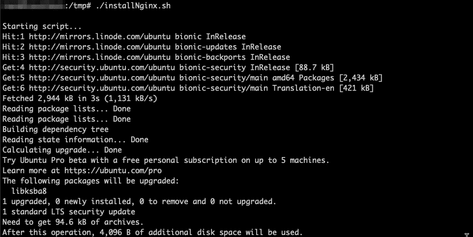

# 如何在 Ubuntu 18.04 LTS 上安装 NGINX

> 原文：<https://blog.devgenius.io/how-to-install-nginx-on-ubuntu-18-04-lts-99008ad33ae5?source=collection_archive---------19----------------------->


今天是西雅图异常炎热的一天，尤其是在十月中旬。空气中弥漫着野火产生的浓烟和华氏 82 度的闷热。这是一个呆在室内用我的空气过滤器写我的第一篇媒体文章的好日子。

今天我们将在 LTS 的 Ubuntu 18.04 上安装 NGINX 网络服务器。这将是一个快速安装，旨在创建一个测试 web 服务器。

## NGINX 是什么？

NGINX 是一款开源软件，用于 web 服务、反向代理、缓存、负载平衡、媒体流等等。它最初是一个为获得最佳性能和稳定性而设计的 web 服务器。除了 HTTP 服务器功能，NGINX 还可以充当电子邮件(IMAP、POP3 和 SMTP)的代理服务器，以及 HTTP、TCP 和 UDP 服务器的反向代理和负载平衡器。

## 先决条件

*   根级别访问
*   Ubuntu 18.04

## 安装 NGINX

**第一步:更新软件包**

首先登录你的 Ubuntu 实例。

```
ssh <username>@<ip>
```

让我们更新回购，以确保我们有最新和最安全的版本。

```
apt-get update && apt-get upgrade
```


更新存储库

**第二步:安装 NGINX**

现在回购是最新的，让我们安装 NGINX 包。

```
apt install nginx -y
```


安装 NGINX 包

让我们通过运行以下命令来验证安装并检查版本。

```
nginx -v
```


确认安装和版本

当你在 Ubuntu 18.04 上安装 NGINX 时，该服务会自动启动。现在让我们检查状态，看看服务是否正在运行。

```
systemctl status nginx
```


检查服务状态

现在，让我们启用该服务，以便它将在重新启动后自动启动。

```
systemctl enable nginx
```


允许服务在重新启动后自动启动

## **第三步:测试**

确认工作安装的最后一步是通过 web 浏览器输入服务器的公共 IP 来访问站点。如果您不知道您的 IP 是什么，您可以运行以下命令。

```
curl -4 icanhazip.com
```

现在将 IP 地址输入你最喜欢的浏览器，你会看到 NGINX 的默认登陆页面。


默认网页

那很简单！让我们将这些命令放入 bash 脚本中，并定制登录页面。

用你最喜欢的编辑器创建一个文件。我喜欢用 **VIM** 。输入下面的代码，保存为" **installNginx.sh"** 。

```
#!/bin/bashecho -e '\nStarting script...'apt-get update && apt-get upgrade -y
apt install nginx -y
systemctl status nginx
systemctl enable nginxrm /var/www/html/*.htmlecho '<html>
<head>
        <title>Test Page</title>
</head><body>
        <h1>Welcome to LUIT - Black Team!</h1>
        <a href="[https://www.linkedin.com/in/algiles/](https://www.linkedin.com/in/algiles/)">Check out my LinkedIn!</a>
</body>
</html>' > /var/www/html/index.htmlecho -e '\nInput following IP into web browser\n'curl -4 icanhazip.comecho -e '\nDone!\n'
```

使文件可执行。

```
chmod +x installNginx.sh
```

现在执行文件。



开始脚本


脚本运行完毕并显示公共 IP

让我们通过在我们的网络浏览器中输入指定的 IP 来看看它是否有效。


自定义 index.html

太棒了。效果相当不错。我真的很喜欢这个练习，所以让我们让它再次发生。这次用的是 **Python** ！

和以前一样的步骤。我将创建一个名为“**install nginx . py”**的文件。编写代码，这次在我的工作站上使用 Visual Studio 代码


Visual Studio 代码中的 Python 代码

我将使用" **scp** "命令将文件从我的本地机器传输到我的远程服务器上的" **/tmp"** 目录。

```
scp installNginx.py <username>@<server-IP>:/tmp/
```

像我们之前做的那样使文件可执行并运行它。


运行 python 脚本

就是这样。我们已经在 **Ubuntu 18.04 LTS** 上成功安装了 **NGINX** ，并使用 **Bash** 和 **Python 编写了安装脚本。**