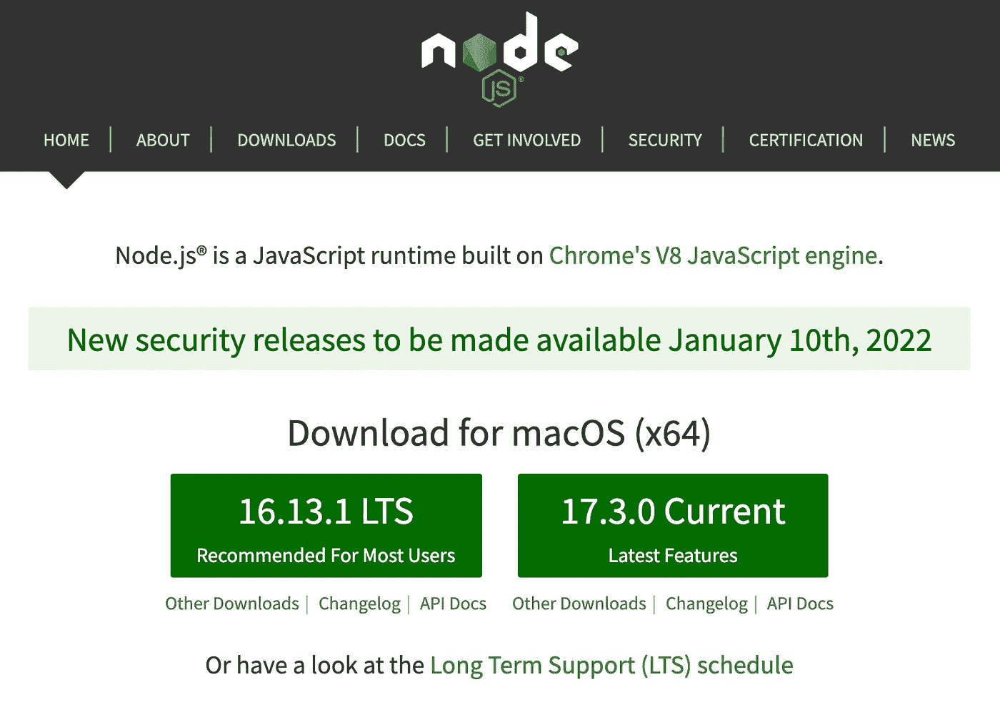

# 【JavaScript 系列】如何在 PC/笔记本电脑上安装 Node.js

> 原文：<https://blog.devgenius.io/how-to-install-node-js-on-your-pc-laptop-ab0beea099bb?source=collection_archive---------8----------------------->

现在开发应用不仅仅是使用 PHP，Python 等。还有 Javascript，比如使用 React.js、Vue.js，这些库或框架都需要 Node.js 来运行应用。

Node.js 是一个基于 Chrome 的 Javascript 运行时的开源平台，用于轻松开发快速和可伸缩的 Javascript 应用程序，可以在 web 浏览器之外执行。构建一个应用需要安装 Node.js，根据我的经验，至少有三种安装 Node.js 的方法:

**使用软件安装程序**

前往[https://nodejs.org/en/](https://nodejs.org/en/)选择 LTS 或当前版本。然后，按照安装过程操作。



**使用 bash 安装程序**

对于 mac 用户，我们可以通过在您的终端上键入以下命令来使用家酿:`brew install node`

对于 Ubuntu/Linux 用户，使用这个命令:`sudo apt install nodejs`

**使用 NVM(节点版本管理器)**

当我想使用 MacBook 设置我的笔记本电脑时，我通常使用这种方法来避免崩溃并易于维护。要安装 NVM，毫不费力。

***a .打开此链接(*** [***nvm 链接***](https://github.com/nvm-sh/nvm)***)***

***b .转到本节(*** [***本节***](https://github.com/nvm-sh/nvm#installing-and-updating) ***)安装 NVM***

确保您已经安装了其中一个:*卷曲*和 *wget* 。在我使用 Macbook 的情况下，我使用以下命令安装它们:

```
brew install curl
brew install wget
```

然后，选择你喜欢安装哪一个。

对于*卷曲*，使用这个脚本。

```
curl -o- https://raw.githubusercontent.com/nvm-sh/nvm/v0.39.1/install.sh | bash
```

对于 *wget* ，使用这个脚本。

```
wget -qO- https://raw.githubusercontent.com/nvm-sh/nvm/v0.39.1/install.sh | bash
```

运行该脚本会将 nvm 存储库克隆到`~/.nvm`，并尝试将下面代码片段中的源代码行添加到正确的配置文件(`~/.bash_profile`、`~/.zshrc`、`~/.profile`或`~/.bashrc`)。

```
export NVM_DIR="$([ -z "${XDG_CONFIG_HOME-}" ] && printf %s "${HOME}/.nvm" || printf %s "${XDG_CONFIG_HOME}/nvm")"
[ -s "$NVM_DIR/nvm.sh" ] && \. "$NVM_DIR/nvm.sh" # This loads nvm
```

***c .安装节点 js(我推荐用 LTS 版本)***

如果你去[https://nodejs.org](https://nodejs.org/)，有两个版本:LTS ( *长期支持*)和最新的(*当前*)。

在我看来，我建议使用 LTS 而不是目前的，但这取决于你的需求。选择当前版本将为我们提供 Nodejs 的最新功能，但当我们作为一个团队在公司工作时，这是无法保证的。可能有些功能因为版本不同不能很好的实现。它在当前版本中运行良好，但在生产中会出现一些错误。

要安装 LTS 版本，我们可以使用以下命令。

`nvm install --lts`安装 LTS 版本，然后使用`nvm use --lts`使用该版本

为了检查版本，我们可以使用`node -V`作为节点，使用`npm -V`作为 NPM。


希望这篇文章对你安装 Node.js 有所帮助，继续阅读！:)