# 如何安装 PIP？

> 原文：<https://blog.devgenius.io/how-to-install-pip-8065b8c341a?source=collection_archive---------8----------------------->

**PIP** 是一个软件包管理系统，用于**安装和管理用 Python** 编写的软件包。它代表“*首选安装程序*或“ *Pip 安装包*”

一个 **python 包**就是**模块**的集合。**相互关联的模块**主要放在同一个包里。

你可以通过下载安装包，**打开命令行**，**启动安装程序**，在 Windows 上轻松安装 **PIP** 。

安装 PIP 示例如下:

1.  皮普安装**熊猫**。
2.  pip 安装 **numpy** 等。

# 现在让我们看看如何为 Python 包安装 PIP:

如果你想下载 pip。你必须去 pip 官方网页下载压缩文件并解压到 python 路径。所以与其花这么长时间。您可以在您的**笔记本电脑或 PC** 的**命令提示符**中非常容易地下载这些 **PIP 的**和**包**。

# 安装 PIP 之前，请检查 PIP 文件是否已安装:

在安装之前，您需要检查是否安装了 PIP 文件。当您安装 Python 时，默认情况下将安装 PIP。如果您的 PIP 文件没有安装，请按照以下步骤操作:

**检查是否安装了 PIP 文件:**

1.  打开你的 ***命令提示符*** 或者点击搜索栏，输入***【cmd】***。
2.  在 **cmd** 中，键入 ***pip help*** 。
3.  如果您遇到这种类型的错误，

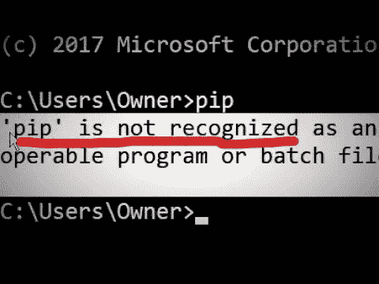

然后你需要安装 PIP 文件。如果你没有得到这个，你可以直接安装 PIP 步骤 1 如下所示。

# 在 windows 上安装 PIP 文件:

如果出现上述错误，请执行以下操作:

01.打开命令提示符(cmd)。

02.键入 ***"卷曲***[***https://bootstrap.pypa.io/get-pip.py***](https://bootstrap.pypa.io/get-pip.py)***-o get-pip . py "。*** (可以复制这个路径，粘贴到你的 cmd 里)。

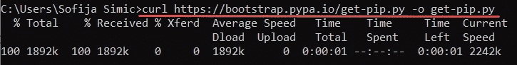

成功完成后，您的 PIP 文件将被下载。

# **步骤 01:在 windows 上安装 PIP:**

要安装 Python PIP:

1.  打开你的命令提示符( **cmd** )。
2.  键入***“python get-pip . py”。***

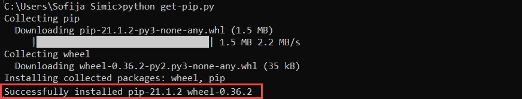

如果找不到文件，请仔细检查保存文件的文件夹的路径。您可以使用以下命令查看当前目录的内容:

在 cmd**T5 中输入***【dir】***。**

***【dir】***命令返回一个目录内容的完整列表。

# 步骤 02:验证 PIP 安装:

一旦安装了 PIP，您可以通过键入以下命令来测试安装是否成功:

在 cmd 中输入***【pip 帮助】*** 。

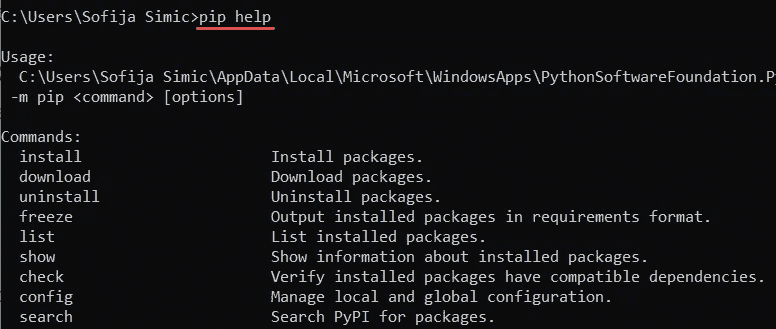

所以如果你完成这个过程，你可以看到如上图所示。

如果您再次遇到错误，请再次重复该过程。

# 步骤 03:将 Pip 添加到 Windows 环境变量:

要从任何位置运行 PIP，您只需将其添加到 Windows 环境变量中，以避免出现“ ***路径未识别*** ”错误。为此，请遵循以下步骤:

1.  在**控制面板**中搜索打开**系统和安全**窗口。
2.  导航至**系统**设置。

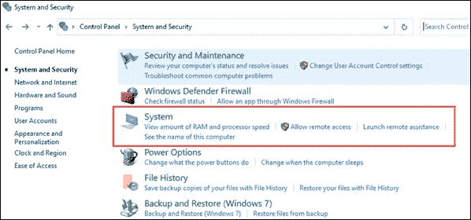

3.然后，选择**高级系统设置**。

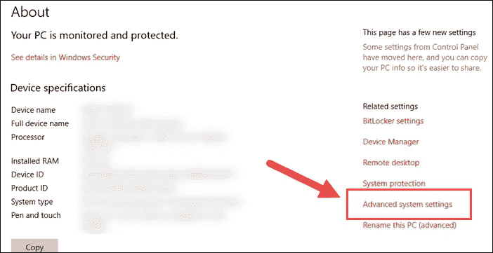

4.打开**环境变量**，双击**系统变量**中的**路径变量**。

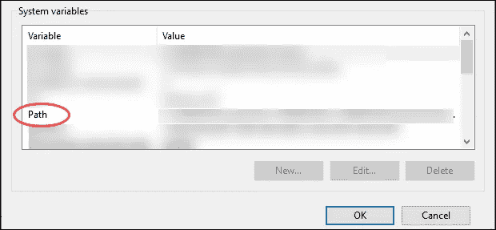

5.接下来，选择**新建**并添加安装 PIP 的目录。

6.点击**确定**保存更改。

现在您已经设置好了，PIP 已经成功安装。

# 在命令提示符下升级 PIP:

PIP 新版本偶尔会发布，因此它们可能具有最好的功能和安全性。

**检查 PIP 版本:**

在 cmd 中运行***pip--版本*** 。

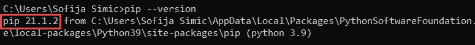

**对于 PIP 的升级:**

在 cmd 中运行“ ***python -m pip 安装--升级 pip*** ”。

这有助于卸载旧版本并安装最新版本的 PIP。

# 让我们看一个安装一个 PIP 包的例子:

1.  打开命令提示符(cmd)。
2.  运行***“pip 安装(包名)”，*** 例如***“pip 安装熊猫”。***

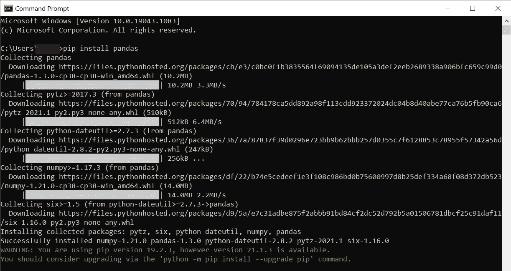

注意:你会得到这个，所以你的熊猫会很容易安装。(Pandas 是一个 Python 库，我们用**来分析数据**)。

**如果你安装后软件包有任何问题，那么你可以卸载软件包。现在让我们看看如何卸载软件包。**

# 卸载一个 PIP 包:

1.  打开命令提示符(cmd)。
2.  运行***“pip 卸载(pip 名称)”，*** 例如***“pip 安装熊猫”。***
3.  它会问是或否，如果你想删除类型***【y】***。

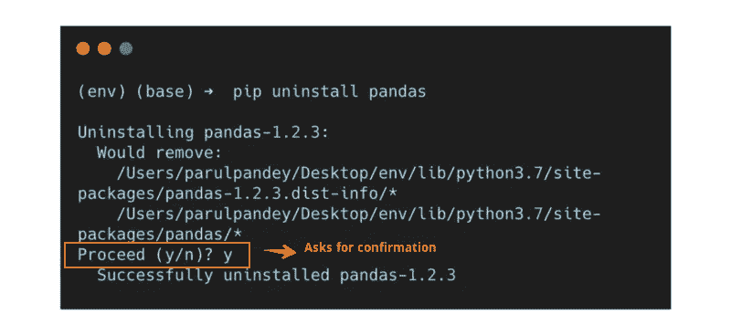

现在您的 PIP 包将很容易删除。

# 让我们看一个卸载完整 PIP 管理器本身的例子:

1.  打开命令提示符。
2.  进入**pip uninstall pip**从**笔记本电脑/pc** 中完全删除 pip 软件。

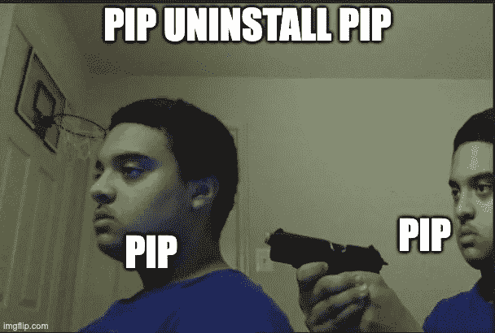

pip 卸载的搞笑图片。

它完全卸载 pip

*******************************************************************

我希望你明白这个简单的概念。所以我打算用一种简单的方式写一篇关于 python 的每一个概念的博客，在这里你可以轻松地学习。

所以请继续支持我们，谢谢你和所有读过这篇完整博客的人。

***全爱无恨。***

我们有一个 Youtube 频道，我们在那里上传关于编程相关的话题，你可以通过订阅我们的频道来支持。

[***https://www.youtube.com/channel/UChiEiQ2E3_DUGYDG340si-A***](https://www.youtube.com/channel/UChiEiQ2E3_DUGYDG340si-A)

***这是我们的 Youtube 频道链接，请订阅。***

*本文概念及作者:*

***赛库马尔和维诺德库马尔。***

*******************************************************************