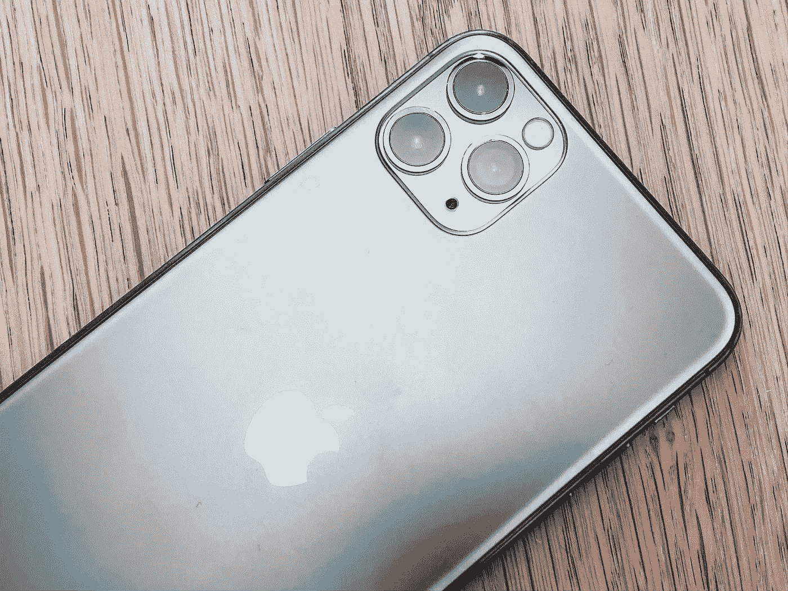

# 如何在手机上安装 iOS 14 公测版

> 原文：<https://blog.devgenius.io/how-to-install-the-ios-14-public-beta-on-your-phone-119fe64cec51?source=collection_archive---------23----------------------->

## 安装 Apple 最新软件的分步说明

*图片:Unsplash | @jankolario*

苹果期待已久的 iOS 14 快到了。对于那些不介意安装仍在开发中的软件的人来说，等待已经结束了。苹果正在[向消费者发布 iOS 14 的公测版](https://www.theverge.com/21308213/ios-14-ipados-public-beta-download-iphone-ipad-how-to)。

本指南将引导您完成在您的设备上下载和安装测试版的步骤，并确定它是否兼容。它还包含了 iOS 14 的有用功能的概要。关于最新软件版本的更全面的总结，[看看我们上个月在苹果虚拟 WWDC 发布更新后发表的文章](https://www.theburnin.com/technology/apple-unveils-ios-14-features-widgets-translate-app-clips-release-date-2020-6/)。

# 安装 iOS 14 公测版的步骤

对于任何不属于苹果开发者计划的人来说，这是第一次直接测试新软件的机会。iOS 测试版将定期更新，因为苹果会从下载它的用户那里获得反馈，并继续开发其功能。最终，该计划将随着 iOS 14 的正式发布而达到高潮，这可能会在今年夏天晚些时候发生。

在你急于安装公测版之前，你应该知道测试版软件并不完美。虽然它对于一般用途来说足够稳定，但它可能仍然有一些错误和问题。这可能会导致功能下降、电池寿命缩短或关键功能丧失。

如果你愿意用 iOS 14 的测试版来掷骰子，那就去做吧。如果你对这些问题过于担心，最好等到最终版本发布。

如果你决定安装 iOS 14 测试版，你应该首先备份你设备的数据，以防出现问题。

也就是说，安装软件更新非常简单。首先，从 iPhone 上的 Safari 进入[苹果的测试软件门户](https://beta.apple.com/sp/betaprogram/)。您需要 iPhone SE 或更高版本才能运行 iOS 14。简单来说，任何目前支持 iOS 13 的设备都可以升级到最新的 OS。

在 Apple 的测试软件门户上，选择网页顶部的“注册您的设备”。之后，选择“iOS”这样做应该会触发一个提醒来备份你的手机，以防你需要恢复到以前的软件版本。再次强烈推荐这种做法。

下一步，向下滚动到一个按钮，上面写着“下载配置文件”,点击它。这将弹出一个警告，您应该选择“允许”

应该会出现一个弹出窗口，提示您从设置应用程序设置新的配置文件。在“设置”中，一个名为“下载档案”的新部分现在应该出现在顶部附近。点击它将允许您访问测试软件下载。一旦安装了描述文件，请按照典型的更新过程(设置>通用>软件更新)来安装 iOS 14 测试版。

# iOS 14 提供了什么？

苹果最新的软件版本有很多额外的好处，让升级变得物有所值。最引人注目的是引入了小工具的主屏幕重新设计。这些 Android 收藏夹让你可以直接在主屏幕上一目了然地从不同的应用程序中获得有用的信息。

它还包括一个新的应用程序库(是的，就像 Android 的应用程序抽屉一样)，让你可以轻松地根据类别组织你的应用程序。很快，苹果将在 iOS 14 中引入画中画功能，这意味着你可以观看视频，而不会妨碍你的其他内容。

最新的软件版本改变了来电通知和 Siri 的响应动画，使它们更少打扰。

上述功能只是触及了 iOS 14 所包含内容的皮毛。Memojis、苹果地图、“信息”中的群组信息等等都有变化。随着今年晚些时候正式发布的临近，测试版[将开始增加这些功能](https://www.theburnin.com/technology/apple-ios-14-clips-test-apps-before-downloading-2020-4/)。

*原载于 2020 年 7 月 9 日 https://www.theburnin.com***。**