# 如何安装 WordPress:初学者指南

> 原文：<https://blog.devgenius.io/how-to-install-wordpress-a-beginners-guide-69bde12526f4?source=collection_archive---------18----------------------->

## 你也可以成为一名“网络开发者”

## 关于安装 WordPress 你需要知道的

如何安装 WordPress？真的这么简单吗？如果是的话，那么为什么我要花几个小时在网上搜索，然后才知道如何安装 WordPress？你在问自己这些问题吗？

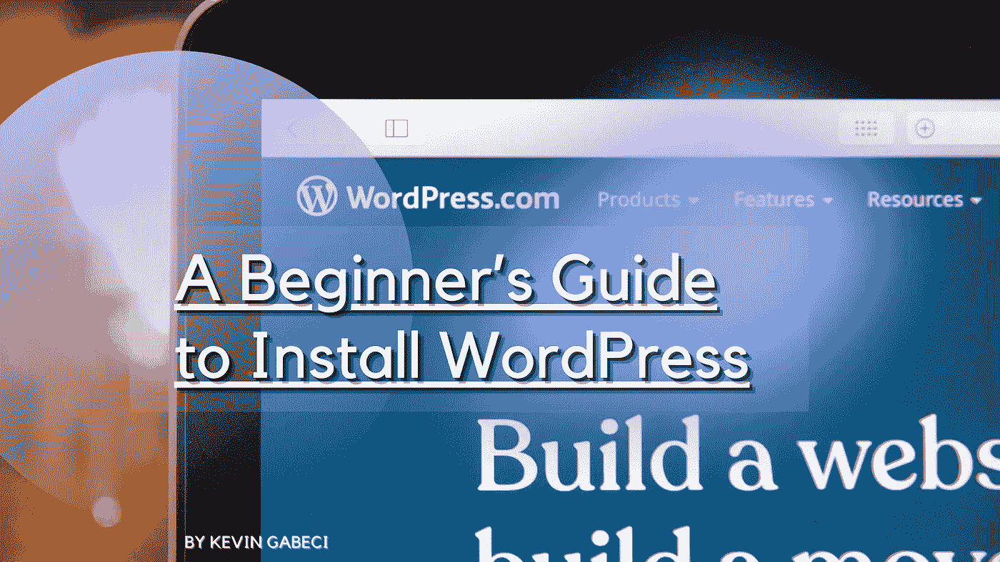

如果是，那么你来对文章了。是的，WordPress 的安装和操作非常简单。你花了几个小时试图学习如何安装 WordPress，因为你没有早点看到这篇文章。

# 什么是 WordPress？

“WordPress”这个词是“网络出版软件”的缩写。该软件由马特·莫楞威格开发，于 2003 年发布。自发布以来，它已经成为使用最广泛的博客平台之一。

WordPress 是一个**免费的内容管理系统** (CMS)，允许用户不需要任何编码技能就可以轻松建立网站。它在博客作者和那些想在很少或没有经验的情况下上网的小企业主中很受欢迎。

它基于 PHP 和 MySQL 技术，具有许多功能，如博客、画廊、论坛、电子商务等。

WordPress 有两个版本——自托管版本和托管版本。在本教程中，我们将使用自托管的 WordPress。

# 我为什么要使用 WordPress？

你应该使用 WordPress 而不是其他 CMS 系统有几个原因。让我们来看看其中的几个原因，如果其中有任何一个引起了你的共鸣，请继续阅读本文的其余部分，在那里你可以更深入地了解情况。

## **1。轻松创建网站**

用 WordPress 创建网站根本不需要懂 HTML。你所需要的只是一个网页浏览器和一些关于创建网页和设计的基本知识。

## **2。不需要专业技能**

是的，没错，你不需要知道任何关于 HTML、CSS、JavaScript 等编程语言的知识。正如我上面所说的，你只需要一台能上网的电脑或笔记本电脑。

## **3。易于管理**

一旦安装，管理您的网站变得容易得多，如果你使用另一个 CMS。例如，您可以添加/编辑帖子、图片、视频、链接等。从仪表板内。

## **4。免费内容**

不像其他需要每月付费的 CMS，WordPress 是完全免费的。你甚至可以在同一个账户上托管多个网站。另外，如果你不想要域名，你可以使用完全免费的. wordpress.com 域名，例如“mywebsite.wordpress.com”

## **5。搜索引擎优化**

搜索引擎喜欢 WordPress。当他们发现网站使用与你提供的内容相关的关键词时，他们会给网站更高的排名。总的来说，WordPress 平台为 SEO 做了更好的优化，无论如何都能帮助你。

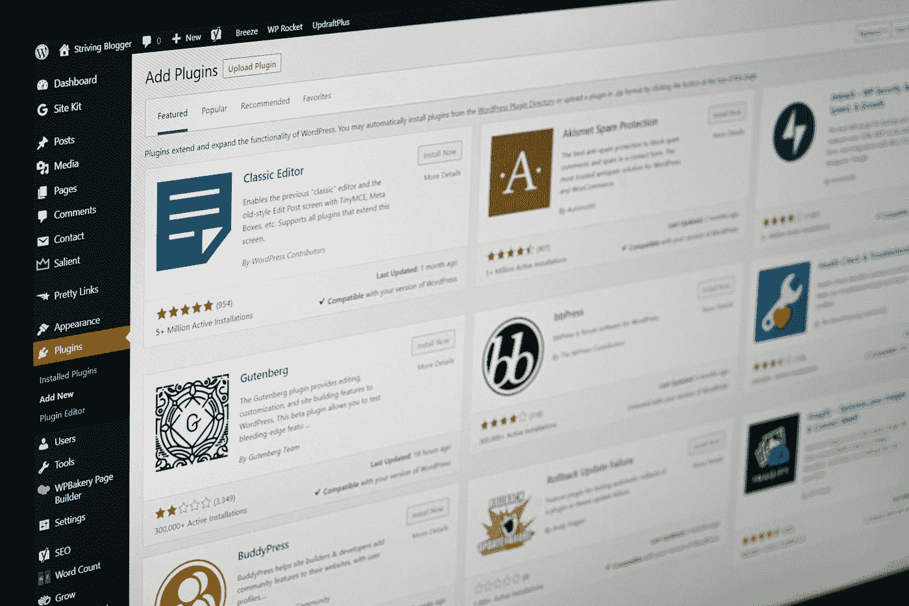

贾斯汀·摩根在 [Unsplash](https://unsplash.com?utm_source=medium&utm_medium=referral) 上的照片

## 6.和睦相处

WordPress 几乎可以与任何设备兼容，包括智能手机、平板电脑、笔记本电脑、台式机、电视等。几乎所有的 WordPress 主题都有一个简单的功能，那就是责任。使网站在任何设备上打开都没有任何问题。

## 7.安全性

WordPress 使用强加密方法来保证你的数据安全。这是保护您和您的访问者免受各种攻击的最佳平台之一。

## 8.插件

插件让 WordPress 比现在更加强大和有用。有数以千计的插件可用于不同的目的。一些例子包括 SEO、安全、社交媒体集成、电子商务等。

## 9.可定制性

有了 WordPress，你可以自定义从颜色到字体到布局的一切。这是这个平台最棒的地方之一，而且对初学者非常友好。

## 10.可量测性

如果你想扩大你的网站，WordPress 有能力尽可能扩大规模。一些最大的博客、电子商务、新闻网站等等都在 WordPress 平台上运行，它们是全球性的，这意味着它们有很大的流量。

# 如何用 Softaculous 自动安装程序安装 WordPress

在这一部分，我们将向你展示如何使用 Softaculous 自动安装程序安装 WordPress。这个工具将帮助你在几秒钟内安装好 WordPress。

**第一步:**登录你的主机服务提供商。

在这种情况下，我使用的是 [Futura 托管 VPS 服务器](https://futura-hosting.com/)。这里，Softaculous 自动安装程序已经在您的服务器空间中设置好了。你只需要登录，当你完成后，你将被发送到仪表板。它应该是这样的:

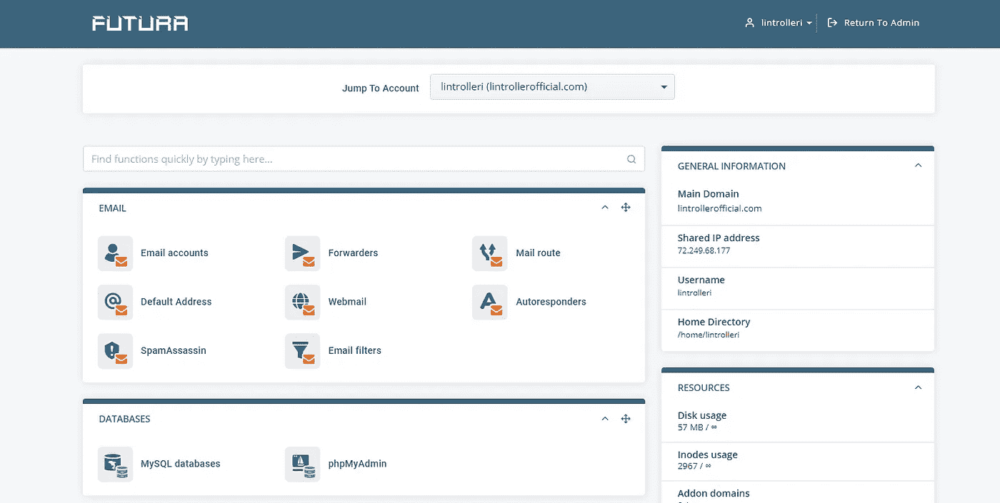

**第二步:**选择软键

您需要滚动到“工具”部分所在的底部，然后单击 Softaculous 图标。

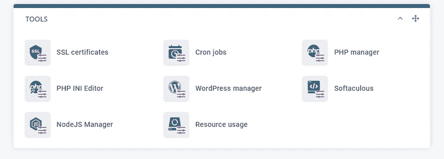

步骤 3: 选择 WordPress

当 Softaculous 仪表板在一个新窗口中打开时，点击 WordPress 安装按钮，等待它加载。

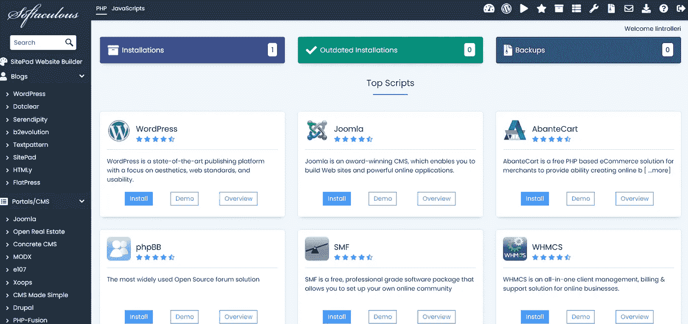

**第 4 步:**添加必要的信息

在页面的第一部分，你需要输入域名，选择目录和你想要安装的 WordPress 版本。

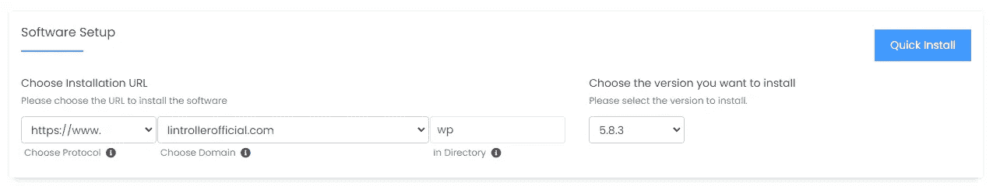

接下来，在代表性部分中设置站点设置和管理员帐户。

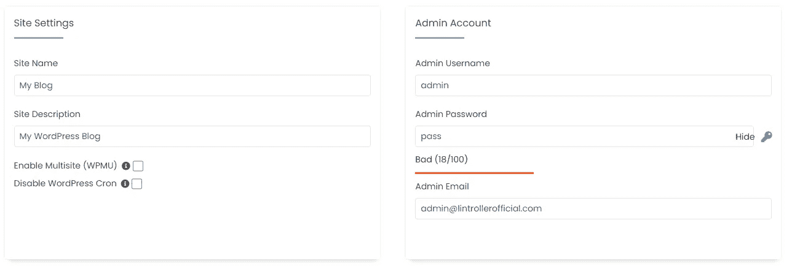

**第五步:**点击立即安装！

现在你需要滚动到页面的底部。如果您也想收到安装详细信息，请输入电子邮件。点击**‘安装’**按钮开始安装 WordPress。

**步骤 6:** 等待安装完成

安装过程完成后，单击“完成”按钮退出安装程序。当安装过程结束时，你将自动登录到你新创建的 WordPress 网站。

现在你已经学会了如何用 Softaculous 自动安装程序安装 WordPress。

# 如何手动安装 WordPress

如果你愿意，你也可以选择手动安装 WordPress。这种方法要求你先下载 WordPress 的最新版本。然后按照这些步骤自己安装 WordPress。

**第一步:**下载 WordPress

点击[这里](https://wordpress.org/download/)下载 WordPress 的最新版本。确保获得. zip 文件。

**第二步:**提取 Zip 文件

右键单击 zip 文件并选择“全部提取”，提取该文件解压后，在文件夹中导航并打开 wp-admin 目录。

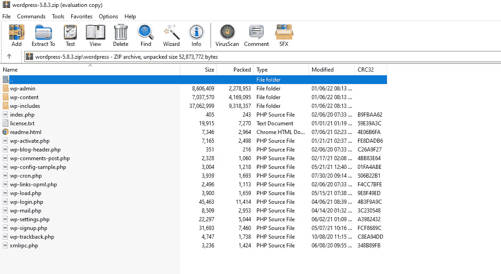

**第三步:**上传文件

将 WordPress 安装所需的所有文件上传到 wp-content/uploads 目录。

步骤 4: 激活 WordPress

通过输入注册过程中给你的凭证来激活 WordPress。

**第五步:创建数据库**

通过运行下面给出的 SQL 查询创建数据库。

创建数据库“wp_db ”;

**第六步:登录 WP 管理面板**

您将看到类似下图的登录页面。

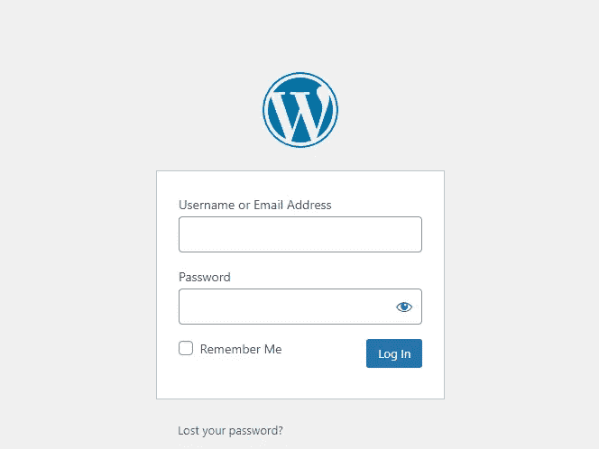

**步骤 7:** 测试配置

通过登录仪表板并检查一切是否正常来测试配置。

就是这样！您已经成功地手动安装了 WordPress。

# 如何删除 WordPress

如果你想从你的服务器上删除 WordPress，你可以删除它的文件夹。为此，请转到服务器空间的根目录，删除 WordPress 文件夹。

如果您是 Futura 托管客户，请登录您的仪表板。向下滚动到“文件”部分，点击“文件管理器”

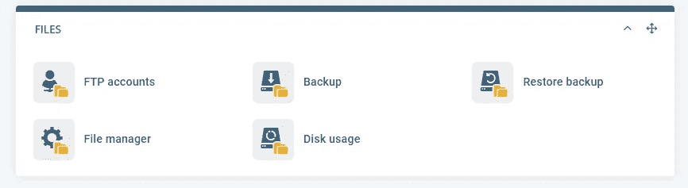

然后文件管理器会打开，从那里你需要删除整个文件夹和你的网站数据，你就完成了。

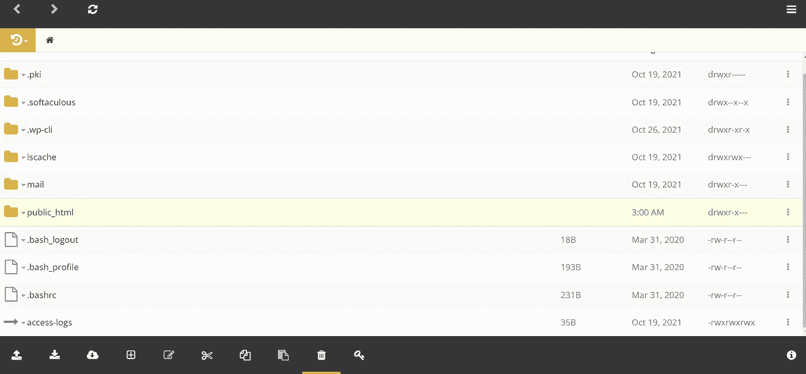

这就是你如何从服务器上完全卸载 WordPress 的方法。

# 如何升级 WordPress

要升级 WordPress，只需登录你的 WordPress 仪表盘，点击更新。出现如下所示的更新屏幕。

**步骤 1:** 检查更新

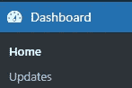

通过单击更新来检查更新。

第二步:查看可用的升级

下面列出了可用的升级。选择您想要升级的，然后单击更新。如果没有可用的选项，这意味着您是最新的。

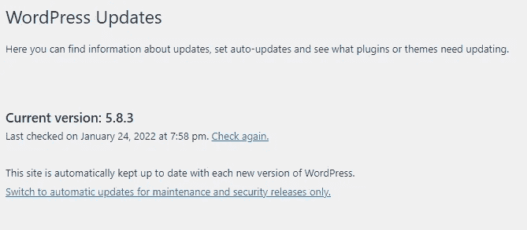

**第三步:**确认升级

单击“立即更新”按钮确认升级。

第四步:重启 WordPress

WordPress 将在升级到最新版本后重新启动。现在你已经完成了 WordPress 网站的升级。

# 如何恢复 WordPress

如果你不小心删除了你的 WordPress 网站，你可以使用这个指南恢复它。

**第一步:**找到备份文件夹

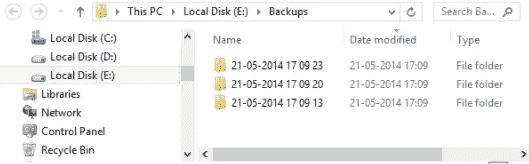

导航到存储以前备份的备份文件夹。

**第二步:**复制备份

将所有备份复制回之前保存它们的位置。

**第三步:**导入备份

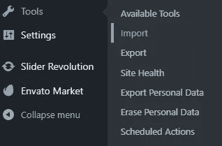

通过打开位于工具->导入的导入选项来导入备份。然后选择给定列表底部的 WordPress。

第四步:重新安装 WordPress

转到仪表板，点击更新选项卡，重新安装 WordPress。单击“重新安装版本”按钮，并按照提示完成重新安装。

就是这样。您已经恢复了您的 WordPress 站点。

## 不容错过的限时优惠！

我在上面提到了 Futura-Hosting，但现在是时候向你透露他们为我们提供的最好的交易之一，专为中等读者制作。如果你已经阅读了这篇文章，并有兴趣购买 VPS(虚拟专用服务器)，我们提供 50%的 VPS 初学者托管计划。

是的，这不是打字错误，像这样的虚拟专用服务器一年的费用是 180 美元，我们提供 50%的折扣，只需 90 美元。对于任何有兴趣获得折扣的人，请务必发送电子邮件至 futuracreative21@gmail.com，邮件主题为“中等”。这笔交易将是限时的，一定要在打折的时候买。

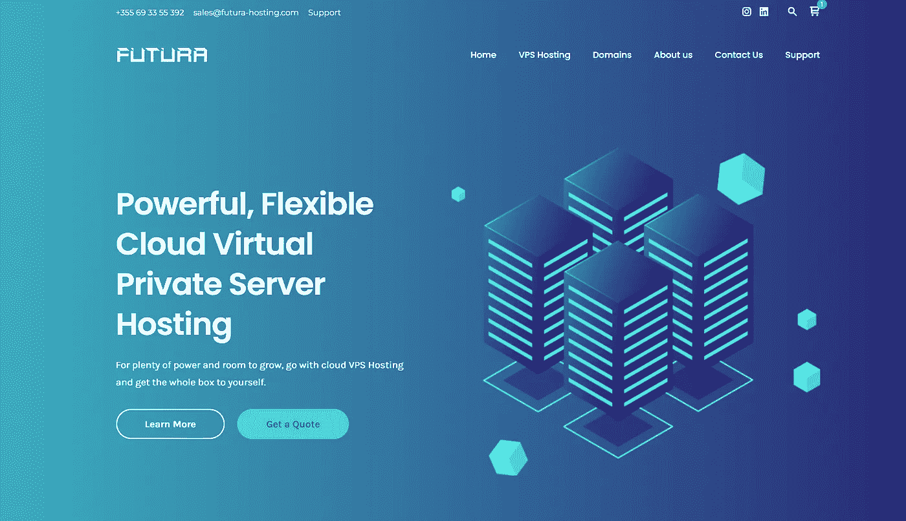

Futura-Hosting.com 成立于 2021 年，专注于为我们的客户提供人性化、可靠的技术支持，并迅速成为我们成功的基石。我们的主机方案和服务器提供 Linux 环境，适合个人、博客、小企业、设计师、开发者和企业的需求。

# 结束语

我希望这份关于如何安装 WordPress 的初学者指南在你创建**网站**的旅程中帮助了你们中的许多人。这肯定比听起来更令人兴奋，我希望你能找到正确的动力坚持到底。

如果你对这篇文章有任何问题，请不要犹豫，留下你的评论，我会亲自回复每一个问题。如果你喜欢这篇文章，请订阅我的媒体时事通讯，确保不要再错过它。