# 如何通过 Slack Part 1 (iOS)将 Bitrise 与 Github 和 fastlane 集成

> 原文：<https://blog.devgenius.io/how-to-integrate-bitrise-with-github-and-fastlane-via-slack-ios-9dfb85348689?source=collection_archive---------14----------------------->

马库斯·温克勒在 [Unsplash](https://unsplash.com?utm_source=medium&utm_medium=referral) 上的照片

我们所有人都花了很多时间来运行单元测试，另一个花了很多时间来发送用于 QA 的 TestFlight 或在 App Store 上发布构建，所以这里有 3 个部分来拯救我们的生活。

**1-** 如何将你在 Github 上的项目与 [Bitrise](https://www.bitrise.io/) 集成，以节省运行单元测试的时间。
**2-** 如何将您的项目与 [fastlane](https://fastlane.tools/) 整合，以节省发送试飞和发布的时间。
**3-** 如何通过 [Slack](https://slack.com/) 运行你的 faslane 命令行如(testFlight_production，testFlight_Stage 或 release)。

让我们从第一部分开始。

# 1-在 Github 上创建一个新的资源库。

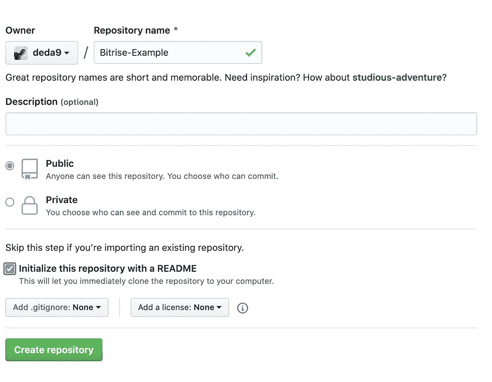

# 2-在 Xcode 上创建一个新项目。

让我们在 Xcode 上创建一个新项目，并编写一些单元测试，然后将代码推送到 Github 上，这样我们以后就可以在 Bitrise 上使用这些单元测试了。

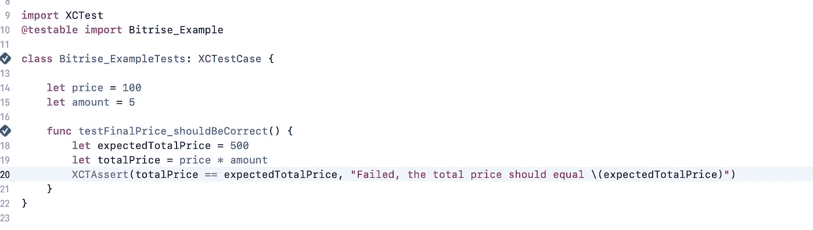

# 3-在 Github 上推送你的代码。

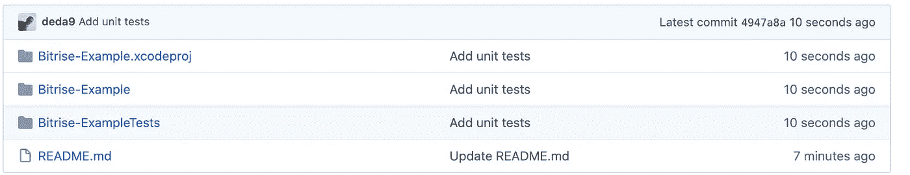

# 4-在 Bitrise 上创建一个新的应用程序。

首先，你必须有一个 Bitrise 帐户，创建一个很容易，一旦你创建了一个，你将选择添加你的第一个应用程序。

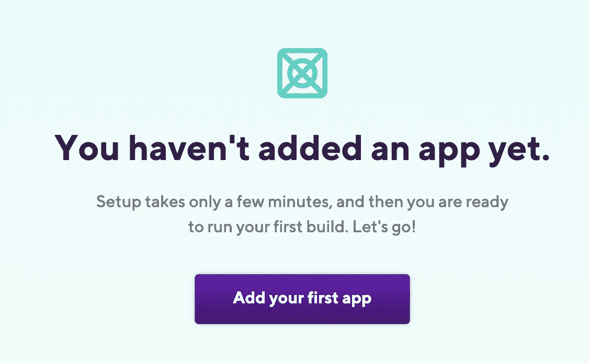

## **下面是添加你的第一个应用的步骤:**

**1-** 选择你的账号和 app 的隐私，我们会为教程选择公共隐私。

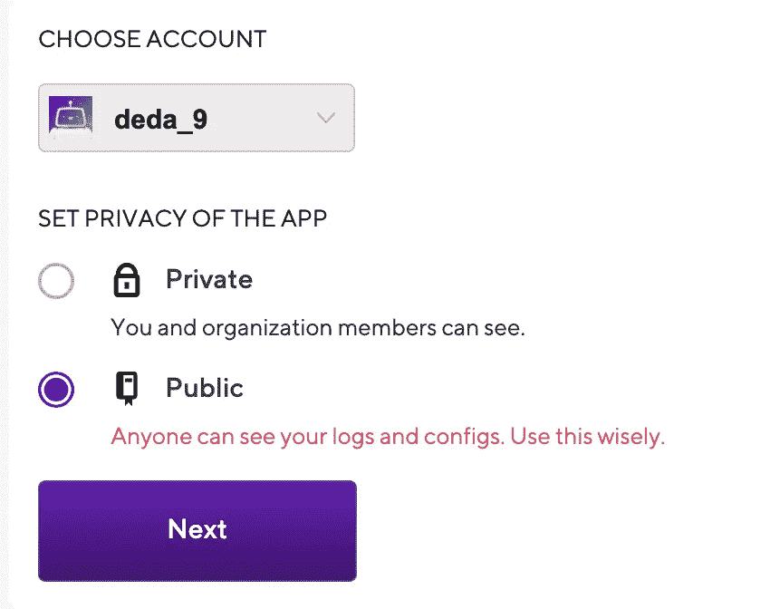

**2-** 将我们在 Github 上创建的项目连接到 Bitrise。

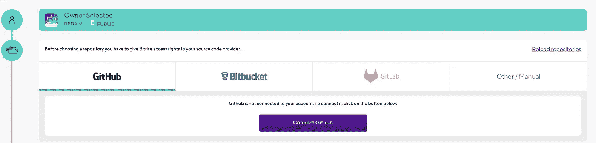

**3-** 选择你项目的资源库，设置分支，所以这里的分支就是**主**。

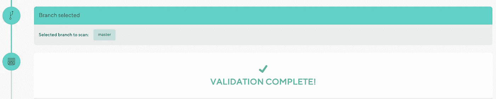

验证你的存储库，但在此之前，确保你的 Xcode 项目有[共享方案](https://devcenter.bitrise.io/troubleshooting/frequent-ios-issues)。

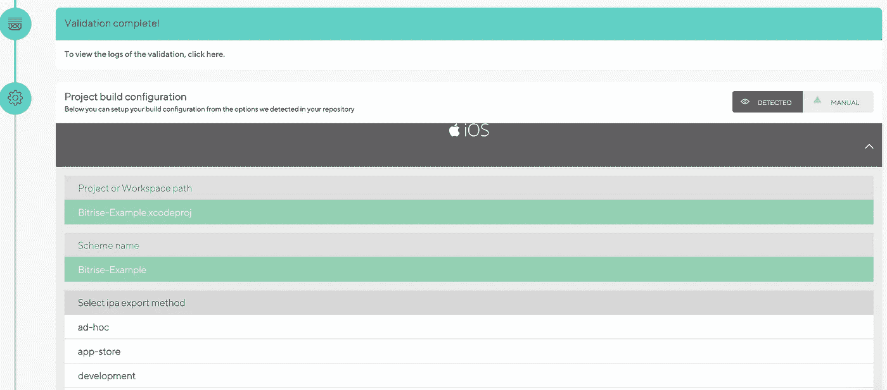

**5-** 设置 Webhook，让 Bitrise 在每次你把代码压入你的库的时候自动开始构建。

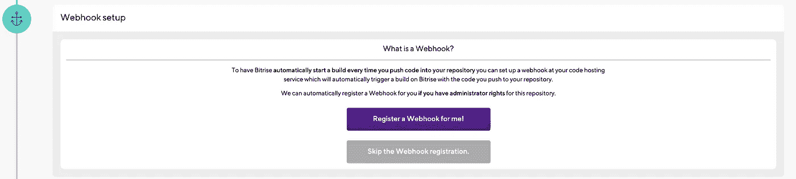

祝贺👏，您已经创建了您的第一个应用程序。

**6-** 在你的应用上创建你的新工作流，比如说**运行单元测试**

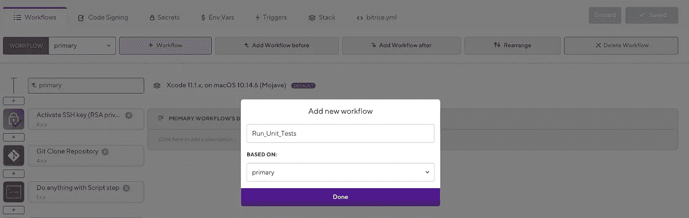

**7-** 选择 Triggers 选项卡并添加一个触发器，这样您就可以在每次在 Github 上推送新的提交时自动运行这个工作流。

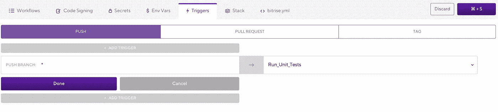

当您向您的存储库提交一个新的提交时，您将有 **Run_Unit_Tests** 工作流像这样自动触发。

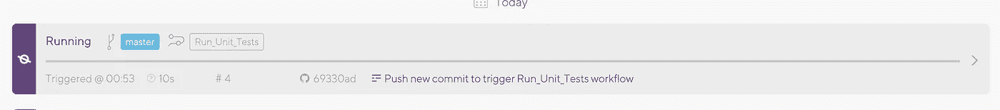

**9-** 恭喜恭喜🎉，您第一次提交了您的单元测试。

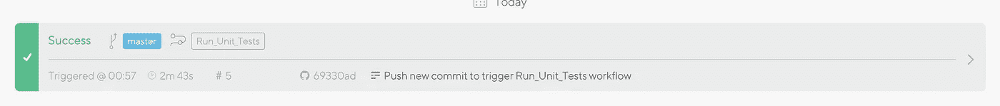

[Github 项目](https://github.com/deda9/Bitrise-Example)

你可以在[第二部分](https://medium.com/@deda9/how-to-integrate-bitrise-with-github-and-fastlane-via-slack-part-2-ios-456ac73d0b83)中了解更多，这更有趣😄