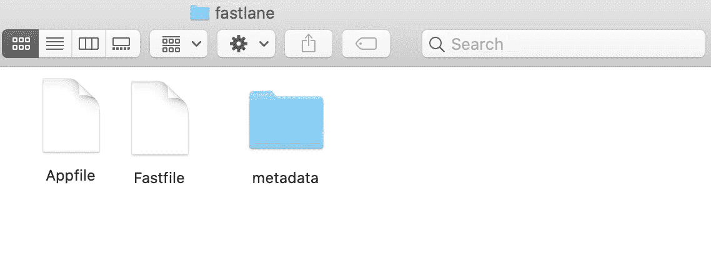
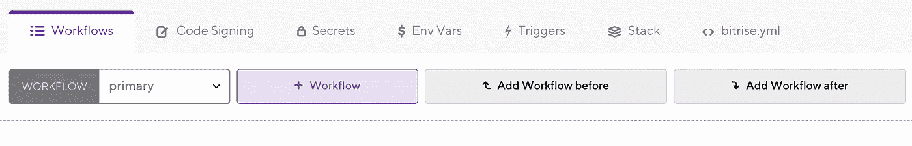
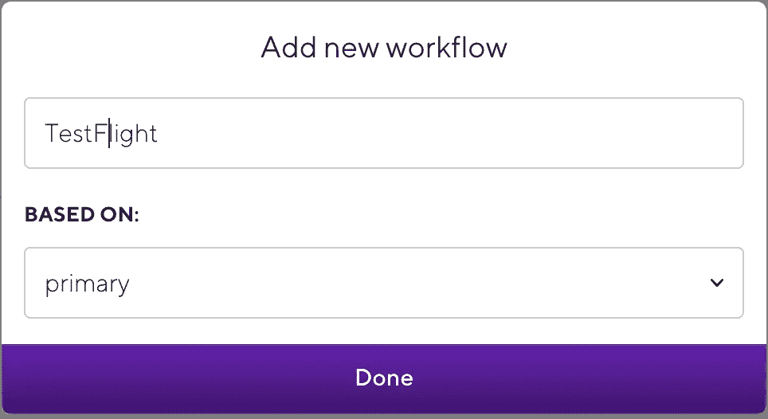
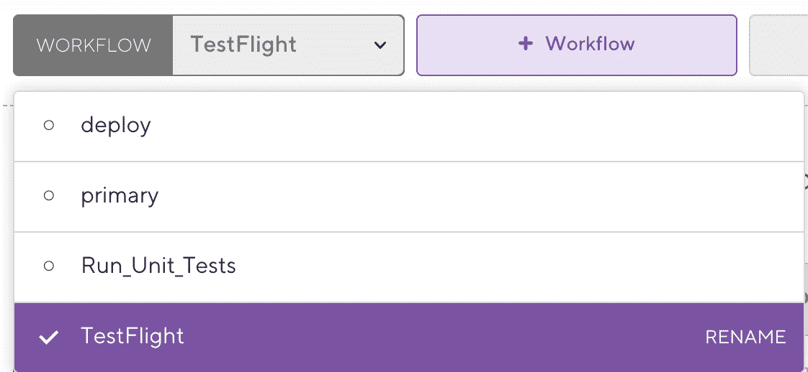
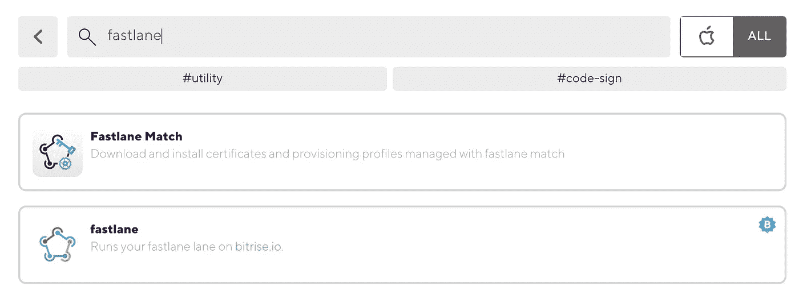
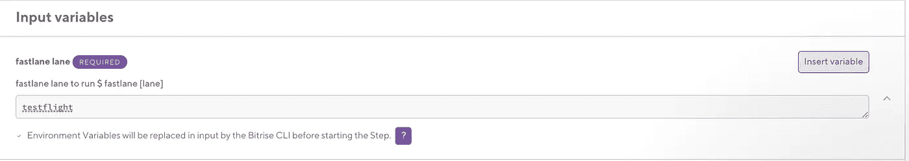
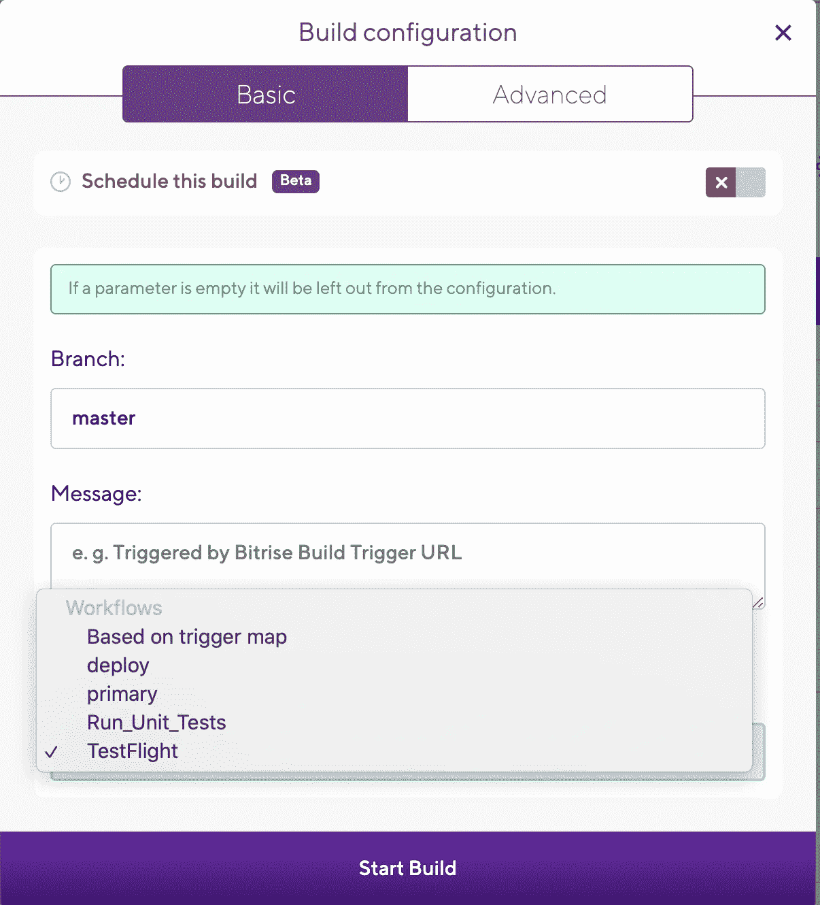
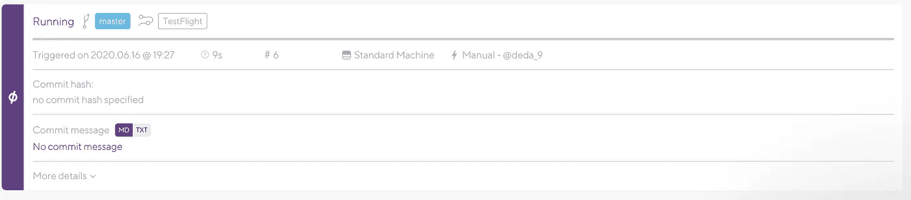

# 如何通过 Slack Part 2 (iOS)将 Bitrise 与 Github 和 fastlane 集成

> 原文：<https://blog.devgenius.io/how-to-integrate-bitrise-with-github-and-fastlane-via-slack-part-2-ios-456ac73d0b83?source=collection_archive---------15----------------------->


马库斯·温克勒在 [Unsplash](https://unsplash.com?utm_source=medium&utm_medium=referral) 上的照片

在[第 1 部分](https://medium.com/dev-genius/how-to-integrate-bitrise-with-github-and-fastlane-via-slack-ios-9dfb85348689)中，我们讨论了如何将你在 Github 上的项目与 [Bitrise](https://www.bitrise.io/) 集成，以节省构建项目的时间。

在这一部分中，将讨论如何将您的项目与[**fast lane**](https://fastlane.tools/)**集成，以节省通过 Bitrise 发送测试飞行和发布的时间。**

# **1-将您的 Xcode 项目与 fastlane 集成。**

**在这些步骤中，我们将介绍如何在您的机器上集成 fastlane 和 Xcode 项目:**

****1-** **安装快车道。**
安装最新的 Xcode 命令行工具:**

```
xcode-select --install
```

**然后使用以下命令安装 fastlane:**

```
*# Using RubyGems*
sudo gem install fastlane -NV*# Alternatively using Homebrew*
brew install fastlane
```

****2-设置快车道。** 将你的终端导航到你的项目目录并运行**

```
fastlane init
```

**然后在终端中输入项目的 Apple ID 和登录凭证。**

**祝贺🎉您已经将您的项目与 fastlane 整合在一起，[阅读更多信息](https://docs.fastlane.tools/getting-started/ios/setup)。**

****

****3-为 QA 发送试飞设置快速通道。我们可以在 *Fastfile* 中创建我们的命令行来发送 TestFlight 构建，就像这样*。*****

****1-** 创建关于命令行的描述。
**2-** 创建一个定制的命令行叫做 **testflight** (你可以随意命名)。
**3-****certificates _ appstore**是另一个定制的命令行，通过 [match](https://docs.fastlane.tools/actions/match) 同步 app store 证书。
-**-**选择该项目的体育馆方案。
**5-** 配置您希望发送此版本的方式。**

****3-设置发布构建的快速通道** 我们可以创建我们的命令行来发布*快速文件*中的构建，就像这样*。***

****1-** 创建关于命令行的描述。
**2-** 创建一个定制的命令行叫做 **release** (你可以随意命名)。
**3-****certificates _ appstore**是另一个定制的命令行，用于通过 [match](https://docs.fastlane.tools/actions/match) 同步 app store 证书。
-**4-**选择项目的方案。
**5-** 配置您希望交付此版本的方式。**

****5-设置 fastlane 以通过 match 同步项目证书。****

****1-** 创建关于命令行的描述。
2**-**-**certificates _ appstore**(可以随意命名)是自定义命令行同步 app store 证书。**

# **2-将 Bitrise 与 fastlane 集成。**

****1-** 要用 Bitrise 配置 fastlane，我们需要为每个 fastlane 的命令行创建一个工作流。**

****2-** 选择工作流程选项卡，点击**+工作流程**按钮，创建一个新的工作流程。**

****

****3-** 为工作流添加名称，我们将创建**试飞**并基于主。**

****

****4-** 选择 TestFlight 工作流来添加 fastlane 步骤。**

****

****5-** 为 fastlane 添加一个新步骤。**

****

****6-** 添加我们之前创建的 fastlane 命令行，以便在 fastlane 字段中发送 QA 的 TestFlight 构建( **testflight** ),然后单击保存。**

****

****7-** 单击**开始/安排构建**按钮，然后选择分支和您需要触发的工作流，这里我们将选择 **TestFlight** 发送构建以进行 QA，然后开始构建**

****

**祝贺🎉 👏您的工作流正在运行。**

****

**[Github 项目](https://github.com/deda9/Bitrise-Example)**

**请继续关注第三部分，它会更有趣😄**