# 如何将 FileMaker Linux 服务器与云存储集成

> 原文：<https://blog.devgenius.io/how-to-integrate-filemaker-linux-server-with-cloud-storage-36d75c5a4f69?source=collection_archive---------9----------------------->

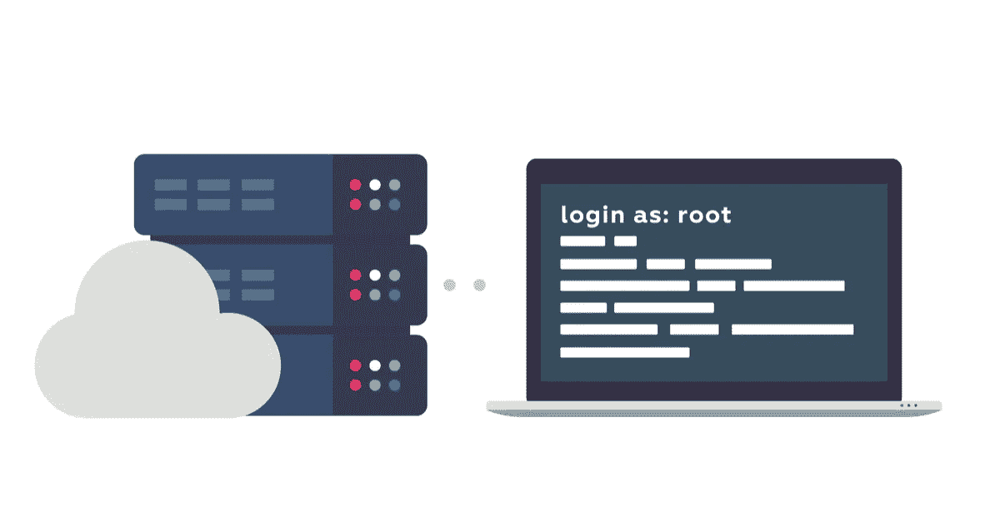

之前，我们讨论了如何在 Linux 上访问 [FileMaker。在本文中，我们将回顾如何将 FileMaker Linux 服务器与基于云的存储选项(如 AWS、Backblaze、Dropbox，甚至是基于局域网的驱动器)集成，以便我们可以从我们选择的应用程序中轻松访问它。](https://blog.supportgroup.com/how-to-access-filemaker-on-linux?utm_source=BlogPost-2021-02-04&utm_medium=Medium&utm_campaign=traffic)

# 连接到云

在本例中，我们将使用 Backblaze 作为我们的存储服务，但是连接到任何其他服务应该遵循非常相似的路径。我们将建立一个系统化的流程，将 FileMaker 服务器上备份文件夹的内容与 Backblaze 上的存储桶同步。

我们需要做的第一件事是通过 SSH 客户端连接到我们的 FileMaker 服务器。该步骤因操作系统而略有不同。在 Windows 10 上，使用应用程序和功能启用 SSH 客户端。macOS 用户可以打开终端应用程序。不管客户端是什么，我们的登录命令看起来都类似于下面这样:

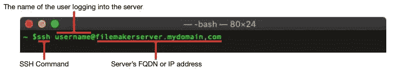

登录后，我们需要安装一个程序，用于将本地备份文件夹与 Backblaze bucket 同步。对于这个例子，我们使用一个名为 [Rclone](https://rclone.org/) 的应用。如果您按此顺序发出以下命令，它应该会自行安装:

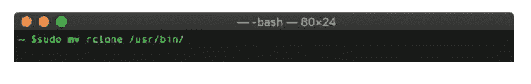

现在我们已经安装了 Rclone，我们需要将其配置为连接到我们的 Backblaze bucket，但是首先，让我们从 Backblaze 获取一些必需的信息。要配置 Rclone，我们需要从 Backblaze 帐户中获取两件东西，帐户 ID 和应用程序 ID:

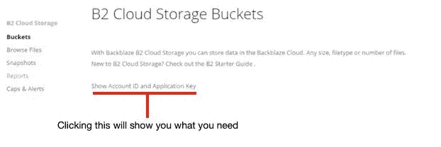

有了这两个密钥，我们可以配置 Rclone 来列出文件内容、创建存储桶、将数据复制到存储桶，甚至同步到远程位置。现在我们来配置 Rclone。

若要创建新的遥控器，请选择“n”选项，然后输入名称。

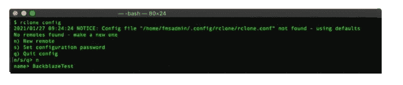

选择一个服务，在我们的示例中为 Backblaze 选择“5”。

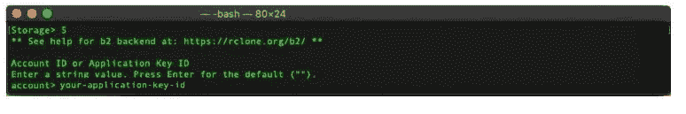

输入您的应用程序密钥 ID 和应用程序密钥。

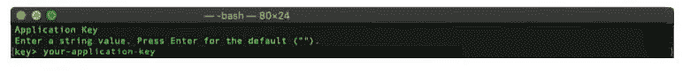

您想删除远程驱动器上的文件还是隐藏它们？如果您想要远程驱动器与本地驱动器匹配(同步)，请键入“true”

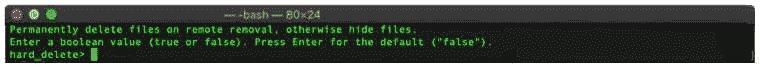

键入“y”保存您的新“遥控器”

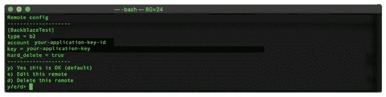

这就结束了名为 BackblazeTest 的遥控器的配置。接下来，我们需要使用 Rclone 在远程驱动器上创建一个要同步到的文件夹。约定是远程名称+冒号(:)+新目录/文件夹的名称。

现在让我们通过发出下面的命令来尝试一下。它会将我们的 FileMaker 服务器备份文件夹同步到远程文件夹。顺便提一下，我们也可以用“复制”这个词代替“同步”来执行复制

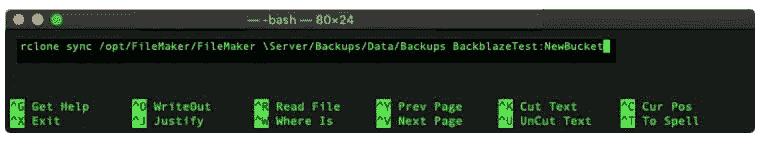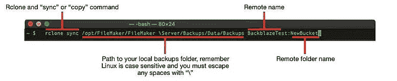

既然我们已经测试了它，让我们使用 Linux 的调度工具 Cron 来调度它。为了让 Cron 能够运行 Rclone 配置，我们需要创建一个包含上述命令的 shell 脚本，并使用“chmod”命令使其可执行。

“ctrl + o”保存它

“ctrl + x”关闭 Nano

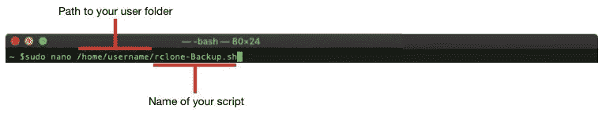

在创建脚本之后，我们可以通过使用相同的文本编辑器 Nano 将它添加到 Crontab 文件中来调度它(转到 [https://crontab.guru](https://crontab.guru/) 以获得格式化帮助)。我们通常将脚本安排在 FileMaker 服务器计划备份后一小时左右运行，以确保它成功完成。

“ctrl + o”保存它

“ctrl + x”关闭 Nano

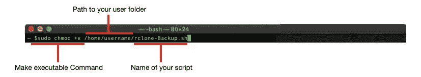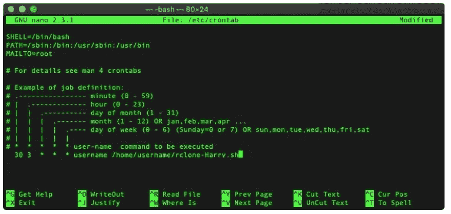

使用这些工具和示例，我们在使托管在我们的 FileMaker 服务器上的应用程序在紧急情况下或为了方便起见，从我们最喜欢的基于云或局域网的驱动器上轻松访问方面有了一个良好的开端。

请务必查看我们关于如何优化 [FileMaker 服务器性能](https://blog.supportgroup.com/optimize-filemaker-server-performance?utm_source=BlogPost-2021-02-04&utm_medium=Medium&utm_campaign=traffic)的系列文章。

*原载于 2021 年 2 月 4 日 https://blog.supportgroup.com***。**