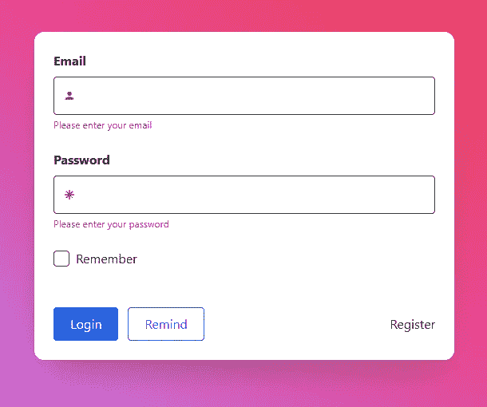
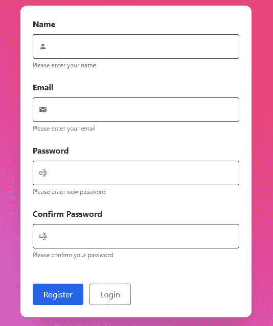
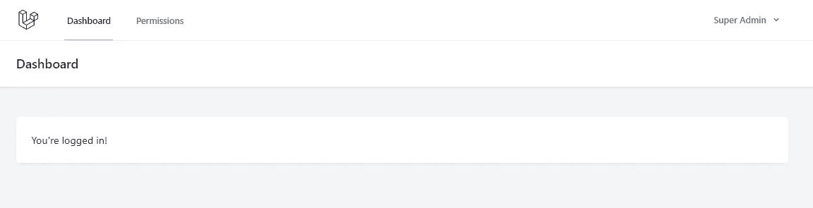
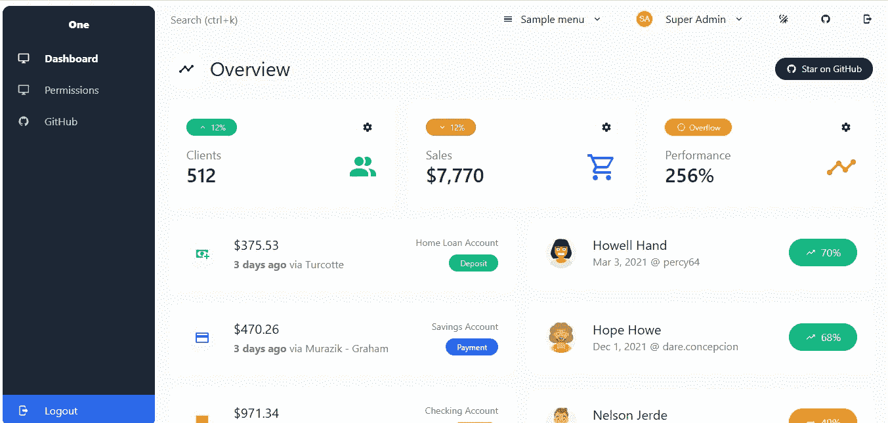

# 如何将 Laravel 与 Vue 和 Tailwind Admin One 仪表板集成

> 原文：<https://blog.devgenius.io/how-to-integrate-laravel-with-vue-tailwind-admin-one-dashboard-3753346181?source=collection_archive---------3----------------------->

## Laravel 从头开始创建 Vue 管理面板——第 6 部分

我们已经完全完成了前 5 个[零件](/laravel-crud-authorization-with-inertia-and-vue-access-control-using-role-and-permission-bb718f0b3a78)的许可 CRUD。在这一部分，我们将把 [Admin One](https://github.com/justboil/admin-one-vue-tailwind) admin dashboard 模板添加到我们的 [Laravel Vue 管理面板](https://github.com/balajidharma/laravel-vue-admin-panel)中。

## 管理一号-管理仪表板

Admin One 是一个简单、漂亮的免费构建，带有 Vue.js，Tailwind CSS 管理仪表板。Admin One 仪表板由 SFC `<script setup>`和组合 API 组成。


## 管理员一-功能

*   使用 Vue.js 3、Tailwind CSS 3 框架和组合 API 构建
*   Laravel 构建工具
*   带有惯性+ Vue 堆栈的 Laravel Breeze
*   SFC `<script setup>` [信息](https://v3.vuejs.org/api/sfc-script-setup.html)
*   皮尼亚国家图书馆(官方 Vuex 5)
*   黑暗模式
*   样式滚动条
*   生产 CSS 只有大约 38kb
*   可重用组件
*   在麻省理工学院许可下免费

详细的 Laravel 集成指南可从[这里](https://github.com/justboil/admin-one-vue-tailwind/tree/master/.laravel-guide)获得。将 Admin One 模板添加到我们的 [Laravel Vue 管理面板](https://github.com/balajidharma/laravel-vue-admin-panel)涉及以下步骤。

1.  安装依赖项
2.  复制样式、组件和脚本
3.  修复路由器链接
4.  npm 更新和 npm 运行开发
5.  加入惯性相关的东西
6.  更新仪表板模板

## 1.安装依赖项

```
./vendor/bin/sail npm i pinia @mdi/js chart.js numeral @tailwindcss/line-clamp -D
```

## 2.复制样式、组件和脚本

用下面的代码替换你的`tailwind.config.js`

tailwind.config.js

```
const plugin = require('tailwindcss/plugin')/** @type {import('tailwindcss').Config} */
module.exports = {
  content: [
    './vendor/laravel/framework/src/Illuminate/Pagination/resources/views/*.blade.php',
    './storage/framework/views/*.php',
    './resources/views/**/*.blade.php',
    './resources/js/**/*.vue',
    './resources/js/**/*.js',
  ],
  darkMode: 'class', // or 'media' or 'class'
  theme: {
    asideScrollbars: {
      light: 'light',
      gray: 'gray'
    },
    extend: {
      zIndex: {
        '-1': '-1'
      },
      flexGrow: {
        5: '5'
      },
      maxHeight: {
        'screen-menu': 'calc(100vh - 3.5rem)',
        modal: 'calc(100vh - 160px)'
      },
      transitionProperty: {
        position: 'right, left, top, bottom, margin, padding',
        textColor: 'color'
      },
      keyframes: {
        'fade-out': {
          from: { opacity: 1 },
          to: { opacity: 0 }
        },
        'fade-in': {
          from: { opacity: 0 },
          to: { opacity: 1 }
        }
      },
      animation: {
        'fade-out': 'fade-out 250ms ease-in-out',
        'fade-in': 'fade-in 250ms ease-in-out'
      }
    }
  },
  plugins: [
    require('@tailwindcss/forms'),
    plugin(function ({ matchUtilities, theme }) {
      matchUtilities(
        {
          'aside-scrollbars': value => {
            const track = value === 'light' ? '100' : '900'
            const thumb = value === 'light' ? '300' : '600'
            const color = value === 'light' ? 'gray' : valuereturn {
              scrollbarWidth: 'thin',
              scrollbarColor: `${theme(`colors.${color}.${thumb}`)} ${theme(`colors.${color}.${track}`)}`,
              '&::-webkit-scrollbar': {
                width: '8px',
                height: '8px'
              },
              '&::-webkit-scrollbar-track': {
                backgroundColor: theme(`colors.${color}.${track}`)
              },
              '&::-webkit-scrollbar-thumb': {
                borderRadius: '0.25rem',
                backgroundColor: theme(`colors.${color}.${thumb}`)
              }
            }
          }
        },
        { values: theme('asideScrollbars') }
      )
    }),
    require('@tailwindcss/line-clamp')
  ]
}
```

遵循 Admin One Laravel 指南中提到的其余[复制样式、组件和脚本](https://github.com/justboil/admin-one-vue-tailwind/tree/master/.laravel-guide#copy-styles-components-and-scripts)步骤。

**大写的文件夹名**

我们将使用大写的文件夹名，如`Components`、`Layouts`等。确保你已经将你在管理员一号`resources/js/layouts`中复制的文件夹重命名为`Layouts`；`components`到`Components`；`stores`至`Stores`

进口中:`@/layouts/`替换为`@/Layouts/`；`@/components/`同`@/Components/`；`@/stores/`同`@/Stores/`

## 3.修复路由器链接

用以下代码替换`resources/js/menu.js`

```
import {
  mdiAccountCircle,
  mdiMonitor,
  mdiGithub,
  mdiLock,
  mdiAlertCircle,
  mdiSquareEditOutline,
  mdiTable,
  mdiViewList,
  mdiTelevisionGuide,
  mdiResponsive,
  mdiPalette
} from '@mdi/js'export default [
  {
    route: 'dashboard',
    icon: mdiMonitor,
    label: 'Dashboard'
  },
  {
    route: 'permission.index',
    icon: mdiMonitor,
    label: 'Permissions'
  },
  {
    href: 'https://github.com/balajidharma/laravel-vue-admin-panel',
    label: 'GitHub',
    icon: mdiGithub,
    target: '_blank'
  }
]
```

将复制的下列部件上的所有 RouterLink 更换为惯性链。按照管理员一[修复路由器链接](https://github.com/justboil/admin-one-vue-tailwind/tree/master/.laravel-guide#fix-router-links)指南更新以下文件

*   **resources/js/components/asidemenuitem . vue**
*   **resources/js/components/base button . vue**
*   **resources/js/components/navbaritem . vue**

## 4.npm 更新和 npm 运行开发

我们已经完成了基本的模板设置。现在运行 npm 更新并启动 dev

```
./vendor/bin/sail npm update
./vendor/bin/sail npm run dev
```

现在浏览用户注册和登录页面。请在验证页面上查看新的 Admin One 模板。



## 5.加入惯性相关的东西

打开`resources/js/components/UserAvatarCurrentUser.vue`组件

让我们根据存储在数据库中的用户名获取用户头像的首字母。

```
<script setup>
import { computed } from 'vue'
import { usePage } from '@inertiajs/inertia-vue3'
import UserAvatar from '@/Components/UserAvatar.vue'const userName = computed(() => usePage().props.value.auth.user.name)
</script><template>
  <UserAvatar
    :username="userName"
    api="initials"
  />
</template>
```

resources/js/components/navbar . vue

更新`userName`和`logout`:

```
<script setup>
import { usePage } from '@inertiajs/inertia-vue3'
import { Inertia } from '@inertiajs/inertia'
// ...const userName = computed(() => usePage().props.value.auth.user.name)const logout = () => {
  Inertia.post(route('logout'))
}
</script>
```

## 6.更新仪表板模板

登录后，仪表板模板不会更新为新的 Admin One 模板。



打开`resources/js/Pages/Dashboard.vue`并更新 Admin One 组件

**resources/js/Pages/dashboard . vue**

```
<script setup>
import { Head } from '@inertiajs/inertia-vue3'
import { computed, ref, onMounted } from 'vue'
import { useMainStore } from '@/Stores/main'
import {
  mdiAccountMultiple,
  mdiCartOutline,
  mdiChartTimelineVariant,
  mdiFinance,
  mdiMonitorCellphone,
  mdiReload,
  mdiGithub,
  mdiChartPie
} from '@mdi/js'
import * as chartConfig from '@/Components/Charts/chart.config.js'
import LineChart from '@/Components/Charts/LineChart.vue'
import SectionMain from '@/Components/SectionMain.vue'
import CardBoxWidget from '@/Components/CardBoxWidget.vue'
import CardBox from '@/Components/CardBox.vue'
import TableSampleClients from '@/Components/TableSampleClients.vue'
import NotificationBar from '@/Components/NotificationBar.vue'
import BaseButton from '@/Components/BaseButton.vue'
import CardBoxTransaction from '@/Components/CardBoxTransaction.vue'
import CardBoxClient from '@/Components/CardBoxClient.vue'
import LayoutAuthenticated from '@/layouts/LayoutAuthenticated.vue'
import SectionTitleLineWithButton from '@/Components/SectionTitleLineWithButton.vue'
import SectionBannerStarOnGitHub from '@/Components/SectionBannerStarOnGitHub.vue'
const chartData = ref(null)
const fillChartData = () => {
  chartData.value = chartConfig.sampleChartData()
}
onMounted(() => {
  fillChartData()
})
const mainStore = useMainStore()/* Fetch sample data */
mainStore.fetch('clients')
mainStore.fetch('history')const clientBarItems = computed(() => mainStore.clients.slice(0, 4))
const transactionBarItems = computed(() => mainStore.history)
</script><template>
  <LayoutAuthenticated>
    <Head title="Dashboard" />
    <SectionMain>
      <SectionTitleLineWithButton
        :icon="mdiChartTimelineVariant"
        title="Overview"
        main
      >
        <BaseButton
          href="https://github.com/balajidharma/laravel-vue-admin-panel"
          target="_blank"
          :icon="mdiGithub"
          label="Star on GitHub"
          color="contrast"
          rounded-full
          small
        />
      </SectionTitleLineWithButton>

      <div class="grid grid-cols-1 gap-6 lg:grid-cols-3 mb-6">
        <CardBoxWidget
          trend="12%"
          trend-type="up"
          color="text-emerald-500"
          :icon="mdiAccountMultiple"
          :number="512"
          label="Clients"
        />
        <CardBoxWidget
          trend="12%"
          trend-type="down"
          color="text-blue-500"
          :icon="mdiCartOutline"
          :number="7770"
          prefix="$"
          label="Sales"
        />
        <CardBoxWidget
          trend="Overflow"
          trend-type="alert"
          color="text-red-500"
          :icon="mdiChartTimelineVariant"
          :number="256"
          suffix="%"
          label="Performance"
        />
      </div><div class="grid grid-cols-1 lg:grid-cols-2 gap-6 mb-6">
        <div class="flex flex-col justify-between">
          <CardBoxTransaction
            v-for="(transaction,index) in transactionBarItems"
            :key="index"
            :amount="transaction.amount"
            :date="transaction.date"
            :business="transaction.business"
            :type="transaction.type"
            :name="transaction.name"
            :account="transaction.account"
          />
        </div>
        <div class="flex flex-col justify-between">
          <CardBoxClient
            v-for="client in clientBarItems"
            :key="client.id"
            :name="client.name"
            :login="client.login"
            :date="client.created"
            :progress="client.progress"
          />
        </div>
      </div><SectionBannerStarOnGitHub /><SectionTitleLineWithButton
        :icon="mdiChartPie"
        title="Trends overview"
      /><CardBox
        title="Performance"
        :icon="mdiFinance"
        :header-icon="mdiReload"
        class="mb-6"
        @header-icon-click="fillChartData"
      >
        <div v-if="chartData">
          <line-chart
            :data="chartData"
            class="h-96"
          />
        </div>
      </CardBox><SectionTitleLineWithButton
        :icon="mdiAccountMultiple"
        title="Clients"
      /><NotificationBar
        color="info"
        :icon="mdiMonitorCellphone"
      >
        <b>Responsive table.</b> Collapses on mobile
      </NotificationBar><CardBox
        :icon="mdiMonitorCellphone"
        title="Responsive table"
        has-table
      >
        <TableSampleClients />
      </CardBox>
    </SectionMain>
  </LayoutAuthenticated>
</template>
```

要在仪表板中显示测试数据，请将[https://github . com/just boil/admin-one-vue-tail wind/tree/master/public/data-sources](https://github.com/justboil/admin-one-vue-tailwind/tree/master/public/data-sources)文件夹复制到您的 Laravel `public/`文件夹中



我们已经更新了仪表板模板。类似地，我们将在下一篇博文中更新 Permission CRUD 模板。

## GitHub 知识库

Laravel Vue 管理面板可在[https://github.com/balajidharma/laravel-vue-admin-panel](https://github.com/balajidharma/laravel-vue-admin-panel)使用。安装管理面板并分享您的反馈。

感谢您的阅读。

敬请关注更多内容！

*跟我来*[](https://balajidharma.medium.com/)*。*

*前一部分—第 5 部分:[带惯性和 Vue 的 Laravel CRUD 授权](/laravel-crud-authorization-with-inertia-and-vue-access-control-using-role-and-permission-bb718f0b3a78)*

*下一部分—第 7 部分: [Laravel 将 Admin One 仪表板模板应用于 CRUD](/laravel-applies-admin-one-dashboard-template-to-crud-e187a6cce50)*