# 如何使用 nuxt-paystack 包在 Nuxtjs 应用程序中集成 Paystack 支付网关

> 原文：<https://blog.devgenius.io/how-to-integrate-paystack-payment-gateway-in-nuxtjs-application-using-the-nuxt-paystack-package-ff0ba3ad3fc5?source=collection_archive---------18----------------------->

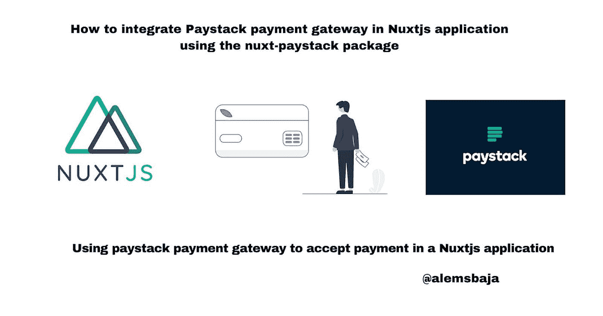

Nuxtjs-paystack

在本文中，我们将了解如何使用 [ECJ222](https://github.com/ECJ222) 的 [Nuxt-paystack](https://www.npmjs.com/package/nuxt-paystack) 包在 Nuxtjs 应用程序中集成 paystack 支付网关

> *Nuxt-Paystack*

Nuxt.js 的 Paystack 支付网关集成

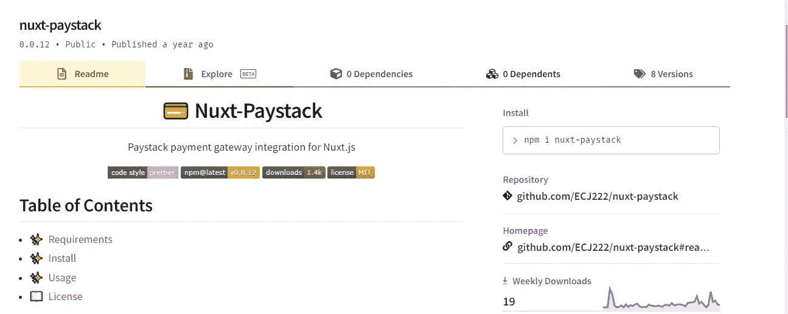

> *要求*

*   npm
*   NuxtJS
*   NodeJS

支付网关使应用程序内的支付变得容易，以完成交易或服务供应。

> *让我们从使用 yarn 创建一个新的 Nuxtjs 项目开始。*

```
yarn create nuxt-app paystack_in_nuxtjs
```

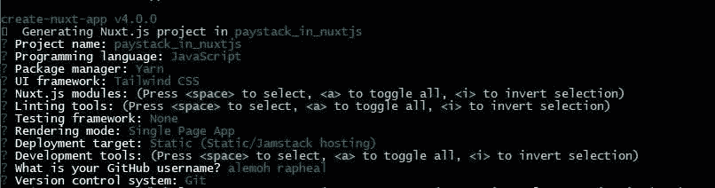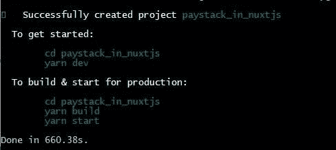

> *让我们使用下面的命令在端口 4500 上提供应用程序*

```
yarn dev --port 4500
```

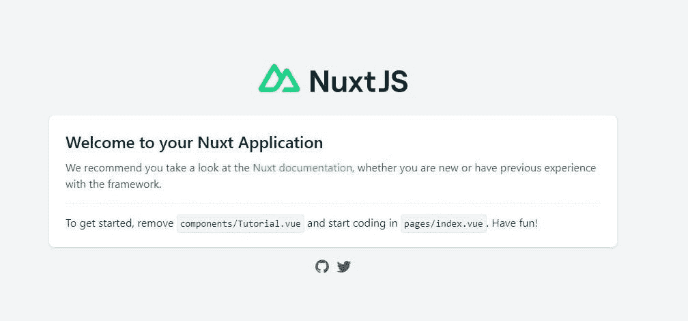

> *让我们添加薪资包*

```
yarn add nuxt-paystack
```

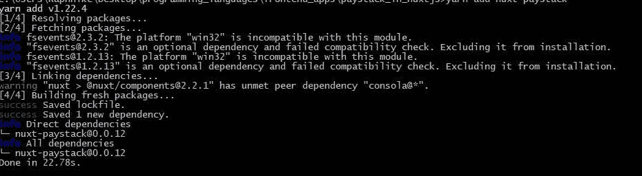

> *将“nuxt-paystack”添加到 nuxt.config.js 文件的模块部分。*

{模块:['nuxt-paystack'] }

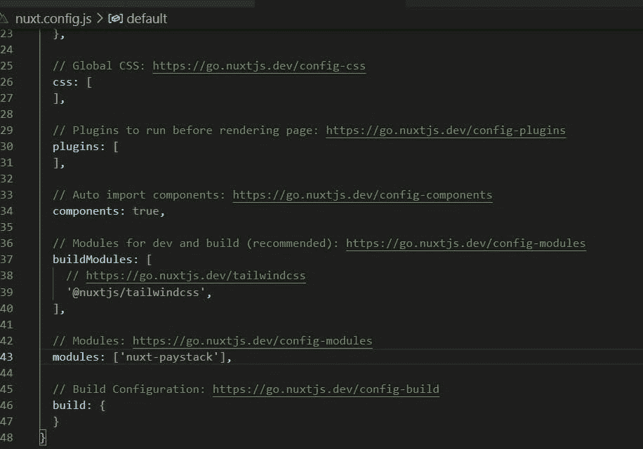

前往 [Paystack](https://paystack.com/) 获取您帐户的公钥，并将其粘贴到配置文件中

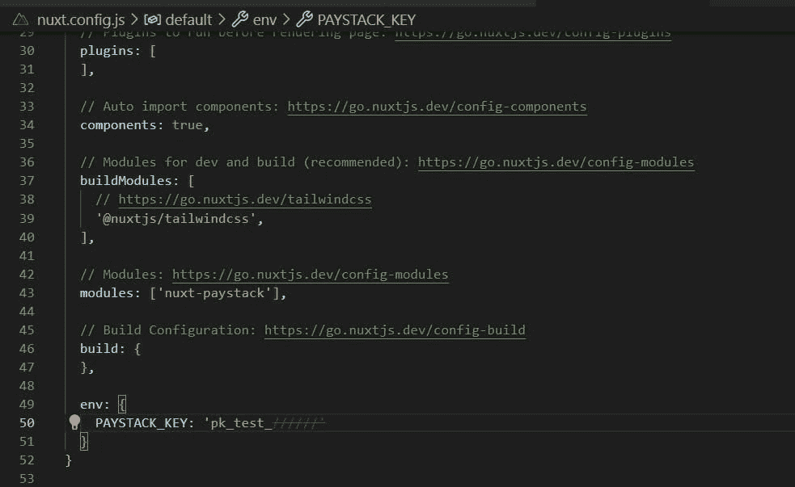

注意:$paystack 是一个函数，它接受一个对象作为它的参数，里面有你的 paystack 细节，关于这个的更多信息，你可以查看[这里](https://paystack.com/docs/payments/accept-payments/#collect-customer-information)。

> *接下来，将 paystack 公钥添加到 nuxt 配置文件中的 env 对象*

```
env: {
    PAYSTACK_KEY: 'pk_test_'
  }
```

**或创建一个 env 文件**

。包封/包围（动词 envelop 的简写）

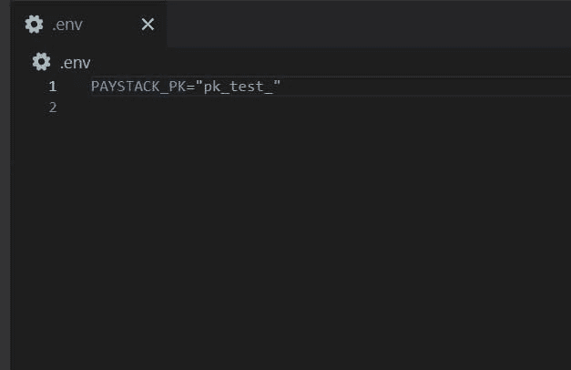

```
env: {
    PAYSTACK_KEY: process.env.PAYSTACK_PK
  }
```

**请注意:**对于生产项目，请忽略 env 文件或隐藏提交到 Git 存储库的凭证。

Tailwindcss 是为这个应用程序测试选择的框架。

一个简单的 Tailwindcss 结帐页面— [Tailwind CSS 简单电子商务结帐页面 UI 示例](https://larainfo.com/blogs/tailwind-css-simple-ecommerce-checkout-page-ui-example)

> *接下来，我们在组件文件夹*中创建一个支付组件***payment . vue***

```
*<template>
  <body>
    ......
              <div class="mt-4">
                <button
                  class="
                    w-full
                    px-6
                    py-2
                    text-blue-200
                    bg-blue-600
                    hover:bg-blue-900
                  "
// on click trigger the payment function 
                  [@click](http://twitter.com/click)="initializePaystack()"
                >
                  Pay Now
                </button>
              </div>
    ......
  </body>
</template><script>
export default {
  methods: {
//use the code below in the methods object section to initialize payment
    initializePaystack() {
//access the paystack key from env file
      var paystack_key = process.env.PAYSTACK_KEY;
      this.$paystack({
        key: paystack_key, // Replace with your public key.
        email: "[paystack_in_nuxtjs@mail.com](mailto:paystack_in_nuxtjs@mail.com)",
//amount value is expected in kobo (charge * 100)
        amount: 1000 * 100,
        ref: "" + Math.floor(Math.random() * 100000000000000 + 1),
        currency: "NGN",
        callback: (res) => {
          console.log(res);
        },
        onClose: () => {
          alert("window cosed");
        },
      });
    },
  },
};
</script>*
```

> **更新索引. vue**

```
*<template>
  <payment />
</template>*
```

> **接下来，保存更改后**

*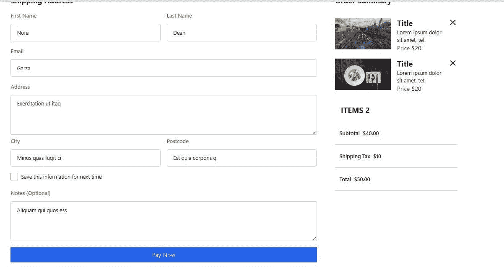*

> **点击立即支付，您将看到 paystack 支付弹出窗口。**

*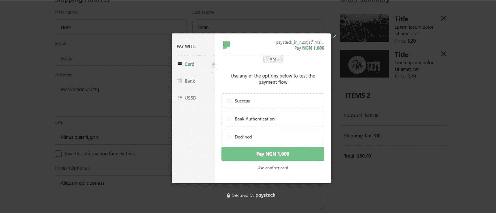*

*点击成功选项和 wala！！！！*

*下面是教程[资源库](https://github.com/RaphAlemoh/paystack_in_nuxtjs)*

*感谢您阅读本文！！！。*

*如果你觉得这篇文章有帮助，请分享给你的网络，并随时使用评论区的问题，答案和贡献。*

**原发布于*[*https://alemsbaja . hashnode . dev*](https://alemsbaja.hashnode.dev/how-to-integrate-paystack-payment-gateway-in-nuxtjs-application-using-the-nuxt-paystack-package)*。**