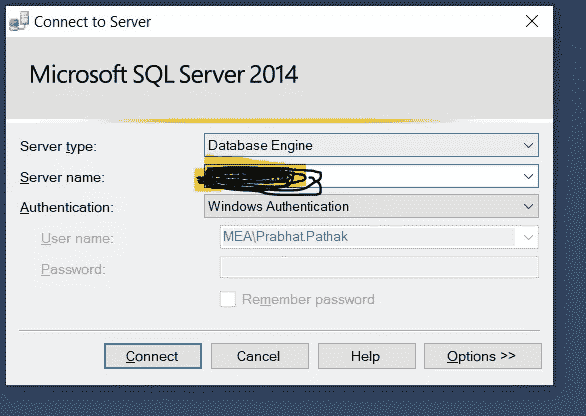
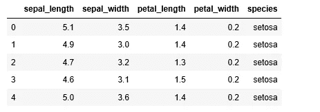
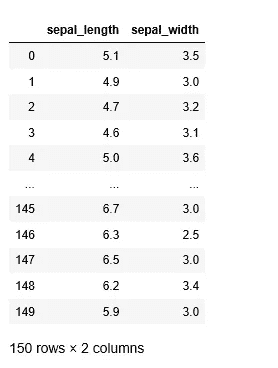
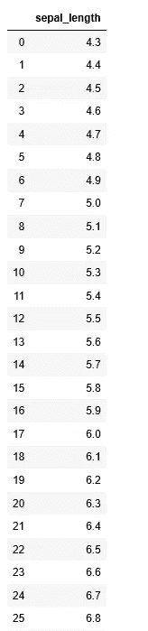

# 如何在 Python 中集成 SQL Server 并运行 SQL 脚本？

> 原文：<https://blog.devgenius.io/how-to-integrate-sql-server-with-python-and-using-sql-script-in-python-a20bcbea6def?source=collection_archive---------1----------------------->

## 在 Python 中使用 SQL 的初学者指南


由 [Unsplash](https://unsplash.com?utm_source=medium&utm_medium=referral) 上的 [Pietro Jeng](https://unsplash.com/@pietrozj?utm_source=medium&utm_medium=referral) 拍摄

作为一名数据科学家/分析师，大多数时候我们需要使用不同的工具来解决我们的业务问题。最常见的情况是，我们需要从一个关系数据库中获取数据，这个关系数据库要么位于您的本地服务器上，要么位于云上的中央数据库中。我们如何从数据库中提取数据，一种方法是通过运行 SQL 脚本来提取数据，并将数据保存在 excel 中，然后将 excel 文件导入 Python。然而，在 Python 中直接使用 SQL 的最有效方式。

## 在开始之前，我们很多人可能想知道什么是 SQL？

SQL 代表结构化查询语言，这是一种用于提取/操作或查询存储在关系数据库管理系统(RDBMS)中的数据的数据库语言。处理这类数据还有其他选择，但 SQL 是业内最流行、最广泛使用的语言。

# SQL 能做什么？

*   对数据库执行查询
*   从数据库中检索数据
*   在数据库中插入记录
*   更新数据库中的记录
*   从数据库中删除记录
*   创建新数据库
*   在数据库中创建新表
*   在数据库中创建视图

# 为什么要在 Python 中使用 SQL？

如您所知，我们需要从数据库中获取数据，一种方法是通过运行 SQL 脚本提取数据，将数据保存在 excel 中，然后将 excel 文件导入 Python。另一种方法是在 Python 中直接使用 SQL 的最有效的方法。

## 在 SQL 和 Python 之间建立联系的库有哪些？

有许多为此开发的库可供使用。在本教程中，我将使用与熊猫集成的 [**Pyodbc**](https://pypi.org/project/pyodbc/) 库。


尼克·莫里森在 [Unsplash](https://unsplash.com?utm_source=medium&utm_medium=referral) 上拍摄的照片

# 装置

要安装 pyodbc 库，请运行下面的代码，该命令会自动下载并安装库

```
pip install pyodbc
```

# 导入必要的库

在这一步中，我们将导入我们将在整个教程中使用的重要库。

```
import pandas as pd
import pyodbc
```

# 快速入门

一旦库被导入，我们需要获得以下细节。

# 检索服务器名称



SQL server 名称

# 获取数据库名称

接下来，获取存储所需表的数据库名称。

# 获取表名

现在，您需要获得存储数据的所需表的名称，然后在收集详细信息后，按以下格式更新详细信息

```
server = 'INxxxxxxxxx' # your local server name 
database = 'xxxxx-old'  # database name that is stored in server
```

创建连接和光标。

```
connection = pyodbc.connect('driver={SQL Server};server=xxxxxxx;database=xxxxxxx')cursor = connection.cursor()
cursor
```

# 使用 SQL 语句的数据查询

现在您已经连接到数据库，您可以提交数据查询了，每个查询中必须存在的两个主要子句是`SELECT`和`FROM`。

**Syntex**

从 *table_name* 中选择 *column1* 、 *column2、…*
；

从数据库获得响应后，我们需要将它放入熊猫数据框中。

```
query='select * from [dbo].[Iris_data]'# To extract all columns x=pd.read_sql(query,connection)
x.head()
```



输出

## 如果我们想要提取一些特定的列，我们可以通过运行下面的代码来实现。

```
query='select sepal_length,sepal_width  from [dbo].[Iris_data]'
pd.read_sql(query,connection)
```



输出

## 如果您想从一列中获得不同的**行，您可以运行以下 SQL 语句:**

```
query='select distinct  sepal_length  from [dbo].[Iris_data]'
pd.read_sql(query,connection)
```



以上语句涵盖了 Python 中 SQL 的基础知识。类似地，你可以编写更多可以在 python 中使用的 SQL 语句，更多 SQL 细节你可以参考这个[链接](https://www.w3schools.com/sql/default.asp)

# 结论。

有许多库可以帮助我们将 SQL 与 Python 进行交互，我相信与多种工具的集成会非常有效，并且会产生惊人的结果。

希望这篇文章能帮到你，给你一个不一样的视角。如果你有任何建议，请告诉我。

快乐学习。

***Prabhat Pathak****(*[*Linkedin 简介*](https://www.linkedin.com/in/prabhat-pathak-029b6466/) *)是助理分析师。*


照片由[元素 5 数码](https://unsplash.com/@element5digital?utm_source=medium&utm_medium=referral)在 [Unsplash](https://unsplash.com?utm_source=medium&utm_medium=referral) 上拍摄